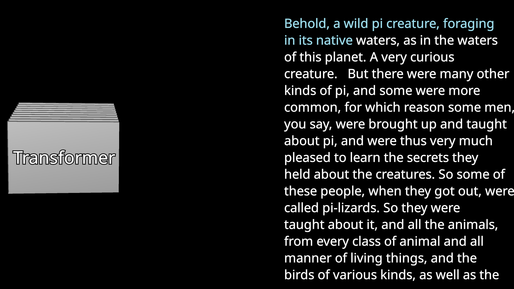
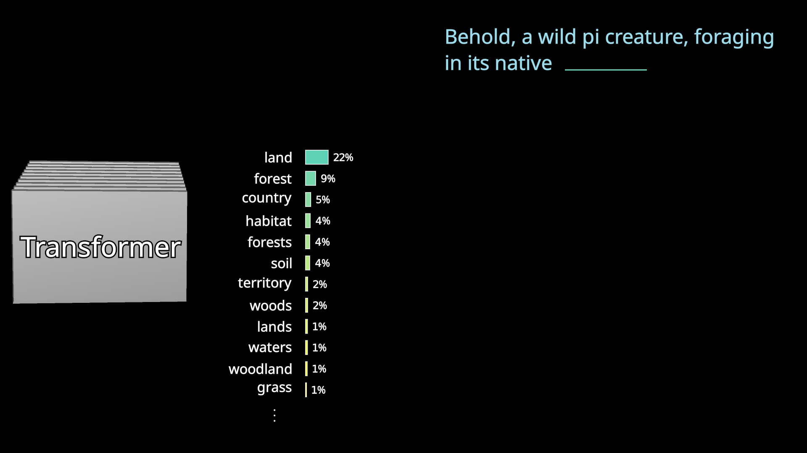
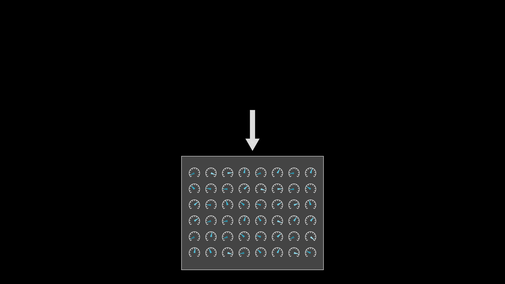
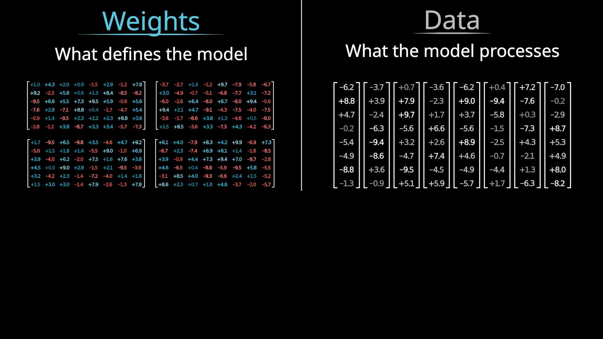
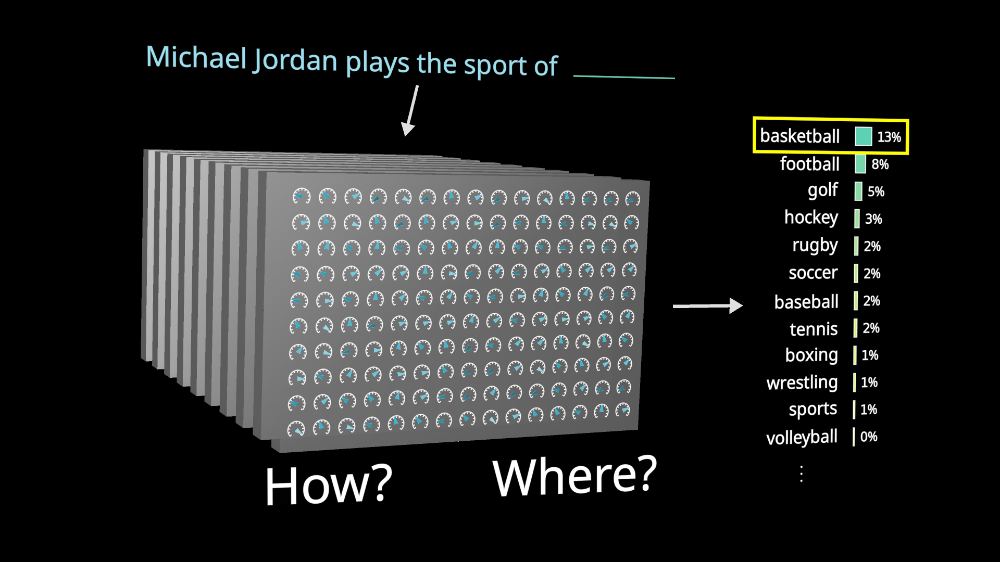

# 第 1 节 · 一台会接话的机器

⏱ 约 10 分钟

---

## 先做一道题

你在旧书堆里翻出一页电影剧本。上面是一个人和他的 AI 助手的对话，人说的话都在，
**AI 的回答被撕掉了**。

现在给你一台机器。这台机器只会做一件事：你喂给它任意一段文字，
它告诉你**下一个词最可能是什么**。

你会怎么把这页剧本补回来？

答案很朴素：把已有的文字喂进去，让它猜下一个词，把猜出来的词接在后面，
再把加长后的文字整个喂进去，再猜下一个……一遍一遍地接龙，直到把 AI 的回答补完。

**这就是你每次跟 ChatGPT 说话时，屏幕背后正在发生的全部事情。**

> 图：一段文字进去，模型逐个词往外吐。每吐一个，就把它接回输入，再吐下一个。
> *（图出自 [3Blue1Brown](https://3blue1brown.com/lessons/mini-llm)，下同）*

---

## 那么，什么是大语言模型

一句话：

> **大语言模型是一个预测下一个词的、非常复杂的数学函数。**

注意两个容易忽略的地方。

**第一，它不给一个确定的答案。** 它给的是**所有可能的词各自一个概率**。
喂进「中国的首都是」，它不是吐出「北京」，而是吐出一整张表：北京 92%、上海 3%、
一个 1%……然后从这张表里**抽签**。

**第二，它抽签的时候，故意不总是选最可能的那个。**

这一点反直觉。既然模型觉得「北京」概率最高，为什么不直接输出「北京」？

因为**全都取最大值，写出来的文字会非常僵硬**。真实的语言里总有一些不那么"标准"
的用词，那些偏离恰恰是自然的来源。所以生成时会按概率随机抽，允许偶尔选一个
不那么可能的词。

这带来一个有意思的后果：

> **模型本身是完全确定的 —— 同样的输入，同样的概率分布。
> 但你每次问同一个问题，得到的回答不一样。**

不确定性不在模型里，在**抽签**这一步。（这个抽签的"手气"可以调，
那个旋钮叫 temperature，第 5 节再说。）

---

## 那"聊天机器人"又是怎么回事

它并没有额外的魔法。做法是这样：

1. 先写一段开场白，描述"这是一段用户与 AI 助手的对话"
2. 把用户输入的话接在后面
3. 让这台机器**反复预测这个假想的 AI 助手接下来会说什么**
4. 把预测出来的文字显示给用户

就这三步。所谓"助手的人格"，本质上是让模型去续写一个**它被告知很有帮助的角色**
说的话。

---

## "大"在哪里

我们说的"大"，指的是**参数**。

把模型想象成一台巨大的机器，机器上密密麻麻全是旋钮。
每个旋钮转到不同位置，机器的行为就不一样。这些旋钮的位置，
就是所谓的参数，也叫权重。

GPT-3 有 **1750 亿**个这样的旋钮。

**关键的一点：没有任何人手动设置过其中任何一个。**

它们一开始是随机的 —— 那时候模型输出的是彻底的乱码。然后：

1. 拿一段真实的文字，把最后一个词遮住
2. 让模型猜
3. 拿它的猜测跟真答案比
4. **微调所有的旋钮**，让真答案的概率高一点点，其它词的概率低一点点

重复这个过程 —— 几万亿次。

神奇的地方在于：这么做下来，模型不只是在训练数据上猜得越来越准，
它在**从没见过的文字**上也变得越来越合理。

> 一个能帮你建立体感的数字：一个人要读完 GPT-3 的训练数据，
> 需要不吃不喝不睡地连读 **2600 多年**。而 GPT-3 之后的模型，
> 用的数据比这多得多。

---

## 两种东西，别混在一起

后面会反复用到一个区分，现在先立住：

| | 是什么 | 什么时候确定 |
|---|---|---|
| **权重**（图里蓝色和红色） | 模型的"脑子"，训练学来的 | 训练结束就固定了 |
| **数据**（图里灰色） | 你这次喂进去的那段文字 | 每次都不同 |

看后面任何一张架构图，第一件事就是分清楚：**哪些是学来的、哪些是流过去的。**

（这个区分在讲显存的时候会变得非常具体：权重是常驻的，数据是流动的，
两者占的显存性质完全不同。那是第二课的事。）

---

## 顺带看一件怪事

这台机器不只会接话，它还**记得住事实**。

你喂给它「Michael Jordan 打的运动是」，它会接「篮球」。
喂「Serena Williams 打的运动是」，它接「网球」。

它显然在某个地方存下了"这个人对应这项运动"这种关联。
**存在哪儿？存成什么样子？**

先记住这个问题。**第 4 节回来回答它。**

---

## 最后：为什么是 Transformer

2017 年之前，主流的语言模型是**一个词一个词地读**的：
读完第一个词，更新一下内部状态，再读第二个词，再更新……

这种做法有个致命问题：**它没法并行**。第 100 个词必须等前 99 个词处理完。

2017 年，Google 的一队研究者提出了 **Transformer**。它最要紧的改变是：

> **不再从头读到尾，而是把整段文字一次全吞进去，所有位置同时处理。**

现在请注意这里发生了什么。Transformer 赢，**不是因为它更聪明，
而是因为它能把活儿摊开给成千上万个计算单元同时干**。

> 🔑 **这是这门课的第一个钩子，也是贯穿始终的一条线：**
>
> **模型架构的选择，从一开始就被硬件的形状塑造着。**
>
> 后面你会一次又一次看到这件事 —— 为什么注意力有那么多变体、
> 为什么 MoE 会流行、为什么大家都在改 KV cache。
> 追到底，答案常常不在数学里，在硬件里。

---

## 这一节记住三句话

1. **LLM 就是一个「猜下一个词」的函数**，输出的是概率分布，不是答案
2. **参数就是旋钮，几千亿个，没人手动设过**，全靠"猜错了就微调"磨出来
3. **Transformer 赢在能并行** —— 架构从诞生那天起就被硬件形状塑造

下一节：这些词是怎么变成机器能算的东西的。

---

> 本节内容改编自 3Blue1Brown 的
> [Large Language Models explained briefly](https://3blue1brown.com/lessons/mini-llm)，
> 图为使用其开源场景代码自行渲染。许可 CC BY-NC-SA 4.0。
