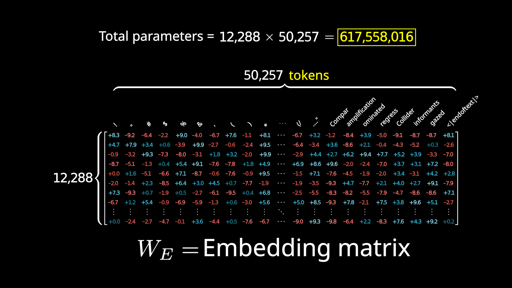
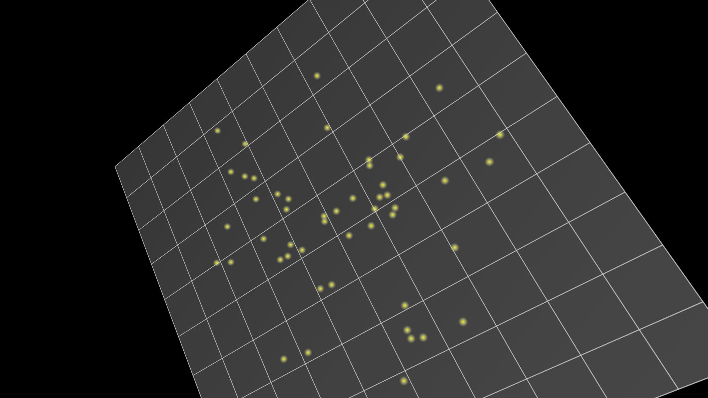
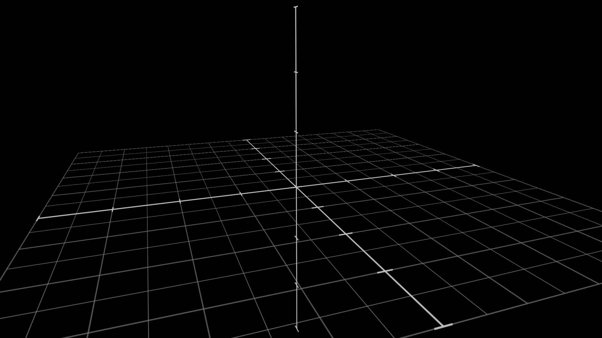
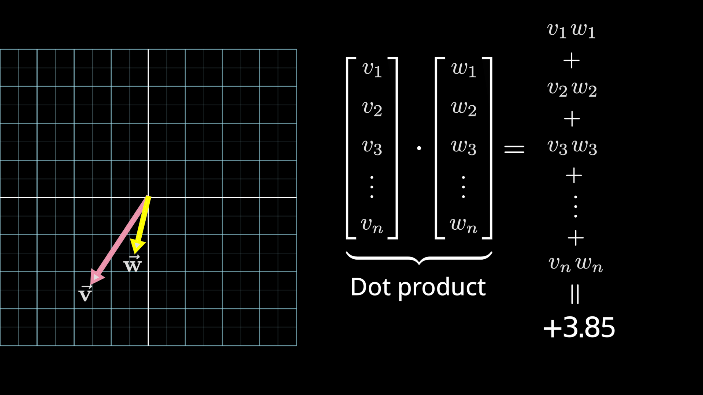

# 第 2 节 · 词变成向量，方向是有含义的

⏱ 约 10 分钟

---

## 一个绕不过去的问题

计算机只会算数。

那「猫」这个字，怎么变成一个能做乘法的东西？

更让人意外的是 —— 变完之后，会出现这样的事：

```
向量(国王) − 向量(男人) + 向量(女人)  ≈  向量(女王)
```

**词之间的加减法居然是有意义的。** 这一节要讲的就是这件事怎么发生的。

---

## 第一步：切碎

文字进模型之前，先被切成一小块一小块，每一块叫一个 **token**。

token 不完全等于词。看这个例子：

```
To| date|,| the| cle|ve|rest| thinker| of| all| time| was
```

注意 *cleverest* 被切成了 `cle|ve|rest` 三块。


**为什么不按字母切？** 那样序列会长得离谱，一句话几百个 token，
后面 attention 的开销是长度的平方，直接爆掉。

**为什么不按单词切？** 那词表就得装下所有词，还有所有的变形、拼写错误、
人名、代码、外文……装不完，而且遇到没见过的词就抓瞎。

BPE 这类分词算法做的就是在两者之间找平衡：**常见的词整块保留，
罕见的词拆成常见的碎片。** 这样词表能控制在几万这个量级，
序列长度也不至于失控。

> 这里有个后面会回来的权衡：**词表越大，嵌入矩阵越大；词表越小，序列越长。**
> 一个吃显存，一个吃计算。这是第一课里第一次出现的"两头都要付钱"的取舍。

---

## 第二步：查表

每个 token 对应一个**向量** —— 就是一串数字。

这个对应关系存在一张巨大的表里，叫**嵌入矩阵**（embedding matrix）。
词表里有多少个 token，它就有多少列。



GPT-3 的数字：词表 **50,257** 个 token，每个向量 **12,288** 维。

所以这张表有 50,257 × 12,288 = **6.18 亿**个数。
这 6.18 亿个数**全都是训练出来的** —— 一开始随机，靠"猜错就微调"磨出来。

这一步纯粹是查表，很便宜。但接下来的事就不那么显然了。

---

## 关键直觉：方向是有含义的

一个 12,288 维的空间没法画出来。但可以切一个三维的切片来看个意思：



训练之后会发生一件很微妙的事：**空间里的某些方向，对应上了某种概念。**

**例子一：性别方向**

把 `向量(woman) − 向量(man)` 算出来，你得到一个方向。
把这个方向加到 `向量(king)` 上，落点会非常接近 `向量(queen)`。

也就是说，模型自己学会了把"性别"编码成空间里的**一个特定方向**。
没人教它这么做，是因为这样组织信息对"猜下一个词"这个任务有利。

（顺带一提：king/queen 这个经典例子其实没那么精确 ——
queen 的真实位置比理论预测的稍微偏一点，因为 queen 这个词在真实语料里
并不只是"女性版的国王"。家族关系词之间的效果反而更干净。）

**例子二：复数方向**

`向量(cats) − 向量(cat)` 是不是一个"复数方向"？验证一下：
拿它去跟一堆名词做**点积**，结果是复数名词的值明显高于单数名词。

更有意思的是，拿它跟 one、two、three、four 做点积，
得到的值**单调递增** —— 就像它在定量地衡量"有多复数"。



> 记住这句话，它在第 4 节还会以更强的形式回来：
> **在这个空间里，一个概念不是某个坐标，而是某个方向。**

---

## 记住这个运算：点积

上面反复用到一个操作 —— **点积**。它是后面所有内容的基础运算，
现在花三十秒把直觉建立起来。



两个向量的点积，衡量的是**它们有多对齐**：

| 两个向量的关系 | 点积 |
|---|---|
| 指向同一个方向 | **正**，越对齐越大 |
| 互相垂直 | **零** |
| 指向相反方向 | **负** |

计算上它就是"对应位置相乘再全加起来"，很便宜。

> **第 3 节整个 attention 机制，核心就是这一个运算。**
> 每一次"这个词该关注哪些词"的判断，底下都是一次点积。

---

## 位置信息：一句话带过

Transformer 一次把整段吞进去、所有位置同时算 —— 这是它的优点，
但也带来一个副作用：

**它天生看不见顺序。** 「狗咬人」和「人咬狗」在它眼里的输入是一样的一堆向量。

所以必须额外把位置信息告诉它。做法经历过几代演化，
现在的主流叫 **RoPE**（旋转位置编码），它编码的是**相对距离**而不是绝对位置。

细节这一课不展开，只要知道：**位置是额外补进去的，不是白送的。**

---

## 这一步结束时，模型知道什么

现在每个 token 都变成了一个向量。但请注意一件重要的事：

> **每个向量此刻只知道自己。**

它是从表里查出来的，跟旁边有什么词毫无关系。
「bank」这个 token 查出来的向量，无论它旁边是「river」还是「money」，
**完全一样**。

这显然不够。让这些向量互相认识、根据上下文修正自己 ——
那是下一节的事。

---

## 这一节记住三句话

1. **文字先切成 token 再查表变向量**，词表大小是个"一头吃显存一头吃计算"的权衡
2. **方向是有含义的** —— 概念被编码成空间里的方向，不是坐标
3. **点积衡量对齐程度** —— 记住它，attention 全靠这一个运算

下一节：让这些向量互相通气。

---

> 本节内容改编自 3Blue1Brown
> [Transformers, the tech behind LLMs](https://3blue1brown.com/lessons/gpt)，
> 图为使用其开源场景代码自行渲染。许可 CC BY-NC-SA 4.0。
