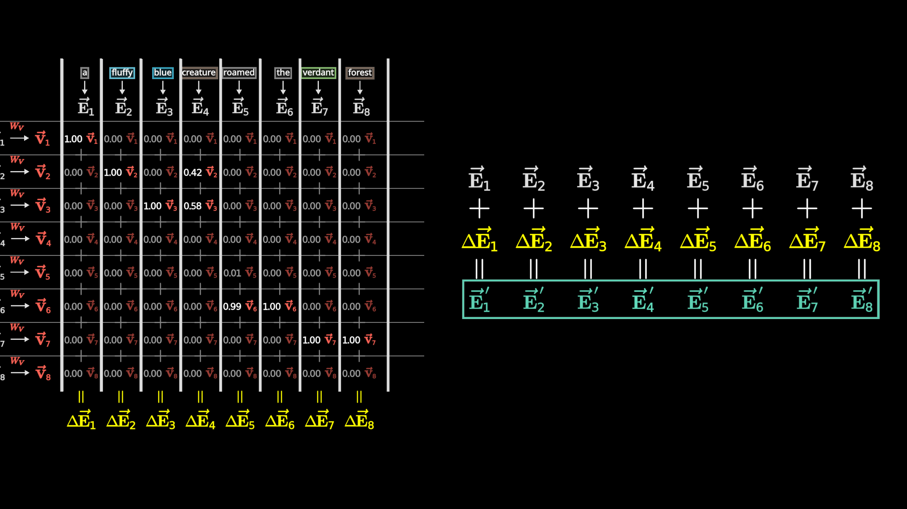
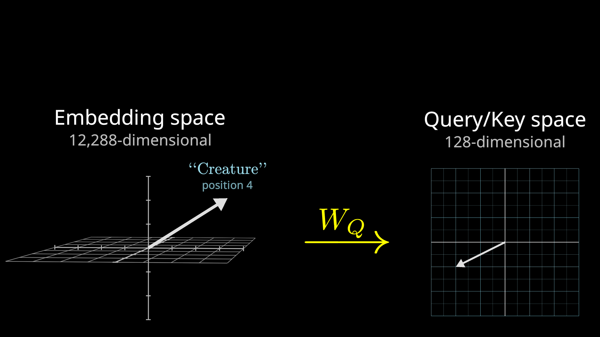
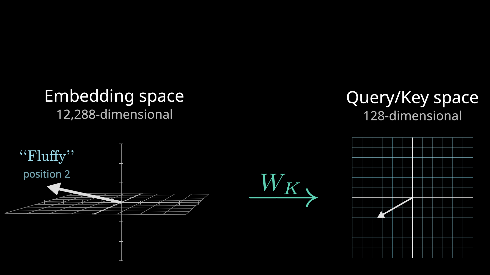
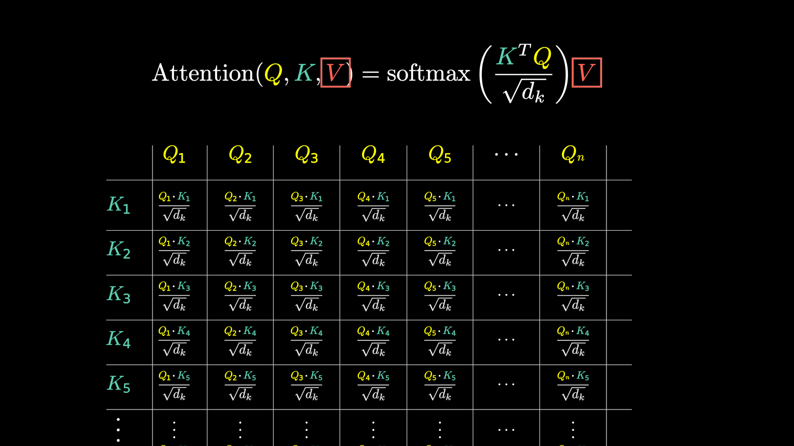
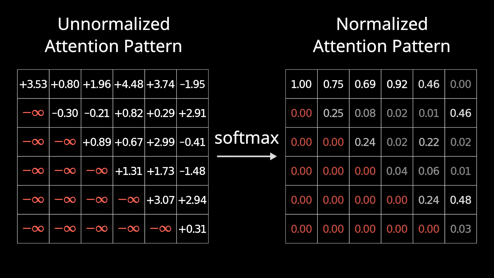

# 第 3 节 · Attention：让词互相通气

⏱ 约 15 分钟

---

## 上一节留下的窟窿

「bank」这个词，放在这两句话里：

> I sat on the river **bank**.
> I went to the **bank** to withdraw money.

是同一个意思吗？显然不是。

但上一节结束时，模型手里那个 bank 的向量，**两句话里一模一样** ——
它是从表里查出来的，跟上下文没有任何关系。

这就是 Attention 要解决的问题：

> **一个词的含义，是由它周围的词决定的。
> 得让这些向量互相看一眼，然后各自修正自己。**

---

## 先看结果长什么样

这是 attention 在一句话上实际算出来的东西。句子是：

> a fluffy blue creature roamed the verdant forest

左边那个大网格是**注意力权重**：第 4 列（creature）在第 2 行（fluffy）上是 **0.42**，
在第 3 行（blue）上是 **0.58** —— 意思是「creature 这个位置，
应该主要从 fluffy 和 blue 这两个词那里吸收信息」。

右边是结果：每个原始向量 E 加上一个增量 ΔE，得到更新后的 E′。

**这就是 attention 的全部输出：一堆增量。** 它不产生新东西，
它决定"谁该从谁那里拿多少信息"，然后把拿到的东西加回去。

现在我们把这张图是怎么算出来的拆开。

---

## 三个矩阵：一个招聘的比喻

每个位置的向量，会被三个不同的矩阵各乘一次，变出三个新向量：

| 名字 | 记号 | 用招聘打比方 |
|---|---|---|
| **Query**（查询） | Q | 「我这个岗位在找什么样的人？」 |
| **Key**（键） | K | 「我是什么样的人？」 |
| **Value**（值） | V | 「如果配上了，我能交给你什么？」 |

这个比喻会一路用到底，不换。

### Query：我在找什么

拿 creature 这个位置举例。它的 Query 向量，可以理解成在问：

> 「我是个名词。**有没有形容词在描述我？**」

注意：**这个"问题"不是人写的**，是 `W_Q` 这个矩阵里的参数学出来的。
研究者并没有指定"第 3 个头负责找形容词"，那是训练涌现的结果。

### Key：我是什么

同时，每个位置也用另一个矩阵算出一个 Key 向量，相当于在回答：

> 「我是一个形容词。」

### 配对：又是点积

现在把每个 Query 和每个 Key 做**点积** —— 就是上一节那个运算。

- 点积大 → 这个 Key 很好地回答了这个 Query → **相关**
- 点积小或为负 → 不相关

于是得到一个网格：每个位置对每个位置的相关度。

再对每一列做 **softmax**，把这些数变成加起来等于 1 的权重 ——
这就是上面那张大图左边的网格。

### Value：拿什么回来

有了权重，最后一步：每个位置的 Value 向量按权重加权求和，
得到那个增量 ΔE，加回原向量。

creature 那一列的 0.42 和 0.58，意思就是：
**它最终的 Δ，是 42% 的「fluffy 交出来的东西」加 58% 的「blue 交出来的东西」。**

---

## 那条著名的公式

把上面四步写成一行，就是那条你在无数论文里见过的式子：

$$\text{Attention}(Q,K,V) = \text{softmax}\!\left(\frac{QK^\top}{\sqrt{d_k}}\right)V$$

逐项对照一下，没有一项是新的：

| 这一项 | 就是刚才的 |
|---|---|
| $QK^\top$ | 每个 Query 跟每个 Key 做点积 |
| $\div \sqrt{d_k}$ | 除以维度的平方根，防止数值太大让 softmax 饱和 |
| $\text{softmax}$ | 把相关度变成加起来为 1 的权重 |
| $\times V$ | 按权重把 Value 加权求和 |

**整条公式没有一个"聪明"的部件，全是点积、缩放、归一化、加权求和。**

---

## 一条铁律：不许偷看未来

训练的时候，模型是拿一整句话同时算的 —— 这正是 Transformer 能并行的原因。

但这里有个陷阱：如果让第 3 个词看得见第 5 个词，那"预测下一个词"这件事
就变成了抄答案，训练出来的模型上线后什么都不会。

所以要**遮住**：每个位置只允许看它自己和它前面的位置。

做法很直接：把网格的右上三角在 softmax 之前设成负无穷，
softmax 之后它们就变成 0。

> 这叫 **causal mask**（因果掩码）。
> 它是"一次算完整句"和"必须逐个预测"之间的那个调和。

---

## 多头：一次问很多个问题

上面讲的是**一个头**。但一句话里要捕捉的关系远不止一种：

- 形容词在修饰哪个名词
- 代词指的是前面哪个人
- 这个动词的宾语是谁
- 这句话的情绪基调是什么

一个头只能问一个问题。所以真实模型里会并排放很多个头，
**每个头有自己独立的 Q / K / V 矩阵，问自己的问题**，最后把结果拼起来。

GPT-3：每层 **96 个头**，一共 **96 层**。

---

## 最要紧的一句话

Attention 这一步，**不产生任何新知识**。

它做的全部事情是：**把已有的信息在不同位置之间搬运和路由**。
决定谁该看谁，然后把看到的东西加回去。

那模型"知道的事情"存在哪儿呢？

在旁边那个部件里 —— **下一节。**

---

## 这一节记住三句话

1. **Q / K / V 是三个学出来的矩阵**：我在找什么、我是什么、我能给什么
2. **整条 attention 公式没有魔法**：点积 → 缩放 → softmax → 加权求和
3. **Attention 只搬运信息，不存储知识**

---

> 本节内容改编自 3Blue1Brown
> [Attention in transformers, step-by-step](https://3blue1brown.com/lessons/attention)，
> 图为使用其开源场景代码自行渲染。许可 CC BY-NC-SA 4.0。
