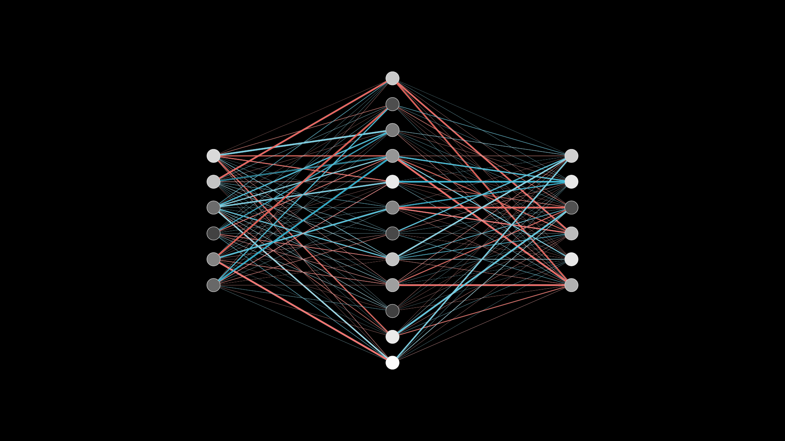
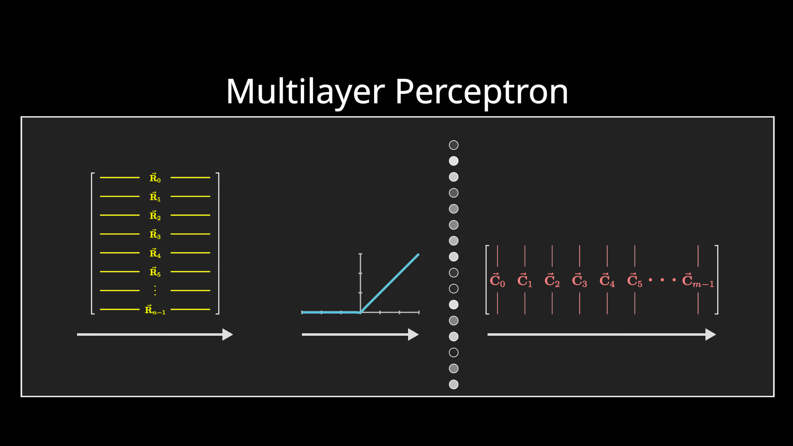
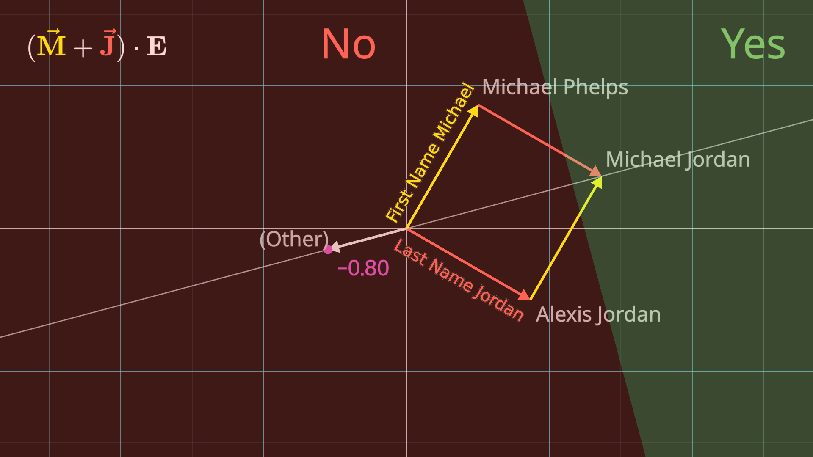
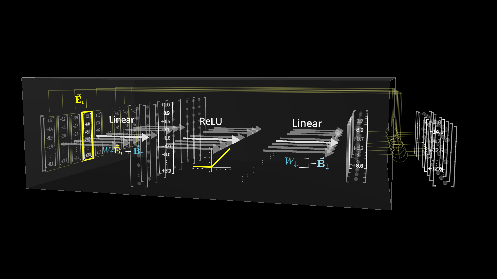
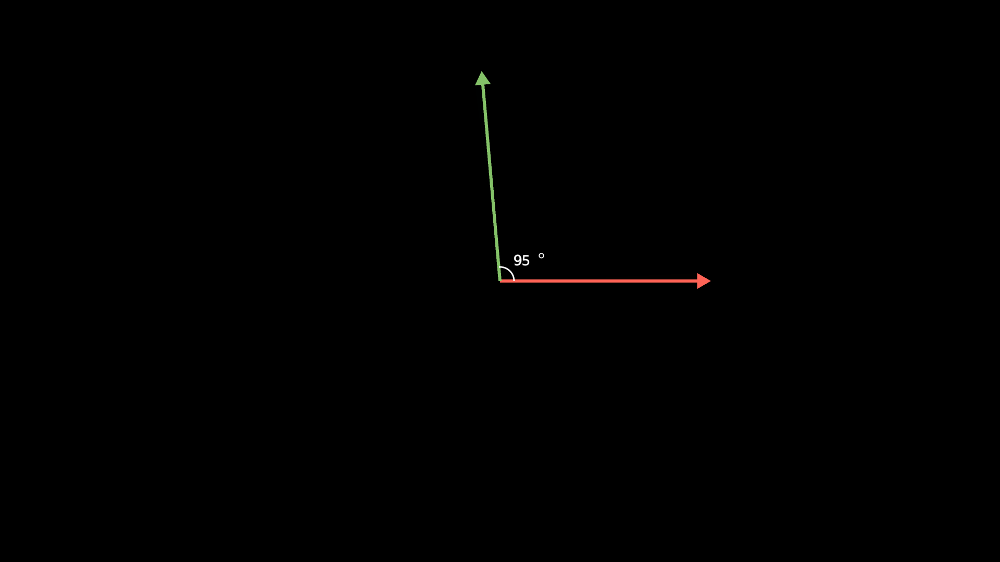
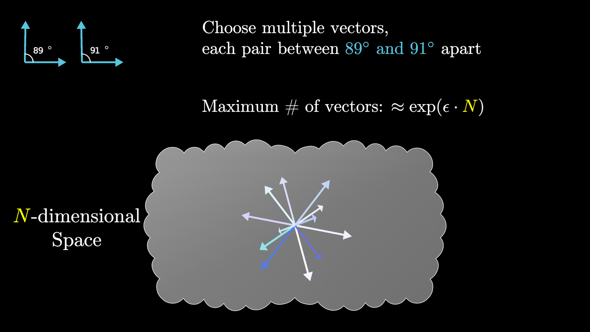

# 第 4 节 · MLP：事实存在这里

⏱ 约 15 分钟

---

## 回到第 1 节那个问题

你问模型「Michael Jordan 打什么球」，它答「篮球」。

这条知识 —— **一个具体的人对应一项具体的运动** ——
在那 1750 亿个数字里，**具体存在哪儿？存成什么样子？**

2023 年 12 月，Google DeepMind 的几位研究者拿这个例子做过一项工作。
完整的机制还没完全搞清楚，但有一个高层结论是明确的：

> **事实主要存在一个叫「多层感知机」（MLP）的部件里。**

这一节就来拆它。

---

## 先说它跟 Attention 有多不一样

| | Attention | MLP |
|---|---|---|
| 向量之间 | **互相通气** | **完全不通气，各走各的** |
| 在干什么 | 搬运信息 | 存放并检索事实 |
| 计算形状 | 长度的平方项 | 一堆独立的矩阵乘 |

第二行是关键：**MLP 里每个位置的向量完全独立地走完全程，互不影响。**

这让它比 attention 好理解得多 —— **搞懂一个向量发生了什么，
就等于搞懂了全部。**

图里的形状值得记住：**中间那层比两头宽得多**（GPT-3 里是 4 倍宽）。
这个"先胖后瘦"的形状是 MLP 的招牌。

---

## 三步走

一个向量进来，做三件事，出去一个同样维度的向量，加回原来的向量上。

1. **升维**：乘一个高高的矩阵（记作 $W_\uparrow$），维度变成 4 倍
2. **非线性**：过一个很简单的函数（ReLU）
3. **降维**：乘一个宽宽的矩阵（记作 $W_\downarrow$），维度变回来

就这三步。矩阵乘、一个简单函数、再矩阵乘。**结构上简单得令人失望。**

难的是理解它在干什么。

---

## 一个事实是怎么被存进两个矩阵的

现在用 Michael Jordan 走一遍。

先做个假设（后面会推翻它，但它是理解的必经之路）：
假设这个高维空间里，有一个方向代表"名叫 Michael"，
另一个方向代表"姓 Jordan"，还有一个方向代表"篮球"。

### 第一步：升维矩阵在提问

矩阵乘法可以这样理解：**把矩阵的每一行看成一个向量，
跟输入向量做点积。**（又是点积。）

假设升维矩阵的第一行，恰好就是「名叫 Michael」+「姓 Jordan」这个方向。
那么这一行跟输入做点积，结果是：

- 输入编码的是完整的 Michael Jordan → 点积 = **2**
- 只是 Michael Phelps → 点积 = **1**
- 完全无关 → 点积 ≈ **0 或负数**

再加上一个学出来的偏置 **−1**，结果变成：

| 输入 | 点积 | 加偏置后 |
|---|---|---|
| Michael Jordan | 2 | **+1** |
| Michael Phelps | 1 | 0 |
| Alexis Jordan | 1 | 0 |
| 无关 | ≤0 | 负数 |

**只有完整的 Michael Jordan 才是正数。** 偏置那个 −1 就是干这个用的。

矩阵有多少行，就相当于在同时问多少个这样的问题。
GPT-3 是 **49,152 行**（正好是 12,288 的 4 倍 —— 没什么深刻原因，
**取个整倍数对硬件友好**）。

### 第二步：ReLU 把它变成一个干脆的"是"

问题在于，到这里为止全是线性运算。而语言不是线性的 ——
我们要的是一个**干脆的是或否**，不是"有点像 Michael Jordan"。

ReLU 就干这个：**负数一律压成 0，正数原样通过。**

于是刚才那张表变成：只有 Michael Jordan 输出 1，其它全是 0。

> **这本质上是一个 AND 门**：名叫 Michael **并且** 姓 Jordan，才点亮。

顺带说一句术语：**人们说 Transformer 的"神经元"，指的就是 ReLU 之后的这些值。**
正数叫"激活"，零叫"不激活"。

（现代模型多用 GELU 或 SwiGLU 而不是 ReLU —— 形状差不多但更平滑，
理解的时候当 ReLU 想就行。）

### 第三步：降维矩阵在回答

第三步换个角度看矩阵乘法：这次把矩阵的**每一列**看成空间里的一个方向。
输出 = 所有列按对应神经元的激活值加权求和。

假设降维矩阵的第一列，恰好就是「篮球」这个方向。那么：

- 那个神经元被点亮（=1）→ 「篮球」这个方向被加进结果
- 没点亮（=0）→ 什么也不加

**这就完了。** 一个事实的存储与检索，就是：
**升维矩阵的一行负责问，降维矩阵的对应列负责答。**

而且那一列不必只装"篮球"，它可以同时把「芝加哥公牛」「23 号」
一起打包加进去 —— 所有跟这个人绑定的东西。

---

## ⚠️ 但真实模型不是这样的

上面这个故事很干净，干净到有点可疑。

**证据表明：单个神经元几乎从不对应一个干净的概念。**

原因很有意思，跟高维空间的一个性质有关。

### 先问一个几何问题

在一个 N 维空间里，你最多能放几个**互相垂直**的方向？

答案是 **N 个**。这是"维度"这个词的定义。

那如果放宽一点呢 —— 不要求严格 90 度，**89 度到 91 度之间也算**？

在低维空间里，这点松动没什么用，多不了几个。
但在高维空间里，答案发生了戏剧性的变化：

> **能塞进去的方向数量，随维度呈指数增长。**

这是 **Johnson-Lindenstrauss 引理**的一个推论。

给几个具体的数（85 度容差，也就是允许点积到 0.087）：

| 维度 | 能塞下多少个近似垂直的方向 |
|---|---|
| 12,288（GPT-3 的嵌入维度） | **400 亿以上** |
| 116,000（更大的模型量级） | **超过 10 的 100 次方** |

### 于是：叠加

模型完全可以利用这一点。它存的概念数量，
**远远超过它的维度数**。代价是这些方向不再严格垂直，会有一点点互相干扰 ——
但显然这笔买卖很划算。

后果是：

> **一个特征不是"某个神经元亮了"，而是"一组神经元以某种特定组合亮了"。**
>
> 这个现象叫**叠加**（superposition）。

### 这一条同时解释了两件事

**① 为什么模型这么难解释。** 你去看某个神经元，
会发现它对一堆毫不相干的东西都有反应 —— 因为它同时参与了很多个特征的编码。

**② 为什么把模型放大，收益这么大。**
维度翻 10 倍，能装的独立概念**远远不止**翻 10 倍。
这可能是"模型越大越强"这件事背后的一个机制性解释。

---

## 参数都在这儿

顺便把账记上，第 5 节要用：

| | 算法 | 参数 |
|---|---|---|
| 升维矩阵 $W_\uparrow$ | 49,152 × 12,288 | 6.04 亿 |
| 降维矩阵 $W_\downarrow$ | 12,288 × 49,152 | 6.04 亿 |
| **每层合计** | | **约 12 亿** |
| **96 层合计** | | **约 1160 亿** |

**1160 亿。占 GPT-3 全部参数的三分之二。**

---

## 一句话总结这两节

> **关联在 Attention，记忆在 MLP。**

Attention 决定"在这句话里该看哪里"，MLP 存着"这个世界是什么样的"。

一个负责路由，一个负责查表。模型的智能，就长在这两件事的反复交替里 ——
attention、MLP、attention、MLP……GPT-3 里这样交替 96 次。

（可解释性研究这些年做得远比这里讲的深 ——
比如已经能定位出实现"上下文学习"的具体电路。那些留给专门的一课。）

---

## 这一节记住三句话

1. **MLP 三步**：升维提问 → ReLU 变成是否 → 降维作答。本质是一堆 AND 门
2. **但特征不是神经元，是方向的组合** —— 高维空间能塞下指数多个近似垂直的方向
3. **三分之二的参数在 MLP 里**，这就是模型"记得多少"的物理上限

下一节：把账算完。

---

> 本节内容改编自 3Blue1Brown
> [How might LLMs store facts](https://3blue1brown.com/lessons/mlp)，
> 图为使用其开源场景代码自行渲染。许可 CC BY-NC-SA 4.0。
