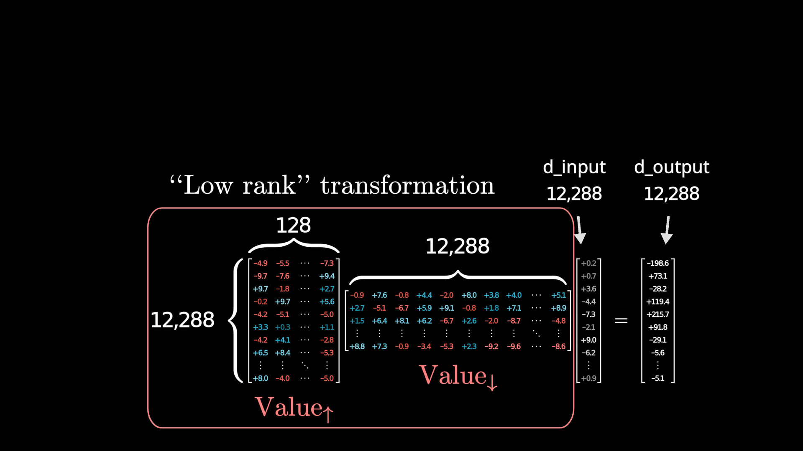
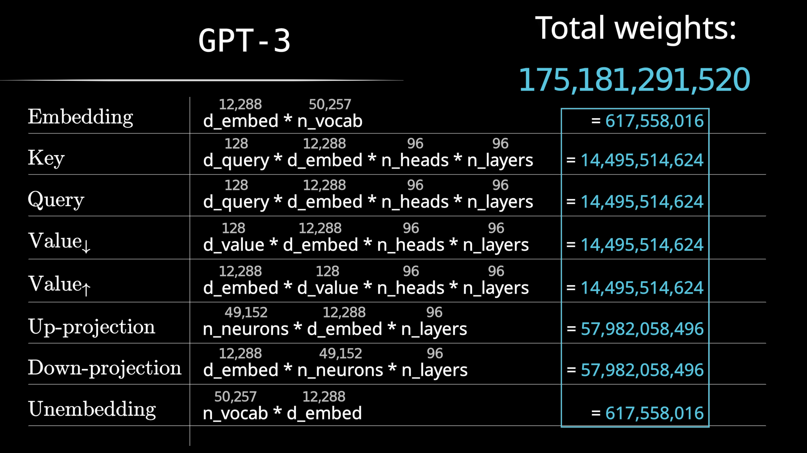
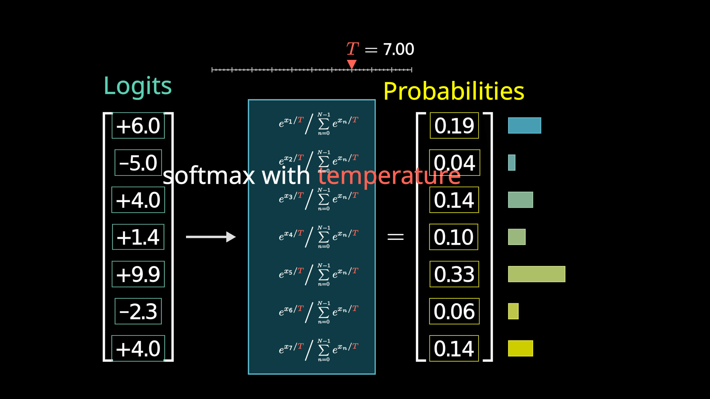

# 第 5 节 · 一千七百五十亿是怎么摞出来的

⏱ 约 10 分钟

---

## 先猜一个

零件都看完了。现在数一数，参数都堆在哪儿。

**在往下看之前，先猜一下：Attention 和 MLP，哪个参数更多？多多少？**

大多数人的直觉是 attention —— 毕竟它是 Transformer 的招牌，
论文标题就叫《Attention Is All You Need》，讲解也总是围着它转。

---

## 逐个部件数

### 嵌入与反嵌入

**嵌入矩阵** $W_E$：词表 50,257 × 维度 12,288 = **617,558,016**

模型末尾还有一个反过来的矩阵，把最后那个向量映射回词表大小，
好过 softmax 出概率。**反嵌入矩阵** $W_U$ 形状正好转置过来，参数量一样：
**约 6.18 亿**。

两个加起来约 12 亿 —— 听着不少，但在 1750 亿里只占 **0.7%**。

### Attention

一个头有 Q、K、V 三组矩阵（V 那组实际拆成低秩的两块，
参数量跟 Q、K 对齐）。GPT-3 的 Q、K 各是 12,288 × 128，
四个矩阵加起来 **约 630 万**。

- 一个头：630 万
- 一层 96 个头：**约 6 亿**
- 96 层：**约 580 亿**

### MLP

上一节已经算过：

- 一层：升维 6.04 亿 + 降维 6.04 亿 = **约 12 亿**
- 96 层：**约 1160 亿**

---

## 结果

| 部件 | 参数量 | 占比 |
|---|---|---|
| 嵌入矩阵 | 6.18 亿 | 0.35% |
| 反嵌入矩阵 | 6.18 亿 | 0.35% |
| **Attention（全部）** | **约 580 亿** | **约 33%** |
| **MLP（全部）** | **约 1160 亿** | **约 66%** |
| **合计** | **约 1750 亿** | |

### 反直觉一：大头在 MLP

**MLP 的参数是 Attention 的两倍。**

用 Grant Sanderson 的说法：

> **Attention 得到了所有的注意力，但大多数参数在它旁边那些块里。**

### 反直觉二：那 1160 亿正是"事实"存放的地方

第 4 节和这一节在这里合上了。

那三分之二的参数不是抽象的"模型容量" ——
它就是**模型记得住多少东西**的物理上限。

顺着这条线还能理解一件事：为什么现在的大模型都在做 MoE（混合专家）？
因为**被稀疏化的正是 MLP**。既然大头在这儿，
而且它天然就是"一大堆彼此独立的问题"，那就没必要每个 token 都过全部 ——
挑几个相关的专家过一下就行。

（MoE 怎么做、路由怎么选、负载怎么均衡，是单独一课的内容。）

---

## 最后一步：变回文字

模型末尾：最后一个位置的向量 → 乘反嵌入矩阵 → 得到词表长度的一串数
（这串数叫 **logits**）→ 过 **softmax** 变成概率分布。

softmax 做的事：把任意一串数变成"全都在 0 到 1 之间、加起来等于 1"。
做法是先取指数（保证为正），再除以总和（保证和为 1）。

它叫 **soft**max 而不是 max，是因为它不是简单挑出最大的那个，
而是给所有较大的值都分一点权重。

**温度**就是在指数里塞的一个常数 T：

| T | 效果 |
|---|---|
| 大 | 分布变平，低概率的词也有机会 —— 更"有创意"，也更容易胡说 |
| 小 | 大的更大，分布变尖 —— 更保守 |
| = 0 | 全部权重给最大值，退化成确定性输出 |

这就闭上了第 1 节那个环：**模型是确定的，随机性来自这里的抽签。**

---

## 现在，把这些数字翻译成硬件

一小时的课到这里，模型这边讲完了。最后花两分钟，把账换一种单位来算。

**1750 亿个参数，每个用 bfloat16 存，占 2 字节。**

$$175{,}000{,}000{,}000 \times 2\ \text{字节} = 350\ \text{GB}$$

**光是权重，350 GB。** 而这还只是推理要装的东西。

训练还要更多：优化器要为每个参数存额外的状态。
按常见的配法（fp32 主权重 + 一阶动量 + 二阶动量），大约 **12 字节/参数**：

$$175{,}000{,}000{,}000 \times 12\ \text{字节} \approx 2.1\ \text{TB}$$

而一块 TPU v7 的**一个 device**，能用的高带宽内存约 **94.74 GB**。

> ### 于是这一课的最后一个问题
>
> **光是把它放下，就需要几十个 device。**
>
> 一台机器装不下，就必须切开；一切开，机器之间就得通信；
> 一通信，通信本身就可能比计算还慢。
>
> **那这笔账到底该怎么算？** → **第二课**

还有一个数，用来建立对"训练"这件事的体感（3Blue1Brown 的原话）：

> 假设你每秒能做 **10 亿次**加法和乘法 —— 那么完成训练最大的那些语言模型
> 所需要的全部运算，你要花 **一亿年以上**。

---

## 第一课总结

五节，五句话：

1. **LLM 是一个猜下一个词的函数**，参数是几千亿个没人手动设过的旋钮；
   Transformer 赢在能并行 —— **架构从一开始就被硬件形状塑造着**
2. **词变成向量之后，方向是有含义的**；点积衡量对齐，是后面一切的基础运算
3. **Attention 让向量互相通气** —— Q 问、K 答、V 交付；它只搬运信息，不存储知识
4. **MLP 存事实** —— 升维提问、ReLU 判是否、降维作答；
   但特征是方向的组合不是单个神经元（叠加），这解释了模型为什么难解释、
   以及为什么放大收益这么大
5. **三分之二的参数在 MLP 里**；1750 亿参数 = 350 GB 权重 = 装不进任何一块卡

---

## 课后练习

三道，都不需要加速器。

**1（纸笔）** 假设一个模型词表 128,000、嵌入维度 4,096、共 32 层，
每层 MLP 中间宽度是 4 倍。手算：嵌入矩阵多少参数？全部 MLP 多少参数？
后者是前者的多少倍？

**2（十行代码）** 跑一个现成的小模型，把下一个词的概率分布打印出来。
把 temperature 从 0 调到 2，观察分布怎么变、生成的文字怎么变。

**3（观察）** 找一句有歧义的话（bank、model、light 之类），
换不同的上下文，看模型对下一个词的预测怎么变 ——
**你正在亲眼看见 attention 在起作用。**

> 想动手把这些零件全写一遍的，去 Stanford CS336 Assignment 1 的 Section 3：
> Linear、Embedding、RMSNorm、SwiGLU、RoPE、Attention 逐个手写，
> 有完整测试套件判分。讲义里说，参考实现在一台 M4 Max 笔记本上
> **不到 5 分钟**就能训出一个会讲儿童故事的小模型。

---

> 本节内容改编自 3Blue1Brown 的
> [Ch5](https://3blue1brown.com/lessons/gpt) / [Ch6](https://3blue1brown.com/lessons/attention) /
> [Ch7](https://3blue1brown.com/lessons/mlp)，图为使用其开源场景代码自行渲染。
> 350 GB 与 2.1 TB 两个数字是我们自己按常见配法估算的，不是原文内容。
> 许可 CC BY-NC-SA 4.0。
