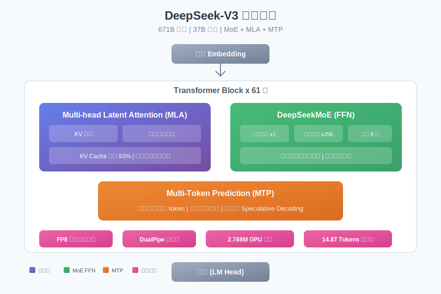
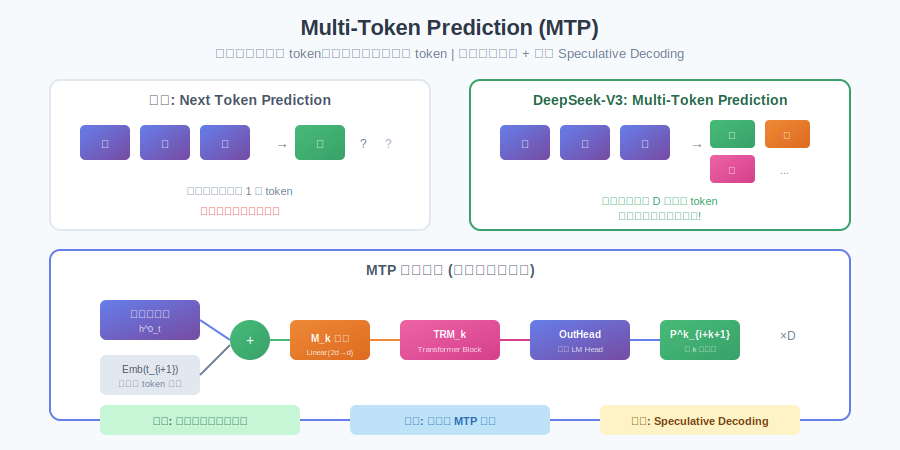
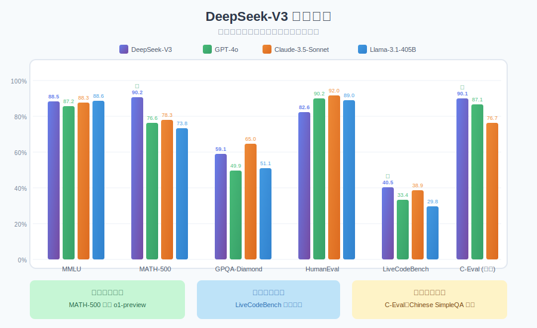

# DeepSeek-V3 论文通俗解读

> **论文标题**: DeepSeek-V3 Technical Report  
> **发表于**: arXiv 2024年12月  
> **作者**: DeepSeek-AI 团队（200+ 作者）  
> **论文链接**: [arXiv:2412.19437](https://arxiv.org/abs/2412.19437)  
> **一句话总结**: 671B 参数的 MoE 模型，每个 token 只激活 37B，性能媲美 GPT-4o，**训练成本仅 557 万美元**！

---

## 目录

1. [这篇论文在讲什么？](#1-这篇论文在讲什么)
2. [为什么这篇论文很重要？](#2-为什么这篇论文很重要)
3. [核心架构创新](#3-核心架构创新)
   - [Multi-head Latent Attention (MLA)](#31-multi-head-latent-attention-mla)
   - [DeepSeekMoE + 无辅助损失负载均衡](#32-deepseekmoe--无辅助损失负载均衡)
   - [Multi-Token Prediction (MTP)](#33-multi-token-prediction-mtp)
4. [训练基础设施](#4-训练基础设施)
   - [FP8 混合精度训练](#41-fp8-混合精度训练)
   - [DualPipe 流水线并行](#42-dualpipe-流水线并行)
5. [训练过程](#5-训练过程)
6. [后训练: R1 知识蒸馏](#6-后训练-r1-知识蒸馏)
7. [性能表现](#7-性能表现)
8. [训练成本分析](#8-训练成本分析)
9. [示例代码](#9-示例代码)
10. [总结与思考](#10-总结与思考)

---

## 1. 这篇论文在讲什么？

### 用一个比喻来解释

想象你要建一个有 **671 个专家**的咨询公司。

- **传统做法**: 每个问题都让所有专家一起开会讨论（计算量巨大）
- **DeepSeek 的做法**: 设立一个智能前台，每个问题只派 **8 个最相关的专家**处理，其他人继续休息

结果呢？**处理速度快了 18 倍，质量还一样好**！

### 论文的核心贡献

1. **MLA 注意力机制**: KV Cache 减少 93%，推理内存大幅降低
2. **无辅助损失负载均衡**: 专家分配更均衡，模型性能更好
3. **Multi-Token Prediction**: 一次预测多个 token，数据效率更高
4. **FP8 混合精度训练**: 首次在超大规模模型验证 FP8 训练可行性
5. **极致性价比**: 2.788M GPU 小时完成全部训练



### 模型规格一览

| 参数 | 数值 |
|------|------|
| 总参数量 | **671B** |
| 激活参数 | **37B** / token |
| 架构类型 | MoE (Mixture of Experts) |
| 层数 | 61 层 |
| 隐藏维度 | 7168 |
| 注意力头数 | 128 |
| KV 压缩维度 | 512 |
| 路由专家数 | 256 |
| 共享专家数 | 1 |
| 激活专家数 | 8 |
| 上下文长度 | 128K |

---

## 2. 为什么这篇论文很重要？

### 开源 vs 闭源的差距被抹平

| 方面 | DeepSeek-V3 | GPT-4o | Claude-3.5 | Llama-3.1-405B |
|------|-------------|--------|------------|----------------|
| **参数规模** | 671B (37B 激活) | 未知 | 未知 | 405B (全激活) |
| **MMLU** | 88.5% | 87.2% | 88.3% | 88.6% |
| **MATH-500** | **90.2%** | 76.6% | 78.3% | 73.8% |
| **代码竞赛** | **第一** | 良好 | 优秀 | 良好 |
| **中文理解** | **最强** | 强 | 中等 | 一般 |
| **开源** | ✅ | ❌ | ❌ | ✅ |
| **训练成本** | $5.576M | 未知 | 未知 | 估计 3000万+ |

### 这意味着什么？

1. **开源追上闭源**: 第一次有开源模型在多数任务上与 GPT-4o 打平
2. **成本大幅降低**: 不到 600 万美元训出顶级模型
3. **工程优化的胜利**: 证明了 FP8 训练、DualPipe 等技术的巨大价值
4. **MoE 架构成熟**: 从概念验证走向生产可用

---

## 3. 核心架构创新

### 3.1 Multi-head Latent Attention (MLA)

这是 DeepSeek-V2 引入的创新，V3 继续沿用。

#### 传统注意力的问题

传统的 Multi-Head Attention 需要缓存完整的 Key 和 Value：

```
KV Cache 大小 = 层数 × 序列长度 × (n_h × d_h × 2)
             = 61 × 128K × (128 × 128 × 2)
             = 巨大！
```

当序列变长时，KV Cache 会爆炸式增长，严重限制推理的 batch size。

#### MLA 的解决方案

MLA 的核心思想是**低秩联合压缩**：

```
原始 K, V: 维度 = n_h × d_h = 128 × 128 = 16384
    ↓
压缩潜在向量 c^KV: 维度 = d_c = 512
    ↓
需要时再上投影恢复
```

**KV Cache 减少 97%!**


#### 数学公式解读

**下投影压缩**:
$$c_t^{KV} = W^{DKV} h_t$$

**大白话翻译**：
- $h_t$ = 第 t 个位置的隐藏状态（16384 维）
- $W^{DKV}$ = 下投影矩阵（16384 → 512）
- $c_t^{KV}$ = 压缩后的潜在向量（512 维），**这才是需要缓存的**！

**上投影恢复**:
$$k_t^C = W^{UK} c_t^{KV}, \quad v_t^C = W^{UV} c_t^{KV}$$

**大白话翻译**：
- 需要计算注意力时，把压缩表示投影回去
- 恢复成完整的 K 和 V

**解耦的 RoPE**:
$$k_t^R = \text{RoPE}(W^{KR} h_t)$$

**大白话翻译**：
- 位置编码需要特殊处理
- 单独用一个小向量来承载位置信息
- 这个也需要缓存，但很小（64 维）

> **知识点补充 - RoPE (Rotary Position Embedding)**  
> 一种位置编码方法，通过旋转矩阵让模型理解 token 的位置关系。DeepSeek-V3 把它"解耦"出来，避免干扰 KV 压缩。

### 3.2 DeepSeekMoE + 无辅助损失负载均衡

#### MoE 的基本原理

MoE (Mixture of Experts) 的核心思想是：**不是所有参数都需要处理每个输入**。

```
输入 token
    ↓
路由器 (Gating) → 选择 Top-K 个专家
    ↓
只有被选中的专家参与计算
    ↓
加权求和输出
```

DeepSeek-V3 的设置：
- 256 个路由专家 + 1 个共享专家
- 每个 token 激活 8 个路由专家
- 专家利用率：8/256 = 3.1%

**这就是为什么 671B 参数只需要 37B 激活计算！**


#### 负载均衡的难题

MoE 有个经典问题：**专家负载不均衡**。

- 有些专家被频繁选中（过载）
- 有些专家几乎没人用（浪费）

传统解决方案是加一个**辅助损失**，强制让负载均衡。但这会**损害模型性能**——你强制让一些 token 去找不太合适的专家处理。

#### DeepSeek 的创新：动态偏置

DeepSeek-V3 用了一个巧妙的方法：

```python
# 原始亲和力分数
s_i = sigmoid(u^T · e_i)

# 加上动态偏置来决定路由
s_i + b_i  # 用于选择 Top-K

# 但是！门控值还是用原始分数
g_i = s_i / sum(s_j)  # 不受偏置影响
```

**关键点**：
1. 偏置 `b_i` **只影响路由选择**，不影响最终的门控权重
2. 训练过程中动态调整偏置：
   - 专家过载？降低它的偏置
   - 专家欠载？提高它的偏置
3. 模型性能不受损害！

#### 门控函数选择

DeepSeek-V3 用 **Sigmoid** 而不是 Softmax：

```python
# 传统 MoE
s_i = softmax(u^T · e_i)  # 所有专家分数和为 1

# DeepSeek-V3
s_i = sigmoid(u^T · e_i)  # 每个专家独立打分
```

**为什么？** Sigmoid 让每个专家独立评估，避免专家之间的竞争干扰。

### 3.3 Multi-Token Prediction (MTP)

传统语言模型每个位置只预测下一个 token。MTP 让模型同时预测后续多个 token。



#### 实现细节

MTP 使用 D 个顺序模块，每个模块：

1. **组合输入**：当前位置的表示 + 下一个 token 的嵌入
2. **线性投影**：`M_k: 2d → d`
3. **Transformer Block**：一个完整的 Transformer 层
4. **共享输出头**：预测第 k 个后续 token

```python
# 第 k 个 MTP 模块
h'_k = M_k([RMSNorm(h^{k-1}); RMSNorm(Emb(t_{i+k}))])
h_k = TRM_k(h'_k)
P^k_{i+k+1} = OutHead(h_k)
```

#### MTP 的三大优势

1. **训练信号更密集**
   - 传统：每个位置 1 个监督信号
   - MTP：每个位置 D 个监督信号
   - 数据效率提升！

2. **模型学会"规划"**
   - 要预测后面的 token，必须提前规划当前表示
   - 隐式提升了模型的长程建模能力

3. **推理加速**
   - MTP 模块可用于 Speculative Decoding
   - 一次生成多个候选 token，然后验证

#### 训练目标

$$\mathcal{L}_{MTP} = \frac{\lambda}{D} \sum_{k=1}^{D} \mathcal{L}_{MTP}^k$$

其中 $\lambda$ 是权重因子，$D$ 是预测深度。

> **知识点补充 - Speculative Decoding**  
> 一种推理加速技术：用小模型快速生成多个候选 token，然后用大模型验证。MTP 模块天然可以作为"小模型"使用，不需要额外训练。

---

## 4. 训练基础设施

DeepSeek 的训练效率很大程度上归功于精心的工程优化。

### 4.1 FP8 混合精度训练

这是论文的重要工程贡献——**首次在超大规模模型上验证 FP8 训练的可行性**。

#### 什么是 FP8？

| 精度 | 位数 | 动态范围 | 用途 |
|------|------|----------|------|
| FP32 | 32位 | 很大 | 传统训练 |
| BF16 | 16位 | 较大 | 主流训练 |
| **FP8** | **8位** | 较小 | 新一代训练 |

FP8 相比 BF16：
- 内存减少 50%
- 计算速度更快（硬件支持）
- 但精度有挑战

#### DeepSeek 的 FP8 策略

1. **分块量化** (Block-wise Quantization)
   - 每 128 个元素共享一个缩放因子
   - 比全局量化精度更高

2. **高精度累加**
   - 矩阵乘法用 FP8
   - 累加用 FP32
   - 避免精度损失

3. **选择性使用**
   - 大部分 GEMM 用 FP8
   - 关键层（如 Embedding）保持 BF16

```python
# FP8 混合精度示意
def fp8_gemm(A, B):
    # 分块量化
    A_fp8, scale_A = block_quantize(A, block_size=128)
    B_fp8, scale_B = block_quantize(B, block_size=128)
    
    # FP8 计算 + FP32 累加
    C = matmul_fp8(A_fp8, B_fp8, accumulator=fp32)
    
    # 反量化
    return C * scale_A * scale_B
```

### 4.2 DualPipe 流水线并行

#### 传统流水线并行的问题

Pipeline Parallelism 把模型切成多段，分布在不同 GPU 上：

```
GPU 0: 层 1-15    →    GPU 1: 层 16-30    →    GPU 2: 层 31-45    →    GPU 3: 层 46-61
```

问题是：**计算和通信无法完全重叠，产生"气泡"**。

#### DualPipe 的创新

DualPipe 核心思想：**双向流水线 + 计算通信重叠**。

```
传统: F1 → F2 → F3 → B3 → B2 → B1 (顺序执行)

DualPipe: 
GPU 0: F1 ────────→ B1
GPU 1:    F2 ────→ B2
GPU 2:       F3 → B3
             ↑
         计算和通信重叠
```

**效果**：
- Pipeline bubble 大幅减少
- 通信几乎完全被计算掩盖
- 在 2048 卡上实现 95%+ 计算效率

#### 为什么不用 Tensor Parallelism?

传统超大模型训练会用 Tensor Parallelism (TP)，把单个算子切分到多卡。

DeepSeek-V3 **完全不用 TP**！原因：
1. MoE 本身就是天然的专家并行
2. MLA 减少了 KV Cache，单卡内存够用
3. TP 的通信开销在大规模时很高

**节省的通信开销转化为更高的训练效率。**

---

## 5. 训练过程


### 预训练

| 项目 | 数值 |
|------|------|
| 训练数据 | **14.8T tokens** |
| 训练硬件 | 2048 × H800 GPU |
| 训练时长 | < 2 个月 |
| GPU 小时 | 2.664M |
| 初始学习率 | 2.2e-4 |
| 最终学习率 | 2.2e-5 |
| Batch size | 15M tokens (最终) |

**训练稳定性**：全程无不可恢复的 loss spike，无回滚！

### 长上下文扩展

分两阶段完成：

| 阶段 | 上下文长度 | RoPE base | 训练 tokens |
|------|------------|-----------|-------------|
| 第一阶段 | 4K → 32K | 1M | 1T |
| 第二阶段 | 32K → 128K | 10M | 额外训练 |

使用 **YaRN** 技术进行位置编码外推。

> **知识点补充 - YaRN**  
> Yet Another RoPE extensioN，一种让模型处理比训练时更长序列的技术。通过调整 RoPE 的 base 频率实现外推。

---

## 6. 后训练: R1 知识蒸馏

这是 DeepSeek-V3 的一个重要特色：**从 DeepSeek-R1 蒸馏推理能力**。

### 什么是 R1？

DeepSeek-R1 是一个专注于推理的模型，能够进行长链条思考（类似 OpenAI o1）。但它有个问题：输出太长、格式不规范。

### 蒸馏方法

1. **SFT 阶段**
   - 用 R1 生成高质量推理数据
   - 包含反思、验证等模式
   - 但控制输出长度和格式

2. **RL 阶段**
   - 用 GRPO 算法微调
   - 同时优化有用性和无害性
   - 保持推理能力的同时改善风格

### 效果

| 任务 | DeepSeek-V3 (无蒸馏) | DeepSeek-V3 (有蒸馏) |
|------|---------------------|---------------------|
| 数学推理 | 良好 | **显著提升** |
| 代码生成 | 良好 | **显著提升** |
| 逻辑推理 | 良好 | **显著提升** |

蒸馏让 V3 "继承"了 R1 的推理模式，但保持了良好的输出格式。

---

## 7. 性能表现



### 核心基准测试

| 基准 | DeepSeek-V3 | GPT-4o | Claude-3.5 | Llama-3.1-405B |
|------|-------------|--------|------------|----------------|
| **MMLU** | 88.5 | 87.2 | 88.3 | 88.6 |
| **MMLU-Pro** | 75.9 | 72.6 | 78.0 | 73.3 |
| **GPQA-Diamond** | 59.1 | 49.9 | 65.0 | 51.1 |
| **MATH-500** | **90.2** | 76.6 | 78.3 | 73.8 |
| **HumanEval** | 82.6 | 90.2 | 92.0 | 89.0 |
| **LiveCodeBench** | **40.5** | 33.4 | 38.9 | 29.8 |
| **Codeforces** | 51.6 | 23.6 | 20.3 | 25.3 |

### 亮点总结

1. **数学能力突出**
   - MATH-500: 90.2%，**超越 o1-preview**！
   - 在数学推理上达到开源最强

2. **代码竞赛第一**
   - LiveCodeBench: 40.5%，开源最强
   - Codeforces: 51.6%，远超竞争对手

3. **中文理解最强**
   - C-Eval: 90.1%
   - Chinese SimpleQA: 超越 GPT-4o

4. **综合知识接近**
   - MMLU 与顶级闭源模型打平
   - 知识类任务基本持平

---

## 8. 训练成本分析

这是最令人震惊的部分。

### 详细成本

| 阶段 | GPU 小时 | 成本 (H800 $2/hr) |
|------|----------|-------------------|
| 预训练 | 2,664K | $5,328,000 |
| 上下文扩展 | 119K | $238,000 |
| 后训练 | 5K | $10,000 |
| **总计** | **2,788K** | **$5,576,000** |

### 对比参考

| 模型 | 估计 GPU 小时 | 估计成本 |
|------|--------------|----------|
| DeepSeek-V3 | **2.788M** | **$5.6M** |
| Llama-3.1-405B | 30M+ | $60M+ |
| GPT-4 | 未知 | 据传 $100M+ |

**DeepSeek 成本不到行业标准的 1/10！**

### 成本节省的来源

1. **MoE 架构**: 计算量减少 18x
2. **FP8 训练**: 内存和计算双优化
3. **DualPipe**: 计算效率接近理论极限
4. **无 Tensor 并行**: 节省大量通信开销
5. **训练稳定**: 零回滚，无浪费

---

## 9. 示例代码

### 9.1 使用 DeepSeek-V3 API

```python
from openai import OpenAI

client = OpenAI(
    api_key="your-api-key",
    base_url="https://api.deepseek.com"
)

response = client.chat.completions.create(
    model="deepseek-chat",  # DeepSeek-V3
    messages=[
        {"role": "system", "content": "你是一个专业的数学老师"},
        {"role": "user", "content": "解释一下什么是混合专家模型 (MoE)"}
    ],
    temperature=0.7,
    max_tokens=2000
)

print(response.choices[0].message.content)
```

### 9.2 MLA 注意力的伪代码

```python
import torch
import torch.nn as nn

class MultiheadLatentAttention(nn.Module):
    """MLA 注意力机制的简化实现"""
    
    def __init__(self, d_model, n_heads, d_c, d_c_rope):
        super().__init__()
        self.d_model = d_model
        self.n_heads = n_heads
        self.d_head = d_model // n_heads
        self.d_c = d_c  # KV 压缩维度
        self.d_c_rope = d_c_rope  # RoPE key 维度
        
        # 下投影矩阵
        self.W_DKV = nn.Linear(d_model, d_c)  # KV 压缩
        self.W_DQ = nn.Linear(d_model, d_c)   # Query 压缩
        
        # 上投影矩阵
        self.W_UK = nn.Linear(d_c, d_model)   # K 恢复
        self.W_UV = nn.Linear(d_c, d_model)   # V 恢复
        self.W_UQ = nn.Linear(d_c, d_model)   # Q 恢复
        
        # RoPE key 投影
        self.W_KR = nn.Linear(d_model, d_c_rope)
        self.W_QR = nn.Linear(d_c, n_heads * d_c_rope)
        
        # 输出投影
        self.W_O = nn.Linear(d_model, d_model)
    
    def forward(self, x, kv_cache=None):
        B, T, D = x.shape
        
        # === 压缩阶段 ===
        c_kv = self.W_DKV(x)  # [B, T, d_c] - 这是需要缓存的！
        c_q = self.W_DQ(x)    # [B, T, d_c]
        
        # RoPE key
        k_rope = self.W_KR(x)  # [B, T, d_c_rope] - 这也需要缓存
        k_rope = apply_rope(k_rope)
        
        # === 缓存管理 ===
        if kv_cache is not None:
            # 只缓存压缩表示，不缓存完整 K, V
            cached_c_kv, cached_k_rope = kv_cache
            c_kv = torch.cat([cached_c_kv, c_kv], dim=1)
            k_rope = torch.cat([cached_k_rope, k_rope], dim=1)
        
        new_cache = (c_kv, k_rope)
        
        # === 恢复阶段 ===
        k = self.W_UK(c_kv)  # [B, T, D]
        v = self.W_UV(c_kv)  # [B, T, D]
        q = self.W_UQ(c_q)   # [B, T, D]
        
        # RoPE query
        q_rope = self.W_QR(c_q)
        q_rope = apply_rope(q_rope)
        
        # 拼接 RoPE 部分
        k = torch.cat([k.view(B, -1, self.n_heads, self.d_head), 
                       k_rope.unsqueeze(2).expand(-1, -1, self.n_heads, -1)], dim=-1)
        q = torch.cat([q.view(B, -1, self.n_heads, self.d_head),
                       q_rope.view(B, -1, self.n_heads, -1)], dim=-1)
        
        # === 标准注意力 ===
        # ... (标准 scaled dot product attention)
        
        return output, new_cache
```

### 9.3 MoE 路由的伪代码

```python
import torch
import torch.nn as nn
import torch.nn.functional as F

class DeepSeekMoE(nn.Module):
    """DeepSeekMoE 的简化实现"""
    
    def __init__(self, d_model, n_shared, n_routed, n_activated, d_ff):
        super().__init__()
        self.n_routed = n_routed
        self.n_activated = n_activated
        
        # 共享专家
        self.shared_experts = nn.ModuleList([
            FFN(d_model, d_ff) for _ in range(n_shared)
        ])
        
        # 路由专家
        self.routed_experts = nn.ModuleList([
            FFN(d_model, d_ff) for _ in range(n_routed)
        ])
        
        # 专家中心向量
        self.expert_centroids = nn.Parameter(torch.randn(n_routed, d_model))
        
        # 动态偏置（无辅助损失负载均衡的关键！）
        self.register_buffer('expert_bias', torch.zeros(n_routed))
    
    def forward(self, x):
        B, T, D = x.shape
        
        # === 共享专家 ===
        shared_output = sum(expert(x) for expert in self.shared_experts)
        
        # === 计算亲和力分数 ===
        # s_i = sigmoid(u^T · e_i)
        scores = torch.sigmoid(torch.einsum('btd,nd->btn', x, self.expert_centroids))
        
        # === 加偏置选择 Top-K ===
        # 偏置只影响选择，不影响门控值！
        scores_with_bias = scores + self.expert_bias
        topk_indices = torch.topk(scores_with_bias, self.n_activated, dim=-1).indices
        
        # === 计算门控值（用原始分数！）===
        topk_scores = torch.gather(scores, -1, topk_indices)
        gates = topk_scores / topk_scores.sum(dim=-1, keepdim=True)
        
        # === 路由专家计算 ===
        routed_output = torch.zeros_like(x)
        for i in range(self.n_activated):
            expert_idx = topk_indices[:, :, i]
            gate = gates[:, :, i:i+1]
            for j in range(self.n_routed):
                mask = (expert_idx == j).unsqueeze(-1)
                if mask.any():
                    expert_out = self.routed_experts[j](x)
                    routed_output += mask * gate * expert_out
        
        return x + shared_output + routed_output
    
    def update_bias(self, expert_loads, gamma=0.001):
        """训练结束每步更新偏置（负载均衡）"""
        target_load = expert_loads.mean()
        # 过载减偏置，欠载加偏置
        self.expert_bias -= gamma * (expert_loads - target_load).sign()
```

---

## 10. 总结与思考

### 论文的主要贡献

1. **架构创新**
   - MLA 将 KV Cache 减少 93%+
   - 无辅助损失负载均衡，性能更好
   - MTP 提升数据效率

2. **工程突破**
   - 首次在超大规模验证 FP8 训练
   - DualPipe 实现计算通信完全重叠
   - 不用 Tensor 并行，节省通信

3. **性价比之王**
   - 不到 600 万美元训出 GPT-4o 级别模型
   - 成本不到行业标准的 1/10

4. **开源贡献**
   - 完整模型权重开放
   - 详细技术报告

### 核心洞察

> "好的架构设计可以把昂贵的问题变便宜。"

DeepSeek-V3 证明了：
- MoE + MLA 可以用 10% 的成本达到 100% 的效果
- 工程优化和算法创新同样重要
- 开源模型可以与闭源巨头竞争

### 局限性（论文承认的）

1. **部署复杂**: MoE 模型需要更多 GPU 来放专家
2. **推理延迟**: 虽然算力节省，但专家并行增加通信
3. **某些任务落后**: 在工程类代码任务上略逊于 Claude

### 未来方向

1. **更高效的 MoE 推理**: 如何减少专家并行的通信开销？
2. **更低精度训练**: FP4 可行吗？
3. **更长上下文**: 256K? 1M?
4. **多模态扩展**: 图像、视频、音频？

### 我的个人看法

DeepSeek-V3 最让我印象深刻的是**工程和科研的完美结合**。

很多时候我们会觉得"算法创新"才是核心，但这篇论文告诉我们：
- FP8 训练需要精心设计的量化策略
- 流水线并行需要创新的调度算法
- 负载均衡需要简单但有效的动态机制

**这些"工程细节"加在一起，就是 10 倍的成本节省。**

另外，DeepSeek 团队的**开放态度**值得称赞。详细的技术报告、完整的模型权重、透明的成本数据——这在 AI 领域极为罕见。

---

## 参考资料

- [DeepSeek-V3 论文原文 (arXiv)](https://arxiv.org/abs/2412.19437)
- [DeepSeek-V3 GitHub](https://github.com/deepseek-ai/DeepSeek-V3)
- [DeepSeek API 文档](https://platform.deepseek.com/)
- [Hugging Face 模型库](https://huggingface.co/deepseek-ai/DeepSeek-V3)
- [DeepSeek-V2 论文](https://arxiv.org/abs/2405.04434)

---

*本解读基于 DeepSeek-V3 技术报告及相关资料整理，力求通俗准确。如有错误欢迎指正。*

*最后更新：2025年1月*
