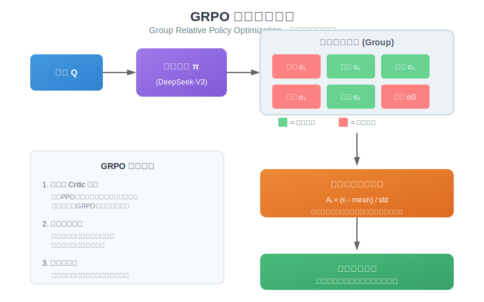
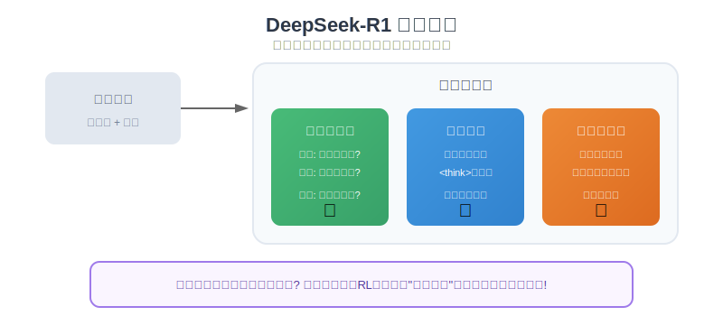
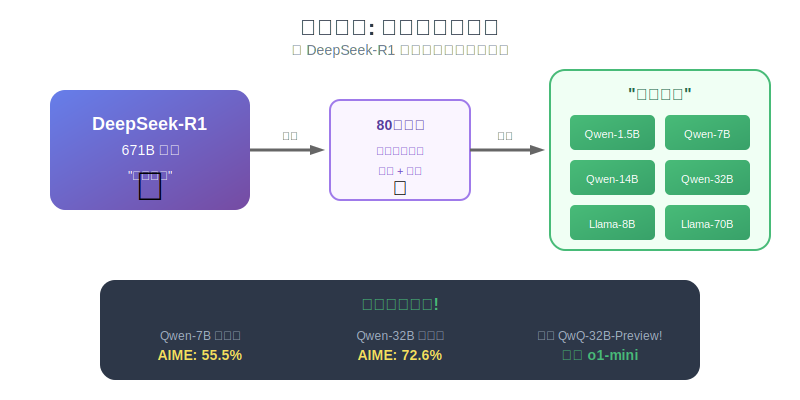
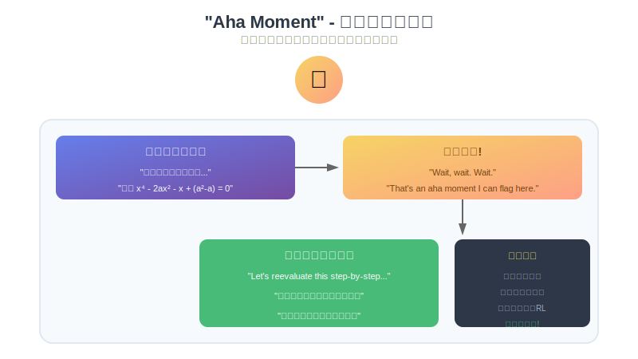
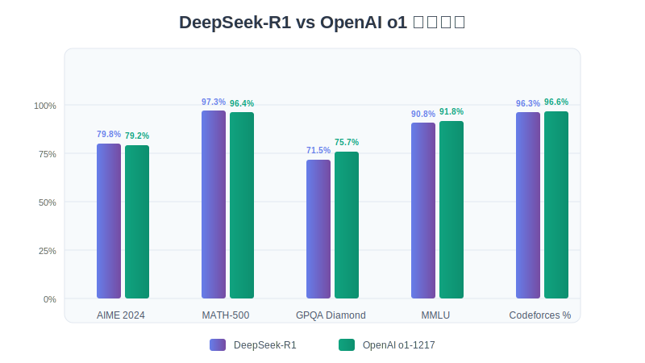

# DeepSeek-R1 论文通俗解读

> **论文标题**: DeepSeek-R1: Incentivizing Reasoning Capability in LLMs via Reinforcement Learning  
> **发表于**: Nature (2025年9月，封面文章)  
> **作者**: DeepSeek-AI 团队  
> **论文版本**: v2 (2026年1月更新，从22页扩展到86页)  
> **一句话总结**: 不用人工标注的推理数据，纯靠强化学习让 AI 自己学会"思考"，效果媲美 OpenAI o1，**训练成本仅 29.4 万美元**！

---

## 目录

1. [这篇论文在讲什么？](#1-这篇论文在讲什么)
2. [为什么这篇论文很重要？](#2-为什么这篇论文很重要)
3. [核心方法详解](#3-核心方法详解)
   - [DeepSeek-R1-Zero: 纯强化学习的奇迹](#31-deepseek-r1-zero-纯强化学习的奇迹)
   - [GRPO 算法: 省钱又高效的秘密武器](#32-grpo-算法-省钱又高效的秘密武器)
   - [RL 训练基础设施](#33-rl-训练基础设施)
   - [奖励系统: 简单却有效](#34-奖励系统-简单却有效)
   - [DeepSeek-R1: 四阶段训练流程](#35-deepseek-r1-四阶段训练流程)
   - [知识蒸馏: 大模型教小模型](#36-知识蒸馏-大模型教小模型)
4. ["Aha Moment" - 模型的顿悟时刻](#4-aha-moment---模型的顿悟时刻)
5. [训练成本揭秘](#5-训练成本揭秘)
6. [实验结果](#6-实验结果)
7. [失败的尝试（也很有价值！）](#7-失败的尝试也很有价值)
8. [安全性评估](#8-安全性评估)
9. [模型局限性](#9-模型局限性)
10. [示例代码](#10-示例代码)
11. [总结与思考](#11-总结与思考)

---

## 1. 这篇论文在讲什么？

### 用一个比喻来解释

想象你要教一个孩子学数学。传统方法是：
- **传统方法 (SFT)**: 给孩子看 10000 道例题和标准答案，让他模仿
- **DeepSeek 的方法 (RL)**: 只告诉孩子"对"或"错"，让他自己摸索解题方法

DeepSeek 团队发现，后者训练出来的 AI **不仅能解题，还能自己发明解题技巧**！

### 论文的核心发现

1. **纯强化学习就能让模型学会推理**：不需要人工标注的思维链数据
2. **模型会自发涌现高级能力**：反思、验证、调整策略
3. **这种能力可以"传授"给小模型**：用大模型生成的数据训练小模型
4. **成本极低**：整个 R1 增量训练仅需 **29.4 万美元**


### 论文更新历程

| 版本 | 日期 | 页数 | 主要变化 |
|------|------|------|----------|
| v1 | 2025.01.22 | 22页 | 初版发布 |
| v2 | 2026.01.04 | **86页** | 增加训练细节、成本、消融实验、失败尝试 |

> **为什么更新这么重要？**  
> 初版论文对很多细节"语焉不详"，新版把此前藏在黑箱里的训练流程、基础设施、中间检查点、失败尝试统统公开了。这在 AI 领域极为罕见！

---

## 2. 为什么这篇论文很重要？

### 对比一下之前的做法

| 方面 | 传统方法 (如 OpenAI o1) | DeepSeek-R1 |
|------|------------------------|-------------|
| **训练数据** | 需要大量人工标注的思维链 | 只需要问题和答案 |
| **成本** | 据传数千万美元 | **29.4 万美元**（增量训练）|
| **能力来源** | 模仿人类的思考过程 | 自己探索出思考方式 |
| **开源** | 不开源 | 完全开源！ |
| **同行评审** | 无 | **Nature 独立评审通过** |

### 这意味着什么？

1. **降低门槛**: 不需要花大钱请人标注数据
2. **可复现**: 开源模型，任何人都能研究
3. **新范式**: 证明了 RL 可以独立培养推理能力
4. **透明度标杆**: 首个通过顶级期刊同行评审的主流大模型

---

## 3. 核心方法详解

### 3.1 DeepSeek-R1-Zero: 纯强化学习的奇迹

这是论文最惊艳的部分。他们拿一个没经过任何微调的基座模型 (DeepSeek-V3-Base)，直接上强化学习，结果模型自己学会了：

- ✅ 长链条推理（一步步分析问题）
- ✅ 自我反思（"等等，我刚才算错了"）
- ✅ 尝试多种方法（"换个思路试试"）
- ✅ 验证答案（"让我检查一下这个结果"）

**这些能力完全是自发涌现的，没有任何人教它！**

#### 训练过程中发生了什么？

```
训练开始 → 模型瞎猜
   ↓
1000步 → 开始有点逻辑了
   ↓
4000-7000步 → 偶尔使用 "wait" 进行反思
   ↓
8000步 → "wait" 使用量显著跃升！（Aha Moment）
   ↓
训练结束 → AIME 准确率从 15.6% 飙升到 71.0%
```

#### 反思词汇的涌现（量化数据）

论文统计了 10 个代表性反思词汇的出现频率变化：

| 词汇 | 含义 | 训练中增长倍数 |
|------|------|----------------|
| wait | 等等，让我想想 | **5-7倍** |
| mistake | 我犯错了 | 5-7倍 |
| however | 但是 | 5-7倍 |
| retry | 重试 | 5-7倍 |
| verify | 验证 | 5-7倍 |
| wrong | 错了 | 5-7倍 |
| check | 检查 | 5-7倍 |

> **知识点补充 - AIME**  
> AIME (American Invitational Mathematics Examination) 是美国数学邀请赛，题目很难，能做对一半以上的人类都是数学高手。模型能达到 71% 说明推理能力非常强。

### 3.2 GRPO 算法: 省钱又高效的秘密武器

GRPO 全称是 **Group Relative Policy Optimization**（组相对策略优化）。



#### 为什么不用传统的 PPO？

传统的 PPO (Proximal Policy Optimization) 需要一个 **Critic 模型** 来评估每个回答有多好。问题是：

- Critic 模型通常和策略模型一样大
- 也就是说要额外训练一个 671B 参数的模型
- 成本翻倍！

更棘手的是，**Critic 模型要预测长链推理的最终奖励几乎不可行**——模型可能在生成过程中反复修正、自我否定，早期内容和最终答案之间的关联性很弱。

#### GRPO 的巧妙之处

GRPO 说："我不需要 Critic 模型，我让同一个问题的多个回答**互相比较**！"

```python
# GRPO 的核心思想（伪代码）

def grpo_step(question, model, G=16):
    # 1. 对同一个问题，采样 16 个回答（论文中的设置）
    answers = [model.generate(question) for _ in range(G)]
    
    # 2. 计算每个回答的奖励（对不对、格式好不好）
    rewards = [compute_reward(ans) for ans in answers]
    
    # 3. 计算相对优势（关键！用组内均值和标准差归一化）
    mean_reward = mean(rewards)
    std_reward = std(rewards)
    advantages = [(r - mean_reward) / std_reward for r in rewards]
    
    # 4. 好的回答获得正优势，坏的获得负优势
    # 5. 更新模型：提高好回答的概率，降低坏回答的概率
    update_model(answers, advantages)
```

#### GRPO vs PPO 实验对比

论文给出的消融实验显示：

| 算法 | MATH 任务表现 | 调参难度 | 内存占用 |
|------|---------------|----------|----------|
| PPO | 需要仔细调 λ 系数 | 高 | 需要 Critic 模型 |
| **GRPO** | **开箱即用** | **低** | **无需额外模型** |

#### 数学公式解读

论文中的优势计算公式：

$$A_i = \frac{r_i - \text{mean}(\{r_1, r_2, \cdots, r_G\})}{\text{std}(\{r_1, r_2, \cdots, r_G\})}$$

**大白话翻译**：
- $r_i$ = 第 i 个回答的奖励分数
- 如果一个回答比平均分高，它的优势是正的 → 模型会学着多生成这样的回答
- 如果一个回答比平均分低，它的优势是负的 → 模型会学着少生成这样的回答

### 3.3 RL 训练基础设施

新版论文首次披露了完整的 RL 训练架构：

```
┌─────────────────────────────────────────────────────────────┐
│                    RL Training Pipeline                      │
├─────────────────────────────────────────────────────────────┤
│                                                              │
│  ┌──────────────┐    ┌──────────────┐    ┌──────────────┐  │
│  │   Rollout    │    │  Inference   │    │  Rule-based  │  │
│  │   Module     │───▶│   Module     │───▶│   Reward     │  │
│  │  (vLLM)      │    │(RM + RefModel)│   │   Module     │  │
│  └──────────────┘    └──────────────┘    └──────────────┘  │
│         │                                        │          │
│         │              ┌──────────────┐          │          │
│         └─────────────▶│   Training   │◀─────────┘          │
│                        │   Module     │                     │
│                        │(Policy Update)│                    │
│                        └──────────────┘                     │
│                                                              │
└─────────────────────────────────────────────────────────────┘
```

#### 四个核心模块

| 模块 | 功能 | 技术细节 |
|------|------|----------|
| **Rollout** | 批量采样响应 | vLLM 工作节点 + MTP 自投机解码 |
| **Inference** | 前向推理 | 奖励模型 + 参考模型 |
| **Rule-based Reward** | 计算奖励 | 代码执行、答案匹配等 |
| **Training** | 策略更新 | GRPO 梯度更新 |

> **知识点补充 - MTP (Multi-Token Prediction)**  
> MTP 是一种自投机解码技术，可以一次预测多个 token，加速生成过程。考虑到 R1-Zero 训练时每个问题采样 16 个输出、单次训练步包含 32 个问题，这种优化对效率提升很大。

### 3.4 奖励系统: 简单却有效



DeepSeek 用的是**基于规则的奖励**，而不是神经网络奖励模型。

#### 为什么不用神经网络奖励模型？

> **知识点补充 - 奖励黑客 (Reward Hacking)**  
> 当你用神经网络来打分时，模型可能会找到一些"漏洞"——它学会的不是真正解决问题，而是学会了如何骗过打分模型获得高分。这在大规模训练中尤其严重。

#### 四种奖励信号

1. **正确性奖励** (Accuracy Reward)
   - 数学题：答案对不对？（可以用规则验证）
   - 代码题：能不能通过测试用例？（用编译器验证）

2. **格式奖励** (Format Reward)
   - 思考过程放在 `<think>` 标签里了吗？
   - 最终答案格式规范吗？

3. **语言一致性奖励** (Language Consistency)
   - 计算目标语言词汇在思维链中的占比
   - 用户用中文问，回答里不要夹杂英文
   - **注意**：消融实验显示这个奖励会导致推理性能轻微下降（特别是代码任务），但显著改善可读性

4. **安全奖励** (Safety Reward) - 第四阶段引入
   - 使用逐点方法训练（非成对比较）
   - 基于 106,000 条标注样本
   - 评估范围覆盖整个响应（包括思维链）

### 3.5 DeepSeek-R1: 四阶段训练流程

R1-Zero 虽然强，但有些问题：
- 输出有时候乱七八糟不好读
- 会混杂多种语言
- 缺乏通用对话能力

所以他们设计了四阶段流程，并引入了 **Dev1、Dev2、Dev3 三个中间检查点**：


#### 阶段 1: 冷启动 (Cold Start) → Dev1

收集几千条高质量的"长思维链"数据，格式是：

```
|special_token|<思考过程>|special_token|<总结答案>
```

**目的**：教会模型基本的思考格式，避免一开始就跑偏。

**Dev1 特点**：
- ✅ 指令遵循能力（IF-Eval、Arena-Hard）显著提升
- ⚠️ AIME 数学竞赛分数有所下降（冷启动数据规模有限的代价）

> **类比理解**  
> 就像教小孩写作文，先给几篇范文看看格式，然后再让他自由发挥。

#### 阶段 2: 推理导向的强化学习 → Dev2

和 R1-Zero 一样，用 GRPO 做大规模 RL，但：
- 起点是冷启动后的模型（比从零开始稳定）
- 加入语言一致性奖励

**Dev2 特点**：
- ✅ 推理性能恢复并超越 R1-Zero
- ✅ 可读性好于 R1-Zero

#### 阶段 3: 拒绝采样 + SFT → Dev3

从 RL 模型采样大量回答，只保留正确的，再加上通用能力数据（写作、问答等），重新微调。

**数据构成**：
- 60万条推理数据（数学、代码、逻辑）
- 20万条非推理数据（写作、翻译、知识问答）
- **共计 80 万样本**

**关键点**：单纯的推理 RL 会让模型在写作、开放域问答上表现欠佳，需要混合数据来平衡。

#### 阶段 4: 全场景强化学习 → R1 Final

最后一轮 RL，同时优化：
- **有用性** (Helpfulness)：回答是否解决了用户的问题
- **无害性** (Harmlessness)：回答是否安全、无偏见

**重要细节**：
- 基于偏好模型的奖励**只在最后 400 步引入**
- 过早或过长使用会导致奖励作弊（reward hacking）

### 3.6 知识蒸馏: 大模型教小模型



论文的另一个重要发现：**大模型发现的推理模式，可以直接"传授"给小模型**。

#### 蒸馏 vs 自己 RL（关键实验！）

他们在 Qwen2.5-32B-Base 上做了超过 10,000 步的大规模 RL 训练：

| 方法 | Qwen-32B 在 AIME 上的表现 | 说明 |
|------|--------------------------|------|
| 直接用 Qwen-32B 做 RL | 47.0% | 和 QwQ-32B-Preview 相当 |
| 用 R1 的数据蒸馏到 Qwen-32B | **72.6%** | 高出 25.6%！ |

**结论**：对于中小规模模型，**蒸馏比从头 RL 训练更具性价比**。

论文原话：
> "蒸馏策略既经济又有效，但要突破人类智能的边界，可能仍需要更强大的基座模型和更大规模的强化学习。"

#### 小模型 RL 的失败经验（重要！）

团队尝试过用小模型做 RL：

| 模型规模 | RL 效果 | 问题 |
|----------|---------|------|
| 7B Dense | ❌ 无意义提升 | 强烈的重复倾向 |
| 16B MoE | ❌ 无意义提升 | 无法有效利用长链推理 |
| 32B Dense | ✅ 开始有效 | - |
| 230B MoE | ✅ 显著提升 | - |
| 671B MoE | ✅ 最佳效果 | - |

**结论**：推理能力的涌现可能存在某种**规模门槛**。

#### 开源的蒸馏模型

| 模型 | AIME 2024 | MATH-500 | LiveCodeBench |
|------|-----------|----------|---------------|
| DeepSeek-R1-Distill-Qwen-1.5B | 28.9% | 83.9% | 16.9% |
| DeepSeek-R1-Distill-Qwen-7B | 55.5% | 92.8% | 37.6% |
| DeepSeek-R1-Distill-Qwen-14B | 69.7% | 93.9% | 53.1% |
| DeepSeek-R1-Distill-Qwen-32B | 72.6% | 94.3% | 57.2% |
| DeepSeek-R1-Distill-Llama-70B | 70.0% | 94.5% | 57.5% |

**7B 的小模型就超越了 QwQ-32B-Preview！**

---

## 4. "Aha Moment" - 模型的顿悟时刻

这是论文中最有趣的部分。在训练中期，研究者观察到模型出现了"顿悟时刻"：



### 真实的模型输出

```
问题: 如果 a > 1，求方程 √(a - √(a+x)) = x 的实数解之和

模型回答:
<think>
要解这个方程，让我先把两边平方...
(√(a - √(a+x)))² = x² ⟹ a - √(a+x) = x²

整理得到内层根号：
(a - x²)² = a + x ⟹ x⁴ - 2ax² - x + (a² - a) = 0

...

Wait, wait. Wait. That's an aha moment I can flag here.
（等等，等等。这是一个我可以标记的顿悟时刻。）

Let's reevaluate this step-by-step...
（让我重新一步步评估这个问题...）

我们从方程开始：
√(a - √(a+x)) = x

首先，两边平方：
a - √(a+x) = x² ⟹ √(a+x) = a - x²

接下来，我可以再次两边平方...
</think>
```

### 为什么这很神奇？

1. **没有人教它这样做**：训练数据中没有"aha moment"这种说法
2. **自发产生反思**：模型自己学会了停下来重新审视
3. **类人的思考方式**：这种行为非常像人类解题时的心理过程
4. **可量化的涌现**："wait"等词汇使用量在 8000 步后跃升 5-7 倍

> **研究者的感慨**  
> "This moment is not only an 'aha moment' for the model but also for the researchers observing its behavior."  
> （这不仅是模型的顿悟时刻，也是观察它的研究者的顿悟时刻。）

---

## 5. 训练成本揭秘

新版论文**首次公开了完整的训练成本**，这是最令人震惊的部分之一：

### DeepSeek-R1 增量训练成本

| 阶段 | 资源 | 时间 | 成本 |
|------|------|------|------|
| R1-Zero 训练 | 648 块 H800 GPU | 198 小时 | **$202,000** |
| SFT 数据创建 | - | - | **$10,000** |
| R1 后续训练 | - | - | **$82,000** |
| **总计** | | | **$294,000** |

### 完整成本（含基座模型）

| 项目 | 成本 |
|------|------|
| DeepSeek-V3-Base 预训练 | $5,566,000 |
| R1 增量训练 | $294,000 |
| **总计** | **$5,860,000** |

> **对比参考**  
> 行业普遍认为训练顶级模型需要**数千万美元**，DeepSeek 的成本远低于这个门槛。这证明了高效算法（GRPO）和工程优化的重要性。

---

## 6. 实验结果



### 与 OpenAI o1 的对比

| 基准测试 | DeepSeek-R1 | OpenAI o1-1217 | 说明 |
|---------|-------------|----------------|------|
| AIME 2024 | **79.8%** | 79.2% | 美国数学邀请赛 |
| MATH-500 | **97.3%** | 96.4% | 高中数学竞赛题 |
| GPQA Diamond | 71.5% | **75.7%** | 研究生级科学题 |
| MMLU | 90.8% | **91.8%** | 综合知识测试 |
| Codeforces | 96.3% | **96.6%** | 编程竞赛 |
| LiveCodeBench | **65.9%** | 63.4% | 实时编程测试 |

**结论**：DeepSeek-R1 在大多数任务上与 o1 打成平手，部分任务甚至更好！

### 思维链长度的变化

训练过程中，模型的平均输出长度不断增加：

```
开始: ~500 tokens
中期: ~3000 tokens
结束: ~5000-10000 tokens
```

**这说明模型自己学会了用更多"思考时间"来解决问题。**

### 中间检查点性能对比

| 检查点 | AIME | IF-Eval | Arena-Hard | 说明 |
|--------|------|---------|------------|------|
| R1-Zero | 71.0% | 低 | 低 | 纯 RL，推理强但对话弱 |
| Dev1 | 下降 | 显著提升 | 显著提升 | 冷启动后，对话能力好但推理暂降 |
| Dev2 | 超越 R1-Zero | 保持 | 保持 | RL 恢复推理能力 |
| Dev3 → R1 | 最优 | 最优 | 最优 | 全面平衡 |

---

## 7. 失败的尝试（也很有价值！）

论文很诚实地分享了一些失败的尝试，这些经验教训可能比成功案例更有价值：

### 尝试 1: 过程奖励模型 (PRM)

**想法**：不只看最终答案对不对，还给每一步推理打分

**遇到的三道坎**：
1. **"一步"怎么定义？** 边界划得粗细不同，奖励信号就会变形
2. **如何判断每一步是否正确？** 模型自标注不可靠，人工标注无法规模化
3. **奖励作弊风险** 一旦引入基于模型的 PRM，策略模型就会学会"迎合评分器"

**结论**：PRM 用来对 Top-N 候选响应做重排序时有效，但放到大规模 RL 中，增益不足以覆盖额外的复杂度与计算开销。

### 尝试 2: 蒙特卡洛树搜索 (MCTS)

**想法**：像 AlphaGo 那样，在推理时搜索多条路径

**问题**：
- **搜索空间爆炸**：Token 级搜索空间呈指数级膨胀
- **难以收敛**：设置扩展上限容易过早收敛到局部最优
- **价值模型难训练**：AlphaGo 那种渐进提升的闭环机制在语言生成中难以复现

### 尝试 3: 小模型 RL

**想法**：先在小模型上验证方法

**结果**：
- 7B Dense 和 16B MoE 在 AIME 上始终无法取得有意义提升
- 小模型在响应长度增加时表现出强烈的**重复倾向**
- 直到 32B+ 规模才开始有效

> **经验教训**  
> 1. 有时候简单的方法（规则奖励 + GRPO）比复杂的方法更有效
> 2. 推理能力可能存在规模门槛
> 3. 分享失败经验不等于否定这些方法的潜力，只是在当前路径上没走通

---

## 8. 安全性评估

安全是新版论文着重补充的维度，回应了此前对 R1 安全性的质疑：

### 训练层面

- **安全奖励模型**：使用逐点方法训练（非成对比较）
- **训练数据**：106,000 条标注为"安全"或"不安全"的样本
- **评估范围**：覆盖整个响应（包括思维链），识别生成过程中的风险

### 部署层面

官方服务配备了外部风险控制系统：
1. 对用户查询进行关键词匹配，标记潜在风险
2. 将标记内容与风险审核提示拼接，送入 DeepSeek-V3 判断
3. 覆盖 11 类安全标准（违法活动、隐私捏造、高风险投资等）

### 评估结果

在 6 个公开安全基准上的测试：

| 基准 | 类别 | R1 表现 |
|------|------|---------|
| SST | 多维度安全 | ✅ 稳健 |
| BBQ | 偏见检测 | ✅ 稳健 |
| XSTest | 极端内容 | ✅ 稳健 |
| HarmBench | 有害行为 | ⚠️ 版权测试较弱 |

**平均安全分：95.0%**

> **诚实披露**  
> 论文坦承，开源模型的安全风险客观存在。模型在某些边界场景（如被要求生成歌词时未能拒绝）仍有改进空间。

---

## 9. 模型局限性

论文也诚实地列出了 R1 的局限性：

### 能力局限

| 局限 | 说明 |
|------|------|
| **结构化输出** | 不及现有专门模型 |
| **工具调用** | 能力待提升 |
| **过度推理** | 简单问题也用很长的思维链，Token 效率待优化 |
| **语言混杂** | 非中英文查询会出现语言混合 |
| **Prompt 敏感** | Few-shot 反而会降低性能 |
| **软件工程** | 因评估耗时长，未能充分 RL，相比 V3 提升有限 |

### 方法论局限

纯 RL 方法的根本挑战：
- **依赖可靠的奖励信号**
- 写作等任务很难用规则定义奖励
- 用模型打分容易被策略模型钻空子

**论文的判断**：
> "任何能被验证器有效评估的任务，机器都有望通过 RL 超越人类；但对于难以构建可靠奖励模型的任务，进展可能会慢一些。"

---

## 10. 示例代码

### 10.1 使用 DeepSeek-R1 API

```python
from openai import OpenAI

client = OpenAI(
    api_key="your-api-key",
    base_url="https://api.deepseek.com"
)

response = client.chat.completions.create(
    model="deepseek-reasoner",  # DeepSeek-R1 模型
    messages=[
        {"role": "user", "content": "证明：对于所有正整数 n，n³ + 2n 能被 3 整除"}
    ]
)

# 模型会返回完整的思考过程 + 最终答案
print(response.choices[0].message.content)
```

### 10.2 使用蒸馏模型（本地运行）

```python
from transformers import AutoTokenizer, AutoModelForCausalLM
import torch

# 加载 7B 蒸馏模型（可以在消费级 GPU 上运行）
model_name = "deepseek-ai/DeepSeek-R1-Distill-Qwen-7B"
tokenizer = AutoTokenizer.from_pretrained(model_name)
model = AutoModelForCausalLM.from_pretrained(
    model_name, 
    torch_dtype=torch.bfloat16,
    device_map="auto"
)

# 构造提示（注意：不要用 few-shot，会降低性能！）
prompt = """A conversation between User and Assistant. The user asks a question, and the Assistant solves it.
The assistant first thinks about the reasoning process in the mind and then provides the user
with the answer. The reasoning process and answer are enclosed within <think> </think> and
<answer> </answer> tags, respectively.

User: 一个袋子里有 3 个红球和 2 个蓝球。随机取出 2 个球，求两个都是红球的概率。
Assistant:"""

inputs = tokenizer(prompt, return_tensors="pt").to(model.device)
outputs = model.generate(
    **inputs,
    max_new_tokens=2048,
    temperature=0.7,
    do_sample=True
)

print(tokenizer.decode(outputs[0], skip_special_tokens=True))
```

### 10.3 GRPO 核心逻辑示意

```python
import torch
import torch.nn.functional as F

def grpo_loss(
    policy_model,
    ref_model,
    questions,
    group_size=16,  # 论文中使用 16
    epsilon=0.2,
    beta=0.01
):
    """
    GRPO 损失函数的简化实现
    
    Args:
        policy_model: 当前策略模型
        ref_model: 参考模型（用于 KL 散度约束）
        questions: 一批问题（论文中每步 32 个问题）
        group_size: 每个问题采样多少个回答
        epsilon: PPO clip 参数
        beta: KL 散度权重
    """
    total_loss = 0
    
    for question in questions:
        # 1. 对每个问题采样一组回答
        with torch.no_grad():
            outputs = [policy_model.generate(question) for _ in range(group_size)]
            
            # 2. 计算每个回答的奖励
            rewards = torch.tensor([compute_reward(o) for o in outputs])
            
            # 3. 计算组内相对优势（GRPO 的核心！）
            advantages = (rewards - rewards.mean()) / (rewards.std() + 1e-8)
        
        # 4. 计算策略比率和损失
        for output, advantage in zip(outputs, advantages):
            # 当前策略的 log 概率
            log_prob = policy_model.log_prob(question, output)
            # 旧策略的 log 概率
            old_log_prob = ref_model.log_prob(question, output)
            
            # 策略比率
            ratio = torch.exp(log_prob - old_log_prob)
            
            # PPO clip 损失
            clipped_ratio = torch.clamp(ratio, 1 - epsilon, 1 + epsilon)
            policy_loss = -torch.min(ratio * advantage, clipped_ratio * advantage)
            
            # KL 散度惩罚（防止偏离太远）
            kl_div = torch.exp(old_log_prob - log_prob) - (old_log_prob - log_prob) - 1
            
            total_loss += policy_loss + beta * kl_div
    
    return total_loss / (len(questions) * group_size)

def compute_reward(output):
    """
    计算奖励（简化版）
    
    实际中包含：
    - 正确性检查（答案对不对）
    - 格式检查（是否有 <think> 标签）
    - 语言一致性检查（目标语言词汇占比）
    """
    reward = 0.0
    
    # 检查格式
    if "<think>" in output and "</think>" in output:
        reward += 0.1
    
    # 检查答案正确性（这里需要具体的验证逻辑）
    if verify_answer(output):
        reward += 1.0
    
    # 语言一致性（简化版）
    target_lang_ratio = count_target_language_words(output) / total_words(output)
    reward += 0.1 * target_lang_ratio
    
    return reward
```

---

## 11. 总结与思考

### 论文的主要贡献

1. **首次证明**：纯强化学习可以培养 LLM 的推理能力，不需要 SFT
2. **开源贡献**：发布了完整的模型和蒸馏版本
3. **方法论**：GRPO 算法 + 规则奖励的组合简单有效
4. **现象观察**："Aha Moment" 等涌现行为的发现和量化
5. **透明度**：首次公开训练成本、失败尝试、中间检查点
6. **学术认可**：首个通过 Nature 独立同行评审的主流大模型

### 核心发现

论文总结的关键洞察：

> "预训练检查点本身就具备复杂推理的潜力。释放这种潜力的关键不在于大规模人工标注，而在于三个要素：**困难的推理问题、可靠的验证器、充足的 RL 计算资源**。自我验证、反思等复杂推理行为会在 RL 过程中自然涌现。"

### 对我们的启发

1. **简单往往更好**：规则奖励比神经网络奖励更稳定
2. **让模型自己探索**：给对的激励，模型会自己找到方法
3. **蒸馏是性价比之王**：小模型 + 好数据 > 小模型 + RL
4. **规模很重要**：推理能力的涌现可能存在规模门槛（32B+）
5. **失败也是财富**：PRM、MCTS 的失败经验同样宝贵

### 还有哪些问题没解决？

1. **长文本推理的效率**：思维链越长，推理越慢
2. **非可验证任务的奖励**：写作、创意类任务怎么给奖励？
3. **多模态推理**：图像、视频的推理怎么做？
4. **小模型的推理能力**：如何突破规模门槛？

### 我的个人看法

这篇论文最让我惊叹的不是性能数字，而是 **"aha moment" 的发现**。

模型在纯粹的"对错"反馈下，自己发展出了反思、验证、重新思考的能力。这说明**推理能力可能是一种涌现属性**——只要有正确的激励机制和足够的计算量，它就会自然出现。

这对 AI 安全也有启发：如果模型能自发产生反思能力，它也可能自发产生其他我们没预料到的能力。我们需要更好地理解这种涌现过程。

另外，DeepSeek 团队的**开放态度**值得尊敬。公开失败尝试、详细成本、中间检查点，这在 AI 领域极为罕见。这种透明度对推动整个领域进步至关重要。

---

## 数据来源澄清

论文在同行评审文档中回应了"蒸馏 OpenAI"的质疑：

1. **预训练数据完全来自互联网**，没有刻意使用合成数据
2. 某些网页可能包含 GPT-4 生成的答案，但这不是有意为之
3. **防止基准污染措施**：过滤掉与评测问题存在 10-gram 匹配的文本
4. 仅数学领域就移除了约 **600 万条**文本
5. 论文坦承 n-gram 方法无法防止测试集改写版本混入

---

## 参考资料

- [DeepSeek-R1 论文原文 (arXiv)](https://arxiv.org/abs/2501.12948)
- [DeepSeek-R1 GitHub](https://github.com/deepseek-ai/DeepSeek-R1)
- [DeepSeek API 文档](https://platform.deepseek.com/)
- [Hugging Face 模型库](https://huggingface.co/deepseek-ai)
- [Nature 封面文章](https://www.nature.com/articles/s41586-025-09422-z)
- [知乎解读 - DeepTech深科技](https://zhuanlan.zhihu.com/p/1992643061826724743)

---

*本解读综合了论文 v2 版本（86页）和相关报道，力求全面准确。如有错误欢迎指正。*

*最后更新：2026年1月*
