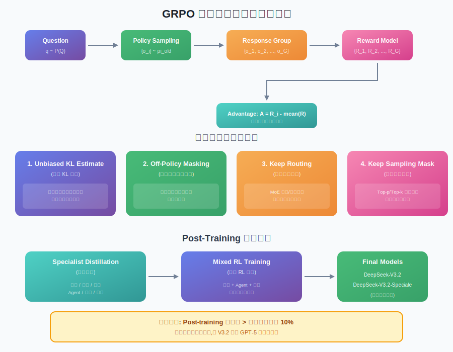
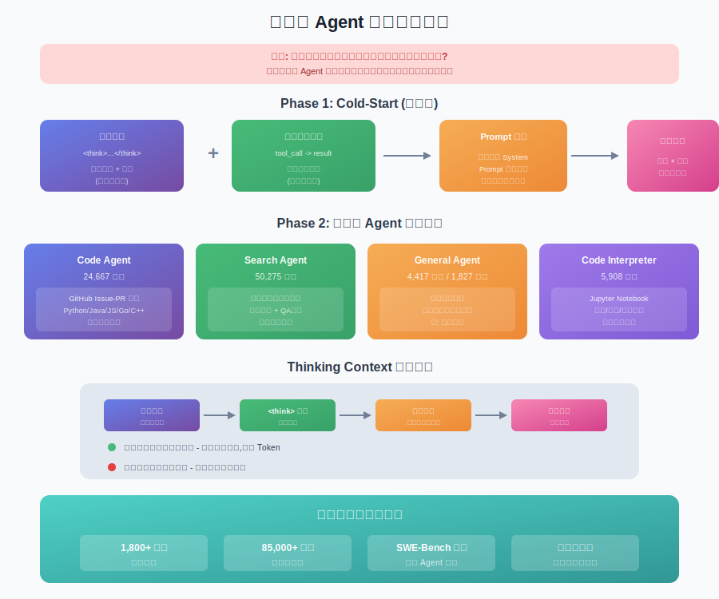

# DeepSeek-V3.2: 推动开源大模型前沿

**DeepSeek-V3.2: Pushing the Frontier of Open Large Language Models**

> **论文信息**
> - 作者: DeepSeek-AI (264位作者)
> - 发布时间: 2025年12月2日
> - arXiv: [2512.02556](https://arxiv.org/abs/2512.02556)

---

## 📖 目录

1. [一句话总结](#一句话总结)
2. [这篇论文在讲什么?](#这篇论文在讲什么)
3. [为什么这篇论文很重要?](#为什么这篇论文很重要)
4. [核心技术详解](#核心技术详解)
   - [DeepSeek Sparse Attention (DSA)](#1-deepseek-sparse-attention-dsa)
   - [可扩展强化学习框架](#2-可扩展强化学习框架)
   - [大规模 Agent 任务合成](#3-大规模-agent-任务合成)
5. [实验结果](#实验结果)
6. [局限性与思考](#局限性与思考)
7. [总结](#总结)

---

## 一句话总结

**DeepSeek-V3.2 通过三大技术突破(稀疏注意力、可扩展RL、Agent任务合成),让开源模型首次在推理和Agent能力上追平甚至超越 GPT-5,并在 IMO/IOI 2025 获得金牌水平。**

---

## 这篇论文在讲什么?

想象一下,你是一个学生,想要在数学竞赛中获得金牌。传统的学习方式有几个问题:

1. **阅读太慢**: 看一本 1000 页的书,你需要逐字逐句读完才能找到重点
2. **练习不够**: 老师只让你做了 10 道题就考试了
3. **不会用工具**: 考试允许用计算器,但你不会把计算器和解题思路结合起来

DeepSeek-V3.2 正是解决了 AI 模型面临的类似问题:

| 人类学习的问题 | AI 模型的对应问题 | DeepSeek-V3.2 的解决方案 |
|--------------|-----------------|------------------------|
| 阅读效率低 | 注意力机制计算太慢 | **DSA 稀疏注意力** - 只关注重要的内容 |
| 练习量不够 | 后训练计算投入不足 | **可扩展RL框架** - 后训练投入>预训练10% |
| 不会结合工具 | 推理和工具调用脱节 | **Agent任务合成** - 让思考和工具调用融为一体 |


---

## 为什么这篇论文很重要?

### 开源 vs 闭源的差距正在拉大

2025年,一个令人担忧的趋势出现了: **闭源模型(GPT-5、Gemini-3.0-Pro)和开源模型的差距不是在缩小,而是在扩大。**

```
闭源模型性能 📈📈📈📈📈
开源模型性能 📈📈📈
         ─────────────────────>
                    时间
```

DeepSeek-V3.2 正是要打破这个趋势。它在多个维度实现了突破:

| 对比项 | DeepSeek-V3.2 | 竞争对手 |
|-------|--------------|---------|
| 数学推理 | IMO 2025 金牌 🥇 | GPT-5 银牌水平 |
| 编程能力 | IOI 2025 金牌 🥇 | 与 Gemini-3.0-Pro 持平 |
| Agent 能力 | SWE-Bench 领先 | 大幅超越其他开源模型 |
| 推理成本 | 长序列大幅降低 | 传统注意力成本高昂 |

> **知识点补充 - IMO 和 IOI**
> 
> **IMO (国际数学奥林匹克)** 是全球最顶级的高中数学竞赛,每年约 600 名来自 100+ 国家的顶尖学生参加。获得金牌意味着数学推理能力处于全球顶尖 1/12。
> 
> **IOI (国际信息学奥林匹克)** 是全球最顶级的编程竞赛,考察算法设计和编程实现能力。

---

## 核心技术详解

### 1. DeepSeek Sparse Attention (DSA)

#### 问题: 传统注意力太"勤快"了

传统的 Transformer 注意力机制像一个"强迫症患者": 每读一个词,都要回头看看之前的**所有**词。

```
读到第 1000 个词时:
  → 回头看第 1 个词... 有点关系
  → 回头看第 2 个词... 没啥关系  
  → 回头看第 3 个词... 没啥关系
  → ...
  → 回头看第 999 个词... 很相关!

计算量 = 1000 × 1000 = 1,000,000 次
```

当序列长度 L 增加时,计算量是 **O(L²)** 的增长。128K 长度的序列需要计算约 164 亿次注意力分数!

#### 解决方案: "闪电索引器" + "精准挑选"

DSA 的核心思想很简单: **不是所有词都值得关注,只关注最重要的 k 个。**


**Stage 1: Lightning Indexer (闪电索引器)**

用一个轻量级的"小脑"快速评估每个历史词的重要性:

```python
# 大白话版本的索引分数计算
def lightning_indexer(query_token, all_history_tokens):
    scores = []
    for history_token in all_history_tokens:
        # 用轻量级的头计算重要性
        score = sum(weight * ReLU(query · key) for each indexer_head)
        scores.append(score)
    return scores
```

> **知识点补充 - ReLU 激活函数**
> 
> ReLU (Rectified Linear Unit) 是最简单的激活函数: `ReLU(x) = max(0, x)`。
> 负数变成 0,正数保持不变。选择 ReLU 是因为它计算超快,非常适合这个需要快速筛选的场景。

**Stage 2: Fine-grained Token Selection (精细选择)**

从索引分数中选出 Top-k 个最重要的词,只对这些词做完整的注意力计算:

```python
def sparse_attention(query_token, all_history_tokens, k=2048):
    # Step 1: 快速评估所有词的重要性
    scores = lightning_indexer(query_token, all_history_tokens)
    
    # Step 2: 只选最重要的 k 个
    top_k_indices = get_top_k(scores, k)
    selected_tokens = [all_history_tokens[i] for i in top_k_indices]
    
    # Step 3: 只对选中的词做注意力
    output = full_attention(query_token, selected_tokens)
    return output
```

**复杂度对比:**

| 方法 | 复杂度 | 128K 序列计算量 |
|-----|-------|----------------|
| 传统注意力 | O(L²) | ~164 亿次 |
| DSA | O(L × k) | ~2.6 亿次 (k=2048) |
| **加速比** | - | **~63倍** |

#### 训练过程: 从"密集"到"稀疏"

DSA 不是从零训练的,而是在已有模型基础上"继续训练":

1. **Dense Warm-up (密集预热)**: 1000 步,2.1B tokens
   - 冻结主模型,只训练 Lightning Indexer
   - 让索引器学会模仿主注意力的分布

2. **Sparse Training (稀疏训练)**: 15000 步,943.7B tokens
   - 解冻所有参数,用稀疏模式训练
   - 模型学会适应"只看重要词"的工作方式

```
DeepSeek-V3.1-Terminus (128K) 
        ↓ Dense Warm-up (2.1B tokens)
        ↓ Sparse Training (943.7B tokens)  
        ↓ Post-Training (SFT + RL)
DeepSeek-V3.2 ✓
```

---

### 2. 可扩展强化学习框架

#### 问题: 开源模型的后训练投入太少

预训练就像是"读完整本教科书",后训练(Post-training)就像是"做练习题"。

很多开源模型的问题是: **书读了很多,但练习题做得太少。**

DeepSeek-V3.2 的做法是: **后训练计算投入超过预训练的 10%!** 这是一个巨大的投入。



#### GRPO: 组内相对策略优化

> **知识点补充 - GRPO vs PPO**
> 
> **PPO (Proximal Policy Optimization)** 是经典的强化学习算法,需要训练一个单独的"评委"(Critic)来评估每个动作的好坏。
> 
> **GRPO (Group Relative Policy Optimization)** 是 DeepSeek 的创新: 不需要单独的评委,而是让同一批回答"互相比较",用组内的平均分作为基准。好于平均的奖励,差于平均的惩罚。

GRPO 的核心流程:

```python
def grpo_training_step(question):
    # 1. 采样: 对同一个问题生成 G 个回答
    responses = [policy.sample(question) for _ in range(G)]  # G 通常 = 8~16
    
    # 2. 打分: 用奖励模型给每个回答打分
    rewards = [reward_model.score(q, r) for r in responses]
    
    # 3. 计算优势: 好于平均就是正的,差于平均就是负的
    mean_reward = sum(rewards) / G
    advantages = [r - mean_reward for r in rewards]
    
    # 4. 更新策略: 鼓励好的回答,惩罚差的回答
    for response, advantage in zip(responses, advantages):
        update_policy(response, advantage)
```

#### 四大稳定性优化

大规模 RL 训练容易"翻车"(训练不稳定)。DeepSeek 提出了四个关键技巧:

**1. Unbiased KL Estimate (无偏 KL 估计)**

问题: 原来的 KL 散度估计有系统性偏差,会给低概率 token 分配过大的权重。

解决: 用重要性采样比率修正,得到无偏的梯度估计。

**2. Off-Policy Sequence Masking (离线策略序列掩码)**

问题: 批量生成数据后分多步更新,策略已经变化,老数据可能"过时"。

解决: 如果某个序列的优势是负的,且策略偏移太大,就把它 mask 掉不学。

```python
if advantage < 0 and kl_divergence(old_policy, current_policy) > threshold:
    mask = 0  # 不学这个样本
else:
    mask = 1  # 正常学习
```

**3. Keep Routing (保持路由)**

问题: MoE (混合专家) 模型在推理和训练时可能选择不同的专家,导致优化的参数和生成时用的参数不一致。

解决: 记录推理时的专家选择路径,训练时强制使用相同路径。

**4. Keep Sampling Mask (保持采样掩码)**

问题: Top-p/Top-k 采样会截断概率分布,但训练时如果不截断,会导致动作空间不一致。

解决: 记录采样时的截断 mask,训练时也用同样的 mask。

---

### 3. 大规模 Agent 任务合成

#### 问题: 推理能力和工具调用能力是"两张皮"

传统的 reasoning 模型(如 DeepSeek-R1)会先思考再回答,但遇到需要调用工具的场景就懵了:

```
用户: 今天北京天气怎么样?

❌ 传统推理模型:
<think>
让我思考一下... 北京位于华北平原...
历史上北京这个季节通常...
我没有实时数据,无法回答...
</think>
抱歉,我无法获取实时天气。

✓ DeepSeek-V3.2:
<think>
用户想知道北京天气,我需要调用天气 API...
</think>
[调用工具: weather_api("北京")]
→ 收到结果: 晴,15-25°C
<think>
根据 API 返回,北京今天晴天...
</think>
今天北京天气晴朗,气温 15-25°C。
```



#### Cold-Start: 从零到有

第一步是让模型"会"在推理过程中调用工具。方法很直接: **用 prompt 工程把两种能力"缝合"起来。**

| 数据类型 | System Prompt | 行为 |
|---------|--------------|------|
| 纯推理数据 | "请先思考再回答" | `<think>推理</think>答案` |
| 纯工具数据 | "你可以调用以下工具" | `tool_call → 结果 → 回答` |
| **融合数据** | "请在思考过程中按需调用工具" | `<think>推理 + tool_call</think>答案` |

#### 大规模任务合成

Cold-Start 只是让模型"能"做,要做"好"还需要大量练习。DeepSeek 合成了 85,000+ 个 Agent 任务:

| 任务类型 | 数量 | 环境 | 数据来源 |
|---------|------|------|---------|
| Code Agent | 24,667 | 真实 GitHub 环境 | Issue-PR 挖掘 |
| Search Agent | 50,275 | 真实搜索 API | 多智能体生成 |
| General Agent | 4,417 | 1,827 合成环境 | 自动合成 |
| Code Interpreter | 5,908 | Jupyter Notebook | 数学/逻辑题 |

**General Agent 的合成特别有意思**: 系统自动生成"难解决但易验证"的任务。

例如行程规划任务:

```
任务: 规划一个三天杭州出发的旅行,要求:
- 不重复城市/酒店/景点/餐厅
- 第二天如果住豪华酒店(≥800元),餐费总计<350元,景点门票<120元
- ...更多复杂约束...

验证: 给出的方案是否满足所有约束? (简单的规则检查)
```

这种任务搜索空间巨大(难解决),但验证很简单(易验证),非常适合 RL 训练。

#### Thinking Context 管理

工具调用场景有个特殊问题: **每次调用工具后,要不要清空之前的思考?**

DeepSeek-R1 的做法是: 第二轮消息到来时清空所有推理内容。但这在工具调用场景很浪费 — 调用一次工具就把之前想的全忘了?

DeepSeek-V3.2 的改进:

```
用户消息 → 开始推理 → 调用工具 → 工具结果 → 继续推理 → 最终答案
                      ↑                    ↑
                保留推理上下文        保留推理上下文
                      
新用户消息 → 清空推理(但保留工具历史) → 重新推理
```

**规则**: 
- 工具相关消息(调用/结果): 不清空推理
- 新用户消息: 清空推理内容,保留工具调用历史

---

## 实验结果

### 推理能力

| Benchmark | DeepSeek-V3.2 | GPT-5 | Gemini-3.0-Pro |
|-----------|--------------|-------|----------------|
| AIME 2025 | 85.0% | 82.3% | 87.1% |
| HMMT 2025 Feb | 76.0% | 72.0% | 80.0% |
| GPQA Diamond | 74.8% | 73.5% | 79.0% |
| HLE (Text-only) | 23.3% | 18.8% | 25.8% |

**DeepSeek-V3.2-Speciale** (延长推理版本) 的表现:
- IMO 2025: **金牌水平** 🥇 (41/42 分)
- IOI 2025: **金牌水平** 🥇 (493.67/600 分)
- ICPC World Final 2025: **金牌水平** 🥇

### Agent 能力

| Benchmark | DeepSeek-V3.2 | Claude Sonnet 4.5 | GPT-5 |
|-----------|--------------|------------------|-------|
| SWE-Bench Verified | 65.4% | 70.3% | 69.3% |
| Tau2-Bench | 53.4% | 53.9% | 57.9% |
| MCPMark | **74.9%** | 66.7% | 69.7% |
| MCPUniverse | **45.6%** | 33.3% | 35.0% |

在 MCP (Model Context Protocol) 相关的长尾 Agent 任务上,DeepSeek-V3.2 大幅领先。

### 推理成本

DSA 带来的实际成本节省 (H800 集群,2 USD/GPU·hour):

| 序列位置 | V3.1 Prefill | V3.2 Prefill | 节省 |
|---------|-------------|-------------|------|
| 32K | ~0.4 USD/M | ~0.3 USD/M | ~25% |
| 64K | ~1.0 USD/M | ~0.5 USD/M | ~50% |
| 128K | ~2.5 USD/M | ~0.8 USD/M | ~68% |

---

## 局限性与思考

### 1. DSA 的权衡

DSA 用"轻量级索引器"来选择 token,这本身就是一个信息损失。论文说性能"没有明显下降",但在某些需要精确长距离依赖的任务上,可能还是会有影响。

### 2. RL 训练的资源需求

"后训练超过预训练 10%" 意味着巨大的计算投入。这对于资源有限的团队来说可能难以复现。

### 3. Agent 能力的泛化边界

虽然合成了 85,000+ 任务和 1,800+ 环境,但现实世界的工具和环境是无限的。模型在完全未见过的工具/环境上的表现还需要更多验证。

### 4. Thinking Context 管理的兼容性问题

论文提到,某些 Agent 框架(如 Roo Code)通过用户消息模拟工具交互。这种框架可能无法充分利用 V3.2 的推理保留机制。

---

## 总结

DeepSeek-V3.2 是一个里程碑式的工作,核心贡献:

1. **DSA 稀疏注意力**: 从 O(L²) 到 O(Lk),长序列推理成本降低 60%+
2. **可扩展 RL 框架**: 四大稳定性技巧 + 超大规模后训练投入
3. **Agent 任务合成**: 85,000+ 任务,让推理和工具调用真正融合

**最重要的意义**: 证明了开源模型可以追上闭源模型,打破了"闭源遥遥领先"的悲观论调。

---

## 参考资料

- 论文原文: [arXiv:2512.02556](https://arxiv.org/abs/2512.02556)
- 模型代码: [HuggingFace - DeepSeek-V3.2-Exp](https://huggingface.co/deepseek-ai/DeepSeek-V3.2-Exp)
- DeepSeek-R1 论文解读: [../deepseek-r1-explained/](../deepseek-r1-explained/)

---

*本解读由 AI 辅助生成,如有错误欢迎指正。*
