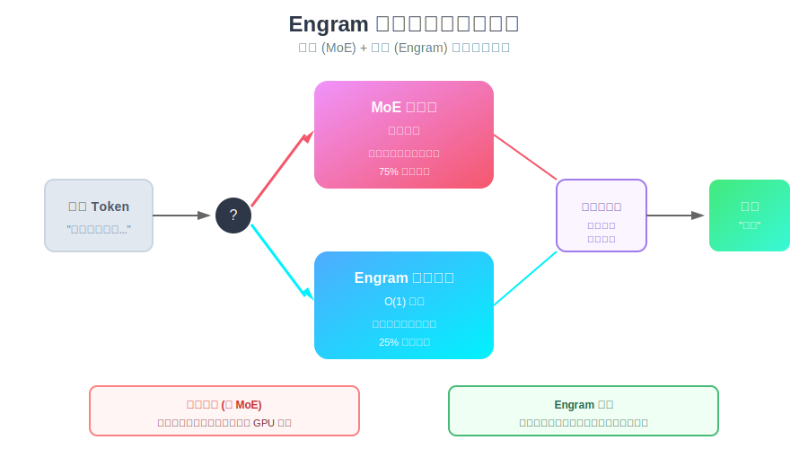
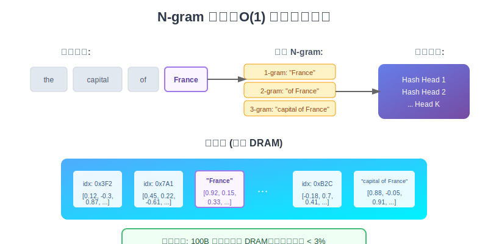
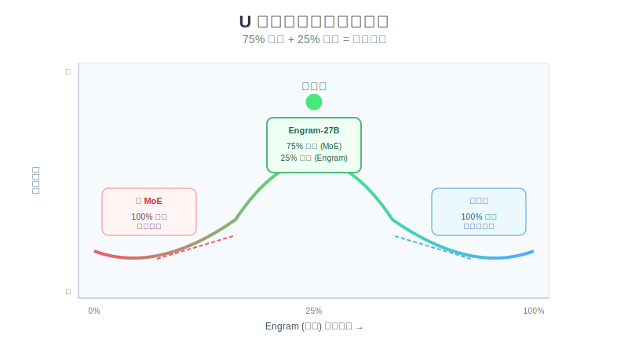
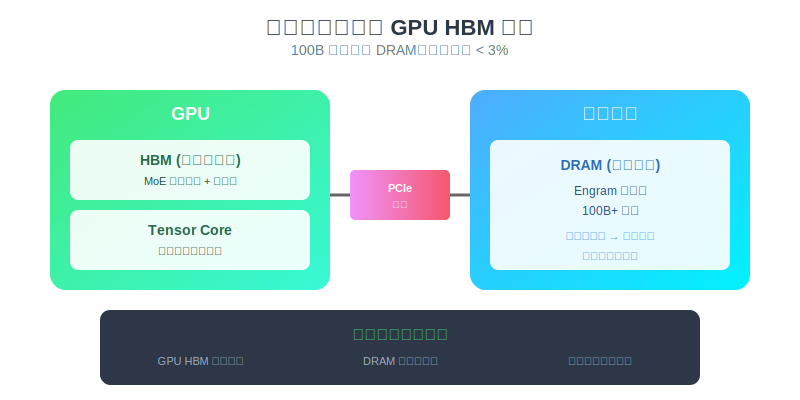
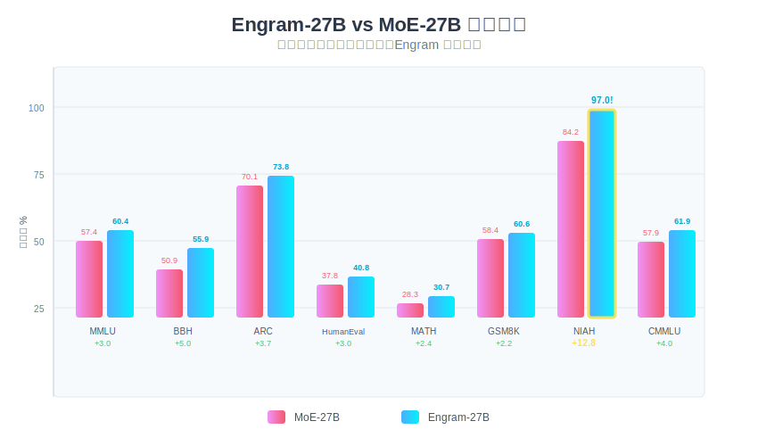

# DeepSeek Engram 论文通俗解读

> **论文标题**: Conditional Memory via Scalable Lookup: A New Axis of Sparsity for Large Language Models  
> **发表于**: arXiv (2026年1月12日)  
> **作者**: DeepSeek-AI 团队 + 北京大学（含创始人梁文锋）  
> **一句话总结**: 给大模型加一个"记忆查找表"，让 GPU 专注推理，知识检索交给查表，性能提升 3-5 分，长文本准确率从 84% 飙升到 97%！

---

## 目录

1. [这篇论文在讲什么？](#1-这篇论文在讲什么)
2. [为什么这篇论文很重要？](#2-为什么这篇论文很重要)
3. [核心方法详解](#3-核心方法详解)
   - [问题：GPU 在浪费算力](#31-问题gpu-在浪费算力)
   - [Engram 是什么？](#32-engram-是什么)
   - [N-gram 查表机制](#33-n-gram-查表机制)
   - [U 型曲线：最优分配比例](#34-u-型曲线最优分配比例)
   - [内存卸载：突破 HBM 瓶颈](#35-内存卸载突破-hbm-瓶颈)
4. [实验结果](#4-实验结果)
5. [为什么推理能力也提升了？](#5-为什么推理能力也提升了)
6. [与 DeepSeek V4 的关系](#6-与-deepseek-v4-的关系)
7. [示例代码](#7-示例代码)
8. [总结与思考](#8-总结与思考)

---

## 1. 这篇论文在讲什么？

### 用一个比喻来解释

想象你是一个考试的学生：

- **传统 Transformer**：每道题都要从头推理，即使是"法国的首都是什么"这种记忆题，也要调动全部脑力去"计算"
- **Engram 方式**：简单的记忆题直接查笔记，复杂的推理题才动脑子

**Engram 就是给大模型加了一本"知识速查手册"！**

### 论文的核心发现

1. **静态知识不需要计算**：像"巴黎是法国首都"这种固定事实，用查表比用神经网络"算"更高效
2. **双轴稀疏**：MoE 负责"条件计算"，Engram 负责"条件记忆"，各司其职
3. **最优比例是 75:25**：75% 参数给计算（MoE），25% 给记忆（Engram）
4. **100B 参数表可放 DRAM**：不占用宝贵的 GPU 显存，吞吐损失 < 3%



---

## 2. 为什么这篇论文很重要？

### 解决了什么问题？

| 问题 | 传统方案 | Engram 方案 |
|------|----------|-------------|
| GPU HBM 太贵太少 | 买更多 GPU | 把记忆表放 DRAM |
| 知识检索效率低 | 用多层神经网络"计算"知识 | O(1) 查表 |
| 长文本处理差 | 注意力被局部依赖占满 | 局部查表，注意力给全局 |
| 模型越大越难训 | 堆更多 GPU | 分离计算和记忆 |

### 这意味着什么？

1. **成本下降**：不需要那么多昂贵的 HBM 显存
2. **绕开出口管制**：中国可以用普通 DRAM 弥补高端 GPU 的限制
3. **架构革新**：Engram 可能成为像 Attention、MoE 一样的基础组件
4. **V4 预告**：这篇论文被广泛认为是 DeepSeek-V4 的技术预告

---

## 3. 核心方法详解

### 3.1 问题：GPU 在浪费算力

当模型需要回答"法国的首都是什么"时：

```
传统 Transformer 的做法：
Token "法国" → 第1层注意力 → 第2层FFN → ... → 第24层 → 输出"巴黎"
                    ↑
            需要经过所有层的"计算"才能得到一个固定答案！
```

**这就像用超级计算机来查字典一样浪费！**

> **知识点补充 - 为什么这是浪费？**  
> "法国首都是巴黎"是一个**静态事实**，不需要推理。但 Transformer 把它和"证明勾股定理"一样对待，都要经过全部神经网络层。这导致：
> - GPU 算力浪费在简单查询上
> - 网络深度被静态模式重建占用
> - 注意力容量被局部依赖消耗

### 3.2 Engram 是什么？

Engram 是一个**条件记忆模块**，核心思想：

- **静态知识** → 查表（O(1) 时间复杂度）
- **动态推理** → 神经网络计算

```
Engram 的做法：
Token "法国首都" → Engram 查表 → 直接得到"巴黎"嵌入 → 门控融合 → 输出
                      ↑
              常数时间查表，不经过神经网络计算！
```

> **知识点补充 - Engram 这个名字**  
> Engram（记忆痕迹）是神经科学术语，指大脑中存储记忆的物理基础。DeepSeek 用这个名字暗示：这个模块就是模型的"长期记忆"。

### 3.3 N-gram 查表机制

Engram 的核心是**现代化的 N-gram 嵌入**：



#### 三个核心创新

**1. Tokenizer 压缩**

```python
# 不同形式的同一个词映射到同一个 ID
"France" → 压缩 → "france"
"FRANCE" → 压缩 → "france"  
"FrAnCe" → 压缩 → "france"

# 结果：词汇表大小减少 23%
```

**2. 多头哈希**

直接存储所有 N-gram 组合是不现实的（指数爆炸）。Engram 用 K 个哈希头来缓解冲突：

```python
def multi_head_hash(ngram, K=8):
    """每个 N-gram 用 K 个不同的哈希函数"""
    embeddings = []
    for head in range(K):
        hash_idx = hash_function(ngram, seed=head) % table_size
        embeddings.append(embedding_table[hash_idx])
    # 聚合所有头的结果，减少单个冲突的影响
    return aggregate(embeddings)
```

**3. 上下文门控**

检索到的嵌入不是直接使用，而是通过门控机制融合：

```python
def context_gating(retrieved_embedding, hidden_state):
    """
    如果检索到的内容与上下文矛盾 → 门控抑制
    如果检索到的内容与上下文匹配 → 门控放行
    """
    gate = sigmoid(W @ hidden_state)
    return gate * retrieved_embedding
```

### 3.4 U 型曲线：最优分配比例

DeepSeek 做了大量实验，发现了一个 **U 型曲线**：



| 配置 | 计算 (MoE) | 记忆 (Engram) | 效果 |
|------|-----------|---------------|------|
| 纯 MoE | 100% | 0% | 次优 - 浪费深度重建静态模式 |
| 最优 | **75%** | **25%** | **最佳** |
| 纯记忆 | 0% | 100% | 最差 - 失去推理能力 |

**结论**：太多计算浪费在静态知识上，太多记忆又会失去推理能力。75:25 是甜蜜点。

#### Engram-27B 的具体配置

```
基座模型: DeepSeek-V3 架构
原始 MoE: 72 个专家
Engram-27B: 
  - MoE 专家: 55 个（减少 17 个）
  - Engram 模块: 5.7B 参数
  - 插入位置: 第 2 层 + 第 15 层
  - N-gram 最大长度: 3
  - 哈希头数: 8
  - 嵌入维度: 1280
```

### 3.5 内存卸载：突破 HBM 瓶颈

这是 Engram 最实用的特性之一：



#### 为什么可以卸载到 DRAM？

传统神经网络无法卸载，因为：
- 计算是**动态的**，不知道下一步需要什么权重
- 必须把所有权重放在 GPU 显存里

Engram 可以卸载，因为：
- 查表地址是**确定的**（由输入 token 决定）
- 可以**提前预取**下一步需要的嵌入
- 通过 PCIe 异步传输，几乎不增加延迟

```python
# 伪代码：异步预取
async def prefetch_embeddings(next_tokens):
    """在 GPU 计算当前层时，异步从 DRAM 预取下一层的嵌入"""
    indices = compute_hash_indices(next_tokens)
    embeddings = await dram.async_read(indices)  # PCIe 传输
    return embeddings
```

#### 实验结果

| 配置 | 位置 | 吞吐损失 |
|------|------|----------|
| 标准 MoE | GPU HBM | 基准 |
| Engram 100B 表 | 主机 DRAM | **< 3%** |

**这意味着可以用便宜的 DRAM 存储海量知识，而不是昂贵的 HBM！**

---

## 4. 实验结果



### 与 MoE 基线对比（严格等参数、等计算量）

#### 知识与推理任务

| 基准 | MoE-27B | Engram-27B | 提升 |
|------|---------|------------|------|
| MMLU | 57.4 | 60.4 | **+3.0** |
| MMLU-Redux | 60.6 | 64.0 | **+3.4** |
| CMMLU | 57.9 | 61.9 | **+4.0** |
| BBH | 50.9 | 55.9 | **+5.0** |
| ARC-Challenge | 70.1 | 73.8 | **+3.7** |

#### 代码与数学任务

| 基准 | MoE-27B | Engram-27B | 提升 |
|------|---------|------------|------|
| HumanEval | 37.8 | 40.8 | **+3.0** |
| MBPP | 46.6 | 48.2 | +1.6 |
| GSM8K | 58.4 | 60.6 | +2.2 |
| MATH | 28.3 | 30.7 | +2.4 |

#### 长文本处理（最大亮点！）

| 基准 | MoE-27B | Engram-27B | 提升 |
|------|---------|------------|------|
| Multi-Query NIAH | 84.2% | **97.0%** | **+12.8%** |
| DROP F1 | 55.7 | 59.0 | +3.3 |
| RACE-High | 75.4 | 78.2 | +2.8 |

> **知识点补充 - NIAH (Needle in a Haystack)**  
> NIAH 测试模型在超长文档中找到特定信息的能力。84% → 97% 是巨大的提升，说明 Engram 大幅增强了长文本处理能力。

---

## 5. 为什么推理能力也提升了？

这是论文中最反直觉的发现：**一个"记忆"模块，为什么推理任务（BBH +5.0）比知识任务（MMLU +3.0）提升更大？**

### 机制分析

#### 1. 早期层解放效应

```
传统 Transformer:
第1-4层: 忙于重建静态模式（"法国首都"→"巴黎"）
第5-24层: 才开始真正推理

Engram:
第1-4层: Engram 处理静态模式 → 这些层被解放
第5-24层: 更多层可用于推理 → 等效于网络变深
```

**结论**：Engram 让早期层"腾出手"来做更复杂的事。

#### 2. 注意力容量释放

```
传统 Transformer:
注意力容量 = 局部依赖（"the capital of"）+ 全局上下文（整篇文章）
           = 大量用于局部 → 全局容量不足

Engram:
局部依赖 → 交给 N-gram 查表
注意力容量 → 全部给全局上下文
```

**这解释了为什么 NIAH 从 84% 飙升到 97%！**

#### 消融实验证据

当禁用 Engram 模块时：

| 任务 | 保留性能 | 说明 |
|------|----------|------|
| TriviaQA | 29% | 知识问答崩溃 |
| NaturalQA | 44% | 知识问答大幅下降 |
| 推理任务 | 相对稳定 | 推理能力来自 MoE |

**结论**：Engram 确实承担了静态知识的存储，让 MoE 专注推理。

---

## 6. 与 DeepSeek V4 的关系

### 时间线

| 日期 | 事件 |
|------|------|
| 2026.01.12 | Engram 论文发布 |
| 2026.01.13 | mHC（另一篇架构论文）发布 |
| ~2026.02.17 | V4 预计发布 |

### 推测

1. **Engram 将是 V4 的核心组件**：论文结尾说"我们设想条件记忆将成为下一代稀疏模型不可或缺的建模原语"
2. **双论文组合**：Engram（内存效率）+ mHC（训练稳定性）= V4 架构基础
3. **创始人参与**：梁文锋亲自署名，说明这是战略级技术

---

## 7. 示例代码

### 7.1 简化的 Engram 模块

```python
import torch
import torch.nn as nn
import torch.nn.functional as F

class EngramModule(nn.Module):
    """
    简化版 Engram 模块实现
    
    核心思想：
    1. 用 N-gram 哈希索引嵌入表
    2. 多头聚合减少冲突
    3. 上下文门控融合
    """
    
    def __init__(
        self,
        vocab_size: int = 100000,
        embed_dim: int = 1280,
        num_heads: int = 8,
        max_ngram: int = 3,
        table_size: int = 10_000_000,  # 嵌入表大小
    ):
        super().__init__()
        self.num_heads = num_heads
        self.max_ngram = max_ngram
        self.embed_dim = embed_dim
        
        # 嵌入表（可放 DRAM）
        self.embedding_table = nn.Embedding(table_size, embed_dim)
        
        # 门控投影
        self.gate_proj = nn.Linear(embed_dim, embed_dim)
        
        # 哈希种子（每个头不同）
        self.register_buffer(
            'hash_seeds', 
            torch.arange(num_heads, dtype=torch.long)
        )
    
    def compute_ngrams(self, token_ids: torch.Tensor) -> list:
        """提取所有 N-gram"""
        batch_size, seq_len = token_ids.shape
        ngrams = []
        
        for n in range(1, self.max_ngram + 1):
            if seq_len >= n:
                # 滑动窗口提取 n-gram
                for i in range(seq_len - n + 1):
                    ngram = token_ids[:, i:i+n]
                    ngrams.append((i + n - 1, ngram))  # (位置, n-gram)
        
        return ngrams
    
    def hash_ngram(self, ngram: torch.Tensor, head_idx: int) -> torch.Tensor:
        """
        多头哈希：每个头用不同的种子
        简化版使用简单的多项式哈希
        """
        seed = self.hash_seeds[head_idx].item()
        hash_val = torch.zeros(ngram.shape[0], dtype=torch.long, device=ngram.device)
        
        for i in range(ngram.shape[1]):
            hash_val = hash_val * 31 + ngram[:, i] + seed
        
        return hash_val % self.embedding_table.num_embeddings
    
    def forward(
        self, 
        token_ids: torch.Tensor,
        hidden_states: torch.Tensor
    ) -> torch.Tensor:
        """
        Args:
            token_ids: [batch_size, seq_len] 输入 token ID
            hidden_states: [batch_size, seq_len, embed_dim] 当前隐藏状态
        
        Returns:
            gated_output: [batch_size, seq_len, embed_dim] 门控后的输出
        """
        batch_size, seq_len, _ = hidden_states.shape
        
        # 初始化输出
        output = torch.zeros_like(hidden_states)
        
        # 提取所有 N-gram
        ngrams = self.compute_ngrams(token_ids)
        
        for pos, ngram in ngrams:
            # 多头哈希查表
            head_embeddings = []
            for head_idx in range(self.num_heads):
                indices = self.hash_ngram(ngram, head_idx)
                emb = self.embedding_table(indices)
                head_embeddings.append(emb)
            
            # 聚合多头结果（简单平均）
            aggregated = torch.stack(head_embeddings, dim=0).mean(dim=0)
            
            # 累加到对应位置
            output[:, pos] = output[:, pos] + aggregated
        
        # 上下文门控
        gate = torch.sigmoid(self.gate_proj(hidden_states))
        gated_output = gate * output
        
        return gated_output


# 使用示例
def demo():
    batch_size, seq_len, embed_dim = 2, 10, 1280
    vocab_size = 50000
    
    # 初始化模块
    engram = EngramModule(
        vocab_size=vocab_size,
        embed_dim=embed_dim,
        num_heads=8,
        max_ngram=3,
    )
    
    # 模拟输入
    token_ids = torch.randint(0, vocab_size, (batch_size, seq_len))
    hidden_states = torch.randn(batch_size, seq_len, embed_dim)
    
    # 前向传播
    output = engram(token_ids, hidden_states)
    
    print(f"输入形状: {hidden_states.shape}")
    print(f"输出形状: {output.shape}")
    print(f"嵌入表参数量: {engram.embedding_table.num_embeddings * embed_dim / 1e9:.2f}B")

if __name__ == "__main__":
    demo()
```

### 7.2 内存卸载示意

```python
import torch
import numpy as np
from typing import Optional

class DRAMOffloadedEmbedding:
    """
    将嵌入表卸载到主机内存（DRAM）的示例
    
    关键点：
    1. 嵌入表存在 CPU 内存（numpy）
    2. 根据 token ID 计算索引后异步预取
    3. 只传输需要的嵌入，不传输整个表
    """
    
    def __init__(
        self,
        num_embeddings: int = 100_000_000,  # 1亿条目
        embedding_dim: int = 1280,
        device: str = "cuda"
    ):
        self.num_embeddings = num_embeddings
        self.embedding_dim = embedding_dim
        self.device = device
        
        # 嵌入表存在 CPU 内存（DRAM）
        # 用 numpy 避免 PyTorch 的 GPU 内存管理
        print(f"分配 {num_embeddings * embedding_dim * 4 / 1e9:.2f} GB DRAM...")
        self.embeddings_dram = np.random.randn(
            num_embeddings, embedding_dim
        ).astype(np.float32)
        print("分配完成")
    
    def prefetch(self, indices: torch.Tensor) -> torch.Tensor:
        """
        预取指定索引的嵌入到 GPU
        
        在实际实现中，这会是异步操作，
        在 GPU 计算当前层时预取下一层需要的嵌入
        """
        # 确保索引在 CPU
        indices_cpu = indices.cpu().numpy()
        
        # 从 DRAM 读取（实际中会用 DMA/PCIe 异步传输）
        embeddings_np = self.embeddings_dram[indices_cpu]
        
        # 转移到 GPU
        embeddings_gpu = torch.from_numpy(embeddings_np).to(self.device)
        
        return embeddings_gpu
    
    def __call__(self, indices: torch.Tensor) -> torch.Tensor:
        return self.prefetch(indices)


# 对比：标准 GPU 嵌入 vs DRAM 卸载
def compare_memory_usage():
    import time
    
    num_embeddings = 10_000_000  # 1000万（演示用，实际可以1亿+）
    embedding_dim = 1280
    batch_size = 1024
    
    print("=" * 50)
    print("内存使用对比")
    print("=" * 50)
    
    # GPU 嵌入表
    print("\n1. 标准 GPU 嵌入表:")
    torch.cuda.empty_cache()
    gpu_mem_before = torch.cuda.memory_allocated() / 1e9
    
    gpu_embedding = torch.nn.Embedding(num_embeddings, embedding_dim).cuda()
    
    gpu_mem_after = torch.cuda.memory_allocated() / 1e9
    print(f"   GPU 显存占用: {gpu_mem_after - gpu_mem_before:.2f} GB")
    
    # 测试查询速度
    indices = torch.randint(0, num_embeddings, (batch_size,)).cuda()
    
    torch.cuda.synchronize()
    start = time.time()
    for _ in range(100):
        _ = gpu_embedding(indices)
    torch.cuda.synchronize()
    gpu_time = (time.time() - start) / 100 * 1000
    print(f"   平均查询时间: {gpu_time:.3f} ms")
    
    del gpu_embedding
    torch.cuda.empty_cache()
    
    # DRAM 卸载嵌入表
    print("\n2. DRAM 卸载嵌入表:")
    gpu_mem_before = torch.cuda.memory_allocated() / 1e9
    
    dram_embedding = DRAMOffloadedEmbedding(
        num_embeddings=num_embeddings,
        embedding_dim=embedding_dim
    )
    
    gpu_mem_after = torch.cuda.memory_allocated() / 1e9
    print(f"   GPU 显存占用: {gpu_mem_after - gpu_mem_before:.2f} GB (接近 0)")
    
    # 测试查询速度
    indices = torch.randint(0, num_embeddings, (batch_size,))
    
    start = time.time()
    for _ in range(100):
        _ = dram_embedding(indices)
    dram_time = (time.time() - start) / 100 * 1000
    print(f"   平均查询时间: {dram_time:.3f} ms")
    
    print(f"\n吞吐损失: {(dram_time - gpu_time) / gpu_time * 100:.1f}%")
    print("(注: 实际优化后可降到 <3%)")

if __name__ == "__main__":
    if torch.cuda.is_available():
        compare_memory_usage()
    else:
        print("需要 GPU 才能运行此演示")
```

### 7.3 U 型曲线可视化

```python
import matplotlib.pyplot as plt
import numpy as np

def plot_u_curve():
    """
    可视化 Engram 分配比例与模型性能的 U 型关系
    """
    # 模拟数据（基于论文描述）
    engram_ratio = np.linspace(0, 1, 100)
    
    # U 型曲线：两端差，中间好
    # 最优点在 25% 左右
    performance = (
        -4 * (engram_ratio - 0.25) ** 2  # 抛物线
        + np.random.normal(0, 0.02, 100)  # 加点噪声
        + 0.7  # 基准
    )
    
    plt.figure(figsize=(10, 6))
    plt.plot(engram_ratio * 100, performance, 'b-', linewidth=2, label='模型性能')
    
    # 标记最优点
    optimal_idx = np.argmax(performance)
    plt.scatter([engram_ratio[optimal_idx] * 100], [performance[optimal_idx]], 
                color='green', s=200, zorder=5, label=f'最优点 ({engram_ratio[optimal_idx]*100:.0f}%)')
    
    # 标记两端
    plt.axvline(x=0, color='red', linestyle='--', alpha=0.5, label='纯 MoE')
    plt.axvline(x=100, color='blue', linestyle='--', alpha=0.5, label='纯 Engram')
    
    plt.xlabel('Engram 参数占比 (%)', fontsize=12)
    plt.ylabel('模型性能', fontsize=12)
    plt.title('稀疏分配的 U 型曲线', fontsize=14)
    plt.legend()
    plt.grid(True, alpha=0.3)
    
    # 添加注释
    plt.annotate('计算过多\n浪费在静态知识', xy=(5, 0.6), fontsize=10, color='red')
    plt.annotate('记忆过多\n失去推理能力', xy=(80, 0.5), fontsize=10, color='blue')
    plt.annotate('最佳平衡\n75% 计算 + 25% 记忆', 
                 xy=(25, performance[optimal_idx]), 
                 xytext=(40, performance[optimal_idx] + 0.05),
                 fontsize=10, color='green',
                 arrowprops=dict(arrowstyle='->', color='green'))
    
    plt.tight_layout()
    plt.savefig('u_curve.png', dpi=150)
    plt.show()

if __name__ == "__main__":
    plot_u_curve()
```

---

## 8. 总结与思考

### 论文的主要贡献

1. **新的稀疏轴**：在 MoE（条件计算）之外，引入 Engram（条件记忆）
2. **U 型规律**：发现 75:25 的最优计算/记忆分配比例
3. **实用性强**：100B 参数表可卸载到 DRAM，吞吐损失 < 3%
4. **反直觉发现**：记忆模块提升推理能力比知识能力更多
5. **开源**：论文和代码完全开源

### 核心洞察

论文最重要的洞察是：

> "Transformers 缺乏原生的知识查找原语，迫使它们通过低效的计算来模拟检索。"

**大白话**：Transformer 把所有任务都当推理题做，即使是查字典这种事也要"算"。Engram 说：查字典就查字典，别浪费脑子。

### 对 AI 发展的启示

1. **分离存储与计算**：未来的 AI 系统可能像计算机一样，有独立的"内存"和"CPU"
2. **硬件友好**：Engram 证明了可以用便宜的 DRAM 扩展模型容量
3. **出口管制规避**：中国可以用这种技术减少对高端 GPU HBM 的依赖
4. **架构创新的价值**：不是只有堆参数才能提升性能，聪明的设计更重要

### 我的个人看法

Engram 可能是 2026 年最重要的 AI 架构创新之一。它优雅地解决了一个长期被忽视的问题：**为什么我们要用"思考"来做"记忆"的事？**

这让我想起人类大脑：我们也有不同的记忆系统——陈述性记忆（事实）和程序性记忆（技能）是分开的。Engram 某种程度上是在模拟这种分离。

更重要的是，这展示了 **算法创新可以突破硬件限制**。在 GPU HBM 成为稀缺资源的时代，DeepSeek 用巧妙的设计把记忆卸载到普通内存，同时保持性能。这是真正的工程智慧。

---

## 参考资料

- [Engram 论文原文 (arXiv)](https://arxiv.org/abs/2601.07372)
- [DeepSeek Engram GitHub](https://github.com/deepseek-ai/Engram)
- [VentureBeat 报道](https://venturebeat.com/data/deepseeks-conditional-memory-fixes-silent-llm-waste-gpu-cycles-lost-to)
- [Tom's Hardware 报道](https://www.tomshardware.com/tech-industry/artificial-intelligence/deepseek-touts-memory-breakthrough-engram)

---

*本解读基于 arXiv 论文和公开报道，如有错误欢迎指正。*

*最后更新：2026年1月*
