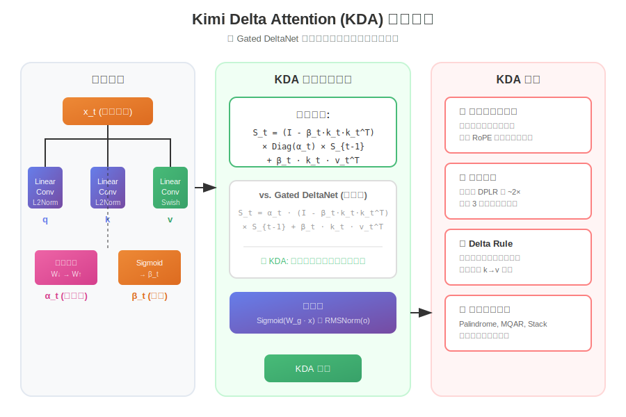

# Kimi Linear: 一种表达力强、效率高的注意力架构

> **论文标题**: Kimi Linear: An Expressive, Efficient Attention Architecture  
> **发表信息**: arXiv:2510.26692, 2025年10月  
> **作者团队**: Kimi Team (Moonshot AI)  
> **一句话总结**: Kimi 团队提出的混合线性注意力架构，首次在公平对比下全面超越全注意力，同时实现 6 倍解码加速和 75% KV cache 节省

---

## 📖 目录

- [这篇论文在讲什么？](#这篇论文在讲什么)
- [为什么这篇论文很重要？](#为什么这篇论文很重要)
- [核心方法详解](#核心方法详解)
  - [什么是线性注意力？](#什么是线性注意力)
  - [Delta Rule：让模型学会纠错](#delta-rule让模型学会纠错)
  - [KDA：细粒度的记忆控制](#kda细粒度的记忆控制)
  - [混合架构：3:1 的黄金比例](#混合架构31-的黄金比例)
- [实验结果](#实验结果)
- [示例代码](#示例代码)
- [局限性与未来工作](#局限性与未来工作)
- [总结与思考](#总结与思考)
- [参考资料](#参考资料)

---

## 这篇论文在讲什么？

想象你在图书馆找一本书。标准的 Transformer 注意力机制就像一个**超级记忆力的图书管理员**——他能记住图书馆里每一本书的位置，无论你问什么都能精确找到。但问题是，当图书馆越来越大（序列越来越长），他需要的"脑容量"也会爆炸式增长。

而**线性注意力**更像一个用**笔记本记录**的图书管理员——他只维护一个固定大小的笔记本，每看到一本新书就在笔记本上更新记录。这样效率很高，但问题是笔记本容量有限，记录太多就会混乱。

**Kimi Linear** 提出了一个更聪明的图书管理员：
1. **有选择地遗忘** - 不重要的书可以从笔记本里划掉（细粒度遗忘门）
2. **会自我纠错** - 发现记错了能及时修正（Delta Rule）
3. **偶尔翻翻全部书架** - 每记录 3 次笔记，就全面检查一次书架（3:1 混合架构）


---

## 为什么这篇论文很重要？

### 🎯 首次全面超越全注意力

这是**第一次**有线性注意力架构在公平对比下（相同训练数据、相同参数量）全面超越全注意力（MLA），包括：
- 短上下文任务（4k tokens）
- 长上下文任务（128k tokens）
- 强化学习训练场景

| 任务 | MLA (全注意力) | Kimi Linear |
|------|---------------|-------------|
| MMLU-Pro (4k) | 47.2 | **51.0** (+3.8) |
| RULER (128k) | 81.3 | **84.3** (+3.0) |
| AIME 2025 | 20.6% | **21.3%** |

### ⚡ 惊人的效率提升

在 1M（百万）tokens 的长上下文场景下：
- **KV Cache 节省 75%** - 内存占用大幅降低
- **解码加速 6.3×** - 生成速度快了 6 倍多
- **预填充加速 2.9×** - 处理长输入也更快

> **知识点补充 - KV Cache**  
> 在 Transformer 推理时，需要存储之前所有 token 的 Key 和 Value 向量，用于计算注意力。这部分缓存会随着序列长度线性增长，是长序列推理的主要内存瓶颈。Kimi Linear 通过线性注意力的固定状态大小，大幅减少了这部分开销。

### 🔓 完全开源

Moonshot AI 开源了：
- KDA 内核实现（flash-linear-attention）
- vLLM 推理集成
- 预训练和指令微调模型权重（48B 参数）

---

## 核心方法详解

### 什么是线性注意力？

标准 Softmax 注意力的计算复杂度是 **O(T²)**，其中 T 是序列长度。这意味着序列长度翻倍，计算量会变成 4 倍！

线性注意力的核心思想是维护一个**固定大小的记忆矩阵 S**：

```
标准注意力（慢）:  o_t = Σ softmax(q·k) × v  -- 需要和所有历史 k 计算
线性注意力（快）:  S_t = S_{t-1} + k_t × v_t^T  -- 只更新一个矩阵
                   o_t = S_t × q_t              -- 直接用矩阵查询
```

**大白话翻译**：标准注意力像是每次都要翻遍整个图书馆，而线性注意力像是维护一个索引卡片盒，新书来了就加一张卡片。

### Delta Rule：让模型学会纠错

纯粹的线性注意力有个问题——它只会**累加**新信息，不会**修正**错误的记忆。这就像图书管理员的笔记本只会越写越多，写错了也不改。

**DeltaNet** 引入了 Delta Rule（梯度下降思想）：

```python
# 传统线性注意力：只会累加
S_t = S_{t-1} + k_t @ v_t.T

# DeltaNet：会纠错
# 如果 S 记录的 k->v 映射不准确，就修正它
error = S_{t-1}.T @ k_t - v_t  # 计算记忆误差
S_t = S_{t-1} - beta * k_t @ error.T + beta * k_t @ v_t.T
# 简化后：
S_t = (I - beta * k_t @ k_t.T) @ S_{t-1} + beta * k_t @ v_t.T
```

**大白话翻译**：Delta Rule 就像给图书管理员一支**橡皮擦**——发现索引卡片记错了，可以擦掉重写。

### KDA：细粒度的记忆控制

**Gated DeltaNet** 在 Delta Rule 基础上加入了"遗忘门"α，让模型学会忘记不重要的信息。但它的遗忘门是**标量**——所有维度用同一个遗忘率。

**Kimi Delta Attention (KDA)** 的核心创新是**细粒度通道级遗忘**：

```python
# Gated DeltaNet：所有维度同一个遗忘率
S_t = alpha_t * (I - beta * k @ k.T) @ S_{t-1} + beta * k @ v.T

# KDA：每个维度独立遗忘率
S_t = (I - beta * k @ k.T) @ Diag(alpha_t) @ S_{t-1} + beta * k @ v.T
# alpha_t 是一个向量，每个维度有自己的遗忘率！
```



**为什么这很重要？** 

想象你在记笔记，有些信息（比如人名）需要长期记住，有些信息（比如今天的天气）很快就可以忘掉。KDA 让模型的每个"神经元"都能独立决定自己的记忆周期。

> **知识点补充 - 与 RoPE 的类比**  
> 论文指出，KDA 的细粒度遗忘门实际上类似于 RoPE 位置编码的作用。RoPE 给每对维度分配不同的旋转频率，KDA 给每个维度分配不同的遗忘率。两者都实现了"细粒度的位置感知"，只是 KDA 是数据相关的、可学习的。

### 混合架构：3:1 的黄金比例

纯线性注意力虽然快，但在精确检索任务上仍然弱于全注意力。Kimi Linear 采用**混合架构**：

```
[KDA 层] → [KDA 层] → [KDA 层] → [MLA 层] → 重复 N 次
    ^           ^           ^           ^
  线性注意力   线性注意力   线性注意力   全注意力(NoPE)
```

**关键设计**：
1. **3:1 比例** - 3 个 KDA 层 + 1 个 MLA 层是最优配比
2. **NoPE (无位置编码)** - MLA 层不使用 RoPE，让 KDA 负责所有位置编码
3. **MLA** - 使用 DeepSeek 的 Multi-Head Latent Attention，在保持能力的同时节省 KV cache


**为什么 NoPE？**
- KDA 本身就像一个"可学习的位置编码"
- 去掉 MLA 的 RoPE 后，长序列外推更容易
- MLA 可以转换为更高效的 Multi-Query Attention

---

## 实验结果

### 合成任务：KDA 更聪明

在三个挑战性的合成任务上，KDA 显著优于 Gated DeltaNet 和 Mamba2：

| 任务 | 说明 | KDA 表现 |
|------|------|----------|
| **Palindrome** | 反转输入序列（如 "ABCD" → "DCBA"） | 2048 长度仍保持高准确率 |
| **MQAR** | 多查询关联检索 | 收敛速度最快 |
| **Stack** | 模拟 64 个独立栈的 push/pop 操作 | 状态追踪能力最强 |

### 预训练对比：全面领先

使用 1.4T tokens 训练，Kimi Linear 在几乎所有任务上超越 MLA 基线：

**通用任务**:
- HellaSwag: 82.9 (vs MLA 81.7)
- BBH: 72.9 (vs MLA 71.6)  
- MMLU: 73.8 (vs MLA 71.6)
- MMLU-Pro: **51.0** (vs MLA 47.2)

**数学和代码**:
- GSM8K: 83.9 (vs MLA 83.7)
- CRUXEval-O-cot: 62.0 (vs MLA 61.5)

### 长上下文：优势明显

在 128k 上下文评测中，Kimi Linear 达到最高平均分：

| 模型 | RULER | MRCR | RepoQA | 平均 |
|------|-------|------|--------|------|
| MLA | 81.3 | 22.6 | 63.0 | 52.2 |
| GDN-H | 80.5 | 23.9 | 63.0 | 51.2 |
| **Kimi Linear** | **84.3** | **29.6** | **68.5** | **54.5** |

### 强化学习：收敛更快

在数学 RL 训练中，Kimi Linear 的训练和测试准确率都显著高于 MLA，说明它更适合 RL 场景的长序列生成。

---

## 示例代码

### KDA 核心计算（简化版）

```python
def kda_recurrent(q, k, v, alpha, beta, S_prev):
    """
    Kimi Delta Attention 的递归形式
    
    参数:
        q: 查询向量 [d_k]
        k: 键向量 [d_k] (已 L2 归一化)
        v: 值向量 [d_v]
        alpha: 细粒度遗忘门 [d_k]
        beta: 学习率 (标量)
        S_prev: 上一步的状态矩阵 [d_k, d_v]
    
    返回:
        o: 输出向量 [d_v]
        S: 更新后的状态矩阵 [d_k, d_v]
    """
    # 细粒度遗忘：每个维度独立衰减
    S_decayed = torch.diag(alpha) @ S_prev
    
    # Delta Rule 更新：先"擦除"旧的 k 关联，再写入新的
    # (I - beta * k @ k.T) 是 Householder 变换
    S = (torch.eye(d_k) - beta * k.outer(k)) @ S_decayed + beta * k.outer(v)
    
    # 查询输出
    o = S.T @ q
    
    return o, S
```

### Chunk-wise 并行计算（高效版）

```python
def chunk_kda(q, k, v, g, beta, chunk_size=64):
    """
    KDA 的分块并行算法
    
    核心思想：
    1. 将序列分成多个 chunk
    2. chunk 内部使用 WY 表示法并行计算
    3. chunk 之间串行更新状态
    """
    B, T, H, K = q.shape
    V = v.shape[-1]
    N = T // chunk_size
    
    # 重排为 chunk 格式
    q, k, v, g, beta = [
        rearrange(x, 'b (n c) h ... -> b h n c ...', c=chunk_size)
        for x in [q, k, v, g, beta]
    ]
    
    # 计算累积遗忘因子
    g_cumsum = g.cumsum(dim=-2)
    
    # 初始化状态
    S = torch.zeros(B, H, K, V, device=q.device)
    
    # 构建 chunk 内的注意力矩阵
    # 使用 WY 表示法压缩 Householder 变换序列
    M = build_wy_matrix(k, g_cumsum, beta)  # 矩阵逆
    w = M @ (g_cumsum.exp() * k)  # 辅助向量
    u = M @ v
    
    outputs = []
    for i in range(N):
        # Inter-chunk: 从状态中读取
        o_inter = (q[:,:,i] * g_cumsum[:,:,i].exp()) @ S
        
        # Intra-chunk: chunk 内部并行计算
        A_intra = compute_intra_attention(q[:,:,i], k[:,:,i], g_cumsum[:,:,i])
        o_intra = A_intra @ (u[:,:,i] - w[:,:,i] @ S)
        
        outputs.append(o_inter + o_intra)
        
        # 更新状态
        decay = g_cumsum[:,:,i,-1:].exp()
        S = S * decay + (k[:,:,i] * decay).transpose(-1,-2) @ (u[:,:,i] - w[:,:,i] @ S)
    
    return torch.cat(outputs, dim=2)
```

### 使用预训练模型

```python
from transformers import AutoModelForCausalLM, AutoTokenizer

# 加载 Kimi Linear 48B 模型
model = AutoModelForCausalLM.from_pretrained(
    "moonshotai/Kimi-Linear-48B-A3B-Instruct",
    device_map="auto",
    torch_dtype=torch.bfloat16
)
tokenizer = AutoTokenizer.from_pretrained("moonshotai/Kimi-Linear-48B-A3B-Instruct")

# 生成（支持超长上下文）
prompt = "请解释什么是线性注意力机制..."
inputs = tokenizer(prompt, return_tensors="pt").to("cuda")
outputs = model.generate(**inputs, max_new_tokens=1000)
print(tokenizer.decode(outputs[0]))
```

---

## 局限性与未来工作

### 论文提到的局限

1. **精确检索仍有差距** - 尽管 KDA 显著改进，纯线性注意力在"大海捞针"类任务上仍不如全注意力
2. **训练复杂度** - 混合架构需要仔细调整层间比例和其他超参数
3. **硬件适配** - 虽然理论上更高效，但需要专门的内核优化才能发挥全部潜力

### 未来研究方向

- **稀疏注意力融合** - 论文提到线性注意力和稀疏注意力可以互补
- **状态扩展** - 通过更大的状态矩阵提升检索能力
- **自适应比例** - 动态调整 KDA:MLA 比例

---

## 总结与思考

### 核心贡献

1. **KDA (Kimi Delta Attention)** - 首个细粒度通道级遗忘的 Delta Rule 变体
2. **混合架构** - 3:1 的 KDA:MLA 比例在质量和效率间取得最佳平衡
3. **全面超越** - 首次在公平对比下线性注意力全面击败全注意力
4. **完全开源** - 内核、模型权重全部开放

### 我的思考

🤔 **为什么之前的线性注意力做不到？**

关键在于 KDA 的三个创新完美配合：
- 细粒度遗忘让模型能精确控制记忆周期
- Delta Rule 让模型能纠正错误记忆
- 混合架构弥补了纯线性注意力的检索短板

🚀 **对行业的影响**

Kimi Linear 的成功表明，线性注意力终于可以作为全注意力的**替代品**而非**妥协方案**使用了。这对于：
- **长上下文推理**（代理、工具调用）
- **边缘设备部署**（内存受限）
- **高吞吐服务**（降低推理成本）

都是重大利好。

📈 **Scaling Law 启示**

论文显示 Kimi Linear 的 scaling curve 比 MLA 更陡峭，意味着在更大规模上优势可能更明显。这可能改变大模型的架构选择。

---

## 参考资料

- **论文原文**: [arXiv:2510.26692](https://arxiv.org/abs/2510.26692)
- **GitHub 仓库**: [MoonshotAI/Kimi-Linear](https://github.com/MoonshotAI/Kimi-Linear)
- **KDA 内核**: [fla-org/flash-linear-attention](https://github.com/fla-org/flash-linear-attention/tree/main/fla/ops/kda)
- **模型权重**: [Hugging Face](https://huggingface.co/moonshotai/Kimi-Linear-48B-A3B-Instruct)
- **相关论文**:
  - Gated DeltaNet (ICLR 2025)
  - Gated Linear Attention (ICML 2024)
  - Mamba2 (2024)
  - DeepSeek-V3 MLA (2024)
