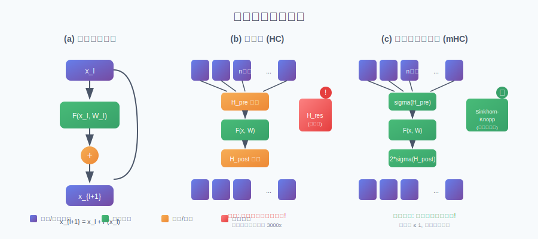
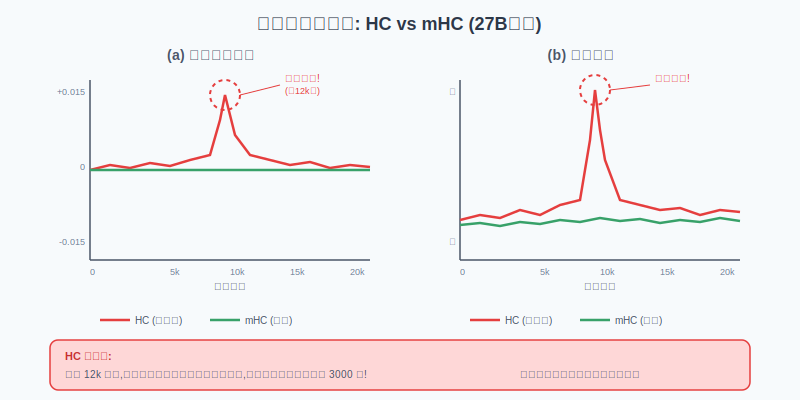
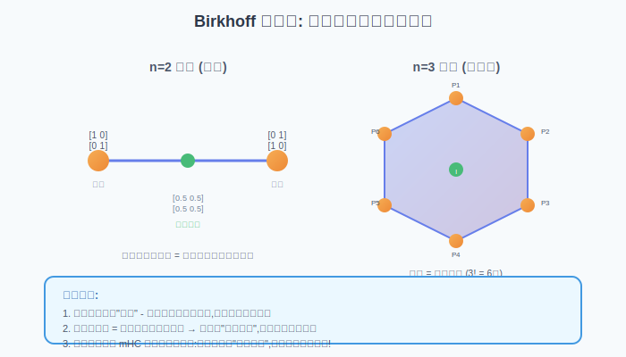
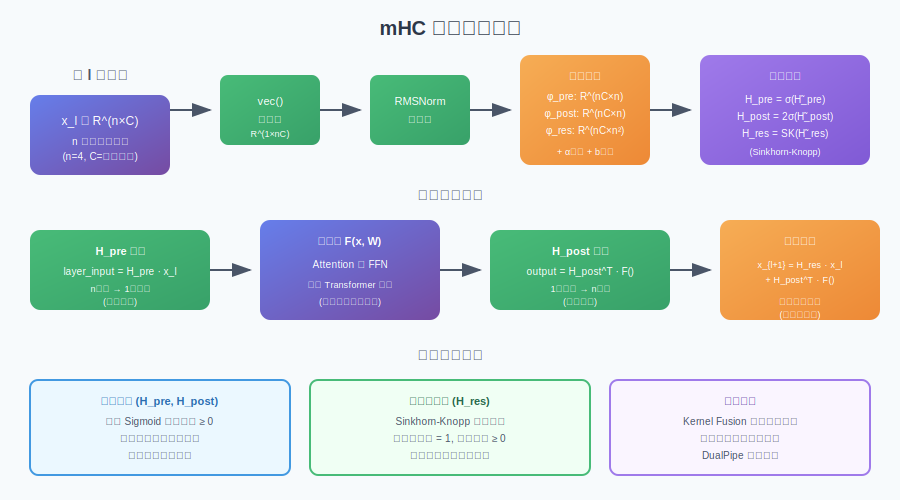
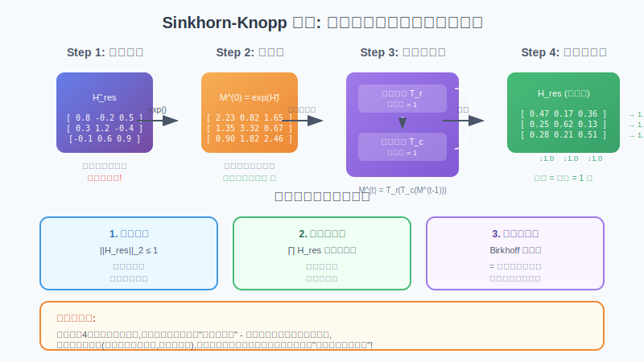
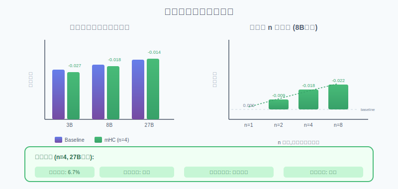

# mHC: 流形约束超连接 - 大白话解读

**Manifold-Constrained Hyper-Connections**

---

**论文信息**
- **标题**: mHC: Manifold-Constrained Hyper-Connections
- **作者**: Zhenda Xie (解振达), Yixuan Wei (韦毅轩), Huanqi Cao 等 | DeepSeek-AI
- **发表时间**: 2026年1月1日 (arXiv:2512.24880)
- **通讯作者**: 解振达 (xie.zhenda@deepseek.com)
- **特别说明**: 梁文锋署名于作者列表

**一句话总结**: DeepSeek 提出了一种新的神经网络架构改进方案，通过将残差连接矩阵约束在"双随机矩阵"流形上，解决了超连接(HC)在大规模训练时的不稳定问题，同时保持了性能优势，仅增加约 6.7% 的训练时间开销。

---

## 目录

- [这篇论文在讲什么？](#这篇论文在讲什么)
- [为什么这篇论文很重要？](#为什么这篇论文很重要)
- [背景知识：残差连接与超连接](#背景知识残差连接与超连接)
- [核心问题：超连接为什么不稳定？](#核心问题超连接为什么不稳定)
- [mHC 的解决方案](#mhc-的解决方案)
- [Sinkhorn-Knopp 算法详解](#sinkhorn-knopp-算法详解)
- [工程优化](#工程优化)
- [实验结果](#实验结果)
- [代码示例](#代码示例)
- [局限性与未来工作](#局限性与未来工作)
- [总结与思考](#总结与思考)
- [参考资料](#参考资料)

---

## 这篇论文在讲什么？

想象你在玩一个"传话游戏"——第一个人说一句话，一个接一个传下去。如果每个人都原封不动地传递（**恒等映射**），最后一个人听到的就是原话。但如果每个人都会"添油加醋"（**放大信号**），传到最后可能就变成完全不一样的内容了。

这篇论文要解决的就是深度神经网络中类似的问题：



**传统残差连接**（图a）就像"原封不动传话"——每层的输出 = 输入 + 这层学到的内容。这样保证了信号能稳定地在网络中传播。

**超连接 HC**（图b）想要更强大，搞了多条"传话通道"，还让它们互相交流。这确实能提升性能，但问题来了——每层都有一个"混合矩阵"来调整各通道的信号，多层累积下来，信号可能被放大 3000 倍！这就导致训练时梯度爆炸，模型崩溃。

**mHC**（图c）的核心思想很简单：给那个"混合矩阵"加个约束，让它只能做"加权平均"而不能"无限放大"。具体方法是把矩阵投影到"双随机矩阵"空间——一种特殊的矩阵，每行每列的和都等于1。

> **知识点补充 - 双随机矩阵 (Doubly Stochastic Matrix)**  
> 双随机矩阵是一种所有元素非负、且每行每列的和都等于1的方阵。比如：
> ```
> [0.5  0.3  0.2]
> [0.2  0.5  0.3]  每行和 = 1，每列和 = 1
> [0.3  0.2  0.5]
> ```
> 这种矩阵乘以一个向量，相当于对向量元素做"加权平均"，不会放大信号！

---

## 为什么这篇论文很重要？

| 方面 | 意义 |
|------|------|
| **架构创新** | 动了 Transformer 十年没人敢动的"地基"——残差连接 |
| **实用性强** | 在 27B 模型上仅增加 6.7% 训练开销，可以直接用于大规模训练 |
| **理论扎实** | 用流形约束提供了数学上的稳定性保证 |
| **工程完整** | 不仅提出方法，还做了完整的工程优化（Kernel Fusion、通信优化等）|
| **DeepSeek 出品** | 梁文锋署名，代表 DeepSeek 在基础架构上的持续探索 |

简单来说，这篇论文告诉我们：**扩展残差流宽度是一个值得探索的模型扩展方向**，而且通过巧妙的数学约束，可以在保持性能提升的同时避免训练不稳定。

---

## 背景知识：残差连接与超连接

### 传统残差连接

2015年，何恺明提出了 ResNet，其中的残差连接成为了深度学习的基石：

$$\mathbf{x}_{l+1} = \mathbf{x}_l + \mathcal{F}(\mathbf{x}_l, \mathcal{W}_l)$$

> **大白话翻译**: 下一层的输出 = 这一层的输入 + 这一层学到的东西

这个简单的公式有一个神奇的性质——**恒等映射**。不管网络有多深，原始输入的信息都可以"直达"最后一层，不会在传递过程中消失或爆炸。

### 超连接 (Hyper-Connections)

2024年，字节跳动提出了超连接（HC），想法是：既然一条残差流很好，那多条会不会更好？

$$\mathbf{x}_{l+1} = \mathcal{H}_l^{res}\mathbf{x}_l + \mathcal{H}_l^{post\top}\mathcal{F}(\mathcal{H}_l^{pre}\mathbf{x}_l, \mathcal{W}_l)$$

这里引入了三个新矩阵：
- **H_pre**: 从 n 条流聚合成 1 条输入给层函数
- **H_post**: 把层函数的输出分发回 n 条流
- **H_res**: 让 n 条流之间互相交换信息

| 组件 | 作用 | 形状 |
|------|------|------|
| H_pre | 聚合 n 条流 → 1 条输入 | R^(1×n) |
| H_post | 分发 1 条输出 → n 条流 | R^(1×n) |
| H_res | 流之间信息混合 | R^(n×n) |

实验表明，H_res 对性能提升贡献最大——说明"让不同深度的信息互相交流"确实很重要。

---

## 核心问题：超连接为什么不稳定？

问题出在 H_res 矩阵上。当我们把 HC 扩展到多层时：

$$\mathbf{x}_L = \left(\prod_{i=1}^{L-l}\mathcal{H}_{L-i}^{res}\right)\mathbf{x}_l + \sum_{i=l}^{L-1}(\cdots)$$

那个累积乘积 $\prod \mathcal{H}^{res}$ 是关键！如果每个 H_res 都稍微放大一点信号，累积起来就是指数级爆炸。



DeepSeek 在 27B 模型上的实验清楚地展示了这个问题：

1. **损失飙升**: 在约 12k 步时，HC 的损失突然暴涨
2. **梯度爆炸**: 梯度范数出现极端值
3. **信号放大**: 累积的 H_res 乘积的最大行/列和高达 **3000**！

> **大白话理解**:  
> 想象你在银行存钱，每天利率是 1.01（放大 1%）。一天后是 1.01 倍，一年后就是 1.01^365 ≈ 37 倍，十年后是 1.01^3650 ≈ **2.6亿倍**！  
> HC 的问题就类似——每层都略微放大信号，累积 50+ 层后就爆炸了。

---

## mHC 的解决方案

mHC 的核心思想是给 H_res 加个"紧箍咒"：把它约束在**双随机矩阵**空间内。

### 双随机矩阵的三大优点



| 性质 | 数学表述 | 实际意义 |
|------|----------|----------|
| **范数保持** | ‖H_res‖₂ ≤ 1 | 信号经过后不会被放大 |
| **乘法封闭** | 双随机 × 双随机 = 双随机 | 多层累积后仍然稳定 |
| **凸组合** | 是置换矩阵的凸包 | 相当于"加权洗牌"，混合信息但不放大 |

> **知识点补充 - Birkhoff 多面体**  
> 所有 n×n 双随机矩阵构成的集合叫做 Birkhoff 多面体。它的顶点是所有的置换矩阵（每行每列恰好一个1，其余全0）。任何双随机矩阵都可以表示为这些置换矩阵的凸组合。
>
> 置换矩阵只是"洗牌"——改变元素顺序但不改变值。所以双随机矩阵相当于"加权洗牌"，同样不会放大信号！

### mHC 的完整公式



**Step 1**: 计算动态系数

$$\tilde{\mathcal{H}}_l^{pre} = \alpha_l^{pre} \cdot (\vec{\mathbf{x}}'_l \varphi_l^{pre}) + \mathbf{b}_l^{pre}$$

**Step 2**: 应用约束

$$\mathcal{H}_l^{pre} = \sigma(\tilde{\mathcal{H}}_l^{pre})$$  （Sigmoid 确保非负）

$$\mathcal{H}_l^{post} = 2\sigma(\tilde{\mathcal{H}}_l^{post})$$

$$\mathcal{H}_l^{res} = \text{Sinkhorn-Knopp}(\tilde{\mathcal{H}}_l^{res})$$  （投影到双随机矩阵）

**Step 3**: 前向传播

$$\mathbf{x}_{l+1} = \mathcal{H}_l^{res}\mathbf{x}_l + \mathcal{H}_l^{post\top}\mathcal{F}(\mathcal{H}_l^{pre}\mathbf{x}_l, \mathcal{W}_l)$$

---

## Sinkhorn-Knopp 算法详解

这是 mHC 的核心：如何把任意矩阵投影到双随机矩阵空间？



### 算法步骤

```
输入: 任意矩阵 H̃_res
输出: 双随机矩阵 H_res

1. 指数化: M^(0) = exp(H̃_res)     // 让所有元素变成正数

2. 交替归一化 (重复 t_max = 20 次):
   for t = 1 to 20:
       M^(t) = 列归一化(行归一化(M^(t-1)))
       
3. 输出: H_res = M^(20)
```

### 直观理解

想象你有一个 4×4 的表格，要求每行每列的和都等于1：

```
初始（随机数）:          目标（双随机矩阵）:
[2.3  0.8  1.6  0.5]     [0.47  0.17  0.22  0.14]
[1.4  3.3  0.7  1.2]  →  [0.21  0.49  0.10  0.20]
[0.9  1.8  2.5  0.8]     [0.15  0.23  0.43  0.19]
[1.1  0.6  1.3  2.1]     [0.17  0.11  0.25  0.47]
```

Sinkhorn-Knopp 的做法很简单：
1. 先让每行和=1（行归一化）
2. 再让每列和=1（列归一化）
3. 重复以上步骤直到收敛

> **为什么有效？**  
> 这个算法保证收敛到双随机矩阵。直观上，每次归一化都在"修正"一个维度的不平衡，反复修正最终会达到平衡。

---

## 工程优化

光有数学方案还不够，大规模训练需要高效的工程实现。DeepSeek 做了三个层面的优化：

### 1. Kernel Fusion（算子融合）

问题：HC 增加了很多小操作，每个操作都要读写显存，开销很大。

解决：把多个操作融合成一个 CUDA kernel，减少显存访问次数。

```python
# 原本（多次显存访问）:
x_norm = rms_norm(x)           # 读 x, 写 x_norm
h_pre = linear(x_norm, phi)    # 读 x_norm, 写 h_pre
h_pre = sigmoid(h_pre)         # 读 h_pre, 写 h_pre

# 融合后（一次 kernel）:
h_pre = fused_mhc_kernel(x, phi)  # 读 x, phi, 写 h_pre
```

### 2. 选择性重计算（Recomputing）

问题：HC 的中间激活值很多，显存不够用。

解决：不存储中间结果，反向传播时重新计算。对于 mHC 这种计算量小但显存大的操作特别有效。

### 3. DualPipe 通信优化

问题：HC 的 n 条流需要 n 倍的通信量，导致流水线气泡变大。

解决：精心设计通信调度，让计算和通信重叠进行。

**最终结果**: n=4 时，mHC 只增加 **6.7%** 的训练时间开销！

---

## 实验结果



### 主要发现

| 模型规模 | 基线损失 | mHC 损失提升 | 说明 |
|----------|----------|--------------|------|
| 3B | - | -0.027 | 小模型也有明显提升 |
| 8B | - | -0.018 | 中等规模 |
| 27B | - | -0.014 | 大规模仍然稳定 |

### 扩展率 n 的影响

| n | 损失提升 | 额外开销 |
|---|----------|----------|
| 1 | 0 | 0% |
| 2 | -0.009 | ~3% |
| 4 | -0.018 | ~6.7% |
| 8 | -0.022 | ~12% |

结论：**n 越大性能越好，但开销也越大。n=4 是一个不错的平衡点。**

### 稳定性对比

| 方法 | 信号放大倍数 | 训练稳定性 |
|------|--------------|------------|
| HC | 最高 3000x | 在 12k 步崩溃 |
| mHC | 始终 ≤ 1 | 全程稳定 |

---

## 代码示例

### PyTorch 伪代码实现

```python
import torch
import torch.nn as nn
import torch.nn.functional as F


def sinkhorn_knopp(log_matrix: torch.Tensor, num_iters: int = 20) -> torch.Tensor:
    """
    Sinkhorn-Knopp 算法：将矩阵投影到双随机矩阵空间
    
    Args:
        log_matrix: 对数空间的输入矩阵 (n, n)
        num_iters: 迭代次数，论文中使用 20
    
    Returns:
        双随机矩阵 (n, n)，每行每列和都等于 1
    """
    # 先指数化，让所有元素变成正数
    M = torch.exp(log_matrix)
    
    # 交替行列归一化
    for _ in range(num_iters):
        # 行归一化：让每行的和等于 1
        M = M / M.sum(dim=-1, keepdim=True)
        # 列归一化：让每列的和等于 1
        M = M / M.sum(dim=-2, keepdim=True)
    
    return M


class mHC(nn.Module):
    """
    流形约束超连接 (Manifold-Constrained Hyper-Connections)
    
    这是 mHC 的核心模块，用于替代标准的残差连接
    """
    
    def __init__(self, hidden_dim: int, n_streams: int = 4):
        """
        Args:
            hidden_dim: 隐藏层维度 C
            n_streams: 并行残差流的数量 n，论文推荐 n=4
        """
        super().__init__()
        self.n = n_streams
        self.hidden_dim = hidden_dim
        
        # 动态映射的线性投影
        # 输入是展平后的 (n * C) 维向量
        input_dim = n_streams * hidden_dim
        
        # H_pre 投影：用于聚合 n 条流到 1 条
        self.phi_pre = nn.Linear(input_dim, n_streams, bias=False)
        
        # H_post 投影：用于分发 1 条输出到 n 条流
        self.phi_post = nn.Linear(input_dim, n_streams, bias=False)
        
        # H_res 投影：用于流之间的信息混合
        self.phi_res = nn.Linear(input_dim, n_streams * n_streams, bias=False)
        
        # 静态偏置
        self.b_pre = nn.Parameter(torch.zeros(n_streams))
        self.b_post = nn.Parameter(torch.zeros(n_streams))
        self.b_res = nn.Parameter(torch.zeros(n_streams, n_streams))
        
        # 门控缩放因子（初始化为较小值）
        self.alpha_pre = nn.Parameter(torch.tensor(0.1))
        self.alpha_post = nn.Parameter(torch.tensor(0.1))
        self.alpha_res = nn.Parameter(torch.tensor(0.1))
        
        # RMSNorm
        self.rms_norm = nn.RMSNorm(input_dim)
    
    def compute_mappings(self, x: torch.Tensor):
        """
        计算三个约束后的映射矩阵
        
        Args:
            x: 输入张量 (batch, n, hidden_dim)
        
        Returns:
            H_pre: (batch, 1, n) 聚合权重
            H_post: (batch, 1, n) 分发权重
            H_res: (batch, n, n) 残差混合矩阵
        """
        batch_size = x.shape[0]
        
        # 展平为 (batch, n * hidden_dim)
        x_flat = x.view(batch_size, -1)
        
        # RMSNorm 归一化
        x_norm = self.rms_norm(x_flat)
        
        # 计算动态映射 + 静态偏置
        h_pre_raw = self.alpha_pre * self.phi_pre(x_norm) + self.b_pre
        h_post_raw = self.alpha_post * self.phi_post(x_norm) + self.b_post
        h_res_raw = self.alpha_res * self.phi_res(x_norm).view(batch_size, self.n, self.n) + self.b_res
        
        # 应用约束
        # H_pre 和 H_post: Sigmoid 保证非负
        H_pre = torch.sigmoid(h_pre_raw).unsqueeze(1)  # (batch, 1, n)
        H_post = 2 * torch.sigmoid(h_post_raw).unsqueeze(1)  # (batch, 1, n)
        
        # H_res: Sinkhorn-Knopp 投影到双随机矩阵
        H_res = sinkhorn_knopp(h_res_raw)  # (batch, n, n)
        
        return H_pre, H_post, H_res
    
    def forward(self, x: torch.Tensor, layer_fn) -> torch.Tensor:
        """
        前向传播
        
        Args:
            x: 输入张量 (batch, n, hidden_dim) - n 条并行残差流
            layer_fn: 层函数 F（可以是 Attention 或 FFN）
        
        Returns:
            输出张量 (batch, n, hidden_dim)
        """
        # 计算约束后的映射矩阵
        H_pre, H_post, H_res = self.compute_mappings(x)
        
        # Step 1: H_pre 聚合 - 从 n 条流聚合成 1 条输入
        # (batch, 1, n) @ (batch, n, hidden_dim) -> (batch, 1, hidden_dim)
        layer_input = torch.bmm(H_pre, x).squeeze(1)  # (batch, hidden_dim)
        
        # Step 2: 通过层函数 F（Attention 或 FFN）
        layer_output = layer_fn(layer_input)  # (batch, hidden_dim)
        
        # Step 3: H_post 分发 - 把输出分发回 n 条流
        # (batch, hidden_dim, 1) @ (batch, 1, n) -> (batch, hidden_dim, n)
        distributed = layer_output.unsqueeze(-1) * H_post.transpose(-1, -2)  # (batch, hidden_dim, n)
        distributed = distributed.transpose(-1, -2)  # (batch, n, hidden_dim)
        
        # Step 4: H_res 残差混合 - 流之间信息交换
        # (batch, n, n) @ (batch, n, hidden_dim) -> (batch, n, hidden_dim)
        residual = torch.bmm(H_res, x)
        
        # 最终输出：残差混合 + 层函数输出
        output = residual + distributed
        
        return output


# 使用示例
if __name__ == "__main__":
    batch_size = 2
    hidden_dim = 512
    n_streams = 4
    
    # 创建 mHC 模块
    mhc = mHC(hidden_dim=hidden_dim, n_streams=n_streams)
    
    # 创建一个简单的层函数（这里用 Linear 模拟）
    layer_fn = nn.Linear(hidden_dim, hidden_dim)
    
    # 输入：n 条并行残差流
    x = torch.randn(batch_size, n_streams, hidden_dim)
    
    # 前向传播
    output = mhc(x, layer_fn)
    
    print(f"输入形状: {x.shape}")
    print(f"输出形状: {output.shape}")
    
    # 验证 H_res 是否真的是双随机矩阵
    with torch.no_grad():
        H_pre, H_post, H_res = mhc.compute_mappings(x)
        print(f"\nH_res 形状: {H_res.shape}")
        print(f"H_res 行和: {H_res[0].sum(dim=-1)}")  # 应该全是 1
        print(f"H_res 列和: {H_res[0].sum(dim=-2)}")  # 应该全是 1
```

运行结果示例：
```
输入形状: torch.Size([2, 4, 512])
输出形状: torch.Size([2, 4, 512])

H_res 形状: torch.Size([2, 4, 4])
H_res 行和: tensor([1.0000, 1.0000, 1.0000, 1.0000])
H_res 列和: tensor([1.0000, 1.0000, 1.0000, 1.0000])
```

---

## 局限性与未来工作

### 当前局限性

1. **额外开销仍存在**: 虽然只有 6.7%，但对于超大规模训练来说仍然显著
2. **需要工程优化**: 要达到论文的效率需要精心的 kernel 实现
3. **最优 n 值未知**: 不同模型规模可能有不同的最优扩展率

### 未来方向

1. **更高效的双随机投影**: 能否用更少的迭代次数？
2. **与其他架构结合**: MoE、MLA 等与 mHC 的结合
3. **自适应 n**: 能否根据层的位置动态调整扩展率？
4. **理论分析**: 双随机约束对模型表达能力的影响

---

## 总结与思考

### 核心贡献

1. **发现问题**: 超连接的训练不稳定性来源于 H_res 矩阵的累积放大效应
2. **提出方案**: 用双随机矩阵约束恢复恒等映射特性
3. **工程落地**: 通过 Kernel Fusion、重计算、通信优化实现高效实现

### 个人思考

这篇论文给我的启发是：

1. **约束有时候是好事**: 看似限制了模型的自由度，实际上带来了稳定性
2. **数学工具很重要**: Birkhoff 多面体、Sinkhorn-Knopp 算法——这些经典数学工具在深度学习中找到了新应用
3. **工程与理论并重**: 一个好的方法不仅要在理论上站得住脚，还要能高效实现

DeepSeek 用这篇论文展示了他们在基础架构探索上的能力。残差连接是深度学习的基石，敢于在这里动刀子并且做成功，说明他们有足够的技术实力和对基础研究的重视。

---

## 参考资料

### 论文链接
- **arXiv**: https://arxiv.org/abs/2512.24880
- **PDF**: https://arxiv.org/pdf/2512.24880

### 相关工作
- **ResNet** (何恺明, 2015): 残差连接的开创性工作
- **Hyper-Connections** (字节跳动, 2024): mHC 的前身
- **DeepSeek-V3** (2024): mHC 的工程基础设施（DualPipe 等）

### 延伸阅读
- [新智元: DeepSeek 要发大招了，梁文锋署名新论文！](https://www.163.com/dy/article/KI767KU00511ABV6.html)
- [小宇宙播客: DeepSeek元旦论文解读](https://www.xiaoyuzhoufm.com/episode/695a6f7cb9fb626141035193)
- [腾讯云: 从贝叶斯视角解读Transformer的内部几何](https://cloud.tencent.com.cn/developer/article/2615234)

---

*本解读文档由 AI 生成，基于 arXiv:2512.24880 论文内容。如有错误请以原论文为准。*
