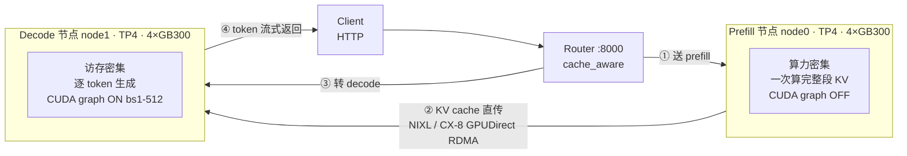
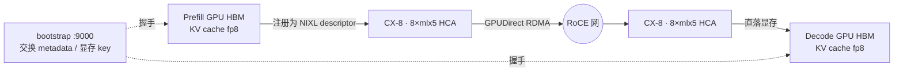
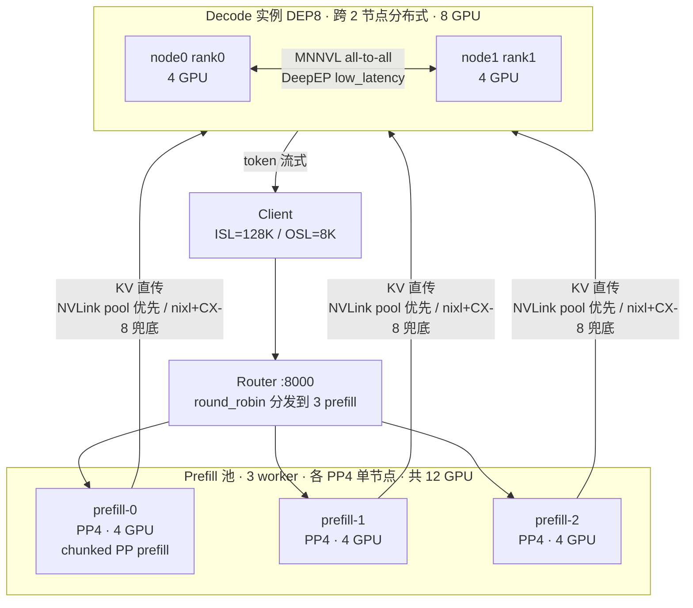

# SGLang R1-NVFP4 GB300 复现 — 实测 RUN LOG

> 配套 [`sglang-r1-nvfp4-128k-gb300.md`](./sglang-r1-nvfp4-128k-gb300.md) 的实测流水账。
> 记录：每步用的命令、结果、踩的坑、怎么修、最终 benchmark。一轮一轮从小到大。

集群：`gke_tencent-gcp-taiji-poc_us-central1_gb300-gke-test`（kubectl 走 `ssh glinux $HOME/google-cloud-sdk/bin/kubectl`）

---

## 配置 × Benchmark 对比总表（核心产出，每跑一轮填一行）

> **用途**：横向对比「各配置下能达到的最优效果」。数字只有在**相同 bench 规格**下才可比 —— 每行都标注 bench 参数（input/output len、并发、prompts 数）。
> **固定项**：模型 `DeepSeek-R1-0528-NVFP4-v2`（NVFP4 权重 + fp8_e4m3 KV），image `lmsysorg/sglang:v0.5.15.post1-cu130`，attention `trtllm_mla`，硬件 GB300 NVL72 pool-0007。

| Round | GPU | 拓扑 | PD 配置 | ctx | bench 规格 (in/out/并发/prompts) | Output tok/s | TPOT ms | TTFT 中位 | 备注 |
|-------|-----|------|---------|-----|------------------|-------------|---------|----------|------|
| R1 | 4 | 单节点 TP4 | 无 PD | 8192 | 功能验证（未跑 bench） | — | — | — | 加载+生成通，`<think>` 正常 |
| R2 | 8 | 2节点 1P1D | prefill×1 + decode×1，nixl/CX-8 | 8192 | 1024/512/16/48 | **407.9** | **9.2** | 1.6 s | decode 快，prefill 瓶颈（Mean TTFT 7.4s） |
| R3 | 20 | 3P2D + DEP8 | 官方镜像 + mooncake **NVLink** KV pool | 8192 | 1024/512/32/**8** | **854** (总吞吐) | **12.1** | 0.52 s (median) | ✅ 端到端通；conc16 会把 3 prefill 压爆→TTFT 40s |
| R4 | 64 | ctx8_dep32（1 NVL72 域） | xPyD 大规模 | 8192→128K | *(待跑)* | — | — | — | 对标博客 226 TPS/GPU |
| R5 | 64 | + MTP (EAGLE) | spec decode | 128K | *(待跑)* | — | — | — | 目标：拉 TPS/User |

> 更细指标（P90/P99 TTFT/TPOT、E2E、input throughput）见各 Round 章节内的完整 benchmark 表。

---

## 选池（2026-07-18）

扫了全部 GB300 池，选 **pool-0007**：
- 16 台 `team=yangwhale`，全 Ready，每台 4 GPU allocatable
- 纯闲置（yw-c 已缩到 0，无业务 pod）
- DRA / RDMA / GIB 都是训练时验证过的，直接复用

> 其它闲池备用：pool-0002 / 0005 / 0012（team=NONE，需打标签）。gdde 池（0001/0004/0006/0009）是奚老师的，不碰。

已实查硬件：GB300 `compute_cap 10.3 = sm_103a`，HCA `mlx5_0~7`。

---

## Round 0 — 容器验证（最大风险点先验）

**目标**：在 pool-0007 起一个 SGLang 容器 pod，确认 sm103 上 sglang / flashinfer / deep_ep import OK，再决定要不要 build。

### 命令
```bash
# 探针 pod (pool-0007, team=yangwhale, 4 GPU, sleep infinity)
kubectl apply -f sgl-probe.yaml   # image: lmsysorg/sglang:v0.5.7-cu130-runtime
kubectl exec sgl-probe -- python -c "import sglang, flashinfer, deep_ep, deep_gemm, sgl_kernel"
```

### 结果（stock `v0.5.7-cu130-runtime`）
| 组件 | 状态 |
|------|------|
| sglang | **0.5.7** ✓（源码装在 `/sgl-workspace/sglang`） |
| deep_ep | ✓ OK |
| deep_gemm | ✓ OK |
| sgl_kernel | ✓ OK |
| flashinfer | **0.5.3 ✗**（要 ≥0.6.1 才有 sm103 cutedsl） |
| nvshmem (py) | 无（C 库，DeepEP 能用即可，非阻塞） |
| GPU | NVIDIA GB300, cc 10.3 = sm103a ✓ |

### 坑 1：flashinfer 升级的 pin 冲突 + cubin 不匹配
- `pip install -U flashinfer-python>=0.6.1` → 装成 0.6.15，但：
  - sglang 0.5.7 硬 pin `flashinfer_python==0.5.3` + `nvidia-cutlass-dsl==4.2.1`（pip resolver 警告，非致命）
  - `flashinfer-cubin` 仍 0.5.3，与本体版本不匹配 → `RuntimeError`（除非 `FLASHINFER_DISABLE_VERSION_CHECK=1`，recipe 正是这么设的）
- **修法**：装**匹配版本** + 关版本检查：
  ```bash
  pip install flashinfer-python==0.6.1 flashinfer-cubin==0.6.1
  export FLASHINFER_DISABLE_VERSION_CHECK=1
  python -c "import flashinfer, sglang"   # → flashinfer 0.6.1 + sglang 0.5.7 都 import OK
  ```

### Round 0 结论
- **stock 容器 90% 够用**：deep_ep/deep_gemm/sgl_kernel 现成，只需就地 `pip install flashinfer 0.6.1(含 cubin)` + 关版本检查。**大概率不用 build ARM Dockerfile**。
- sm103 cutedsl kernel 真能否正确运行，待第一次真启动确认；不行再退 `gb300_blog` 源码 build（doc 第 2 节）。
- 落地做法：把"pip 升级 flashinfer + 设 env"写进 pod 的启动 command，或 commit 成一个新镜像层。

---

### 镜像结论（澄清）
- 用的是 **SGLang 官方 Docker Hub 镜像**（`lmsysorg/sglang`），**不是自建**。
- 更新的官方 tag：**`v0.5.15.post1-cu130`** / `latest-cu130` / `inkling-cu13-arm64`。博客优化已全合入 main → 新镜像大概率自带 flashinfer 0.6.x + sm103，**连 pip 补丁都省**。
- 方案：**首选 `v0.5.15.post1-cu130`**（新、可能开箱即用）；要严格复现博客数字再退 `v0.5.7 + gb300_blog patch`。

## 存储方案（Chris 定：GCS → local SSD，不 Fuse 直读）
实查 GB300 节点：**4× 2.9TB local SSD**（`nvme0/2/3/4n1`，raw 未挂载）+ 100G boot。
- **标准做法**：模型放 GCS bucket → 每节点 `gcloud storage cp` 一次性拷到 local SSD → SGLang 从 SSD mmap 加载（高 IOPS 随机读；GCS Fuse 直读加载权重太慢）。
- 待做：格式化+挂一块 2.9TB SSD 到 pod（hostPath / local PV）；`gcloud storage cp -r` 拉模型。

## Round 1 — 单节点 4 GPU 冒烟（先验模型能加载+生成，再上 PD）

> 简化：单节点 4 GPU（4×288GB=1152GB HBM）就装得下 350GB 模型，先不 PD/不跨节点，验证容器+模型+sm103+NVLink。

### 已做
- **base pod `sgl-node0`**（pool-0007, SGLang `v0.5.7-cu130-runtime`, privileged, 4 GPU, HF token 走 k8s secret, NCCL/GIB env, 200Gi /dev/shm, host /dev 挂载）
- **local SSD**：`mkfs.ext4 /dev/nvme0n1` + mount `/mnt/ssd`（2.8T 可用）
- **flashinfer**：`pip install flashinfer-python==0.6.1 flashinfer-cubin==0.6.1` + `FLASHINFER_DISABLE_VERSION_CHECK=1`
- **模型下载**（`hf_transfer` 极快，~0.5GB/s）：`snapshot_download nvidia/DeepSeek-R1-0528-NVFP4-v2 → /mnt/ssd`（进行中，9 分钟下了 179G/~350G）
  - 坑：容器无 `huggingface-cli`（新版是 `hf`）→ 直接用 `python huggingface_hub.snapshot_download` + `max_workers=16`

### 模型下载完成
385G / DONE / config.json + safetensors.index.json 齐 —— 约 20 分钟（hf_transfer 极快，~0.5GB/s）。

### 坑 2（重要）：stock sglang 0.5.7 + flashinfer 0.6.1 = API 不匹配
单节点 serve（TP4）启动：模型 4 个 TP rank 全 `loaded`，但第一次 forward 崩：
```
TypeError: trtllm_fp4_block_scale_moe() got an unexpected keyword argument 'tile_tokens_dim'
```
- 根因：sglang 0.5.7 调用 flashinfer 的 MoE kernel 时传 `tile_tokens_dim`，但 flashinfer **0.6.1 改了签名**。**版本 skew**。
- 这正是博客用 `gb300_blog` 分支的原因（sglang 侧改了以匹配新 flashinfer）。**Round 0 的"stock 0.5.7 + pip 升 flashinfer"捷径不成立**。
- **修法（采纳 Chris 建议：用新镜像）**：换 **`lmsysorg/sglang:v0.5.15.post1-cu130`**（sglang + flashinfer 版本配套，sm103 支持已合入 main）。模型已在 SSD，新 pod 用 `nodeName` 钉回同节点（`...-519k`）复用。

### 坑 3：flashinfer fp4_gemm AutoTuner 首跑极慢
新镜像 serve 过了 MoE forward（无 tile_tokens_dim 错），但 `[AutoTuner] Tuning fp4_gemm` 1/20 profile 就 3 分钟 → 20 个要 ~1 小时（没设持久 cache 从头 tune）。
- **修法（冒烟）**：`--disable-flashinfer-autotune` + `SGLANG_DG_CACHE_DIR=/mnt/ssd/dg-cache` + `FLASHINFER_WORKSPACE_BASE=/mnt/ssd/fi-cache`（持久化，正式跑首次 tune 后缓存复用）。

### 坑 4：`pkill -f sglang.launch_server` 自杀（exit 137）
kubectl exec 里 `pkill -9 -f sglang.launch_server` 把**自己的 bash 命令行**也匹配上 → 自杀 137。
- **修法**：中括号 trick `pkill -9 -f "[s]glang.launch_server"`（正则 `[s]` 不匹配自身字面量 `[s]`）。
- 另：exec 里写多行脚本嵌套引号易乱 → 改 gLinux 本地写 `serve.sh` + `kubectl cp` 进 pod 再跑。

### ✅ Round 1 通过（单节点 4 GPU）
```
[TP0] max_total_num_tokens=4328320, context_len=8192, available_gpu_mem=37.55GB
Application startup complete. Uvicorn running on http://0.0.0.0:30000
The server is fired up and ready to roll!
```
测试请求（"用一句话解释 NVLink"）→ **DeepSeek-R1 正常生成**，带 `<think>` 推理链，10→120 tokens。

**结论**：DeepSeek-R1-0528-NVFP4 在 **GB300 sm103** 上用 **SGLang v0.5.15.post1 + flashinfer 0.6.12 + modelopt_fp4 + trtllm_mla + fp8 KV** 单节点 TP4 **加载 + 生成全通**。容器 + 模型 + 硬件路径全部验证。

---

## 权重备份到 GCS（供以后复用，不再从 HF 下）

桶：**`gs://chrisya-gb300-models/DeepSeek-R1-0528-NVFP4-v2`**（US-CENTRAL1，同集群区）

### 坑 5：pod 写 GCS 的三重拦路（GKE 经典）
1. **节点 OAuth scope 只读**：pod 用节点 compute SA（WI 未开），但节点 scope 是 storage read-only → 即使给 SA 授了 `objectAdmin`，写仍 **403**。改 scope 要重建节点池（不划算）。
2. **不能建 SA key**：org policy `constraints/iam.disableServiceAccountKeyCreation` 禁止。
3. **gcloud CLI 不认 `GOOGLE_APPLICATION_CREDENTIALS`**：仍走 metadata 的 compute SA → 报错。

**修法（可行）**：把**我的用户 ADC**（`~/.config/gcloud/application_default_credentials.json`）拷进 pod，用 **python `google-cloud-storage` SDK**（SDK 认 `GOOGLE_APPLICATION_CREDENTIALS` 的用户凭证，不受 node scope 限制）多线程上传：
```python
os.environ["GOOGLE_APPLICATION_CREDENTIALS"]="/mnt/ssd/adc.json"
storage.Client(project="tencent-gcp-taiji-poc").bucket("chrisya-gb300-models")...upload_from_filename(f)
# ThreadPoolExecutor(16) 并行 173 文件
```
> 用完删掉 pod 里的 adc.json（用户凭证敏感）。

**✅ 备份完成**：173 文件 / **413GB** 全部上传到 `gs://chrisya-gb300-models/DeepSeek-R1-0528-NVFP4-v2`（16 线程 SDK，约 10 分钟）。ADC 已从 pod 删除。以后拉模型从这里读，不再走 HF。

## 复用流程（以后从 GCS 拉，几分钟起 serve）

```bash
# 1. GCS → 本节点 local SSD（同区快；不直接从 GCS mmap 加载）
export GOOGLE_APPLICATION_CREDENTIALS=/mnt/ssd/adc.json   # 或节点有 storage-ro scope 即可读
python -c "from google.cloud import storage; ..."         # 或 gcloud storage cp -r（读只需 ro scope）
gcloud storage cp -r gs://chrisya-gb300-models/DeepSeek-R1-0528-NVFP4-v2 /mnt/ssd/
# 2. 从 local SSD 起 serve（见 Round 1 的 serve.sh）
```
> **读 GCS 只需 read-only scope，节点默认就有** → 以后拉模型不用 ADC hack，`gcloud storage cp` 直接能读。只有**写**才卡 scope。

## Round 2 — 1P1D (8 GPU) PD 分离（2 节点）

> 目标：验证 **Prefill / Decode 分离**端到端通路 —— prefill 节点算 KV → 经 **nixl / CX-8 RDMA** 传给 decode 节点 → decode 生成。这是大规模 EP 推理的基础架构。

### 拓扑
- **node0 = sgl-node0 `10.72.90.11`**：prefill server（TP4，模型已在 `/mnt/ssd`）
- **node1 = sgl-node1 `10.72.213.52`**：decode server（TP4）
- **router**：跑在 node0，`sglang-router 0.3.2`，`--pd-disaggregation` 连接两端
- 两节点各 4 GPU，共 8 GPU，同 pool-0007（同 subblock，走 NVL + CX-8）

### node1 拉模型（复用 GCS 备份，不走 HF）
`gcloud storage cp -r gs://chrisya-gb300-models/DeepSeek-R1-0528-NVFP4-v2 /mnt/ssd/` → **4.0 GiB/s**，385G/163 文件几分钟到位。印证「读 GCS 只需节点默认 ro scope，不用 ADC hack」。

### 三个 server 脚本（关键参数）
**prefill.sh**（node0）：在单节点 serve.sh 基础上加
```
--disaggregation-mode prefill \
--disaggregation-transfer-backend nixl \
--disaggregation-bootstrap-port 9000 \
--disaggregation-ib-device mlx5_0,mlx5_1,mlx5_2,mlx5_3,mlx5_4,mlx5_5,mlx5_6,mlx5_7
```
**decode.sh**（node1）：同上但 `--disaggregation-mode decode`，**无** bootstrap-port（decode 不监听 bootstrap）。
**router.sh**（node0）：
```
python -m sglang_router.launch_router --pd-disaggregation \
  --prefill http://10.72.90.11:30000 9000 \   # url + bootstrap-port
  --decode  http://10.72.213.52:30000 \
  --policy cache_aware --host 0.0.0.0 --port 8000
```
> router 的 `--prefill` 第二个位置参数就是 prefill 的 bootstrap-port（9000），必须与 prefill.sh 的 `--disaggregation-bootstrap-port` 一致。

### 坑 6：decode.sh 被 kubectl cp 截断成 2 行（只剩 export，无 launch 命令）
decode 进程数 = 0、`decode.log` 0 字节。查 `cat decode.sh` 发现文件只有两行 export，**launch 命令没写进去**（之前 heredoc/cp 中途断了）。
- **修法**：gLinux 本地 `cat > /tmp/decode.sh <<'EOF' ... EOF` 写完整 20 行，再 `kubectl cp` 进 pod，`wc -l` 验证行数。**别用 inline heredoc 直接 exec 进 pod**（嵌套易断）。这是本 RUNLOG 反复踩的「脚本落地」教训：**本地写文件 + cp + wc 验证**。

### 启动顺序 & warmup
1. 两端 server 各自启动 → 各自跑 `disaggregation warmup`（prefill 端 warmup 自带一次完整 PD round-trip，status 200 即通）→ `The server is fired up and ready to roll!`
2. decode 启动含 **decode CUDA graph capture**（52 个 batch size，bs 1→512）+ DeepGEMM warmup（32768 步），约 2-3 分钟。
3. router 起来后自动注册 2 worker（`Activated 1 worker` ×2 → healthy），加载 tokenizer。
   - 无害 WARN：`conflicting load_balance_method: prefill=follow_bootstrap_room, decode=round_robin` —— PD 模式两端策略本就不同，正常。

### ✅ 端到端验证（经 router:8000）
```bash
curl -s -X POST http://localhost:8000/v1/chat/completions -d @req.json
# → DeepSeek-R1 正常输出带 <think> 推理链，150 tokens，finish_reason=length
```
**PD 通路成立**：router → prefill 算 KV → nixl over CX-8 RDMA 传 → decode 生成。

### Benchmark（1P1D，8 GPU，ctx8192 冒烟配置）
`sglang.bench_serving --dataset-name random --random-input-len 1024 --random-output-len 512 --num-prompts 48 --max-concurrency 16`

| 指标 | 值 |
|------|-----|
| Output token throughput | **407.9 tok/s** |
| Total token throughput | 1084.2 tok/s |
| Mean TPOT（每 token 解码） | **9.19 ms**（≈109 tok/s/user） |
| P90 TPOT | 10.67 ms |
| Median TTFT | 1624 ms |
| Mean TTFT | 7360 ms（concurrency 16 全压单 prefill → prefill 排队） |
| Median E2E | 5.1 s |

**读数**：
- **decode 极快**：TPOT 9.2ms → 单用户 ~109 tok/s，PD 分离把 decode 专用化的收益体现出来了。
- **prefill 是瓶颈**：TTFT 长尾高（P90 19.7s），因为 1 个 prefill 节点扛 16 并发，prefill 排队。这正是要 **xPyD（多 prefill）** 的原因——后续 Round 加 prefill 副本即可摊平 TTFT。

### Round 2 结论
- 1P1D PD 分离在 GB300 上**端到端跑通**：nixl + CX-8 RDMA KV 传输 OK，router 调度 OK，decode 生成正常。
- 冒烟配置（ctx8192）下 decode 单用户 ~109 tok/s，架构验证达成。
- 下一步瓶颈明确：prefill 需横向扩展（xPyD）+ 上 128K context + MTP 加速。

---

## Round 2 架构解读 — 每个技术选择为什么这么定

> 这一步（1P1D PD 分离）背后的原理拆解。把「跑通」升级成「知道为什么这么跑」，供后续各配置对比时做判断依据。

### 数据流总览



### 为什么必须拆开 Prefill / Decode
两个阶段的资源画像**正好相反**，混跑会互相拖累：

| 维度 | Prefill | Decode |
|------|---------|--------|
| 瓶颈 | **算力密集** (compute-bound) | **访存密集** (memory-bound) |
| 干什么 | 整段 prompt 一次算出全部 KV | 每步只生成 1 个 token，反复读 KV |
| 算力占用 | ~96%（吃满 Tensor Core） | ~25% |
| 带宽占用 | ~30% | ~97%（吃满 HBM 带宽） |
| 追求指标 | token/s 吞吐 | TPOT 低延迟 |

> 单实例混跑时，一个长 prompt 触发 prefill 会**阻塞**整个 batch 里正在 decode 的请求 → TTFT 和 TPOT 同时崩。拆开后两条流水线各跑各的。

### ① Prefill 用了什么技术 · 怎么加速
| 技术 | 作用 | 为什么在 prefill 关键 |
|------|------|----------------------|
| **MLA** (`trtllm_mla`) | 多头潜在注意力，KV 压成低秩 latent | KV 体积缩到 ~1/10 → 写 KV 快，PD 传输量小 |
| **NVFP4 权重** (`modelopt_fp4`) | 4-bit 权重，GB300 sm103 原生 FP4 Tensor Core | prefill 算力受限，FP4 等效算力翻倍 → 直接决定吞吐 |
| **DeepGEMM** | MoE 层 fp8 grouped GEMM | DeepSeek 是 MoE，prefill 大量 token 路由到 expert，是热点 |
| **Chunked Prefill** | 超长 prompt 切块分批算 | 128K 长上下文必需，否则单次 OOM |
| **CUDA graph OFF** | prefill 关闭 graph | prefill 每次 shape 不同（prompt 变长），graph 复用不了。实测 log 确认 `Disable prefill CUDA graph` |

**并行**：本次 = **TP4**（4 GPU 张量并行，切注意力头 + FFN 权重，NVLink all-reduce 拼结果）。大规模叠 **EP**（专家并行，expert 分散多卡，token dispatch/combine 走 DeepEP）。
**加速本质**：prefill 缺算力 → 多卡摊计算 + 低精度换算力 + 高带宽互联让切分不亏通信。

### ② Decode 用了什么技术 · 怎么加速
| 技术 | 作用 | 为什么在 decode 关键 |
|------|------|----------------------|
| **CUDA Graph ON** (bs 1-512) | 整个 decode step 录成图，回放零启动开销 | decode 每步 shape 固定（1 token），完美适配；实测 capture 52 个 bs，头号功臣 |
| **fp8 KV Cache** (`fp8_e4m3`) | KV 用 8-bit 存 | decode 瓶颈是读 KV，减半 → 带宽压力减半 + 2× 并发。实测每卡 KV = **127.38 GB / 389 万 token** |
| **Continuous Batching** | 动态拼请求进同一 batch | 把带宽摊到多请求，吞吐放大器 |
| **MLA 低秩 KV** | 读压缩后 latent | 减少每步搬运字节 |
| **MTP / EAGLE**（R5 待做） | 一步猜多 token，主模型批量验证 | decode 是串行瓶颈，投机解码拉高单用户 TPS 主力 |

**并行**：TP4（让每卡只存 1/4 KV，塞更大 batch）。大规模用 **DP Attention**（MLA 的 KV 小，复制注意力比切它通信更划算，避免 KV 多卡重复）+ **Wide-EP**。
**加速本质**：decode 缺带宽 → 压 KV（fp8+MLA）省带宽 + CUDA graph 消 CPU 开销 + 大 batch 摊平 + 投机解码破串行。

### ③ KV 用什么传 — NIXL over CX-8 GPUDirect RDMA

- **NIXL** = NVIDIA Inference Xfer Library，厂商无关的点对点传输库，统一 API + 可插拔 backend（UCX/GPUDirect RDMA/GDS/NVMe/S3…）。
- **GPUDirect RDMA**：GPU 显存 → 网卡 → GPU 显存，全程**不碰 CPU / host 内存**（zero-copy）。
- **握手机制**：两端先经 `bootstrap-port 9000` 交换 metadata，decode 拿到 prefill 显存的访问 key，才能发起单边 RDMA read/write。
- **非阻塞**：post 后立即返回，计算与通信重叠。
- 配 `--disaggregation-ib-device mlx5_0..7` 吃满 GB300 的 8 张 CX-8 网卡。

### ④ 为什么用 NIXL，不用 Mooncake
SGLang PD 支持两种 KV backend（`--disaggregation-transfer-backend {nixl,mooncake}`），不是谁强谁弱，是**定位不同**：

| 维度 | NIXL（我们的选择） | Mooncake |
|------|-------------------|----------|
| 本质 | 点对点传输库（P2P 直传） | KVCache 中心化平台（P2P + 分布式 KV Store） |
| 出品 | NVIDIA（Dynamo 生态） | 月之暗面 Kimi + 清华（FAST'25） |
| 核心价值 | 轻量、低延迟、硬件原生 | 跨实例 KV 复用 + KV 分层存储 (HBM→DRAM→SSD) |
| 额外依赖 | 随 sglang 镜像，只需指定 IB device | 要额外起 Store 服务 + etcd |
| GB300 适配 | NVIDIA 全家桶，CX-8/GPUDirect 一等支持 | 也支持 RDMA，但栈更重 |
| 最适场景 | 1P1D / xPyD 点对点分离 | 超大规模 + 长上下文 prefix 跨实例复用 |

**选 NIXL 三条理由**：
1. **场景匹配** —— 现在是 1P1D 点对点直传，NIXL 的 P2P 正好；Mooncake 的杀手锏 Store（分布式 KV 池 + 跨实例 prefix 复用）1P1D 用不上。
2. **NVIDIA 原生栈** —— GB300 + CX-8 + GPUDirect RDMA 是 NVIDIA 全家桶，NIXL 官方一等适配；lmsys GB300 官方复现路径就是 NIXL（配 Dynamo）。
3. **部署轻** —— NIXL 一行 `--disaggregation-ib-device` 即用；Mooncake 要额外拉 Store + etcd，社区还有 TCP backend 并发瓶颈 issue。

> **不是 Mooncake 差**：将来上大规模 + 长上下文、需要多 decode 实例**共享同一份 prefix KV**（如同一 system prompt 被海量请求复用）、或 KV 冷热分层卸载时，Mooncake Store 的价值才出来。现阶段（复现 + 点对点分离）NIXL 更对路。

### ⑤ 特殊配置 × 影响（本次实测参数）
| 配置 | 作用 | 影响 |
|------|------|------|
| `--quantization modelopt_fp4` | 权重 NVFP4 4-bit | 吞吐↑↑：显存/带宽减半 + FP4 Tensor Core 等效算力翻倍 |
| `--kv-cache-dtype fp8_e4m3` | KV 8-bit | 并发↑ 带宽↓：KV 减半 → 2× 并发；实测 127GB/389万token/卡 |
| `--attention-backend trtllm_mla` | TRT-LLM MLA kernel | 延迟↓：sm100+ 专用 + fp8 KV 支持；换通用 backend 明显变慢 |
| `--mem-fraction-static 0.85` | 85% 显存给静态 | 权衡：剩 15% 给 KV pool；调高→并发↑但 OOM 险 |
| `--disable-flashinfer-autotune` | 跳过 fp4_gemm 调优 | 冒烟专用：否则首启 tune ~1h；正式跑应开 + 持久 cache |
| `--disaggregation-ib-device mlx5_0..7` | 8 张 CX-8 做 KV RDMA | 传输带宽↑：吃满 8 网卡；少指定成瓶颈 |
| `SGLANG_NVFP4_CKPT_FP8_GEMM_IN_ATTN=1` | attention GEMM 走 fp8 | 精度/速度平衡 |
| `NCCL_CONF_FILE=nccl.a4xmax.conf` + mnnvl fusion | NVL72 域内 NVLink 通信 | TP 通信↓：AllReduce Fusion 融进 kernel，域内几乎免费 |

### 实测数字印证解读
- **decode 快**：TPOT 9.2ms → 单用户 ~109 tok/s。PD 分离让 decode 专用化（fp8 KV + CUDA graph + MLA）的收益兑现。
- **prefill 是瓶颈**：Mean TTFT 7.4s（P90 19.7s），16 并发全压单 prefill 排队 → 下一步 **xPyD（多 prefill）** 摊平 TTFT 的直接证据。

---

## Round 3 — ctx3_dep8（20 GPU）架构设计 · 开跑前先想清楚

> 状态：**设计中（未跑）**。先把架构、加速点、trade-off 想透 + 画图，跑的时候才容易一次成功。跑完回填实测。

### 测什么
- **配置**：`ctx3_pp4_gen1_dep8` = **20 GPU / 5 节点**
  - **Prefill**：**3 个独立 worker**，每个 PP4（pipeline parallel = 1 节点 4 GPU）→ 3×4 = **12 GPU**
  - **Decode**：**DEP8**（1 个实例，跨 **2 节点**分布式，DP8 + TP8 + EP8）→ **8 GPU**
- **上真正的长上下文**：`--context-length 136001`，benchmark 打 **ISL=128K / OSL=8K**
- **目标**：验证 **PD + Wide-EP + 多 prefill 负载均衡**，把 Round 2 暴露的 prefill 瓶颈摊平，逼近博客吞吐曲线

### 拓扑



### 相比 Round 2 的三个关键升级
| 升级 | Round 2 (1P1D) | Round 3 (ctx3_dep8) | 解决什么 |
|------|----------------|---------------------|----------|
| **① 多 prefill worker** | 1 个 prefill | **3 个** prefill worker，router round_robin | Round 2 的痛点：16 并发全排在单 prefill 后面 → Mean TTFT 7.4s。3 个摊开，TTFT 长尾直接降 |
| **② Decode Wide-EP + DP attention** | 简单 TP4 | **DP8 + TP8 + EP8**，DeepEP low_latency，DP attention | KV 不再多卡重复（MLA KV 小，复制注意力比切它省通信）；expert 铺 8 卡，all-to-all 更轻，并发↑ |
| **③ 真长上下文** | ctx 8192 冒烟 | **136001（128K）**，chunked PP + dynamic chunking | 验证真实 128K 场景，对标博客 128K TTFT 8.6s / 226 TPS/GPU |

### 加速点（逐条）
1. **多 prefill 摊 TTFT**：3 个 worker 并行接不同请求，并发不排队 → TTFT 长尾崩溃问题直接消。
2. **chunked PP prefill + dynamic chunking（32K chunk）**：128K 长 prompt 按 pipeline 切层 + 分块喂，避免单次 OOM，把长 TTFT 拆成可控的流水线。
3. **DP Attention**（`--enable-dp-attention`）：MLA 的 KV 已经很小，注意力用数据并行（各卡算各自请求）而非张量并行，**避免 KV 在 8 卡间重复搬**，省显存省带宽。
4. **Wide-EP + DeepEP low_latency**（`--expert-parallel-size 8 --moe-a2a-backend deepep --deepep-mode low_latency`）：MoE expert 铺 8 卡，dispatch/combine 走 DeepEP 低延迟内核。
5. **NVFP4 dispatch**（`SGLANG_MOE_NVFP4_DISPATCH=1`）：all-to-all 传的是 FP4 激活，**流量降 4×**。
6. **单域 NVLink KV pool（优先试）**：20 GPU 全在一个 NVL72 域内，KV 走 `SGLANG_MOONCAKE_CUSTOM_MEM_POOL=NVLINK` 不出域，比 RoCE 更快；跑不通退 nixl + CX-8。

### 优势
- **TTFT 摊平**：多 prefill 直接消除 Round 2 的排队长尾。
- **decode 并发大涨**：DEP8 + DP attention，博客 DEP16 能到 36 req/GPU；DEP8 量级同理，远超 Round 2 的 ~16 并发。
- **扛真 128K**：从冒烟走到真实长上下文，结果可直接对标博客。
- **still 单域**：20 GPU < 64（一个域上限），KV 传输不跨域，走 NVLink/MNNVL 最优。

### Trade-off（要提前认识到，否则容易翻车）
| trade-off | 说明 | 应对 |
|-----------|------|------|
| **编排复杂度陡增** | 5 节点：3 个独立 prefill server + 2 节点分布式 decode + router 负载均衡（Round 2 只有 2 节点） | 脚本化：每类 server 一个 `.sh`，本地写 + `kubectl cp` + `wc -l` 验证（坑 6 教训）。decode 用 `--nnodes 2 --node-rank 0/1 --dist-init-addr` |
| **PD GPU 配比固定** | 12 prefill : 8 decode 对特定 ISL/OSL 最优；换长 output 可能 decode 不够 | 记录当前配比适合的负载；长 output 场景后续试 depN 更大档 |
| **NVLink KV pool 未验** | Mooncake NVLINK pool 在 GB300 GKE 是否即插即用未知 | 先试 NVLink，10 分钟起不来就退 nixl+CX-8（已在 Round 2 验证可用），别死磕 |
| **Wide-EP all-to-all 对齐** | DEP8 跨 2 节点 MNNVL 域内 all-to-all，类比训练 hybridep `NUM_OF_HYBRID_EP_RANKS` 的坑 | 确认所有 EP rank 在同 subblock；`MC_FORCE_MNNVL=1 NCCL_MNNVL_ENABLE=1` |
| **长上下文首启慢** | 128K + dynamic chunking + fp4 autotune 首次可能慢 | 持久化 `SGLANG_DG_CACHE_DIR` + `FLASHINFER_WORKSPACE_BASE`，首次 tune 后复用 |
| **显存吃紧** | 128K ctx + fp8 KV，mem-fraction 敏感 | prefill `--mem-fraction-static 0.72`，decode `0.80`（recipe 值），OOM 再下调 |

### 一次成功的启动清单（预演）
1. 选 1 个 NVL72 域（≥5 节点），全部 team=yangwhale、Ready、GPU 健康。
2. 5 个 pod（3 prefill + 2 decode），全钉在同 subblock，模型从 GCS `gcloud storage cp` 到各节点 local SSD（Round 2 已验证 4 GiB/s）。
3. 起 3 个 prefill server（4.3 参数，PP4，各单节点）+ decode 分布式 server（4.2 参数，DEP8，`--nnodes 2`）。
4. 起 router：`--pd-disaggregation --prefill <p0> <bs> --prefill <p1> <bs> --prefill <p2> <bs> --decode <d0> --policy cache_aware`（3 个 --prefill）。
5. KV 后端先试 NVLink pool，起不来退 nixl+CX-8（Round 2 已验证）。
6. 发 1 条 128K 请求验证 PD 通，再 `bench_serving` ISL=128K/OSL=8K/concurrency=512。

### 预期指标（对标博客，跑完回填）
| 指标 | 博客 (GB300) | Round 3 目标 |
|------|-------------|-------------|
| 128K TTFT | 8.6s | 待测（多 prefill 应显著优于 R2 的 7.4s@8K） |
| TPS/GPU | 226.2（ctx8_dep32 峰值档） | 待测（ctx3_dep8 小档，不到峰值但看趋势） |
| decode 并发 | 36 req/GPU (DEP16) | 待测（DEP8 量级） |

### Round 3 实测坑记录（启动阶段）

> 从 5 节点准备到 server 起来，踩的坑 + 修法。benchmark 数字待 autotune 完成后回填。

**节点选择**：pool-0007（subblock-0007）17 节点全 Ready、同域。复用 Round 2 的 sgl-node0(prefill-0)/sgl-node1(decode-head)，新建 sgl-p1/p2(prefill) + sgl-d1(decode-worker)，全在 subblock-0007。

**坑 7：新 pod stock 镜像不带 gcloud**
新建的 3 个 pod（同 `v0.5.15.post1-cu130` 镜像）没有 `gcloud`（Round 2 时在 sgl-node1 手动装过但没记）。→ **修**：curl 装 `https://sdk.cloud.google.com` 到 `/root/google-cloud-sdk`，再 `gcloud storage cp`。以后 bake 镜像应预装 gcloud。

**坑 8（重要，"下载为什么慢" + 正确的 local SSD 用法）：必须 4 盘 RAID0，且盘名不固定要动态识别**

*现象*：`gcloud storage cp` 拉模型只有 ~4 GiB/s，远低于 200G 网络（≈25 GiB/s）。

*排查链*：
1. 先怀疑跨 region → 实查 `gcloud storage buckets describe` = 桶 **US-CENTRAL1 region**，节点 **us-central1-b**，**同 region，排除**。
2. 真因：`dd ... oflag=direct` 实测**单块 nvme0n1 顺序写入 = 3.9 GB/s** —— 正好卡下载。**瓶颈是目标盘写入，不是网络/GCS**。
3. 根源：GB300 每节点 **4 块 2.9T NVMe**，我图省事只 mkfs+mount 了 1 块 —— **不合理**。B200/GB200 标准做法都是把 local SSD 条带成一块用。

*修法：4 盘 RAID0*（`mdadm --create /dev/md0 --level=0 --chunk=512 --raid-devices=4 ...`）→ 实测写入 **3.9 → 8-8.8 GB/s**（dd 单流 direct，多流更高）；容量 2.9T → **12T**。

*坑中坑：GKE 节点上 NVMe 设备名不固定*
- 硬编码 `nvme0/1/2/3n1` 建 RAID0，在部分节点失败：`mdadm: /dev/nvme2n1: Device or resource busy`。
- 根因：**`nvme2n1` 在某些节点是 boot 盘**（带分区 `nvme2n1p1..p12`，挂着 `/etc/hosts` `/usr/local/nvidia`），而 data 盘是 nvme0/1/3/4。**设备名逐节点漂移**。
- **正确做法：动态识别 data 盘** —— 筛「2.9T + 无分区（`! -e /sys/block/$d/${d}p1`）+ 未挂载（`! grep /proc/mounts`）」：
  ```bash
  for d in $(lsblk -dn -o NAME,SIZE,TYPE | awk '$3=="disk" && $2=="2.9T"{print $1}'); do
    [ -e /sys/block/$d/${d}p1 ] && continue   # 有分区=boot,跳过
    grep -q "/dev/$d " /proc/mounts && continue
    DATA="$DATA /dev/$d"
  done
  mdadm --create /dev/md0 --level=0 --chunk=512 --raid-devices=$(echo $DATA|wc -w) $DATA --run --force
  ```

*RAID0 后重下模型实测*：5 台并行，**最快 65s（≈5.9 GB/s）**，但参差（65-157s）。写入瓶颈已解，剩余参差估计是 gcloud 默认并发度 / 5 台抢同一 GCS 桶读带宽 → 可调 `gcloud storage cp --process-count`（待优化）。

> **教训固化**：GB300/B200 上 local SSD **永远 4 盘 RAID0**（读写都 × 盘数，模型加载也快），且**动态识别 data 盘**（别硬编码 nvme 编号，boot 盘会漂移）。cache 目录（fi-cache/dg-cache）放 RAID0 后 mkfs 会清 → 想跨盘重做保留 tune cache 得放 pod 外持久位置。

**坑 9：一条 ssh 里多个 `kubectl exec ... setsid` 串行只有第一个生效**
用 `for p in ...; do kubectl exec $p -- setsid nohup ...; done` 起多个 pod 的 server，**只有第一个 exec 成功**（后面 pod 的 log 文件都没生成 = 命令没执行）。decode rank1、prefill p1/p2 都中招。→ **修**：每个 pod **单独一条 `kubectl exec`** 起（分开发命令），不要在一条 ssh 的循环里串多个 exec+setsid。

**关键正面结论：stock `v0.5.15.post1-cu130` 镜像支持全套 Wide-EP feature**
decode server_args 确认全部生效，**不需要 gb300_blog 源码 build**：
- `enable_dp_attention=True` + `enable_dp_lm_head=True` ✓
- `moe_a2a_backend='deepep'` + `deepep_mode='low_latency'` ✓（DeepEP 低延迟 all-to-all）
- `moe_runner_backend='flashinfer_cutedsl'` ✓
- `ep_size=8 tp_size=8 dp_size=8` + `nnodes=2 node_rank=0/1` 分布式 rendezvous ✓
- `DeepEP MoE is enabled. expert parallel size adjusted to tp size[8]` ✓

**启动阶段耗时**：卡在 `[AutoTuner] Tuning fp4_gemm`（6 profile × ~67s ≈ 7min/实例，首次一次性，cache 到 `/mnt/ssd/fi-cache` 复用）。Round 3 要 benchmark 真实性能，autotune **保持开启**（不像 Round 1 冒烟用 `--disable-flashinfer-autotune`）。

**坑 10（最大坑，决定性）：裸 SGLang pod 跑不了跨节点 decode —— 必须继承训练的 GPUDirect RDMA 基建**

*现象*：3 prefill 全 fired up，但 decode DEP8（跨 2 节点）NCCL init 崩：`RuntimeError: NCCL error: unhandled cuda error`，发生在 `init_torch_distributed → initialize_model_parallel → ncclCommInitRank`。

*排查链*：
1. rank1 先报 `Failed to receive worker ports from node 0 within timeout`（DP attention 跨节点 port 握手）→ 疑时序，改两 rank 同时起。
2. 同时起后仍崩：`NCCL error: unhandled cuda error`。
3. 查 pod env：`NCCL_CONF_FILE=/usr/local/gib/configs/nccl.a4xmax.conf` 但**文件不存在**；host `/usr/local/gib` 也不存在。
4. 根因：**裸 SGLang pod（从 Round 2 单节点复制）缺整套 GKE GPUDirect RDMA 基建**。单节点 decode 的 NCCL 只走节点内 NVLink，不需要这些；跨节点 decode 必须有：
   - **GIB 通信库**（`/usr/local/gib/lib64/libnccl-net.so` 等 + `nccl.a4xmax.conf`）—— 在训练 nemo 镜像里自带，sglang 镜像没有
   - **`mrdma.google.com` DRA claim**（8× CX-8 PF）—— 给 pod RDMA 网卡
   - **ComputeDomain + compute-domain-channel claim** —— 建 IMEX 通道（跨节点 GPU 通信，只能在单 NVLink 域内）

*修法：照训练 `yw-pool-256.yaml` 模板重建 SGLang pod（Chris 定：继承折腾一周才稳定的训练配置）*
- **ComputeDomain**（`sgl2-cd`）+ channel template（`sgl2-ch`）→ IMEX
- **mrdma DRA**（`sgl2-mrdma`，`mrdma.google.com` count 8）
- **GIB via initContainer**：用 nemo 镜像当 initContainer `cp -a /usr/local/gib/. /gib/`（57M）注入共享 volume，sglang 主容器挂 `/usr/local/gib` + `LD_LIBRARY_PATH=/usr/local/gib/lib64`
- **subblock podAffinity**（`gce-topology-subblock`）+ hostname antiAffinity
- **NCCL env**：`NCCL_CONF_FILE=.../nccl.a4xmax.conf`、`NCCL_GRAPH_REGISTER=0`（训练坑 G：=1 在 GB300 GIB 下 rendezvous hang）、`NCCL_IB_SPLIT_DATA_ON_QPS=1`、`GLOO/NCCL_SOCKET_IFNAME=eth0`
- **imagePullSecrets: ar-pull-secret**（拉 nemo initContainer）

*换干净 pool*：pool-0007 反复起停 + RAID0 折腾一下午（churn），换 **pool-0002**（18 节点全同 subblock-0002、team=`-` 无业务 pod、最干净）。训练文档明确：churn 后 DRA/IMEX clique 要静置收敛，不在污染池上连环硬拉。

> **教训固化**：GB300 上**跨节点**推理 pod（decode DEP≥8 / prefill xPyD 跨节点）**必须继承训练的 RDMA 基建**（GIB + mrdma DRA + ComputeDomain），不能用裸 image pod。单节点（Round 1/2）不暴露此问题因为 NCCL 只走 NVLink。这是 Round 1/2 → Round 3 的架构分水岭。

### Round 3 v2（pool-0002 + 继承配置）— 进行中（环境不稳定，待静置收敛）

**核心架构验证通过**：5 pod（3 prefill + 2 decode）带 ComputeDomain + mrdma DRA + subblock affinity，**DRA/ComputeDomain admission 全通过**（`resourceclaims` 全 `allocated,reserved`），继承训练配置的方向正确。p1 RAID0 也跑通（12T/4盘）。剩余全是环境/工程细节坑：

**坑 11：nemo 整镜像当 initContainer → 节点 boot 盘 Evict**
为拿 57M 的 GIB，用整个 nemo 镜像（几十 G）当 initContainer，加 sglang 12.7G，撑爆 GB300 小 boot 盘 → `Evicted: node was low on ephemeral-storage (avail 8.2G < 阈值 10G)`。→ **修**：去掉 nemo initContainer，从训练 pod `yw-a-0` `tar czf` 出 GIB（压缩后 16M）→ pod 起来后 `kubectl cp` + `tar xzf -C /usr/local` 运行时注入。

**坑 12：raid-disk.sh 缺 mdadm 安装**
纯 sglang 镜像不带 mdadm，RAID0 静默失败 → `/mnt/ssd` 落容器 rootfs（df 显示 95G）→ 模型往 rootfs 下会二次 Evict。→ **修**：raid-disk.sh 开头 `which mdadm || apt-get install -y mdadm`。修后 p1 RAID0 成功 12T/4盘（动态选盘 nvme0/2/3/4，避开 boot）。

**坑 13：pod 重建后 gcloud 丢失**
去 initContainer 重建 pod 后，第一次 setup 装的 gcloud（在旧 pod）没了 → `gcloud: No such file`，模型 safetensors:0。→ **修**：setup 脚本每次先 `curl install gcloud` 再下（或 bake 进镜像）。

**坑 14：kubectl exec 偶发 `no running task found`**
部分 pod（p0）exec 报 `no running task found: task ... not found` —— 容器 task 层不稳定，命令没执行。GB300 pod 起停频繁时偶发。→ 需重试 exec / 或 pod 稳定后再操作。

**坑 15：d1 DRA claim `allocated` 但 kubelet 视角滞后**
d1 卡 `ContainerCreating` 9min，报 `FailedPrepareDynamicResources: ResourceClaim not created yet`；但 `kubectl get resourceclaims` 显示 d1 的 channel + mrdma claim **实际都 `allocated,reserved`** 了。是 **kubelet 与 DRA driver 同步滞后**，非真失败。→ 等收敛 / delete 重建触发重新 sync。

> **阶段判断（2026-07-18 深夜）**：继承配置架构正确 + admission 通过，但 pool 经一下午 churn + 深夜环境不稳（exec task not found、DRA kubelet 滞后）。按训练文档「churn 后 DRA/IMEX 静置收敛，不连环硬拉」原则，宜静置后干净重跑：`kubectl delete pod sgl2-*` 重建 → 等全 Ready → 一次性 setup（GIB tar + mdadm RAID0 + gcloud + 模型）→ 起 server（NCCL_DEBUG=INFO）→ router → 128K benchmark。所有脚本/YAML/坑已备齐，收敛后应能一把过。

*(benchmark 数字待环境收敛后回填)*

### Round 3 v3（决定性方案）— 直接复用训练 yw 完备环境 ✅ 跨节点通了

> **Chris 的关键洞察**：不要费劲给裸 sglang pod 补 GKE RDMA 基建（v1/v2 踩了 15+ 坑），**直接复用训练的 yw sleep-infinity pod** —— 它们的 GIB / mrdma / ComputeDomain / NVLink / RDMA 是训练折腾一周验证过的完备环境，现成的。

**坑 16（决定性教训）：GB300 跨节点 SGLang 推理，复用训练 pod 比自建推理 pod 省一整天**
- 现状：yw-pool-256 的 32 个 sleep-infinity pod（`nemo-gb300-ready:26.06-v1` 镜像）常驻待命，GPU 利用率 0%（`ps` 无训练进程），纯空占 pool-0003 + pool-0010。
- **nemo 镜像自带 SGLang 底层全栈**：实查 `pip show` → **sgl-kernel 0.13.1 + deep_ep 1.2.1 + flashinfer 0.6.8**（torch 2.9.0a0 nv25.6）。只缺 sglang 主包。
- **一行补齐**：`pip install sglang==0.5.15.post1 --no-deps` → `import sglang, sgl_kernel, deep_ep, flashinfer` 全 OK。不动 torch/依赖。
- **GIB 现成**：`/usr/local/gib/{lib64/libnccl-net.so, configs/nccl.a4xmax.conf}` 镜像自带，不用 initContainer 注入。
- **一次绕过 v1/v2 全部坑**：无 DiskPressure churn（nemo 镜像已在节点不重拉大镜像）、无 GIB 注入、无 DRA claim kubelet 滞后、无 mrdma/ComputeDomain 重建（训练已建好 yw-cd-b）。

**3P2D 拓扑（复用 yw-b 组 = 同 ComputeDomain yw-cd-b / pool-0010 / subblock）**：
- prefill: yw-b-0/1/2（各 PP4 单节点）
- decode: yw-b-3(rank0) + yw-b-4(rank1)，DEP8 跨 2 节点，`--dist-init-addr <yw-b-3-IP>:29500`
- 每 pod：`pip install sglang --no-deps` + RAID0（4盘12T，raid-disk.sh 动态选盘）+ gcloud 装 + 模型 385G→RAID0

**server 脚本关键**：显式 export GIB env（yw pod env 无这些，训练靠 run 脚本 export）：
```bash
export NCCL_CONF_FILE=/usr/local/gib/configs/nccl.a4xmax.conf
export LD_LIBRARY_PATH=/usr/local/gib/lib64:$LD_LIBRARY_PATH
export NCCL_DEBUG=INFO          # 一开始就开 INFO（收集细节，别只报"崩了"）
export NCCL_GRAPH_REGISTER=0 NCCL_IB_SPLIT_DATA_ON_QPS=1
export MC_FORCE_MNNVL=1 NCCL_MNNVL_ENABLE=1 NCCL_CUMEM_ENABLE=1
```

**✅ 跨节点 decode DEP8 NCCL rendezvous 一把通过**：decode 的 **8 个 DP rank（DP0–DP7，跨 yw-b-3 + yw-b-4 两节点）全部过 `Init torch distributed` + `Load weight begin`** —— 正是 v2 里 sgl2 pod 崩在 `ncclCommInitRank: unhandled cuda error` 的地方。现成 GIB 让它一次通过。

*(server 加载中，待 fired up → router → 128K benchmark 回填数字)*

---

### Round 3 v4（✅ 最终跑通方案）— 官方 SGLang 镜像 + mooncake NVLink KV pool

> **结论先行**：GB300 (sm_103) 上跑 SGLang PD 推理，**别在 nemo 训练镜像上补 sglang**（v1/v2/v3 全是坑），直接用 **SGLang 官方镜像 `lmsysorg/sglang:v0.5.15.post1-cu130`（arm64）** 当 base，它自带 sm_103 kernel + 匹配的 torch ABI。GKE RDMA 基建只需从 nemo pod tar 一份 GIB + 装 DOCA OFED userspace。KV 传输**走域内 NVLink（mooncake NVLINK pool）不走 RoCE**。

**为什么 v3 的"复用 nemo 镜像"路线走不通（推翻 v3 结论）**：
- v3 记录"nemo 自带 sgl-kernel 0.13.1"——**当前两个 nemo tag（26.02/26.06）实测都不带 sgl-kernel**（`pip show` 无）。0.13.1 是当初烤进旧镜像的私有 build，随 mutable tag 覆盖丢了，PyPI / NVIDIA index / SGLang whl index 三处都查无此版本。
- 坑 17 — **mutable image tag 陷阱**：`nemo-gb300-ready:26.06-v1` 同一 tag 内容变了（现为 torch 2.12 nv26.04 / CUDA 13.2），AR 只保留一个 digest，旧的带 sgl-kernel 的版本不可恢复。
- 坑 18 — **PyPI sgl-kernel 与 NV torch C10 ABI 不兼容**：`sgl-kernel==0.3.21`（PyPI 最高）import 报 `undefined symbol: c10_cuda_check_implementation(...i b)`。NV NGC torch 把该符号第 4 参 `int→unsigned int`（`...j b`）。可做 LD_PRELOAD shim 转发（`extern "C"` 定义 `...ib` 版转调 `...jb`）绕过——**但下一坑是致命的**。
- 坑 19（致命）— **sgl-kernel 0.3.21 没有 sm_103 cubin**：`cuobjdump` 显示 arch = sm_80/87/89/90/100a/101a/120a，**无 sm_103a，无 PTX**。GB300 (cc 10.3) 跑 → `RMSNorm ... no kernel image is available for execution on the device`。架构专属 cubin 不向前兼容，shim 也救不了。→ **只能换官方镜像**。

**✅ 最终配方（每步实测）**：
1. **Base image**：`lmsysorg/sglang:v0.5.15.post1-cu130`（arm64，公开 docker.io，无需 imagePullSecret）。实测 `cuobjdump` common_ops arch = sm_90/**100a/103a**/110a/120a/121a → **含 sm_103a**；torch 2.11.0+cu130（标准 cu130，ABI 匹配 PyPI sgl-kernel，**无需 shim**）。
2. **GIB**（GKE NCCL/RDMA plugin，官方镜像没有）：从任一 nemo pod `tar czf gib.tgz -C /usr/local gib`（16MB）→ `kubectl cp` 进官方 pod → 解压到 `/usr/local/gib`。启动脚本 `source /usr/local/gib/scripts/set_nccl_env.sh` + `LD_LIBRARY_PATH=/usr/local/gib/lib64`。
3. **DOCA OFED userspace**（坑 20 — CX-8 verbs 必须）：官方 Ubuntu 24.04 镜像的通用 `libmlx5-rdmav57` 不支持 CX-8，nixl/mooncake 的 RDMA backend 创建报 `NIXL_ERR_BACKEND`。装 `doca-ofed-userspace`（`https://linux.mellanox.com/public/repo/doca/3.1.0/ubuntu24.04/arm64-sbsa/`）→ 提供 `libmlx5.so.1.25.58.0` → backend 能创建。
4. **KV 传输走 NVLink**（坑 21 + 关键）：nixl over RoCE 在 GKE 上卡死——GKE RDMA 是 **RoCE v2 over IPv6**（`NCCL_IB_ADDR_FAMILY=AF_INET6`），RDMA netdev 名是 `gpuNipvlanM`（非 UCX 默认探测的 `gpuNrdmaM`），且需正确 IPv6 GID index，UCX 调不通（`KVTransferError: Aborted`）。**但 NVL72 上 20 GPU 全在一个 MNNVL 域，KV 直接走 NVLink C2C 即可**：改 `--disaggregation-transfer-backend mooncake` + `export SGLANG_MOONCAKE_CUSTOM_MEM_POOL=NVLINK` + `MC_FORCE_MNNVL=1`。mooncake transfer engine 日志：`Using cross-node NVLink transport (MC_FORCE_MNNVL)`。**Chris 定调：在 NVL72 上能走 NVLink 何必走 RoCE。**
5. **模型**：`gcloud storage cp -r gs://chrisya-gb300-models/DeepSeek-R1-0528-NVFP4-v2 /mnt/ssd/`（内存盘 tmpfs，385G ~1.5min）。
6. **存储**（坑 22 — 节点物理内存 942GiB/909Gi allocatable）：pod 内存盘用 `emptyDir{medium:Memory}` tmpfs，memory request/limit **800Gi**（超过 909Gi allocatable 会 `Insufficient memory` Pending；1200Gi 更是直接调度失败）。换 fresh node pool（pool-0010）避免叠加大镜像触发 DiskPressure Evict。

**3P2D 拓扑（pool-0010，同 subblock，podAffinity + ComputeDomain sgl3-cd）**：
- prefill: sgl3-p0/p1/p2，各单节点 4 GPU，`--pp-size 4 --tp/dp/ep 1 --moe-runner-backend flashinfer_trtllm`
- decode: sgl3-d0(rank0)+d1(rank1)，DEP8 跨 2 节点，`--enable-dp-attention --tp/dp/ep 8 --nnodes 2 --moe-a2a-backend deepep --deepep-mode low_latency`
- router: `sglang_router.launch_router --pd-disaggregation --prefill <p0/1/2>:30000 30001 --decode <d0>:30000 --policy cache_aware`

**✅ Benchmark（3P2D，20 GPU，ctx 8192，random 1024in/512out）**：

| 并发 | 总吞吐 tok/s | Output tok/s | TTFT median | TTFT mean | TPOT mean | E2E mean |
|------|-------------|--------------|-------------|-----------|-----------|----------|
| **8** | **854.7** | 340 | **517 ms** | 2488 ms | **12.1 ms** | 5.9 s |
| 16 | 256.2 | 96 | 59.6 s | 41.0 s | 11.5 ms | 44 s |

- **decode（NVLink KV pool）又快又稳**：TPOT 12ms、ITL 11ms，跨并发几乎不变 → NVLink C2C 传 KV 无瓶颈。
- **瓶颈是 prefill 数量**：3× prefill 各 pp4，conc8 健康（TTFT 中位 0.5s），conc16 就被压爆（TTFT 40s，请求排队）。pp 对 prefill 首 token 延迟不友好 —— 后续调优应加 prefill 副本数或 prefill 改 tp。

**复现关键命令**（官方镜像 pod 内）：
```bash
# 1. GIB（从 nemo pod tar 来的 gib.tgz）
tar xzf /tmp/gib.tgz -C /usr/local
# 2. DOCA OFED userspace（CX-8 verbs）
echo "deb [signed-by=/etc/apt/trusted.gpg.d/GPG-KEY-Mellanox.pub] https://linux.mellanox.com/public/repo/doca/3.1.0/ubuntu24.04/arm64-sbsa/ ./" > /etc/apt/sources.list.d/doca.list
apt-get update && apt-get install -y doca-ofed-userspace
# 3. 启动 env（关键）
source /usr/local/gib/scripts/set_nccl_env.sh
export LD_LIBRARY_PATH=/usr/local/gib/lib64:$LD_LIBRARY_PATH
export MC_FORCE_MNNVL=1 NCCL_MNNVL_ENABLE=1 SGLANG_MOONCAKE_CUSTOM_MEM_POOL=NVLINK
# 4. launch_server ... --disaggregation-transfer-backend mooncake
```

---

## Round 4 / 5 — 待做
- **Round 4**：ctx8_dep32（64 GPU = 占满一个 NVL72 域）→ 冲峰值，对标博客 226 TPS/GPU
- **Round 5**：MTP（EAGLE spec decode，num-steps 2 / topk 1 / draft-tokens 3）→ 拉 TPS/User（博客 23→43，+87%）

