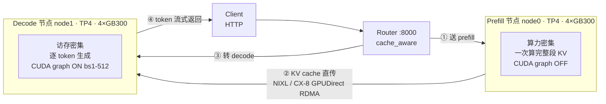
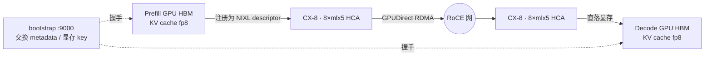

# SGLang R1-NVFP4 GB300 复现 — 实测 RUN LOG

> 配套 [`sglang-r1-nvfp4-128k-gb300.md`](./sglang-r1-nvfp4-128k-gb300.md) 的实测流水账。
> 记录：每步用的命令、结果、踩的坑、怎么修、最终 benchmark。一轮一轮从小到大。

集群：`gke_tencent-gcp-taiji-poc_us-central1_gb300-gke-test`（kubectl 走 `ssh glinux $HOME/google-cloud-sdk/bin/kubectl`）

---

## 配置 × Benchmark 对比总表（核心产出，每跑一轮填一行）

> **用途**：横向对比「各配置下能达到的最优效果」。数字只有在**相同 bench 规格**下才可比 —— 每行都标注 bench 参数（input/output len、并发、prompts 数）。
> **固定项**：模型 `DeepSeek-R1-0528-NVFP4-v2`（NVFP4 权重 + fp8_e4m3 KV），image `lmsysorg/sglang:v0.5.15.post1-cu130`，attention `trtllm_mla`，硬件 GB300 NVL72 pool-0007。

| Round | GPU | 拓扑 | PD 配置 | ctx | bench 规格 (in/out/并发/prompts) | Output tok/s | TPOT ms | TTFT 中位 | 备注 |
|-------|-----|------|---------|-----|------------------|-------------|---------|----------|------|
| R1 | 4 | 单节点 TP4 | 无 PD | 8192 | 功能验证（未跑 bench） | — | — | — | 加载+生成通，`<think>` 正常 |
| R2 | 8 | 2节点 1P1D | prefill×1 + decode×1，nixl/CX-8 | 8192 | 1024/512/16/48 | **407.9** | **9.2** | 1.6 s | decode 快，prefill 瓶颈（Mean TTFT 7.4s） |
| R3 | 20 | ctx3_dep8 | 多 prefill 摊 TTFT | 8192 | *(待跑)* | — | — | — | 目标：压 TTFT 长尾 |
| R4 | 64 | ctx8_dep32（1 NVL72 域） | xPyD 大规模 | 8192→128K | *(待跑)* | — | — | — | 对标博客 226 TPS/GPU |
| R5 | 64 | + MTP (EAGLE) | spec decode | 128K | *(待跑)* | — | — | — | 目标：拉 TPS/User |

> 更细指标（P90/P99 TTFT/TPOT、E2E、input throughput）见各 Round 章节内的完整 benchmark 表。

---

## 选池（2026-07-18）

扫了全部 GB300 池，选 **pool-0007**：
- 16 台 `team=yangwhale`，全 Ready，每台 4 GPU allocatable
- 纯闲置（yw-c 已缩到 0，无业务 pod）
- DRA / RDMA / GIB 都是训练时验证过的，直接复用

> 其它闲池备用：pool-0002 / 0005 / 0012（team=NONE，需打标签）。gdde 池（0001/0004/0006/0009）是奚老师的，不碰。

已实查硬件：GB300 `compute_cap 10.3 = sm_103a`，HCA `mlx5_0~7`。

---

## Round 0 — 容器验证（最大风险点先验）

**目标**：在 pool-0007 起一个 SGLang 容器 pod，确认 sm103 上 sglang / flashinfer / deep_ep import OK，再决定要不要 build。

### 命令
```bash
# 探针 pod (pool-0007, team=yangwhale, 4 GPU, sleep infinity)
kubectl apply -f sgl-probe.yaml   # image: lmsysorg/sglang:v0.5.7-cu130-runtime
kubectl exec sgl-probe -- python -c "import sglang, flashinfer, deep_ep, deep_gemm, sgl_kernel"
```

### 结果（stock `v0.5.7-cu130-runtime`）
| 组件 | 状态 |
|------|------|
| sglang | **0.5.7** ✓（源码装在 `/sgl-workspace/sglang`） |
| deep_ep | ✓ OK |
| deep_gemm | ✓ OK |
| sgl_kernel | ✓ OK |
| flashinfer | **0.5.3 ✗**（要 ≥0.6.1 才有 sm103 cutedsl） |
| nvshmem (py) | 无（C 库，DeepEP 能用即可，非阻塞） |
| GPU | NVIDIA GB300, cc 10.3 = sm103a ✓ |

### 坑 1：flashinfer 升级的 pin 冲突 + cubin 不匹配
- `pip install -U flashinfer-python>=0.6.1` → 装成 0.6.15，但：
  - sglang 0.5.7 硬 pin `flashinfer_python==0.5.3` + `nvidia-cutlass-dsl==4.2.1`（pip resolver 警告，非致命）
  - `flashinfer-cubin` 仍 0.5.3，与本体版本不匹配 → `RuntimeError`（除非 `FLASHINFER_DISABLE_VERSION_CHECK=1`，recipe 正是这么设的）
- **修法**：装**匹配版本** + 关版本检查：
  ```bash
  pip install flashinfer-python==0.6.1 flashinfer-cubin==0.6.1
  export FLASHINFER_DISABLE_VERSION_CHECK=1
  python -c "import flashinfer, sglang"   # → flashinfer 0.6.1 + sglang 0.5.7 都 import OK
  ```

### Round 0 结论
- **stock 容器 90% 够用**：deep_ep/deep_gemm/sgl_kernel 现成，只需就地 `pip install flashinfer 0.6.1(含 cubin)` + 关版本检查。**大概率不用 build ARM Dockerfile**。
- sm103 cutedsl kernel 真能否正确运行，待第一次真启动确认；不行再退 `gb300_blog` 源码 build（doc 第 2 节）。
- 落地做法：把"pip 升级 flashinfer + 设 env"写进 pod 的启动 command，或 commit 成一个新镜像层。

---

### 镜像结论（澄清）
- 用的是 **SGLang 官方 Docker Hub 镜像**（`lmsysorg/sglang`），**不是自建**。
- 更新的官方 tag：**`v0.5.15.post1-cu130`** / `latest-cu130` / `inkling-cu13-arm64`。博客优化已全合入 main → 新镜像大概率自带 flashinfer 0.6.x + sm103，**连 pip 补丁都省**。
- 方案：**首选 `v0.5.15.post1-cu130`**（新、可能开箱即用）；要严格复现博客数字再退 `v0.5.7 + gb300_blog patch`。

## 存储方案（Chris 定：GCS → local SSD，不 Fuse 直读）
实查 GB300 节点：**4× 2.9TB local SSD**（`nvme0/2/3/4n1`，raw 未挂载）+ 100G boot。
- **标准做法**：模型放 GCS bucket → 每节点 `gcloud storage cp` 一次性拷到 local SSD → SGLang 从 SSD mmap 加载（高 IOPS 随机读；GCS Fuse 直读加载权重太慢）。
- 待做：格式化+挂一块 2.9TB SSD 到 pod（hostPath / local PV）；`gcloud storage cp -r` 拉模型。

## Round 1 — 单节点 4 GPU 冒烟（先验模型能加载+生成，再上 PD）

> 简化：单节点 4 GPU（4×288GB=1152GB HBM）就装得下 350GB 模型，先不 PD/不跨节点，验证容器+模型+sm103+NVLink。

### 已做
- **base pod `sgl-node0`**（pool-0007, SGLang `v0.5.7-cu130-runtime`, privileged, 4 GPU, HF token 走 k8s secret, NCCL/GIB env, 200Gi /dev/shm, host /dev 挂载）
- **local SSD**：`mkfs.ext4 /dev/nvme0n1` + mount `/mnt/ssd`（2.8T 可用）
- **flashinfer**：`pip install flashinfer-python==0.6.1 flashinfer-cubin==0.6.1` + `FLASHINFER_DISABLE_VERSION_CHECK=1`
- **模型下载**（`hf_transfer` 极快，~0.5GB/s）：`snapshot_download nvidia/DeepSeek-R1-0528-NVFP4-v2 → /mnt/ssd`（进行中，9 分钟下了 179G/~350G）
  - 坑：容器无 `huggingface-cli`（新版是 `hf`）→ 直接用 `python huggingface_hub.snapshot_download` + `max_workers=16`

### 模型下载完成
385G / DONE / config.json + safetensors.index.json 齐 —— 约 20 分钟（hf_transfer 极快，~0.5GB/s）。

### 坑 2（重要）：stock sglang 0.5.7 + flashinfer 0.6.1 = API 不匹配
单节点 serve（TP4）启动：模型 4 个 TP rank 全 `loaded`，但第一次 forward 崩：
```
TypeError: trtllm_fp4_block_scale_moe() got an unexpected keyword argument 'tile_tokens_dim'
```
- 根因：sglang 0.5.7 调用 flashinfer 的 MoE kernel 时传 `tile_tokens_dim`，但 flashinfer **0.6.1 改了签名**。**版本 skew**。
- 这正是博客用 `gb300_blog` 分支的原因（sglang 侧改了以匹配新 flashinfer）。**Round 0 的"stock 0.5.7 + pip 升 flashinfer"捷径不成立**。
- **修法（采纳 Chris 建议：用新镜像）**：换 **`lmsysorg/sglang:v0.5.15.post1-cu130`**（sglang + flashinfer 版本配套，sm103 支持已合入 main）。模型已在 SSD，新 pod 用 `nodeName` 钉回同节点（`...-519k`）复用。

### 坑 3：flashinfer fp4_gemm AutoTuner 首跑极慢
新镜像 serve 过了 MoE forward（无 tile_tokens_dim 错），但 `[AutoTuner] Tuning fp4_gemm` 1/20 profile 就 3 分钟 → 20 个要 ~1 小时（没设持久 cache 从头 tune）。
- **修法（冒烟）**：`--disable-flashinfer-autotune` + `SGLANG_DG_CACHE_DIR=/mnt/ssd/dg-cache` + `FLASHINFER_WORKSPACE_BASE=/mnt/ssd/fi-cache`（持久化，正式跑首次 tune 后缓存复用）。

### 坑 4：`pkill -f sglang.launch_server` 自杀（exit 137）
kubectl exec 里 `pkill -9 -f sglang.launch_server` 把**自己的 bash 命令行**也匹配上 → 自杀 137。
- **修法**：中括号 trick `pkill -9 -f "[s]glang.launch_server"`（正则 `[s]` 不匹配自身字面量 `[s]`）。
- 另：exec 里写多行脚本嵌套引号易乱 → 改 gLinux 本地写 `serve.sh` + `kubectl cp` 进 pod 再跑。

### ✅ Round 1 通过（单节点 4 GPU）
```
[TP0] max_total_num_tokens=4328320, context_len=8192, available_gpu_mem=37.55GB
Application startup complete. Uvicorn running on http://0.0.0.0:30000
The server is fired up and ready to roll!
```
测试请求（"用一句话解释 NVLink"）→ **DeepSeek-R1 正常生成**，带 `<think>` 推理链，10→120 tokens。

**结论**：DeepSeek-R1-0528-NVFP4 在 **GB300 sm103** 上用 **SGLang v0.5.15.post1 + flashinfer 0.6.12 + modelopt_fp4 + trtllm_mla + fp8 KV** 单节点 TP4 **加载 + 生成全通**。容器 + 模型 + 硬件路径全部验证。

---

## 权重备份到 GCS（供以后复用，不再从 HF 下）

桶：**`gs://chrisya-gb300-models/DeepSeek-R1-0528-NVFP4-v2`**（US-CENTRAL1，同集群区）

### 坑 5：pod 写 GCS 的三重拦路（GKE 经典）
1. **节点 OAuth scope 只读**：pod 用节点 compute SA（WI 未开），但节点 scope 是 storage read-only → 即使给 SA 授了 `objectAdmin`，写仍 **403**。改 scope 要重建节点池（不划算）。
2. **不能建 SA key**：org policy `constraints/iam.disableServiceAccountKeyCreation` 禁止。
3. **gcloud CLI 不认 `GOOGLE_APPLICATION_CREDENTIALS`**：仍走 metadata 的 compute SA → 报错。

**修法（可行）**：把**我的用户 ADC**（`~/.config/gcloud/application_default_credentials.json`）拷进 pod，用 **python `google-cloud-storage` SDK**（SDK 认 `GOOGLE_APPLICATION_CREDENTIALS` 的用户凭证，不受 node scope 限制）多线程上传：
```python
os.environ["GOOGLE_APPLICATION_CREDENTIALS"]="/mnt/ssd/adc.json"
storage.Client(project="tencent-gcp-taiji-poc").bucket("chrisya-gb300-models")...upload_from_filename(f)
# ThreadPoolExecutor(16) 并行 173 文件
```
> 用完删掉 pod 里的 adc.json（用户凭证敏感）。

**✅ 备份完成**：173 文件 / **413GB** 全部上传到 `gs://chrisya-gb300-models/DeepSeek-R1-0528-NVFP4-v2`（16 线程 SDK，约 10 分钟）。ADC 已从 pod 删除。以后拉模型从这里读，不再走 HF。

## 复用流程（以后从 GCS 拉，几分钟起 serve）

```bash
# 1. GCS → 本节点 local SSD（同区快；不直接从 GCS mmap 加载）
export GOOGLE_APPLICATION_CREDENTIALS=/mnt/ssd/adc.json   # 或节点有 storage-ro scope 即可读
python -c "from google.cloud import storage; ..."         # 或 gcloud storage cp -r（读只需 ro scope）
gcloud storage cp -r gs://chrisya-gb300-models/DeepSeek-R1-0528-NVFP4-v2 /mnt/ssd/
# 2. 从 local SSD 起 serve（见 Round 1 的 serve.sh）
```
> **读 GCS 只需 read-only scope，节点默认就有** → 以后拉模型不用 ADC hack，`gcloud storage cp` 直接能读。只有**写**才卡 scope。

## Round 2 — 1P1D (8 GPU) PD 分离（2 节点）

> 目标：验证 **Prefill / Decode 分离**端到端通路 —— prefill 节点算 KV → 经 **nixl / CX-8 RDMA** 传给 decode 节点 → decode 生成。这是大规模 EP 推理的基础架构。

### 拓扑
- **node0 = sgl-node0 `10.72.90.11`**：prefill server（TP4，模型已在 `/mnt/ssd`）
- **node1 = sgl-node1 `10.72.213.52`**：decode server（TP4）
- **router**：跑在 node0，`sglang-router 0.3.2`，`--pd-disaggregation` 连接两端
- 两节点各 4 GPU，共 8 GPU，同 pool-0007（同 subblock，走 NVL + CX-8）

### node1 拉模型（复用 GCS 备份，不走 HF）
`gcloud storage cp -r gs://chrisya-gb300-models/DeepSeek-R1-0528-NVFP4-v2 /mnt/ssd/` → **4.0 GiB/s**，385G/163 文件几分钟到位。印证「读 GCS 只需节点默认 ro scope，不用 ADC hack」。

### 三个 server 脚本（关键参数）
**prefill.sh**（node0）：在单节点 serve.sh 基础上加
```
--disaggregation-mode prefill \
--disaggregation-transfer-backend nixl \
--disaggregation-bootstrap-port 9000 \
--disaggregation-ib-device mlx5_0,mlx5_1,mlx5_2,mlx5_3,mlx5_4,mlx5_5,mlx5_6,mlx5_7
```
**decode.sh**（node1）：同上但 `--disaggregation-mode decode`，**无** bootstrap-port（decode 不监听 bootstrap）。
**router.sh**（node0）：
```
python -m sglang_router.launch_router --pd-disaggregation \
  --prefill http://10.72.90.11:30000 9000 \   # url + bootstrap-port
  --decode  http://10.72.213.52:30000 \
  --policy cache_aware --host 0.0.0.0 --port 8000
```
> router 的 `--prefill` 第二个位置参数就是 prefill 的 bootstrap-port（9000），必须与 prefill.sh 的 `--disaggregation-bootstrap-port` 一致。

### 坑 6：decode.sh 被 kubectl cp 截断成 2 行（只剩 export，无 launch 命令）
decode 进程数 = 0、`decode.log` 0 字节。查 `cat decode.sh` 发现文件只有两行 export，**launch 命令没写进去**（之前 heredoc/cp 中途断了）。
- **修法**：gLinux 本地 `cat > /tmp/decode.sh <<'EOF' ... EOF` 写完整 20 行，再 `kubectl cp` 进 pod，`wc -l` 验证行数。**别用 inline heredoc 直接 exec 进 pod**（嵌套易断）。这是本 RUNLOG 反复踩的「脚本落地」教训：**本地写文件 + cp + wc 验证**。

### 启动顺序 & warmup
1. 两端 server 各自启动 → 各自跑 `disaggregation warmup`（prefill 端 warmup 自带一次完整 PD round-trip，status 200 即通）→ `The server is fired up and ready to roll!`
2. decode 启动含 **decode CUDA graph capture**（52 个 batch size，bs 1→512）+ DeepGEMM warmup（32768 步），约 2-3 分钟。
3. router 起来后自动注册 2 worker（`Activated 1 worker` ×2 → healthy），加载 tokenizer。
   - 无害 WARN：`conflicting load_balance_method: prefill=follow_bootstrap_room, decode=round_robin` —— PD 模式两端策略本就不同，正常。

### ✅ 端到端验证（经 router:8000）
```bash
curl -s -X POST http://localhost:8000/v1/chat/completions -d @req.json
# → DeepSeek-R1 正常输出带 <think> 推理链，150 tokens，finish_reason=length
```
**PD 通路成立**：router → prefill 算 KV → nixl over CX-8 RDMA 传 → decode 生成。

### Benchmark（1P1D，8 GPU，ctx8192 冒烟配置）
`sglang.bench_serving --dataset-name random --random-input-len 1024 --random-output-len 512 --num-prompts 48 --max-concurrency 16`

| 指标 | 值 |
|------|-----|
| Output token throughput | **407.9 tok/s** |
| Total token throughput | 1084.2 tok/s |
| Mean TPOT（每 token 解码） | **9.19 ms**（≈109 tok/s/user） |
| P90 TPOT | 10.67 ms |
| Median TTFT | 1624 ms |
| Mean TTFT | 7360 ms（concurrency 16 全压单 prefill → prefill 排队） |
| Median E2E | 5.1 s |

**读数**：
- **decode 极快**：TPOT 9.2ms → 单用户 ~109 tok/s，PD 分离把 decode 专用化的收益体现出来了。
- **prefill 是瓶颈**：TTFT 长尾高（P90 19.7s），因为 1 个 prefill 节点扛 16 并发，prefill 排队。这正是要 **xPyD（多 prefill）** 的原因——后续 Round 加 prefill 副本即可摊平 TTFT。

### Round 2 结论
- 1P1D PD 分离在 GB300 上**端到端跑通**：nixl + CX-8 RDMA KV 传输 OK，router 调度 OK，decode 生成正常。
- 冒烟配置（ctx8192）下 decode 单用户 ~109 tok/s，架构验证达成。
- 下一步瓶颈明确：prefill 需横向扩展（xPyD）+ 上 128K context + MTP 加速。

---

## Round 2 架构解读 — 每个技术选择为什么这么定

> 这一步（1P1D PD 分离）背后的原理拆解。把「跑通」升级成「知道为什么这么跑」，供后续各配置对比时做判断依据。

### 数据流总览



### 为什么必须拆开 Prefill / Decode
两个阶段的资源画像**正好相反**，混跑会互相拖累：

| 维度 | Prefill | Decode |
|------|---------|--------|
| 瓶颈 | **算力密集** (compute-bound) | **访存密集** (memory-bound) |
| 干什么 | 整段 prompt 一次算出全部 KV | 每步只生成 1 个 token，反复读 KV |
| 算力占用 | ~96%（吃满 Tensor Core） | ~25% |
| 带宽占用 | ~30% | ~97%（吃满 HBM 带宽） |
| 追求指标 | token/s 吞吐 | TPOT 低延迟 |

> 单实例混跑时，一个长 prompt 触发 prefill 会**阻塞**整个 batch 里正在 decode 的请求 → TTFT 和 TPOT 同时崩。拆开后两条流水线各跑各的。

### ① Prefill 用了什么技术 · 怎么加速
| 技术 | 作用 | 为什么在 prefill 关键 |
|------|------|----------------------|
| **MLA** (`trtllm_mla`) | 多头潜在注意力，KV 压成低秩 latent | KV 体积缩到 ~1/10 → 写 KV 快，PD 传输量小 |
| **NVFP4 权重** (`modelopt_fp4`) | 4-bit 权重，GB300 sm103 原生 FP4 Tensor Core | prefill 算力受限，FP4 等效算力翻倍 → 直接决定吞吐 |
| **DeepGEMM** | MoE 层 fp8 grouped GEMM | DeepSeek 是 MoE，prefill 大量 token 路由到 expert，是热点 |
| **Chunked Prefill** | 超长 prompt 切块分批算 | 128K 长上下文必需，否则单次 OOM |
| **CUDA graph OFF** | prefill 关闭 graph | prefill 每次 shape 不同（prompt 变长），graph 复用不了。实测 log 确认 `Disable prefill CUDA graph` |

**并行**：本次 = **TP4**（4 GPU 张量并行，切注意力头 + FFN 权重，NVLink all-reduce 拼结果）。大规模叠 **EP**（专家并行，expert 分散多卡，token dispatch/combine 走 DeepEP）。
**加速本质**：prefill 缺算力 → 多卡摊计算 + 低精度换算力 + 高带宽互联让切分不亏通信。

### ② Decode 用了什么技术 · 怎么加速
| 技术 | 作用 | 为什么在 decode 关键 |
|------|------|----------------------|
| **CUDA Graph ON** (bs 1-512) | 整个 decode step 录成图，回放零启动开销 | decode 每步 shape 固定（1 token），完美适配；实测 capture 52 个 bs，头号功臣 |
| **fp8 KV Cache** (`fp8_e4m3`) | KV 用 8-bit 存 | decode 瓶颈是读 KV，减半 → 带宽压力减半 + 2× 并发。实测每卡 KV = **127.38 GB / 389 万 token** |
| **Continuous Batching** | 动态拼请求进同一 batch | 把带宽摊到多请求，吞吐放大器 |
| **MLA 低秩 KV** | 读压缩后 latent | 减少每步搬运字节 |
| **MTP / EAGLE**（R5 待做） | 一步猜多 token，主模型批量验证 | decode 是串行瓶颈，投机解码拉高单用户 TPS 主力 |

**并行**：TP4（让每卡只存 1/4 KV，塞更大 batch）。大规模用 **DP Attention**（MLA 的 KV 小，复制注意力比切它通信更划算，避免 KV 多卡重复）+ **Wide-EP**。
**加速本质**：decode 缺带宽 → 压 KV（fp8+MLA）省带宽 + CUDA graph 消 CPU 开销 + 大 batch 摊平 + 投机解码破串行。

### ③ KV 用什么传 — NIXL over CX-8 GPUDirect RDMA

- **NIXL** = NVIDIA Inference Xfer Library，厂商无关的点对点传输库，统一 API + 可插拔 backend（UCX/GPUDirect RDMA/GDS/NVMe/S3…）。
- **GPUDirect RDMA**：GPU 显存 → 网卡 → GPU 显存，全程**不碰 CPU / host 内存**（zero-copy）。
- **握手机制**：两端先经 `bootstrap-port 9000` 交换 metadata，decode 拿到 prefill 显存的访问 key，才能发起单边 RDMA read/write。
- **非阻塞**：post 后立即返回，计算与通信重叠。
- 配 `--disaggregation-ib-device mlx5_0..7` 吃满 GB300 的 8 张 CX-8 网卡。

### ④ 为什么用 NIXL，不用 Mooncake
SGLang PD 支持两种 KV backend（`--disaggregation-transfer-backend {nixl,mooncake}`），不是谁强谁弱，是**定位不同**：

| 维度 | NIXL（我们的选择） | Mooncake |
|------|-------------------|----------|
| 本质 | 点对点传输库（P2P 直传） | KVCache 中心化平台（P2P + 分布式 KV Store） |
| 出品 | NVIDIA（Dynamo 生态） | 月之暗面 Kimi + 清华（FAST'25） |
| 核心价值 | 轻量、低延迟、硬件原生 | 跨实例 KV 复用 + KV 分层存储 (HBM→DRAM→SSD) |
| 额外依赖 | 随 sglang 镜像，只需指定 IB device | 要额外起 Store 服务 + etcd |
| GB300 适配 | NVIDIA 全家桶，CX-8/GPUDirect 一等支持 | 也支持 RDMA，但栈更重 |
| 最适场景 | 1P1D / xPyD 点对点分离 | 超大规模 + 长上下文 prefix 跨实例复用 |

**选 NIXL 三条理由**：
1. **场景匹配** —— 现在是 1P1D 点对点直传，NIXL 的 P2P 正好；Mooncake 的杀手锏 Store（分布式 KV 池 + 跨实例 prefix 复用）1P1D 用不上。
2. **NVIDIA 原生栈** —— GB300 + CX-8 + GPUDirect RDMA 是 NVIDIA 全家桶，NIXL 官方一等适配；lmsys GB300 官方复现路径就是 NIXL（配 Dynamo）。
3. **部署轻** —— NIXL 一行 `--disaggregation-ib-device` 即用；Mooncake 要额外拉 Store + etcd，社区还有 TCP backend 并发瓶颈 issue。

> **不是 Mooncake 差**：将来上大规模 + 长上下文、需要多 decode 实例**共享同一份 prefix KV**（如同一 system prompt 被海量请求复用）、或 KV 冷热分层卸载时，Mooncake Store 的价值才出来。现阶段（复现 + 点对点分离）NIXL 更对路。

### ⑤ 特殊配置 × 影响（本次实测参数）
| 配置 | 作用 | 影响 |
|------|------|------|
| `--quantization modelopt_fp4` | 权重 NVFP4 4-bit | 吞吐↑↑：显存/带宽减半 + FP4 Tensor Core 等效算力翻倍 |
| `--kv-cache-dtype fp8_e4m3` | KV 8-bit | 并发↑ 带宽↓：KV 减半 → 2× 并发；实测 127GB/389万token/卡 |
| `--attention-backend trtllm_mla` | TRT-LLM MLA kernel | 延迟↓：sm100+ 专用 + fp8 KV 支持；换通用 backend 明显变慢 |
| `--mem-fraction-static 0.85` | 85% 显存给静态 | 权衡：剩 15% 给 KV pool；调高→并发↑但 OOM 险 |
| `--disable-flashinfer-autotune` | 跳过 fp4_gemm 调优 | 冒烟专用：否则首启 tune ~1h；正式跑应开 + 持久 cache |
| `--disaggregation-ib-device mlx5_0..7` | 8 张 CX-8 做 KV RDMA | 传输带宽↑：吃满 8 网卡；少指定成瓶颈 |
| `SGLANG_NVFP4_CKPT_FP8_GEMM_IN_ATTN=1` | attention GEMM 走 fp8 | 精度/速度平衡 |
| `NCCL_CONF_FILE=nccl.a4xmax.conf` + mnnvl fusion | NVL72 域内 NVLink 通信 | TP 通信↓：AllReduce Fusion 融进 kernel，域内几乎免费 |

### 实测数字印证解读
- **decode 快**：TPOT 9.2ms → 单用户 ~109 tok/s。PD 分离让 decode 专用化（fp8 KV + CUDA graph + MLA）的收益兑现。
- **prefill 是瓶颈**：Mean TTFT 7.4s（P90 19.7s），16 并发全压单 prefill 排队 → 下一步 **xPyD（多 prefill）** 摊平 TTFT 的直接证据。

---

## Round 3+ — 待做
- **Round 3**：ctx3_dep8（20 GPU，加 prefill 副本摊 TTFT）
- **Round 4**：ctx8_dep32（64 GPU = 一个 NVL72 域）→ 对标博客 226 TPS/GPU
- **Round 5**：MTP（EAGLE spec decode）→ 拉 TPS/User

