# CogVideoX TPU 加速项目

> **最后更新**：2025-12-25
>
> 🎉 **最新进展**：generate_torchax.py 集成 TorchAx VAE！720P 81帧 50步 **106.47s (2.13s/step)**，再提升 **10%**！

本项目实现了 CogVideoX 视频生成模型在 Google Cloud TPU 上的高性能推理，通过 JAX + TorchAx/Flax 实现了显著的性能提升和内存优化。

## 📋 项目概述

CogVideoX 是一个强大的文本到视频生成模型，本项目将其迁移到 TPU 平台，利用以下技术实现高效推理：

- **三阶段流水线**：Text Encoder → Transformer → VAE Decoder，支持分阶段调试和优化
- **Splash Attention**：TPU 原生的高效注意力机制，支持长序列处理
- **双 VAE 实现**：TorchAx VAE（🏆 性能最优，推荐）和 Flax VAE（纯 JAX 实现）
- **智能分片**：Tensor Parallel + Data Parallel，支持多 TPU 并行
- **BFloat16 优化**：全流程 BF16 计算，减少内存占用并提升性能

```mermaid
flowchart LR
    subgraph "Stage 1"
        A[Text Prompt] --> B[T5 Encoder]
        B --> C[Embeddings]
    end
    
    subgraph "Stage 2"
        C --> D[Transformer<br/>+ Splash Attention]
        D --> E[Latents]
    end
    
    subgraph "Stage 3"
        E --> F{VAE Decoder}
        F -->|TorchAx 🏆| G1[0.86s]
        F -->|Flax| G2[1.30s]
    end
    
    G1 --> H[Video]
    G2 --> H
```



---

## 🚀 Quick Start

### 1. 环境安装

```bash
# 安装核心依赖
pip install huggingface-hub
pip install -U transformers datasets evaluate accelerate timm flax numpy
pip install torchax
pip install jax[tpu]
pip install tensorflow-cpu

# 安装辅助工具
pip install sentencepiece
sudo apt install ffmpeg -y
pip install imageio[ffmpeg]
pip install tpu-info
pip install matplotlib
```

### 2. 配置环境变量

```bash
# 设置 Hugging Face 缓存目录（使用共享内存加速）
export HF_HOME=/dev/shm

# 设置 Hugging Face Token
export HF_TOKEN=<your HF_TOKEN>

# JAX 编译缓存（加速重复运行）
export JAX_COMPILATION_CACHE_DIR=/dev/shm/jax_cache
```

### 3. 克隆并安装项目

```bash
# 克隆 diffusers-tpu 项目（包含 TorchAx/Flax VAE 实现）
git clone https://github.com/yangwhale/diffusers-tpu.git
cd diffusers-tpu
pip install -e .

# 克隆本项目
git clone https://github.com/yangwhale/gpu-tpu-pedia.git
cd gpu-tpu-pedia/tpu/CogVideoX/
```

### 4. 运行视频生成

**推荐：使用三阶段流水线**

```bash
cd generate_diffusers_torchax_staged

# 阶段1：文本编码
python stage1_text_encoder.py --prompt "A panda playing guitar"

# 阶段2：Transformer 推理
python stage2_transformer.py --num_inference_steps 50

# 阶段3：VAE 解码（🏆 推荐 TorchAx 版本）
python stage3_vae_decoder.py
```

**或者：一体化脚本**

```bash
python generate_torchax.py
```

---

## 📁 项目结构

```
CogVideoX/
├── README.md                           # 本文档
├── generate_torchax.py                 # 一体化生成脚本
├── custom_splash_attention.py          # TPU Splash Attention 实现
│
└── generate_diffusers_torchax_staged/  # ⭐ 三阶段流水线（推荐）
    ├── README.md                       # 详细使用说明
    ├── utils.py                        # 共享工具模块
    ├── stage1_text_encoder.py          # 阶段1：文本编码
    ├── stage2_transformer.py           # 阶段2：Transformer 推理
    ├── stage3_vae_decoder.py           # 阶段3：VAE (TorchAx) 🏆
    ├── stage3_vae_decoder_flax.py      # 阶段3：VAE (Flax)
    ├── TORCHAX_VS_FLAX_VAE_OPTIMIZATION.md  # VAE 深度对比文档
    └── stage_outputs/                  # 中间文件存储
        ├── generation_config.json
        ├── stage1_embeddings.safetensors
        ├── stage2_latents.safetensors
        └── output_video.mp4
```

---

## 🎯 性能基准

### 测试环境

- **硬件**：TPU v6e-8 (8 chips)
- **模型**：CogVideoX1.5-5B
- **推理步数**：50 步
- **Mesh 配置**：`dp=2, sp=1, tp=4`（推荐）

### 一体化脚本性能（generate_torchax.py）

| 分辨率 | 帧数 | 推理步数 | 基准时间 | 单步时间 | 备注 |
|--------|------|----------|----------|----------|------|
| **720×1280** 🏆 | 81帧 16fps | 50 步 | **106.47s** | **2.13s/step** | 包含 Text Encoder + Transformer + TorchAx VAE |

> 📊 **性能演进**：
> - 2025-12-25 之前：118.4s (2.37s/step) - 使用标准 diffusers VAE
> - 2025-12-25 之后：**106.47s (2.13s/step)** - 集成 TorchAx VAE，**提升 10%**

### 性能对比：720P vs 768P（三阶段流水线）

| 分辨率 | 帧数 | Stage 2 (后续) | VAE TorchAx (后续) | 总计 (后续) |
|--------|------|----------------|-------------------|-------------|
| **720×1280** 🏆 | 81帧 16fps | **103.8s** | **0.86s** | **~107s** |
| 768×1360 | 81帧 8fps | 56.6s | 0.65s | ~60s |

> 💡 720P 更慢的原因：720×1280 = 921,600 像素 vs 768×1360 = 1,044,480 像素
> 虽然 720P 像素更少，但测试时间差异可能来自不同的运行环境条件

### 720×1280×81帧 16fps（推荐配置）

```
┌─────────────────────────────────────────────────────────────────────────┐
│                    720P 81帧 性能总览                                    │
├───────────────────┬────────────┬────────────┬────────────┬──────────────┤
│       阶段        │  首次运行  │  后续运行   │  JIT 编译  │    备注      │
├───────────────────┼────────────┼────────────┼────────────┼──────────────┤
│ Stage 1: T5       │    ~2s     │    ~2s     │     -      │ CPU 运行     │
│ Stage 2: Trans    │   ~234s    │  ~103.8s   │   ~130s    │ 50步 DP=2    │
│ Stage 3: TorchAx  │    ~81s    │   0.86s 🏆 │    ~80s    │ VAE 解码     │
├───────────────────┼────────────┼────────────┼────────────┼──────────────┤
│ 总计 (TorchAx)    │   ~317s    │  ~107s     │     -      │ 推荐！       │
└───────────────────┴────────────┴────────────┴────────────┴──────────────┘
```

### 768×1360×81帧 8fps（历史配置）

```
┌─────────────────────────────────────────────────────────────────────────┐
│                    768P 81帧 性能总览                                    │
├───────────────────┬────────────┬────────────┬────────────┬──────────────┤
│       阶段        │  首次运行  │  后续运行   │  JIT 编译  │    备注      │
├───────────────────┼────────────┼────────────┼────────────┼──────────────┤
│ Stage 1: T5       │    ~2s     │    ~2s     │     -      │ CPU 运行     │
│ Stage 2: Trans    │   ~194s    │   ~57s     │   ~137s    │ 50步 DP=2 🏆 │
│ Stage 3: TorchAx  │   ~129s    │   0.65s    │   ~126s    │ VAE 解码     │
│ Stage 3: Flax     │   ~245s    │   1.30s    │   ~244s    │ VAE 解码     │
├───────────────────┼────────────┼────────────┼────────────┼──────────────┤
│ 总计 (TorchAx)    │   ~325s    │   ~60s 🏆  │     -      │ 最快！       │
│ 总计 (Flax)       │   ~441s    │   ~60s     │     -      │ 备选         │
└───────────────────┴────────────┴────────────┴────────────┴──────────────┘
```

### Stage 2 Transformer 配置对比（50 步推理，768P）

| 配置 | Mesh | 每步时间 | 50步总时间 | 加速比 |
|------|------|----------|-----------|--------|
| DP=1 | `dp=1, tp=8` | 1.79s | 89.67s | 1.0x |
| **DP=2** 🏆 | `dp=2, tp=4` | **1.13s** | **56.63s** | **1.58x** |

> 💡 **DP=2 更快的原因**：CFG 模式下正向+负向 prompt 可并行处理

### VAE 解码器对比（768P 81帧）

| 实现 | 解码时间 | 特点 |
|------|----------|------|
| **TorchAx VAE** 🏆 | **0.65s** | PyTorch 兼容，移植容易，缓存后最快 |
| Flax VAE | 1.30s | 纯 JAX，首次编译后稳定 |
| Flax VAE (未优化) | ~12s | 无 JIT/分片 |

> 📖 详细对比分析请参阅：[`TORCHAX_VS_FLAX_VAE_OPTIMIZATION.md`](generate_diffusers_torchax_staged/TORCHAX_VS_FLAX_VAE_OPTIMIZATION.md)

### Stage 2 历史优化记录（10 步基准测试）

| # | 优化项 | DP | Block Size | 每步时间 | 10步总时间 | 相对基线 |
|---|--------|-----|------------|----------|-----------|---------|
| 1 | 基线版本 | ✗ | 原始 | 4.04s | 40.54s | - |
| 2 | +sharding constraint | ✗ | 原始 | 3.93s | 39.43s | +2.7% |
| 3 | +DP | ✓ | 原始 | 3.08s | 33.90s | +16.4% |
| 4 | +mesh 顺序优化 | ✓ | 原始 | 2.75s | 30.26s | +25.4% |
| 5 | **最优配置** | ✓ | Wan2.1 | **2.31s** | **25.36s** | **+37.4%** |

---

## 🔧 三阶段流水线详解

### 阶段1：文本编码

```bash
python stage1_text_encoder.py \
  --prompt "A panda playing guitar in a bamboo forest" \
  --output_dir ./stage_outputs
```

**参数**：
- `--prompt`: 正面提示词
- `--negative_prompt`: 负面提示词（可选）
- `--model_id`: 模型 ID（默认 `zai-org/CogVideoX1.5-5B`）

**输出**：
- `stage1_embeddings.safetensors`: prompt embeddings
- `generation_config.json`: 生成配置

### 阶段2：Transformer 推理

```bash
python stage2_transformer.py \
  --input_dir ./stage_outputs \
  --num_inference_steps 50 \
  --height 720 \
  --width 1280 \
  --frames 81
```

**参数**：
- `--num_inference_steps`: 推理步数（默认 50）
- `--height/width`: 视频尺寸（默认 720×1280）
- `--frames`: 视频帧数（默认 81）
- `--guidance_scale`: CFG 引导尺度（默认 6.0）

**输出**：
- `stage2_latents.safetensors`: 生成的 latents

> ⚠️ **帧数要求**：CogVideoX 的 VAE 要求 latent 帧数为奇数，否则解码时会多出帧。
> 有效帧数 = 4n+1 且 (帧数-1)/4+1 为奇数，如：41, 49, 57, 65, 73, **81**, 89, 97...

### 阶段3：VAE 解码

**🏆 推荐：TorchAx VAE（性能最优）**

```bash
python stage3_vae_decoder.py \
  --input_dir ./stage_outputs \
  --output_video ./stage_outputs/output_video.mp4
```

**备选：Flax VAE（纯 JAX 实现）**

```bash
python stage3_vae_decoder_flax.py \
  --input_dir ./stage_outputs \
  --output_video ./stage_outputs/output_video.mp4 \
  --dp 1
```

**输出**：
- `output_video.mp4`: 最终视频

---

## ⚙️ 核心技术

### 1. Splash Attention

TPU 专用的高效注意力实现，支持长序列处理：

```python
# 配置参数（Wan2.1 优化配置）
BQSIZE = 3328           # Query 块大小
BKVSIZE = 2816          # Key/Value 块大小
BKVCOMPUTESIZE = 256    # KV 计算块大小
USE_K_SMOOTH = True     # K-smooth 优化
```

**特性**：
- 块状计算，避免 VMEM 溢出
- 支持局部窗口注意力
- K-smooth 技术提升数值稳定性

### 2. 智能权重分片

支持多种并行模式：

```mermaid
graph TB
    subgraph "分片策略"
        A[8 TPU Chips] --> B{分片模式}
        B --> C["TP only<br/>(tp=8, dp=1)"]
        B --> D["TP + DP<br/>(tp=4, dp=2)"]
        B --> E["DP only<br/>(tp=1, dp=8)"]
    end
```



```python
# Mesh 配置
mesh = Mesh(devices, ("dp", "sp", "tp"))

# 权重分片
P(None, None, None, ("dp", "tp"), None)  # Width 维度分片
```

### 3. VAE 解码优化

#### TorchAx VAE（🏆 推荐）

通过 `torchax` 直接运行 PyTorch 代码在 TPU 上：

```python
# 使用 torchax 环境
import torchax
import torchax.interop

# JAX Mesh 配置
mesh = jax.sharding.Mesh(...)

# PyTorch VAE 在 JAX 环境运行
with mesh:
    video = vae.decode(latents)
```

**优势**：
- 代码兼容性好，直接复用 PyTorch 实现
- JIT 编译后性能最优（0.86s）
- 维护成本低

#### Flax VAE

纯 JAX/Flax 实现的 VAE 解码器：

1. **JIT 编译**：`nnx.jit(flax_vae.decoder)`
2. **TPU 分片**：`jax.lax.with_sharding_constraint()`
3. **Mesh 上下文**：`with mesh: decode(...)`

```python
# 分片约束代码
def _apply_sharding_constraint(inputs, is_nthwc=True):
    """在 Width 维度分片到多 TPU"""
    if is_nthwc:
        # Flax: (B, T, H, W, C) - W at index 3
        spec = P(None, None, None, ("dp", "tp"), None)
    else:
        # TorchAx: (B, C, T, H, W) - W at index 4
        spec = P(None, None, None, None, ("dp", "tp"))
    return jax.lax.with_sharding_constraint(inputs, spec)
```

---

## 🔍 故障排查

### 1. VMEM 溢出

**症状**：`RESOURCE_EXHAUSTED: Ran out of memory in memory space vmem`

**解决**：减小 Splash Attention 块大小
```python
BQSIZE = 1024        # 从 3328 减小
BKVSIZE = 512        # 从 2816 减小
```

### 2. HBM OOM

**症状**：`Attempting to allocate X.XXG. That was not possible.`

**解决**：
1. 检查是否添加了 TPU 分片约束
2. 减少视频帧数或分辨率
3. 使用 Data Parallel 模式分散内存

### 3. JIT 编译慢

**解决**：启用持久化编译缓存
```python
jax.config.update("jax_compilation_cache_dir", "/dev/shm/jax_cache")
jax.config.update("jax_persistent_cache_min_entry_size_bytes", -1)
jax.config.update("jax_persistent_cache_min_compile_time_secs", 0)
```

### 4. 维度不匹配

**注意**：TorchAx 和 Flax 使用不同的维度顺序：
- TorchAx: `NCTHW` (Width @ index 4)
- Flax: `NTHWC` (Width @ index 3)

分片 PartitionSpec 必须相应调整！

---

## 📊 数据格式说明

### Latents 维度格式

| 阶段 | 格式 | 说明 |
|------|------|------|
| Pipeline 输出 | `[B, T, C, H, W]` | Diffusers 原始格式 |
| Stage2 保存 | `[B, C, T, H, W]` | PyTorch 标准格式 |
| TorchAx VAE | `[B, C, T, H, W]` | NCTHW |
| Flax VAE | `[B, T, H, W, C]` | NTHWC |

### 视频输出格式

- `List[np.ndarray]`：每帧为 `float32`，范围 `[0, 1]`
- 使用 `diffusers.utils.export_to_video` 保存

---

##  相关资源

- **深度对比文档**：[`TORCHAX_VS_FLAX_VAE_OPTIMIZATION.md`](generate_diffusers_torchax_staged/TORCHAX_VS_FLAX_VAE_OPTIMIZATION.md)
- **三阶段详细说明**：[`generate_diffusers_torchax_staged/README.md`](generate_diffusers_torchax_staged/README.md)
- [CogVideoX 官方仓库](https://github.com/THUDM/CogVideo)
- [Diffusers TPU 版本](https://github.com/yangwhale/diffusers-tpu)
- [JAX 文档](https://jax.readthedocs.io/)
- [Flax 文档](https://flax.readthedocs.io/)
- [TPU 开发指南](https://cloud.google.com/tpu/docs)

---

## 🤝 贡献

欢迎提交 Issue 和 Pull Request！

## 📄 许可证

本项目遵循原始项目的许可证。

## 🙏 致谢

- CogVideoX / THUDM 团队
- Hugging Face Diffusers 团队
- Google JAX/Flax 团队
- TPU 社区

---

## 📈 更新日志

| 日期 | 更新内容 |
|------|----------|
| 2025-12-25 | 🚀 **generate_torchax.py 集成 TorchAx VAE**：2.37s/step → 2.13s/step（-10%），完整流程 106.47s |
| 2025-12-25 | 🔧 generate_torchax.py 性能优化：2.92s/step → 2.37s/step（-19%），优化 attention sharding 策略 |
| 2025-12-24 | 🏆 TorchAx VAE 性能超越 Flax（0.86s vs 1.30s）；更新默认配置：720×1280×81帧 16fps |
| 2025-12-20 | Flax VAE 优化完成，解码时间 12s → 1.30s |
| 2025-12-18 | 新增 TorchAx VAE 实现，解码时间 90s → 2.4s |
| 2025-12-12 | Stage 2 优化完成，推理时间降低 37.4% |
| 2025-11-04 | 初始版本，支持基础 TPU 推理 |
