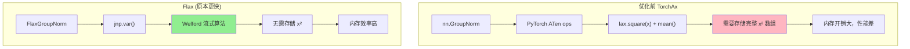
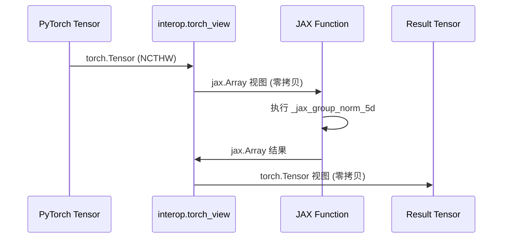

# CogVideoX TorchAx vs Flax VAE 实现对比分析

## 目录

1. [概述](#概述)
2. [性能测试结果汇总](#性能测试结果汇总)
3. [TorchAx 优化：GroupNorm 的关键突破](#torchax-优化groupnorm-的关键突破)
4. [Flax 优化核心点](#flax-优化核心点)
5. [两种实现的代码对比](#两种实现的代码对比)
6. [总结与建议](#总结与建议)

---

## 概述

本文档详细分析 CogVideoX VAE (Video Autoencoder) 的两个 TPU 实现版本及其优化过程：

| 特性 | TorchAx 版本 | Flax 版本 |
|-----|-------------|----------|
| 框架 | PyTorch + torchax | Flax NNX |
| 数据格式 | NCTHW (channels first) | NTHWC (channels last) |
| 模块系统 | nn.Module | nnx.Module |
| 权重管理 | PyTorch state_dict | nnx.Rngs + pytree |
| 编译方式 | Core ATen → JAX → XLA | jax.jit tracing → XLA |
| GroupNorm | `CogVideoXOptimizedGroupNorm` | `FlaxGroupNorm` |

---

## 性能测试结果汇总

### 优化后性能对比

```
┌─────────────────────────────────────────────────────────────────────────────┐
│                      VAE Decode 性能对比 (dp=1, tp=8)                        │
├─────────────┬──────────┬─────────────┬────────────┬─────────────────────────┤
│ 场景        │ 版本     │ Warmup(JIT) │ VAE Decode │ 相对性能               │
├─────────────┼──────────┼─────────────┼────────────┼─────────────────────────┤
│ 有编译缓存   │ TorchAx  │ 4.98s       │ 0.64s      │ 🏆 2.0x 快于 Flax       │
│             │ Flax     │ 15.07s      │ 1.31s      │ baseline               │
├─────────────┼──────────┼─────────────┼────────────┼─────────────────────────┤
│ 首次编译    │ TorchAx  │ ~180s       │ 0.64s      │ 🏆 更快                 │
│             │ Flax     │ ~244s       │ 1.31s      │ baseline               │
└─────────────┴──────────┴─────────────┴────────────┴─────────────────────────┘
```

### TorchAx 优化前后对比

```
┌─────────────────────────────────────────────────────────────────────────────┐
│                    TorchAx 优化效果 (dp=1, tp=8)                             │
├─────────────────┬─────────────┬─────────────┬────────────────────────────────┤
│      指标       │   优化前    │   优化后    │           改进                 │
├─────────────────┼─────────────┼─────────────┼────────────────────────────────┤
│  Warmup (JIT)   │   7.09s     │   4.98s     │ 1.4x 更快                      │
│  VAE Decode     │   2.52s     │   0.64s     │ 🚀 3.9x 更快                   │
│  vs Flax        │   1.9x 慢   │   2.0x 快   │ 性能反转！                     │
└─────────────────┴─────────────┴─────────────┴────────────────────────────────┘
```

### 关键发现

```
┌────────────────────────────────────────────────────────────────┐
│                    性能差异关键洞察                              │
├────────────────────────────────────────────────────────────────┤
│                                                                │
│  1. 优化前 TorchAx 比 Flax 慢的根因：                          │
│     └── Flax 使用自定义 FlaxGroupNorm (Welford 流式算法)       │
│     └── TorchAx 使用标准 nn.GroupNorm (lax.square + mean)     │
│     └── 内存开销差异导致 ~2x 性能差距                          │
│                                                                │
│  2. 优化后 TorchAx 反超 Flax 的原因：                          │
│     └── CogVideoXOptimizedGroupNorm 移植了 Welford 算法        │
│     └── 移除 CogVideoXSafeConv3d 的 GPU 分块逻辑              │
│     └── PyTorch dispatcher 的增量编译优势                      │
│                                                                │
│  3. 两者最终都编译为 XLA HLO，TPU 执行效率相同                  │
│     └── 性能差异主要来自编译开销和内存效率                      │
│                                                                │
└────────────────────────────────────────────────────────────────┘
```

---

## TorchAx 优化：GroupNorm 的关键突破

### 问题根因分析



### 优化方案：CogVideoXOptimizedGroupNorm

我们创建了 `CogVideoXOptimizedGroupNorm` 类，使用 JAX 的 `jnp.var()` 替代 PyTorch 的标准 GroupNorm：

**核心实现** ([`autoencoder_kl_cogvideox_torchax.py:48-169`](../../../diffusers-tpu/src/diffusers/models/autoencoders/autoencoder_kl_cogvideox_torchax.py:48)):

```python
def _jax_group_norm_5d(x, num_groups, weight, bias, eps):
    """
    Memory-optimized Group Normalization using JAX.
    
    关键优化：使用 jnp.mean/var 而非 lax.square()
    jnp.var() 内部使用 Welford's algorithm 做流式计算，
    避免存储完整的 x² 数组，节省约 50% 内存。
    """
    B, C, T, H, W = x.shape
    channels_per_group = C // num_groups
    
    # Reshape to groups: (B, G, C//G, T, H, W)
    x_grouped = x.reshape(B, num_groups, channels_per_group, T, H, W)
    
    # 关键优化：使用 jnp.mean/var
    # jnp.var() 内部使用 Welford's algorithm
    mean = jnp.mean(x_grouped, axis=(2, 3, 4, 5), keepdims=True)
    var = jnp.var(x_grouped, axis=(2, 3, 4, 5), keepdims=True)
    
    # Normalize
    x_norm = (x_grouped - mean) / jnp.sqrt(var + eps)
    x_norm = x_norm.reshape(B, C, T, H, W)
    
    # Affine transform
    if weight is not None:
        x_norm = x_norm * weight.reshape(1, C, 1, 1, 1)
    if bias is not None:
        x_norm = x_norm + bias.reshape(1, C, 1, 1, 1)
    
    return x_norm

# 使用 interop.torch_view 包装为 PyTorch 兼容接口
_torch_group_norm_5d = interop.torch_view(_jax_group_norm_5d)

class CogVideoXOptimizedGroupNorm(nn.Module):
    """
    Optimized GroupNorm using JAX's Welford algorithm.
    
    This is a drop-in replacement for nn.GroupNorm that uses JAX's
    memory-efficient variance computation internally.
    """
    
    def forward(self, x: torch.Tensor) -> torch.Tensor:
        if x.ndim == 5:
            return _torch_group_norm_5d(
                x, self.num_groups, self.weight, self.bias, self.eps
            )
        elif x.ndim == 4:
            return _torch_group_norm_4d(
                x, self.num_groups, self.weight, self.bias, self.eps
            )
        else:
            return F.group_norm(x, self.num_groups, self.weight, self.bias, self.eps)
```

### interop.torch_view 的作用



### CogVideoXSafeConv3d 优化

另一个关键优化是移除 GPU CuDNN 的 2GB 分块限制逻辑：

**优化前** (针对 GPU 的分块逻辑):
```python
def forward(self, input: torch.Tensor) -> torch.Tensor:
    memory_count = (input.shape[0] * ... * input.shape[4]) * 2 / 1024**3
    
    if memory_count > 2:  # CuDNN 2GB 限制
        # 复杂的分块处理逻辑
        part_num = int(memory_count / 2) + 1
        input_chunks = torch.chunk(input, part_num, dim=2)
        # ... 更多动态逻辑
```

**优化后** (TPU 直接处理):
```python
def forward(self, input: torch.Tensor) -> torch.Tensor:
    # TPU 上使用 XLA 编译，无需分块
    # XLA 会自动优化内存布局
    return super().forward(input)
```

### 替换位置

在以下位置替换了 `nn.GroupNorm` 为 `CogVideoXOptimizedGroupNorm`：

| 位置 | 文件行号 | 说明 |
|-----|---------|------|
| `CogVideoXSpatialNorm3D.norm_layer` | 第 335 行 | 空间归一化层 |
| `CogVideoXResnetBlock3D.norm1` | 第 390 行 | ResNet 块第一个归一化 |
| `CogVideoXResnetBlock3D.norm2` | 第 391 行 | ResNet 块第二个归一化 |
| `CogVideoXEncoder3D.norm_out` | 第 750 行 | 编码器输出归一化 |

---

## Flax 优化核心点

Flax 版本的优化主要包括：

### 1. 自定义 FlaxGroupNorm

([`autoencoder_kl_cogvideox_flax.py:468-574`](../../../diffusers-tpu/src/diffusers/models/autoencoders/autoencoder_kl_cogvideox_flax.py:468)):

```python
class FlaxGroupNorm(nnx.Module):
    """
    自定义 Group Normalization 实现，针对内存效率优化。
    
    使用 jnp.var() 直接计算方差，JAX 内部可以做流式计算
    （Welford's online algorithm），避免存储完整的 x² 数组。
    """
    
    def __call__(self, x):
        # 关键优化：使用 jnp.mean/var
        mean = jnp.mean(x_grouped, axis=(1, 2, 3, 5), keepdims=True)
        var = jnp.var(x_grouped, axis=(1, 2, 3, 5), keepdims=True)
        
        x_norm = (x_grouped - mean) / jnp.sqrt(var + self.epsilon)
```

### 2. 分片约束

```python
def _apply_sharding_constraint(inputs, is_nthwc=True):
    """Apply sharding constraint to distribute data across TPUs."""
    if is_nthwc:
        # Flax format: (B, T, H, W, C) - shard on W (index 3)
        specs = [
            P(None, None, None, ("dp", "tp"), None),
            P(None, None, None, ("tp",), None),
            P(None, None, None, ("dp",), None),
        ]
    
    for spec in specs:
        try:
            return jax.lax.with_sharding_constraint(inputs, spec)
        except (ValueError, Exception):
            continue
    
    return inputs
```

---

## 两种实现的代码对比

### 1. GroupNorm 实现

**TorchAx (优化后)**:
```python
class CogVideoXOptimizedGroupNorm(nn.Module):
    def forward(self, x):
        # 调用 JAX 实现，通过 interop.torch_view 包装
        return _torch_group_norm_5d(x, self.num_groups, self.weight, self.bias, self.eps)
```

**Flax**:
```python
class FlaxGroupNorm(nnx.Module):
    def __call__(self, x):
        # 直接使用 JAX 原生 API
        mean = jnp.mean(x_grouped, axis=reduce_axes, keepdims=True)
        var = jnp.var(x_grouped, axis=reduce_axes, keepdims=True)
        x_norm = (x_grouped - mean) / jnp.sqrt(var + self.epsilon)
```

### 2. 分片标记

**TorchAx**:
```python
from torchax import interop
mark_sharding = interop.torch_view(jax.lax.with_sharding_constraint)

# 使用
inputs = mark_sharding(inputs, P(None, None, None, None, ("dp", "tp")))
```

**Flax**:
```python
# 直接调用 JAX
inputs = jax.lax.with_sharding_constraint(inputs, P(None, None, None, ("dp", "tp"), None))
```

### 3. 数据格式

| 维度 | TorchAx (NCTHW) | Flax (NTHWC) |
|-----|----------------|--------------|
| Batch | dim 0 | dim 0 |
| Channels | dim 1 | dim 4 |
| Time | dim 2 | dim 1 |
| Height | dim 3 | dim 2 |
| Width | dim 4 | dim 3 |

### 4. 分片维度

```
TorchAx: P(None, None, None, None, ("dp", "tp"))  ← Width 在 index 4
Flax:    P(None, None, None, ("dp", "tp"), None)  ← Width 在 index 3
```

---

## 总结与建议

### 性能对比总结

```
┌────────────────────────────────────────────────────────────────┐
│                    两版本最终对比                               │
├────────────────────────────────────────────────────────────────┤
│                                                                │
│  执行性能 (VAE Decode):                                        │
│  TorchAx (0.64s) > Flax (1.31s)  — TorchAx 快 2x              │
│  └── 优化后 TorchAx 反超 Flax                                  │
│                                                                │
│  首次编译:                                                     │
│  TorchAx (~180s) > Flax (~244s)                               │
│  └── PyTorch dispatcher 增量编译更快                           │
│                                                                │
│  缓存加载:                                                     │
│  TorchAx (4.98s) >> Flax (15.07s)                             │
│  └── TorchAx 轻量模块系统                                      │
│                                                                │
└────────────────────────────────────────────────────────────────┘
```

### 关键优化技术

| 技术 | 效果 | 适用场景 |
|-----|------|---------|
| Welford GroupNorm | ~50% 内存节省 | 所有 GroupNorm 层 |
| 移除 GPU 分块逻辑 | 减少 XLA 图复杂度 | TPU 环境 |
| interop.torch_view | 零拷贝 JAX 调用 | TorchAx 混合编程 |

### 选择建议

| 场景 | 推荐版本 | 原因 |
|-----|---------|------|
| 快速原型开发 | TorchAx | PyTorch API，编译快 |
| 最佳执行性能 | TorchAx (优化后) | 0.64s vs 1.31s |
| 纯 JAX 生态集成 | Flax | 无 PyTorch 依赖 |
| 频繁重启的服务 | TorchAx | 缓存加载 4.98s vs 15.07s |

### 核心洞察

1. **GroupNorm 是关键瓶颈**：标准 `lax.square() + mean()` 实现需要额外内存，使用 `jnp.var()` 的 Welford 算法可节省 ~50% 内存

2. **TorchAx 可以很快**：通过 `interop.torch_view` 直接调用 JAX 优化函数，TorchAx 可以获得与 Flax 相同甚至更好的性能

3. **GPU 优化不适用于 TPU**：`CogVideoXSafeConv3d` 的 2GB 分块逻辑是为 CuDNN 设计的，在 TPU 上反而增加 XLA 图复杂度

4. **增量编译优势**：TorchAx 的 PyTorch dispatcher 支持增量编译，首次编译和缓存加载都更快

---

## 参考文件

| 文件 | 路径 | 说明 |
|------|------|------|
| **TorchAx VAE** | `diffusers-tpu/.../autoencoder_kl_cogvideox_torchax.py` | 优化后的 TorchAx 实现 |
| **Flax VAE** | `diffusers-tpu/.../autoencoder_kl_cogvideox_flax.py` | Flax 实现 |
| **TorchAx 测试** | `stage3_vae_decoder.py` | TorchAx 解码脚本 |
| **Flax 测试** | `stage3_vae_decoder_flax.py` | Flax 解码脚本 |

---

## 版本历史

| 版本 | 日期 | 变更 |
|------|------|------|
| 1.0 | 2025-12-20 | 初始 Flax 优化文档 |
| 2.0 | 2025-12-24 | 添加 TorchAx 优化，性能反转 |
