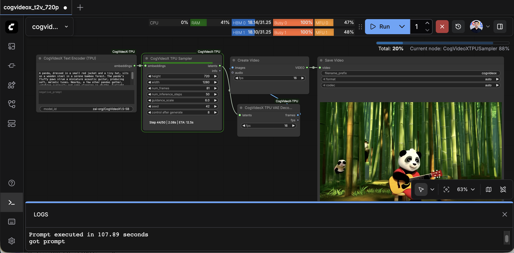
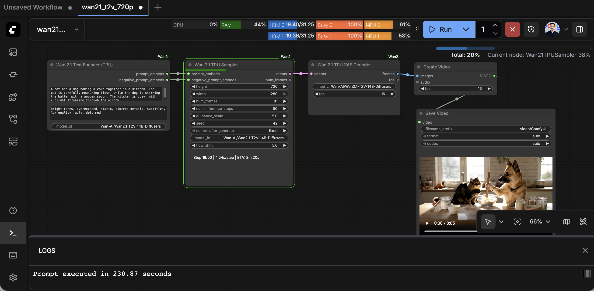
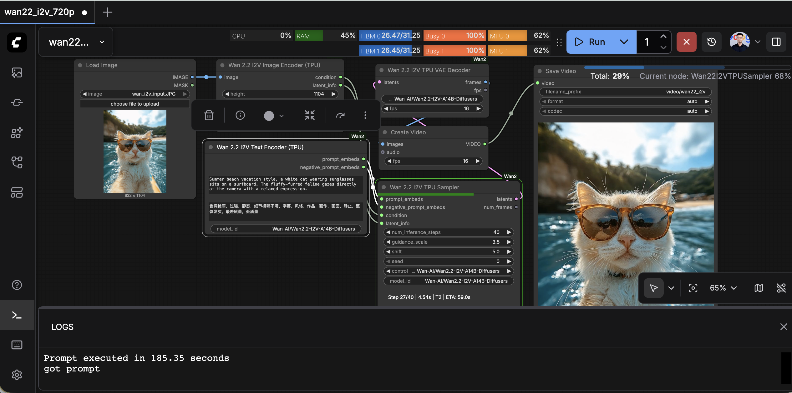
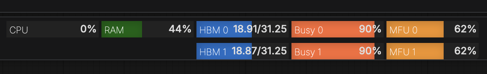

# ComfyUI on TPU

**[中文文档](README.md)** | **English**

Run ComfyUI on Google Cloud TPU with support for Flux.2 image generation and CogVideoX, Wan2.1, Wan2.2 video generation models.

**Author**: Chris Yang

---

## Quick Start

Use the one-click setup script for fast TPU environment configuration (recommended):

```bash
# 1. Clone the gpu-tpu-pedia repository
git clone https://github.com/yangwhale/gpu-tpu-pedia.git
cd gpu-tpu-pedia/tpu/ComfyUI

# 2. Run the setup script (requires sudo)
python3 setup.py

# 3. After installation, reload environment variables
source ~/.bashrc

# 4. Set HuggingFace Token (required for gated models)
export HF_TOKEN=<your_huggingface_token>

# 5. Start ComfyUI
cd ~/ComfyUI && python main.py --cpu --listen 0.0.0.0
```

Access ComfyUI: `http://<TPU_VM_IP>:8188`

---

## Table of Contents

- [Quick Start](#quick-start)
- [Requirements](#requirements)
- [Manual Installation](#manual-installation)
  - [Installing Python 3.12](#installing-python-312-ubuntu-2204)
  - [Installing ComfyUI](#installing-comfyui)
  - [Installing ComfyUI Manager](#installing-comfyui-manager)
  - [Installing TPU Custom Nodes](#installing-tpu-custom-nodes)
  - [Installing TPU Core Dependencies](#installing-tpu-core-dependencies)
- [Starting ComfyUI](#starting-comfyui)
- [Clearing HBM Before Switching Models](#clearing-hbm-before-switching-models)
- [Supported Models](#supported-models)
  - [Flux.2-TPU (Image Generation)](#comfyui-flux2-tpu)
  - [CogVideoX-TPU (Text-to-Video)](#comfyui-cogvideox-tpu)
  - [Wan2.1-TPU (Text-to-Video)](#comfyui-wan21-tpu)
  - [Wan2.2-I2V-TPU (Image-to-Video)](#comfyui-wan22-i2v-tpu)
  - [Crystools (Hardware Monitoring)](#comfyui-crystools)
- [Performance Benchmarks](#performance-benchmarks)
- [Troubleshooting](#troubleshooting)
- [Related Links](#related-links)

---

## Requirements

| Item | Requirement |
|------|-------------|
| **Hardware** | Google Cloud TPU v4, v5, v6e (v6e-8 recommended) |
| **Operating System** | Ubuntu 22.04 |
| **Python** | 3.10+ (3.12 recommended) |
| **JAX** | 0.8.1 + libtpu 0.0.30 |
| **Storage** | 100GB+ (model cache recommended to use /dev/shm) |

### Why JAX 0.8.1?

JAX 0.8.2's CPU AOT compiler has compatibility issues on certain CPU architectures (e.g., AMD EPYC), causing `prefer-no-scatter` feature mismatch warnings. Using JAX 0.8.1 + libtpu 0.0.30 avoids these issues.

---

## Manual Installation

If you prefer not to use the one-click setup script, follow these steps for manual installation.

### Installing Python 3.12 (Ubuntu 22.04)

TPU VM defaults to Python 3.10. Upgrading to Python 3.12 is recommended:

```bash
# 1. Stop unattended-upgrades (avoid apt lock conflicts)
sudo systemctl stop unattended-upgrades

# 2. Add deadsnakes PPA and install Python 3.12
sudo add-apt-repository ppa:deadsnakes/ppa -y
sudo apt-get update
sudo apt-get install -y python3.12 python3.12-venv python3.12-dev

# 3. Initialize pip (Python 3.12 removed distutils)
python3.12 -m ensurepip --upgrade

# 4. Set as default python
sudo update-alternatives --install /usr/bin/python3 python3 /usr/bin/python3.12 1
sudo update-alternatives --install /usr/bin/python python /usr/bin/python3.12 1

# 5. Verify
python --version  # Should display Python 3.12.x
```

### Configuring pip

Python 3.12 defaults to disabling system-wide installation (PEP 668), configuration required:

```bash
mkdir -p ~/.config/pip
cat > ~/.config/pip/pip.conf << 'EOF'
[global]
break-system-packages = true
EOF
```

### Installing ComfyUI

```bash
cd ~
git clone https://github.com/comfyanonymous/ComfyUI.git
cd ComfyUI
pip install -r requirements.txt
```

### Installing ComfyUI Manager

```bash
cd ~/ComfyUI/custom_nodes
git clone https://github.com/ltdrdata/ComfyUI-Manager.git

# Configure to use pip (avoid uv permission issues)
mkdir -p ~/ComfyUI/user/__manager
cat > ~/ComfyUI/user/__manager/config.ini << 'EOF'
[default]
use_uv = False
EOF
```

### Installing TPU Custom Nodes

```bash
# Copy TPU-optimized nodes from gpu-tpu-pedia
cd ~/gpu-tpu-pedia/tpu/ComfyUI/custom_nodes
cp -r ComfyUI-Flux.2-TPU ~/ComfyUI/custom_nodes/
cp -r ComfyUI-CogVideoX-TPU ~/ComfyUI/custom_nodes/
cp -r ComfyUI-Wan2.1-TPU ~/ComfyUI/custom_nodes/
cp -r ComfyUI-Wan2.2-I2V-TPU ~/ComfyUI/custom_nodes/
cp -r ComfyUI-Crystools ~/ComfyUI/custom_nodes/

# Install Crystools dependencies
pip install -r ~/ComfyUI/custom_nodes/ComfyUI-Crystools/requirements.txt
```

### Installing TPU Core Dependencies

```bash
# Core ML libraries
pip install huggingface-hub transformers datasets evaluate accelerate timm flax numpy

# JAX with TPU (using 0.8.1 to avoid CPU AOT compatibility issues)
pip install 'jax[tpu]==0.8.1' -f https://storage.googleapis.com/jax-releases/libtpu_releases.html
pip install torchax tensorflow-cpu

# Utilities
pip install sentencepiece imageio[ffmpeg] tpu-info matplotlib
pip install 'jinja2>=3.1.0'  # Required for Flux.2
pip install ftfy             # Required for Wan2.1

# Install ffmpeg
sudo apt-get install -y ffmpeg

# Install diffusers-tpu (TPU-optimized Diffusers)
cd ~
git clone https://github.com/yangwhale/diffusers-tpu.git
cd diffusers-tpu && pip install -e . && cd ..
```

### Configuring Environment Variables

```bash
cat >> ~/.bashrc << 'EOF'

# === ComfyUI TPU Environment ===
export PATH=$HOME/.local/bin:$PATH
export HF_HOME=/dev/shm
export HF_TOKEN=<your_huggingface_token>
export JAX_COMPILATION_CACHE_DIR=$HOME/.cache/jax_cache
# === End ComfyUI TPU Environment ===
EOF

source ~/.bashrc
```

> **Note**: Replace `<your_huggingface_token>` with your [HuggingFace Token](https://huggingface.co/settings/tokens). This token is required to access gated models (e.g., Flux.2).

---

## Starting ComfyUI

### Basic Startup

```bash
cd ~/ComfyUI
python main.py --cpu --listen 0.0.0.0
```

**Parameter Reference**:
- `--cpu`: Disables CUDA, uses CPU as default device (TPU nodes automatically use JAX/TPU)
- `--listen 0.0.0.0`: Enables external access
- `--port 8188`: Specify port (default 8188)

### Running in Background

```bash
# Using nohup
nohup python main.py --cpu --listen 0.0.0.0 > comfyui.log 2>&1 &

# View logs
tail -f comfyui.log

# Using screen
screen -S comfyui
python main.py --cpu --listen 0.0.0.0
# Ctrl+A, D to detach; screen -r comfyui to resume
```

---

## Clearing HBM Before Switching Models

⚠️ **Important**: TPU's HBM (High Bandwidth Memory) is limited. Before switching to a different model, **you must clear HBM first**, otherwise OOM will occur.

### Clearing Methods

1. **Using ComfyUI Manager**: Click **Manager** in the top-right corner → **🧹 Unload Models**
2. **Restart ComfyUI**: `pkill -f "python main.py" && cd ~/ComfyUI && python main.py --cpu --listen 0.0.0.0`

### When to Clear

| Scenario | Clearing Required |
|----------|-------------------|
| Flux.2 → Wan2.1 | ✅ Yes |
| Wan2.1 → CogVideoX | ✅ Yes |
| CogVideoX → Wan2.2-I2V | ✅ Yes |
| Same model multiple times | ❌ No |
| Changing seed/prompt | ❌ No |

---

## Supported Models

### ComfyUI-Flux.2-TPU

**Purpose**: Run Flux.2 image generation model on TPU (Black Forest Labs).

**Features**:
- 🚀 **TPU Acceleration**: Uses torchax to run Flux.2 Transformer and VAE on TPU
- 🔧 **Modular Design**: Separate Text Encoder, Sampler, and VAE Decoder nodes
- ⚡ **Splash Attention**: TPU-optimized attention for long sequences (using exp2 optimization)
- 🔄 **Auto Sharding**: Automatically distributes model weights across 8 TPU cores

**Node List**:

| Node Name | Execution Location | Function |
|-----------|-------------------|----------|
| **Flux.2 Text Encoder (CPU)** | CPU | Encodes text prompt using Mistral3 |
| **Flux.2 TPU Sampler** | TPU | Runs Transformer denoising, generates latents |
| **Flux.2 TPU VAE Decoder** | TPU | Decodes latents to final image |
| **Flux.2 TPU Full Pipeline** | TPU | End-to-end image generation (combines above three) |

**Workflow**:

```
┌─────────────────────┐     ┌──────────────────┐     ┌─────────────────────┐     ┌───────────────┐
│ Flux.2 Text Encoder │────▶│ Flux.2 TPU      │────▶│ Flux.2 TPU VAE      │────▶│ Preview Image │
│ (CPU)               │     │ Sampler         │     │ Decoder             │     │               │
│                     │     │                 │     │                     │     │               │
│ prompt: "..."       │     │ height: 1024    │     │ height: 1024        │     │               │
│ model_id: ...       │     │ width: 1024     │     │ width: 1024         │     │               │
│                     │     │ steps: 50       │     │ model_id: ...       │     │               │
│                     │     │ guidance: 4.0   │     │                     │     │               │
│                     │     │ seed: ...       │     │                     │     │               │
└─────────────────────┘     └──────────────────┘     └─────────────────────┘     └───────────────┘
       prompt_embeds ────────────▶ LATENT ─────────────────▶ IMAGE ─────────────────▶
```

**Parameter Reference**:

#### Text Encoder
| Parameter | Default | Description |
|-----------|---------|-------------|
| `prompt` | - | Image description text |
| `model_id` | `black-forest-labs/FLUX.2-dev` | HuggingFace model ID |

#### TPU Sampler
| Parameter | Default | Range | Description |
|-----------|---------|-------|-------------|
| `height` | 1024 | 256-2048 | Output image height |
| `width` | 1024 | 256-2048 | Output image width |
| `num_inference_steps` | 50 | 1-100 | Denoising steps |
| `guidance_scale` | 4.0 | 0-20 | Embedded CFG guidance strength |
| `seed` | 42 | - | Random seed |

#### VAE Decoder
| Parameter | Default | Description |
|-----------|---------|-------------|
| `height` | 1024 | Must match Sampler |
| `width` | 1024 | Must match Sampler |
| `model_id` | `black-forest-labs/FLUX.2-dev` | HuggingFace model ID |

**Architecture Notes**:

- **Text Encoder (Mistral3)**: Flux.2 uses Pixtral 7B variant (Mistral3) as text encoder. Due to dynamic control flow, currently runs on CPU.
- **Transformer (TPU)**: 24-layer MMDiT architecture, Attention heads: 24, Hidden size: 3072, uses Splash Attention optimization (exp2 instead of exp), weights auto-sharded to 8 TPU cores.
- **VAE Decoder (TPU)**: Flux.2-specific VAE, incompatible with SDXL VAE, runs on TPU for accelerated decoding.

**Example Workflow**: [`examples/flux2_tpu_basic.json`](custom_nodes/ComfyUI-Flux.2-TPU/examples/flux2_tpu_basic.json)

---

### ComfyUI-CogVideoX-TPU

**Purpose**: Run CogVideoX 1.5-5B text-to-video model on TPU (BAAI/Zhiyuan Research Institute).



**Features**:
- **Native TPU Acceleration**: Uses JAX/torchax to run CogVideoX inference on TPU
- **Splash Attention**: Custom Pallas kernel with exp2 optimization, fully utilizing TPU VPU hardware
- **Three-Stage Pipeline**: Text encoding, Transformer denoising, VAE decoding separated for memory efficiency
- **K-Smooth Optimization**: Optional Key smoothing for improved attention stability
- **CFG Parallel**: DP=2 supports CFG positive/negative prompt parallel processing

**Node List**:

| Node Name | Function |
|-----------|----------|
| `CogVideoXTextEncoder` | Encodes text prompt using T5 |
| `CogVideoXTPUSampler` | Runs Transformer denoising on TPU |
| `CogVideoXTPUVAEDecoder` | Decodes latents to video frames |

**Workflow**: `TextEncoder → TPUSampler → TPUVAEDecoder → CreateVideo → SaveVideo`

**Parameter Reference**:

#### CogVideoXTextEncoder
| Parameter | Type | Default | Description |
|-----------|------|---------|-------------|
| `prompt` | STRING | - | Positive prompt |
| `negative_prompt` | STRING | "" | Negative prompt |
| `model_id` | STRING | `zai-org/CogVideoX1.5-5B` | HuggingFace model ID |

#### CogVideoXTPUSampler
| Parameter | Type | Default | Description |
|-----------|------|---------|-------------|
| `embeddings` | COGVIDEOX_EMBEDS | - | TextEncoder output |
| `height` | INT | 720 | Video height |
| `width` | INT | 1280 | Video width |
| `num_frames` | INT | 81 | Frame count (81 = ~5s @ 16fps) |
| `num_inference_steps` | INT | 50 | Sampling steps |
| `guidance_scale` | FLOAT | 6.0 | CFG guidance strength |
| `seed` | INT | 42 | Random seed |
| `num_devices` | INT | 8 | TPU device count |

> **Note**: `num_frames` should satisfy `(num_frames-1)/4+1` being odd, otherwise VAE decoding will produce extra frames. Valid counts: 41, 49, 57, 65, 73, 81, 89, 97...

#### CogVideoXTPUVAEDecoder
| Parameter | Type | Default | Description |
|-----------|------|---------|-------------|
| `latents` | COGVIDEOX_LATENTS | - | Sampler output |
| `fps` | INT | 16 | Video frame rate |

**Technical Implementation**:

- **Splash Attention Optimization**: Query pre-multiplied by `LOG2_E = 1.44269504`, making `exp(x)` become `exp2(x * LOG2_E)`, better utilizing TPU VPU hardware; uses Pallas kernel for efficient block attention computation; K-Smooth technique reduces numerical overflow.
- **Weight Sharding Strategy (Tensor Parallel)**:
  ```python
  TRANSFORMER_SHARDINGS_TP = {
      r'.*\.to_q\.weight$': (None, 'tp'),
      r'.*\.to_k\.weight$': (None, 'tp'),
      r'.*\.to_v\.weight$': (None, 'tp'),
      r'.*\.to_out.*\.weight$': ('tp', None),
      r'.*\.ff\.net\.0\.weight$': (None, 'tp'),
      r'.*\.ff\.net\.2\.weight$': ('tp', None),
  }
  ```

**Performance (8x TPU v6e)**:

| Metric | First Run | Cached |
|--------|-----------|--------|
| Transformer (50 steps) | 126s | 104s |
| Per-step inference | 2.28s | 2.08s |
| VAE decode | 6.24s | 1.78s |
| Total time | 152s | 108s |

**Example Workflow**: [`examples/cogvideox_t2v_720p.json`](custom_nodes/ComfyUI-CogVideoX-TPU/examples/cogvideox_t2v_720p.json)

---

### ComfyUI-Wan2.1-TPU

**Purpose**: Run Wan2.1-T2V-14B text-to-video model on TPU (Alibaba).



**Features**:
- 🚀 **TPU Acceleration**: Uses torchax to run all Wan 2.1 components on TPU
- 🎬 **Video Generation**: Supports 720P (1280x720) and 480P (848x480) resolutions
- 🔧 **Modular Design**: Separate Text Encoder, Sampler, and VAE Decoder nodes
- ⚡ **Splash Attention**: TPU-optimized attention for long sequences (exp2 optimization)
- 🔄 **2D Mesh Sharding**: Automatically distributes model weights across 8 TPU cores (dp=2, tp=4)

**Node List**:

| Node Name | Execution Location | Function |
|-----------|-------------------|----------|
| **Wan 2.1 Text Encoder (TPU)** | TPU | Encodes prompt using T5-XXL |
| **Wan 2.1 TPU Sampler** | TPU | Runs Transformer denoising, generates latents |
| **Wan 2.1 TPU VAE Decoder** | TPU | Decodes latents to video frames |
| **Wan 2.1 TPU Full Pipeline** | TPU | End-to-end video generation (combines above three) |

**Workflow**:

```
┌───────────────────────┐     ┌──────────────────┐     ┌───────────────────────┐
│ Wan 2.1 Text Encoder  │────▶│ Wan 2.1 TPU     │────▶│ Wan 2.1 TPU VAE       │
│ (TPU)                 │     │ Sampler         │     │ Decoder               │
│                       │     │                 │     │                       │
│ prompt: "..."         │     │ height: 720     │     │                       │
│ negative_prompt: "..."│     │ width: 1280     │     │                       │
│                       │     │ num_frames: 81  │     │                       │
│                       │     │ steps: 50       │     │                       │
│                       │     │ guidance: 5.0   │     │                       │
└───────────────────────┘     └──────────────────┘     └───────────────────────┘
  prompt_embeds ──────────────────▶ latents ─────────────────▶ frames
  negative_prompt_embeds ─────────┘
```

**Parameter Reference**:

#### Text Encoder
| Parameter | Default | Description |
|-----------|---------|-------------|
| `prompt` | - | Video description text |
| `negative_prompt` | - | Negative prompt |
| `model_id` | `Wan-AI/Wan2.1-T2V-14B-Diffusers` | HuggingFace model ID |

#### TPU Sampler
| Parameter | Default | Range | Description |
|-----------|---------|-------|-------------|
| `height` | 720 | 256-1280 | Video height |
| `width` | 1280 | 256-1280 | Video width |
| `num_frames` | 81 | 17-121 | Frame count (must be 4n+1) |
| `num_inference_steps` | 50 | 1-100 | Denoising steps |
| `guidance_scale` | 5.0 | 0-20 | CFG guidance strength |
| `seed` | 2025 | - | Random seed |
| `flow_shift` | 5.0 | 1-10 | Flow Matching shift (720P=5.0, 480P=3.0) |

#### VAE Decoder
| Parameter | Default | Description |
|-----------|---------|-------------|
| `fps` | 16 | Output video frame rate |
| `model_id` | `Wan-AI/Wan2.1-T2V-14B-Diffusers` | HuggingFace model ID |

**Resolution Recommendations**:

| Resolution | height | width | flow_shift | Notes |
|------------|--------|-------|------------|-------|
| 720P | 720 | 1280 | 5.0 | High quality, recommended |
| 480P | 480 | 848 | 3.0 | Fast testing |

**Technical Details**:

- **2D Mesh Configuration**: Uses `(dp=2, tp=4)` for 8 TPU chips, dp: Data Parallel (batch sharding), tp: Tensor Parallel (weight sharding)
- **Splash Attention**: Uses exp2 instead of exp, leveraging TPU VPU hardware instructions; K-Smooth technique reduces numerical overflow; long sequences (>20000) use Splash Attention, short sequences use standard implementation

**Example Workflow**: [`examples/wan21_tpu_basic.json`](custom_nodes/ComfyUI-Wan2.1-TPU/examples/wan21_tpu_basic.json)

---

### ComfyUI-Wan2.2-I2V-TPU

**Purpose**: Run Wan2.2 image-to-video model on TPU with dual Transformer A14B architecture.



**Node List**:

| Node Name | Function | Input | Output |
|-----------|----------|-------|--------|
| **Wan22I2VImageEncoder** | Image condition encoding | IMAGE | CONDITION, LATENT_INFO |
| **Wan22I2VTextEncoder** | Text encoding (UMT5-XXL) | prompt, negative_prompt | prompt_embeds, negative_prompt_embeds |
| **Wan22I2VTPUSampler** | Dual Transformer denoising | embeds, condition, latent_info | LATENT |
| **Wan22I2VTPUVAEDecoder** | VAE decoding | LATENT | IMAGE |

**Workflow**:

```
┌─────────────┐     ┌─────────────────────┐
│ Load Image  │────▶│ Wan22I2VImageEncoder │──▶ condition
└─────────────┘     └─────────────────────┘     │
                                                 │
┌─────────────┐     ┌────────────────────┐      │
│ Prompt Text │────▶│ Wan22I2VTextEncoder │──┬──│
└─────────────┘     └────────────────────┘  │  │
                                             │  │
                    ┌────────────────────┐◀─┴──┘
                    │ Wan22I2VTPUSampler │
                    └────────────────────┘
                             │
                             ▼
                    ┌──────────────────────┐
                    │ Wan22I2VTPUVAEDecoder │──▶ VIDEO FRAMES
                    └──────────────────────┘
```

**Parameter Reference**:

#### Wan22I2VImageEncoder
| Parameter | Type | Default | Description |
|-----------|------|---------|-------------|
| `image` | IMAGE | - | ComfyUI IMAGE format |
| `height` | INT | 720 | Target height |
| `width` | INT | 1280 | Target width |
| `num_frames` | INT | 81 | Video frame count |
| `model_id` | STRING | - | Model path (optional) |

**Outputs**:
- `condition`: Image condition tensor `[B, 20, T_latent, H_latent, W_latent]`
- `latent_info`: Size information dictionary

#### Wan22I2VTextEncoder
| Parameter | Type | Default | Description |
|-----------|------|---------|-------------|
| `prompt` | STRING | - | Positive prompt |
| `negative_prompt` | STRING | - | Negative prompt |
| `model_id` | STRING | - | Model path (optional) |

#### Wan22I2VTPUSampler
| Parameter | Type | Default | Description |
|-----------|------|---------|-------------|
| `prompt_embeds` | EMBEDS | - | Text embeddings |
| `negative_prompt_embeds` | EMBEDS | - | Negative embeddings |
| `condition` | CONDITION | - | Image condition |
| `latent_info` | DICT | - | Size information |
| `num_inference_steps` | INT | 40 | Inference steps |
| `guidance_scale` | FLOAT | 3.5 | CFG guidance scale |
| `shift` | FLOAT | 5.0 | Timestep distribution shift |
| `seed` | INT | - | Random seed |

> **Note**: Higher `shift` values allocate more steps to the low-noise stage

#### Wan22I2VTPUVAEDecoder
| Parameter | Type | Default | Description |
|-----------|------|---------|-------------|
| `latents` | LATENT | - | LATENT dict |
| `model_id` | STRING | - | Model path (optional) |
| `fps` | INT | 16 | Frame rate |

**Technical Details**:

- **Dual Transformer Architecture**: Wan 2.2 I2V uses dual Transformer architecture
  - **Transformer 1**: Handles high-noise stage (t >= 900)
  - **Transformer 2**: Handles low-noise stage (t < 900)
  - Switch threshold controlled by `BOUNDARY_RATIO = 0.9`

- **A14B Mode**: Image condition encoding uses A14B mode
  1. Resize input image to target resolution
  2. Build video_condition: `[image, zeros, zeros, ...]`
  3. VAE encode to get latent_condition
  4. Normalize: `(x - mean) / std`
  5. Build mask (first frame=1, other frames=0)
  6. Concat condition = `concat(mask, latent_condition)`

- **Sharding Strategy**: Uses 2D Mesh (dp=2, tp=N/2) for model parallelism
  - Text Encoder: Word embedding and FFN sharding
  - Transformer: Attention and FFN sharding
  - VAE: Replicated (no sharding)

**Example Workflow**: See [`examples/`](custom_nodes/ComfyUI-Wan2.2-I2V-TPU/examples/) directory

---

### ComfyUI-Crystools

**Purpose**: Real-time TPU/GPU hardware monitoring with resource monitoring, progress bar, metadata viewing, and more.



**Features**:
- 🎉 **Resource Monitoring**: Real-time display of CPU, GPU, RAM, VRAM, GPU temperature, and storage
- 📊 **Progress Bar**: Shows workflow execution progress and elapsed time in menu bar
- 📝 **Metadata**: Extract, compare, and display image/workflow metadata
- 🔧 **Debugging Tools**: Display any value to console/display
- 🔗 **Pipe Tools**: Better organize workflow connections

**Monitoring Metrics**:

| Metric | Description |
|--------|-------------|
| **CPU** | CPU usage percentage |
| **RAM** | Memory usage and percentage |
| **GPU/TPU** | VRAM/HBM usage |
| **GPU Temp** | GPU temperature (NVIDIA only) |
| **HDD** | Disk space usage |

**Main Nodes**:

| Node Name | Function |
|-----------|----------|
| **Load image with metadata** | Load image and extract metadata |
| **Save image with extra metadata** | Save image with custom metadata |
| **Preview from image** | Preview image with current prompt display |
| **Metadata extractor** | Extract complete image metadata |
| **Metadata comparator** | Compare metadata differences between two images |
| **Show any** | View any value in console/display |
| **JSON comparator** | Compare two JSON differences |

**Configuration**: Monitor appears in the ComfyUI interface top menu bar. Configure via **Settings → Crystools** for refresh rate and display items.

> **Note**: Set refresh rate to `0` to disable monitoring and reduce system overhead.

---

## Performance Benchmarks

Test Environment: **TPU v6e-8** (8 chips, 32 GiB HBM per chip)

### Flux.2 (Image Generation, 1024x1024)

| Stage | First Run | Cached |
|-------|-----------|--------|
| Transformer (50 steps) | 190s | ~120s |
| Per-step inference | 3.81s | ~2.4s |
| VAE decode | 19s | ~5s |
| **Total** | **292s** | **~150s** |

### CogVideoX (Video Generation, 720p, 81 frames)

| Stage | First Run | Cached |
|-------|-----------|--------|
| Transformer (50 steps) | 231s | ~105s |
| Per-step inference | 3.35s | 2.08s |
| VAE decode | 79s | ~6s |
| **Total** | **355s** | **~130s** |

### Wan2.1 (Video Generation, 720p, 81 frames)

| Stage | Value |
|-------|-------|
| Transformer (50 steps) | ~227s |
| Per-step inference | ~4.54s |
| VAE decode | ~1.16s |
| **Total** | **~230s** |

> **Note**: First run includes JAX JIT compilation time. Subsequent runs use cache, significantly improving speed.

---

## Troubleshooting

### 1. "No module named 'tpu_info'"

```bash
pip install tpu-info
```

### 2. "Could not find TPU devices"

Ensure running on TPU VM:

```bash
python -c "import jax; print(jax.devices())"
# Should display [TpuDevice(...), ...]
```

### 3. "JAX TPU init failed" / libtpu version mismatch

Use recommended version:

```bash
pip install 'jax[tpu]==0.8.1' -f https://storage.googleapis.com/jax-releases/libtpu_releases.html
```

### 4. "prefer-no-scatter" CPU AOT compatibility warning

This is a known issue with JAX 0.8.2, downgrade to 0.8.1 to resolve:

```bash
pip install 'jax[tpu]==0.8.1' -f https://storage.googleapis.com/jax-releases/libtpu_releases.html
```

### 5. "401 Client Error: Unauthorized" (accessing HuggingFace models)

Set HuggingFace Token:

```bash
export HF_TOKEN=<your_token>
# Or add to ~/.bashrc
```

### 6. "name 'ftfy' is not defined" (Wan2.1)

```bash
pip install ftfy
```

### 7. "jinja2.exceptions.TemplateNotFound" (Flux.2)

```bash
pip install 'jinja2>=3.1.0'
```

### 8. Out of Memory (OOM)

- Unload Models before switching models
- Reduce `num_frames`, `height`/`width`
- Reduce batch size

### 9. Video save fails

```bash
sudo apt-get install -y ffmpeg
pip install imageio[ffmpeg]
```

---

## Related Links

- [ComfyUI Official Repository](https://github.com/comfyanonymous/ComfyUI)
- [ComfyUI Manager](https://github.com/ltdrdata/ComfyUI-Manager)
- [diffusers-tpu](https://github.com/yangwhale/diffusers-tpu)
- [JAX Official Documentation](https://jax.readthedocs.io/)
- [tpu-info](https://github.com/google/tpu_info)
- [HuggingFace Hub](https://huggingface.co/)

---

## License

MIT License
