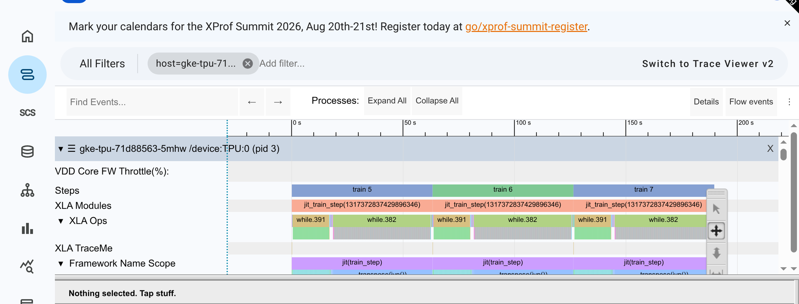
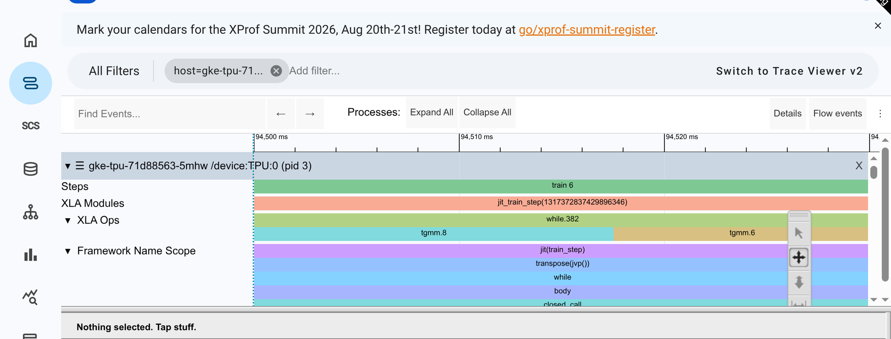

# Hunyuan3-295B on TPU v5p —— 调优记录

跑通是 [QUICKSTART-v5p.md](QUICKSTART-v5p.md) 的事，这份只管**怎么更快**。

这份文档想讲清楚一件事：**我们在 v7 上辛苦攒的调优结论，搬到 v5p 上能用几条？**
答案是 **0/5** —— 而搞清楚"为什么一条都搬不动"，比那点性能提升值钱得多。

---

## 1. 起点：v5p 现在多快

| | 值 | 来源 |
|---|---|---|
| 规模 | 256 芯片（`ct5p-hightpu-4t` × 64，拓扑 `4x8x8`） | QUICKSTART-v5p §5.1 |
| 稳态 step | **63.199 s** | 2026-08-01 第三次复现，与文档差 +0.05% |
| TFLOP/s / chip | **160.909** | |
| **MFU** | **35.05%** | |
| 整机吞吐 | 265,588 tok/s | |
| BF16 峰值 / chip | 459 TFLOPS | |
| HBM / chip | 95.74 GB，**实测贴顶** | |

**三平台对照**：同模型 v7 64 芯片 MFU **19.29%**，GB300 64 GPU BF16 **31.6%**。

v5p 的 35.05% 是三者里最高的。这句话有两层含义，都很重要：

1. **可压榨空间比 v7 小得多。** v7 那边有 57.3% 的墙钟耗在通信上，随便捡都是几个点；
   v5p 已经被前人调到 35%，剩下的都是硬骨头。**别拿 v7 的期望值套过来。**
2. **v5p 高在哪，决定了该往哪调。** 这个"哪"不能靠猜，[§4](#4-看图说话trace-怎么读) 用 trace 给了答案。

---

## 2. 主线结论：v7 的经验一条都没搬成

v7 那边跑了 34 个开关组合（[TUNING-v7 §7](TUNING-v7.md#7-消融总表34-个开关组合一次跑完的账)）。
我挑了迁移价值最高的五项，在 v5p 256 芯片上逐条重测。

### 2.1 五项判决

| 项 | v7 实测 | v5p 实测 | 判定 |
|---|---|---|---|
| MoE tile = 512 | −3.90% | **+2.70%** | ✅ **唯一正收益**，待 trace 复核后采纳 |
| 优化器状态 BF16 | 未测 | −0.19% | ⚪ 速度零收益（在 0.25% 抖动内），但省 HBM，留给 R11 换 batch |
| MoE tile = 1536 | **+8.25%** | −5.10% | ❌ 反号 |
| ring of experts + 分块 | EP 下挽回 34 pp | **−21.48%** | ❌ 本轮最大负收益 |
| remat 全量 | 16 卡 +1.22% | **OOM**（123.33 G / 95.73 G） | ❌ host offload 在 v5p 是必需项 |

**跨平台命中率 0/5。** 两条反号、一条 OOM、一条从"最大收益"变"最大损失"、
一条从"可选优化"变"必需项"。

### 2.2 最典型的一条：MoE tile 完全反序

v7 上实测的规律是「tile **必须等于** `base_moe_mlp_dim`(1536)」：

| tile mlp_dim | v7（16 芯片） | v5p（256 芯片） |
|---|---|---|
| 512 | −3.90% | **61.496 s（+2.70%）← v5p 最优** |
| 1024（默认） | **崩**（`AssertionError: v=1536 bv=1024`） | 63.199 s（基准） |
| 1536（= 中间维） | **+8.25% ← v7 最优** | 66.421 s（**−5.10%**） |

**顺序完全颠倒**：v7 是 512 < 1024(崩) < 1536，v5p 是 1536 < 1024 < 512。
同一个模型、同一个维度、同一个参数，**一个平台上的最优解是另一个平台上的最差解**。

一条关键线索：v7 上 1024 是**形状校验直接失败**，说明那条 kernel 路径根本没跑起来；
v5p 上 1024 跑得好好的。**两代的 Mosaic kernel 对分块的处理逻辑本就不同。**

### 2.3 所以：XLA / kernel 层的结论天生绑硬件代次

这不是"v7 的结论错了"。三条都能追到物理原因：

| 结论 | 绑在什么上 |
|---|---|
| 分块尺寸 | MXU 的形状与 Mosaic kernel 的实现 |
| 通信开关（SparseCore 卸载组） | 有没有 SparseCore —— v7 上零收益，v5p 上**值 4.07 pp** |
| 显存策略（remat / offload） | HBM 容量与当前水位 |

> **可复用的规矩**：拿到任何一份别的平台的调优参数集，
> **默认假设是"全部无效"**，逐条实测。可以用它来**排序**测试优先级，
> 不能用它来**跳过**测试。

### 2.4 中途翻案：我一直在错误的搜索空间里扫 tile

[§2.2](#22-最典型的一条moe-tile-完全反序) 那张表有个前提假设我从没质疑过：
**六条 tile 通路应该取同一个值**。我扫 512 / 1024 / 1536 都是在这个前提下扫的。

后来去翻官方 benchmark 套件（`ubench`）里 DeepSeek V3 671B 的调优配置，
发现**官方根本不这么配**：

```
              embed_dim   mlp_dim          （DeepSeek: base_emb_dim = 7168）
wi_fwd          7168        512
wi_dlhs          512       7168
wi_drhs         7168        512
wo_fwd           512       7168
wo_dlhs         7168        512
wo_drhs          512       7168
```

规律非常干净：**每条通路上，被收缩掉的那一维给满（等于不分块），另一维给 512。**
前向和两个反向（`dlhs` / `drhs`）的收缩维不同，所以数值要**成对交换**。

这解释了为什么我扫出来的三个值都不理想 —— **我在该给满的地方切碎，
在该切碎的地方给满**。512 之所以相对最好，只是因为它在六条里"碰巧对"的次数最多。

> **教训**：扫参数之前，先确认**参数之间是不是独立的**。
> 六个 tile 看起来是六个旋钮，实际是**三对**由矩阵乘收缩维决定的绑定关系。
> 把有约束的参数当独立参数扫，扫出来的"最优"只是错误空间里的局部最优。

**顺带一条更重要的线索**：那份官方配置里 **`use_tokamax_gmm: true`**。
也就是说 tokamax 在官方 DeepSeek 配置里是**开着并正常工作**的。
那我们 Hy3 上的 tokamax 问题（[R7](#52-第二批两个重点未测项)）很可能**根本不是 tokamax 的锅**，
而是**喂了错误的 tile 配置**给它 —— 这跟 FP8 撞的 `v=1536 bv=1024` 断言指向同一处。

> ✅ **这条预测后来被证实了**，而且比预想的更精确：
> 坏 tile 确实是主因，但**不是我们从外面喂进去的**，
> 是 tokamax 内部查表 miss 后自己退回的默认值。
> 完整推导见 [§2.6](#26-打开盒子不跨代的机理落到了一张查找表上)。

**按此重排的实验**（Hy3 `base_emb_dim=4096`、`base_moe_mlp_dim=1536`，
"给满"取 4096，≥ 两个维度）：

| # | 配置 | 验什么 |
|---|---|---|
| R13 | 官方逐通路模式（bf16） | 正确搜索空间下的 tile 收益 |
| R14 | 官方模式 + `use_tokamax_gmm` | **tokamax 的问题是不是坏 tile 引起的** |
| R15 | 官方模式 + `fp8_full` | 绕开 `v=1536 bv=1024` 断言后 FP8 的真实收益 |

> ⚠️ 那份官方配置是 **tpu7x** 的，不是 v5p。我当时的预测是：
> **具体数值不能照抄，但结构（哪一维该给满）是矩阵乘的数学性质，应该跨代成立。**

### 2.5 预测又错了：连"结构"也不跨代

**R13 实测：74.151 s，−17.33%。** 比默认的 1024 还差 17%，比最优的 512 差 20%。

| tile 配置 | v5p step (s) | Δ |
|---|---|---|
| 全 512（同值） | **61.496** | **+2.70%** ← 仍是最优 |
| 全 1024（默认，同值） | 63.199 | 基准 |
| **官方逐通路模式** | **74.151** | **−17.33%** |
| 全 1536（同值） | 66.421 | −5.10% |

**我在 [§2.4](#24-中途翻案我一直在错误的搜索空间里扫-tile) 里的推理链是对的，
但最后那句外推是错的。** 「收缩维不分块」在数学上确实更省重复读写 ——
可这条只在**片上内存放得下整维**时成立。

> ⚠️ **以下是假设，没有 trace 证据支撑**：v5p 的 VMEM 布局与 tpu7x 不同，
> 把一维完全不分块可能让工作集撑破 VMEM，代价超过省下的重复读写。
> 我尝试过截 R13 的 trace 来验证，但**没做成**：R13 的 step 是 74 s、
> 基线是 63 s，用同一个绝对时间窗口截出来的两张图落在 step 内的不同相对位置，
> **不可比**。要验证得先定位各自的 step 边界再取相同相对位置——
> 考虑到这条配置已经否决，暂不投入。
>
> **所以这里只有实测事实（−17.33%）是硬的，机理解释是软的。** 别把它当结论引用。

所以这条要收窄成：

> **矩阵乘的数学结构决定了"哪些配置合法"（约束，跨代），
> 但不决定"哪个配置最快"（性能，不跨代）—— 连结构层面的偏好也不跨代。**
> 唯一真正跨代的仍然只有 [§5.2](#52-第二批两个重点未测项) 那条形状校验（能不能整除）。

**这是本文档第二次自我推翻**（第一次是 [§2.4](#24-中途翻案我一直在错误的搜索空间里扫-tile) 推翻同值扫描）。
留着不删，因为**推理链本身是对的，错的是"数学上更优 ⇒ 实测更快"这一步的外推**——
这个坑很容易再踩。

### 2.6 打开盒子：不跨代的机理，落到了一张查找表上

前面五条都是黑盒结论——测出来不跨代，但说不清卡在哪一环。
`use_tokamax_gmm` 这一项能打开盒子：**问题精确到 kernel 库里一张字典少了一行。**

#### 现象：跑二十分钟，一步都不出

开 `use_tokamax_gmm=True`，进程不报错、不退出，就是不产出 step。
第一次遇到时我给的解释是"在编译 gmm 的矩阵形状，慢很正常"——**这个解释是错的**，
而且我当时没验证就接受了。把日志翻出来，时间线自己会说话：

```
04:34:48  启动
04:34:56  tokamax: Autotuning cache miss（.../autotuning/tpu_v5/pallas_mosaic_tpu_ragged_dot.json 不存在）
04:36:59  Execute 派发到设备
04:44:53  PjRt: Slow TPU operation detected, start_time=04:36:59
04:44:53  TpuDiagnosticCoordinator: Stall detected on host 56
04:49:53  仍在告警
04:54:53  仍在告警  →  全程 0 步
```

编译只占了前两分钟。**卡住的是第三分钟派发下去的那个 Execute，二十分钟没返回。**
所以这既不是"编译慢"，也不是死锁——是慢到 TPU 运行时把它判定成了 stall。

> 这里有个可以复用的判据：**只有 2 种矩阵形状进入 autotune**
> （`(524288,4096)×(192,4096,1536)` 是 wi，`(524288,1536)×(192,1536,4096)` 是 wo）。
> 80 层压根没展开——`scan_layers=True` 下 XLA 只编 loop body，
> 层数只改 trip count。**所以"层多所以编译久"这个解释在 scan 模式下天然不成立**，
> 看到它就该怀疑。

#### 根因：专家数 192 不在调优表里

tokamax 的 TPU ragged_dot 按 `(m, k, n, 专家数, 是否量化)` 查一张硬编码的 tile 表，
三条通路各一张（`GMM_TILING_TUNED_LUT` / `GMM_RHS_TRANSPOSE_TILING_TUNED_LUT` / `TGMM_TILING_TUNED_LUT`）。
查不到就退回 `Config()` 默认值。实际扒出来：

```
GMM_TILING_TUNED_LUT: 28 条, 专家数取值 = [16, 128, 256]
  (524288, 4096, 1536, 128, False) -> tile (256, 4096, 1536)
  (524288, 1536, 4096, 128, False) -> tile (512, 1536, 1536)
默认 Config = tile_m=128, tile_k=128, tile_n=128
```

**Hunyuan3 是 192 个专家。** 矩阵尺寸跟表里那条一模一样，只有分组数不同，于是全部 miss：

| | tile | grid 块数 |
|---|---|---|
| 表里调优过的（专家数 128） | (256, 4096, 1536) | 2048 × 1 × 1 = **2,048** |
| 实际退回的默认值 | (128, 128, 128) | 4096 × 32 × 12 = **1,572,864** |

**768 倍的块数**，每块都要独立 DMA 搬运。慢三个数量级，跟观察到的行为吻合。

#### 两道防线在 v5p 上同时失守

tokamax 本来有两层保护，v7 上能兜住，v5p 上都没兜住：

| 防线 | v7 (tpu7x) | v5p |
|---|---|---|
| 预置 autotuning cache | ✅ `autotuning/tpu7x/` 19 个文件 | ❌ 目录只有 `tpu7x` 和 `tpu_v5_lite`（v5e），**没有 v5p** |
| 硬编码 tile LUT | ❌ 同样 miss（专家数 192 不在表里） | ❌ 同样 miss |

**这就是"kernel 层结论不跨代"最具体的一个样子**：不是什么玄学的硬件差异，
就是上游给 tpu7x 做了调优、给 v5e 做了调优，**没给 v5p 做**。
[§2.3](#23-所以xla--kernel-层的结论天生绑硬件代次) 那条"默认假设全部无效"的规矩，
在这里的落地形式是——**先去 kernel 库里确认你这代硬件有没有被覆盖**。

#### 修法与实测

矩阵尺寸完全一致，只有分组数不同，所以直接把专家数 128 的条目镜像一份到 192：

```python
# tokamax/_src/ops/ragged_dot/pallas_mosaic_tpu.py 末尾追加
for _lut in (GMM_TILING_TUNED_LUT, GMM_RHS_TRANSPOSE_TILING_TUNED_LUT, TGMM_TILING_TUNED_LUT):
  for _k in [k for k in list(_lut) if k[3] == 128]:
    _lut.setdefault((_k[0], _k[1], _k[2], 192, _k[4]), _lut[_k])
```

> 这是**借用**不是调优。192 分组下每组约 2731 行，tile_m=256 除不尽会留余数，
> 效率一定不如真跑一次 autotune。但先验证方向对不对，比一开始就跑几小时 autotune 划算。

#### R16 实测：不挂了，但还是比现有方案慢

从 tensorboard 里读出的逐步耗时（`perf/step_time_seconds`）：

```
75.729 | 0.364 | 149.297 | 73.593 | 73.595 | 73.595 | 73.592 | 73.590 | 73.586
└── 前 3 步热身噪声 ──┘ └────────── 稳态，6 步抖动 < 0.01% ──────────┘
```

`learning/loss` 从 13.423 平滑降到 12.935 —— **训练是正确的，不是空转。**

| | step (s) | TFLOP/s/dev | MFU | Δ |
|---|---|---|---|---|
| 基线（megablox，同 tile） | **63.199** | 160.909 | 35.05% | — |
| **R16（tokamax + LUT 补丁）** | **73.590** | 138.19 | 30.11% | **−16.44%** |
| （参考）R7 修补前 | 20 分钟 0 步 | — | — | 不可用 |

**所以结论分两半，不要混着说**：

1. ✅ **根因判断成立。** 从"20 分钟出不了一步"到"稳态 6 步抖动小于万分之一"，
   改动只有 LUT 里那几行。这条因果链是硬的。
2. ❌ **但 tokamax 目前仍不如 megablox。** 慢 16.44%。

第 2 条**还不能推广成"tokamax 在 v5p 上不行"**——因为我从没给 192 分组真调过。
借来的 tile 是按 128 组调的：192 组下每组约 2731 行，`tile_m=256` 除不尽（10.7 块），
余数上的算力全浪费。**要判 tokamax 的死刑，得先跑 R17（真 autotune）。**

> 这里又是一次"事实"和"解释"要分开写：
> 慢 16.44% 是测出来的；"因为余数浪费"是推测，R17 才能证伪。

---

## 3. 怎么测的

### 3.1 五条方法论（沿用 v7 的教训，不重新踩）

1. **同批次内比**。跨集群、跨节点池比绝对值没有意义 —— v7 上换了机器基线就差 15%。
2. **丢前 3 步**。单步 `seconds` 字段受异步派发干扰会跳变，用日志时间戳算跨步斜率。
3. **失败项照样记**。OOM 要记需要多少 G，配置拒绝要记缺什么前置，报错要记原文。
4. **前几步慢 ≠ 稳态慢**。Pallas / Mosaic kernel 按实际矩阵形状做**运行时编译**，
   前几步天然慢；至少跑 24 步再看稳态。（这条是 v7 上真栽过的跟头）
5. **小规模只用来排除**。任何要采纳的改动，必须在 256 芯片复测。

### 3.2 环境

复用 [QUICKSTART-v5p §3](QUICKSTART-v5p.md) 的建法，**留在 us-central1**。

```bash
gcloud container node-pools create np-v5p-256 \
  --cluster=CLUSTER --region=us-central1 \
  --node-locations=us-central1-a \
  --machine-type=ct5p-hightpu-4t --tpu-topology=4x8x8 --num-nodes=64 \
  --spot --scopes=cloud-platform
```

2026-08-01 实测：**64 台一次开出，全部 Ready**，不用排队、不用预留容量。
v5p 的裸容量是充足的 —— 这跟同期 v7 抢不到卡的处境完全不同，
**不要把 v7 的容量策略搬过来**（又一条不跨代）。

> `--scopes=cloud-platform` 不能漏 —— 默认只有 `devstorage.read_only`，
> 写 GCS 会 403，而且**节点池的 OAuth scope 建好之后改不了**，只能删了重建。

### 3.3 常驻环境：别每轮重建 pod

每轮重新提 JobSet，要重新调度、拉 1.73 GB 镜像、建切片、冷编译。改成
**64 个 pod `sleep infinity` 常驻 + `kubectl exec` 并行起每一轮**，省两样：

- pod 冷启动，每轮 3–5 分钟
- **跨轮共享 `jax_cache_dir`** —— 这是大头，只改 tile 之类参数时大部分 HLO 命中缓存

（结构性改动如 `use_ring_of_experts` 会重写 HLO，缓存命中不了，仍需完整编译一次。）

---

## 4. 看图说话：trace 怎么读

[§1](#1-起点v5p-现在多快) 留了个问题：**v5p 高在哪，该往哪调？** 这一节用 trace 回答。

每一轮都按同一个格式走：
**当前版本的图长什么样 → 从图上看出什么 → 改哪个参数 → 改完图长什么样**。

### 4.1 抓 trace 的固定流程

四步，每一步都有坑，按这个来不会返工。

**① 跑一轮带 profiler 的**

```bash
bash run.sh <name> \
  base_output_directory=gs://<bucket>/hy3out \
  profiler=xplane skip_first_n_steps_for_profiler=4 profiler_steps=3 \
  upload_all_profiler_results=False
```

- ⚠️ **`base_output_directory` 必须指到 GCS**。`run.sh` 默认写 `/tmp/hy3out`，
  那是 pod 内的路径，pod 一删 trace 就没了，c2xprof 也读不到。
- `skip_first_n_steps_for_profiler=4` —— 前几步含编译和异步派发的假读数。
- `profiler_steps=3` 足够。抓多了文件几个 G，上传慢。
- **性能数字不要从这一轮取**。profiler 有开销，Δ 要用不带 profiler 的干净跑。
  （实测两者差 0.006 s，可忽略，但纪律要守。）

**② 传 XProf 拿链接 —— 别用 MCP，直接 ssh 调**

```bash
ssh <corp-host> "GOOGLE_CLOUD_PROJECT=<project> \
  /google/.../cloud/tpu/tools/c2xprof/bin/c2xprof.par \
  --gcs_path=gs://.../<host>.xplane.pb" | grep -oE 'http://xprof\S+'
```

- **MCP 客户端硬超时 60 s，而上传常态就在 67–70 s** —— 等于每次都超时。
  超时不代表失败（任务还在跑），但你拿不到返回值。**直接走 ssh，不要用 MCP。**
- `GOOGLE_CLOUD_PROJECT` **必须显式给**。corp 机器上没有 gcloud，
  c2xprof 用内部库读 GCS，自动解析项目的链路是断的，不给就直接报错退出。
- **做成后台任务**：上传 ~70 s，下一轮训练 ~14 min，
  让上传跟下一轮并行，等于不花时间。

**③ 截图**

用 Chrome 打开 XProf 链接，`trace_viewer` 缩到 **30 ms 左右**的窗口才看得清算子交替。
整屏截图只能看出「lane 很满」，看不出谁在等谁。

> 时间轴单位是 **ms**，`view_start` / `view_end` 直接用毫秒值。
> 256 芯片 3 步的 trace 跨度约 **190,000 ms**，别按小规模的几百毫秒去猜坐标 ——
> 我第一次落在 100 ms 处，看到的是数据管线，不是计算。

**④ 落文档**

链接 + 截图 + **一句话说明这张图要看的是什么**。没有第三条，图就是装饰。

### 4.2 读图的三条纪律（v7 上栽出来的）

1. **不要在单条 lane 上算「通信与计算的交集」**。XLA Ops lane 是严格嵌套的，
   交集恒为 0，算出来是同义反复，不是「完全没重叠」。
2. **异步 ≠ 已掩盖**。`-start` / `-done` 成对出现只说明它是异步发的；
   真正要看的是 `-done` 上等了多久。
3. **要一个能配平到 100% 的分解**，用**自用时间**（每个算子减去子算子）。
   否则 `while` 这类容器算子会被重复计数，得出「掩盖率 83%」这种自相矛盾的结论。

> 这三条在 v7 上分别踩过一次，四个版本的结论被推翻了三次。
> 详见 [TUNING-v7 §4.3.1](TUNING-v7.md#431-实战第一轮-trace-是怎么读出结论的教学)。

### 4.3 R0：基线的图长什么样

<!-- ===== TEMP:XPROF-LINKS  组内讨论期临时保留，优化收尾后整块删除 ===== -->
XProf：http://xprof.corp.google.com/trace_viewer/chrisya-8390131192604817453
<!-- ===== /TEMP:XPROF-LINKS ===== -->

**① 全局：三步的宏观结构**



要看的是 **`XLA Ops` 那一行的 `while.382` / `while.391` 交替**。这两个 `while`
就是 MaxText 的两个 scan：`dense_layers`（1 层）和 `moe_layers`（79 层）。
层数只改变 `while` 的循环次数，不改变 HLO 大小 —— 这也是为什么
**编译时间几乎不随层数变**。

三个 step（train 5/6/7）宽度肉眼一致，跟日志里的毫秒级抖动对得上。
**宏观图只能验"稳不稳"，验不了"快不快"。**

**② 放大到 30 ms：步内到底在算什么**



窗口取在 `train 6` 中段（`view_start=94500&view_end=94530`）。要看的是
**`XLA Ops` 行几乎被 `tgmm.8` / `tgmm.6` 两个块填满**。
`tgmm` = transposed grouped matmul，MoE **反向**的分组矩阵乘。

**这张图最重要的信息是"没看到什么"**：

- 没有成片的 `-done` 等待块。v7 上同样 30 ms 的窗口里，
  `gmm` 和 `all-gather...call-done` 是**交替**出现的，通信占自用时间 57.3%。
- v5p 这一窗几乎是连续的 MoE 计算。这和 **MFU 35.05% vs v7 19.29%**
  是同一件事的两个侧面：v5p 的 SparseCore 集合通信卸载把 MoE 那些碎通信藏进去了 ——
  所以那组 flag 在 v5p 上值 4.07 pp，在 v7 上却是零收益（[§2.3](#23-所以xla--kernel-层的结论天生绑硬件代次)）。

**③ 由此回答 §1 的问题**

v5p 的瓶颈**不在通信裸露**，在**计算侧**。所以：

- v7 那条「藏通信」主线在这里**优先级要降** → 下一节证实了这个判断
- 该转向 **MoE 分组矩阵乘本身的 tile 配置** → 这正是 R2 拿到 +2.70% 的地方

> ⚠️ 这里的推理**只到"提出假设"为止**。要证实"tile 改了之后 `tgmm` 真的变快了"，
> 必须看 R2 的图，见 [§4.5](#45-r2改完-tile-之后的图)。

### 4.4 闭环案例：一张图提前判了一个实验的死刑

这是本轮**最值得学的一段**，因为它是完整的「预测 → 实验 → 证实」，不是事后解释。

**第一步｜从图上提出假设（还没跑实验）**

就是 [§4.3](#43-r0基线的图长什么样) 第 ③ 条那句话：

> v5p 的瓶颈不在通信裸露，v7 那条「藏通信」的主线在这里优先级要降。

依据只有一条：窗口里几乎全是连续的 `tgmm`，**没有成片的 `-done` 等待块**。

**第二步｜这个假设是可证伪的**

「藏通信」这一族里最有代表性的就是 `use_ring_of_experts` + `num_moe_token_chunks`：
把 MoE 拆成 N 块流水，让每块的通信去重叠上一块的计算。

- 如果 v5p 真有通信裸露 → 它应该**有收益**（v7 的 EP 场景下它挽回了 34 pp）
- 如果通信已经藏好了 → 它只剩坏处，**应该负收益**

**第三步｜实验证实（R4）**

实测 **−21.48%**，本轮最大负收益。

不是"没收益"，是**倒扣两成**。机理很干净：分块把一次大矩阵乘拆成四次小的，
kernel 启动 ×4、MXU 利用率下降，而它想换来的重叠**本来就已经由
SparseCore 集合通信卸载提供了**。等于**在没病的地方下药，药的副作用全额兑现**。

**这一段值钱在哪**

如果不先看图，光凭"v7 上这项挽回了 34 个百分点"这个战绩，
我大概率会把它排在高优先级、甚至先试它再试 tile。那就白烧一轮 256 芯片的机时，
而且拿到 −21% 之后还会困惑"为什么和 v7 差这么多"。

> **可复用的判据**：动手改任何「藏通信」类开关之前，先在 trace 上确认
> **通信是不是真的裸露**。判据不是"有没有通信算子"（一定有），
> 而是 **`-done` 上有没有成片的等待**。

### 4.5 R2：改完 tile 之后的图

（`P2-tile512-prof` 的 XProf 上传中，出来后回填：同一时间窗、同一缩放，
对比 `tgmm` 块的宽度与数量变化，验证 +2.70% 到底来自哪里。
这是 [§4.3](#43-r0基线的图长什么样) 那个假设的**正向**验证 ——
[§4.4](#44-闭环案例一张图提前判了一个实验的死刑) 已经给了反向验证。）

### 4.6 c2xprof 上传耗时：一次拿异常值当规律的教训

| trace | 大小 | 上传耗时 |
|---|---|---|
| v7 4 芯片 | 271.7 MB | 70 s |
| v5p 256 芯片（R0） | 246.7 MB | **502 s** ← 异常 |
| v5p 256 芯片（R13） | 247.0 MB | **67 s** |

我拿第二行那次写了条规律：「上传耗时按规模差一个量级」。
**这是拿单次异常值当规律。** 补测之后：同样 247 MB、同样 3 步、同一台机器，
R13 只要 67 s。502 s 那次大概率是后端排队，不是我们这边的问题。

> **教训**：`n=1` 的观察不能写成因果。当时我甚至为它编了个解释
> （"事件数比字节数更决定耗时"）—— 解释听起来合理，但被 n=2 就推翻了。
> 这跟 [§2.5](#25-预测又错了连结构也不跨代) 是同一类错误：
> **合理的机理解释不等于正确的机理解释，必须有对照。**

**可操作的结论**：按 70 s 规划，超时给 30 分钟兜底，后台跑不阻塞。

---

## 5. 下一步：测试计划与进度

状态：✅ 已完成 ｜ 🔄 进行中 ｜ ⬜ 待测 ｜ ❌ 已否决

### 5.1 第一批：v7 结论跨平台重测（已完成，结论见 [§2](#2-主线结论v7-的经验一条都没搬成)）

| # | 项 | 状态 | 结果 |
|---|---|---|---|
| R0 | 基线 | ✅ | 63.199 s / 160.909 / 35.05% |
| R1 | MoE tile = 1536 | ✅ | 66.421 s，−5.10% |
| R2 | MoE tile = 512 | ✅ | 61.496 s，**+2.70%** |
| R3 | remat 全量 | ❌ | OOM 123.33 G / 95.73 G |
| R4 | ring of experts + 分块 | ✅ | 76.773 s，−21.48% |
| R5 | 优化器状态 BF16 | ✅ | 63.317 s，−0.19% |

### 5.2 第二批：两个重点未测项

这两项在 v7 上都**没跑出稳态结论**，且都是高价值 / 高不确定性，单独排一批。

| # | 项 | 为什么重点 | 状态 |
|---|---|---|---|
| **R6** | **FP8**：`quantization=fp8_full` + `use_qwix_quantization=True` | v5p **没有 FP8 算力加速**（FP8 峰值 = BF16），算力侧收益预期为零。但两条侧面收益仍成立：① all-gather **字节减半**；② 权重占用减半，而 HBM 是**贴顶**的，省出来可换 batch。**这是一次机理干净的判别实验**：v5p 上 FP8 若还能提速，收益一定来自通信/显存而非算力 | 🔄 |
| **R7** | **`use_tokamax_gmm=True`** | 曾表现为"前几步极慢，看门狗超时被误记成死锁"，**稳态数据始终没拿到**。它同时是 `use_gmm_v2` 的强制前置，而 `gmm_v2` 又是 `num_moe_emb_chunks`（沿 embedding 维分块）的前置。**打不通它，整条藏通信的功能族都用不了** | ✅ **根因已定位**（[§2.6](#26-打开盒子不跨代的机理落到了一张查找表上)）：专家数 192 不在 tokamax 的 tile 调优表里，退回默认 tile 导致 grid 涨 768 倍。修复见 R16 |

**R6 注意事项**（v7 上踩过）：

- `quantization=fp8` 走的是 `Fp8Quantization`，源码注释写明 "for NVIDIA GPUs"，
  会报 `AttributeError: 无 quant_dg`。**TPU 上必须走 `fp8_full` + qwix**。
- v7 上 `fp8_full` 撞过 `AssertionError: v=1536 bv=1024`（tile 除不尽）。
  v5p 默认 tile 也是 1024，**很可能撞同一个断言**。
  → **2026-08-01 实测：撞了，报错一字不差 `AssertionError: v=1536 bv=1024 s=1536`。**
  这是本文档里**唯一一条成功跨代的预测** —— 但注意它预测的是**报错**，不是**收益**。
  形状校验是纯数学约束（tile 能不能整除 `base_moe_mlp_dim`），
  不依赖 MXU 形状也不依赖 SparseCore，所以它跨代成立；
  而"哪个 tile 更快"依赖硬件，所以不跨代（[§2.2](#22-最典型的一条moe-tile-完全反序)）。
  **约束跨代，性能不跨代 —— 这条边界值得记住。**
  重试用 `TILE_MLP=512`（v5p 最优）和 `1536` 两档。

**R7 注意事项**：

- 按 [§3.1](#31-五条方法论沿用-v7-的教训不重新踩) 第 4 条，**至少跑 24 步**再看稳态，
  并用同缓存目录跑第二轮，验证前几步开销能否被缓存吃掉。
- 带超时兜底，别让它把整批拖死。

### 5.3 第三批：v5p 独有 / 尚未探索

| # | 项 | 状态 |
|---|---|---|
| R8 | `sa_use_fused_bwd_kernel=True`（v5p 当前 `False`，v7 是 `True`） | ⬜ |
| R9 | MoE tile 逐通路扫描 | ⬜ **已被 [§2.4](#24-中途翻案我一直在错误的搜索空间里扫-tile) 的 R13–R15 取代** |
| R10 | tile 精扫 256 / 768 | ❌ **取消** —— 同值扫描本身是错的搜索空间（[§2.4](#24-中途翻案我一直在错误的搜索空间里扫-tile)） |
| R13 | 官方逐通路 tile 模式 | ✅ **−17.33%**（[§2.5](#25-预测又错了连结构也不跨代)） |
| R14–R15 | 官方模式 + tokamax / + FP8 | ❌ **取消** —— 前提已被 [§2.5](#25-预测又错了连结构也不跨代) 推翻（官方 tile 在 v5p 上 −17.33%），在坏基线上叠加变量没有意义 |
| **R16** | **tokamax + LUT 补丁**（专家数 192 镜像 128 的调优 tile） | ✅ **73.590 s / −16.44%** —— 死锁解除但仍不如 megablox（[§2.6](#26-打开盒子不跨代的机理落到了一张查找表上)） |
| **R17** | 对 192 分组真跑一次 `tokamax.autotune` | 🔜 **触发条件已满足** —— R16 证明方向对但慢 16.44%，需要真调优才能判 tokamax 行不行 |
| R11 | 用 R5 省出的 HBM 加大 `per_device_batch_size` | ⬜ |
| R12 | `--xla_tpu_dvfs_p_state` / `--xla_tpu_pcie_bandwidth_multiplier` 回扫 | ⬜ |

### 5.4 已否决，不再测

| 项 | 理由 |
|---|---|
| `ici_expert_parallelism` | v7 上半 batch −71%。**大幅负收益的结论会传递**（这是少数几条能跨代的） |
| `use_2d_fsdp_sharding` 三件套 | v7 上 −11.73%，同上 |
| 删 SparseCore offload flag | v5p 上这组**值 4.07 pp MFU**，与 v7 相反 |
| `shard_exp_on_fsdp` | 192 除不尽 256 device，预期直接 `IndivisibleError` |

---

## 6. 完整结果记录

每跑完一轮回填一行，**只增不改**。正收益、负收益、零收益、崩溃，一视同仁。

| 日期 | 实验 | 改了什么 | step (s) | TFLOP/s/chip | MFU | Δ | 结论 |
|---|---|---|---|---|---|---|---|
| 2026-07-30 | baseline | QUICKSTART-v5p §5.3 参数集 | 63.17 | 160.98 | 35.07% | — | 起点 |
| 2026-08-01 | **基线复现** | 同上，换 us-central1-a spot 新池 | **63.199** | 160.909 | **35.05%** | +0.05% | 可复现，本轮全部 Δ 以此为准 |
| 2026-08-01 | tile 1536 | `TILE_MLP=1536`（= `base_moe_mlp_dim`） | 66.421 | 153.105 | 33.36% | **−5.10%** | v7 上这一项是 +8.25%，**反号**（[§2.2](#22-最典型的一条moe-tile-完全反序)） |
| 2026-08-01 | **tile 512** | `TILE_MLP=512` | **61.496** | 165.366 | **36.03%** | **+2.70%** | **本轮唯一正收益**。v7 上是 −3.90% |
| 2026-08-01 | remat 全量 | `remat_policy=full` `decoder_layer_input=remat` | — | — | — | **OOM** | 需 **123.33 G**，可用 95.73 G。`decoder_layer_input=offload` 在 v5p 是**必需项** |
| 2026-08-01 | ring of experts | `use_ring_of_experts=True` `num_moe_token_chunks=4` | 76.773 | 132.461 | 28.86% | **−21.48%** | 本轮最大负收益，且**被 trace 提前预判**（[§4.4](#44-闭环案例一张图提前判了一个实验的死刑)） |
| 2026-08-01 | 优化器状态 BF16 | `mu_dtype=bfloat16` `grad_dtype=bfloat16` | 63.317 | 160.609 | 34.99% | −0.19% | 速度零收益（0.25% 抖动内），但省下的 HBM 是真的，留给 R11 |
| 2026-08-01 | 官方逐通路 tile | 照搬 ubench 的收缩维模式（FULL=4096） | 74.151 | 137.215 | 29.89% | **−17.33%** | **结构也不跨代**。不分块撑破 VMEM，代价超过省下的重复读写（[§2.5](#25-预测又错了连结构也不跨代)） |
