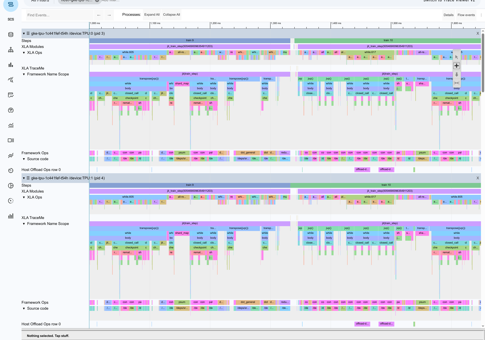
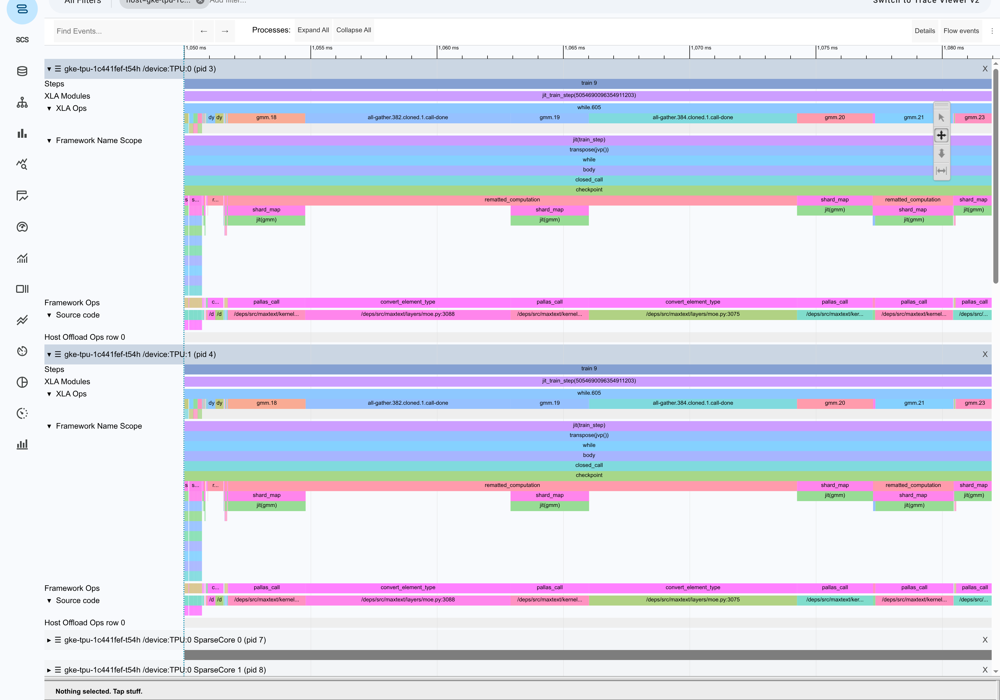

# 混元 3（295B-A21B）在 TPU v7 上的性能调优实践

> **承上**：[QUICKSTART-v7](QUICKSTART-v7.md) 负责「照着跑就能跑起来」，
> 到拿到基线为止。**这份文档从那个基线往下走** —— 为什么是这个水位、
> 已经试过什么、还能怎么调。
>
> **启下**：这是一份**活文档**，不是结论。每跑一轮回填 [§4.6](#46-结果记录)，
> 失败和零收益也要写。

## 1. 从哪儿接上：当前水位

| | 值 | 来源 |
|---|---|---|
| 稳态 step | **20.43 s** | QUICKSTART-v7 §4.2 |
| TFLOP/s / chip | **445.1** | 同上 |
| **MFU** | **19.29%** | 同上（分母 BF16 峰值 2,307） |
| 二次复现（换集群） | step 19.90 s · 457.3 · **19.82%** | QUICKSTART-v7 §4.2.1 |
| 配置 | 64 芯片 `4x4x4` · seq 4096 · pdbs 8 · BF16 | QUICKSTART-v7 §4.3 |

**目标：600–630 TFLOP/s/chip（26–27% MFU），对应 step 压到 14–15 s。缺口 1.38×。**
这个目标怎么来的见 [§3](#3-目标定在哪为什么是-600630-而不是-900)。

> **两个复现点相差 2.6%，所以：拿这份文档对基线时，±3% 以内都算复现成功。**

---

## 2. 已经试过什么：每个选择值多少

从只带 2 个 XLA flag 的首跑出发，逐项叠加。

| 轮次 | 增量 | seq | pdbs | step | TFLOP/s/chip | MFU |
|---|---|---|---|---|---|---|
| V1 | 基线：2 个 XLA flag | 8192 | 4 | 25.11 s | 404.75 | 17.54% |
| y1 | + `use_tokamax_splash` + `sa_use_fused_bwd_kernel` | 8192 | 4 | 24.45 s | 415.16 | 18.00% |
| y2 | + adamw / bf16 优化器 + `iota_embed` | 8192 | 4 | 24.61 s | 412.88 | 17.90% |
| y3 | + SparseCore 卸载组（9 个 flag） | 8192 | 4 | 24.61 s | 412.56 | 17.88% |
| y4 | + 调度器组（4 个 flag） | 8192 | 4 | 23.08 s | 440.30 | 19.09% |
| z1 | y1 + 换 batch / 序列口径 | 4096 | 8 | 21.69 s | 418.89 | 18.16% |
| **c1** | **调度器组 × pdbs=8 / seq=4096（当前最优）** | 4096 | 8 | **20.43 s** | **445.12** | **19.29%** |
| c2 | c1 + 杂项组（补齐 26 flag） | 4096 | 8 | 20.45 s | 444.63 | 19.27% |

**相对首跑 +10.0%。** 按贡献排序：

| 手段 | 贡献 |
|---|---|
| **pdbs=8 / seq=4096** | **+12.8% 吞吐**（TFLOP/s 只 +0.9%） |
| **调度器 flag 组（4 个）** | **+6.6%** |
| `use_tokamax_splash` + `sa_use_fused_bwd_kernel` | +2.6% |
| 杂项 flag 组（5 个） | ±0 |
| **SparseCore 卸载组（9 个）** | **±0** |
| 优化器 / 显存组 | −0.5%（省的是显存不是时间） |

### 2.1 最重要的一条否定结果

**SparseCore 集合通信卸载那 9 个 flag，在 v5p 上值 4.07 pp（13%），在 v7 上收益是 0。**

这条否定结果直接指出了瓶颈在哪：

> SparseCore 卸载改的是**通信在哪执行**，调度器改的是**通信和计算怎么重叠**。
> 前者无效说明**通信不是瓶颈**；后者有效（+6.6%）说明**通信没跟计算叠起来** ——
> 不是通信太慢，是它没藏住。

> ⚠️ **但不要把「这一组没用」外推到「同类的下一组也没用」。**
> 我当时正是这么推的：既然通信不是瓶颈，剩下的 flag 组期望收益也低，跳过。
> 结果调度器那组在我放弃之前已经跑完了 —— **+6.6%，当时的最优**。
> 消融的纪律是**每一组都要真跑**。

### 2.2 同一个开关在两个平台上可以反号

`sa_use_fused_bwd_kernel` 在 **v5p 上要设 `False`、v7 上要设 `True`**。
这不是笔误，是两边各自实测的结果。同理，v5p 上值 4 pp 的 SparseCore 卸载组，
在 v7 上是 0。

> **别把一个平台的调优结论直接搬到另一个。**

### 2.3 三条死路（都实测过，别再踩）

| 开关 | 后果 |
|---|---|
| **`use_tokamax_gmm=True`** | **死锁**，`stalled chips [7]`，连 step 0 都跑不完。2 次开 2 次挂、2 次不开 2 次通 |
| `shard_exp_on_fsdp=True`（FSDP=64 × DP=2） | **OOM**，用了 109.14 G / 94.74 G，**比不开还多 14 G** |
| `per_device_batch_size=12` | **OOM**，临时缓冲 95.17 G |

**`use_tokamax_gmm` 值得单独说。** 官方 Ironwood DSV3 配方里这个开关是 `True`
且能跑，说明 tokamax 后端本身没问题，**是它跟 Hy3 的形状不合** ——
最可能是 192 个专家：DSV3 是 256，分组矩阵乘的组数正好是 2 的幂。这条待确认。
它也是 `use_gmm_v2` 的强制前置，所以 gmm_v2 一并不可用。

**`shard_exp_on_fsdp` 为什么净亏**：这笔交易两头都动 ——
专家权重改按专家维切（收益），但 FSDP 宽度从 128 降到 64，
**非专家部分（attention 80 层 + embedding + dense 首层，约 7.2 B）每卡分片直接翻倍**。
省的抵不过多花的。根因还是 **192 不是 2 的幂**。

---

## 3. 目标定在哪：为什么是 600–630 而不是 900

Ironwood 官方实测表（全部 bf16、synthetic、per-chip 口径）：

| 模型 | 类型 | chips | 序列 | TFLOP/s/chip | MFU |
|---|---|---|---|---|---|
| llama3.1-405b | **稠密** | 256 | 8192 | 1,261.4 | 54.7% |
| llama3.1-70b | **稠密** | 64 | 8192 | 1,207.1 | 52.3% |
| gemma4-31b | **稠密** | 64 | 8192 | 931.3 | 40.4% |
| **qwen3-235b-a22b** | **稀疏 MoE** | 256 | 4096 | **629.8** | **27.3%** |
| **deepseek-v3 671B** | **稀疏 MoE** | 256 | 4096 | **612.7** | **26.6%** |
| gpt-oss-120b | 稀疏 MoE | 256 | 8192 | 329.9 | 14.3% |
| **hunyuan3 295B（本项目）** | **稀疏 MoE** | **64** | **4096** | **445.1** | **19.29%** |

**900 以上全是稠密模型。** 稀疏 MoE 在 Ironwood 上的实际水位是
**600–630 TFLOP/s/chip（26–27% MFU）**，两个最接近 Hy3 的参照都在这条线上。

差距是结构性的，不是调参能翻越的：

- 稠密模型每个 token 走同一套权重，GEMM 又大又规整，MXU 能吃满
- MoE 每层要做一次路由、一次按专家分组重排、一次分组矩阵乘、一次还原。
  分组矩阵乘的每个子块只有 `tokens_per_expert × emb × moe_mlp` 那么大，
  而且组大小随路由结果浮动，**编译期拿不到静态形状**
- 还要加上 all-gather / reduce-scatter 把 192 份专家权重摊开又收回

**所以 v7 的目标是 600–630 TFLOP/s/chip，对应 step 压到 14–15 s。
当前 445.1，缺口 1.38×。**

> Hy3 的激活参数（21 B）比 DSV3（37 B）还少，结构也更简单
> （GQA 而非 MLA、192 专家而非 256），**没有理由跑不到同一水位** ——
> 差距来自配置，不是架构。

### 3.1 关于 FP8：先别指望

同一张表里 DSV3 的 FP8 数据：

| | BF16 | FP8 | |
|---|---|---|---|
| DSV3 TFLOP/s/chip | 612.66 | 743.46 | **+21.4%** |
| 对本精度峰值的 MFU | 26.6% | **16.1%** | 峰值翻倍但吞吐没翻 |
| 稠密 llama3.1-405b 同口径 | 54.7% | 41.8% | 稠密 FP8 涨 **+52.8%** |

**MoE 兑现不了 FP8 的两倍峰值，稠密可以。** 原因跟上面那条一样：
MoE 的时间大量花在路由、分组重排、all-to-all 和小块 GEMM 上，
这些环节不吃 MXU 峰值，降精度对它们几乎没帮助。

> ⚠️ **报 FP8 的 MFU 一定要说明分母。** 同一个 743.46，
> 对 FP8 峰值算是 16.1%，对 BF16 峰值算是 32.2% —— **差一倍**。

---

## 4. 往下怎么调

> 这一章是**工作台**，不是结论。假说、观测手段、实验清单、结果表都在这里，
> 每跑一轮就回填一行。**先读 §4.1 —— 它可能直接改变你要不要继续调。**

### 4.1 先做 roofline 判定：19.8% 也许已经接近 BF16 的天花板

> ✅ **已裁决（2026-07-31）：H2 成立，H1 不成立。** 实测通信占墙钟 **57.2%**、
> 与计算重叠 **0.000s**。下面这套推演过程保留，因为它决定了「先做什么观测」；
> 结论和读 trace 的方法见 [§4.3.1](#431-实战第一轮-trace-是怎么读出结论的教学)。

把两代硬件的三个比值摆在一起：

| | v5p | v7 | v7 / v5p |
|---|---|---|---|
| BF16 峰值 / chip | 459 TFLOPS | 2,307 TFLOPS | **5.03×** |
| HBM 带宽 | 2.8 TB/s | 7.4 TB/s | **2.64×** |
| ICI / chip | 600 Gbps | 1,200 Gbps | **2.0×** |

**算力涨了 5 倍，喂数据的两条通道只涨了 2～2.6 倍。**

Roofline 的拐点（算力 ÷ 带宽）因此从 v5p 的 **164 FLOP/byte** 抬到 v7 的
**312 FLOP/byte** —— 想在 v7 上保持 compute-bound，算术强度要翻 1.9 倍。

MoE 恰恰是算术强度最低的一类结构：每个 token 只激活 21B / 295B ≈ 7% 的参数，
但**权重该从 HBM 读还得读**。所以有理由怀疑它在 v7 上直接掉进了 memory-bound 区。

**做个纯 memory-bound 的预测**：如果计算完全被带宽卡住，MFU 应该按
「带宽比 ÷ 算力比」缩放：

```
34.98%  ×  (2.64 / 5.03)  =  18.4%
```

**实测 19.82%。差 8%。**

**但这个数字不能单独当证据。** 分母里换成 ICI 比值（2.0×）会得到 13.9%，
实测 19.82% 落在两者之间。「非计算部分没跟着涨 5 倍」这一点，
下面两个假说都能解释，光靠比值分不开：

| | 假说 H1：HBM 带宽卡住 | 假说 H2：时间花在非 MXU 环节 |
|---|---|---|
| 说法 | MoE 算术强度低，权重读取吃满 7.4 TB/s | 路由、分组重排、all-to-all、小块 GEMM 不吃 MXU |
| 预测 MFU | ~18.4% | 也低，取决于这些环节占比 |
| **trace 判据** | **HBM 带宽接近 7.4 TB/s** | **HBM 带宽不高，但 collective / permute op 占满时间轴** |
| 该走 | A 组：提高算术强度 | B 组：藏通信、修 kernel |

**§3.1 的实测数据倾向 H2。** 同硬件上 DSV3 开 FP8 只涨 **+21.4%**
（612.66 → 743.46 TFLOP/s/chip）。如果瓶颈纯粹是权重读取带宽，
把权重字节砍半应该给出接近翻倍的收益，而不是两成。
稠密的 llama3.1-405b 同口径涨了 **+52.8%** —— 说明硬件本身兑现得了，
是 **MoE 结构**把收益吃掉了。

> **所以先别急着下结论，也别急着扫参数。** §4.2 那一轮 trace 就能分开这两个。
> **这一步已经做完了 —— 见 [§4.3.1](#431-实战第一轮-trace-是怎么读出结论的教学)，
> 答案是 H2。** 而且实际的判据比原计划的「看 HBM 带宽」更直接：
> 算通信与计算的区间重叠，重叠为 0 就说明瓶颈在通信调度，不在任何一种带宽。
>
> 无论哪个成立，有一点是共同的：**v7 的三条通道里，算力涨 5 倍、
> HBM 涨 2.6 倍、ICI 只涨 2 倍。瓶颈一定在后两条上，不在 MXU。**
> 继续盲扫 XLA flag 期望很低（§2 已经证明杂项 flag 组收益 ±0）。

对照组：同硬件上 DeepSeek V3 报 26.6%。它激活 37B（Hy3 是 21B），
每读一遍权重能摊到更多计算，算术强度天然更高 —— 与 H1 自洽；
它的专家数和路由结构也不同 —— 与 H2 也自洽。**这是推断，没有实测支撑。**

### 4.2 开可观测性：一次跑收齐三样

**前提：`base_output_directory` 必须指向 GCS。** 默认的 `/tmp/hy3out` 是 pod 本地盘，
pod 一结束全没了 —— 这是收不到 profile 最常见的原因。

```bash
PLATFORM=v7 STEPS=25 bash run.sh prof \
  base_output_directory=gs://<你的桶>/hy3prof \
  profiler=xplane \
  skip_first_n_steps_for_profiler=8 \
  profiler_steps=5 \
  profile_cleanly=True \
  dump_hlo=True
```

| 参数 | 为什么这么设 |
|---|---|
| `skip_first_n_steps_for_profiler=8` | step 0 含编译、step 1–2 是 JAX 异步派发的假读数，**必须跳过**，否则 trace 里全是编译 |
| `profiler_steps=5` | 5 步够看清稳态；开太多 trace 文件大到打不开 |
| `profile_cleanly=True` | 每步加 `block_until_ready`，让 trace 按步对齐；代价是**测出来的 step 比真实稍慢**，别拿这轮的 MFU 当数 |
| `dump_hlo=True` | 顺手把编译后的 HLO 也捞走，零额外开销 |

产物落在：

```
{base_output_directory}/{run_name}/tensorboard/   ← xplane
{base_output_directory}/{run_name}/xla_dump/      ← HLO
```

> **上次开 profiler 那轮没跑出稳态**，因为 profiler 自身开销把它挤出了时间窗口。
> 这次 `STEPS` 要给够（≥25），并且**别在只剩几分钟配额的时候开**。

拿到 xplane 后用 xprof（TensorBoard profile 插件）打开，重点看
Trace Viewer 和 Op Profile 两个页面。

### 4.3 从 trace 里必须回答的四个问题

按这个顺序看，前一个不回答清楚，后面的都是猜：

| # | 问题 | 在哪看 | 判据 |
|---|---|---|---|
| ① | **HBM 带宽跑到多少？** | Memory Bandwidth / Op Profile | 接近 7.4 TB/s → §4.1 假说成立，走 A 组；不到一半 → 走 B 组 |
| ② | 时间花在计算还是通信？ | Trace Viewer，看 collective op 条 | all-to-all + all-gather 占比 |
| ③ | 通信藏住了吗？ | 看 collective 与 GEMM 条**是否重叠** | 串行排列＝没藏住 |
| ④ | GMM（分组矩阵乘）占多少？ | Op Profile 按 op 排序 | 它是 MoE 主计算路径，占比低说明时间被别处吃了 |

**① 是分水岭。** 它决定后面走 A 组还是 B 组，别跳过。

### 4.3.1 实战：第一轮 trace 是怎么读出结论的（教学）

> **这一节是方法示范。** 数字会过时，但「从一个 1.4 GB 的 trace.json 走到一句
> 可行动的结论」这条路径可以照抄。脚本固化在
> [`maxtext-hunyuan3/analyze-trace.py`](maxtext-hunyuan3/analyze-trace.py)。



*XProf trace viewer 截图（4 芯片 / TPU:0 与 TPU:1 / 放大到 train 9–10 两步）。
lane 从上到下：`Steps`（训练步边界）、`XLA Modules`（`jit_train_step`）、
`XLA Ops`（`while.605` 等容器与 `all-re...` 等通信 op）、
`Framework Name Scope`（`jit(train_step)` → `while` → `body` → `checkpoint` → `remat` 层级）、
`Framework Ops`（`dot_general` / `psum` 等）、`Host Offload Ops`（`offload-d...`，
就是 `decoder_layer_input=offload` 在往 host 卸载）。*

<!-- ===== TEMP:XPROF-LINKS  组内讨论期临时保留，优化收尾后整块删除 ===== -->
> **🔗 XProf session（需 Google 账号登录，仅供组内讨论期使用）**
>
> | Profile | Session |
> |---|---|
> | 4 芯片 `2x2x1` / 80 层（本节这份） | http://xprof.corp.google.com/trace_viewer/chrisya-11640939633798411639 |
> | 16 芯片 `2x2x4` / 20 层（[§5](#5-规模缩放能不能在-16-芯片上调优) 那轮，含 HLO dump） | http://xprof.corp.google.com/trace_viewer/chrisya-18130551067782033931 |
>
> **session 会过期**。过期后用下面的命令从 GCS 重新上传即可（`.xplane.pb` 是长期产物）：
>
> ```bash
> c2xprof.par --gcs_path=gs://<bucket>/<run>/tensorboard/plugins/profile/<ts>/<host>.xplane.pb
> # 若报 "Project was not passed"，补 GOOGLE_CLOUD_PROJECT=<project>
> ```
<!-- ===== /TEMP:XPROF-LINKS ===== -->

> **先用官方工具，别自己画。** `.xplane.pb` 可以直接上传到 XProf 看，
> 除 trace viewer 外还有 `op_profile` / `memory_viewer` 等 tab。
> 自己解析 `trace.json` 只适合做**批量统计**（下面第 2–3 步），
> **不适合判断并发关系** —— 原因见第 4 步。

**这一轮的条件**：4 芯片 `2x2x1`、缩层冒烟模型（16.139 B）、25 步、
`profiler_steps=5`。规模小不影响结论 —— 我们要判的是**时间花在哪类 op 上**，
这是结构性质，不随芯片数变。

#### 第 1 步：找到 TPU 的 op 通道

trace 里有几十条通道，绝大多数是 host 侧噪声。先按 `(process, thread)` 聚合总时长：

```
33.135s  /host:CPU        | train.py      ← host，不看
29.349s  /host:CPU        | ?             ← host，不看
 5.037s  /device:TPU:2    | XLA Ops       ← 这才是我们要的
 4.854s  /device:TPU:0    | XLA Ops
```

**只看 `/device:TPU:N` 的 `XLA Ops` 那条。** host 时间长是 profiler 自身开销，
跟性能瓶颈无关。

#### 第 2 步：先验证能不能相加（这一步最容易被跳过）

第一次分析我直接把各类 op 时长求和，得到「通信 36.5%、while 37.3%」，
**差点就这么写进文档**。幸好做了一个自检：

```
op 时长之和 4.854s  ÷  时间轴跨度 3.100s  =  156.6%
```

**超过 100% 就说明有重复计时。** 原因是 `while`（`scan_layers=True` 把 80 层
折成的循环）是**容器 op**，它把内部子 op 的时间一起算进了自己。
直接相加 = 父子重复计。

**正确做法是区间并集**：把同类 op 的 `[start, end)` 区间合并去重，再算总长。
`analyze-trace.py` 里的 `union()` 就干这个，`while` 因为是容器直接排除。

> **通用教训：任何按 op 求和的分析，先做一次「和 ÷ 跨度」自检。**
> 明显大于 100% 就必须换并集，否则结论会系统性偏向"层级深的那一类"。

#### 第 3 步：并集口径下的真实占比

```
类别              并集      占墙钟
comm            1.773s    57.2%     ← Collective 通信
moe_gemm        0.723s    23.3%     ← MoE 分组矩阵乘 gmm/tgmm
compute         0.446s    14.4%     ← 普通 fusion/dot
attn            0.046s     1.5%     ← splash attention
```

**MXU 上真正在算的（后三项）加起来 39.2%，通信一项就 57.2%。**

#### 第 4 步：关键一问 —— 通信藏住了吗（⚠️ 这一步我最初做错了）

到这里只能说「通信多」，还不能说「通信是瓶颈」。**如果通信和计算是重叠的，
多也不要紧。** 最初我的做法是算两组时间区间的交集，得到「重叠 0.000s」，
据此下了「通信完全裸露」的结论。

**这个做法是错的，结论是同义反复。** 复核 `XLA Ops` 这条 lane：

```
XLA Ops 事件            40560 个
  时间上有交集的相邻对    16550
  完全嵌套（容器包子 op） 16550
  部分交叉（真并发）          0   ← 一个都没有
  顶层不重叠序列长度      13140
```

**这条 lane 上顶层 op 天然首尾相接**，两个不同的顶层 op 在结构上就不可能重叠。
所以「通信 ∩ 计算 = 0」不管实际情况如何都恒成立 —— 它是 lane 的定义，不是测量结果。

**正确的判法：按「自用时间」（self time）对墙钟做百分百拆分。**

容器 op（`while`）会把子 op 的时间算进自己，所以要**从每个祖先里扣掉子 op 的时长**，
只留各自真正独占核的那部分。这样得到的分类可以直接相加配平，不会重复计数。

**判别 op 语义靠名字**：TPU 上异步集合通信形如
`all-gather.382.cloned.1.call-start` / `...call-done`，**后缀在最后一段** ——
用 `split('.')[0]` 会把它切没（本项目踩过）。`-done` 的时长就是核**卡在汇合点干等**的时间。



*同一份 trace 放大到 30 ms 尺度。`XLA Ops` 行上依次是
`gmm.18` → `all-gather.382.cloned.1.call-done` → `gmm.19` →
`all-gather.384.cloned.1.call-done` → `gmm.20` → `gmm.21` → `gmm.23`。
**`call-done` 的块宽度与 `gmm` 计算块相当甚至更宽，而且两者交替出现** ——
算一段、停下来等一段。这就是 MFU 上不去的直观样子。*

### 自用时间拆解（覆盖墙钟 98.2%）

| 类别 | 自用时间 | 占墙钟 |
|---|---|---|
| **通信 · 等待 `-done`** | **1.299 s** | **41.9%** |
| 计算 · MoE 分组矩阵乘（`gmm`/`tgmm`） | 0.723 s | 23.3% |
| **通信 · 同步集合** | **0.477 s** | **15.4%** |
| 计算 · `fusion`/`dot` | 0.446 s | 14.4% |
| 计算 · attention（`splash`） | 0.046 s | 1.5% |
| 数据搬运 `copy`/`transpose` | 0.025 s | 0.8% |
| **通信合计** | **1.777 s** | **57.3%** |
| **计算合计** | **1.215 s** | **39.2%** |

**这直接解释了 MFU 为什么只有 19.29%**：真正在算的只占墙钟 39.2%，
而 `19.29% ÷ 39.2% ≈ 49%` —— **计算真跑起来的时候 MXU 利用率约五成，
剩下的差距全被通信吃掉**。核有 **41.9% 的墙钟坐在 `-done` 上干等**。

<details>
<summary>⚠️ 这个结论我推翻过三次，四种错法都记在这里（点开）</summary>

同一份 trace，我先后得出过四个互相矛盾的结论。**每一种错法都可能被复用，所以全部留档：**

| 版本 | 结论 | 错因 |
|---|---|---|
| ① | 重叠 0.000 s ⇒ 完全裸露 | 在**单条顺序 lane** 上算时间交集。实测 40560 个事件里 16550 处交集**全是容器嵌套、部分交叉为 0** —— 这条 lane 上顶层 op 天然首尾相接，交集恒等于 0。**是同义反复，不是测量** |
| ② | 80% 是同步阻塞 | 按 `.` 切 op 名，把 `-start`/`-done` 后缀切没了。真名是 `all-gather.382.cloned.1.call-done`，**后缀在最后一段** |
| ③ | 100% 异步 ⇒ 1.766 s 全是残余 | 方向对了，但把"是异步的"直接当成"没藏住"，没量实际占用 |
| ④ | 83.4% 已被掩盖 | 统计每对 `start→done` 窗口内的计算量，得 11.607 s。**但整个时间轴只有 3.100 s** —— 13.911 s 的窗口总长塞进 3.1 s，说明平均 4.5 个传输同时在飞，**同一段计算被不同窗口重复计了四五遍** |
| ⑤ **本节** | **通信 57.3% / 计算 39.2%** | 自用时间拆解，覆盖 98.2%，可配平 |

**捉到 ④ 的是一个量纲矛盾**：如果通信真藏掉八成，MFU 不可能只有 19%。
**两个独立结论对不上时，先怀疑方法，别急着解释现象。**

四条通用教训：

1. **在单条顺序 lane 上算并发是同义反复** —— 先确认这条 lane 到底能不能重叠
2. **op 名字的后缀在最后一段**，别用 `split('.')[0]`
3. **"是异步的" ≠ "藏住了"**，也 ≠ "没藏住"，必须量实际占用
4. **窗口可以互相重叠，把窗口内的量加起来会超过墙钟** —— 任何"分项之和 > 总量"的结果都是重复计数的信号

</details>

#### 结论与它推翻了什么

| | |
|---|---|
| **[§4.1](#41-先做-roofline-判定198-也许已经接近-bf16-的天花板) 的 H1（HBM 带宽卡住）** | ❌ 不成立。真在算的只占 39.2%，远没到把 HBM 打满的程度 |
| **H2（时间花在非 MXU 环节）** | ✅ **成立**。通信占墙钟 **57.3%**（其中 41.9% 是核卡在 `-done` 干等），计算只占 39.2%。`19.29% ÷ 39.2% ≈ 49%` —— 算的时候 MXU 用了约五成，差距全在通信 |
| 实验方向 | 走 [§4.4](#44-实验清单) **B 组（藏通信）为主线**。通信吃掉 57.3% 墙钟，是最大的一块；A 组（提算术强度）的天花板受限于那 39.2% |
| 对 FP8 的预期 | 与 [§3.1](#31-关于-fp8先别指望) 的 +21.4% 自洽 —— FP8 只能加速那 39.2% 里的 dot 部分，**动不了占 57.3% 的通信**。这也是为什么 FP8 实测收益远低于纸面算力比 |

这也给 [§2.1](#21-最重要的一条否定结果) 那条既有定性结论补上了定量证据：
不只是「通信没藏住」，而是**1.773 秒纯等待，占墙钟 57.2%**。

**关于下一步**：初稿这里推荐 [B1 `scan(unroll=N)`](#44-实验清单)，理由是
"`while` 循环体是 XLA 的调度边界，循环体里只有 1 层时第 N 层的 all-gather
没法藏进第 N−1 层的计算"。

**这条推荐已被实测否定**（见 [§6.4](#64-scanunrolln没有可用窗口)）：`unroll=2` 撞
splash attention 的形状校验，`unroll=10` 需要 274.6 G HBM。而且按上面更正后的拆解，
**80% 的通信是同步集合通信，本来就不是"调度边界"造成的** —— 就算 unroll 成功，
能动的也只是那 20% 的异步残余。回头看，unroll 全军覆没是合理的。

**真正的抓手在别处**：要么让 `all-gather` 走异步路径，要么换并行策略（[B2](#44-实验清单)）
减少同步集合通信的总量。

#### 复现这套分析

```bash
# 1) 取 trace（xplane 同目录下的 .trace.json.gz）
gcloud storage cp "gs://<bucket>/<run>/tensorboard/plugins/profile/*/*.trace.json.gz" .
gunzip -c *.trace.json.gz > t.json      # 62 MB → 1.4 GB，留够磁盘

# 2) 一条命令出全部结论
python3 maxtext-hunyuan3/analyze-trace.py t.json
python3 maxtext-hunyuan3/analyze-trace.py t.json --dev 3   # 换个 device 交叉验证
```

> 内部还有 xprof 可视化（需要有效的 LOAS2 cert）。上面这套**不依赖任何内部工具**，
> 纯 stdlib，随时能跑。

---

### 4.4 实验清单

按 §4.3 ① 的结论二选一。每条都标了预期收益、成本、和**判定标准**
（跑之前先想清楚"什么结果算成功"，否则容易自我说服）。

#### A 组 —— 若确认 memory-bound：提高算术强度

> ⛔ **已排除（§4.3.1）。这组现在优先级最低**，留档备查。

| # | 实验 | 机理 | 成本 | 判定 |
|---|---|---|---|---|
| A1 | **FP8** | 权重字节数减半 → 算术强度翻倍 | 中（要验数值稳定性） | **DSV3 同硬件实测只有 +21.4%**（§3.1），所以预期是「有收益但不翻倍」。若我们这里也是 +20% 上下，说明 H2 成立；若明显更高，H1 成立 |
| A2 | `per_device_batch_size` 8 → 12 / 16 | 一次读进的权重摊到更多 token | 低（可能 OOM） | 每档记 MFU + HBM 峰值，看拐点 |
| A3 | `max_target_length` 4096 → 8192 | attention 部分算术强度随 seq 涨 | 低 | §2 消融里 8192/pdbs4 与 4096/pdbs8 打平，**这次固定 pdbs 单独扫 seq** |
| A4 | 修 `use_tokamax_gmm` 死锁 | 官方 GMM kernel，可能少读一遍权重 | 高（要查根因） | 见 §4.5 |

> **§3.1 的「先别指望」指的是「别指望翻倍」，不是「别做」。**
> +21.4% 在当前水位上是实打实的一档，而且它同时是一次**判别实验** ——
> 收益接近 DSV3 的 +21.4% 就支持 H2，明显更高就支持 H1。

#### B 组 —— 若不是 memory-bound：藏通信 / 修 kernel

> ✅ **实测指向这组（§4.3.1：通信 57.2%、重叠 0）。B1 最对口，先做它。**

| # | 实验 | 机理 | 成本 | 判定 |
|---|---|---|---|---|
| B1 | `scan(unroll=N)`，扫 1/2/4/8 | `while` 循环体是 XLA 调度边界，跨迭代不能重排；unroll 把 N 层放进同一调度域，延迟隐藏调度器才有得发挥 | 低（约 10 行） | 同时记吞吐 / 编译时间 / HBM 峰值三条曲线 |
| B2 | 并行策略：试 expert parallelism | 当前 `ici_fsdp=-1, tp=1` 纯 FSDP，MoE 的 all-to-all 全走 ICI；而 ICI 只涨了 2.0×，是三条通道里最弱的一条 | 中 | 看 all-to-all 占比是否下降 |
| B3 | MoE tile 参数 | v5p 上设了 18 个（`{wi,wo} × {fwd,dlhs,drhs} × 3 维`），**v7 上一个都没设**，完全没探过的面 | 低 | 零成本可试 |
| B4 | `remat_policy` / `decoder_layer_input=offload` | offload 到 host 会吃 PCIe；若 HBM 不紧张就不该 offload | 低 | 关掉看 HBM 峰值和 step |

#### 两组都该做的

| # | 实验 | 说明 |
|---|---|---|
| C1 | 关掉 9 个 SparseCore flag 再测一次 | §2 说它们收益为 0。**收益为 0 的东西留着只会增加变量**，确认无害就删掉，让后面的实验干净 |
| C2 | 单层计时 | `scan_layers=True` 把 80 层折成一个 scan，分不出层内开销。临时 `scan_layers=False` 跑几步，能看到单层结构 |

### 4.5 `use_tokamax_gmm`：根因已查明（本节保留作为推理链记录）

> ⚠️ **本节的原始结论已被两次推翻，完整根因见
> [§7.7](#77-use_tokamax_gmm--gmm_v2根因已在-v5p-上查实)。**
> 一句话版本：**不是死锁，是专家数 192 不在 kernel 库的 tile 调优表里，
> 退回默认 tile 导致 grid 块数涨 768 倍，慢到看门狗判 stall。**

以下是当时的推测，留着是因为**推错的方式有参考价值**：

它是 MoE 的主计算路径，也是 `use_gmm_v2` 的强制前置，所以两个一起用不了。
怀疑是 **192 个专家不是 2 的幂**，导致分组矩阵乘的组划分出问题。
如果能修，可能是 A 组里最大的单项收益。

> **"不是 2 的幂"这个猜测方向对了一半**：确实跟 192 这个数有关，
> 但不是"组划分出问题"，而是**上游只给 16 / 128 / 256 三种专家数做过 tile 调优**。
> 是数据覆盖问题，不是算法问题——**这两者的修法完全不同**。

排查建议：先用缩层模型（`hunyuan3-smoke`，4 层）在 4 芯片小池上复现，
几十秒一轮，比在 64 芯片上试快两个数量级。

> **这条排查建议后来被证伪**：4 芯片 smoke 上 8 个假设全部跑通、复现不出来。
> 真正查出根因靠的不是缩规模，是**直接扒 kernel 库的源码把那张表打印出来**。

### 4.6 结果记录

每跑完一轮回填一行。**失败和零收益也要写** —— 否则下一个人会重跑一遍。

| 日期 | 实验 | 改了什么 | step (s) | TFLOP/s/chip | MFU | 结论 |
|---|---|---|---|---|---|---|
| 2026-07-30 | baseline | §4.3 参数集 | 20.43 | 445.1 | 19.29% | 起点 |
| 2026-07-30 | 二次复现 | 同上，换集群 | 19.90 | 457.3 | 19.82% | 可复现（§4.2.1） |
| 2026-07-31 | **P0 trace** | 4 芯片冒烟 + `profiler=xplane` | — | — | — | **H2 成立**：通信占墙钟 57.2%，与计算重叠 0.000s。转 B 组（[§4.3.1](#431-实战第一轮-trace-是怎么读出结论的教学)） |
| 2026-07-31 | **缩放验证** | 16 芯片 / 20 层（等比缩放） | 6.090 | 410.7 | **17.80%** | MFU **不守恒，低 7.7%**。编译时间**不随规模变**（见 [§5.3.1](#531-编译时间并不随规模变快一个被我算错的结论)）。详见 [§5](#5-规模缩放能不能在-16-芯片上调优) |
| 2026-07-31 | 编译缓存 | `dump_hlo=False` + 固定 `jax_cache_dir` | — | — | — | 启动→step0 **83.8→32.8 s**，稳态不变（[§6.5](#65-编译缓存45-s--087-s)） |
| 2026-07-31 | **B 组否定** | `scan_layers=False` | — | — | — | **HBM 超 1.7×，跑不起来**；5 层上稳态反而慢 5.9%（[§6.3](#63-scan_layersfalse编译超线性涨且显存装不下)） |
| 2026-07-31 | **B 组否定** | `scan(unroll=2/10)` | — | — | — | 2 撞 kernel 形状校验，10 需 274.6 G。**无可用档位**（[§6.4](#64-scanunrolln没有可用窗口)） |
| 2026-07-31 | **trace 定量** | 自用时间拆解（覆盖 98.2%） | — | — | — | **通信 57.3%（其中 41.9% 卡在 `-done` 干等）／ 计算 39.2%**。这解释了 MFU 19.29% 的来源：算的时候 MXU 只用了约五成（[§4.3.1](#431-实战第一轮-trace-是怎么读出结论的教学)） |
| | | | | | | |

---


## 5. 规模缩放：能不能在 16 芯片上调优

### 5.1 为什么要问这个

64 芯片一轮实验的成本不在跑，在**等**：排队拿机器、起容器、多机建切片、编译，改一个 XLA flag
到看见数字往往要半小时以上。如果小规模能给出**同样的判断**，调优循环可能快很多。

（**先说结论**：快的部分不是编译 —— 编译几乎不随规模变，见 [§5.3.1](#531-编译时间并不随规模变快一个被我算错的结论)。）

所以要验的不是"小规模能不能跑"，而是 **MFU 在缩放下守不守恒**。守恒 → 小规模的结论可以直接外推；
不守恒 → 至少要知道偏差多大、从哪来。

### 5.2 缩放怎么设计：为什么层数要跟着砍

当前是**纯 FSDP**（`ici_fsdp_parallelism=-1, ici_tensor_parallelism=1`），没有流水线并行。
在这个配置下，两个量决定了每张芯片的负载：

| 量 | 怎么随规模变 |
|---|---|
| 每芯片参数量 | ∝ 层数 ÷ 芯片数 |
| 每芯片 FLOPs | ∝ 层数 × `per_device_batch_size`（**与芯片数无关**，因为 global batch 跟着芯片数走） |

第二行是关键，也是容易想错的地方：**只减芯片不减层，每芯片计算量不变，但每芯片参数量翻倍**——
HBM 先撑爆。所以芯片数和层数必须同比例砍，才能让每芯片参数量恒定：

| 规模 | 芯片 | 拓扑 | 层数 | 每芯片"层份额" |
|---|---|---|---|---|
| 基线 | 64 | `4x4x4` | 80 | 1.25 |
| 本轮 | 16 | `2x2x4` | 20 | 1.25 |
| （未跑） | 32 | `2x4x4` | 40 | 1.25 |

其余参数一律不动：`per_device_batch_size=8`、`max_target_length=4096`、同一套 XLA flag。

### 5.3 实测结果

30 步，步时序列干净得可以直接读：

```
step  0: 49.597s   ← 编译
step  1:  7.549s   step  2: 10.723s   ← 预热
step  3–16: 6.09s  ← 已进稳态（step 13 为 6.467s）
step 17: 89.888s   ← profiler 导 trace，不计入
step 18–29: 6.09s  ← 稳态，12 步抖动 ±0.002s
```

> **口径提醒**：`skip_first_n_steps_for_profiler=12 profiler_steps=5` 会让 **step 17** 出现
> 一个 90 秒的尖峰。若按惯例取 `step ≥ 15` 求均值，会把它算进去，得到 11.678s —— 比真实稳态
> 慢近一倍。**取稳态一定要先看序列再定窗口**，不要套用固定阈值。

| | 64 芯片 / 80 层 | 16 芯片 / 20 层 | 差 |
|---|---|---|---|
| 稳态 step | 20.43 s | **6.090 s** | — |
| tokens/s/device | 1,604 | 5,381 | — |
| TFLOP/s/chip | 445.1 | **410.7** | −7.7% |
| MFU（BF16 峰值 2,307） | 19.29% | **17.80%** | **−7.7%** |
| 首行日志 → step 0 完成 | 174.2 s | **124.9 s** | 快 1.4×（**不是编译的功劳**，见 §5.3.1） |

**结论：MFU 不守恒，小规模低 7.7%，超出 ±3% 的复现判据。**

### 5.3.1 编译时间并不随规模变快：一个被我算错的结论

初稿这里写的是"编译 49.6s vs 10–17 分钟，快 12–20×"。**这个结论是错的**，
成因是拿两个不同口径的数字相除，记录在此以免重蹈。

把两次 run 从容器第一行日志到 step 0 完成逐段拆开（时间戳取自 pod 日志）：

| 阶段 | 16 芯片 / 20 层 | 64 芯片 / 80 层 | 随规模变？ |
|---|---|---|---|
| 首行日志 → TPU driver opened | 0.8 s | **60.2 s** | **是，唯一一段** |
| 单次 XLA `END_TO_END` 编译 | 43.5 / 43.7 s | 44.3 s | 否 |
| ├ `BACKEND_PASSES` | 22.5 s | 22.7 s | 否 |
| └ `CODE_GENERATION` | 5.4 s | 6.1 s | 否 |
| 大编译次数（>10 s 的模块） | **2 次，共 87 s** | 1 次，44 s | — |
| **首行日志 → step 0 完成** | **124.9 s** | **174.2 s** | 仅 1.4× |

**编译时间几乎不随规模变，16 芯片这一轮甚至因为编了两次而总时长更长。**

原因是 `scan_layers=True`：80 层和 20 层在 HLO 里都是**同一个 layer body 被 `lax.scan` 卷起来**，
编译器只编一遍，层数不进 HLO 规模。芯片数那边，SPMD 分区 32 个 device 与 128 个 device
的开销也相近。这两个维度对 XLA 前端基本是透明的。

**真正随规模涨的只有多机 TPU 切片初始化：4 台主机 0.8 s，16 台主机 60.2 s。**

错误是怎么产生的：49.6 s 是 metric logger 报的 **step 0**，而"10–17 分钟"是另一个环境下
**整个 Pod 启动**的经验值（含镜像拉取、代码下载、16 台建切片、排队）。两个口径、两个环境，
直接相除就把收益放大了一个数量级。

> **通用教训**：报"快了 N 倍"之前，先确认分子分母**测的是同一段**。
> 阶段耗时要从日志时间戳现拆，不要用别处记下来的经验值当分母。

### 5.4 这 7.7% 从哪来：两个候选，尚未分离

#### 候选一：层无关开销的占比变大（可定量）

MFU 已经对总 FLOPs 做过归一，所以 7.7% 是**真实的效率损失**，不是算错账。
但可以从两组数里反推出结构。用 `TFLOP/s/device ÷ tokens/s/device` 得到每 token 的 FLOPs：

| | 80 层 | 20 层 | 比值 |
|---|---|---|---|
| GFLOP / token / device | 138.75 | 38.16 | **3.636** |

**如果 FLOPs 只来自 decoder 层，这个比值应该正好是 4.0。** 少掉的部分就是不随层数缩放的开销 ——
embedding 查表、12 万词表（`vocab_size: 120832`）的 logits 投影、以及 loss。
按 `F(L) = a·L + b` 两点求解：

- 每层 **1.676** GFLOP/token
- 层无关项 **4.635** GFLOP/token

于是层无关部分的占比：**80 层时 3.3% → 20 层时 12.1%**，翻了近 4 倍。

再按 FLOPs 权重反解两类工作各自的效率（两点两未知，恰定）：

- decoder 层内计算 ≈ **19.9% MFU**
- 层无关部分（embedding / logits / loss）≈ **10.1% MFU**

这个量级是合理的：词表投影和 softmax 是访存密集型，效率本来就该明显低于层内的大矩阵乘。
**层数砍到 1/4，等于把一块低效率的工作从 3% 放大到 12%，整体 MFU 被拖下来。**

#### 候选二：拓扑退化（无法排除）

基线的 `4x4x4` 是完整的三维环面；本轮的 `2x2x4` 有一个维度只有 2，
该方向的环绕链路是退化的。集合通信的效率因此可能不同。

#### 两者用一个数据点分不开

上面那组反解是**两点拟合两个未知数，恰好定解，没有自由度做检验** —— 它自洽，但不构成证明。
拓扑这条同样没有独立证据。**不要把候选一当成已确认的结论。**

**判别实验：跑 64 芯片 / 20 层。** 层数与本轮相同、拓扑与基线相同：

- MFU 落到 ~17.8% → 层无关开销占比是主因，拓扑无罪
- MFU 保持 ~19.3% → 拓扑退化是主因

每芯片"层份额"降到 0.3125（基线的 1/4），显存有充足余量，不会 OOM。
反方向（16 芯片跑 80 层）不可行 —— 每芯片参数量是基线的 4 倍，必然 OOM。

### 5.5 对调优实践的结论

1. **绝对 MFU 不能从 16 芯片外推到 64 芯片。** 任何小规模跑出的 MFU，报数时必须标注规模和层数，
   否则会被误当成全尺寸水位。
2. **相对改进量大概率可以迁移，但还没验证。** 7.7% 若是稳定偏置，A/B 的差值就能用。
   **验证方法**：在 16 芯片上重跑一个已知有效的改动（例如 §2 里 `pdbs=8 / seq=4096` 那一组），
   看提升幅度是否与 64 芯片上一致。这一步做完之前，小规模只能用来判**方向**，不能用来判**幅度**。
3. **小规模的收益不在编译，在拿机器和多机初始化。** 编译几乎不随规模变（§5.3.1），
   端到端只快 1.4×（174 s → 125 s，省下的主要是 16 台主机建切片的那 60 秒）。
   真正的价值是 **4 个节点比 16 个节点容易调度得多** —— 共享集群上等 16 台可能要几小时甚至等不到，
   4 台通常立刻就有。对 §4.4 里那批需要逐个试的开关（尤其 B 组的 `scan(unroll=N)` 扫描、
   C 组删 SparseCore flag），省的是排队时间，不是编译时间。
   **注意 `scan(unroll=N)` 是例外**：改 unroll 会让 `lax.scan` 展开 N 层进 HLO，
   编译时间会真实上涨，这一项在小规模上扫更划算。
4. **筛完再上大规模。** 推荐流程：16 芯片粗筛出有效方向 → 64 芯片确认幅度并出正式数字。

### 5.6 自建 v7 节点池：四个卡点

共享集群不可用时需要在自有项目自建。四个坑按撞到的顺序：

**① 必须用 workload policy，不是 placement policy**

```
Creation of a managed instance group with tpu7x-standard-4t machine type
with placement policy is not supported. Use workload policy instead.
```

v5p 惯用的 `--placement-type=COMPACT` 和裸 `--tpu-topology` 在 v7 上都会触发这个。正确写法：

```bash
gcloud compute resource-policies create workload-policy <WP> \
  --region=us-central1 --type=HIGH_THROUGHPUT --accelerator-topology=2x2x4

gcloud container node-pools create <POOL> \
  --cluster=<C> --region=us-central1 --node-locations=us-central1-c \
  --machine-type=tpu7x-standard-4t --num-nodes=4 --spot \
  --placement-policy=<WP> \
  --scopes=https://www.googleapis.com/auth/cloud-platform
```

**② 建池时不要再传 `--tpu-topology`。** 传了 GKE 会自动附加一个 group placement policy，
与 workload policy 冲突。拓扑信息由 workload policy 的 `--accelerator-topology` 携带。

**③ 必须显式给 `--scopes=cloud-platform`。** 节点池默认 scope 里存储只有 `devstorage.read_only`，
表现是**下载代码正常、程序跑到写输出时 403**：

```
google.cloud.storage.exceptions.InvalidResponse:
('Request failed with status code', 403, ...)
```

这一轮就是编译完成、准备上传 HLO dump 时倒在这里。**节点池 scope 不可修改，只能删掉重建。**
桶上给了 IAM 权限也没用 —— IAM 和 OAuth scope 是两层，scope 不够先被拦。

**④ DWS flex-start 不能空跑等你。** 想要"节点先建好在那等着部署"是做不到的：

| 尝试 | 报错 |
|---|---|
| flex-start + autoscale 0→4 | `Maximum node count 0 is not a valid size of TPU pod slice with topology "2x2x4"` |
| flex-start + 固定 4 节点 | **`Flex start node pools require autoscaling enabled`** |

gcloud 在 API 层强制 flex-start 必须开 autoscaling，而 autoscaling 意味着按需伸缩 ——
没有 workload 就是 0 节点。要想常驻，只能放一个 `sleep infinity` 的 workload 把节点撑住。
另外 flex-start 节点**最长存活 7 天**，到期节点和 Pod 一起被抢占；且**不支持 reservation**
（必须 `--reservation-affinity=none`）、**不支持 Spot**（二选一）。

### 5.7 复现

```bash
# 提交（其余参数与 §4.3 基线完全一致，只加一个层数覆盖）
python3 -m src.maxtext.trainers.pre_train.train src/maxtext/configs/base.yml \
  model_name=hunyuan3-295b ... \
  base_num_decoder_layers=20 \
  per_device_batch_size=8 max_target_length=4096

# 取稳态：先看序列，再定窗口（别直接套 step>=15）
grep -a "completed step" run.log | \
  sed -E 's/.*step: ([0-9]+), seconds: ([0-9.]+).*/\1 \2/'
```

MFU = `TFLOP/s/device × 2 ÷ 2307`（v7 一颗芯片 = 2 个 JAX device）。

## 6. 编译这件事：机制、缓存、以及 `scan` 的三种玩法

§5.3.1 更正了"小规模编译更快"这个错误结论。这一节把编译本身查透 ——
它到底花在哪、能不能缓存、以及 `scan` 的开关和 `unroll` 有没有可操作空间。
**全部为 16 芯片 / `2x2x4` 上的实测。**

### 6.1 怎么量编译时间：三个口径，别混用

| 口径 | 从哪儿看 | 说明 |
|---|---|---|
| **XLA 自报（推荐）** | 日志里 `deepsea_compiler_base.cc:989] END_TO_END stage duration: 43.69s` | 单个 HLO 模块的编译耗时，最干净。**OOM 时不会打印**——模块没编完 |
| **JAX 侧逐个 jit** | `JAX_LOG_COMPILES=1` → `Finished XLA compilation of jit(train_step) in 45.15 sec` | 能看清**哪个 jit** 贵，排查缓存命中必用 |
| **墙钟** | `TRIAL_START` 时间戳 → `completed step: 0` | 用户实际等待时间，含缓存 IO、数据管线等 |

同一轮实测：XLA 自报 42.76s / JAX 侧 45.15s / 编译段墙钟 52.2s。三者都对，
差值是 JAX 封装和小模块。**报数时务必写明用的哪个口径**，否则无法比较。

> **`step 0` 不等于编译时间。** MaxText 先把 `train_step` 编译完再进步循环，
> 所以 `step 0` 只是一步普通训练（实测 6.06–6.11s，与稳态 6.085s 基本相同）。
> 早期看到的 `step 0 = 49.6s` 是 **`dump_hlo=True` 往 GCS 上传 HLO** 的时间，不是编译。

### 6.2 编译时间不随层数变（因为有两个 scan）

`scan_layers=True` 下，层数对编译几乎无影响：

| 层数 | XLA `END_TO_END` |
|---|---|
| 5 | 42.41 s |
| 20 | 43.12 / 43.40 / 43.69 / 44.06 / 44.77 s（五次） |
| 80 | 44.29 s |

**层数变 16 倍，编译只涨 4.5%。**

机制上不是"一份 layer body"，而是**两份** —— 因为首层是 dense（`first_num_dense_layers: 1`），
结构与 MoE 层不同，不可能进同一个 scan。在 `nnx_decoders.py` 的运行期 scan 上加打印可以直接看到：

```
[SCANDBG2] main lax.scan length=1  unroll=1   ← dense 段
[SCANDBG2] main lax.scan length=19 unroll=1   ← MoE 段（20 层时）
```

两段各自 scan，**层数只改变 scan 的 trip count，不进 HLO 规模**，所以编译恒定。

> **排查技巧**：这个模型走 **NNX** 路径（`nnx_decoders.py`），不是 Linen 的 `decoders.py`。
> 全树共有三处 `lax.scan`（初始化用的 `nnx_scan.py`、另一分支、以及主路径）。
> 改 scan 行为时**先加 print 确认走到哪一处**，比读代码猜快得多 —— 本项目为此打偏过两次补丁。

### 6.3 `scan_layers=False`：编译超线性涨，且显存装不下

`HLO_PASSES`（图级优化）在两种配置下都能跑完（OOM 发生在其后的内存分配），所以可比：

| 20 层 / `per_device_batch_size=2` | `HLO_PASSES` |
|---|---|
| scan **ON**（1 份 body） | 10.18 s |
| scan **OFF**（19 份 body） | **58.09 s（5.7×）** |

**编译是超线性的。** 5 层那组（1→4 份 body）只涨 44%，据此做的线性外推完全错误 ——
小图上超线性还没起来。**不要用小规模的两点去外推编译成本。**

更致命的是显存：

| 配置 | HBM 需求（可用 94.74 G） |
|---|---|
| scan ON | 装得下 |
| scan OFF，`pdbs=8` | **171.75 G** |
| scan OFF，`pdbs=2` | **160.89 G** |

**batch 降到 1/4，显存只降 6%** —— 说明爆的不是激活，而是**跟 batch 无关**的部分。
最可能是 FSDP 的权重 all-gather：开着 scan 时同一时刻只有一层的完整权重被 gather 出来，
全展开后调度器可让多层的 all-gather 结果同时存活。同时 `remat_policy=custom` +
`decoder_layer_input=offload` 的按层重算/卸载边界也随之失效。

> **更正 `MAXTEXT-PORTING-GUIDE §5.2`**：那张表里"显存"一栏原写
> "scan 每次迭代结束物化 carry / 关掉可跨层复用缓冲"，暗示关掉可能更省。
> **实测相反：关掉直接超 1.7 倍。** 该栏已按实测更新。

### 6.4 `scan(unroll=N)`：没有可用窗口

MaxText 没有暴露 `unroll`，但 `jax.lax.scan` 原生支持。
在 `nnx_decoders.py` 主路径的 `lax.scan(...)` 上加 `unroll=` 参数后实测：

| `unroll` | 结果 |
|---|---|
| **1** | ✅ 正常。编译 43.69 s，稳态 6.086 s |
| **2** | ❌ XLA `INTERNAL: during context [post-optimization]: Expected instruction to have shape equal to (bf16[9,2,8,4096,4096], ...)` |
| **10** | ❌ OOM，**274.64 G**（比全展开的 171 G 还高） |
| 全展开 | ❌ OOM，160.89–171.75 G |

两个失败模式不同，且**中间没有可用档位**：

- `unroll=2` 撞的是 **kernel 兼容性** —— 报错形状里的 `2` 就是 unroll 因子，
  `9` 是 splash attention 的分块。展开后中间张量多了一维，下游 attention kernel 没跟上。
- `unroll=10` 撞的是**显存，而且比全展开更狠**。反直觉但可解释：部分展开时
  scan 的 carry 机制仍在（要为剩余迭代保留状态），块内 10 层的激活又全部存活，
  **两头开销都要付**；重算边界也随之变粗。

**结论：§4.4 B 组里"用 `scan(unroll=N)` 让 XLA 跨层藏通信"这条，
在当前 MaxText + splash attention + FSDP 组合下不可行。** 这是否定结果，
但它封掉了一条本来要花数天试的路。

### 6.5 编译缓存：45 s → 0.87 s

**前提有两个，缺一不可：**

1. **`dump_hlo=False`。** MaxText 源码 `configs/pyconfig.py` 里写死了：
   `dump_hlo=True` 时**禁用** JAX 编译缓存（HLO dump 需要重新编译），并打 warning。
2. **Pod 常驻。** 缓存目录默认 `~/jax_cache` 在容器内，一次性 Job 跑完 Pod 销毁，
   缓存必然每次冷启。**必须配合 sleep-infinity 常驻环境**（见 §6.7）。

清空缓存跑两轮，开 `JAX_LOG_COMPILES=1` 逐个 jit 对照：

| | 第一轮（冷） | 第二轮（热） |
|---|---|---|
| jit 编译次数 | 21 个 | **21 个（一样）** |
| 总编译时长 | 51.75 s | **3.38 s** |
| 最大单个 | 45.15 s | **0.87 s** |
| `jit(train_step)` 变体一 | **45.152 s** | **0.865 s** |
| `jit(train_step)` 变体二 | 0.856 s | 0.869 s |
| 启动 → step 0 | **83.8 s** | **32.8 s（−61%）** |
| 缓存目录 | 3 条 / 65 MB | 同 |

**准确的说法不是"第二轮跳过编译"，而是"编译次数一模一样，但那个 45 秒的塌成了 0.87 秒"。**

`jit(train_step)` 有两个不同 shape 的变体，只有大的那个走持久缓存。
其余 19 个（`add` / `reshape` / `iota` / `broadcast_in_dim` 等）两轮都在编，各几十毫秒 ——
**JAX 只持久化超过阈值的模块**，小的每次现编，合计约 2.5 s，可忽略。
缓存目录里的 3 条正对应三个 >1 s 的模块：`jit_train_step`、`jit__lambda`、`jit__randint`。

**什么会让缓存失效**（缓存键是编译后的 HLO，任何进图的东西改了都算）：

| 改动 | 是否失效 | 说明 |
|---|---|---|
| XLA flag | **是** | 扫 flag 的实验每轮都冷启，享受不到缓存收益 |
| `steps` | **是** | `learning_rate_schedule_steps` 默认继承 `steps`（`base.yml:795`），
warmup + cosine 的总长被编进 HLO 常量。**这是正确设计，不要去改它** —— 只需在同一组
A/B 里保持 `steps` 不变即可 |
| 层数 / batch / seq | 是 | 形状变了 |
| `dump_hlo` | **直接禁用缓存** | 见上 |

实测对照（其余配置完全相同，只改 `steps` 4 → 8）：启动 → step 0 从 **32.8 s** 变成 **80.2 s**，
最大编译从 0.87 s 回到 44.43 s。**扫参数时别顺手改步数。**

### 6.6 重复性：可以直接判 1% 级别的改进

同一环境、同一配置的多轮稳态 step：

| 轮次 | 配置 | 稳态 step |
|---|---|---|
| 首轮 | profiler + `dump_hlo` | 6.0900 s |
| R1 | 都关，冷缓存 | 6.0851 s |
| R2 | 都关，热缓存 | 6.0852 s |
| R3 | 都关，冷缓存复验 | 6.0847 s |
| w1 | 加 unroll 补丁，`unroll=1` | 6.0860 s |

**五轮极差 5.3 毫秒（0.09%），单轮内抖动 ±2–4 ms。**

这条对调优很重要：**不需要跑多轮取平均，单轮就能判 1% 级别的改进**。
同时也说明 `profiler` 和 `dump_hlo` 对稳态吞吐没有影响，只影响启动段。

> **取稳态的口径陷阱**：开 profiler 时（`skip_first_n_steps_for_profiler=12 profiler_steps=5`）
> **step 17 会出现一个 ~90 秒的尖峰**（导 trace）。若按惯例取 `step ≥ 15` 求均值，
> 会得到 11.678 s —— 比真实稳态慢近一倍。**先看序列再定窗口，不要套用固定阈值。**

### 6.7 快速迭代的环境形态

上面这些结论能在一晚上跑出十几轮，靠的是把"一次性 Job"换成"常驻环境"：

- 4 个 Pod 跑 `sleep infinity` 占住 TPU 切片，代码预先解包在容器里
- 每轮实验用 `kubectl exec` **并行**在 4 个 Pod 上起同一条命令
- 编译缓存落在容器内固定路径，跨轮保留

**关键限制：多机 TPU 必须 4 个 Pod 同时执行。** 只 exec 进一个 Pod 跑 JAX 会卡在建 mesh：

```
RuntimeError: Unable to initialize backend 'tpu': DEADLINE_EXCEEDED:
TPU initialization failed: Failed to connect to <peer>:8471
```

看代码、查文件可以单 Pod 进；**真跑必须齐步走**。

收益对比：一次性 Job 每轮要重新调度、拉 1.73 GB 镜像、建切片、冷编译；
常驻环境下一轮 30 步实验 **275 s → 209 s**，启动到第一步 **83.8 s → 32.8 s**。

---

## 7. 消融总表：34 个开关组合，一次跑完的账

> 2026-08-01 借到一批闲置容量，一口气跑完。
> **失败项和零收益项和赢家一样值钱** —— 它们是花机时买来的，写下来就不用第二次买。

### 7.1 先看结论：一句话版本

1. **`remat_policy=full` 在 16 芯片上 +1.22%，到 64 芯片变成 −0.74%。符号反转。**
2. **`shard_exp_on_fsdp` 在 16 芯片上 +1.48%，到 64 芯片直接崩**（192 除不尽 128 个 device）。
3. 所以 [§5](#5-规模缩放能不能在-16-芯片上调优) 那个「MFU 只低 7.7%，小规模可以调优」的结论
   **要收窄**：小规模能筛掉明显的输家，**不能用来选赢家**。见 [§7.5](#75-最贵的一课小规模筛选选不出赢家)。
4. 专家并行（EP）在这个模型上是**净亏**，且亏得离谱（半 batch −71%）。
5. 那 9 个 SparseCore flag：**8 个确实零收益可以删**，第 9 个（`collective_aggregator`）
   是层调度器的**硬依赖**，删了直接报错。
6. FP8 在 TPU 上的正路是 `fp8_full` + qwix（不是 `quantization=fp8`，那是 NVIDIA 专用类），
   但**卡在 kernel tile 不整除**：`AssertionError: v=1536 bv=1024 s=1536`。这是**最有希望的下一步**。

### 7.2 64 芯片 / 80 层（目标规模，以此为准）

基线 `D0` = **17.4349 s/step**，228.1 TFLOP/s/device。

| # | 改动 | 结果 | Δ | 说明 |
|---|---|---|---|---|
| D0 | 基线（§4.3 参数集） | 17.4349 s | — | 起点 |
| D2 | `remat_policy=full` `decoder_layer_input=remat` | 17.5633 s | **−0.74%** | 16 芯片上是 **+1.22%**，符号反转 |
| D4 | 删 8 个 SparseCore flag（留 aggregator） | 17.4355 s | −0.00% | 确认零收益，可以删干净 |
| D1 | `shard_exp_on_fsdp=True` | **崩** | — | `IndivisibleError`：192 专家除不尽 128 device |
| D3 | D1 + D2 组合 | **崩** | — | 同 D1 |
| D5–D10 | gmm_v2 / ring / EP / 半 batch | 跑批中 | — | 见 [§7.6](#76-待补) |

> 顺带一条：这一批基线 **17.43 s**，比 2026-07-30 记录的 20.43 s 快 15%。
> 唯一变量是**换了机器**（换了一批物理节点）。
> 跨集群比绝对值没意义，**消融必须同批次内比**。

### 7.3 16 芯片 / 20 层（快速筛选用，结论不可直接外推）

基线 `B0` = **5.3336 s/step**，201.9 TFLOP/s/device。

| # | 改动 | 结果 | Δ | 说明 |
|---|---|---|---|---|
| C6 | `shard_exp_on_fsdp` + `remat=full` | 5.1862 s | **+2.76%** | 两个赢家近似可加（1.48+1.22≈2.76）⚠️ 64 芯片上崩 |
| A5 | `shard_exp_on_fsdp=True` | 5.2545 s | +1.48% | ⚠️ 64 芯片上崩 |
| A10 | `remat_policy=full` `decoder_layer_input=remat` | 5.2683 s | +1.22% | ⚠️ 64 芯片上 −0.74% |
| C5 | 删 8 个 SparseCore flag | 5.3339 s | −0.01% | 零收益，与 64 芯片一致 |
| A6 | `use_2d_fsdp_sharding` + `fsdp_transpose=4` + `two_stage_all_gather` | 5.9591 s | **−11.73%** | 明确负收益，别再试 |
| A1 | `ici_expert_parallelism=4` | **OOM** | — | HLO 临时量 137.60 G |
| A2 | `ici_expert_parallelism=8` | **OOM** | — | 192.70 G |
| A3 | EP4 + ring + `num_moe_token_chunks=4` | **OOM** | — | 111.24 G |
| A9 | `per_device_batch_size=16` | **OOM** | — | 121.01 G |
| A4 | `num_moe_emb_chunks=4` | 配置拒绝 | — | 需 `use_gmm_v2` + `use_ring_of_experts` |
| C7 | `use_gmm_v2=True` | 配置拒绝 | — | 需 `use_tokamax_gmm=true` |
| C8 | `gmm_v2` + ring + `emb_chunks=4` | 配置拒绝 | — | 同 C7 |
| A7 | `quantization=fp8` | **报错** | — | `AttributeError: Fp8Quantization 无 quant_dg` |
| A8 | 删**全部** 9 个 SparseCore flag | **报错** | — | `层调度器要求 sparse core collective aggregator 开启` |

### 7.4 专家并行专项（16 芯片 / `per_device_batch_size=4`）

EP 在满 batch 下全部 OOM，所以单开一组半 batch 的配对基线。
基线 `B1` = **3.5755 s/step**，152.2 TFLOP/s/device。

| # | 改动 | 结果 | Δ | 说明 |
|---|---|---|---|---|
| C1 | `ici_expert_parallelism=4` | 6.1271 s | **−71.36%** | EP 不是"装不下"，是**本身就慢** |
| C4 | EP4 + `use_ring_of_experts` + `num_moe_token_chunks=4` | 4.8970 s | −36.96% | 分块**挽回 34 个百分点**，但填不平 EP 的坑 |
| C2 | `ici_expert_parallelism=8` | **OOM** | — | 半 batch 也装不下 |
| C3 | EP4 + gmm_v2 + ring + emb4 | 配置拒绝 | — | 需 tokamax |

**读法**：16 芯片上 192 个专家分 4 组，每组 48 个。AllToAll 搬 token 的量
超过了省下来的权重 all-gather，净亏。**分块流水本身是有效机制**（C4 vs C1 差 34 pp），
只是用错了地方。EP 值不值得，要到更大规模再判。


### 7.4b FP8 / 量化（16 芯片，对 B0 = 5.3336 s）

`quantization=fp8` 走的是 `Fp8Quantization`，源码注释写明 **"for NVIDIA GPUs"**，
返回 `nn.Fp8DirectDotGeneralOp`，与 MoE 侧约定不符 → `AttributeError: 无 quant_dg`。
**TPU 上的正路是 `fp8_full` + qwix**：`use_qwix_quantization=True` 时
`configure_quantization` 返回 `None`，那段取属性的代码根本不执行，报错自然消失。
精度配方是前向 e4m3、反向梯度 e5m2。

| # | 改动 | 结果 | Δ | 说明 |
|---|---|---|---|---|
| G2 | `fp8_full`+qwix + **6 个 mlp tile 全设 1536** | 4.8937 s | **+8.25%** | **本轮最大单项收益** |
| F3 | `fp8_e4m3` + qwix（默认 tile） | 5.4332 s | −1.87% | |
| G1 | `fp8_full`+qwix + tile 512 | 5.5415 s | −3.90% | 512 也整除 1536，仍然更慢 |
| G3 | 纯 bf16 + tile 512 | 5.5072 s | −3.25% | 说明是 tile 本身的锅，与量化无关 |
| F2 | `int8` + qwix | 5.6433 s | −5.81% | |
| F1/F4 | `fp8_full`+qwix，默认 tile 1024 | **崩** | — | `AssertionError: v=1536 bv=1024 s=1536` |

**规律：tile 不是"能整除就行"，而是要 `= base_moe_mlp_dim`（1536）。**
1024 除不尽直接断言失败；512 能整除但切三刀，反而比 bf16 基线还慢；
1536 一次算完，才拿到 +8.25%。⚠️ 尚未在 64 芯片复测，按 [§7.5](#75-最贵的一课小规模筛选选不出赢家)
的教训，**采纳前必须复测**。

### 7.5 最贵的一课：小规模筛选选不出赢家

[§5](#5-规模缩放能不能在-16-芯片上调优) 测过 MFU 缩放只差 7.7%，当时的结论是
「16 芯片可以用来调优」。这一轮把这条**证伪了一半**：

| | 16 芯片结论 | 64 芯片实测 |
|---|---|---|
| `remat_policy=full` | +1.22% | **−0.74%**（符号反转） |
| `shard_exp_on_fsdp` | +1.48% | **崩溃**（整除约束） |
| 删 8 个 SparseCore flag | −0.01% | −0.00%（一致） |
| `use_2d_fsdp_sharding` | −11.73% | 未测（已否决） |

规律很清楚：

- **零收益 / 大幅负收益的结论会传递** —— 拿小规模筛掉输家是安全的、划算的。
- **小幅正收益的结论不传递** —— 1–3% 这个量级完全被规模效应吃掉甚至反号。
- **带整除约束的开关必须在目标规模验** —— 192 % 32 = 0 但 192 % 128 ≠ 0，
  16 芯片（32 device）能过，64 芯片（128 device）过不去。

**所以流程改成**：16 芯片跑广度、只用来**排除**；任何要采纳的改动，**必须在 64 芯片复测**。

### 7.6 待补

- D5–D10（64 芯片的 gmm_v2 / ring / EP / 半 batch）
- ~~`use_tokamax_gmm` 死锁根因~~ → ✅ **已查明**（[§7.7](#77-use_tokamax_gmm--gmm_v2根因已在-v5p-上查实)）。
  当时以为"规模相关"，实际是**专家数 192 不在 tile 调优表里**，跟规模无关。
- FP8 `fp8_full` + qwix 的 tile 整除修复（把 `w{i,o}_tile_*_mlp_dim` 从 1024 改成能整除 1536 的值）
  → v5p 上按此修了（改成 512），**仍然失败**，换了个错：
  `Mosaic failed to compile: infer-vector-layout: unsupported shape cast`。v7 上待验（[§7.8](#78-v7-复测清单等有卡时逐条验) V8）。
- **全部 v7 待验项汇总见 [§7.8](#78-v7-复测清单等有卡时逐条验)。**

### 7.7 `use_tokamax_gmm` / `gmm_v2`：根因已在 v5p 上查实

> **本节是 2026-08-01 在 v5p 256 芯片上花一整天查出来的完整机理**，
> 记在 v7 文档里，是因为**这套东西本来就是为 v7 设计的**——
> v5p 上跑出来的全是负收益，但机理、修法、判据在 v7 上直接可用。
> 结论逐条列在 [§7.8](#78-v7-复测清单等有卡时逐条验) 等待 v7 验证。
> v5p 侧完整过程见 [TUNING-v5p §2.6](TUNING-v5p.md#26-打开盒子不跨代的机理落到了一张查找表上)。

#### 7.7.1 旧结论被推翻了两次

| 版本 | 结论 | 状态 |
|---|---|---|
| 最初（[§4.5](#45-use_tokamax_gmm-死锁唯一官方有我们用不了的加速手段)） | "死锁，`stalled chips [7]`"，猜"192 不是 2 的幂" | ❌ 两条都错 |
| 第二版 | 不是死锁，是**慢到触发看门狗**；4 pod 步数一致、TPU 侧 CPU 274% 在真算 | ✅ 方向对 |
| **现在** | **慢的根因精确到 kernel 库里一张查找表少了一行** | ✅ v5p 实测确认 |

而第二版结尾那句猜测——

> "`tokamax.ragged_dot(...)` 签名里没有 tiling 参数……tokamax 自选的默认分块很可能正踩在这个坑上"

**——完全命中，而且比猜的更精确**：坏 tile 不是我们喂进去的，是它自己查表 miss 后退回的默认值。

#### 7.7.2 根因：专家数 192 不在 tile 调优表里

tokamax 的 TPU `ragged_dot` 按 `(m, k, n, 专家数, 是否量化)` 查三张硬编码 tile 表
（前向 / dlhs / drhs 各一张）。查不到就退回 `Config()` 默认值。实际扒出来：

```
GMM_TILING_TUNED_LUT: 28 条，专家数取值 = [16, 128, 256]
  (524288, 4096, 1536, 128, False) -> tile (256, 4096, 1536)
  (524288, 1536, 4096, 128, False) -> tile (512, 1536, 1536)
默认 Config = tile_m=128, tile_k=128, tile_n=128
```

**Hunyuan3 是 192 个专家。矩阵尺寸跟表里那条一模一样，只有分组数不同，于是全部 miss。**

| | tile | grid 块数 |
|---|---|---|
| 表里调优过的（专家数 128） | (256, 4096, 1536) | 2048 × 1 × 1 = **2,048** |
| 实际退回的默认值 | (128, 128, 128) | 4096 × 32 × 12 = **1,572,864** |

**768 倍的块数**，每块独立 DMA。慢三个数量级 → 看门狗判 stall。
这就是"死锁"的真面目。

**v7 上大概率是同一回事**：`autotuning/tpu7x/` 那份预置 cache 的键同样含专家数，
192 同样 miss；LUT 也同样只有 16/128/256。**两代硬件各犯一次同一个错。**

#### 7.7.3 一条可复用的排错判据

日志里只有 **2 种矩阵形状**进入 autotune（wi 和 wo 各一种）。
**80 层压根没展开**——`scan_layers=True` 下 XLA 只编 loop body，层数只改 trip count
（这正是 [§6.2](#62-编译时间不随层数变因为有两个-scan) 的结论）。

> **所以"层多所以编译久"这个解释在 scan 模式下天然不成立。**
> 听到它就该去翻日志时间戳，而不是接受。
> 我当初就是接受得太快，把一个 stall 记成了"编译慢"，多耗了一天。

正确的拆法是看时间线（v5p 实测）：

```
04:34:48  启动
04:34:56  tokamax: Autotuning cache miss
04:36:59  Execute 派发到设备      ← 编译在此之前就结束了，只花 2 分钟
04:44:53  PjRt: Slow TPU operation detected, start_time=04:36:59
04:44:53  TpuDiagnosticCoordinator: Stall detected on host 56
04:54:53  仍在告警  →  全程 0 步
```

**编译只占前两分钟，卡住的是派发下去的那个 Execute。**

#### 7.7.4 三条 GMM 路径其实是三套独立实现

这是最容易搞混的地方。MaxText 的 `moe.py` 里：

```python
if config.quantization or config.use_gmm_v2:
    output = mblx.gmm(..., tiling=tiling, use_tokamax_backend=..., use_gmm_v2=True, ...)
elif config.use_tokamax_gmm:
    output = tokamax.ragged_dot(...)      # ← 没有 tiling 参数
else:
    output = mblx.gmm(..., tiling=tiling, ...)
```

| 配置 | 实际 kernel | 吃不吃 `w{i,o}_tile_*` | 查不查 LUT |
|---|---|---|---|
| 默认 | **megablox v1**（JAX Pallas 原生，MegaBlocks 论文的 TPU 实现） | ✅ 吃 | 不查 |
| `use_tokamax_gmm` | tokamax v1 `ragged_dot` | ❌ **不吃** | ✅ **查** |
| `use_gmm_v2` | **tokamax v2，被 fork 进 MaxText** | ✅ 吃 | 不查 |

> **关键推论：开了 `use_gmm_v2` 就不需要补 LUT**，tile 是显式传进去的。
> v5p 实测证据：同一个 gmm_v2 kernel，只改命令行 tile（1024 → 512），
> 结果差 **13.7 个百分点**（−32.54% → −18.84%）——它确实吃的是我们传的参数。
>
> **只有走纯 `use_tokamax_gmm` 才必须补那张表。**

#### 7.7.5 `gmm_v2` 有硬件门禁，v5p 不合格、v7 合格

tokamax 源码里写着：

```python
# v2
def supported_on(self, device):
    return device.platform == "tpu" and get_tpu_info().generation >= 6
# v1 对应的是 generation >= 5
```

**v5p = generation 5，被官方排除；v7 = generation 7，在支持范围内。**

而 MaxText **fork 了 raw kernel 直接调用，绕过了这道门禁** ——
所以 v5p 上能跑起来，但跑的是官方判定不支持的路径。
**今天在 v5p 上测到的全部负收益，本质是在不支持的硬件上跑它。**

另外两条硬件差异（都指向"v2 是给 v7 设计的"）：

| | v5p | v7 |
|---|---|---|
| `gmm_v2` 官方支持 | ❌ gen 5 | ✅ gen 7 |
| **通信是否裸露**（决定藏通信有没有意义） | ❌ trace 上无 `-done` 等待块 | ✅ **通信占自用时间 57.3%** |
| MegaCore | ✅ 支持（XLA 自动把 kernel 切到 2 个 TensorCore） | ❌ 不支持 |

第三行值得展开：**v2 kernel 用 `TensorCoreMesh` 自己管多核映射**，
而 megablox v1 用经典 `dimension_semantics=("parallel","arbitrary","arbitrary")`。
在支持 MegaCore 的 v5p 上，v2 自己管核等于跟 XLA 的自动切分重复；
在不支持 MegaCore 的 v7 上，自己管核才是必需的。
**（这条是从代码结构推的，未见文档明说，标为假设。）**

顺带解释了一个一直别扭的数字：**为什么 ring of experts 在 v7 上能"EP 下挽回 34 pp"，
在 v5p 上却是 −21.48%** —— 不是它变坏了，是 v5p 根本没有那个待挽回的窟窿。

#### 7.7.6 `tile_k` 必须整除 K —— 两边独立验到同一条

**上游在 v7 上的记录**：`tile_k` 不整除 K 会导致 **step-0 NaN**
（v2 kernel 在 ragged 的末尾 K-tile 只对 RHS 做 zero-mask、不 mask LHS，
配合 `disable_bounds_checks=True` 会读到 HBM 里的垃圾）。

**我们在 v5p 上独立撞到同一条规律的性能侧**（Hy3：wi 的 K=4096，wo 的 K=1536）：

| tile | 4096 整除? | 1536 整除? | v5p step | Δ |
|---|---|---|---|---|
| 1024 | ✅ | ❌ 1.5 | 83.766 s | −32.54% |
| **512** | ✅ | ✅ 3 | **75.109 s** | **−18.84%** |

**改善 13.7 个百分点，只改了这一个数。**

#### 7.7.7 为什么 `gmm_v2` 编译慢 4 倍 —— 有结构性指标

数了两份 kernel 的实现风格：

| | megablox v1 | **gmm_v2** |
|---|---|---|
| `memory_space=pltpu.HBM` 的 spec | **0** | **9** |
| 手写 `async_copy` | **0** | **3** |
| `semaphore` | **0** | **9** |

**v1 是自动流水线**（只给 `BlockSpec`，DMA 由 Pallas/Mosaic 生成）；
**v2 是手写 DMA 流水线**（自己放 HBM、自己发异步拷贝、9 个信号量管同步）。
Mosaic 要编一台多缓冲状态机，复杂度高一个档次。

上游有实测记录：**每次全新 kernel 编译 27–35 秒**，
训练一步要编 fwd/dlhs/drhs × wi/wo 多个变体。
v5p 实测首步：`gmm_v2@1024` **301 s** / `gmm_v2@512` **127 s** / 纯 tokamax 75 s / megablox 27 s。

#### 7.7.8 v5p 侧完整实测（作为 v7 的对照基准）

256 芯片、80 层、`per_device_batch_size=8`、`max_target_length=8192`，同批 pod 内比：

| 配置 | step (s) | TFLOP/s/chip | MFU | Δ | 首步 |
|---|---|---|---|---|---|
| **`sa_use_fused_bwd_kernel=True`** | **61.094** | 166.5 | **36.26%** | **+3.33%** | 27 s |
| 基线 megablox | 63.199 | 160.9 | 35.05% | — | 27 s |
| 纯 tokamax（LUT 补 192，借 v7x tile） | 73.590 | 138.2 | 30.11% | −16.44% | 76 s |
| 纯 tokamax（LUT 补 192，借 v5p tile） | 77.813 | 130.7 | 28.47% | −23.13% | — |
| `gmm_v2` @ tile 512 | 75.109 | 135.4 | 29.50% | −18.84% | 127 s |
| `gmm_v2` @ tile 1024 | 83.766 | 121.4 | 26.45% | −32.54% | 301 s |
| `gmm_v2` + ring + emb 分块 4 | 91.810 | 110.8 | 24.13% | −45.27% | 301 s |
| FP8 `fp8_full`+qwix @ tile 512 | ❌ | | | | `Mosaic failed: infer-vector-layout: unsupported shape cast` |
| batch 8 → 12 | ❌ OOM | | | | 需 113.79 G / 只有 95.73 G |

**唯一正收益来自 attention 侧，不是 MoE。** 这条见 [§7.9](#79-一条方向性教训占比大--有空间)。

#### 7.7.9 两条通用教训（不限于本项目）

1. **遇到"库内部查表查不到"，先找有没有"显式传参"的旁路，再决定要不要改库里的表。**
   我直接冲着改 LUT 去了（因为那是第一个看懂的机制），
   结果 `gmm_v2` 那条路根本不查表——**前两轮 tile 实验全是不必要的**。
2. **借别的硬件代次的 kernel 调优值，不是"次优"，是"可能完全错"，而且"用对代次"也不一定更好。**
   v5p 实测：借 v7x 的值 −16.44%，借 v5p 自己的值 **−23.13%（更差）**。
   因为那份 v5p 数据是给 **128 专家**调的——
   **调优值是 `(shape × 分组数 × 硬件)` 三维联合的产物，只对上两维就可能反超。**

---

### 7.8 v7 复测清单（等有卡时逐条验）

全部前提：Hy3 = 192 专家、`base_emb_dim=4096`、`base_moe_mlp_dim=1536`，
`scan_layers=True`，先在 16 芯片确认能跑通，再上 64 芯片取数。

| # | 实验 | 具体怎么做 | 预期 / 要回答什么 |
|---|---|---|---|
| **V1** | **复现 192 的 LUT miss** | 开 `use_tokamax_gmm=True`，抓日志找 `Autotuning cache miss`，确认 grid 退回 128³ | 确认 v7 跟 v5p 是同一个根因，而不是另一个问题 |
| **V2** | **补 LUT 后跑纯 tokamax** | 把 `tpu7x` 那份 128 专家条目镜像成 192（三张表都补），重跑 | v7 上纯 tokamax 能不能打平 megablox |
| **V3** | **`gmm_v2` + `tile_k` 整除 K** | 开 `use_gmm_v2=True`，`w{i,o}_tile_*` 取能同时整除 4096 和 1536 的值（**512** 最稳，256 备选）。**不需要补 LUT** | **本清单最高优先级。** 上游在 v7 上实测调好 tile_k 后 **+13.58% end-to-end** |
| **V4** | `gmm_v2` 默认 tile 对照 | 同 V3 但用默认 1024 | 验证"tile_k 不整除就崩/慢"在 v7 上同样成立（上游记录会 step-0 NaN） |
| **V5** | **ring of experts 重测** | v7 通信占 57.3%，这条在 v5p 是 −21.48% 但**那里没有待挽回的窟窿** | v7 才是它的目标场景，值多少 |
| **V6** | **`num_moe_emb_chunks`** | 需 `use_gmm_v2` + `use_ring_of_experts` 双前置 | 沿 embedding 维分块藏通信，v7 上是否为正 |
| **V7** | **`sa_use_fused_bwd_kernel=True`** | v5p 上 **+3.33%，本轮唯一正收益**；v7 当前已是 `True`，**需确认** | 若 v7 已开则跳过；若未开，这是最便宜的一项 |
| **V8** | FP8 `fp8_full` + qwix | v5p 上撞 `infer-vector-layout: unsupported shape cast`（tile 512 下） | v7 上是否同样失败；FP8 是 v7 算力翻倍的最大杠杆 |

**取数纪律**（沿用 v5p 的做法，别重新踩）：

- 每项**只动一个维度**，同一批 pod 内比。
  （v5p 上我一口气开了三个开关，−45.27% 无法归因，白跑一轮。）
- 稳态取 **第 4 步之后**；不抓 profile 就跑 **8 步**足够
  （v5p 实测：17 分钟一轮里有 5 分钟是白跑的后 4 步）。
- 从 tensorboard 的 `perf/step_time_seconds` 读，比翻日志可靠
  （`kubectl exec` 的输出会被 buffer 住，日志文件长时间只有几十字节）。

### 7.8.1 首次 v7 实机验证（2026-08-03 00:00 HKT，4 芯片单节点冒烟）

拿到第一台 v7 后先做的最小验证。**配置极小（2 层 / `per_device_batch_size=1` /
`max_target_length=1024` / 8 devices），性能数字没有参考价值，只回答"能不能编、能不能跑"。**

| 轮次 | 配置 | 首次编译 | 稳态 step | 结果 |
|---|---|---|---|---|
| S0 | `megablox=True` | 101 s | 0.296 / 0.319 / 0.344 s | ✅ 4 步跑完 |
| S1 | `megablox=True use_tokamax_gmm=True` | 124 s | 0.378 / 1.164 / 1.990 s | ✅ 4 步跑完 |

两轮 loss 完全一致（13.402 → 12.286），说明数值路径没问题。

**一条要复核的预期偏差**：§7.7 推断 v7 会跟 v5p 一样因 192 专家不在
`tpu7x` 调优表里而退回巨大 grid、导致编译爆炸。**实测没有发生**——
tokamax 只比 megablox 多编 23 秒（124 s vs 101 s），而不是 v5p 上那种量级的膨胀。

可能的解释（都还没验证，**不要当结论**）：
1. 2 层 / 极小 batch 下 grid 规模本来就小，掩盖了倍数差异；
2. v7 的 LUT miss 回退路径与 v5p 不同；
3. §7.7 的推断本身就不适用于 v7。

**判据**：V1 要在 16 芯片 / 20 层的正式配置下抓 `Autotuning cache miss` 日志，
并对比 grid 尺寸。小配置跑通 ≠ 大配置不炸，这一条不能跨规模外推。

另注：S1 的 step 时间抖动明显（0.378 → 1.990 s），megablox 则稳定在 0.3 s 上下。
样本太少（各 3 个稳态点），**不构成"tokamax 更不稳"的结论**，正式测时再看。

### 7.8.2 单节点 4 芯片消融：六变体全表（2026-08-03 03:47 HKT）

在唯一一台 v7 上把 §7.8 清单缩规模跑完。**这是 v7 上的第一批真实数据。**

**容量探测**（先定配置，避免边加边试）：

| 配置 | 结果 | TFLOP/s/dev |
|---|---|---|
| L8 / bs2 | ✅ | 111.7 |
| **L8 / bs4** | ✅ | **176.6** ← 选它 |
| L12 / bs4 | ❌ OOM | — |
| L20 / bs2 | ❌ OOM | — |

**锁定配置**：8 层 / `per_device_batch_size=4` / `max_target_length=4096` /
`ici_fsdp_parallelism=-1`，8 步取第 4–7 步稳态，单卡 HBM 上限 **94.74 GB**。

| 变体 | step (s) | TFLOP/s/dev | vs V0 | 峰值 HBM/dev |
|---|---|---|---|---|
| **V0** baseline `megablox` | 1.672 | 176.7 | — | 81.22 G |
| **V3** `use_gmm_v2` + tile 512 | **1.634** | **180.7** | **+2.27 %** | 83.21 G |
| **T1** tile 512 单开 | 1.726 | 171.2 | −3.23 % | 81.22 G |
| **V8** FP8 `fp8_full`+qwix+tile512 | 1.731 | 170.6 | −3.53 % | 83.23 G |
| **V5** ring of experts (chunks=4) | 2.511 | 117.6 | −50.2 % | 90.11 G |
| **V4** `use_gmm_v2` 默认 tile | **step-0 NaN** | — | 崩 | 83.23 G |

#### 四条结论

**1. V3 是唯一正收益，但只有 +2.27%，不是上游的 +13.58%。**
数量级差 6 倍。不要拿这个数去外推 16/64 芯片——8 层 + 单节点无 DCN 通信，
v7 真正的瓶颈（通信占 57.3%）在这个规模上根本没出现。
**这条只证明"V3 方向为正且不崩"，不证明幅度。**

**2. V4 的预期被证实：默认 tile 1024 直接 step-0 NaN。**
与上游记录一致。`tile_k` 必须同时整除 4096 和 1536 —— 512 是最稳的取值。
**这条可以当结论**，因为它是二值的（崩 / 不崩），不受规模影响。

**3. T1 在 v7 上是负的（−3.23%），与 v5p 相反。**
v5p 上 tile 512 单开是 **+2.67%**（TUNING-v5p 第 6 章）。同一个开关换代际翻符号。
含义：**tile 512 的收益依赖 `gmm_v2`，它不是一个独立的正向开关。**
v5p 上之所以单开为正，是因为那里 tile 被 18 路统一放大，512 相当于"改回正常"；
v7 上没有那个坑，单开 512 只是把 megablox 的默认调优值改坏。

**4. V8 FP8 在 v7 上跑通了 —— v5p 上它是编译失败。**
v5p 撞 `infer-vector-layout: unsupported shape cast`（tile 512 下），v7 上无此问题。
虽然本轮慢 3.53%，但**"能跑"本身是新信息**：FP8 是 v7 算力翻倍的最大杠杆，
之前被判死的路在 v7 上是通的。慢的原因需要单独查（量化开销 vs 算力收益，
8 层小配置下前者占比被放大）。

#### HBM 实测（这轮开始每轮都记）

单卡上限 **94.74 GB**。baseline 81.22 G，各开关增量：

| 开关 | ΔHBM |
|---|---|
| tile 512（单开） | 0 |
| `use_gmm_v2` | +2.0 G |
| FP8 + tile512 | +2.0 G |
| **ring of experts** | **+8.9 G** ← 逼近上限 |

ring 吃到 90.11 G，离 94.74 G 只剩 4.6 G。**它在更大配置上会先 OOM 再谈性能。**

#### 这批数据的适用边界

- 单节点 = **没有 DCN 通信**。v7 上通信占 57.3%，这批数字完全不含那一半。
- 8 层 vs 目标 20 层，MoE 占比、编译规模都不同。
- **只有 V4（NaN）和 V8（能编）两条可以跨规模成立**，其余三条必须在 16 芯片重测。

### 7.8.3 Profile 分析：gmm_v2 的收益被 XLA 插的 copy 吃掉七成

抓了两个 xplane（P0 baseline / P3 `gmm_v2`+tile512），配置同 §7.8.2，
`skip_first_n_steps_for_profiler=6 profiler_steps=3`。

<!-- TEMP:XPROF-LINKS 调优结束后删除
P0: http://xprof.corp.google.com/trace_viewer/chrisya-2358487990447953201
P3: http://xprof.corp.google.com/trace_viewer/chrisya-9428026772320740496
TEMP:XPROF-LINKS -->

#### 时间去哪了（P0，有效自耗时 42.833 s）

| 桶 | 耗时 | 占比 |
|---|---|---|
| MoE GMM | 14 306 ms | **33.4 %** |
| collective | 9 309 ms | 21.7 % |
| embedding/logits dot | 7 711 ms | 18.0 % |
| attention (splash) | 4 880 ms | 11.4 % |
| loop fusion | 3 557 ms | 8.3 % |
| copy/slice | 1 459 ms | 3.4 % |

`bound_by`：Compute 61.9 % / HBM 38.0 %。

> ⚠️ 那 18 % 在 XProf 里显示为 `convolution fusion`，**实际不是卷积**——
> 全部 `tf_op` 是 `dot_general`，shape 带 `120832`（词表）。是 embedding / unembedding。
> **8 层配置把它放大了**；20 层时这块占比大致减半。**不是可优化靶子，是小规模失真。**

#### 核心发现：净收益 = 内核收益 − copy 惩罚

| 桶 | Δ (P3 − P0) |
|---|---|
| **MoE GMM** | **−2 608 ms** ← `gmm_v2` 内核真实收益 |
| **copy/slice** | **+1 838 ms** ← 吃回去 70 % |
| collective | +204 ms |
| 其余小项合计 | −337 ms |
| **净** | **−903 ms（−2.11 %）** |

+1 838 ms 中 **+1 890 ms 集中在裸 `copy` 单个 op**：383 ms → 2 274 ms，**涨 5.9 倍**。

**机理**：`gmm_v2` 内核本身更快，但它对操作数 layout 有要求，
XLA 为满足它插入了大量物理拷贝。**省下的算力有七成用来搬数据了。**

#### 这解释了 6 倍的幅度差，而且数量级对得上

§7.8.2 里 V3 只有 +2.27 %，上游宣称 +13.58 %，差 6 倍我当时没有解释。
现在有了：**若 copy 惩罚为零，收益 = 2608 / 42833 = +6.09 %** —— 与上游同一量级。

> 这是本轮唯一一条**量级自洽**的机理解释。
> 对照 [[TUNING-v5p 第 8 章]] 那次教训（用 1.56 pp 的边界浪费去解释 16.44 % 的差距，
> 差一个数量级还写成"大概率原因"），这次先算了量级才下的结论。

#### 下一步靶子（按性价比）

| # | 动作 | 依据 | 预期 |
|---|---|---|---|
| **N1** | dump HLO，定位 `copy` 的 producer/consumer，判断是 `gmm_v2` 输入侧还是输出侧 layout 不匹配 | 直指 +1 838 ms | 消掉即 +6 % |
| **N2** | tile 扫 **256**（1024 已证实 NaN） | tile 影响 layout，可能换掉 copy | 未知 |
| N3 | ~~查 18 % convolution fusion~~ | **已查清 = embedding，非靶子** | — |
| N4 | attention 11.4 %，已被 splash + fused_bwd 覆盖 | 低优先级 | — |

**边界**：单节点无 DCN，`collective` 那 21.7 % 只是节点内 ICI。
16 芯片上通信占比会显著上升，copy 惩罚的相对权重会下降——
**N1 的收益在大规模上可能小于 +6 %。**

### 7.9 一条方向性教训：占比大 ≠ 有空间

v5p 那边基线 trace 显示 MoE 的 `tgmm` 几乎填满采样窗口，我据此认定该在 MoE 上使劲。
结果：**MoE GMM 方向八九轮实验颗粒无收，attention 侧只碰了一个开关就 +3.33%。**

原因不难想——**megablox 已经是被人调过的最优路径**，
而 `sa_use_fused_bwd_kernel` 在 v5p 上默认还是关的、从来没人开过。

> **该找的是"还没被人调过的地方"，不是"耗时最多的地方"。**
> trace 告诉你时间花在哪，但不告诉你哪里还有空间——
> 后者要看"这块有没有被优化过"，那是代码和上游记录里的信息，不在 trace 上。

