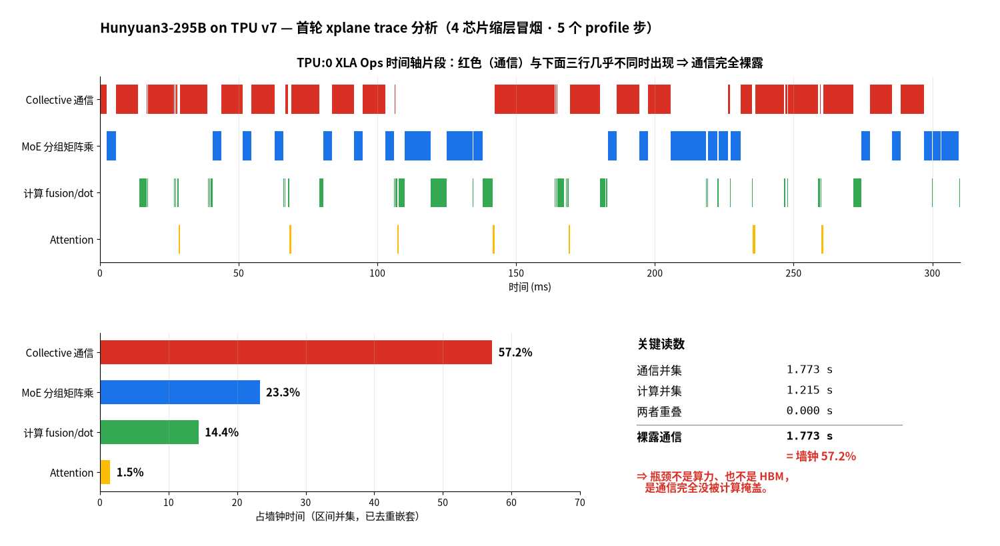

# 混元 3（295B-A21B）在 TPU v7 上的性能调优实践

> **承上**：[QUICKSTART-v7](QUICKSTART-v7.md) 负责「照着跑就能跑起来」，
> 到拿到基线为止。**这份文档从那个基线往下走** —— 为什么是这个水位、
> 已经试过什么、还能怎么调。
>
> **启下**：这是一份**活文档**，不是结论。每跑一轮回填 [§4.6](#46-结果记录)，
> 失败和零收益也要写。

## 1. 从哪儿接上：当前水位

| | 值 | 来源 |
|---|---|---|
| 稳态 step | **20.43 s** | QUICKSTART-v7 §4.2 |
| TFLOP/s / chip | **445.1** | 同上 |
| **MFU** | **19.29%** | 同上（分母 BF16 峰值 2,307） |
| 二次复现（换集群） | step 19.90 s · 457.3 · **19.82%** | QUICKSTART-v7 §4.2.1 |
| 配置 | 64 芯片 `4x4x4` · seq 4096 · pdbs 8 · BF16 | QUICKSTART-v7 §4.3 |

**目标：600–630 TFLOP/s/chip（26–27% MFU），对应 step 压到 14–15 s。缺口 1.38×。**
这个目标怎么来的见 [§3](#3-目标定在哪为什么是-600630-而不是-900)。

> **两个复现点相差 2.6%，所以：拿这份文档对基线时，±3% 以内都算复现成功。**

---

## 2. 已经试过什么：每个选择值多少

从只带 2 个 XLA flag 的首跑出发，逐项叠加。

| 轮次 | 增量 | seq | pdbs | step | TFLOP/s/chip | MFU |
|---|---|---|---|---|---|---|
| V1 | 基线：2 个 XLA flag | 8192 | 4 | 25.11 s | 404.75 | 17.54% |
| y1 | + `use_tokamax_splash` + `sa_use_fused_bwd_kernel` | 8192 | 4 | 24.45 s | 415.16 | 18.00% |
| y2 | + adamw / bf16 优化器 + `iota_embed` | 8192 | 4 | 24.61 s | 412.88 | 17.90% |
| y3 | + SparseCore 卸载组（9 个 flag） | 8192 | 4 | 24.61 s | 412.56 | 17.88% |
| y4 | + 调度器组（4 个 flag） | 8192 | 4 | 23.08 s | 440.30 | 19.09% |
| z1 | y1 + 换 batch / 序列口径 | 4096 | 8 | 21.69 s | 418.89 | 18.16% |
| **c1** | **调度器组 × pdbs=8 / seq=4096（当前最优）** | 4096 | 8 | **20.43 s** | **445.12** | **19.29%** |
| c2 | c1 + 杂项组（补齐 26 flag） | 4096 | 8 | 20.45 s | 444.63 | 19.27% |

**相对首跑 +10.0%。** 按贡献排序：

| 手段 | 贡献 |
|---|---|
| **pdbs=8 / seq=4096** | **+12.8% 吞吐**（TFLOP/s 只 +0.9%） |
| **调度器 flag 组（4 个）** | **+6.6%** |
| `use_tokamax_splash` + `sa_use_fused_bwd_kernel` | +2.6% |
| 杂项 flag 组（5 个） | ±0 |
| **SparseCore 卸载组（9 个）** | **±0** |
| 优化器 / 显存组 | −0.5%（省的是显存不是时间） |

### 2.1 最重要的一条否定结果

**SparseCore 集合通信卸载那 9 个 flag，在 v5p 上值 4.07 pp（13%），在 v7 上收益是 0。**

这条否定结果直接指出了瓶颈在哪：

> SparseCore 卸载改的是**通信在哪执行**，调度器改的是**通信和计算怎么重叠**。
> 前者无效说明**通信不是瓶颈**；后者有效（+6.6%）说明**通信没跟计算叠起来** ——
> 不是通信太慢，是它没藏住。

> ⚠️ **但不要把「这一组没用」外推到「同类的下一组也没用」。**
> 我当时正是这么推的：既然通信不是瓶颈，剩下的 flag 组期望收益也低，跳过。
> 结果调度器那组在我放弃之前已经跑完了 —— **+6.6%，当时的最优**。
> 消融的纪律是**每一组都要真跑**。

### 2.2 同一个开关在两个平台上可以反号

`sa_use_fused_bwd_kernel` 在 **v5p 上要设 `False`、v7 上要设 `True`**。
这不是笔误，是两边各自实测的结果。同理，v5p 上值 4 pp 的 SparseCore 卸载组，
在 v7 上是 0。

> **别把一个平台的调优结论直接搬到另一个。**

### 2.3 三条死路（都实测过，别再踩）

| 开关 | 后果 |
|---|---|
| **`use_tokamax_gmm=True`** | **死锁**，`stalled chips [7]`，连 step 0 都跑不完。2 次开 2 次挂、2 次不开 2 次通 |
| `shard_exp_on_fsdp=True`（FSDP=64 × DP=2） | **OOM**，用了 109.14 G / 94.74 G，**比不开还多 14 G** |
| `per_device_batch_size=12` | **OOM**，临时缓冲 95.17 G |

**`use_tokamax_gmm` 值得单独说。** 官方 Ironwood DSV3 配方里这个开关是 `True`
且能跑，说明 tokamax 后端本身没问题，**是它跟 Hy3 的形状不合** ——
最可能是 192 个专家：DSV3 是 256，分组矩阵乘的组数正好是 2 的幂。这条待确认。
它也是 `use_gmm_v2` 的强制前置，所以 gmm_v2 一并不可用。

**`shard_exp_on_fsdp` 为什么净亏**：这笔交易两头都动 ——
专家权重改按专家维切（收益），但 FSDP 宽度从 128 降到 64，
**非专家部分（attention 80 层 + embedding + dense 首层，约 7.2 B）每卡分片直接翻倍**。
省的抵不过多花的。根因还是 **192 不是 2 的幂**。

---

## 3. 目标定在哪：为什么是 600–630 而不是 900

Ironwood 官方实测表（全部 bf16、synthetic、per-chip 口径）：

| 模型 | 类型 | chips | 序列 | TFLOP/s/chip | MFU |
|---|---|---|---|---|---|
| llama3.1-405b | **稠密** | 256 | 8192 | 1,261.4 | 54.7% |
| llama3.1-70b | **稠密** | 64 | 8192 | 1,207.1 | 52.3% |
| gemma4-31b | **稠密** | 64 | 8192 | 931.3 | 40.4% |
| **qwen3-235b-a22b** | **稀疏 MoE** | 256 | 4096 | **629.8** | **27.3%** |
| **deepseek-v3 671B** | **稀疏 MoE** | 256 | 4096 | **612.7** | **26.6%** |
| gpt-oss-120b | 稀疏 MoE | 256 | 8192 | 329.9 | 14.3% |
| **hunyuan3 295B（本项目）** | **稀疏 MoE** | **64** | **4096** | **445.1** | **19.29%** |

**900 以上全是稠密模型。** 稀疏 MoE 在 Ironwood 上的实际水位是
**600–630 TFLOP/s/chip（26–27% MFU）**，两个最接近 Hy3 的参照都在这条线上。

差距是结构性的，不是调参能翻越的：

- 稠密模型每个 token 走同一套权重，GEMM 又大又规整，MXU 能吃满
- MoE 每层要做一次路由、一次按专家分组重排、一次分组矩阵乘、一次还原。
  分组矩阵乘的每个子块只有 `tokens_per_expert × emb × moe_mlp` 那么大，
  而且组大小随路由结果浮动，**编译期拿不到静态形状**
- 还要加上 all-gather / reduce-scatter 把 192 份专家权重摊开又收回

**所以 v7 的目标是 600–630 TFLOP/s/chip，对应 step 压到 14–15 s。
当前 445.1，缺口 1.38×。**

> Hy3 的激活参数（21 B）比 DSV3（37 B）还少，结构也更简单
> （GQA 而非 MLA、192 专家而非 256），**没有理由跑不到同一水位** ——
> 差距来自配置，不是架构。

### 3.1 关于 FP8：先别指望

同一张表里 DSV3 的 FP8 数据：

| | BF16 | FP8 | |
|---|---|---|---|
| DSV3 TFLOP/s/chip | 612.66 | 743.46 | **+21.4%** |
| 对本精度峰值的 MFU | 26.6% | **16.1%** | 峰值翻倍但吞吐没翻 |
| 稠密 llama3.1-405b 同口径 | 54.7% | 41.8% | 稠密 FP8 涨 **+52.8%** |

**MoE 兑现不了 FP8 的两倍峰值，稠密可以。** 原因跟上面那条一样：
MoE 的时间大量花在路由、分组重排、all-to-all 和小块 GEMM 上，
这些环节不吃 MXU 峰值，降精度对它们几乎没帮助。

> ⚠️ **报 FP8 的 MFU 一定要说明分母。** 同一个 743.46，
> 对 FP8 峰值算是 16.1%，对 BF16 峰值算是 32.2% —— **差一倍**。

---

## 4. 往下怎么调

> 这一章是**工作台**，不是结论。假说、观测手段、实验清单、结果表都在这里，
> 每跑一轮就回填一行。**先读 §4.1 —— 它可能直接改变你要不要继续调。**

### 4.1 先做 roofline 判定：19.8% 也许已经接近 BF16 的天花板

> ✅ **已裁决（2026-07-31）：H2 成立，H1 不成立。** 实测通信占墙钟 **57.2%**、
> 与计算重叠 **0.000s**。下面这套推演过程保留，因为它决定了「先做什么观测」；
> 结论和读 trace 的方法见 [§4.3.1](#431-实战第一轮-trace-是怎么读出结论的教学)。

把两代硬件的三个比值摆在一起：

| | v5p | v7 | v7 / v5p |
|---|---|---|---|
| BF16 峰值 / chip | 459 TFLOPS | 2,307 TFLOPS | **5.03×** |
| HBM 带宽 | 2.8 TB/s | 7.4 TB/s | **2.64×** |
| ICI / chip | 600 Gbps | 1,200 Gbps | **2.0×** |

**算力涨了 5 倍，喂数据的两条通道只涨了 2～2.6 倍。**

Roofline 的拐点（算力 ÷ 带宽）因此从 v5p 的 **164 FLOP/byte** 抬到 v7 的
**312 FLOP/byte** —— 想在 v7 上保持 compute-bound，算术强度要翻 1.9 倍。

MoE 恰恰是算术强度最低的一类结构：每个 token 只激活 21B / 295B ≈ 7% 的参数，
但**权重该从 HBM 读还得读**。所以有理由怀疑它在 v7 上直接掉进了 memory-bound 区。

**做个纯 memory-bound 的预测**：如果计算完全被带宽卡住，MFU 应该按
「带宽比 ÷ 算力比」缩放：

```
34.98%  ×  (2.64 / 5.03)  =  18.4%
```

**实测 19.82%。差 8%。**

**但这个数字不能单独当证据。** 分母里换成 ICI 比值（2.0×）会得到 13.9%，
实测 19.82% 落在两者之间。「非计算部分没跟着涨 5 倍」这一点，
下面两个假说都能解释，光靠比值分不开：

| | 假说 H1：HBM 带宽卡住 | 假说 H2：时间花在非 MXU 环节 |
|---|---|---|
| 说法 | MoE 算术强度低，权重读取吃满 7.4 TB/s | 路由、分组重排、all-to-all、小块 GEMM 不吃 MXU |
| 预测 MFU | ~18.4% | 也低，取决于这些环节占比 |
| **trace 判据** | **HBM 带宽接近 7.4 TB/s** | **HBM 带宽不高，但 collective / permute op 占满时间轴** |
| 该走 | A 组：提高算术强度 | B 组：藏通信、修 kernel |

**§3.1 的实测数据倾向 H2。** 同硬件上 DSV3 开 FP8 只涨 **+21.4%**
（612.66 → 743.46 TFLOP/s/chip）。如果瓶颈纯粹是权重读取带宽，
把权重字节砍半应该给出接近翻倍的收益，而不是两成。
稠密的 llama3.1-405b 同口径涨了 **+52.8%** —— 说明硬件本身兑现得了，
是 **MoE 结构**把收益吃掉了。

> **所以先别急着下结论，也别急着扫参数。** §4.2 那一轮 trace 就能分开这两个。
> **这一步已经做完了 —— 见 [§4.3.1](#431-实战第一轮-trace-是怎么读出结论的教学)，
> 答案是 H2。** 而且实际的判据比原计划的「看 HBM 带宽」更直接：
> 算通信与计算的区间重叠，重叠为 0 就说明瓶颈在通信调度，不在任何一种带宽。
>
> 无论哪个成立，有一点是共同的：**v7 的三条通道里，算力涨 5 倍、
> HBM 涨 2.6 倍、ICI 只涨 2 倍。瓶颈一定在后两条上，不在 MXU。**
> 继续盲扫 XLA flag 期望很低（§2 已经证明杂项 flag 组收益 ±0）。

对照组：同硬件上 DeepSeek V3 报 26.6%。它激活 37B（Hy3 是 21B），
每读一遍权重能摊到更多计算，算术强度天然更高 —— 与 H1 自洽；
它的专家数和路由结构也不同 —— 与 H2 也自洽。**这是推断，没有实测支撑。**

### 4.2 开可观测性：一次跑收齐三样

**前提：`base_output_directory` 必须指向 GCS。** 默认的 `/tmp/hy3out` 是 pod 本地盘，
pod 一结束全没了 —— 这是收不到 profile 最常见的原因。

```bash
PLATFORM=v7 STEPS=25 bash run.sh prof \
  base_output_directory=gs://<你的桶>/hy3prof \
  profiler=xplane \
  skip_first_n_steps_for_profiler=8 \
  profiler_steps=5 \
  profile_cleanly=True \
  dump_hlo=True
```

| 参数 | 为什么这么设 |
|---|---|
| `skip_first_n_steps_for_profiler=8` | step 0 含编译、step 1–2 是 JAX 异步派发的假读数，**必须跳过**，否则 trace 里全是编译 |
| `profiler_steps=5` | 5 步够看清稳态；开太多 trace 文件大到打不开 |
| `profile_cleanly=True` | 每步加 `block_until_ready`，让 trace 按步对齐；代价是**测出来的 step 比真实稍慢**，别拿这轮的 MFU 当数 |
| `dump_hlo=True` | 顺手把编译后的 HLO 也捞走，零额外开销 |

产物落在：

```
{base_output_directory}/{run_name}/tensorboard/   ← xplane
{base_output_directory}/{run_name}/xla_dump/      ← HLO
```

> **上次开 profiler 那轮没跑出稳态**，因为 profiler 自身开销把它挤出了时间窗口。
> 这次 `STEPS` 要给够（≥25），并且**别在只剩几分钟配额的时候开**。

拿到 xplane 后用 xprof（TensorBoard profile 插件）打开，重点看
Trace Viewer 和 Op Profile 两个页面。

### 4.3 从 trace 里必须回答的四个问题

按这个顺序看，前一个不回答清楚，后面的都是猜：

| # | 问题 | 在哪看 | 判据 |
|---|---|---|---|
| ① | **HBM 带宽跑到多少？** | Memory Bandwidth / Op Profile | 接近 7.4 TB/s → §4.1 假说成立，走 A 组；不到一半 → 走 B 组 |
| ② | 时间花在计算还是通信？ | Trace Viewer，看 collective op 条 | all-to-all + all-gather 占比 |
| ③ | 通信藏住了吗？ | 看 collective 与 GEMM 条**是否重叠** | 串行排列＝没藏住 |
| ④ | GMM（分组矩阵乘）占多少？ | Op Profile 按 op 排序 | 它是 MoE 主计算路径，占比低说明时间被别处吃了 |

**① 是分水岭。** 它决定后面走 A 组还是 B 组，别跳过。

### 4.3.1 实战：第一轮 trace 是怎么读出结论的（教学）

> **这一节是方法示范。** 数字会过时，但「从一个 1.4 GB 的 trace.json 走到一句
> 可行动的结论」这条路径可以照抄。脚本固化在
> [`maxtext-hunyuan3/analyze-trace.py`](maxtext-hunyuan3/analyze-trace.py)。



**这一轮的条件**：4 芯片 `2x2x1`、缩层冒烟模型（16.139 B）、25 步、
`profiler_steps=5`。规模小不影响结论 —— 我们要判的是**时间花在哪类 op 上**，
这是结构性质，不随芯片数变。

#### 第 1 步：找到 TPU 的 op 通道

trace 里有几十条通道，绝大多数是 host 侧噪声。先按 `(process, thread)` 聚合总时长：

```
33.135s  /host:CPU        | train.py      ← host，不看
29.349s  /host:CPU        | ?             ← host，不看
 5.037s  /device:TPU:2    | XLA Ops       ← 这才是我们要的
 4.854s  /device:TPU:0    | XLA Ops
```

**只看 `/device:TPU:N` 的 `XLA Ops` 那条。** host 时间长是 profiler 自身开销，
跟性能瓶颈无关。

#### 第 2 步：先验证能不能相加（这一步最容易被跳过）

第一次分析我直接把各类 op 时长求和，得到「通信 36.5%、while 37.3%」，
**差点就这么写进文档**。幸好做了一个自检：

```
op 时长之和 4.854s  ÷  时间轴跨度 3.100s  =  156.6%
```

**超过 100% 就说明有重复计时。** 原因是 `while`（`scan_layers=True` 把 80 层
折成的循环）是**容器 op**，它把内部子 op 的时间一起算进了自己。
直接相加 = 父子重复计。

**正确做法是区间并集**：把同类 op 的 `[start, end)` 区间合并去重，再算总长。
`analyze-trace.py` 里的 `union()` 就干这个，`while` 因为是容器直接排除。

> **通用教训：任何按 op 求和的分析，先做一次「和 ÷ 跨度」自检。**
> 明显大于 100% 就必须换并集，否则结论会系统性偏向"层级深的那一类"。

#### 第 3 步：并集口径下的真实占比

```
类别              并集      占墙钟
comm            1.773s    57.2%     ← Collective 通信
moe_gemm        0.723s    23.3%     ← MoE 分组矩阵乘 gmm/tgmm
compute         0.446s    14.4%     ← 普通 fusion/dot
attn            0.046s     1.5%     ← splash attention
```

**MXU 上真正在算的（后三项）加起来 39.2%，通信一项就 57.2%。**

#### 第 4 步：关键一问 —— 通信藏住了吗

到这里只能说「通信多」，还不能说「通信是瓶颈」。**如果通信和计算是重叠的，
多也不要紧。** 所以要算两组区间的交集：

```
通信并集  1.773s
计算并集  1.215s
两者重叠  0.000s        ← 决定性
```

**零。一秒都没有重叠。** 上面那张图的第一行（红）和下面三行，肉眼就能看出
是错开的 —— 算完等通信，通信完再算，完全串行。

#### 结论与它推翻了什么

| | |
|---|---|
| **[§4.1](#41-先做-roofline-判定198-也许已经接近-bf16-的天花板) 的 H1（HBM 带宽卡住）** | ❌ 不成立。真在算的只占 39.2%，远没到把 HBM 打满的程度 |
| **H2（时间花在非 MXU 环节）** | ✅ 成立，而且是最坏的形式：**通信不是"多"，是"完全裸露"** |
| 实验方向 | 走 [§4.4](#44-实验清单) **B 组（藏通信）**，不是 A 组（提算术强度） |
| 对 FP8 的预期 | 与 [§3.1](#31-关于-fp8先别指望) 的 +21.4% 自洽 —— FP8 只能加速那 14.4% 的 dot，**动不了 57.2% 的通信** |

这也给 [§2.1](#21-最重要的一条否定结果) 那条既有定性结论补上了定量证据：
不只是「通信没藏住」，而是**1.773 秒纯等待，占墙钟 57.2%**。

**下一步最对口的是 [B1 `scan(unroll=N)`](#44-实验清单)** —— `while` 循环体是
XLA 的调度边界，循环体里只有 1 层时，第 N 层的 all-gather 没法藏进第 N−1 层的
计算里。这跟"重叠 = 0"的实测现象机理完全一致。

#### 复现这套分析

```bash
# 1) 取 trace（xplane 同目录下的 .trace.json.gz）
gcloud storage cp "gs://<bucket>/<run>/tensorboard/plugins/profile/*/*.trace.json.gz" .
gunzip -c *.trace.json.gz > t.json      # 62 MB → 1.4 GB，留够磁盘

# 2) 一条命令出全部结论
python3 maxtext-hunyuan3/analyze-trace.py t.json
python3 maxtext-hunyuan3/analyze-trace.py t.json --dev 3   # 换个 device 交叉验证
```

> 内部还有 xprof 可视化（需要有效的 LOAS2 cert）。上面这套**不依赖任何内部工具**，
> 纯 stdlib，随时能跑。

---

### 4.4 实验清单

按 §4.3 ① 的结论二选一。每条都标了预期收益、成本、和**判定标准**
（跑之前先想清楚"什么结果算成功"，否则容易自我说服）。

#### A 组 —— 若确认 memory-bound：提高算术强度

> ⛔ **已排除（§4.3.1）。这组现在优先级最低**，留档备查。

| # | 实验 | 机理 | 成本 | 判定 |
|---|---|---|---|---|
| A1 | **FP8** | 权重字节数减半 → 算术强度翻倍 | 中（要验数值稳定性） | **DSV3 同硬件实测只有 +21.4%**（§3.1），所以预期是「有收益但不翻倍」。若我们这里也是 +20% 上下，说明 H2 成立；若明显更高，H1 成立 |
| A2 | `per_device_batch_size` 8 → 12 / 16 | 一次读进的权重摊到更多 token | 低（可能 OOM） | 每档记 MFU + HBM 峰值，看拐点 |
| A3 | `max_target_length` 4096 → 8192 | attention 部分算术强度随 seq 涨 | 低 | §2 消融里 8192/pdbs4 与 4096/pdbs8 打平，**这次固定 pdbs 单独扫 seq** |
| A4 | 修 `use_tokamax_gmm` 死锁 | 官方 GMM kernel，可能少读一遍权重 | 高（要查根因） | 见 §4.5 |

> **§3.1 的「先别指望」指的是「别指望翻倍」，不是「别做」。**
> +21.4% 在当前水位上是实打实的一档，而且它同时是一次**判别实验** ——
> 收益接近 DSV3 的 +21.4% 就支持 H2，明显更高就支持 H1。

#### B 组 —— 若不是 memory-bound：藏通信 / 修 kernel

> ✅ **实测指向这组（§4.3.1：通信 57.2%、重叠 0）。B1 最对口，先做它。**

| # | 实验 | 机理 | 成本 | 判定 |
|---|---|---|---|---|
| B1 | `scan(unroll=N)`，扫 1/2/4/8 | `while` 循环体是 XLA 调度边界，跨迭代不能重排；unroll 把 N 层放进同一调度域，延迟隐藏调度器才有得发挥 | 低（约 10 行） | 同时记吞吐 / 编译时间 / HBM 峰值三条曲线 |
| B2 | 并行策略：试 expert parallelism | 当前 `ici_fsdp=-1, tp=1` 纯 FSDP，MoE 的 all-to-all 全走 ICI；而 ICI 只涨了 2.0×，是三条通道里最弱的一条 | 中 | 看 all-to-all 占比是否下降 |
| B3 | MoE tile 参数 | v5p 上设了 18 个（`{wi,wo} × {fwd,dlhs,drhs} × 3 维`），**v7 上一个都没设**，完全没探过的面 | 低 | 零成本可试 |
| B4 | `remat_policy` / `decoder_layer_input=offload` | offload 到 host 会吃 PCIe；若 HBM 不紧张就不该 offload | 低 | 关掉看 HBM 峰值和 step |

#### 两组都该做的

| # | 实验 | 说明 |
|---|---|---|
| C1 | 关掉 9 个 SparseCore flag 再测一次 | §2 说它们收益为 0。**收益为 0 的东西留着只会增加变量**，确认无害就删掉，让后面的实验干净 |
| C2 | 单层计时 | `scan_layers=True` 把 80 层折成一个 scan，分不出层内开销。临时 `scan_layers=False` 跑几步，能看到单层结构 |

### 4.5 `use_tokamax_gmm` 死锁（唯一"官方有、我们用不了"的加速手段）

它是 MoE 的主计算路径，也是 `use_gmm_v2` 的强制前置，所以两个一起用不了。
怀疑是 **192 个专家不是 2 的幂**，导致分组矩阵乘的组划分出问题。
如果能修，可能是 A 组里最大的单项收益。

排查建议：先用缩层模型（`hunyuan3-smoke`，4 层）在 4 芯片小池上复现，
几十秒一轮，比在 64 芯片上试快两个数量级。

### 4.6 结果记录

每跑完一轮回填一行。**失败和零收益也要写** —— 否则下一个人会重跑一遍。

| 日期 | 实验 | 改了什么 | step (s) | TFLOP/s/chip | MFU | 结论 |
|---|---|---|---|---|---|---|
| 2026-07-30 | baseline | §4.3 参数集 | 20.43 | 445.1 | 19.29% | 起点 |
| 2026-07-30 | 二次复现 | 同上，换集群 | 19.90 | 457.3 | 19.82% | 可复现（§4.2.1） |
| 2026-07-31 | **P0 trace** | 4 芯片冒烟 + `profiler=xplane` | — | — | — | **H2 成立**：通信占墙钟 57.2%，与计算重叠 0.000s。转 B 组（[§4.3.1](#431-实战第一轮-trace-是怎么读出结论的教学)） |
| 2026-07-31 | **缩放验证** | 16 芯片 / 20 层（等比缩放） | 6.090 | 410.7 | **17.80%** | MFU **不守恒，低 7.7%**；但编译 49.6s（快 12–20×）。详见 [§5](#5-规模缩放能不能在-16-芯片上调优) |
| | | | | | | |

---


## 5. 规模缩放：能不能在 16 芯片上调优

### 5.1 为什么要问这个

64 芯片一轮实验的成本不在跑，在**等**：编译 10–17 分钟，加上排队和起容器，改一个 XLA flag
到看见数字往往要半小时以上。如果小规模能给出**同样的判断**，调优循环可以快一个数量级。

所以要验的不是"小规模能不能跑"，而是 **MFU 在缩放下守不守恒**。守恒 → 小规模的结论可以直接外推；
不守恒 → 至少要知道偏差多大、从哪来。

### 5.2 缩放怎么设计：为什么层数要跟着砍

当前是**纯 FSDP**（`ici_fsdp_parallelism=-1, ici_tensor_parallelism=1`），没有流水线并行。
在这个配置下，两个量决定了每张芯片的负载：

| 量 | 怎么随规模变 |
|---|---|
| 每芯片参数量 | ∝ 层数 ÷ 芯片数 |
| 每芯片 FLOPs | ∝ 层数 × `per_device_batch_size`（**与芯片数无关**，因为 global batch 跟着芯片数走） |

第二行是关键，也是容易想错的地方：**只减芯片不减层，每芯片计算量不变，但每芯片参数量翻倍**——
HBM 先撑爆。所以芯片数和层数必须同比例砍，才能让每芯片参数量恒定：

| 规模 | 芯片 | 拓扑 | 层数 | 每芯片"层份额" |
|---|---|---|---|---|
| 基线 | 64 | `4x4x4` | 80 | 1.25 |
| 本轮 | 16 | `2x2x4` | 20 | 1.25 |
| （未跑） | 32 | `2x4x4` | 40 | 1.25 |

其余参数一律不动：`per_device_batch_size=8`、`max_target_length=4096`、同一套 XLA flag。

### 5.3 实测结果

30 步，步时序列干净得可以直接读：

```
step  0: 49.597s   ← 编译
step  1:  7.549s   step  2: 10.723s   ← 预热
step  3–16: 6.09s  ← 已进稳态（step 13 为 6.467s）
step 17: 89.888s   ← profiler 导 trace，不计入
step 18–29: 6.09s  ← 稳态，12 步抖动 ±0.002s
```

> **口径提醒**：`skip_first_n_steps_for_profiler=12 profiler_steps=5` 会让 **step 17** 出现
> 一个 90 秒的尖峰。若按惯例取 `step ≥ 15` 求均值，会把它算进去，得到 11.678s —— 比真实稳态
> 慢近一倍。**取稳态一定要先看序列再定窗口**，不要套用固定阈值。

| | 64 芯片 / 80 层 | 16 芯片 / 20 层 | 差 |
|---|---|---|---|
| 稳态 step | 20.43 s | **6.090 s** | — |
| tokens/s/device | 1,604 | 5,381 | — |
| TFLOP/s/chip | 445.1 | **410.7** | −7.7% |
| MFU（BF16 峰值 2,307） | 19.29% | **17.80%** | **−7.7%** |
| 首步编译 | 10–17 min | **49.6 s** | 快 12–20× |

**结论：MFU 不守恒，小规模低 7.7%，超出 ±3% 的复现判据。**

### 5.4 这 7.7% 从哪来：两个候选，尚未分离

#### 候选一：层无关开销的占比变大（可定量）

MFU 已经对总 FLOPs 做过归一，所以 7.7% 是**真实的效率损失**，不是算错账。
但可以从两组数里反推出结构。用 `TFLOP/s/device ÷ tokens/s/device` 得到每 token 的 FLOPs：

| | 80 层 | 20 层 | 比值 |
|---|---|---|---|
| GFLOP / token / device | 138.75 | 38.16 | **3.636** |

**如果 FLOPs 只来自 decoder 层，这个比值应该正好是 4.0。** 少掉的部分就是不随层数缩放的开销 ——
embedding 查表、12 万词表（`vocab_size: 120832`）的 logits 投影、以及 loss。
按 `F(L) = a·L + b` 两点求解：

- 每层 **1.676** GFLOP/token
- 层无关项 **4.635** GFLOP/token

于是层无关部分的占比：**80 层时 3.3% → 20 层时 12.1%**，翻了近 4 倍。

再按 FLOPs 权重反解两类工作各自的效率（两点两未知，恰定）：

- decoder 层内计算 ≈ **19.9% MFU**
- 层无关部分（embedding / logits / loss）≈ **10.1% MFU**

这个量级是合理的：词表投影和 softmax 是访存密集型，效率本来就该明显低于层内的大矩阵乘。
**层数砍到 1/4，等于把一块低效率的工作从 3% 放大到 12%，整体 MFU 被拖下来。**

#### 候选二：拓扑退化（无法排除）

基线的 `4x4x4` 是完整的三维环面；本轮的 `2x2x4` 有一个维度只有 2，
该方向的环绕链路是退化的。集合通信的效率因此可能不同。

#### 两者用一个数据点分不开

上面那组反解是**两点拟合两个未知数，恰好定解，没有自由度做检验** —— 它自洽，但不构成证明。
拓扑这条同样没有独立证据。**不要把候选一当成已确认的结论。**

**判别实验：跑 64 芯片 / 20 层。** 层数与本轮相同、拓扑与基线相同：

- MFU 落到 ~17.8% → 层无关开销占比是主因，拓扑无罪
- MFU 保持 ~19.3% → 拓扑退化是主因

每芯片"层份额"降到 0.3125（基线的 1/4），显存有充足余量，不会 OOM。
反方向（16 芯片跑 80 层）不可行 —— 每芯片参数量是基线的 4 倍，必然 OOM。

### 5.5 对调优实践的结论

1. **绝对 MFU 不能从 16 芯片外推到 64 芯片。** 任何小规模跑出的 MFU，报数时必须标注规模和层数，
   否则会被误当成全尺寸水位。
2. **相对改进量大概率可以迁移，但还没验证。** 7.7% 若是稳定偏置，A/B 的差值就能用。
   **验证方法**：在 16 芯片上重跑一个已知有效的改动（例如 §2 里 `pdbs=8 / seq=4096` 那一组），
   看提升幅度是否与 64 芯片上一致。这一步做完之前，小规模只能用来判**方向**，不能用来判**幅度**。
3. **真正的收益是编译时间：49.6 秒 vs 10–17 分钟。** 这让"改一个 flag 看一眼"从半小时降到一分钟量级。
   对 §4.4 里那批需要逐个试的开关（尤其 B 组的 `scan(unroll=N)` 扫描、C 组删 SparseCore flag），
   小规模的价值主要在这里，而不在 MFU 数字本身。
4. **筛完再上大规模。** 推荐流程：16 芯片粗筛出有效方向 → 64 芯片确认幅度并出正式数字。

### 5.6 自建 v7 节点池：四个卡点

共享集群不可用时需要在自有项目自建。四个坑按撞到的顺序：

**① 必须用 workload policy，不是 placement policy**

```
Creation of a managed instance group with tpu7x-standard-4t machine type
with placement policy is not supported. Use workload policy instead.
```

v5p 惯用的 `--placement-type=COMPACT` 和裸 `--tpu-topology` 在 v7 上都会触发这个。正确写法：

```bash
gcloud compute resource-policies create workload-policy <WP> \
  --region=us-central1 --type=HIGH_THROUGHPUT --accelerator-topology=2x2x4

gcloud container node-pools create <POOL> \
  --cluster=<C> --region=us-central1 --node-locations=us-central1-c \
  --machine-type=tpu7x-standard-4t --num-nodes=4 --spot \
  --placement-policy=<WP> \
  --scopes=https://www.googleapis.com/auth/cloud-platform
```

**② 建池时不要再传 `--tpu-topology`。** 传了 GKE 会自动附加一个 group placement policy，
与 workload policy 冲突。拓扑信息由 workload policy 的 `--accelerator-topology` 携带。

**③ 必须显式给 `--scopes=cloud-platform`。** 节点池默认 scope 里存储只有 `devstorage.read_only`，
表现是**下载代码正常、程序跑到写输出时 403**：

```
google.cloud.storage.exceptions.InvalidResponse:
('Request failed with status code', 403, ...)
```

这一轮就是编译完成、准备上传 HLO dump 时倒在这里。**节点池 scope 不可修改，只能删掉重建。**
桶上给了 IAM 权限也没用 —— IAM 和 OAuth scope 是两层，scope 不够先被拦。

**④ DWS flex-start 不能空跑等你。** 想要"节点先建好在那等着部署"是做不到的：

| 尝试 | 报错 |
|---|---|
| flex-start + autoscale 0→4 | `Maximum node count 0 is not a valid size of TPU pod slice with topology "2x2x4"` |
| flex-start + 固定 4 节点 | **`Flex start node pools require autoscaling enabled`** |

gcloud 在 API 层强制 flex-start 必须开 autoscaling，而 autoscaling 意味着按需伸缩 ——
没有 workload 就是 0 节点。要想常驻，只能放一个 `sleep infinity` 的 workload 把节点撑住。
另外 flex-start 节点**最长存活 7 天**，到期节点和 Pod 一起被抢占；且**不支持 reservation**
（必须 `--reservation-affinity=none`）、**不支持 Spot**（二选一）。

### 5.7 复现

```bash
# 提交（其余参数与 §4.3 基线完全一致，只加一个层数覆盖）
python3 -m src.maxtext.trainers.pre_train.train src/maxtext/configs/base.yml \
  model_name=hunyuan3-295b ... \
  base_num_decoder_layers=20 \
  per_device_batch_size=8 max_target_length=4096

# 取稳态：先看序列，再定窗口（别直接套 step>=15）
grep -a "completed step" run.log | \
  sed -E 's/.*step: ([0-9]+), seconds: ([0-9.]+).*/\1 \2/'
```

MFU = `TFLOP/s/device × 2 ÷ 2307`（v7 一颗芯片 = 2 个 JAX device）。
