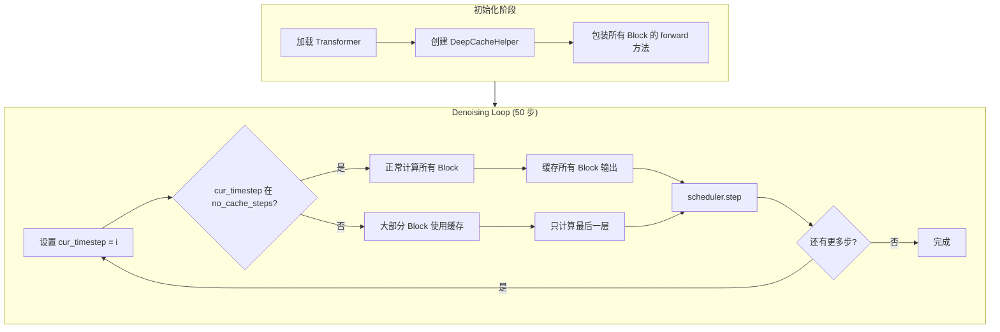
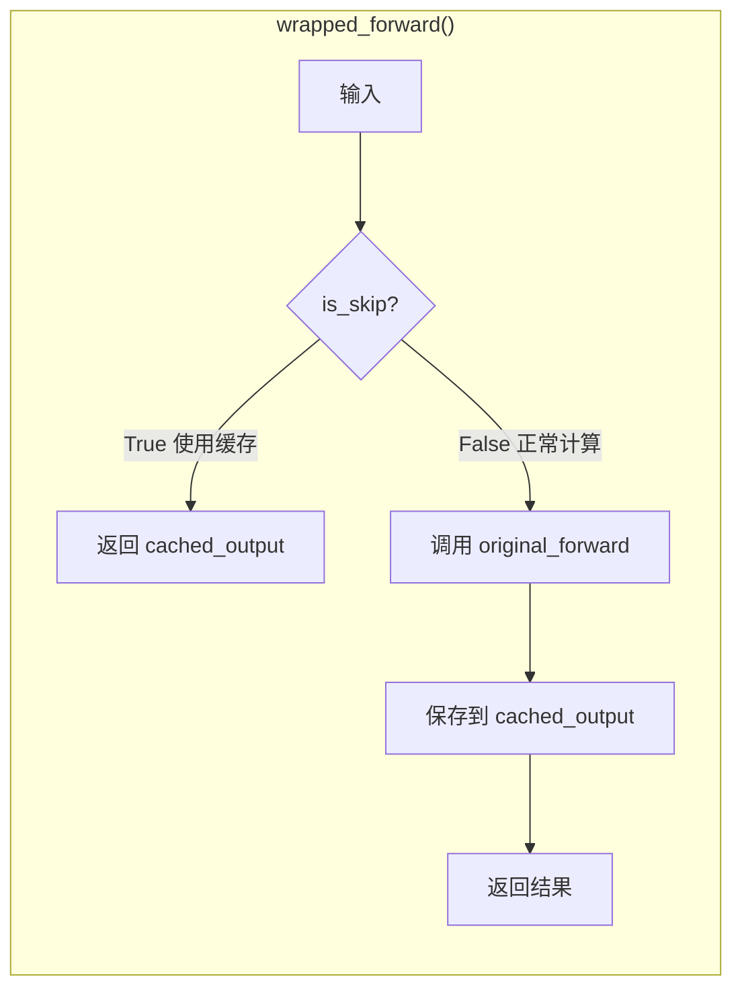

# DeepCache 深度缓存加速原理详解

## 概述

DeepCache 是一种用于加速扩散模型推理的技术，通过**复用 Transformer 中间层的缓存输出**来跳过重复计算。在 HunyuanVideo 1.5 上实测可达 **1.83x 加速**，且质量损失极小。

## 核心创新点

### 1. 观察到的关键洞察

扩散模型的 denoising 过程中，相邻 timestep 之间的中间特征变化是**渐进的、缓慢的**：

```
timestep t:   x_t → Block_0 → Block_1 → ... → Block_52 → noise_pred_t
timestep t-1: x_t-1 → Block_0 → Block_1 → ... → Block_52 → noise_pred_t-1
                      ↑         ↑                ↑
                    相似!     相似!            相似!
```

由于 x_t 和 x_{t-1} 差异很小，中间层的输出也非常相似。**既然如此，为什么还要重复计算呢？**

### 2. DeepCache 的解决方案

**直接复用上一步的中间层输出！**

```python
def wrapped_forward(*args, **kwargs):
    if should_use_cache:  # 判断是否使用缓存
        result = self.cached_output[block_id]  # 直接返回缓存
    else:
        result = original_forward(*args, **kwargs)  # 正常计算
        self.cached_output[block_id] = result  # 保存到缓存
    return result
```

## 实现原理图解

### 50 步 Denoising 全流程

以 HunyuanVideo 1.5 默认配置为例 (`cache_start_step=11, cache_end_step=45, cache_step_interval=4`)：

```
Step:  0  1  2  3  4  5  6  7  8  9 10 | 11 12 13 14 | 15 16 17 18 | 19 ... | 45 46 47 48 49
       ├──────── 前期阶段 ─────────────┤├─ 周期1 ────┤├─ 周期2 ────┤        ├── 后期阶段 ──┤
       │         不使用 Cache          ││ C  S  S  S ││ C  S  S  S │  ...   │  不使用 Cache │
       │         (保证质量)            ││ 计 跳 跳 跳││ 计 跳 跳 跳│        │  (保证收敛)   │
                                         ↑算  过  过  过  ↑算  过  过  过

C = 计算 (Compute) - 正常执行所有 53 个 block，并缓存每个 block 的输出
S = 跳过 (Skip)    - Block 0-51 使用缓存输出，只有 Block 52 正常计算
```

### 🔑 关键理解：53 个 Block 是顺序执行的

HunyuanVideo 1.5 的 Transformer 结构：

```
latent_t ──► Block_0 ──► Block_1 ──► ... ──► Block_51 ──► Block_52 ──► noise_pred
              │           │                    │            │
           输出 out_0   输出 out_1          输出 out_51   输出 = noise_pred
```

**每个 block 的输入是上一个 block 的输出**，所以即使要跳过计算，也需要知道上一步的输出是什么 → **必须缓存**

### 单步内部执行流程

#### 第 11 步：正常计算（填充缓存）

```
                        53 个 Block 顺序执行
                        ↓
latent_11 ──┬──────────────────────────────────────────────────────────────────┐
            │                                                                   │
            ▼                                                                   │
     ┌──────────┐      ┌──────────┐            ┌──────────┐      ┌──────────┐  │
     │ Block 0  │      │ Block 1  │            │ Block 51 │      │ Block 52 │  │
     │          │──────│          │── ... ─────│          │──────│          │──┼──► noise_pred_11
     │ 正常计算 │      │ 正常计算 │            │ 正常计算 │      │ 正常计算 │  │
     └────┬─────┘      └────┬─────┘            └────┬─────┘      └────┬─────┘  │
          │                 │                       │                 │         │
          ▼                 ▼                       ▼                 ▼         │
      cache[0]          cache[1]              cache[51]          cache[52]     │
      保存 out_0        保存 out_1            保存 out_51        (不缓存)       │
                                                                               │
计算量: 100% (53 个 block 全部执行)                                             │
时间:   ~5.2 秒                                                                 │
```

#### 第 12 步：使用缓存（跳过 Block 0-51）

**关键点：第 12 步的 latent_12 跟第 11 步的 latent_11 是不同的！**
但是 Block 0-51 直接返回上次缓存的输出，**完全忽略新的输入**。

```
latent_12 ──┐  (新的输入，但被忽略！)
            │
            ▼
     ┌──────────┐      ┌──────────┐            ┌──────────┐      ┌──────────┐
     │ Block 0  │      │ Block 1  │            │ Block 51 │      │ Block 52 │
     │          │──────│          │── ... ─────│          │──────│          │──► noise_pred_12
     │  SKIP!   │      │  SKIP!   │            │  SKIP!   │      │ 正常计算 │
     └────┬─────┘      └────┬─────┘            └────┬─────┘      └────┬─────┘
          │                 │                       │                 │
          ▼                 ▼                       ▼                 │
    返回 cache[0]     返回 cache[1]          返回 cache[51]          │
    (第11步的out_0)  (第11步的out_1)        (第11步的out_51)          │
                                                    │                 │
                                                    └────────────────►│
                                                  Block 52 的输入      │
                                                  来自缓存！           │
                                                                       
计算量: ~2% (只执行 Block 52)
时间:   ~0.1 秒
```

### 第 12, 13, 14 步都用第 11 步的缓存吗？

**是的！** 这就是 DeepCache 的核心设计：

```
Step 11: 正常计算 → 填充 cache[0] ~ cache[51]
Step 12: 使用 cache[0~51] → 只计算 Block 52 → noise_pred_12
Step 13: 使用 cache[0~51] → 只计算 Block 52 → noise_pred_13
Step 14: 使用 cache[0~51] → 只计算 Block 52 → noise_pred_14
Step 15: 正常计算 → 更新 cache[0] ~ cache[51]  ← 刷新缓存
Step 16: 使用新的 cache[0~51] → 只计算 Block 52 → ...
```

### 为什么 Block 52 必须正常计算？

虽然 Block 52 的输入（来自 cache[51]）是固定的，但 **Block 52 还有其他输入**：

```python
# Transformer Block 的输入包括：
def forward(
    self,
    hidden_states,      # 来自上一个 block 的输出（使用缓存）
    timestep,           # 当前 timestep（每步不同！）
    text_embeds,        # 文本 embedding
    ...
):
```

**timestep 是关键**！虽然 hidden_states 来自缓存，但：
- 第 12 步：timestep = 0.78
- 第 13 步：timestep = 0.76
- 第 14 步：timestep = 0.74

不同的 timestep 会产生不同的 noise_pred，这就是为什么即使输入相同，Block 52 也必须重新计算。

### 为什么 Block 0-51 可以忽略新输入？

这是 DeepCache 的**核心假设**：

> **相邻 timestep 之间，中间层的特征变化很小，可以近似认为相等。**

虽然 latent_12 ≠ latent_11，但：
```
Block_0(latent_12) ≈ Block_0(latent_11) = cache[0]
```

这个近似在扩散模型中是成立的，因为：
1. scheduler 设计使得相邻步骤的 latent 变化很小
2. Transformer block 是连续函数，输入小变化 → 输出小变化
3. 误差在最后一层被"修正"（因为 Block 52 正常计算）

### 完整的数据流对比

#### 无缓存（正常执行）

```
Step 11:
  latent_11 ───► Block_0 ───► Block_1 ───► ... ───► Block_51 ───► Block_52 ───► noise_pred_11
                   │           │                      │              │
                   │ out_0     │ out_1                │ out_51       │ (直接输出)
                   ▼           ▼                      ▼
              [存入cache]  [存入cache]           [存入cache]
              
Step 12:
  latent_12 ───► Block_0 ───► Block_1 ───► ... ───► Block_51 ───► Block_52 ───► noise_pred_12
                   │           │                      │              │
                   │ out_0'    │ out_1'               │ out_51'      │ (直接输出)
                   ▼           ▼                      ▼
              (不保存)     (不保存)              (不保存)

计算量: Step 11 = 100%, Step 12 = 100%
```

#### 有缓存（DeepCache）

```
Step 11 (填充缓存):
  latent_11 ───► Block_0 ───► Block_1 ───► ... ───► Block_51 ───► Block_52 ───► noise_pred_11
                   │           │                      │              │
                   │ out_0     │ out_1                │ out_51       │ (直接输出)
                   ▼           ▼                      ▼
              cache[0]    cache[1]              cache[51]

Step 12 (使用缓存):
  latent_12 ───┐
               │
               ▼ (被忽略！)
            Block_0 ───► Block_1 ───► ... ───► Block_51 ───► Block_52 ───► noise_pred_12
               │           │                      │              │
               │           │                      │              │ (正常计算)
               ▼           ▼                      ▼
           返回cache[0] 返回cache[1]        返回cache[51] ────────┘
           (不计算)    (不计算)             (不计算)           ↑
                                                            Block_52 使用
                                                            cache[51] + timestep_12
                                                            来计算新的输出

计算量: Step 11 = 100%, Step 12 ≈ 2%
```

### 🔴 重要发现：cache[0-50] 其实没用！

你的问题问得非常好！让我们仔细分析缓存步骤的执行流程：

```
Step 12 的真实执行流程（使用缓存）:

  latent_12 传入 Block 0
       ↓
  Block 0: is_skip(0) = True → 返回 cache[0]，忽略 latent_12
       ↓ (返回值 cache[0] 传给 Block 1)
  Block 1: is_skip(1) = True → 返回 cache[1]，忽略输入的 cache[0]  ← 没用！
       ↓ (返回值 cache[1] 传给 Block 2)
  Block 2: is_skip(2) = True → 返回 cache[2]，忽略输入的 cache[1]  ← 没用！
       ↓
      ...
       ↓
  Block 51: is_skip(51) = True → 返回 cache[51]，忽略输入的 cache[50] ← 没用！
       ↓ (返回值 cache[51] 传给 Block 52)
  Block 52: is_skip(52) = False → 正常计算，使用 cache[51] 作为输入  ← 唯一被使用的！
       ↓
  noise_pred_12
```

**结论**：
- **cache[0] - cache[50] 完全没有被使用！**
- **只有 cache[51]（Block 51 的输出）被 Block 52 真正使用**

### 为什么还要缓存所有 block？

这是 angelslim 实现的设计选择，原因可能是：

1. **代码简洁性**：所有 block 用统一的 wrap 逻辑
2. **支持复杂策略**：如果 `no_cache_block_id` 包含多个 block（比如 Block 26 和 Block 52 都不跳过），那需要 cache[25] 和 cache[51]
3. **内存换代码复杂度**：52 个 tensor 的内存开销换取更简单的实现

### 更精确的说法

实际上，DeepCache 的**真正工作原理**是：

```
┌─────────────────────────────────────────────────────────────────────────────┐
│                     DeepCache 真正做的事情                                   │
├─────────────────────────────────────────────────────────────────────────────┤
│                                                                             │
│  1. 在"填充缓存"步骤（如 step 11）：                                         │
│     - 正常执行所有 53 个 block                                              │
│     - 保存 Block 51 的输出到 cache[51]                                      │
│     - (其他 cache 保存了但没用)                                             │
│                                                                             │
│  2. 在"使用缓存"步骤（如 step 12, 13, 14）：                                 │
│     - Block 0-51 全部跳过（直接返回缓存，输入被忽略）                        │
│     - 只有 Block 52 正常执行，输入 = cache[51]                              │
│                                                                             │
│  效果：                                                                      │
│     - 52 层计算变成 1 层计算                                                │
│     - 加速 52x... 但有固定开销，实际约 1.83x                                │
│                                                                             │
└─────────────────────────────────────────────────────────────────────────────┘
```

### 🎯 一句话总结 DeepCache 核心思想

```
┌─────────────────────────────────────────────────────────────────────────────┐
│                                                                             │
│     用相同的"中间特征"（cache[51]）计算 4 次不同 timestep 的噪声预测          │
│                                                                             │
└─────────────────────────────────────────────────────────────────────────────┘
```

**详细来说**：

```
Step 11: latent_11 → [Block 0-51 正常计算] → out_51 → 保存到 cache[51]
                                                ↓
         cache[51] + timestep_11 → Block_52 → noise_pred_11

Step 12: cache[51] + timestep_12 → Block_52 → noise_pred_12  (只算 Block 52!)
Step 13: cache[51] + timestep_13 → Block_52 → noise_pred_13  (只算 Block 52!)
Step 14: cache[51] + timestep_14 → Block_52 → noise_pred_14  (只算 Block 52!)

Step 15: latent_15 → [Block 0-51 正常计算] → out_51 → 更新 cache[51]
                                                ↓
         cache[51] + timestep_15 → Block_52 → noise_pred_15

Step 16: cache[51] + timestep_16 → Block_52 → noise_pred_16  (只算 Block 52!)
...
```

**关键洞察**：
- Block 52 的输入 = cache[51] + timestep_t
- **cache[51] 固定 4 步不变，只有 timestep 在变**
- 所以 52 层计算变成 1 层计算
- 每算 1 次完整的，省下 3 次！

### 核心假设

```
假设：Block_51(Block_50(...Block_0(latent_t)))
        ≈
      Block_51(Block_50(...Block_0(latent_{t-1})))

含义：不同 latent 经过 51 层 block 后，输出几乎相同

所以用 step 11 计算的 cache[51] 代替 step 12/13/14 的计算结果
```

这个假设成立的原因：
1. 扩散模型的 scheduler 设计使相邻 latent 变化很小
2. Transformer 是连续映射，输入小变化 → 输出小变化
3. 4 步间隔足够小，误差可忽略

### 为什么最后一层不跳过？

`no_cache_block_id = 53` 的含义是 Block 52（第 53 层，索引从 0 开始）永远不跳过：

```
Block 52 (最后一层) 的作用:
├── 聚合所有前面层的特征
├── 生成最终的 noise prediction
└── 这一层输出的微小变化会直接影响去噪质量

结论: 最后一层必须计算，确保每一步的 noise_pred 都是精确的
```

## 源码分析

### DeepCacheHelper 核心代码

```python
class DeepCacheHelper(CacheHelper):
    """
    DeepCache 的核心实现
    """
    
    def __init__(self, double_blocks, no_cache_steps, no_cache_block_id):
        # double_blocks: HunyuanVideo 的 53 个 transformer block
        # no_cache_steps: 不使用缓存的步骤集合 {0,1,2,...,10, 11,15,19,..., 45,46,47,48,49}
        # no_cache_block_id: {"double_blocks": {52}} - 最后一层不跳过
        ...
    
    def is_skip(self, block_id, blocktype):
        """判断当前 block 是否应该跳过计算"""
        
        # 1. 如果当前步骤在 no_cache_steps 中，不跳过（正常计算）
        if self.cur_timestep in self.no_cache_steps:
            return False
        
        # 2. 如果当前 block 在 no_cache_block_id 中，不跳过
        if block_id in self.no_cache_block_id[blocktype]:
            return False
        
        # 3. 其他情况：跳过计算，使用缓存
        return True
    
    def wrap_block_forward(self, block, block_id, blocktype):
        """包装 block 的 forward 方法"""
        
        original_forward = block.forward  # 保存原始方法
        
        def wrapped_forward(*args, **kwargs):
            skip = self.is_skip(block_id, blocktype)
            
            if skip:
                # 跳过计算，直接返回缓存
                return self.cached_output[(blocktype, block_id)]
            else:
                # 正常计算，并缓存结果
                result = original_forward(*args, **kwargs)
                self.cached_output[(blocktype, block_id)] = result
                return result
        
        block.forward = wrapped_forward  # 替换 forward 方法
```

### 关键方法调用流程

```
1. 初始化时:
   cache_helper = DeepCacheHelper(transformer.double_blocks, ...)
   cache_helper.enable()  # 包装所有 block 的 forward 方法
   
2. 每步推理前:
   cache_helper.cur_timestep = i  # 设置当前步骤号
   
3. Transformer forward 时:
   for block in double_blocks:
       block.forward(...)  # 自动触发 wrapped_forward
       
4. 推理结束后:
   cache_helper.disable()  # 还原原始 forward 方法
```

## 计算量分析

### 默认配置分析

```python
# 配置
total_steps = 50
cache_start_step = 11  # 从第 11 步开始使用缓存
cache_end_step = 45    # 到第 45 步结束
cache_step_interval = 4  # 每 4 步缓存一次

# 计算 no_cache_steps (不使用缓存的步骤)
no_cache_steps = (
    list(range(0, 11)) +          # 前 11 步: [0,1,2,...,10] = 11 步
    list(range(11, 45, 4)) +      # 中间每隔4步: [11,15,19,23,27,31,35,39,43] = 9 步  
    list(range(45, 50))           # 后 5 步: [45,46,47,48,49] = 5 步
)
# = 11 + 9 + 5 = 25 步 正常计算

# 使用缓存的步骤 = 50 - 25 = 25 步 (跳过大部分计算)
```

### 加速效果分析

| 步骤类型 | 数量 | 每步计算量 | 每步耗时 |
|----------|------|-----------|----------|
| 正常计算 | 25 步 | 100% (53 blocks) | ~5.2s |
| 缓存加速 | 25 步 | ~2% (1 block) | ~0.1s |

**总耗时计算**：
- 原始: 50 × 5.2s = 260s
- DeepCache: 25 × 5.2s + 25 × 0.1s ≈ 130s + 2.5s ≈ 132s
- 理论加速比: 260 / 132 ≈ **1.97x**
- 实测加速比: 260 / 142 ≈ **1.83x** （略有开销）

## 为什么质量损失极小？

### 1. 扩散过程的时间平滑性

```
x_t → x_{t-1} → x_{t-2} → ... → x_0

每一步的变化都很小 (由 scheduler 控制)
因此中间特征的变化也很小
```

### 2. 策略性地选择不缓存的步骤

```
前期 (步骤 0-10): 不缓存
├── 噪声最大，变化最剧烈
├── 结构和语义信息还在形成
└── 必须精确计算

中期 (步骤 11-44): 间隔缓存
├── 结构已经稳定
├── 每 4 步更新一次缓存
└── 缓存步骤直接复用

后期 (步骤 45-49): 不缓存
├── 细节和收敛阶段
├── 需要精确计算确保收敛
└── 避免最终质量损失
```

### 3. 最后一层永不跳过

```
Block 52 负责生成 noise_pred
这是 scheduler 的直接输入
必须保证每一步都精确计算
```

## 与其他加速方法的对比

| 方法 | 原理 | 加速比 | 质量损失 | 内存开销 |
|------|------|--------|----------|----------|
| **DeepCache** | 复用中间层缓存 | 1.83x | 极小 | +缓存内存 |
| SageAttention | INT8 量化 Q/K | 1.6x | 明显 | 无 |
| Flash Attention | 优化内存访问 | 1.0x (baseline) | 无 | 减少 |
| Sparse Attention | 稀疏注意力 | 1.5-2x | 取决于稀疏度 | 减少 |

## Mermaid 流程图

### 整体流程



### 单 Block 缓存逻辑



## 实验数据

### 测试配置

```yaml
Hardware: NVIDIA H100 × 8
Resolution: 720p (1280×720)
Frames: 121 (约 5 秒 @24fps)
Steps: 50
Prompt: "A young woman with beautiful clear eyes and blonde hair..."

DeepCache 配置:
  cache_start_step: 11
  cache_end_step: 45
  cache_step_interval: 4
  no_cache_block_id: 53 (最后一层)
```

### 性能对比

| 指标 | Flash Attention 2 | DeepCache |
|------|-------------------|-----------|
| 每步耗时 | 5.2s | 2.84s (平均) |
| 总耗时 | 260s | 142s |
| **加速比** | 1.0x | **1.83x** |
| 显存占用 | 35GB | 35GB |

### 质量对比

实测生成的视频与原版几乎无法区分：
- 画面细节保留完好
- 人物一致性良好
- 运动流畅自然
- 背景复杂度正常

## 使用建议

### 推荐配置

```bash
# 日常使用（推荐）
bash run_stage2.sh --enable_cache

# 保守配置（更高质量，较少加速）
bash run_stage2.sh --enable_cache \
    --cache_start_step 15 \
    --cache_end_step 40 \
    --cache_step_interval 3

# 激进配置（最大加速，可能有轻微质量损失）
bash run_stage2.sh --enable_cache \
    --cache_start_step 5 \
    --cache_end_step 48 \
    --cache_step_interval 5
```

### 注意事项

1. **内存开销**: 缓存 53 个 Block 的输出需要额外内存（约 2-3GB）
2. **首次运行**: 第一个缓存周期需要完整计算填充缓存
3. **与其他加速组合**: 可与 SageAttention 组合使用，但质量可能下降

## 参考资料

- [DeepCache 原论文](https://arxiv.org/abs/2312.00858)
- [angelslim 库](https://github.com/Tencent/angelslim)
- [HunyuanVideo 1.5](https://github.com/Tencent-Hunyuan/HunyuanVideo-1.5)