# HunyuanVideo-1.5 DiT 实现对比分析

本文档深入对比分析两个 DiT (Diffusion Transformer) 实现的异同：
1. `dit_gpu.py` - 性能测试脚本
2. `generate_hunyuan_staged/stage2_transformer_explained.py` - 完整推理实现

---

## 📋 目录

1. [HunyuanVideo 1.5 整体架构详解](#hunyuanvideo-15-整体架构详解)
2. [概述对比](#概述对比)
3. [架构流程图](#架构流程图)
4. [核心组件对比](#核心组件对比)
5. [输入准备对比](#输入准备对比)
6. [执行流程对比](#执行流程对比)
7. [功能差异详解](#功能差异详解)
8. [设计理念分析](#设计理念分析)

---

## HunyuanVideo 1.5 整体架构详解

基于官方架构图，HunyuanVideo 1.5 采用多模态输入的扩散 Transformer 架构：

### 系统架构总览

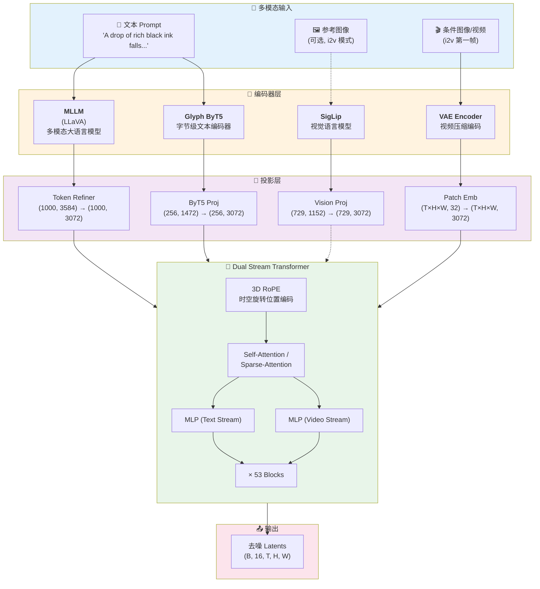

### 四路输入详解

| 输入模态 | 编码器 | 投影层 | 输出维度 | 颜色标识 | 用途 |
|---------|--------|--------|----------|----------|------|
| **文本 (语义)** | MLLM (LLaVA) | Token Refiner | (1000, 3072) | 🟣 紫色 | 高层语义理解 |
| **文本 (字符)** | Glyph ByT5 | ByT5 Proj | (256, 3072) | 🟣 浅紫 | 精确字符渲染 |
| **参考图像** | SigLip | Vision Proj | (729, 3072) | 🔵 蓝色 | 视觉风格参考 (可选) |
| **视频/图像 Latent** | VAE Encoder | Patch Emb | (T×H×W, 3072) | 🟠 橙色 | 条件帧 + 噪声帧 |

### 编码器详细规格

#### 1. MLLM (多模态大语言模型)

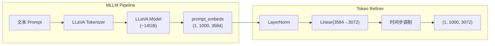

**特点**:
- 使用 LLaVA 作为语言理解骨干
- 输出 1000 个 tokens，每个 3584 维
- Token Refiner 包含时间步条件注入

#### 2. Glyph ByT5 (字节级编码器)

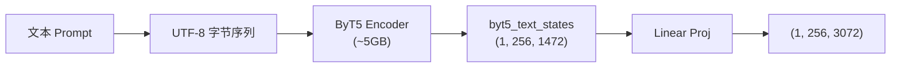

**为什么需要 ByT5?**
```
问题场景:
  Prompt: "生成带有 'HUNYUAN' 文字的海报"
  
  MLLM 理解: "某个品牌/名称的海报" (语义级别)
  ByT5 理解: H-U-N-Y-U-A-N 每个字符 (字节级别)
  
结果: 配合使用可以准确渲染文字
```

#### 3. SigLip (视觉语言模型)

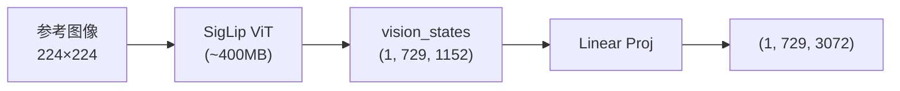

**Token 数量解析**:
- 729 = 27 × 27
- 来源: 224 / patch_size(8) = 28，去掉 CLS 或边界 = 27

#### 4. VAE Encoder (视频压缩)

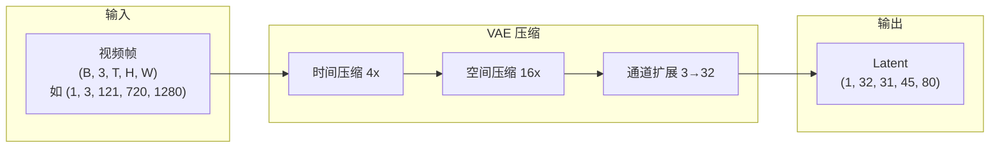

**压缩公式**:
```python
latent_frames = (video_frames - 1) // 4 + 1  # 121 → 31
latent_height = video_height // 16           # 720 → 45
latent_width = video_width // 16             # 1280 → 80
latent_channels = 32                         # 不是 16!
```

### Dual Stream Block 详解

这是 HunyuanVideo 1.5 的核心创新之一：

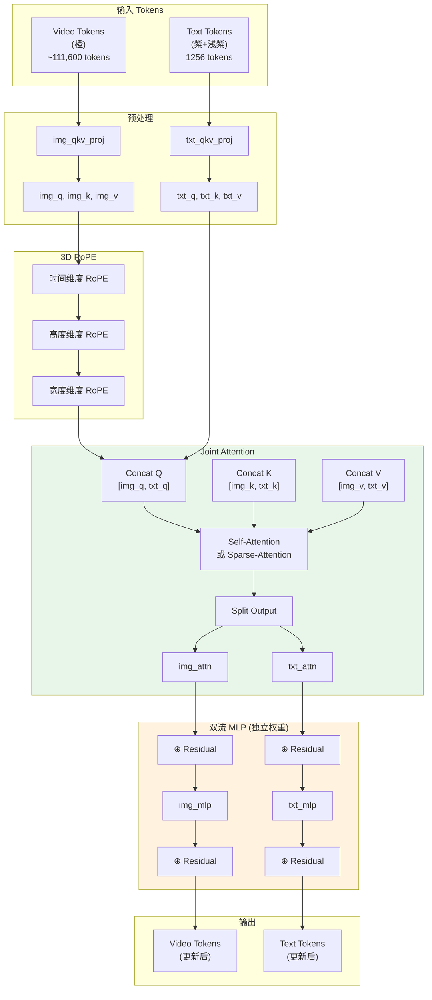

### 为什么是 "Dual Stream"?

```
┌─────────────────────────────────────────────────────────────────────────┐
│ 传统 Cross-Attention (如 Stable Diffusion):                             │
│                                                                          │
│   Text ─────────────────────────────────────────────────→ 不变           │
│                        ↓ (只作为 K,V)                                    │
│   Image ──── Q ───→ Attention ──→ 更新后的 Image                        │
│                                                                          │
│   问题: Text tokens 不会被更新，信息流是单向的                           │
└─────────────────────────────────────────────────────────────────────────┘

┌─────────────────────────────────────────────────────────────────────────┐
│ HunyuanVideo Dual Stream (Joint Attention + Dual MLP):                  │
│                                                                          │
│   Text ──┬── Q,K,V ──→ ┌──────────────┐ ──→ txt_attn ──→ txt_mlp ──→ 更新 │
│          │             │    Joint     │                                  │
│          └─────────────│  Attention   │─────────────────────────────────│
│   Video ─┬── Q,K,V ──→ │              │ ──→ img_attn ──→ img_mlp ──→ 更新 │
│          │             └──────────────┘                                  │
│                                                                          │
│   优势:                                                                  │
│   1. 双向交互: Text 和 Video 互相 attend                                │
│   2. 独立 MLP: 各自的特征变换 (不共享权重)                               │
│   3. 更强表达力: Text tokens 也会根据 Video 调整                        │
└─────────────────────────────────────────────────────────────────────────┘
```

### 3D RoPE (旋转位置编码)

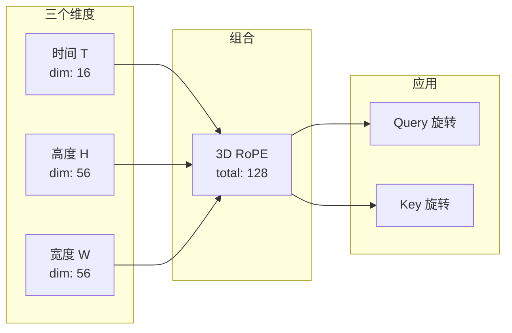

**rope_dim_list = [16, 56, 56]**:
- 时间维度: 16 维 (视频帧间的位置关系)
- 空间维度: 56 + 56 = 112 维 (2D 空间位置)
- 总计: 128 维 = head_dim

### Token 数量计算

```python
# 720p, 121 帧的例子
video_tokens = T_latent × H_latent × W_latent
             = 31 × 45 × 80
             = 111,600 tokens

# 文本 tokens
mllm_tokens = 1000   # LLaVA 输出
byt5_tokens = 256    # ByT5 输出
text_tokens = 1256   # 拼接后

# 总 tokens (一次 attention)
total_tokens = 111,600 + 1,256 = 112,856 tokens!
```

### 稀疏注意力 (Sparse Attention)

由于 token 数量巨大，HunyuanVideo 使用稀疏注意力:

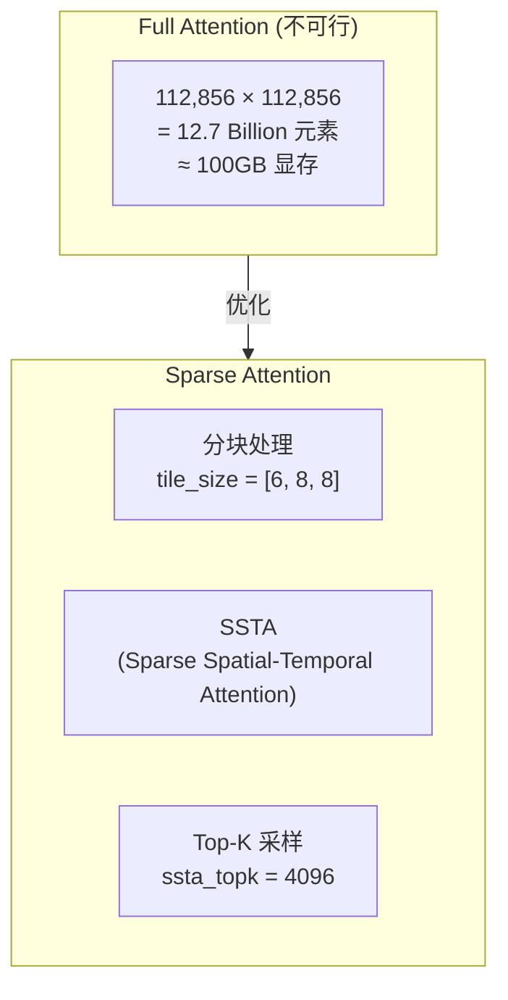

### 完整 Transformer 结构

```
HunyuanVideo_1_5_DiffusionTransformer:
├── embedders:
│   ├── txt_in: SingleTokenRefiner (LLaVA → 3072)
│   ├── byt5_in: Linear (1472 → 3072)
│   ├── img_in: PatchEmbedder (32 → 3072)
│   └── time_in: TimestepEmbedder (用于 AdaLN)
│
├── double_blocks: × 53
│   ├── img_mod: ModulateDiT (时间步调制 for img)
│   ├── txt_mod: ModulateDiT (时间步调制 for txt)
│   ├── img_norm1/2: RMSNorm
│   ├── txt_norm1/2: RMSNorm
│   ├── img_attn_qkv: Linear (3072 → 3072×3)
│   ├── txt_attn_qkv: Linear (3072 → 3072×3)
│   ├── img_attn_proj: Linear (3072 → 3072)
│   ├── txt_attn_proj: Linear (3072 → 3072)
│   ├── img_mlp: MLP (3072 → 12288 → 3072)
│   └── txt_mlp: MLP (3072 → 12288 → 3072)
│
├── final_layer: Linear (3072 → 32×patch_size^3)
│
└── params: ~13B (DiT 部分)
```

### 条件注入机制 (AdaLN)

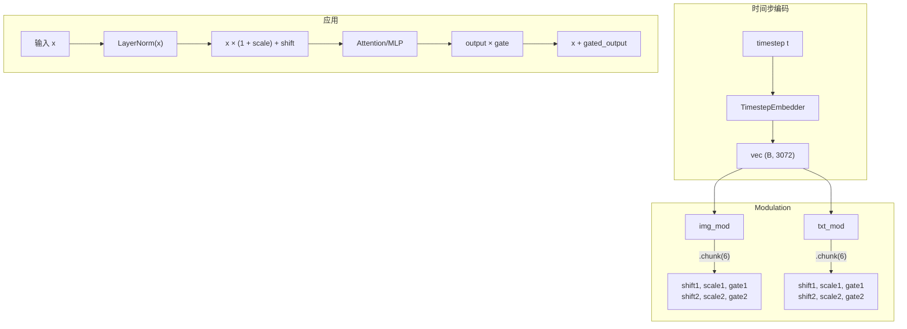

**AdaLN 公式**:
```python
# 调制 (before attention/mlp)
x_modulated = LayerNorm(x) * (1 + scale) + shift

# 门控 (after attention/mlp)
output = x + gate * layer_output
```

---

## 概述对比

### 文件定位

| 维度 | `dit_gpu.py` | `stage2_transformer_explained.py` |
|------|-------------|-----------------------------------|
| **目的** | 性能测试/基准测试 | 真实视频生成推理 |
| **代码行数** | ~426 行 | ~2779 行 |
| **复杂度** | 简单 | 复杂（含详细注释） |
| **是否生成视频** | ❌ 只测试速度/显存 | ✅ 生成真实视频 |
| **输入数据** | 随机张量 | 真实 Text Embeddings |
| **Scheduler** | 不使用 | FlowMatchDiscreteScheduler |
| **去噪循环** | ❌ 单次前向 | ✅ 多步迭代去噪 |

### 代码量对比

```
dit_gpu.py:
├── 性能测试函数: ~150 行
├── 模型加载: ~100 行
├── 工具函数: ~80 行
└── 命令行参数: ~50 行

stage2_transformer_explained.py:
├── 详细文档注释: ~1000 行
├── 核心推理逻辑: ~400 行
├── 辅助函数: ~300 行
├── 概念解释附录: ~200 行
└── 其他: ~100 行
```

---

## 架构流程图

### dit_gpu.py 执行流程

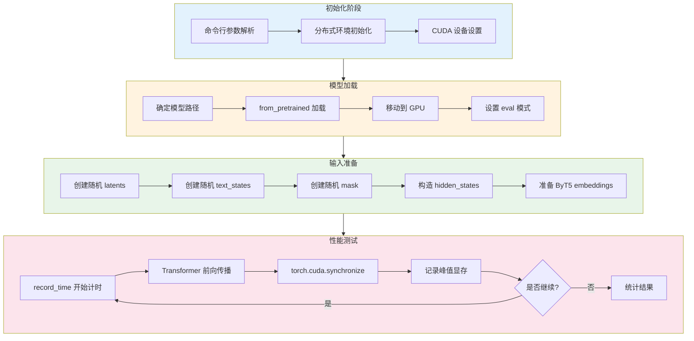

### stage2_transformer_explained.py 执行流程

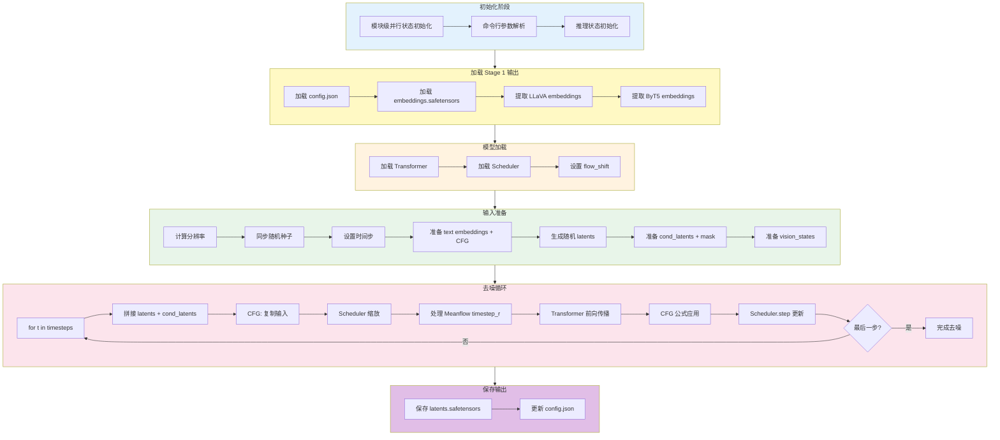

### 两者的核心差异流程

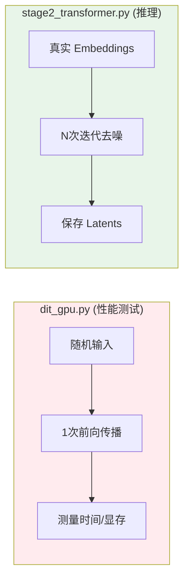

---

## 核心组件对比

### 1. 模型加载方式

```python
# dit_gpu.py - 可选使用 SageAttention
transformer = HunyuanVideo_1_5_DiffusionTransformer.from_pretrained(
    model_dir,
    torch_dtype=torch.bfloat16,
    low_cpu_mem_usage=True,
    attn_mode=attn_mode,  # "flash" 或 "sageattn"
).to(DEVICE)

# stage2_transformer_explained.py - 固定配置
transformer = HunyuanVideo_1_5_DiffusionTransformer.from_pretrained(
    transformer_path,
    torch_dtype=transformer_dtype,
    low_cpu_mem_usage=True,
)
```

### 2. 分布式初始化

```python
# 两者都使用相同的初始化模式
parallel_dims = initialize_parallel_state(sp=int(os.environ.get('WORLD_SIZE', '1')))
torch.cuda.set_device(int(os.environ.get('LOCAL_RANK', '0')))
```

### 3. Scheduler 使用

| 特性 | `dit_gpu.py` | `stage2_transformer_explained.py` |
|------|-------------|-----------------------------------|
| Scheduler 类型 | 无 | FlowMatchDiscreteScheduler |
| 时间步设置 | 固定 t=999 | 动态 timesteps 序列 |
| flow_shift | 无 | 从 PIPELINE_CONFIGS 获取 |
| solver | 无 | euler |

---

## 输入准备对比

### dit_gpu.py 的输入构造

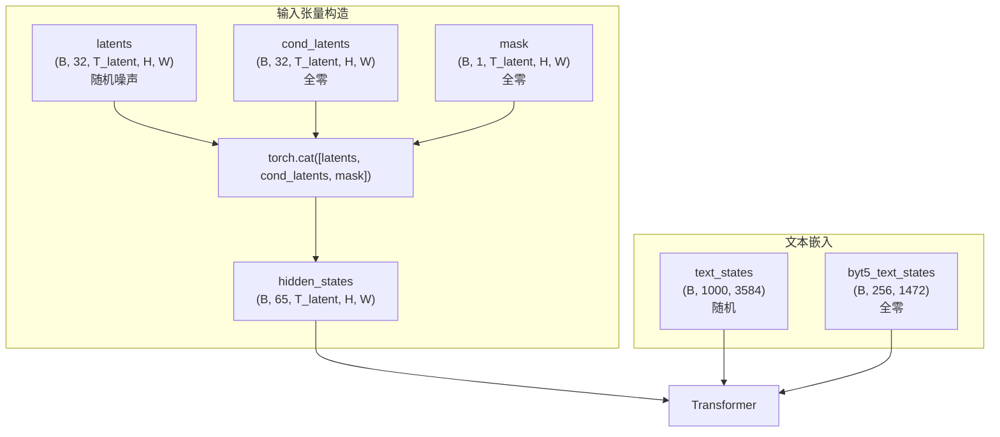

### stage2_transformer_explained.py 的输入构造

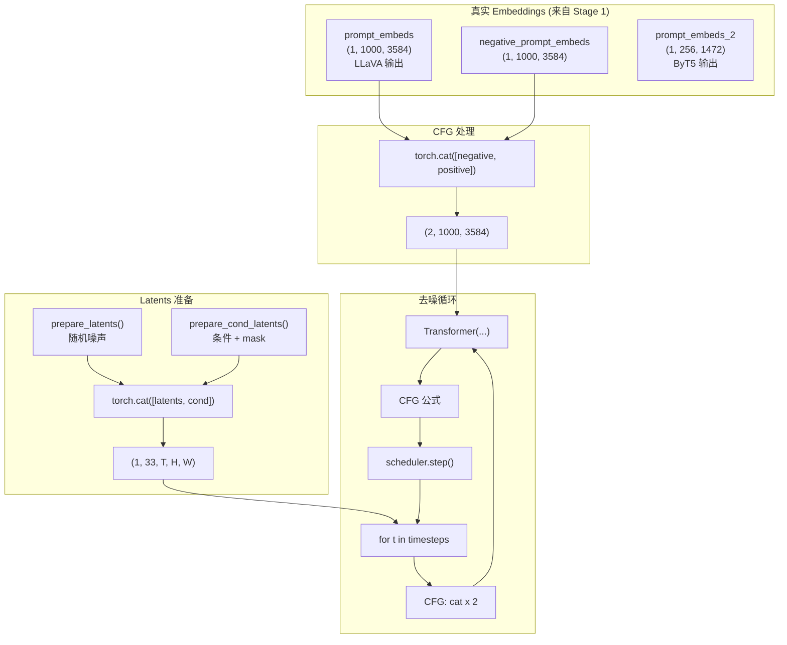

### 输入参数对比表

| 参数 | dit_gpu.py | stage2_transformer_explained.py |
|------|------------|----------------------------------|
| `hidden_states` | 随机 (B, 65, T, H, W) | 拼接后 (2B, 33, T, H, W) |
| `timestep` | 固定 999 | 动态 timesteps 序列 |
| `text_states` | 随机 | 真实 LLaVA embeddings |
| `text_states_2` | None | None (720p 模式) |
| `encoder_attention_mask` | 全 1 | 真实 prompt_mask |
| `byt5_text_states` | 全零 | 真实 ByT5 embeddings |
| `byt5_text_mask` | 全零 | 真实 mask |
| `timestep_r` | 不传 | Meanflow 下一步时间 |
| `vision_states` | 不传 | 全零 (t2v 模式) |
| `guidance` | 不传 | None |
| `return_dict` | False | False |

---

## 执行流程对比

### 单次调用 vs 迭代去噪

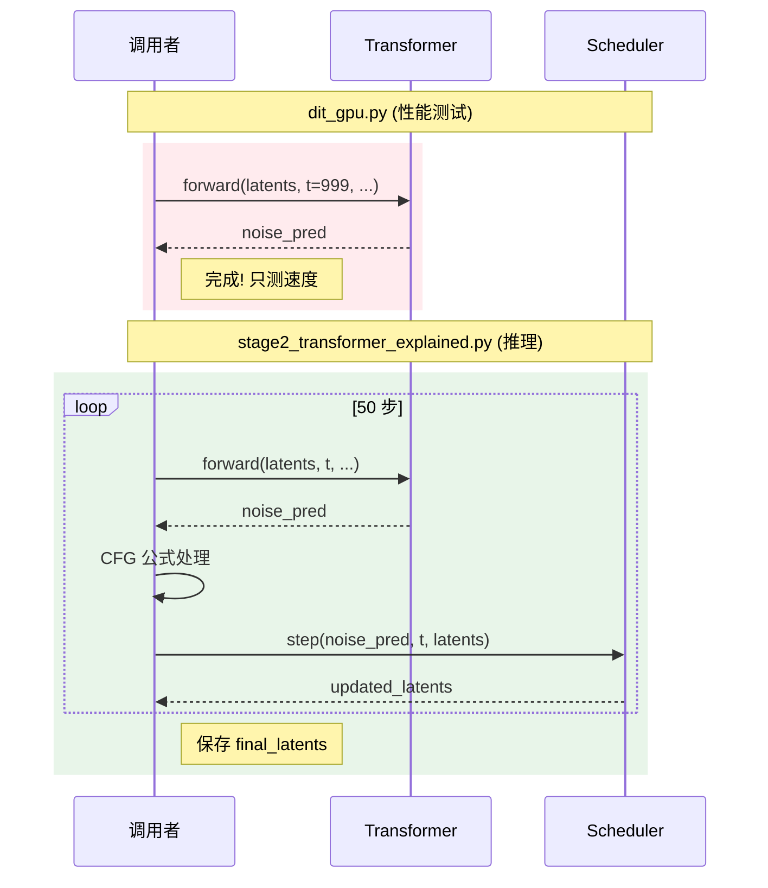

### CFG 处理差异

```python
# dit_gpu.py - 可选 CFG，简单复制
batch = 2 if enable_cfg else 1
# 如果启用，batch 翻倍，但不做 CFG 公式计算

# stage2_transformer_explained.py - 完整 CFG 实现
if do_classifier_free_guidance:
    # 1. 输入翻倍
    latent_model_input = torch.cat([latents_concat] * 2)
    
    # 2. 模型输出分离
    noise_pred_uncond, noise_pred_text = noise_pred.chunk(2)
    
    # 3. 应用 CFG 公式
    noise_pred = noise_pred_uncond + guidance_scale * (noise_pred_text - noise_pred_uncond)
```

---

## 功能差异详解

### 1. Meanflow 支持

```mermaid
graph LR
    subgraph dit_gpu["dit_gpu.py"]
        A1[不支持 Meanflow]
        A2[不传 timestep_r]
    end
    
    subgraph stage2["stage2_transformer.py"]
        B1[检测 use_meanflow 配置]
        B2{是最后一步?}
        B3[timestep_r = 0]
        B4[timestep_r = timesteps[i+1]]
        
        B1 --> B2
        B2 -->|是| B3
        B2 -->|否| B4
    end
```

### 2. 多任务支持 (i2v vs t2v)

```python
# dit_gpu.py - 只测试 t2v 模式
cond_latents = torch.zeros(...)  # 全零
mask = torch.zeros(...)           # 全零

# stage2_transformer_explained.py - 支持 i2v
def prepare_cond_latents(task_type, image_cond, latents, multitask_mask):
    if image_cond is not None and task_type == 'i2v':
        # i2v: 第一帧是条件图像
        latents_concat = image_cond.repeat(1, 1, latents.shape[2], 1, 1)
        latents_concat[:, :, 1:, :, :] = 0.0  # 后续帧清零
    else:
        # t2v: 全零
        latents_concat = torch.zeros_like(latents)
```

### 3. 性能测量 vs 实际推理

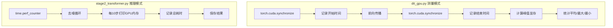

### 4. SageAttention 支持

| 特性 | dit_gpu.py | stage2_transformer_explained.py |
|------|------------|----------------------------------|
| SageAttention | ✅ 可选 `--use_sage_attn` | ❌ 不支持 |
| attn_mode 参数 | `"flash"` 或 `"sageattn"` | 默认 |
| 动态检测 | ✅ 检测 SAGE_ATTN_AVAILABLE | ❌ 无 |

---

## 设计理念分析

### 1. dit_gpu.py 设计思想

```
目标: 快速、可重复地测量 DiT 模型性能
      ↓
设计决策:
├── 输入: 随机张量（无需真实数据）
├── 单次前向: 不需要完整去噪
├── 精确计时: CUDA synchronize 确保准确
├── 内存测量: reset_peak_memory_stats
├── 多次运行: 统计稳定性
└── 最小依赖: 不需要 text encoder, VAE 等
```

### 2. stage2_transformer_explained.py 设计思想

```
目标: 正确执行 Stage 2 推理，生成高质量 latents
      ↓
设计决策:
├── 三阶段分离: 节省内存，灵活调度
├── 真实 embeddings: 从 Stage 1 加载
├── 完整去噪循环: scheduler + CFG
├── 多任务支持: t2v / i2v
├── Meanflow: 改善时间一致性
├── SP 支持: 多 GPU 长视频生成
└── 详细文档: 便于理解和维护
```

### 3. 代码复用分析

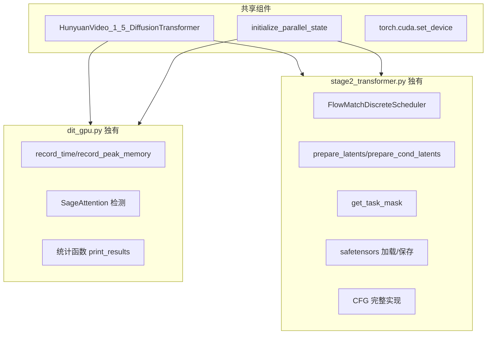

---

## 使用场景建议

### 使用 dit_gpu.py 当：

1. ✅ 需要快速评估模型在不同硬件上的性能
2. ✅ 测试新的 attention 优化（如 SageAttention）
3. ✅ 比较不同配置（帧数、分辨率）的性能
4. ✅ 不关心生成质量，只关心速度/显存

### 使用 stage2_transformer_explained.py 当：

1. ✅ 需要生成真实视频
2. ✅ 需要理解 HunyuanVideo 的推理机制
3. ✅ 需要在多 GPU 上生成长视频
4. ✅ 需要调试或修改推理逻辑

---

## 性能参考数据

### dit_gpu.py 典型输出

```
=== DiT 测试结果 (帧数: 121) ===
运行次数: 3

峰值显存 (MB):
  平均值: 28456.78
  最小值: 28432.12
  最大值: 28489.34

执行时间 (ms):
  平均值: 1523.45
  最小值: 1498.23
  最大值: 1567.89
```

### stage2_transformer_explained.py 典型输出

```
开始 Transformer 推理...
  使用 Meanflow: True
  使用 CFG: True
  SP 状态: sp_enabled=True, sp_size=8

  步骤 1/50
    GPU allocated: 28.45GB
  步骤 11/50
    GPU allocated: 28.67GB
  ...
  步骤 50/50
    GPU allocated: 28.52GB

✓ Transformer 推理完成，耗时: 264.32 秒
```

---

## 总结

| 方面 | dit_gpu.py | stage2_transformer_explained.py |
|------|------------|----------------------------------|
| **定位** | 性能基准测试 | 生产推理 |
| **复杂度** | 简单 | 复杂 |
| **输入** | 随机 | 真实 |
| **输出** | 性能指标 | 视频 latents |
| **适用场景** | 性能调优 | 视频生成 |
| **可读性** | 代码简洁 | 详细注释 |
| **扩展性** | 易于修改测试参数 | 易于理解完整流程 |

两个文件互为补充：
- `dit_gpu.py` 用于快速验证硬件性能
- `stage2_transformer_explained.py` 用于实际生成视频并学习架构