# Splash Attention Kernel 深度分析文档

## 目录
1. [概述](#概述)
2. [整体架构](#整体架构)
3. [序列分块处理机制](#序列分块处理机制)
4. [Mask 机制详解](#mask-机制详解)
5. [前向传播实现](#前向传播实现)
6. [反向传播实现](#反向传播实现)
7. [内存优化策略](#内存优化策略)
8. [API 使用示例](#api-使用示例)

---

## 概述

Splash Attention（Sparse Flash Attention）是 JAX/Pallas 为 TPU 优化的稀疏注意力机制实现。它结合了 Flash Attention 的内存效率和稀疏注意力的计算效率，特别适用于处理长序列任务。

### 核心特点
- **稀疏性支持**：通过 block-level 的稀疏性跳过不必要的计算
- **内存效率**：采用分块计算，避免材化完整的注意力矩阵
- **TPU 优化**：针对 TPU 的 VMEM、SMEM 层级进行专门优化
- **多头注意力支持**：支持 MHA（Multi-Head Attention）、MQA（Multi-Query Attention）和 GQA（Grouped Query Attention）

---

## 整体架构

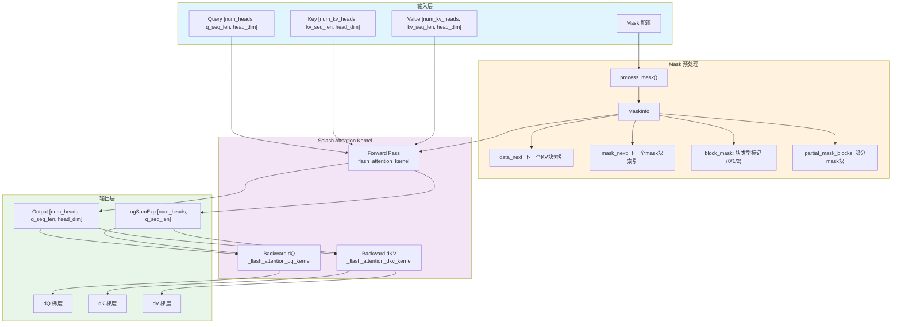

---

## 序列分块处理机制

Splash Attention 使用分块（Tiling）策略来处理长序列，关键参数定义在 [`BlockSizes`](splash_attention_kernel.py:494) 类中：

### BlockSizes 配置

```python
@dataclasses.dataclass(frozen=True, slots=True)
class BlockSizes:
    # 前向传播块大小
    block_q: int          # Q 序列块大小
    block_kv: int         # KV 序列块大小（内存）
    block_kv_compute: int # KV 计算块大小
    
    # dKV 反向传播块大小
    block_q_dkv: int
    block_kv_dkv: int
    block_kv_dkv_compute: int
    
    # dQ 反向传播块大小
    block_q_dq: int
    block_kv_dq: int
    
    # 数据布局
    q_layout: QKVLayout   # HEAD_DIM_MINOR 或 SEQ_MINOR
    k_layout: QKVLayout
    v_layout: QKVLayout
```

### 分块计算流程

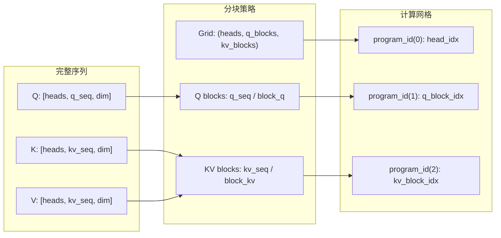

### 内部计算循环

在 [`flash_attention_kernel`](splash_attention_kernel.py:702) 中，KV 块可以进一步细分为更小的计算块：

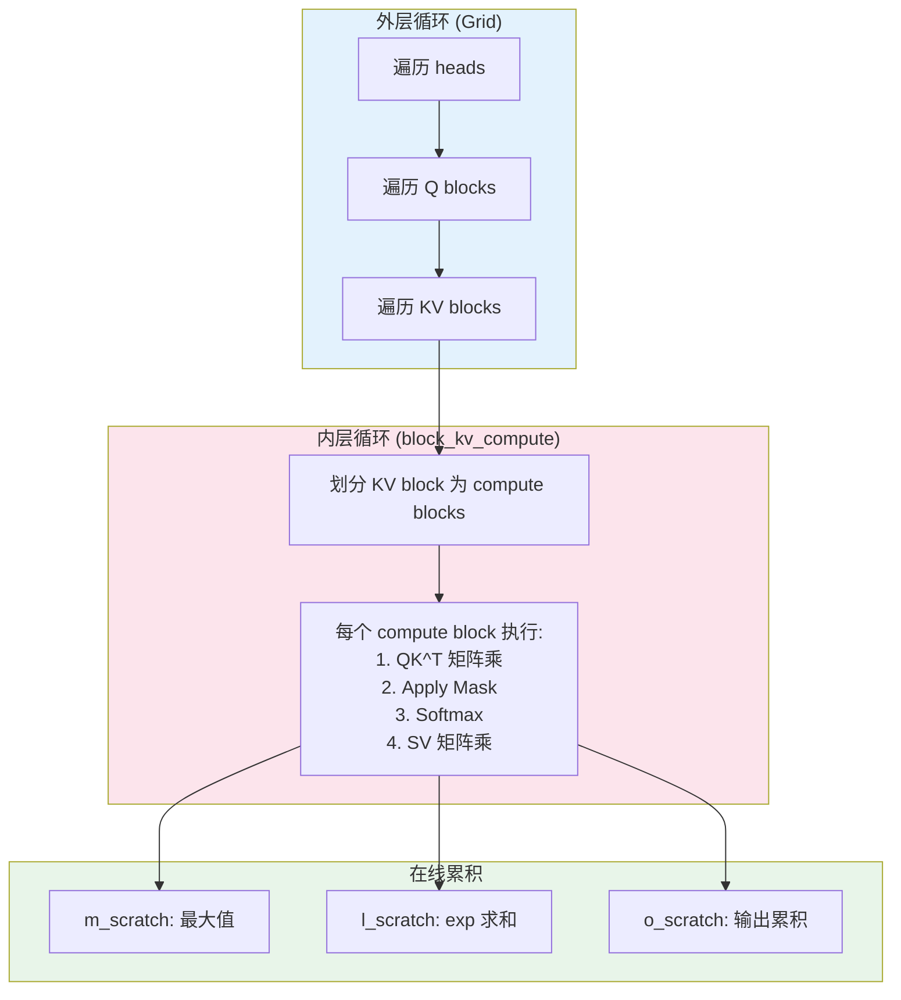

---

## Mask 机制详解

Splash Attention 支持多种 Mask 类型，通过 [`splash_attention_mask.py`](splash_attention_mask.py) 定义：

### Mask 类型层次结构

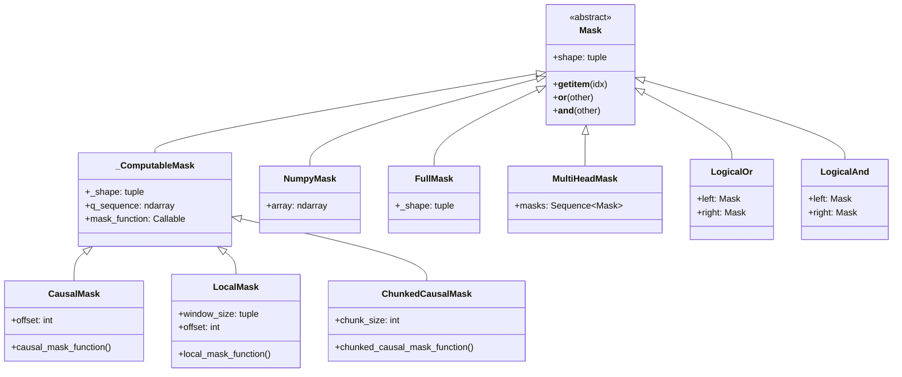

### Mask 预处理流程

[`MaskInfo`](splash_attention_mask_info.py:33) 结构包含运行时 mask 信息：

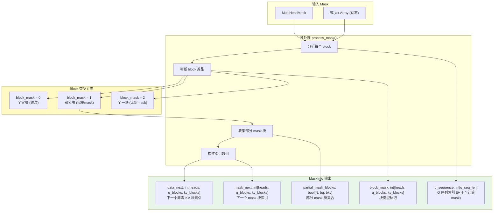

### Block Mask 值的含义

| block_mask 值 | 含义 | 处理方式 |
|--------------|------|---------|
| 0 | 全零块 | 完全跳过，不计算 |
| 1 | 部分块 | 从 partial_mask_blocks 加载实际 mask |
| 2 | 全一块 | 不应用 mask，直接计算 |

---

## Mask 类型与内存开销详细分析

Splash Attention 的核心优势之一是**绝大多数情况下不需要存储完整的 [B, H, S, L] 大小的 mask 矩阵**。

### 🔑 关键问题回答

**Q: Splash Attention 有几种 Mask 机制？**

共有 **6 种**主要的 Mask 类型，可分为两大类：

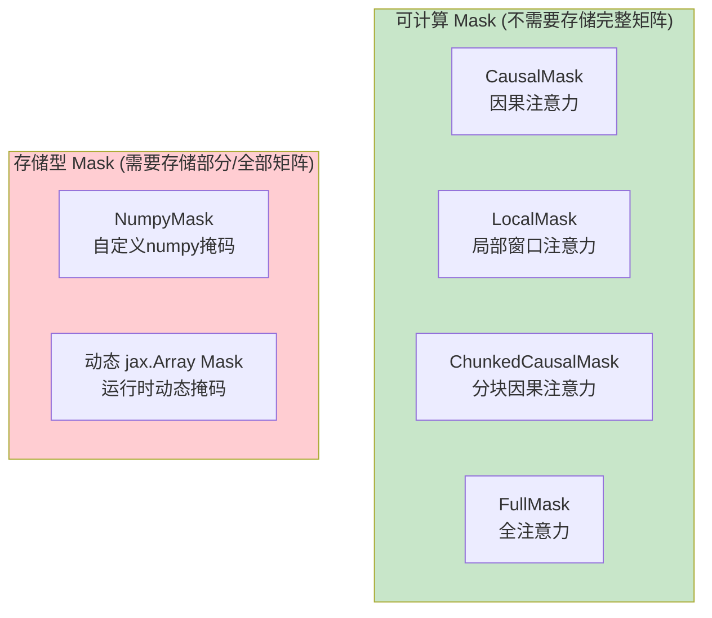

**Q: 是否需要 [B, H, S, L] 这么大的矩阵？**

| Mask 类型 | 是否需要 O(seq²) 存储 | 实际内存需求 |
|-----------|---------------------|-------------|
| `CausalMask` | ❌ **否** | O(seq_len) 只存索引 |
| `LocalMask` | ❌ **否** | O(seq_len) 只存索引 |
| `ChunkedCausalMask` | ❌ **否** | O(seq_len) 只存索引 |
| `FullMask` | ❌ **否** | O(1) 只存 shape |
| `NumpyMask` | ⚠️ **部分** | O(unique_blocks × block²) |
| 动态 `jax.Array` | ⚠️ **是** | O(H × seq²) 需完整存储 |

### Mask 内存需求详解

#### 1. 可计算 Mask（零额外存储） ✅

`CausalMask`、`LocalMask`、`ChunkedCausalMask` 继承自 `_ComputableMask`：

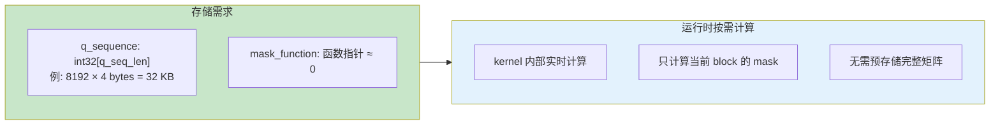

**CausalMask 内存公式**：
```
内存 = q_seq_len × sizeof(int32) = seq_len × 4 bytes
```

**具体示例 (8192 tokens)**：
| 方案 | 内存计算 | 内存大小 |
|-----|---------|---------|
| 传统完整矩阵 | 8192 × 8192 × 1 byte | **64 MB** (单head) |
| Splash CausalMask | 8192 × 4 bytes | **32 KB** (所有heads共享) |
| 节省比例 | - | **99.95%** |

#### 2. NumpyMask（部分块存储） ⚠️

对于自定义的 numpy mask，只存储"部分块"（既非全零也非全一）：

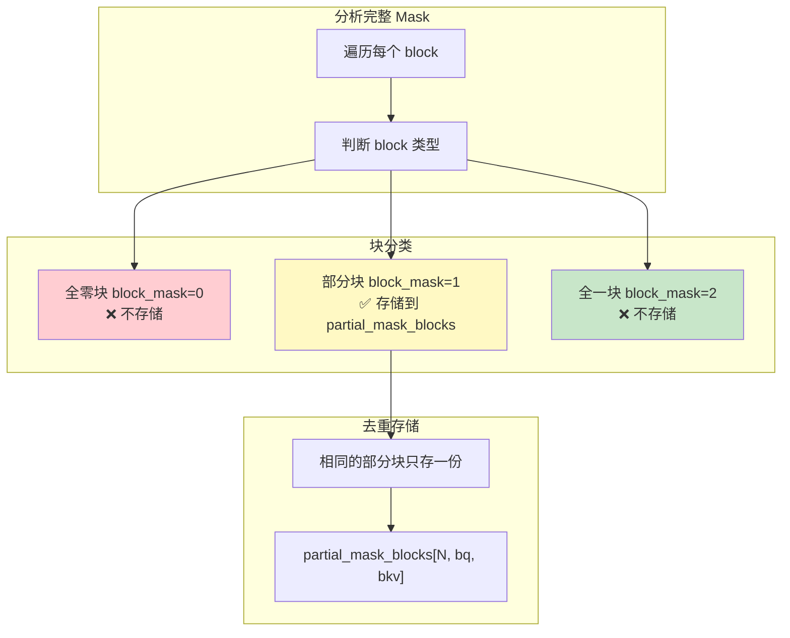

**NumpyMask 内存公式**：
```
partial_mask_blocks = num_unique_partial_blocks × block_q × block_kv × 1 byte
MaskInfo metadata  = heads × q_blocks × kv_blocks × 3 bytes (int8)
```

**Causal Mask 作为 NumpyMask 的示例 (8192 tokens, block=128)**：
```
q_blocks = kv_blocks = 64
对角线上有 64 个部分块
但由于去重，实际只需 ~2 个唯一模式
partial_mask = 2 × 128 × 128 × 1 = 32 KB
metadata = 1 × 64 × 64 × 3 = 12 KB
总计 ≈ 44 KB (vs 64 MB)
```

#### 3. 动态 jax.Array Mask（最大存储） ❌

**这是唯一需要 O(H × seq²) 内存的情况！**

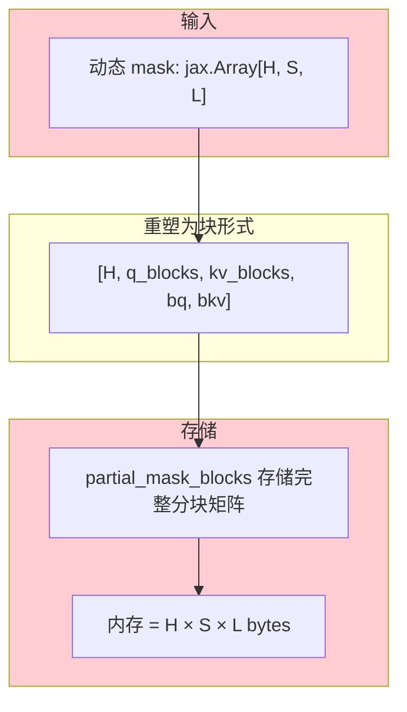

**动态 Mask 内存**：
```
内存 = heads × q_seq × kv_seq × sizeof(bool)
     = heads × seq² bytes  (与传统方法相同)
```

### 4. Segment IDs（独立机制）

Segment IDs 用于 packed sequences，是独立的机制：

```
segment_ids.q  = int32[q_seq_len]   → q_seq × 4 bytes
segment_ids.kv = int32[kv_seq_len]  → kv_seq × 4 bytes
总计 = (q_seq + kv_seq) × 4 bytes ≈ O(seq_len)
```

### 内存对比总结图

以 **16 heads, 8192 tokens, block_size=128** 为例：

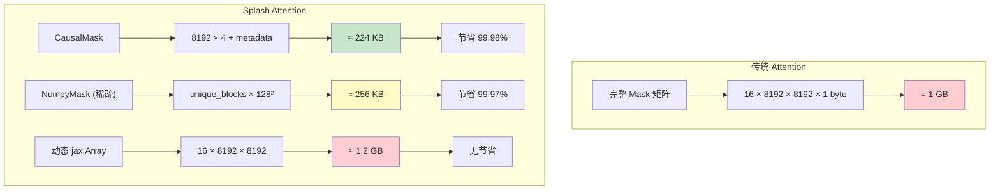

### 🎯 最佳实践建议

| 场景 | 推荐 Mask 类型 | 内存开销 |
|-----|---------------|---------|
| 标准 Decoder | `CausalMask` | O(seq) ✅ |
| 局部注意力 | `LocalMask` | O(seq) ✅ |
| Llama4 风格 | `ChunkedCausalMask` | O(seq) ✅ |
| 全注意力 Encoder | `FullMask` | O(1) ✅ |
| **有 Padding 的变长序列** | **Segment IDs** | **O(seq) ✅** |
| 复杂自定义静态 | `NumpyMask` | O(blocks) ⚠️ |
| 运行时动态 | 避免使用 | O(H×seq²) ❌ |

---

## 💡 重要场景：Padding 序列的处理（36k 长序列示例）

### 场景描述

对于**变长序列 padding 到固定长度**（如 36k）的情况，**推荐使用 Segment IDs 而非完整 Mask 矩阵**。

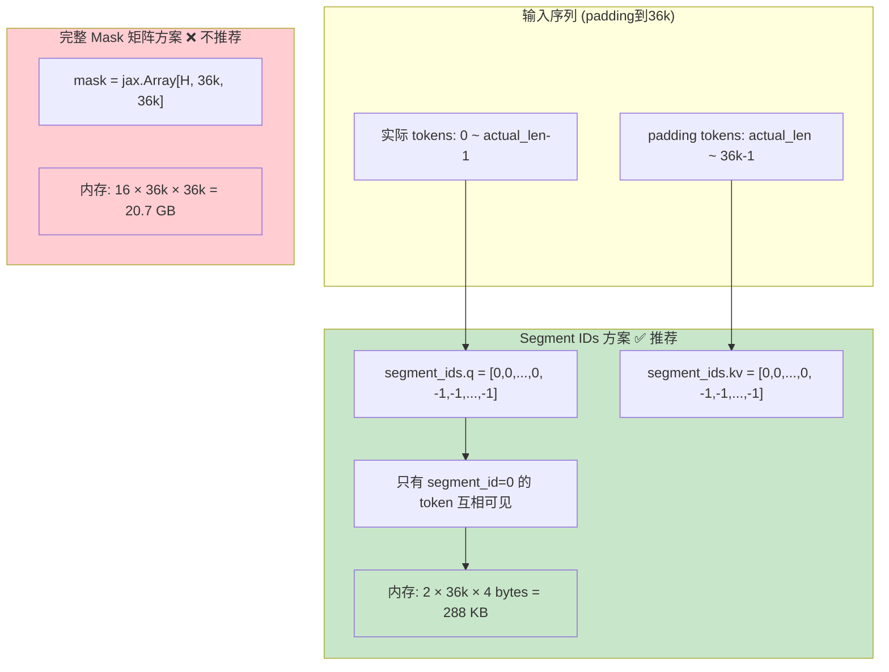

### 内存对比 (36k 序列, 16 heads)

| 方案 | 内存计算 | 内存大小 | 是否推荐 |
|-----|---------|---------|---------|
| 完整 Mask 矩阵 | 16 × 36k × 36k × 1 byte | **20.7 GB** | ❌ 不可行 |
| 动态 jax.Array Mask | 16 × 36k × 36k × 1 byte | **20.7 GB** | ❌ 不可行 |
| **Segment IDs** | 2 × 36k × 4 bytes | **288 KB** | ✅ **推荐** |
| Segment IDs + CausalMask | 3 × 36k × 4 bytes | **432 KB** | ✅ **推荐** |

### 代码示例

```python
import jax.numpy as jnp
from jax.experimental.pallas.ops.tpu.splash_attention import (
    splash_attention_kernel as splash,
    splash_attention_mask as mask_lib,
)

# 假设：实际序列长度 actual_len，padding 到 36k
actual_len = 20000
padded_len = 36 * 1024  # 36k

# ===============================================
# 方案1：全注意力 + Padding Mask（Encoder 场景）
# ===============================================
# 创建 segment_ids：实际 token 为 0，padding 为 -1
segment_ids = splash.SegmentIds(
    q=jnp.where(jnp.arange(padded_len) < actual_len, 0, -1),
    kv=jnp.where(jnp.arange(padded_len) < actual_len, 0, -1),
)

# 使用 FullMask（只存储 shape，不存储任何 mask 数据）
mask = mask_lib.FullMask(shape=(padded_len, padded_len))
multi_head_mask = mask_lib.MultiHeadMask([mask] * num_heads)

kernel = splash.make_splash_mha_single_device(mask=multi_head_mask, ...)
output = kernel(q, k, v, segment_ids=segment_ids)

# ===============================================
# 方案2：Causal + Padding Mask（Decoder 场景）
# ===============================================
# CausalMask 确保只看前面的 token（不存储完整矩阵）
# Segment IDs 确保不 attend 到 padding
causal_mask = mask_lib.CausalMask(shape=(padded_len, padded_len))
multi_head_mask = mask_lib.MultiHeadMask([causal_mask] * num_heads)

kernel = splash.make_splash_mha_single_device(mask=multi_head_mask, ...)
output = kernel(q, k, v, segment_ids=segment_ids)
```

### Segment IDs 工作原理

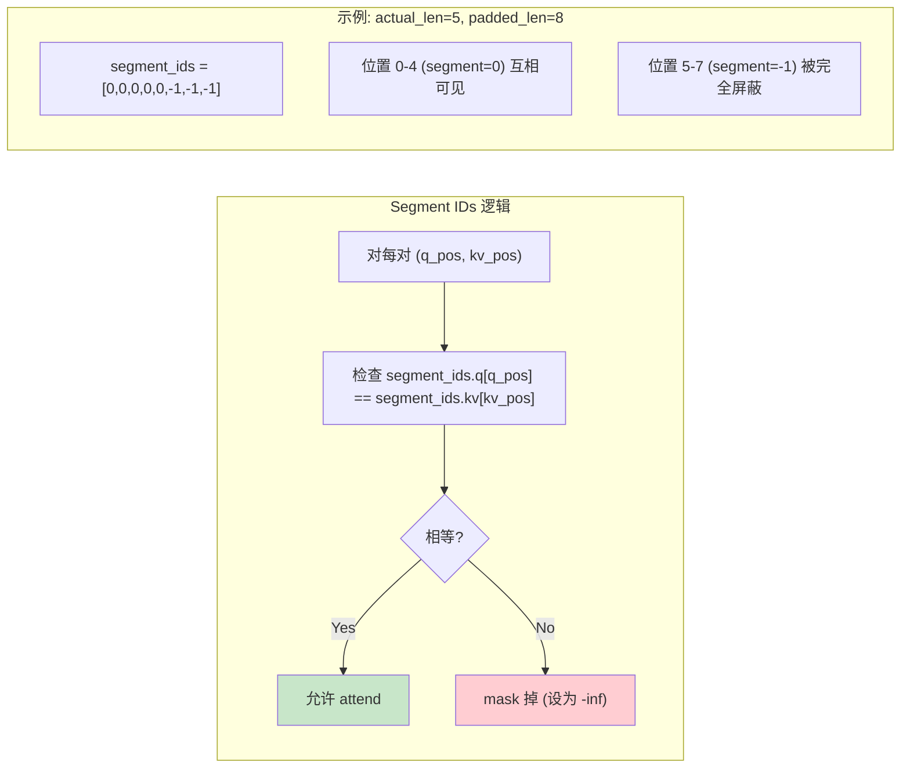

### 与其他 Mask 组合

Segment IDs 会与其他 Mask **做 AND 组合**：

```python
# 最终 mask = CausalMask AND SegmentIdsMask
#
# 例如位置 (3, 5):
#   - CausalMask: 3 >= 5? → False (不可见)
#   - SegmentIds: segment[3]=0, segment[5]=-1 → False (不可见)
#   - 最终: False
#
# 例如位置 (4, 2):
#   - CausalMask: 4 >= 2? → True (可见)
#   - SegmentIds: segment[4]=0, segment[2]=0 → True (可见)
#   - 最终: True
```

### ⚠️ 注意事项

1. **Segment IDs 必须确保每行至少有一个有效 token**
   - 否则 softmax 分母为 0，导致 NaN
   - 纯 padding 行需特殊处理或确保不会被查询

2. **Segment IDs 值的选择**
   - 实际 token 使用 **相同的非负整数**（如 0）
   - padding 使用 **不同的值**（如 -1）
   - 不同的独立序列（batch packing）使用不同的整数

3. **批处理多个序列（Packing）**
   ```python
   # 例如 3 个序列 pack 到一起：
   # seq1: tokens 0-99, seq2: tokens 100-199, seq3: tokens 200-249, padding: 250-255
   segment_ids = splash.SegmentIds(
       q=jnp.array([0]*100 + [1]*100 + [2]*50 + [-1]*6),
       kv=jnp.array([0]*100 + [1]*100 + [2]*50 + [-1]*6),
   )
   # 这样 seq1, seq2, seq3 互相不可见
   ```

---

## 🤔 API 设计讨论：为什么 Padding 处理不够简洁？

### 问题：Padding 是最常见的场景，但 API 不够直观

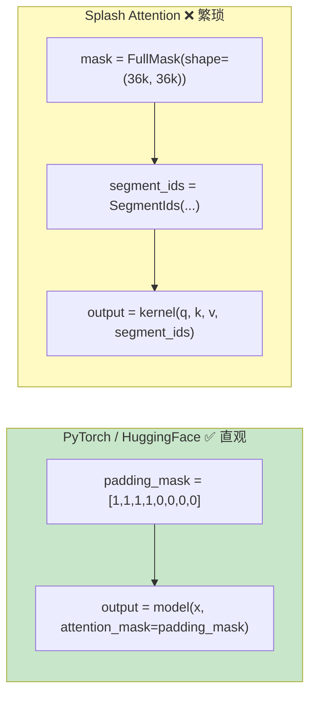

### 为什么必须写 FullMask / CausalMask？

| 问题 | 解释 |
|------|------|
| **API 设计要求** | `make_splash_mha()` 需要 mask 参数来生成 MaskInfo |
| **语义区分** | FullMask = 双向注意力（Encoder），CausalMask = 单向注意力（Decoder） |
| **设计初衷不同** | Splash Attention 主要为**稀疏注意力模式**设计，不是为 padding |

### Segment IDs 的本意

Segment IDs 原本是为 **sequence packing**（多序列拼接）设计的，不是专门为 padding：

```python
# Packing 场景（原始设计目标）
# 多个短序列拼接成一个长序列，避免 padding 浪费
segment_ids = [0,0,0, 1,1,1,1, 2,2]  # 3个序列
# seq1(3 tokens) + seq2(4 tokens) + seq3(2 tokens)

# Padding 场景（副产品用法）
segment_ids = [0,0,0,0,0, -1,-1,-1]  # 1个序列 + padding
```

### 理想的 API（如果重新设计）

```python
# 理想情况 - 直接传 1D padding mask
padding_mask = jnp.array([1,1,1,1,1, 0,0,0])  # 1=valid, 0=padding
output = kernel(q, k, v, padding_mask=padding_mask)

# 或更简单
output = kernel(q, k, v, valid_length=5)

# 或自动推断
output = kernel(q, k, v)  # 自动从 q 的形状推断 mask shape
```

### 实际建议：封装一个便捷函数

既然 API 已经是这样了，可以自己封装简化使用：

```python
def make_padded_attention_kernel(
    padded_len: int,
    actual_len: int,
    num_heads: int,
    causal: bool = False,
    **kwargs
):
    """便捷的 padding-aware attention kernel 工厂函数
    
    Args:
        padded_len: padding 后的序列长度
        actual_len: 实际有效序列长度
        num_heads: 注意力头数
        causal: 是否使用因果注意力
        **kwargs: 传递给 make_splash_mha_single_device 的其他参数
    
    Returns:
        一个简化的 attention 函数，只需传入 q, k, v
    """
    from jax.experimental.pallas.ops.tpu.splash_attention import (
        splash_attention_kernel as splash,
        splash_attention_mask as mask_lib,
    )
    
    # 选择 mask 类型
    if causal:
        mask = mask_lib.CausalMask(shape=(padded_len, padded_len))
    else:
        mask = mask_lib.FullMask(shape=(padded_len, padded_len))
    
    multi_head_mask = mask_lib.MultiHeadMask([mask] * num_heads)
    kernel = splash.make_splash_mha_single_device(mask=multi_head_mask, **kwargs)
    
    # 创建 segment_ids
    segment_ids = splash.SegmentIds(
        q=jnp.where(jnp.arange(padded_len) < actual_len, 0, -1),
        kv=jnp.where(jnp.arange(padded_len) < actual_len, 0, -1),
    )
    
    # 返回一个简化的调用接口
    def call(q, k, v):
        return kernel(q, k, v, segment_ids=segment_ids)
    
    return call


# 使用示例 - 简洁多了！
attention = make_padded_attention_kernel(
    padded_len=36*1024,
    actual_len=20000,
    num_heads=16,
    causal=True
)
output = attention(q, k, v)
```

### 总结

| 观点 | 说明 |
|------|------|
| **用户体验** | Padding 是最常见场景，但 API 确实不够直观 |
| **设计权衡** | Splash Attention 优先考虑稀疏注意力灵活性，牺牲了易用性 |
| **实际解决** | 自行封装便捷函数，或向 JAX 团队提 feature request |
| **正面看法** | 一旦理解 FullMask + Segment IDs 的组合，使用也不算太复杂 |

---

### 稀疏性优化：Grid Shrinking

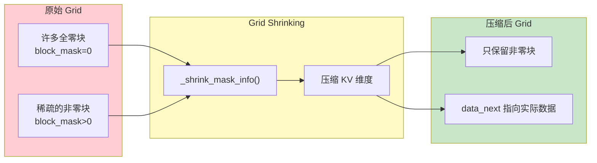

---

## 前向传播实现

### 核心算法流程

[`flash_attention_kernel`](splash_attention_kernel.py:702) 实现了在线 softmax 算法：

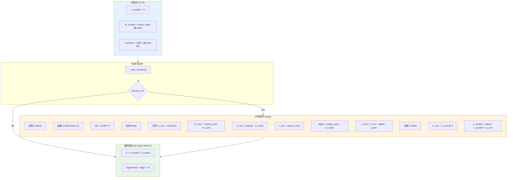

### Mask 应用逻辑

[`_apply_mask_and_soft_cap`](splash_attention_kernel.py:603) 函数处理多种 mask 组合：

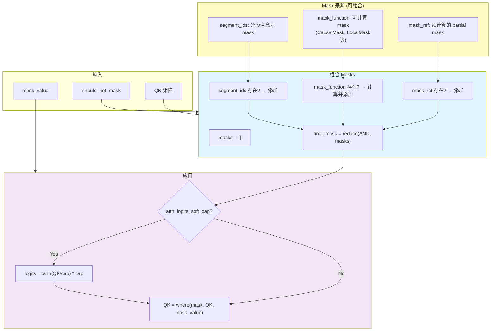

---

## 反向传播实现

### 反向传播策略

Splash Attention 支持两种反向传播策略：

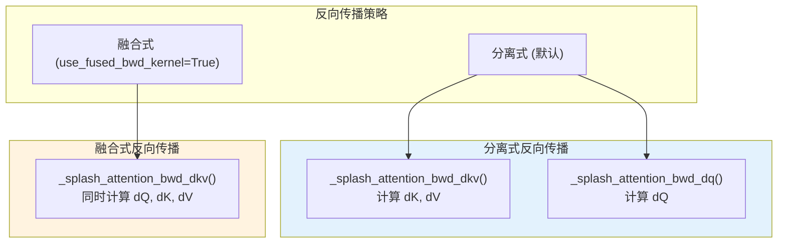

### dKV Kernel 流程

[`_flash_attention_dkv_kernel`](splash_attention_kernel.py:1673) 的计算流程：

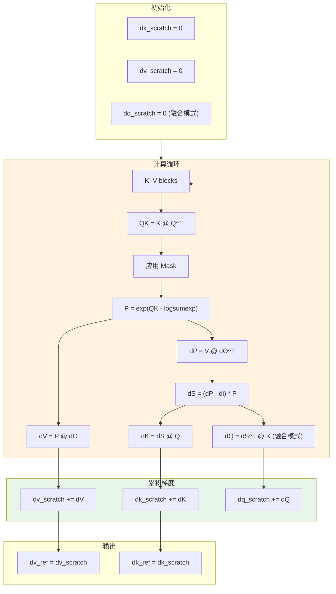

### dQ Kernel 流程

[`_flash_attention_dq_kernel`](splash_attention_kernel.py:1312) 的计算流程：

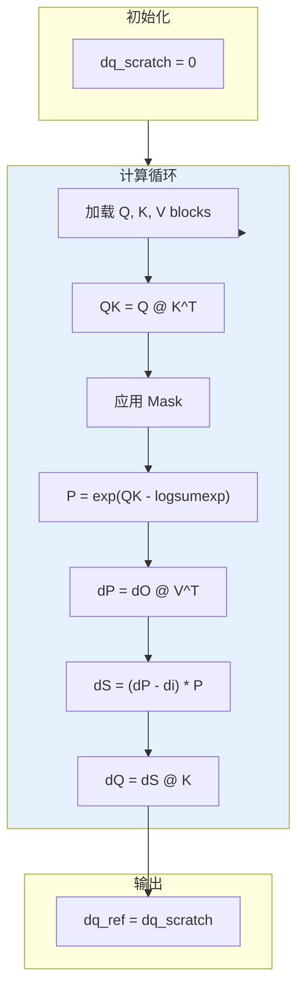

---

## 内存优化策略

### TPU 内存层级利用

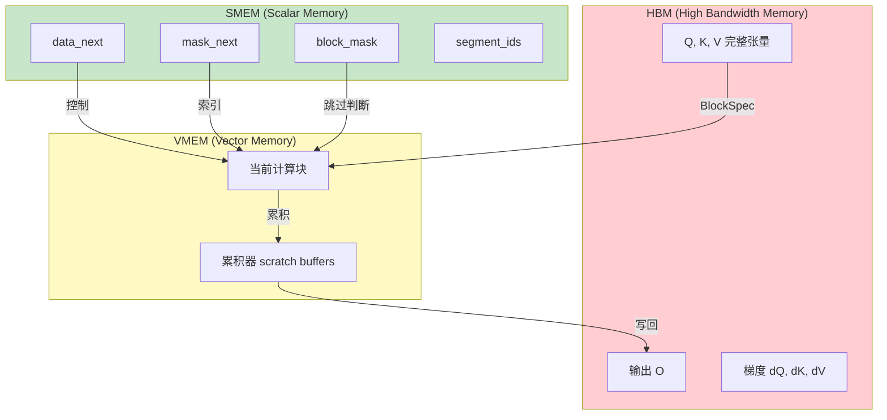

### 数据类型优化

MaskInfo 中的数组会自动降级到最小所需类型：

```python
def _downcast_to_small_type(array: np.ndarray) -> np.ndarray:
    max_value = np.max(array)
    if max_value <= np.iinfo(np.int8).max:
        return array.astype(np.int8)
    elif max_value <= np.iinfo(np.int16).max:
        return array.astype(np.int16)
    else:
        return array.astype(np.int32)
```

---

## API 使用示例

### 基本使用

```python
from jax.experimental.pallas.ops.tpu.splash_attention import (
    splash_attention_kernel as splash,
    splash_attention_mask as mask_lib,
)

# 创建 Causal Mask
mask = mask_lib.CausalMask(shape=(seq_len, seq_len))
multi_head_mask = mask_lib.MultiHeadMask([mask] * num_heads)

# 配置块大小
block_sizes = splash.BlockSizes(
    block_q=128,
    block_kv=128,
    block_kv_compute=128,
    block_q_dkv=128,
    block_kv_dkv=128,
    block_kv_dkv_compute=128,
    block_q_dq=128,
    block_kv_dq=128,
)

# 创建 kernel
kernel = splash.make_splash_mha_single_device(
    mask=multi_head_mask,
    block_sizes=block_sizes,
)

# 执行注意力计算
output = kernel(q, k, v)
```

### 使用 Local Attention

```python
# Local attention 只关注前后 window_size 个 token
local_mask = mask_lib.LocalMask(
    shape=(seq_len, seq_len),
    window_size=(256, 256),  # (左侧窗口, 右侧窗口)
    offset=0,
)

# 组合 causal 和 local
combined_mask = causal_mask & local_mask
```

### 使用 Segment IDs

```python
# 用于处理 packed sequences
segment_ids = splash.SegmentIds(
    q=jnp.array([0, 0, 0, 1, 1, 1, 2, 2]),   # Q 序列的段 ID
    kv=jnp.array([0, 0, 0, 1, 1, 1, 2, 2]),  # KV 序列的段 ID
)

output = kernel(q, k, v, segment_ids=segment_ids)
```

### 分布式使用

```python
# 多设备分片
kernel = splash.make_splash_mha(
    mask=multi_head_mask,
    block_sizes=block_sizes,
    head_shards=num_devices_per_head_dim,
    q_seq_shards=num_devices_per_seq_dim,
)

# 获取分片规范
sharding_spec = kernel.manual_sharding_spec(named_sharding)
```

---

## 关键常量

| 常量 | 值 | 说明 |
|-----|-----|------|
| `NUM_LANES` | 128 | TPU 向量宽度 |
| `NUM_SUBLANES` | 8 | TPU 子通道数 |
| `DEFAULT_MASK_VALUE` | -0.7 * float32_max | 默认 mask 值 |

---

## 总结

Splash Attention 通过以下机制实现高效的长序列注意力计算：

1. **Block-level 稀疏性**：通过 `block_mask` 跳过全零块
2. **在线 Softmax**：避免材化完整的注意力矩阵
3. **可计算 Mask**：使用 `mask_function` 而非存储完整 mask
4. **Grid Shrinking**：压缩稀疏的计算网格
5. **数据类型优化**：自动降级 SMEM 数据类型
6. **分布式支持**：支持 head 和 sequence 维度的分片

这使得 Splash Attention 成为 TPU 上处理长序列任务的首选注意力实现。