# DeepCache 原理详解：从 GPU 到 TPU 的实现之路

本文档系统性地讲解 DeepCache 的原理、设计理念，以及如何在 TPU/torchax 环境下从零实现。

---

## 📚 目录

1. [DeepCache 是什么](#1-deepcache-是什么)
2. [原理与设计理念](#2-原理与设计理念)
3. [GPU 版本实现分析](#3-gpu-版本实现分析)
4. [依赖库分析](#4-依赖库分析)
5. [为什么不能直接用](#5-为什么不能直接用)
6. [TPU 版本实现](#6-tpu-版本实现)
7. [性能对比](#7-性能对比)

---

## 1. DeepCache 是什么

### 1.1 背景问题

Diffusion 模型推理需要多次迭代（通常 20-50 步），每步都要完整执行 Transformer 前向传播，计算量巨大。

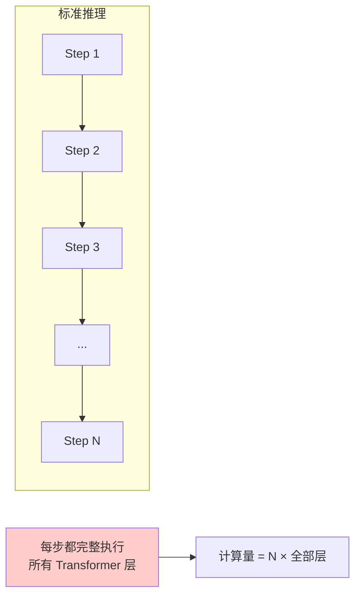

### 1.2 核心观察

DeepCache 论文发现：**相邻去噪步骤的高层特征变化很小**。

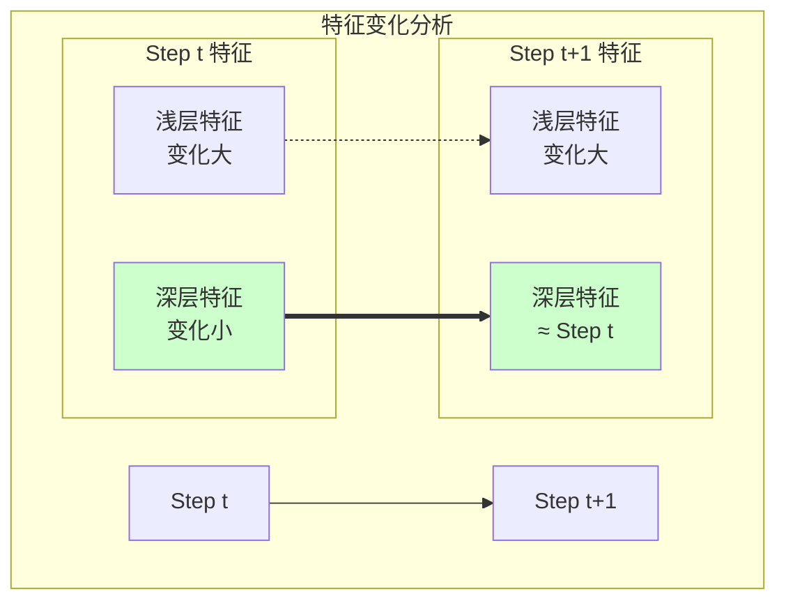

### 1.3 DeepCache 思想

既然深层特征变化小，可以**缓存并复用**，只计算浅层：

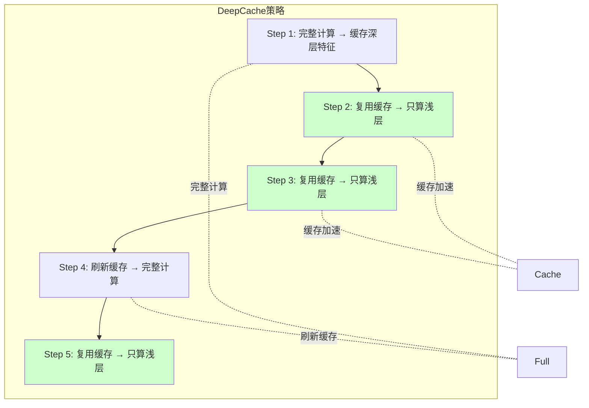

---

## 2. 原理与设计理念

### 2.1 HunyuanVideo Transformer 结构

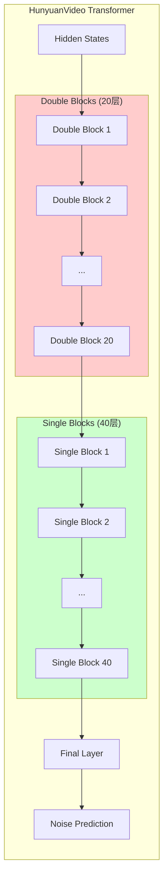

### 2.2 缓存策略

**缓存点选择**：Double Blocks 之后、Single Blocks 之前

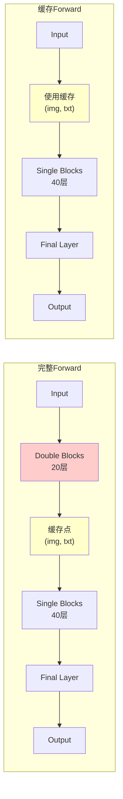

### 2.3 理论加速比

| 路径 | 计算层数 | 占比 |
|------|----------|------|
| 完整 Forward | 20 + 40 + 1 = 61 | 100% |
| 缓存 Forward | 0 + 40 + 1 = 41 | 67% |

**理论加速比**：61/41 ≈ **1.49x**

### 2.4 缓存刷新策略

不能永远使用旧缓存，需要周期性刷新：

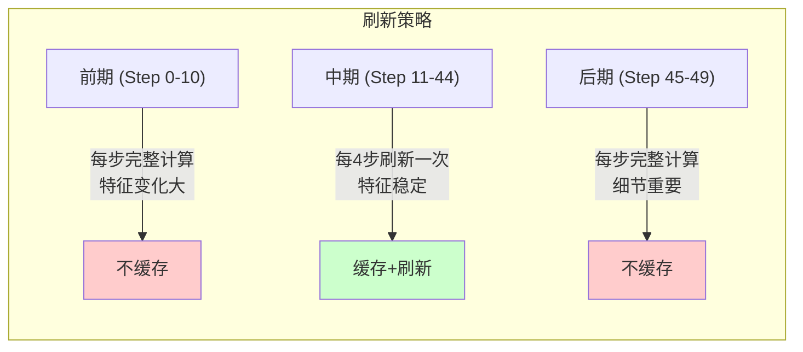

**参数配置**：
- `cache_start_step = 11`：开始缓存的步数
- `cache_end_step = 45`：停止缓存的步数
- `cache_step_interval = 4`：刷新间隔

---

## 3. GPU 版本实现分析

### 3.1 典型 GPU DeepCache 架构

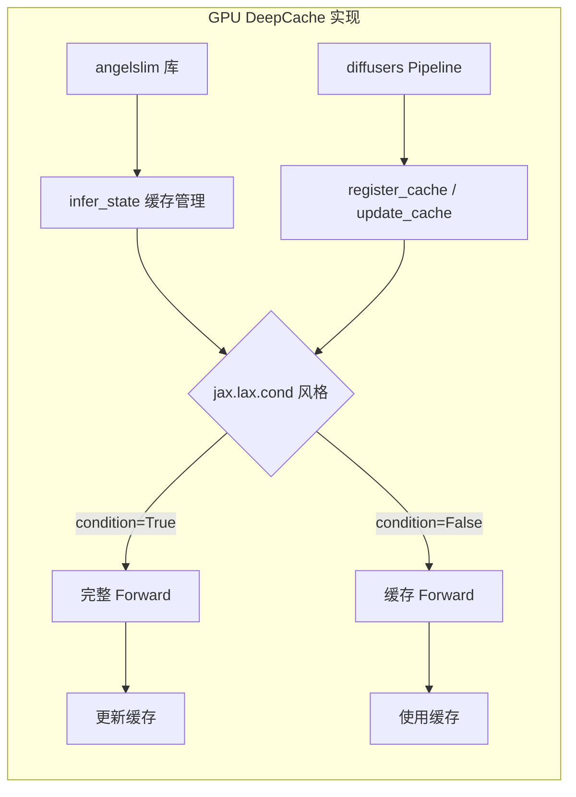

### 3.2 核心数据结构

```python
# GPU 版本的 infer_state
class InferState:
    def __init__(self):
        self.cached_features = {}      # 层缓存
        self.step_index = 0            # 当前步数
        self.no_cache_steps = set()    # 不使用缓存的步
        
    def should_cache(self, step):
        return step not in self.no_cache_steps
    
    def get_cache(self, layer_name):
        return self.cached_features.get(layer_name)
    
    def set_cache(self, layer_name, features):
        self.cached_features[layer_name] = features
```

### 3.3 Transformer 层内的条件分支

```python
# GPU 版本在层内做条件分支
class DoubleBlock(nn.Module):
    def forward(self, x, infer_state=None):
        if infer_state and infer_state.should_use_cache(self.layer_idx):
            # 使用缓存，跳过计算
            return infer_state.get_cache(self.layer_idx)
        else:
            # 正常计算
            output = self._forward_impl(x)
            if infer_state:
                infer_state.set_cache(self.layer_idx, output)
            return output
```

---

## 4. 依赖库分析

### 4.1 angelslim 库

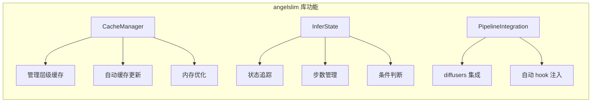

**核心功能**：
- 自动管理多层缓存的生命周期
- 与 diffusers Pipeline 深度集成
- 提供简洁的 API

### 4.2 依赖的 PyTorch 特性

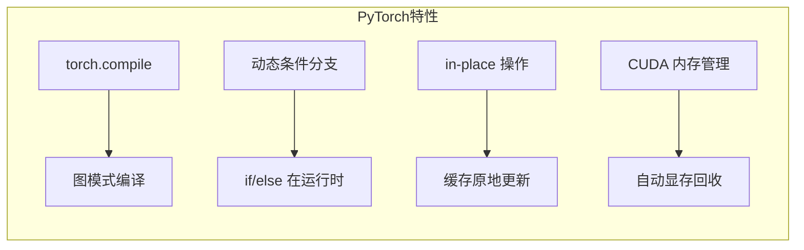

---

## 5. 为什么不能直接用

### 5.1 torchax 限制

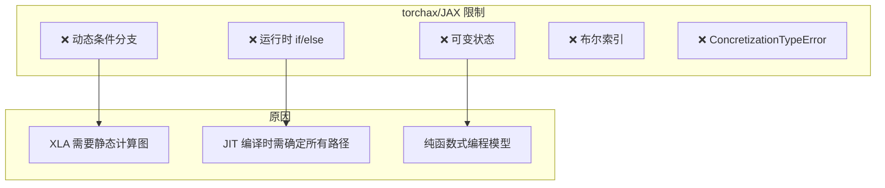

### 5.2 jax.lax.cond 的问题

GPU 版本使用类似 `jax.lax.cond` 的模式，但在 torchax 中：

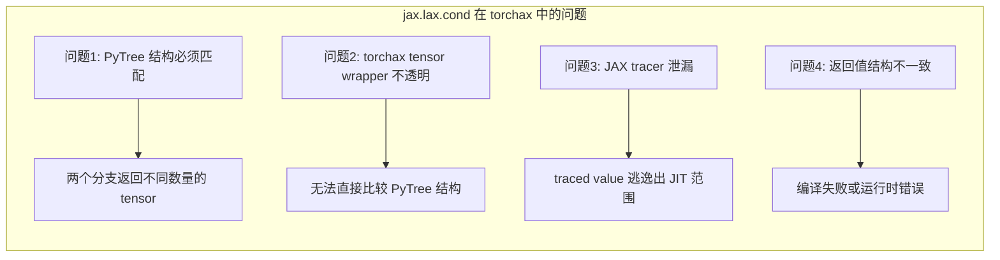

### 5.3 失败的尝试

```python
# ❌ 尝试1：直接在 JIT 内做条件分支
def forward(self, x, use_cache):
    if use_cache:  # ConcretizationTypeError!
        return self.cached_output
    else:
        return self._compute(x)

# ❌ 尝试2：jax.lax.cond 封装
def forward(self, x, use_cache):
    return jax.lax.cond(
        use_cache,
        lambda: (self.cached_output, None, None),  # 结构不匹配
        lambda: self._compute_with_cache(x),        # 返回 3 个值
    )
```

### 5.4 Tracer 泄漏问题

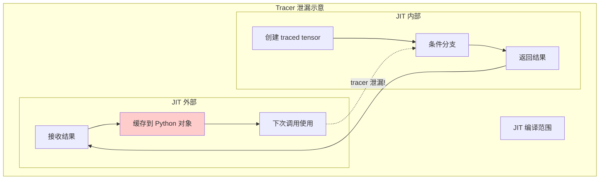

当把 JIT 内部的 traced tensor 保存到外部 Python 对象（如 cache），再在下次 JIT 调用时使用，会导致 tracer 泄漏错误。

---

## 6. TPU 版本实现

### 6.1 解决方案：分离模块

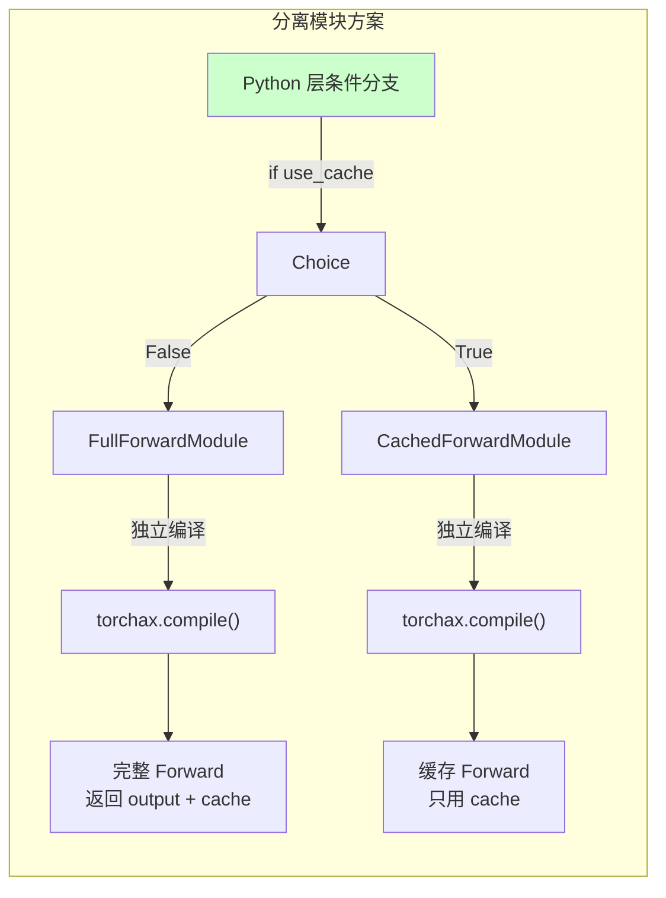

### 6.2 FullForwardModule 实现

```python
class FullForwardModule(torch.nn.Module):
    """封装完整 transformer forward"""
    
    def __init__(self, transformer, mask_type, extra_kwargs):
        super().__init__()
        self.transformer = transformer
        self.mask_type = mask_type
        self.extra_kwargs = extra_kwargs
    
    def forward(self, hidden_states, timestep, text_states, ...):
        transformer = self.transformer
        
        # === 输入处理 ===
        img = transformer.img_in(hidden_states)
        vec = transformer.time_in(timestep)
        txt = transformer.txt_in(text_states)
        
        # === Double Blocks ===
        for block in transformer.double_blocks:
            img, txt = block(img=img, txt=txt, vec=vec, ...)
        
        # 🔑 缓存点：保存中间状态
        img_after_double = img
        txt_after_double = txt
        
        # === Single Blocks ===
        x = torch.cat((img, txt), 1)
        for block in transformer.single_blocks:
            x = block(x=x, vec=vec, ...)
        
        # === Final Layer ===
        img = x[:, :img_seq_len, ...]
        output = transformer.final_layer(img, vec)
        
        # 返回 output + 缓存数据
        return (output, img_after_double, txt_after_double, vec, text_mask)
```

### 6.3 CachedForwardModule 实现

```python
class CachedForwardModule(torch.nn.Module):
    """封装使用缓存的 forward，跳过 double_blocks"""
    
    def __init__(self, transformer):
        super().__init__()
        self.transformer = transformer
    
    def forward(self, cached_img, cached_txt, vec, freqs_cos, freqs_sin, text_mask):
        transformer = self.transformer
        
        # 🔑 直接使用缓存，跳过 double_blocks
        img = cached_img
        txt = cached_txt
        
        # === Single Blocks ===
        x = torch.cat((img, txt), 1)
        for block in transformer.single_blocks:
            x = block(x=x, vec=vec, ...)
        
        # === Final Layer ===
        img = x[:, :img_seq_len, ...]
        output = transformer.final_layer(img, vec)
        
        return output
```

### 6.4 TPUDeepCache 缓存管理

```python
class TPUDeepCache:
    """TPU 友好的缓存管理器"""
    
    def __init__(self, cache_start_step, cache_end_step, cache_step_interval, total_steps):
        # 计算需要完整计算的步骤
        self.no_cache_steps = set(
            list(range(0, cache_start_step)) +                        # 前期
            list(range(cache_start_step, cache_end_step, cache_step_interval)) +  # 刷新点
            list(range(cache_end_step, total_steps))                  # 后期
        )
        
        # 缓存存储
        self.cached_img = None
        self.cached_txt = None
        self._cached_vec = None
        self._cached_text_mask = None
    
    def should_use_cache(self, step):
        """判断是否应该使用缓存"""
        return step not in self.no_cache_steps and self.cached_img is not None
    
    def update_cache(self, img, txt, vec, text_mask):
        """更新缓存"""
        self.cached_img = img
        self.cached_txt = txt
        self._cached_vec = vec
        self._cached_text_mask = text_mask
    
    def get_cache(self):
        """获取缓存"""
        return self.cached_img, self.cached_txt, self._cached_vec, self._cached_text_mask
```

### 6.5 推理循环集成

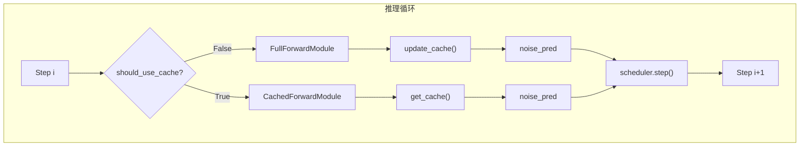

```python
# 推理循环
for i in range(num_steps):
    if deep_cache.should_use_cache(i):
        # 🚀 使用缓存路径
        cached_img, cached_txt, vec, text_mask = deep_cache.get_cache()
        noise_pred = cached_forward_fn(
            cached_img, cached_txt, vec,
            transformer._cached_freqs_cos,
            transformer._cached_freqs_sin,
            text_mask,
        )
    else:
        # 📦 完整 forward + 更新缓存
        output = full_forward_fn(latent_model_input, timestep, ...)
        noise_pred, img_cache, txt_cache, vec, text_mask = output
        deep_cache.update_cache(img_cache, txt_cache, vec, text_mask)
    
    # Scheduler step
    latents = scheduler.step(noise_pred, t, latents)[0]
```

### 6.6 关键设计决策

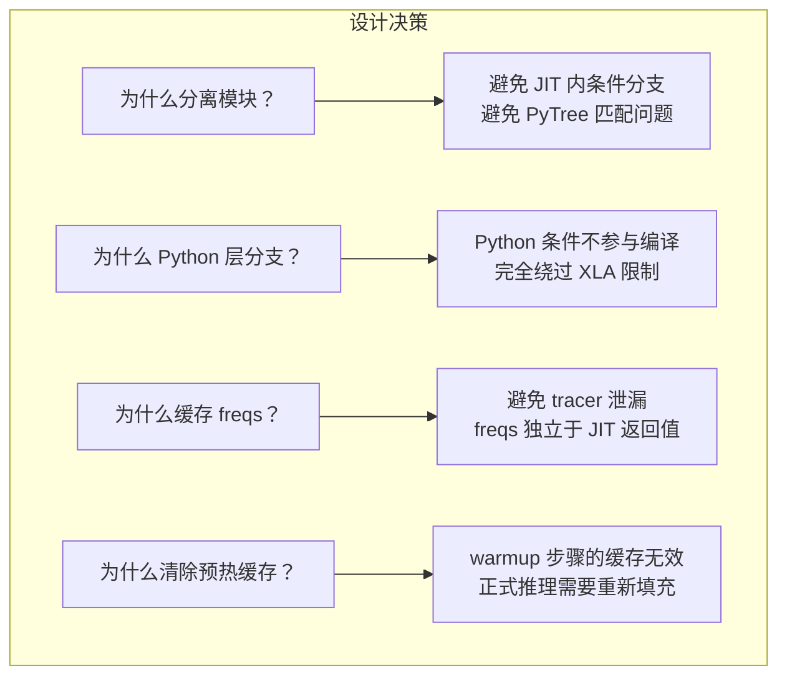

---

## 7. 性能对比

### 7.1 测试结果

| 配置 | 无 DeepCache | 有 DeepCache | 加速比 |
|------|-------------|-------------|--------|
| 121帧, 50步 | ~350s | ~203s | **1.72x** |
| 每步时间 | ~7.0s | ~4.1s (avg) | - |
| Cache Hit | 0 | 25 (50%) | - |

### 7.2 时间分布

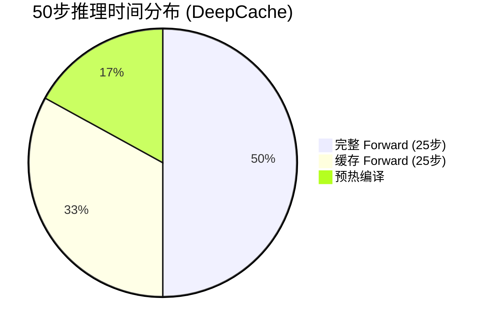

### 7.3 超越理论加速比

实测加速 1.72x > 理论 1.49x，可能原因：
- 缓存 Forward 避免了部分 XLA 编译开销
- 内存访问模式更友好
- TPU 矩阵运算效率差异

### 7.4 使用方法

```bash
python stage2_transformer_flax_experimental_deepcache.py \
    --enable_cache \
    --cache_start_step 11 \
    --cache_end_step 45 \
    --cache_step_interval 4 \
    --video_length 121 \
    --num_inference_steps 50
```

---

## 📋 总结

### 关键差异对比

| 方面 | GPU 版本 | TPU 版本 |
|------|----------|----------|
| 条件分支 | JIT 内 if/else | Python 层 if/else |
| 模块结构 | 单一模块 + 状态 | 两个独立模块 |
| 缓存管理 | angelslim 库 | 自定义 TPUDeepCache |
| 编译 | torch.compile | torchax.compile × 2 |
| 状态传递 | infer_state 对象 | 显式参数传递 |

### 核心经验

1. **不要在 JIT 内做条件分支** - torchax/XLA 不支持
2. **分离编译是关键** - 两个模块独立编译，避免 PyTree 问题
3. **Python 层控制流** - 条件判断放在编译范围外
4. **显式状态管理** - 不依赖可变状态，使用函数参数传递
5. **预计算常量** - freqs 等在 JIT 外预计算并缓存

---

## 📚 参考资料

- [DeepCache 论文](https://arxiv.org/abs/2312.00858)
- [angelslim GitHub](https://github.com/horseee/DeepCache)
- [HunyuanVideo-1.5](https://github.com/Tencent/HunyuanVideo)
- [JAX JIT 文档](https://jax.readthedocs.io/en/latest/jax-101/02-jitting.html)