# DeepCache 原理详解：从 GPU 到 TPU 的实现之路

本文档系统性地讲解 DeepCache 的原理、设计理念，以及如何在 TPU/torchax 环境下从零实现。

---

## 📚 目录

1. [DeepCache 是什么](#1-deepcache-是什么)
2. [原理与设计理念](#2-原理与设计理念)
3. [GPU 版本实现分析](#3-gpu-版本实现分析)
4. [依赖库分析](#4-依赖库分析)
5. [为什么不能直接用](#5-为什么不能直接用)
6. [TPU 版本实现](#6-tpu-版本实现)
7. [性能对比](#7-性能对比)

---

## 1. DeepCache 是什么

### 1.1 背景问题

Diffusion 模型推理需要多次迭代（通常 20-50 步），每步都要完整执行 Transformer 前向传播，计算量巨大。

```mermaid
flowchart LR
    subgraph 标准推理
        A[Step 1] --> B[Step 2]
        B --> C[Step 3]
        C --> D[...]
        D --> E[Step N]
    end
    
    F[每步都完整执行<br/>所有 Transformer 层] --> G[计算量 = N × 全部层]
    
    style F fill:#ffcccc
```

### 1.2 核心观察

DeepCache 论文发现：**相邻去噪步骤的高层特征变化很小**。

```mermaid
flowchart TB
    subgraph 特征变化分析
        direction LR
        A["Step t"] --> B["Step t+1"]
        
        subgraph StepT["Step t 特征"]
            T1[浅层特征<br/>变化大]
            T2[深层特征<br/>变化小]
        end
        
        subgraph StepT1["Step t+1 特征"]
            T3[浅层特征<br/>变化大]
            T4[深层特征<br/>≈ Step t]
        end
        
        T1 -.-> T3
        T2 ==> T4
    end
    
    style T2 fill:#ccffcc
    style T4 fill:#ccffcc
```

### 1.3 DeepCache 思想

既然深层特征变化小，可以**缓存并复用**，只计算浅层：

```mermaid
flowchart TB
    subgraph DeepCache策略
        direction TB
        
        S1["Step 1: 完整计算 → 缓存深层特征"]
        S2["Step 2: 复用缓存 → 只算浅层"]
        S3["Step 3: 复用缓存 → 只算浅层"]
        S4["Step 4: 刷新缓存 → 完整计算"]
        S5["Step 5: 复用缓存 → 只算浅层"]
        
        S1 --> S2 --> S3 --> S4 --> S5
    end
    
    S1 -.- |"完整计算"| Full
    S2 -.- |"缓存加速"| Cache
    S3 -.- |"缓存加速"| Cache
    S4 -.- |"刷新缓存"| Full
    
    style S2 fill:#ccffcc
    style S3 fill:#ccffcc
    style S5 fill:#ccffcc
```

---

## 2. 原理与设计理念

### 2.1 HunyuanVideo-1.5 720p_t2v Transformer 结构

> ⚠️ **重要**：HunyuanVideo-1.5 720p_t2v 的实际架构如下。

```mermaid
flowchart TB
    subgraph HunyuanVideo["HunyuanVideo-1.5 720p_t2v Transformer"]
        direction TB
        
        Input[Hidden States] --> DB1
        
        subgraph DoubleBlocks["Double Blocks (54层)"]
            DB1[Double Block 1] --> DB2[Double Block 2]
            DB2 --> DB3[...]
            DB3 --> DB54[Double Block 54]
        end
        
        DB54 --> FL[Final Layer]
        FL --> Output[Noise Prediction]
    end
    
    style DoubleBlocks fill:#ffcccc
```



**实际层数统计**：
- **double_blocks**: 54 层
- **single_blocks**: 0 层
- **final_layer**: 1 层
- **总计**: 55 层

### 2.2 Double Block vs Single Block

**Double Block（MMDoubleStreamBlock）**：
- 处理两个分离的流：img（视频特征）和 txt（文本特征）
- 每个流有独立的 Attention 和 MLP
- 两个流之间通过 Cross-Attention 交互
- 输入: (img, txt)，输出: (img, txt)

**Single Block（MMSingleStreamBlock）**：
- 将 img 和 txt 合并为单一序列 x = concat(img, txt)
- 统一处理后再分离
- 更轻量，适合后期处理
- 720p_t2v 配置中不使用

### 2.3 缓存策略

**缓存点选择**：Block 52 之后、Block 53 之前

> ⚠️ **重要**：DeepCache 的正确设计是跳过 block 0-52（共 53 层），但必须计算最后一个 block 53。
> 这是因为最后一个 block 对细节生成非常关键，不能完全跳过。

```mermaid
flowchart LR
    subgraph 完整Forward
        A[Input] --> B1[Block 0-52<br/>53层]
        B1 --> C["缓存点<br/>(img, txt)"]
        C --> B2[Block 53<br/>1层]
        B2 --> E[Final Layer]
        E --> F[Output]
    end
    
    subgraph 缓存Forward
        A2[Input] --> C2["使用缓存<br/>(img, txt)"]
        C2 --> B3[Block 53<br/>1层]
        B3 --> E2[Final Layer]
        E2 --> F2[Output]
    end
    
    style B1 fill:#ffcccc
    style C fill:#ffffcc
    style C2 fill:#ffffcc
    style B2 fill:#ccffcc
    style B3 fill:#ccffcc
```

### 2.4 理论加速比

| 路径 | 计算层数 | 占比 |
|------|----------|------|
| 完整 Forward | 54 + 1 = 55 | 100% |
| 缓存 Forward | 1 + 1 = 2 | 3.6% |

**理论加速比**：当 cache hit 率为 50% 时：
- 完整步骤：25 × 55 = 1375 层
- 缓存步骤：25 × 2 = 50 层
- 总计：1425 层 vs 2750 层
- **理论加速比**：2750/1425 ≈ **1.93x**

### 2.5 缓存工作流程详解

以下是 DeepCache 的详细工作流程，以 `cache_step_interval = 4` 为例：

```
┌─────────────────────────────────────────────────────────────────────────────┐
│                        DeepCache 缓存工作流程                                 │
├─────────────────────────────────────────────────────────────────────────────┤
│                                                                             │
│  Step 11 (cache_start_step):                                                │
│  ┌──────────────────────────────────────────────────────────────────┐       │
│  │ Block 0 → Block 1 → ... → Block 52 → [保存缓存] → Block 53 → FL  │       │
│  └──────────────────────────────────────────────────────────────────┘       │
│                                    ↓                                        │
│                              缓存 = (img, txt)  ← Block 52 的输出            │
│                                                                             │
│  Step 12 (cache hit):                                                       │
│  ┌──────────────────────────────────────────────────────────────────┐       │
│  │ [读取缓存] ──────────────────────────────→ Block 53 → Final Layer │       │
│  └──────────────────────────────────────────────────────────────────┘       │
│                                                                             │
│  Step 13 (cache hit):                                                       │
│  ┌──────────────────────────────────────────────────────────────────┐       │
│  │ [读取缓存] ──────────────────────────────→ Block 53 → Final Layer │       │
│  └──────────────────────────────────────────────────────────────────┘       │
│                                                                             │
│  Step 14 (cache hit):                                                       │
│  ┌──────────────────────────────────────────────────────────────────┐       │
│  │ [读取缓存] ──────────────────────────────→ Block 53 → Final Layer │       │
│  └──────────────────────────────────────────────────────────────────┘       │
│                                                                             │
│  Step 15 (cache refresh = cache_start_step + interval):                     │
│  ┌──────────────────────────────────────────────────────────────────┐       │
│  │ Block 0 → Block 1 → ... → Block 52 → [刷新缓存] → Block 53 → FL  │       │
│  └──────────────────────────────────────────────────────────────────┘       │
│                                    ↓                                        │
│                              缓存 = (img, txt)  ← 新的 Block 52 输出         │
│                                                                             │
│  Step 16-17-18 (cache hit): 使用 Step 15 的缓存...                          │
│                                                                             │
│  ... 循环直到 cache_end_step ...                                            │
│                                                                             │
└─────────────────────────────────────────────────────────────────────────────┘
```

**关键理解**：
1. **缓存内容**：Block 52 的输出 `(img, txt)`，这是进入最后一个 block 之前的状态
2. **缓存 forward 执行什么**：Block 53 + Single Blocks（如果有）+ Final Layer
3. **为什么保留 Block 53**：最后一个 block 对输出质量至关重要，它负责整合所有信息
4. **1:3 模式**：默认 `interval=4` 意味着每 4 步刷新一次，即 1 次完整计算 + 3 次缓存计算

```mermaid
sequenceDiagram
    participant Step11 as Step 11
    participant Step12 as Step 12
    participant Step13 as Step 13
    participant Step14 as Step 14
    participant Step15 as Step 15
    
    Note over Step11: 完整计算 54 层
    Step11->>Step11: Block 0-52
    Step11->>Step11: 保存缓存
    Step11->>Step11: Block 53 + FL
    
    Note over Step12,Step14: 缓存计算 2 层
    Step12->>Step12: 使用缓存
    Step12->>Step12: Block 53 + FL
    
    Step13->>Step13: 使用缓存
    Step13->>Step13: Block 53 + FL
    
    Step14->>Step14: 使用缓存
    Step14->>Step14: Block 53 + FL
    
    Note over Step15: 刷新缓存 54 层
    Step15->>Step15: Block 0-52
    Step15->>Step15: 刷新缓存
    Step15->>Step15: Block 53 + FL
```



### 2.6 缓存刷新策略

不能永远使用旧缓存，需要周期性刷新：

```mermaid
flowchart LR
    subgraph 刷新策略
        direction TB
        
        P1["前期 (Step 0-10)"]
        P2["中期 (Step 11-44)"]
        P3["后期 (Step 45-49)"]
        
        P1 --> |"每步完整计算<br/>特征变化大"| N1[不缓存]
        P2 --> |"每4步刷新一次<br/>特征稳定"| N2[缓存+刷新]
        P3 --> |"每步完整计算<br/>细节重要"| N3[不缓存]
    end
    
    style N1 fill:#ffcccc
    style N2 fill:#ccffcc
    style N3 fill:#ffcccc
```

**参数配置**：
- `cache_start_step = 11`：开始缓存的步数
- `cache_end_step = 45`：停止缓存的步数
- `cache_step_interval = 4`：刷新间隔

---

## 3. GPU 版本实现分析

### 3.1 典型 GPU DeepCache 架构

```mermaid
flowchart TB
    subgraph GPU_DeepCache["GPU DeepCache 实现"]
        direction TB
        
        A[angelslim 库] --> B[infer_state 缓存管理]
        C[diffusers Pipeline] --> D[register_cache / update_cache]
        
        B --> E{jax.lax.cond 风格}
        D --> E
        
        E --> |"condition=True"| F[完整 Forward]
        E --> |"condition=False"| G[缓存 Forward]
        
        F --> H[更新缓存]
        G --> I[使用缓存]
    end
```



### 3.2 核心数据结构

```python
# GPU 版本的 infer_state
class InferState:
    def __init__(self):
        self.cached_features = {}      # 层缓存
        self.step_index = 0            # 当前步数
        self.no_cache_steps = set()    # 不使用缓存的步
        
    def should_cache(self, step):
        return step not in self.no_cache_steps
    
    def get_cache(self, layer_name):
        return self.cached_features.get(layer_name)
    
    def set_cache(self, layer_name, features):
        self.cached_features[layer_name] = features
```

### 3.3 Transformer 层内的条件分支

```python
# GPU 版本在层内做条件分支
class DoubleBlock(nn.Module):
    def forward(self, x, infer_state=None):
        if infer_state and infer_state.should_use_cache(self.layer_idx):
            # 使用缓存，跳过计算
            return infer_state.get_cache(self.layer_idx)
        else:
            # 正常计算
            output = self._forward_impl(x)
            if infer_state:
                infer_state.set_cache(self.layer_idx, output)
            return output
```

---

## 4. 依赖库分析

### 4.1 angelslim 库

```mermaid
flowchart TB
    subgraph angelslim["angelslim 库功能"]
        direction TB
        
        A1[CacheManager] --> A2[管理层级缓存]
        A1 --> A3[自动缓存更新]
        A1 --> A4[内存优化]
        
        B1[InferState] --> B2[状态追踪]
        B1 --> B3[步数管理]
        B1 --> B4[条件判断]
        
        C1[PipelineIntegration] --> C2[diffusers 集成]
        C1 --> C3[自动 hook 注入]
    end
```



**核心功能**：
- 自动管理多层缓存的生命周期
- 与 diffusers Pipeline 深度集成
- 提供简洁的 API

### 4.2 依赖的 PyTorch 特性

```mermaid
flowchart LR
    subgraph PyTorch特性
        A[torch.compile] --> A1[图模式编译]
        B[动态条件分支] --> B1[if/else 在运行时]
        C[in-place 操作] --> C1[缓存原地更新]
        D[CUDA 内存管理] --> D1[自动显存回收]
    end
```

---

## 5. 为什么不能直接用

### 5.1 torchax 限制

```mermaid
flowchart TB
    subgraph 限制["torchax/JAX 限制"]
        direction TB
        
        L1["❌ 动态条件分支"]
        L2["❌ 运行时 if/else"]
        L3["❌ 可变状态"]
        L4["❌ 布尔索引"]
        L5["❌ ConcretizationTypeError"]
    end
    
    subgraph 原因["原因"]
        R1["XLA 需要静态计算图"]
        R2["JIT 编译时需确定所有路径"]
        R3["纯函数式编程模型"]
    end
    
    L1 --> R1
    L2 --> R2
    L3 --> R3
```

### 5.2 jax.lax.cond 的问题

GPU 版本使用类似 `jax.lax.cond` 的模式，但在 torchax 中：

```mermaid
flowchart TB
    subgraph jax_cond问题["jax.lax.cond 在 torchax 中的问题"]
        direction TB
        
        P1["问题1: PyTree 结构必须匹配"]
        P2["问题2: torchax tensor wrapper 不透明"]
        P3["问题3: JAX tracer 泄漏"]
        P4["问题4: 返回值结构不一致"]
        
        P1 --> E1["两个分支返回不同数量的 tensor"]
        P2 --> E2["无法直接比较 PyTree 结构"]
        P3 --> E3["traced value 逃逸出 JIT 范围"]
        P4 --> E4["编译失败或运行时错误"]
    end
```

### 5.3 失败的尝试

```python
# ❌ 尝试1：直接在 JIT 内做条件分支
def forward(self, x, use_cache):
    if use_cache:  # ConcretizationTypeError!
        return self.cached_output
    else:
        return self._compute(x)

# ❌ 尝试2：jax.lax.cond 封装
def forward(self, x, use_cache):
    return jax.lax.cond(
        use_cache,
        lambda: (self.cached_output, None, None),  # 结构不匹配
        lambda: self._compute_with_cache(x),        # 返回 3 个值
    )
```

### 5.4 Tracer 泄漏问题

```mermaid
flowchart TB
    subgraph TracerLeak["Tracer 泄漏示意"]
        JIT["JIT 编译范围"]
        
        subgraph Inside["JIT 内部"]
            T1["创建 traced tensor"]
            T2["条件分支"]
            T3["返回结果"]
        end
        
        subgraph Outside["JIT 外部"]
            O1["接收结果"]
            O2["缓存到 Python 对象"]
            O3["下次调用使用"]
        end
        
        T1 --> T2 --> T3
        T3 --> O1 --> O2 --> O3
        
        O3 -.-> |"tracer 泄漏!"| T2
    end
    
    style O2 fill:#ffcccc
```



当把 JIT 内部的 traced tensor 保存到外部 Python 对象（如 cache），再在下次 JIT 调用时使用，会导致 tracer 泄漏错误。

---

## 6. TPU 版本实现

### 6.1 解决方案：分离模块

```mermaid
flowchart TB
    subgraph 解决方案["分离模块方案"]
        direction TB
        
        M1["FullForwardModule"]
        M2["CachedForwardModule"]
        
        M1 --> |"独立编译"| C1["torchax.compile()"]
        M2 --> |"独立编译"| C2["torchax.compile()"]
        
        C1 --> R1["完整 Forward<br/>返回 output + cache"]
        C2 --> R2["缓存 Forward<br/>只用 cache"]
        
        Python["Python 层条件分支"] --> |"if use_cache"| Choice
        Choice --> |"True"| M2
        Choice --> |"False"| M1
    end
    
    style Python fill:#ccffcc
```

### 6.2 FullForwardModule 实现

```python
class FullForwardModule(torch.nn.Module):
    """封装完整 transformer forward（执行所有 54 层 double_blocks）
    
    缓存点：在 block 52 之后、block 53 之前保存中间状态
    """
    
    def __init__(self, transformer, mask_type, extra_kwargs):
        super().__init__()
        self.transformer = transformer
        self.mask_type = mask_type
        self.extra_kwargs = extra_kwargs
    
    def forward(self, hidden_states, timestep, text_states, ...):
        transformer = self.transformer
        num_double_blocks = len(transformer.double_blocks)
        
        # === 输入处理 ===
        img = transformer.img_in(hidden_states)
        vec = transformer.time_in(timestep)
        txt = transformer.txt_in(text_states)
        
        # === Double Blocks (54层) ===
        img_before_last_block = None
        txt_before_last_block = None
        
        for index, block in enumerate(transformer.double_blocks):
            # 🔑 在最后一个 block 之前保存缓存
            if index == num_double_blocks - 1:
                img_before_last_block = img
                txt_before_last_block = txt
            
            img, txt = block(img=img, txt=txt, vec=vec, ...)
        
        # === Final Layer ===
        img_seq_len = img.shape[1]
        output = transformer.final_layer(img, vec)
        output = transformer.unpatchify(output, ...)
        
        # 返回 output + 缓存数据（block 52 之后的状态）
        return (output, img_before_last_block, txt_before_last_block, vec, text_mask, freqs_cis)
```

### 6.3 CachedForwardModule 实现

```python
class CachedForwardModule(torch.nn.Module):
    """封装使用缓存的 forward
    
    跳过 block 0-52，只执行：
    1. block 53（最后一个 double_block）
    2. single_blocks（如果有）
    3. final_layer
    """
    
    def __init__(self, transformer, extra_kwargs):
        super().__init__()
        self.transformer = transformer
        self.extra_kwargs = extra_kwargs
    
    def forward(self, hidden_states, timestep, ..., cached_img, cached_txt, cached_freqs_cis, ...):
        transformer = self.transformer
        
        # 🔑 重新计算 vec（依赖当前 timestep）
        vec = transformer.time_in(timestep)
        if transformer.guidance_embed:
            vec = vec + transformer.guidance_in(guidance)
        ...
        
        # 🔑 使用缓存（block 52 之后的状态）
        img = cached_img
        txt = cached_txt
        
        # === 执行最后一个 double_block (block 53) ===
        num_double_blocks = len(transformer.double_blocks)
        last_block_index = num_double_blocks - 1
        last_block = transformer.double_blocks[last_block_index]
        
        img, txt = last_block(
            img=img, txt=txt, vec=vec, freqs_cis=cached_freqs_cis, ...
        )
        
        # === Final Layer ===
        output = transformer.final_layer(img, vec)
        output = transformer.unpatchify(output, ...)
        
        return output
```

### 6.4 TPUDeepCache 缓存管理

```python
class TPUDeepCache:
    """TPU 友好的缓存管理器
    
    缓存 block 52 之后的状态，用于跳过 block 0-52
    """
    
    def __init__(self, cache_start_step, cache_end_step, cache_step_interval, total_steps):
        # 计算需要完整计算的步骤
        self.no_cache_steps = set(
            list(range(0, cache_start_step)) +                        # 前期
            list(range(cache_start_step, cache_end_step, cache_step_interval)) +  # 刷新点
            list(range(cache_end_step, total_steps))                  # 后期
        )
        
        # 缓存存储（block 52 之后的状态）
        self.cached_img = None
        self.cached_txt = None
        self._cached_vec = None
        self._cached_text_mask = None
        self._cached_freqs_cis = None  # 用于 block 53
    
    def should_use_cache(self, step):
        """判断是否应该使用缓存"""
        return step not in self.no_cache_steps and self.cached_img is not None
    
    def update_cache(self, img, txt, vec, text_mask, freqs_cis):
        """更新缓存（保存 block 52 之后的状态）"""
        self.cached_img = img
        self.cached_txt = txt
        self._cached_vec = vec
        self._cached_text_mask = text_mask
        self._cached_freqs_cis = freqs_cis
    
    def get_cache(self):
        """获取缓存"""
        return self.cached_img, self.cached_txt, self._cached_vec, self._cached_text_mask, self._cached_freqs_cis
```

### 6.5 推理循环集成

```mermaid
flowchart TB
    subgraph 推理循环["推理循环"]
        Start[Step i] --> Check{should_use_cache?}
        
        Check --> |"False"| Full["FullForwardModule"]
        Check --> |"True"| Cache["CachedForwardModule"]
        
        Full --> Update["update_cache()"]
        Update --> Output1[noise_pred]
        
        Cache --> Get["get_cache()"]
        Get --> Output2[noise_pred]
        
        Output1 --> Scheduler["scheduler.step()"]
        Output2 --> Scheduler
        
        Scheduler --> Next[Step i+1]
    end
```

```python
# 推理循环
for i in range(num_steps):
    if deep_cache.should_use_cache(i):
        # 🚀 使用缓存路径（跳过 block 0-52，只执行 block 53 + final_layer）
        cached_img, cached_txt, vec, text_mask, cached_freqs_cis = deep_cache.get_cache()
        noise_pred = cached_forward_fn(
            latent_model_input, timestep,  # 需要重新计算 vec
            cached_img, cached_txt,
            transformer._cached_freqs_cos,
            transformer._cached_freqs_sin,
            text_mask,
            cached_freqs_cis,
        )
    else:
        # 📦 完整 forward + 更新缓存
        output = full_forward_fn(latent_model_input, timestep, ...)
        noise_pred, img_before_last, txt_before_last, vec, text_mask, freqs_cis = output
        # 保存 block 52 之后的状态（用于跳过 block 0-52）
        deep_cache.update_cache(img_before_last, txt_before_last, vec, text_mask, freqs_cis)
    
    # Scheduler step
    latents = scheduler.step(noise_pred, t, latents)[0]
```

### 6.6 关键设计决策

```mermaid
flowchart TB
    subgraph 设计决策
        D1["为什么分离模块？"]
        D2["为什么 Python 层分支？"]
        D3["为什么缓存 freqs？"]
        D4["为什么清除预热缓存？"]
        
        D1 --> A1["避免 JIT 内条件分支<br/>避免 PyTree 匹配问题"]
        D2 --> A2["Python 条件不参与编译<br/>完全绕过 XLA 限制"]
        D3 --> A3["避免 tracer 泄漏<br/>freqs 独立于 JIT 返回值"]
        D4 --> A4["warmup 步骤的缓存无效<br/>正式推理需要重新填充"]
    end
```

---

## 7. 性能对比

### 7.1 测试结果

| 配置 | 无 DeepCache | 有 DeepCache | 加速比 |
|------|-------------|-------------|--------|
| 121帧, 50步 | ~350s | ~203s | **1.72x** |
| 每步时间 | ~7.0s | ~4.1s (avg) | - |
| Cache Hit | 0 | 25 (50%) | - |

### 7.2 时间分布

```mermaid
pie title 50步推理时间分布 (DeepCache)
    "完整 Forward (25步)" : 50
    "缓存 Forward (25步)" : 33
    "预热编译" : 17
```



### 7.3 加速原理分析

实测加速 **1.72x**，接近理论 1.93x，原因：
- 缓存步骤跳过 block 0-52（53层），只执行 block 53 + final_layer（2层 vs 55层）
- 跳过了 53 层 double_blocks 的计算
- 每个 double_block 包含多个 attention + MLP 操作
- 保留最后一个 block 确保输出质量

### 7.4 使用方法

```bash
python stage2_transformer_flax_experimental_deepcache.py \
    --enable_cache \
    --cache_start_step 11 \
    --cache_end_step 45 \
    --cache_step_interval 4 \
    --video_length 121 \
    --num_inference_steps 50
```

---

## 📋 总结

### 关键差异对比

| 方面 | GPU 版本 | TPU 版本 |
|------|----------|----------|
| 条件分支 | JIT 内 if/else | Python 层 if/else |
| 模块结构 | 单一模块 + 状态 | 两个独立模块 |
| 缓存管理 | angelslim 库 | 自定义 TPUDeepCache |
| 编译 | torch.compile | torchax.compile × 2 |
| 状态传递 | infer_state 对象 | 显式参数传递 |

### 核心经验

1. **不要在 JIT 内做条件分支** - torchax/XLA 不支持
2. **分离编译是关键** - 两个模块独立编译，避免 PyTree 问题
3. **Python 层控制流** - 条件判断放在编译范围外
4. **显式状态管理** - 不依赖可变状态，使用函数参数传递
5. **预计算常量** - freqs 等在 JIT 外预计算并缓存

---

## 📚 参考资料

- [DeepCache 论文](https://arxiv.org/abs/2312.00858)
- [angelslim GitHub](https://github.com/horseee/DeepCache)
- [HunyuanVideo-1.5](https://github.com/Tencent/HunyuanVideo)
- [JAX JIT 文档](https://jax.readthedocs.io/en/latest/jax-101/02-jitting.html)