# PyTorch GPU → torchax TPU 完整迁移指南

本文档记录了将 HunyuanVideo-1.5 Transformer 从 GPU PyTorch 迁移到 TPU torchax 的完整过程，包括问题分析、解决方案和最佳实践。

---

## 📚 目录

1. [迁移概览](#1-迁移概览)
2. [架构对比](#2-架构对比)
3. [核心修复详解](#3-核心修复详解)
4. [常见陷阱与解决方案](#4-常见陷阱与解决方案)
5. [完整迁移流程](#5-完整迁移流程)
6. [代码模板](#6-代码模板)
7. [性能优化](#7-性能优化)
8. [生产环境优化](#8-生产环境优化)
9. [调试技巧](#9-调试技巧)

---

## 1. 迁移概览

### 1.1 整体迁移流程

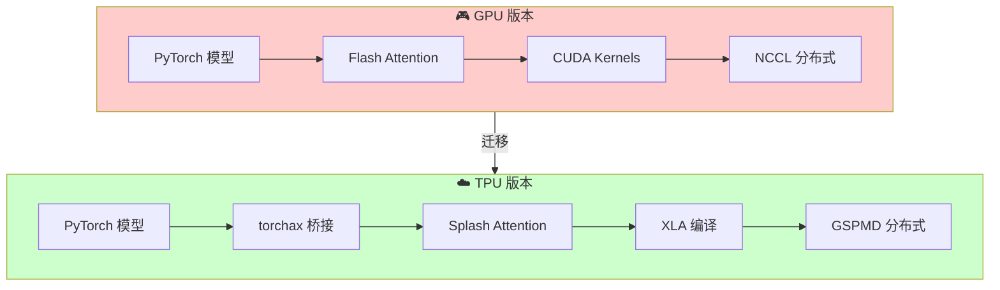

### 1.2 关键技术栈对比

| 技术层 | GPU 版本 | TPU 版本 |
|--------|----------|----------|
| 运行框架 | PyTorch | torchax (PyTorch → JAX) |
| Attention | Flash Attention 2/3 | Splash Attention (Pallas) |
| JIT 编译 | torch.compile | XLA JIT |
| 分布式 | NCCL + 手动 SP/TP | GSPMD (自动分片) |
| 数据类型 | fp16 / fp32 | bf16 (原生支持) |
| 设备管理 | CUDA | JAX Device Mesh |

---

## 2. 架构对比

### 2.1 数据流对比

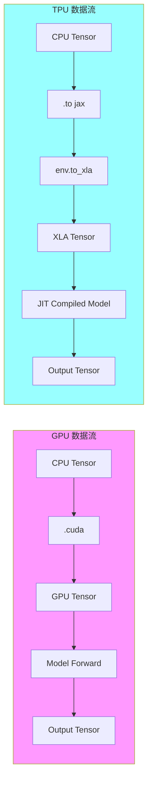

### 2.2 Attention 实现对比

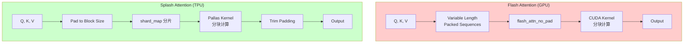

---

## 3. 核心修复详解

在将 HunyuanVideo-1.5 迁移到 TPU 时，遇到了多个导致生成质量问题的关键差异。以下是详细分析和修复过程。

### 3.1 修复 #1: Attention Mask 问题（根本原因）

> ⚠️ **重要更新**：经过进一步调试，我们发现视频质量问题的**根本原因**是 Attention Mask 处理，而非 ByT5 精度问题。ByT5 可以安全使用 bf16。

#### 问题分析

这是最关键的修复。GPU 版本使用 `flex_attention` 配合 `score_mod` 函数来屏蔽 padding tokens，而我们的初始 TPU 版本完全忽略了这个 mask。

```mermaid
flowchart TB
    subgraph GPU["GPU: Attention Mask 处理"]
        G1[text_mask] --> G2[F.pad 扩展到完整序列]
        G2 --> G3[flex_attention<br/>score_mod 函数]
        G3 --> G4[Padding 位置 → -inf]
        G4 --> G5[Softmax 后权重 = 0]
    end
    
    subgraph TPU_BAD["TPU (错误): 无 Mask"]
        T1[text_mask] --> T2[忽略!]
        T2 --> T3[Splash Attention<br/>无 mask]
        T3 --> T4[Padding 参与计算]
        T4 --> T5[注意力污染]
    end
    
    subgraph TPU_GOOD["TPU (修复): K/V 置零近似"]
        F1[text_mask] --> F2[扩展 mask 维度]
        F2 --> F3[K *= mask<br/>V *= mask]
        F3 --> F4[Padding 位置 K/V = 0]
        F4 --> F5[QK^T 对应位置 ≈ 0]
        F5 --> F6[Softmax 后权重很低]
    end
    
    style GPU fill:#ccffcc
    style TPU_BAD fill:#ffcccc
    style TPU_GOOD fill:#ccffcc
```

#### 原始 GPU 代码 (attention.py)

```python
# GPU 使用 flex_attention + score_mod
if text_mask is not None:
    attn_mask = F.pad(text_mask, (sequence_length, 0), value=True)

def score_mod(score, b, h, q_idx, kv_idx):
    return torch.where(attn_mask[b, q_idx] & attn_mask[b, kv_idx], score, float('-inf'))

hidden_states = flex_attention(query, key, value, score_mod=score_mod)
```

#### 错误的 TPU 代码

```python
# ❌ 错误：完全忽略 text_mask
attn_mask = None  # 强制使用 Splash Attention，但没有 mask！
hidden_states = F.scaled_dot_product_attention(query, key, value, attn_mask=attn_mask)
```

#### 修复后的 TPU 代码

```python
# ✅ 正确：将 padding 位置的 K/V 设为零
if text_mask is not None:
    # text_mask: [B, text_len], 1=有效, 0=padding
    text_mask_expanded = text_mask.unsqueeze(-1).unsqueeze(-1).to(encoder_key.dtype)
    encoder_key = encoder_key * text_mask_expanded    # Padding 位置 → 0
    encoder_value = encoder_value * text_mask_expanded  # Padding 位置 → 0

# 合并 image 和 text tokens
query = torch.cat([query, encoder_query], dim=1)
key = torch.cat([key, encoder_key], dim=1)     # text padding 部分是 0
value = torch.cat([value, encoder_value], dim=1)  # text padding 部分是 0

# Splash Attention（无需显式 mask）
hidden_states = F.scaled_dot_product_attention(query, key, value, attn_mask=None)
```

#### 为什么 K/V 置零有效？

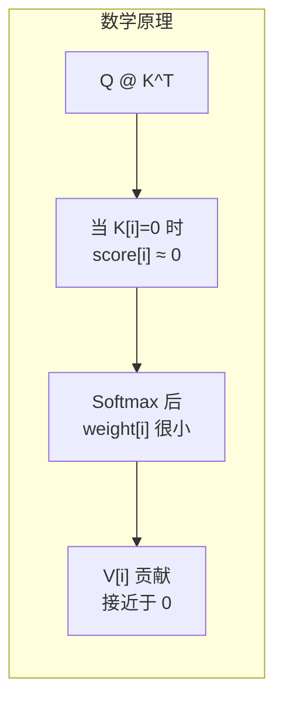

这是一个近似方案：
- 精确方案：将 score 设为 `-inf`，softmax 后权重 = 0
- 近似方案：将 K/V 设为 0，score ≈ 0，softmax 后权重很小

近似方案足够有效，因为 padding tokens 的影响被大幅降低。

### 3.2 ByT5 Embeddings 精度（最终结论：bf16 可用）

#### 调试历程

最初我们认为 ByT5 需要 float32 精度，但后来发现这是误判。真正的问题是 Attention Mask。

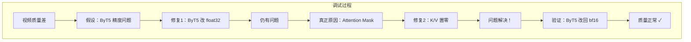

#### 最终结论

```python
# ✅ 正确：ByT5 使用 bf16（TPU 原生优化，累加器为 float32）
prompt_embeds_2 = prompt_embeds_2.to(dtype=torch.bfloat16).to('jax')
```

> **TPU bf16 特性**：TPU 的 MXU（矩阵乘法单元）原生支持 bf16，并使用 float32 累加器。这意味着计算过程中精度已经得到保护，无需显式使用 float32。

### 3.3 vision_states 处理

#### 问题分析

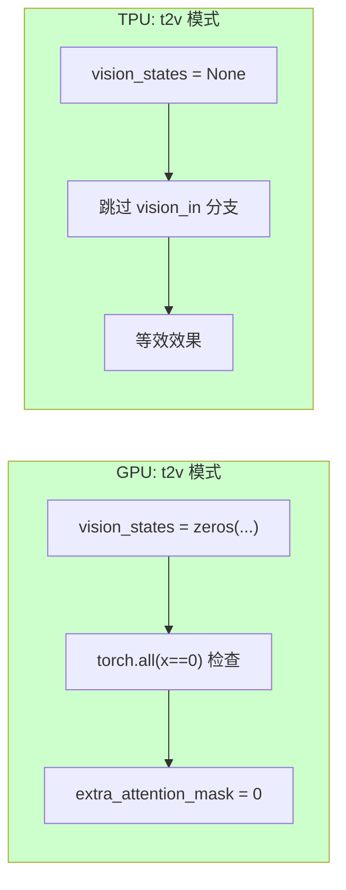

#### 为什么使用 None 而非零向量？

Transformer 代码中有这样的检查：

```python
if mask_type == "t2v" and torch.all(vision_states == 0):
    ...
```

`torch.all()` 在 JIT 编译时会导致 ConcretizationTypeError，因为它需要具体的布尔值。使用 `None` 可以完全跳过这个分支，避免问题。

### 3.4 修复 #4: reorder_txt_token 布尔索引问题

#### 问题分析

GPU 版本使用布尔索引来重排 tokens，这在 torchax 中不支持。

```python
# GPU 代码：使用布尔索引
valid_tokens = tensor[mask.bool()]  # ❌ torchax 不支持
```

#### 解决方案：argsort + gather

```python
def _reorder_txt_token_tpu_compatible(self, byt5_txt, txt, byt5_text_mask, text_mask, ...):
    """
    使用 argsort + gather 替代布尔索引
    
    排序逻辑：
    - priority = 2*(1-mask) + group
    - 有效 byt5: 0, 有效 text: 1, padding byt5: 2, padding text: 3
    """
    # 创建分组标识
    group = torch.cat([
        torch.zeros(B, byt5_len, ...),  # byt5 = 0
        torch.ones(B, text_len, ...)    # text = 1
    ], dim=1)
    
    # 计算排序优先级
    priority = 2 * (1 - combined_mask) + group
    
    # 使用 argsort 获取排序索引
    sort_indices = torch.argsort(priority, dim=1, stable=True)
    
    # 使用 gather 重排
    sort_indices_expanded = sort_indices.unsqueeze(-1).expand_as(combined_txt).to(torch.int32)
    reorder_txt = torch.gather(combined_txt, dim=1, index=sort_indices_expanded)
    reorder_mask = torch.gather(combined_mask, dim=1, index=sort_indices.to(torch.int32))
    
    return reorder_txt, reorder_mask
```

### 3.5 修复 #5: Splash Attention segment_ids 机制（实验性）

> ⚠️ **性能警告**：segment_ids 方案虽然正确，但会增加约 30% 的开销。推荐使用 K/V 置零方案。

#### segment_ids 机制原理

Splash Attention 支持 `segment_ids` 参数，用于区分不同序列的 tokens：
- 只有相同 segment_id 的 tokens 才能互相 attend
- 可用于处理 packed sequences 和 padding mask

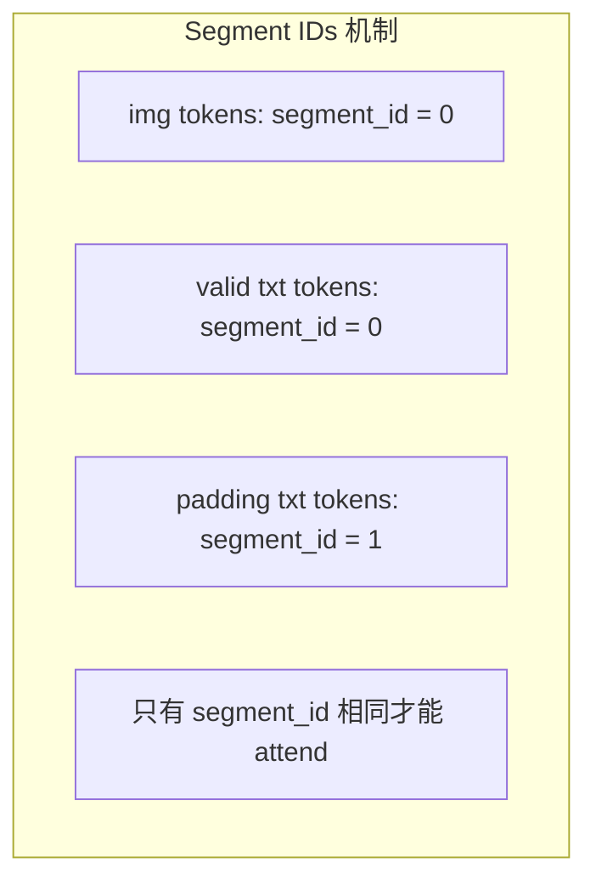

#### 关键问题：batch 维度

CFG 模式下 batch_size=2（negative + positive prompt），它们可能有不同的 padding pattern。**segment_ids 必须有 batch 维度！**

```python
# ❌ 错误：1D segment_ids（所有 batch 共享）
txt_segment = (1 - text_mask[0]).to(torch.int32)  # 只用了 batch[0]
segment_ids = torch.cat([img_segment, txt_segment], dim=0)  # [total_len]

# ✅ 正确：2D segment_ids（per-batch）
img_segment = torch.zeros(batch_size, img_q_len, ...)  # [B, img_len]
txt_segment = (1 - text_mask).to(torch.int32)          # [B, txt_len]
segment_ids = torch.cat([img_segment, txt_segment], dim=1)  # [B, total_len]
```

#### vmap 适配

segment_ids 从 1D 改为 2D 后，需要在 vmap 中正确处理：

```python
# 1D segment_ids：在 vmap 外部传入（作为常量广播）
vmapped_kernel = jax.vmap(
    lambda q, k, v: kernel_3d(q, k, v, seg_ids),  # seg_ids 是常量
    in_axes=(0, 0, 0), out_axes=0
)

# 2D segment_ids：在 vmap 内部按 batch 索引
vmapped_kernel = jax.vmap(
    kernel_3d,
    in_axes=(0, 0, 0, 0), out_axes=0  # seg_ids 也按 batch 分
)
```

#### 性能对比

| 方案 | 121帧 50步 | 每步时间 | 开销 |
|------|-----------|---------|------|
| K/V 置零 | ~350s | ~7.0s | 基准 |
| segment_ids (2D) | ~435s | ~8.7s | +24% |

**开销原因**：
1. Splash Attention 内核级别的额外检查（每个 block 检查 segment_id）
2. 2D segment_ids 的 vmap 开销（每个 batch 独立处理）

#### 结论

- **推荐**：K/V 置零方案（性能更好，代码更简单）
- **备选**：segment_ids 方案（语义更清晰，但性能差）
- **实验版本**：保存在 `stage2_transformer_flax_experimental_segmented.py`

---

## 4. 常见陷阱与解决方案

### 4.1 ConcretizationTypeError

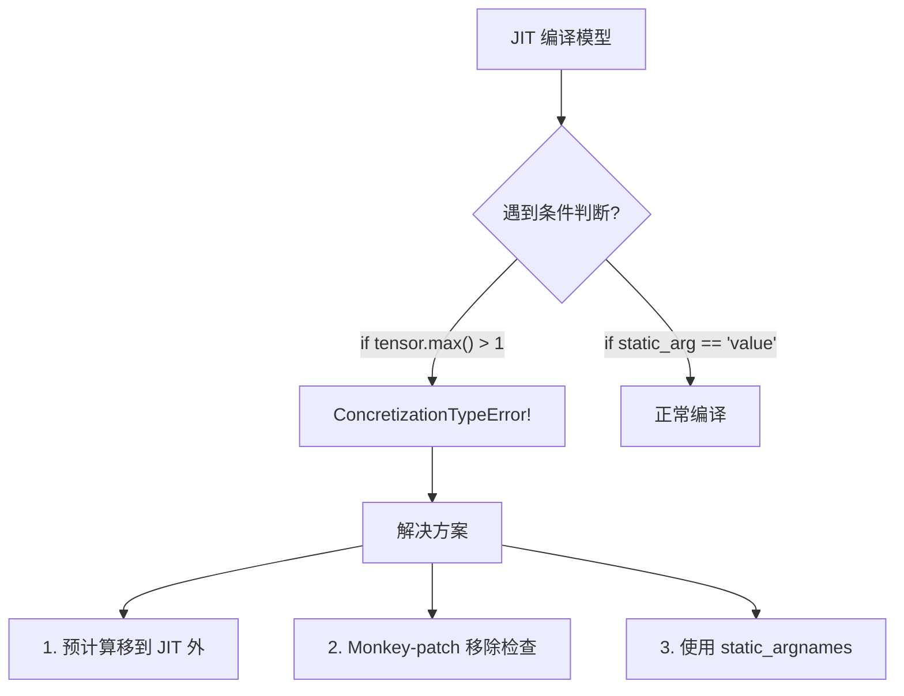

**常见触发场景：**

| 代码模式 | 问题 | 解决方案 |
|----------|------|----------|
| `if tensor.max() > 1:` | 需要具体值 | 移到 JIT 外或移除 |
| `assert tensor.min() >= 0` | 断言需要具体值 | Monkey-patch 移除 |
| `torch.all(x == 0)` | 需要具体布尔值 | 传入 None 跳过分支 |
| `tensor.item()` | 需要标量值 | 使用 tensor 运算代替 |

### 4.2 布尔索引不支持

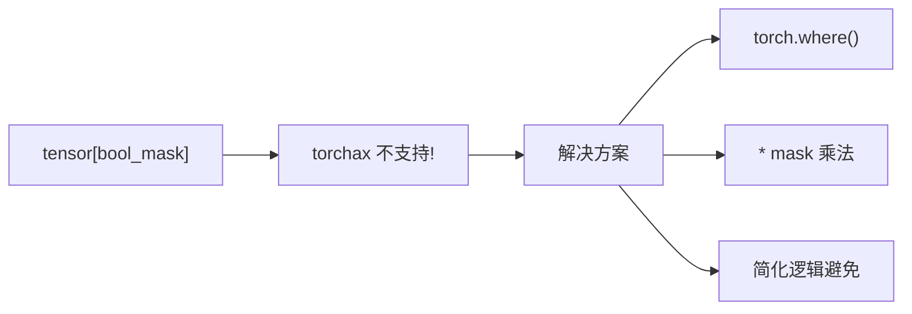

**示例修复：**

```python
# ❌ 错误
selected = tensor[~mask]

# ✅ 方案 1: torch.where
selected = torch.where(mask.unsqueeze(-1), tensor, torch.zeros_like(tensor))

# ✅ 方案 2: 乘法
selected = tensor * mask.unsqueeze(-1).float()
```

### 4.3 动态 Tensor 创建

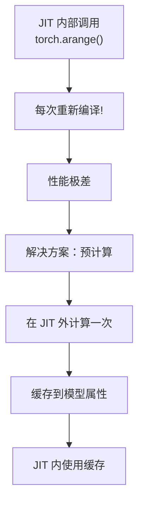

**示例：Rotary Position Embeddings**

```python
# 在 JIT 编译前预计算
with torch.no_grad():
    freqs_cos, freqs_sin = model.get_rotary_pos_embed((t, h, w))
    with env:
        model._cached_freqs_cos = freqs_cos.to('jax')
        model._cached_freqs_sin = freqs_sin.to('jax')

# Monkey-patch 使用缓存
def cached_get_rotary_pos_embed(self, latent_size):
    return self._cached_freqs_cos, self._cached_freqs_sin
model.get_rotary_pos_embed = types.MethodType(cached_get_rotary_pos_embed, model)
```

### 4.4 Scheduler dtype 问题

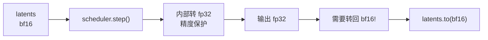

```python
# 每次 scheduler.step 后转回 bf16
latents = scheduler.step(noise_pred, t, latents)[0]
latents = latents.to(target_dtype)  # 转回 bf16
```

### 4.5 OOM 问题

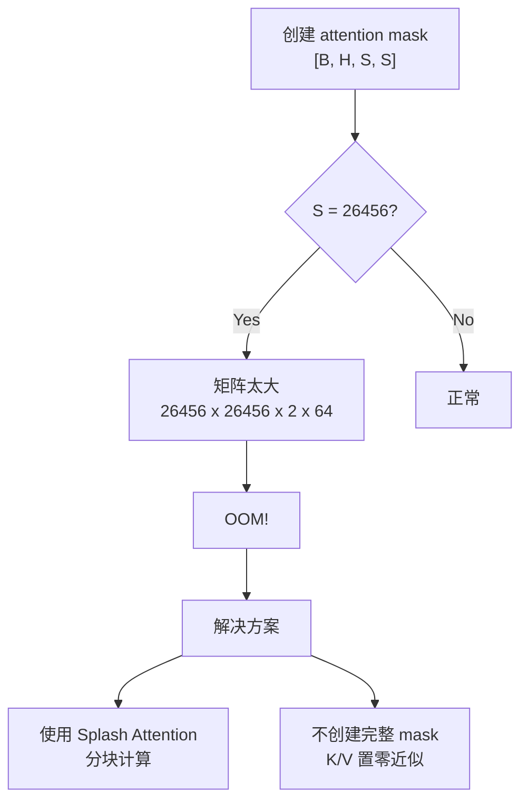

---

## 5. 完整迁移流程

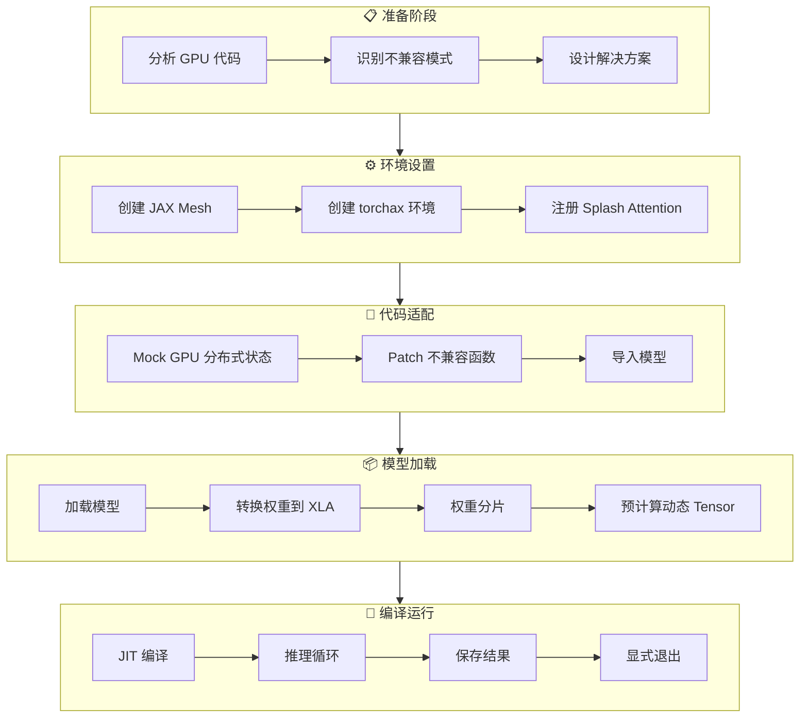

### 步骤 1: 创建 JAX Mesh

```python
from jax.sharding import Mesh
from jax.experimental import mesh_utils

tp_dim = jax.device_count()  # 8 个 TPU cores
dp_dim = 1
sp_dim = 1

mesh_devices = mesh_utils.create_device_mesh(
    (tp_dim, dp_dim, sp_dim),
    allow_split_physical_axes=True
)
mesh = Mesh(mesh_devices, ('tp', 'dp', 'sp'))
```

### 步骤 2: 创建 torchax 环境

```python
import torchax

env = torchax.default_env()
env._mesh = mesh
env.config.use_tpu_splash_attention = True

torch.set_default_dtype(torch.bfloat16)
```

### 步骤 3: 注册 Splash Attention

```python
# 保存原始 SDPA
_ORIGINAL_SDPA = torch.nn.functional.scaled_dot_product_attention

# 注册自定义 attention
custom_attention = functools.partial(scaled_dot_product_attention, env=env)
env._ops[torch.nn.functional.scaled_dot_product_attention] = ops_registry.Operator(
    torch.nn.functional.scaled_dot_product_attention,
    custom_attention,
    is_jax_function=False,
    is_user_defined=True,
    needs_env=False,
    is_view_op=False,
)
```

### 步骤 4: Monkey-Patch 不兼容代码

**必须在导入模型之前！**

```python
# Mock GPU 分布式状态
import module.parallel_states as ps
from types import SimpleNamespace

ps.get_parallel_state = lambda: SimpleNamespace(
    sp=1,
    sp_enabled=False,
    sp_group=None,
)

# Patch 有问题的函数
def patched_function(...):
    # 移除运行时检查，简化逻辑
    pass
module.original_function = patched_function

# 现在才导入模型
from module.model import Model
```

### 步骤 5: 加载和转换模型

```python
model = Model.from_pretrained(path, torch_dtype=torch.bfloat16)

with env:
    with jax.default_device('cpu'):
        state_dict = model.state_dict()
        state_dict = env.to_xla(state_dict)
        model.load_state_dict(state_dict, assign=True)
    
    weights = shard_weights(mesh, model.state_dict())
    model.load_state_dict(weights, assign=True, strict=False)
    torchax.interop.call_jax(jax.block_until_ready, weights)

model.eval()
```

### 步骤 6: 预计算并 JIT 编译

```python
# 预计算动态 tensor
with torch.no_grad():
    freqs = model.get_rotary_pos_embed(size)
    with env:
        model._cached_freqs = freqs.to('jax')

# JIT 编译
with env:
    model = torchax.compile(model, torchax.CompileOptions(
        jax_jit_kwargs={'static_argnames': ('return_dict',)}
    ))
```

### 步骤 7: 推理循环

```python
with mesh, env:
    with torch.no_grad():
        for i, t in enumerate(timesteps):
            output = model(inputs)
            latents = scheduler.step(output, t, latents)[0]
            latents = latents.to(target_dtype)  # 转回 bf16

# 保存结果
save_results(latents.cpu())

# 强制退出（避免 torchax/JAX 后台线程阻塞）
os._exit(0)  # 不要用 sys.exit(0)
```

> ⚠️ **重要**：使用 `os._exit(0)` 而非 `sys.exit(0)`。torchax/JAX 有后台线程可能导致 `sys.exit(0)` 阻塞。

---

## 6. 代码模板

### 6.1 Splash Attention 完整实现

```python
from jax.experimental.pallas.ops.tpu import splash_attention
from jax.experimental.shard_map import shard_map

BQSIZE = 2048
BKVSIZE = 2048
BKVCOMPUTESIZE = 1024

def _tpu_splash_attention(query, key, value, mesh, scale=None, window_size=None):
    """
    TPU Splash Attention 实现
    
    Args:
        query: [B, H, Sq, D]
        key: [B, H, Skv, D]
        value: [B, H, Skv, D]
        mesh: JAX 设备 mesh
        scale: 缩放因子，默认 1/sqrt(D)
        window_size: 局部注意力窗口大小，None 表示全局注意力
    """
    num_heads = query.shape[1]

    def _attention_on_slices(q, k, v):
        scale_factor = 1.0 / math.sqrt(q.shape[-1]) if scale is None else scale
        q = q * scale_factor

        def pad_to_multiple(x, multiple, axis):
            seq_len = x.shape[axis]
            pad_len = (multiple - seq_len % multiple) % multiple
            if pad_len == 0:
                return x, seq_len
            pad_width = [(0, 0)] * x.ndim
            pad_width[axis] = (0, pad_len)
            return jnp.pad(x, pad_width), seq_len

        def kernel_3d(q_3d, k_3d, v_3d):
            num_heads_on_device = q_3d.shape[0]
            
            q_3d_padded, q_orig_len = pad_to_multiple(q_3d, BQSIZE, axis=1)
            k_3d_padded, _ = pad_to_multiple(k_3d, BKVSIZE, axis=1)
            v_3d_padded, _ = pad_to_multiple(v_3d, BKVSIZE, axis=1)

            if window_size is not None:
                mask_class = functools.partial(
                    splash_attention.LocalMask, 
                    window_size=window_size
                )
            else:
                mask_class = splash_attention.FullMask

            mask = splash_attention.MultiHeadMask([
                mask_class((q_3d_padded.shape[1], k_3d_padded.shape[1]))
                for _ in range(num_heads_on_device)
            ])

            block_sizes = splash_attention.BlockSizes(
                block_q=min(BQSIZE, q_3d_padded.shape[1]),
                block_kv=min(BKVSIZE, k_3d_padded.shape[1]),
                block_kv_compute=min(BKVCOMPUTESIZE, k_3d_padded.shape[1]),
            )
            
            kernel = splash_attention.make_splash_mha(
                mask=mask, block_sizes=block_sizes
            )
            out = kernel(q_3d_padded, k_3d_padded, v_3d_padded)
            return out[:, :q_orig_len, ...]

        return jax.vmap(kernel_3d)(q, k, v)

    # 分片规则
    q_spec = P('dp', 'tp', 'sp', None)
    kv_spec = P('dp', 'tp', None, None)

    sharded_fn = shard_map(
        _attention_on_slices,
        mesh=mesh,
        in_specs=(q_spec, kv_spec, kv_spec),
        out_specs=q_spec,
        check_rep=False,
    )
    return sharded_fn(query, key, value)
```

### 6.2 权重分片模板

```python
from jax.sharding import PartitionSpec as P, NamedSharding
import re

# Tensor Parallel: Column-Row 模式
sharding_rules = {
    # Column Parallel: 在 output 维度分片
    r'.*\.q_proj\.weight$': (('tp', 'sp'), None),
    r'.*\.k_proj\.weight$': (('tp', 'sp'), None),
    r'.*\.v_proj\.weight$': (('tp', 'sp'), None),
    r'.*\.fc1\.weight$': (('tp', 'sp'), None),
    
    # Row Parallel: 在 input 维度分片
    r'.*\.o_proj\.weight$': (None, ('tp', 'sp')),
    r'.*\.fc2\.weight$': (None, ('tp', 'sp')),
}

def shard_weights(mesh, weights, rules):
    matched = 0
    for name, tensor in weights.items():
        for pattern, spec in rules.items():
            if re.fullmatch(pattern, name):
                tensor.apply_jax_(jax.device_put, NamedSharding(mesh, P(*spec)))
                matched += 1
                break
        else:
            # 未匹配：复制到所有设备
            tensor.apply_jax_(jax.device_put, NamedSharding(mesh, P()))
    
    print(f"分片完成: {matched} 个匹配, {len(weights)-matched} 个复制")
    return weights
```

---

## 7. 性能优化

### 7.1 Warmup（预热）策略

XLA 编译是两阶段的：首先 trace 计算图，然后编译到 TPU 内核。前 1-2 步会比较慢。

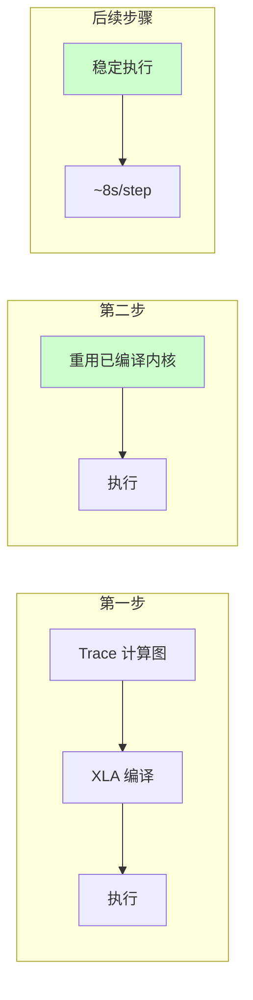

#### 推荐：2 步预热

```python
parser.add_argument('--warmup_steps', type=int, default=2,
                    help='预热步数（0=不预热，2=推荐，触发 JIT 编译）')

if args.warmup_steps > 0:
    _, warmup_times, warmup_elapsed = run_denoising_loop(
        latents_input=latents,
        timesteps_input=timesteps,
        num_steps=args.warmup_steps,
        desc="Warmup (JIT)",
        is_warmup=True,
    )
    print(f"预热完成，耗时: {warmup_elapsed:.2f}秒")
```

#### 统一 Warmup 和推理代码

推荐将 warmup 和推理使用同一个函数，避免代码重复：

```python
def run_denoising_loop(
    latents_input,
    timesteps_input,
    num_steps,
    desc="Denoising",
    is_warmup=False,
):
    """统一的 Denoising 循环，预热和正式推理共用同一套代码。"""
    step_times = []
    start_time = time.perf_counter()
    
    with mesh, env:
        # clone 必须在 torchax 环境内执行
        loop_latents = latents_input.clone() if is_warmup else latents_input
        with torch.no_grad():
            for i in tqdm(range(num_steps), desc=desc):
                # ... forward pass ...
                
                # 等待计算完成（准确计时）
                torchax.interop.call_jax(jax.block_until_ready, loop_latents._elem)
                
                step_time = time.perf_counter() - step_start
                step_times.append(step_time)
    
    return loop_latents, step_times, time.perf_counter() - start_time
```

### 7.2 JIT 编译缓存

```python
# 启用持久化缓存
jax.config.update("jax_compilation_cache_dir", "/dev/shm/jax_cache")
jax.config.update("jax_persistent_cache_min_entry_size_bytes", -1)
jax.config.update("jax_persistent_cache_min_compile_time_secs", 0)
```

**效果：**
- 首次运行：~60s 编译
- 后续运行：~5s 加载缓存（需要相同的模型和输入形状）

### 7.3 dtype 优化

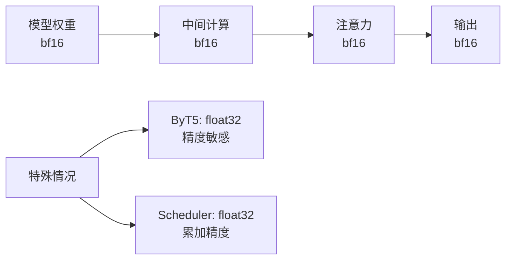

### 7.4 准确计时

JAX/XLA 是惰性执行的，必须使用 `block_until_ready` 才能获得准确的计时：

```python
# ❌ 错误：不准确的计时
step_start = time.perf_counter()
output = model(input)
step_time = time.perf_counter() - step_start  # 可能只测量了 dispatch 时间

# ✅ 正确：准确计时
step_start = time.perf_counter()
output = model(input)
torchax.interop.call_jax(jax.block_until_ready, output._elem)  # 等待计算完成
step_time = time.perf_counter() - step_start  # 包含实际计算时间
```

### 7.5 性能基准

| 配置 | Token 数 | 总时间 | 每步时间 |
|------|----------|--------|----------|
| 25帧, 720p | 25,200 | ~115s | ~2.3s |
| 49帧, 720p | 46,800 | ~215s | ~4.3s |
| 121帧, 720p | 111,600 | ~406s | ~8.1s |

> 测试环境：TPU v4-8，50 步推理，2 步预热

---

## 8. 生产环境优化

### 8.1 警告过滤

torchax/JAX 会产生许多无害警告，建议在生产环境中过滤：

```python
import warnings

# 过滤掉各种无害警告
warnings.filterwarnings('ignore', message='.*jax.experimental.shard_map is deprecated.*')
warnings.filterwarnings('ignore', message='.*NumPy array is not writable.*')
# int64 截断警告来自 HunyuanVideo-1.5-TPU 库代码，无法修改
warnings.filterwarnings('ignore', message='.*int64.*is not available.*')
# 过滤 flash attention fallback 警告（我们用 Splash Attention 替代）
warnings.filterwarnings('ignore', message='.*Falling back from.*')
```

### 8.2 进程退出

torchax/JAX 有后台线程，`sys.exit(0)` 可能会阻塞。推荐使用强制退出：

```python
import os

# ❌ 可能阻塞
sys.exit(0)

# ✅ 强制退出
os._exit(0)
```

### 8.3 进度条优化

显示每步时间和 ETA：

```python
from tqdm import tqdm

progress_bar = tqdm(range(num_steps), desc="Denoising", ncols=130)

for i in progress_bar:
    step_start = time.perf_counter()
    
    # ... forward pass ...
    
    # 等待计算完成
    torchax.interop.call_jax(jax.block_until_ready, latents._elem)
    
    step_time = time.perf_counter() - step_start
    step_times.append(step_time)
    avg_time = sum(step_times) / len(step_times)
    remaining = num_steps - i - 1
    
    progress_bar.set_postfix({
        'step': f'{step_time:.2f}s',
        'avg': f'{avg_time:.2f}s',
        'eta': f'{avg_time * remaining:.1f}s'
    })
```

---

## 9. 调试技巧

### 9.1 查看完整 traceback

```bash
JAX_TRACEBACK_FILTERING=off python script.py
```

### 9.2 逐步测试

```python
# 先用 1 步测试
args.num_inference_steps = 1
# 成功后再增加
```

### 9.3 检测 XLA tensor

```python
def is_xla_tensor(tensor):
    if tensor is None:
        return False
    if hasattr(tensor, '_elem'):
        return True
    if hasattr(tensor, 'device'):
        return 'jax' in str(tensor.device) or 'xla' in str(tensor.device)
    return False
```

### 9.4 调试打印

```python
def debug_tensor(name, t):
    if t is None:
        print(f"{name}: None")
    else:
        print(f"{name}: shape={t.shape}, dtype={t.dtype}, "
              f"mean={t.float().mean().item():.4f}")
```

---

## 📋 迁移 Checklist

### 开始前

- [ ] 识别所有 CUDA 特定代码
- [ ] 识别所有运行时检查 (assert, if tensor.max())
- [ ] 识别所有动态 tensor 创建 (torch.arange, torch.zeros)
- [ ] 识别所有布尔索引
- [ ] 确认 dtype 要求

### 迁移中

- [ ] 创建 JAX Mesh
- [ ] 注册 Splash Attention
- [ ] Monkey-patch 不兼容代码
- [ ] 加载并分片权重
- [ ] 预计算动态 tensor
- [ ] JIT 编译模型

### 完成后

- [ ] 程序正常退出
- [ ] 输出 dtype 正确 (bf16)
- [ ] 无 OOM 问题
- [ ] 生成质量正确

---

## 📋 问题排查速查表

| 症状 | 可能原因 | 解决方案 |
|------|----------|----------|
| 视频有竖条纹/噪点 | Attention Mask 未处理 | 使用 K/V 置零方案 |
| 视频不跟随提示词 | Attention Mask 未处理 | 使用 K/V 置零方案 |
| 视频花屏（使用 segment_ids） | segment_ids 缺少 batch 维度 | 改为 [B, total_len] 形状 |
| 程序不退出 | JAX 后台线程 | 使用 `os._exit(0)` |
| 第一步很慢（60s+） | XLA 编译 | 正常现象，使用 warmup |
| 第二步仍慢 | XLA 异步编译 | 正常现象，第三步开始稳定 |
| 单步时间从 7s 变 8.7s | segment_ids 内核开销 | 改用 K/V 置零方案 |
| OOM | 完整 attention mask | 使用 Splash Attention + K/V 置零 |
| ConcretizationTypeError | 动态条件/断言 | Monkey-patch 移除或预计算 |
| 布尔索引报错 | torchax 不支持 `tensor[mask]` | 使用 argsort + gather |

---

## 📚 参考资源

- [torchax GitHub](https://github.com/pytorch/xla)
- [JAX Splash Attention](https://github.com/jax-ml/jax/blob/main/jax/experimental/pallas/ops/tpu/splash_attention)
- [JAX shard_map](https://jax.readthedocs.io/en/latest/notebooks/shard_map.html)
- [HunyuanVideo-1.5](https://github.com/Tencent/HunyuanVideo)
- [TPU bf16 精度说明](https://cloud.google.com/tpu/docs/bfloat16)