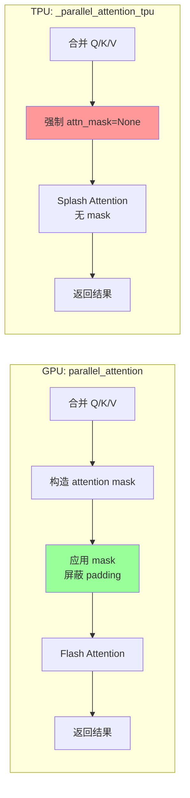
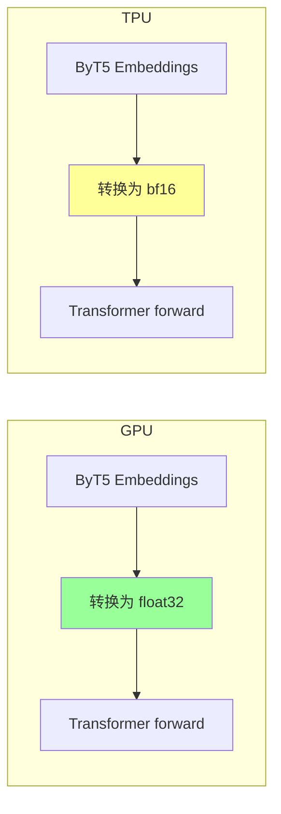
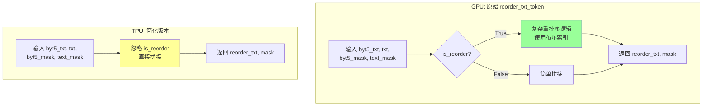
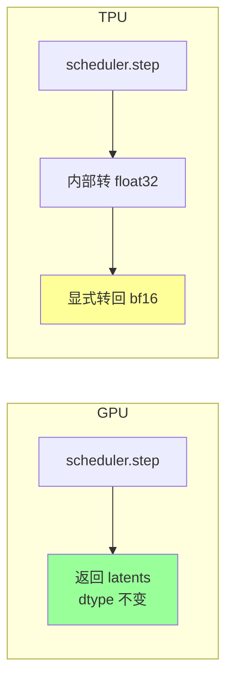
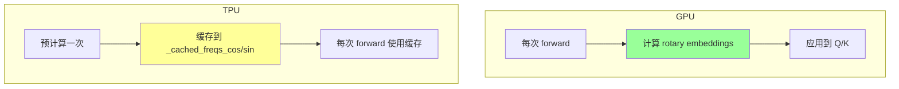

# GPU vs TPU 代码对比分析文档

本文档对比 `stage2_transformer.py` (GPU) 和 `stage2_transformer_flax.py` (TPU) 的代码差异，
重点分析可能导致 TPU 版本生成错误视频的数值问题。

## 文件概览

| 文件 | 版本 | 行数 | 主要技术 |
|------|------|------|----------|
| `stage2_transformer.py` | GPU | 714 | PyTorch + Flash Attention |
| `stage2_transformer_flax.py` | TPU | 998 | torchax + Splash Attention |

---

## 整体流程对比

```mermaid
flowchart TB
    subgraph GPU["GPU 版本 (stage2_transformer.py)"]
        G1[初始化并行状态<br/>initialize_parallel_state] --> G2[加载 Transformer<br/>from_pretrained]
        G2 --> G3[加载 Scheduler<br/>FlowMatchDiscreteScheduler]
        G3 --> G4[准备 Embeddings<br/>CFG 合并]
        G4 --> G5[准备 Latents<br/>随机噪声]
        G5 --> G6[Denoising Loop<br/>50 steps]
        G6 --> G7[保存 Latents]
    end
    
    subgraph TPU["TPU 版本 (stage2_transformer_flax.py)"]
        T1[Mock 并行状态<br/>sp_enabled=False] --> T2[加载 Transformer<br/>from_pretrained]
        T2 --> T3[权重分片<br/>shard_weights_transformer]
        T3 --> T4[预计算 Rotary Embeddings]
        T4 --> T5[编译 Transformer<br/>torchax.compile]
        T5 --> T6[准备 Embeddings<br/>CFG 合并]
        T6 --> T7[准备 Latents<br/>随机噪声]
        T7 --> T8[Denoising Loop<br/>50 steps]
        T8 --> T9[保存 Latents]
    end
    
    style G6 fill:#ff9999
    style T8 fill:#99ff99
```



---

## 🚨 关键差异分析

### 差异 1：Attention 实现 (⚠️ 高风险)

这是最可能导致数值错误的差异！



#### GPU 版本 ([`stage2_transformer.py`](stage2_transformer.py:645-660))

使用原始的 `parallel_attention`，支持 attention mask：

```python
# 调用 transformer forward，内部使用 parallel_attention
output = transformer(
    latent_model_input,
    t_expand,
    prompt_embeds,
    ...
)
```

原始 `parallel_attention` 会：
1. 根据 `text_mask` 构造 attention mask
2. 屏蔽 padding token，防止其参与注意力计算

#### TPU 版本 ([`stage2_transformer_flax.py`](stage2_transformer_flax.py:82-132))

Monkey-patch 为简化版本：

```python
def _parallel_attention_tpu(q, k, v, img_q_len, img_kv_len,
                             attn_mode=None, text_mask=None,
                             attn_param=None, block_idx=None):
    """
    TPU 兼容版本的 parallel_attention
    - 强制使用 Splash Attention（不使用 mask，避免 OOM）
    - 移除断言检查（避免 JIT concretization 问题）
    """
    # ... 合并 Q/K/V ...
    
    # ⚠️ 强制不使用 mask！
    attn_mask = None
    
    # 调用 SDPA（被 Splash Attention 拦截）
    hidden_states = F.scaled_dot_product_attention(query, key, value, attn_mask=attn_mask)
```

**问题分析：**
- **text_mask 被完全忽略**
- Padding token 会参与注意力计算
- 这可能导致注意力权重分布错误

---

### 差异 2：ByT5 Embeddings 数据类型 (⚠️ 中风险)



#### GPU 版本 ([`stage2_transformer.py`](stage2_transformer.py:518-532))

```python
if prompt_embeds_2 is not None:
    prompt_embeds_2 = prompt_embeds_2.to(device=device, dtype=torch.float32)  # ✅ float32
    prompt_embeds_mask_2 = prompt_embeds_mask_2.to(device=device)
    if do_classifier_free_guidance:
        negative_prompt_embeds_2 = negative_prompt_embeds_2.to(device=device, dtype=torch.float32)
        ...
    extra_kwargs = {
        "byt5_text_states": byt5_text_states,  # float32
        "byt5_text_mask": byt5_text_mask,
    }
```

#### TPU 版本 ([`stage2_transformer_flax.py`](stage2_transformer_flax.py:812-829))

```python
# TPU 是 bf16 友好的芯片，所有 tensor 都使用 bfloat16
extra_kwargs = {}
if prompt_embeds_2 is not None:
    prompt_embeds_2 = prompt_embeds_2.to(dtype=target_dtype).to('jax')  # ⚠️ bf16
    prompt_embeds_mask_2 = prompt_embeds_mask_2.to('jax')
    if do_classifier_free_guidance:
        negative_prompt_embeds_2 = negative_prompt_embeds_2.to(dtype=target_dtype).to('jax')  # bf16
```

**问题分析：**
- GPU 使用 float32 保持精度
- TPU 使用 bf16 可能导致精度损失
- ByT5 embeddings 用于文本条件控制，精度损失可能影响生成质量

---

### 差异 3：vision_states 处理 (⚠️ 中风险)

```mermaid
flowchart LR
    subgraph GPU["GPU: t2v 模式"]
        G1[创建零向量<br/>shape: [1, 729, 1152]] --> G2[CFG 复制<br/>shape: [2, 729, 1152]]
        G2 --> G3[传入 Transformer]
    end
    
    subgraph TPU["TPU: t2v 模式"]
        T1[vision_states = None] --> T2[传入 Transformer]
    end
    
    style G1 fill:#99ff99
    style T1 fill:#ffff99
```

#### GPU 版本 ([`stage2_transformer.py`](stage2_transformer.py:559-574))

```python
# 准备 vision_states（t2v 模式使用零向量）
vision_num_tokens = 729
vision_dim = 1152

vision_states = torch.zeros(
    latents.shape[0],
    vision_num_tokens,
    vision_dim
).to(device=device, dtype=target_dtype)

if do_classifier_free_guidance:
    vision_states = vision_states.repeat(2, 1, 1)
```

#### TPU 版本 ([`stage2_transformer_flax.py`](stage2_transformer_flax.py:858-881))

```python
# 准备 vision_states
# t2v 模式：设为 None 以跳过 vision_in 处理
# 这也避免了 torch.all(vision_states == 0) 在 JIT 中的 concretization 问题
if task_type == 't2v':
    vision_states = None  # ⚠️ 与 GPU 不同
else:
    # i2v 或其他模式需要实际的 vision_states
    vision_states = torch.zeros(...)
```

**问题分析：**
- Transformer 内部对 `None` 和零向量可能有不同处理逻辑
- 虽然代码注释说这样可以"跳过 vision_in 处理"，但可能导致行为不一致
- 需要检查 `HunyuanVideo_1_5_DiffusionTransformer.forward()` 对 `vision_states=None` 的处理

---

### 差异 4：reorder_txt_token 简化 (⚠️ 中风险)



#### GPU 版本

使用原始的 `reorder_txt_token` 方法，支持 `is_reorder=True` 的复杂逻辑。

#### TPU 版本 ([`stage2_transformer_flax.py`](stage2_transformer_flax.py:67-79))

```python
def _reorder_txt_token_tpu_compatible(self, byt5_txt, txt, byt5_text_mask, text_mask, zero_feat=False, is_reorder=True):
    """
    TPU 兼容版本的 reorder_txt_token，禁用 is_reorder 以避免布尔索引操作
    原始方法使用 tensor[~mask] 这样的布尔索引，torchax 不支持
    """
    # 强制使用简化逻辑（不使用布尔索引）
    reorder_txt = torch.concat([byt5_txt, txt], dim=1)  # ⚠️ 简化
    reorder_mask = torch.concat([byt5_text_mask, text_mask], dim=1).to(dtype=torch.int64)
    return reorder_txt, reorder_mask
```

**问题分析：**
- 原始实现可能根据 mask 对 token 进行重新排列
- 简化版本忽略了这个逻辑，可能导致 token 顺序不正确
- 这会影响注意力计算中 text token 的位置信息

---

### 差异 5：Scheduler Step 后的 dtype 处理 (⚠️ 低风险)



#### GPU 版本 ([`stage2_transformer.py`](stage2_transformer.py:667-668))

```python
# Scheduler step
latents = scheduler.step(noise_pred, t, latents, generator=generator, return_dict=False)[0]
# 没有显式 dtype 转换，保持原始 dtype
```

#### TPU 版本 ([`stage2_transformer_flax.py`](stage2_transformer_flax.py:949-953))

```python
# Scheduler step
# 注意：scheduler.step 内部会转成 float32 做累加（diffusers 的标准做法）
# 但对于 TPU，bf16 原生支持，需要转回 bf16
latents = scheduler.step(noise_pred, t, latents, generator=generator, return_dict=False)[0]
latents = latents.to(target_dtype)  # 转回 bf16
```

**问题分析：**
- 这个差异本身可能不是主要问题
- 但显式转换可能引入额外的精度损失

---

### 差异 6：Rotary Position Embeddings 计算 (⚠️ 低风险)



#### TPU 版本 ([`stage2_transformer_flax.py`](stage2_transformer_flax.py:716-743))

```python
# 预计算 rotary embeddings（在 CPU 上计算，避免 torchax 问题）
with torch.no_grad():
    freqs_cos, freqs_sin = transformer.get_rotary_pos_embed((latent_target_length_temp, latent_height_temp, latent_width_temp))
    # 转换到 XLA 设备并缓存
    with env:
        transformer._cached_freqs_cos = freqs_cos.to('jax')
        transformer._cached_freqs_sin = freqs_sin.to('jax')

# Monkey-patch get_rotary_pos_embed 使用缓存
def cached_get_rotary_pos_embed(self, latent_size):
    if hasattr(self, '_cached_freqs_cos') and hasattr(self, '_cached_freqs_sin'):
        return self._cached_freqs_cos, self._cached_freqs_sin
    return original_get_rotary_pos_embed(latent_size)
```

**问题分析：**
- 预计算与实时计算应该产生相同的结果
- 主要风险是缓存的尺寸与实际使用的尺寸不匹配
- 代码中使用相同的参数计算，应该没问题

---

## 🔍 问题排查优先级

根据上述分析，建议按以下优先级排查：

| 优先级 | 差异点 | 风险等级 | 修复建议 |
|--------|--------|----------|----------|
| **1** | Attention Mask 被忽略 | 🔴 高 | 尝试实现支持 mask 的 Splash Attention |
| **2** | ByT5 使用 bf16 | 🟡 中 | 改为 float32 |
| **3** | vision_states = None | 🟡 中 | 改为零向量 |
| **4** | reorder_txt_token 简化 | 🟡 中 | 尝试实现正确的 token 重排 |
| **5** | Scheduler dtype | 🟢 低 | 检查是否需要 float32 累加 |
| **6** | Rotary Embeddings | 🟢 低 | 验证缓存正确性 |

---

## 🛠️ 建议修复方案

### 方案 1：修复 Attention Mask（最重要）

```python
def _parallel_attention_tpu_with_mask(q, k, v, img_q_len, img_kv_len,
                                       attn_mode=None, text_mask=None,
                                       attn_param=None, block_idx=None):
    """
    支持 mask 的 TPU 版本
    """
    query, encoder_query = q
    key, encoder_key = k
    value, encoder_value = v
    
    # 合并 image 和 text tokens
    query = torch.cat([query, encoder_query], dim=1)
    key = torch.cat([key, encoder_key], dim=1)
    value = torch.cat([value, encoder_value], dim=1)
    
    # 构造 attention mask
    if text_mask is not None:
        seq_len = query.shape[1]
        text_len = text_mask.shape[1]
        img_len = seq_len - text_len
        
        # 创建 full attention 矩阵
        # Image tokens 可以看到所有 tokens
        # Text tokens 只能看到非 padding 位置
        attn_mask = torch.ones(seq_len, seq_len, device=query.device, dtype=torch.bool)
        
        # 屏蔽 text padding
        text_mask_expanded = text_mask.unsqueeze(-1).expand(-1, -1, seq_len)
        attn_mask[img_len:, :] = text_mask_expanded[:, :, 0]
    else:
        attn_mask = None
    
    query = query.transpose(1, 2)
    key = key.transpose(1, 2)
    value = value.transpose(1, 2)
    
    # 使用参考实现而非 Splash Attention（支持 mask）
    hidden_states = _sdpa_reference(query, key, value, attn_mask=attn_mask)
    
    hidden_states = hidden_states.transpose(1, 2)
    b, s, a, d = hidden_states.shape
    hidden_states = hidden_states.reshape(b, s, -1)
    
    return hidden_states
```

### 方案 2：修复 ByT5 dtype

```python
# 改为使用 float32
if prompt_embeds_2 is not None:
    prompt_embeds_2 = prompt_embeds_2.to(dtype=torch.float32).to('jax')  # 改为 float32
    ...
    extra_kwargs = {
        "byt5_text_states": byt5_text_states.to(torch.float32),
        "byt5_text_mask": byt5_text_mask,
    }
```

### 方案 3：修复 vision_states

```python
# 统一使用零向量
vision_num_tokens = 729
vision_dim = 1152

vision_states = torch.zeros(
    latents.shape[0],
    vision_num_tokens,
    vision_dim,
    device='jax',
    dtype=target_dtype,
)

if do_classifier_free_guidance:
    vision_states = vision_states.repeat(2, 1, 1)
```

---

## 📊 验证方法

### 1. 中间值对比

在 GPU 和 TPU 版本中添加以下检查点：

```python
# 检查点 1：Embeddings
print(f"prompt_embeds mean: {prompt_embeds.mean().item()}")
print(f"prompt_embeds std: {prompt_embeds.std().item()}")

# 检查点 2：第一步 noise_pred
print(f"noise_pred[0] mean: {noise_pred.mean().item()}")
print(f"noise_pred[0] std: {noise_pred.std().item()}")

# 检查点 3：Attention 输出
# 在 attention 函数中添加
print(f"attention output mean: {hidden_states.mean().item()}")
```

### 2. 单步对比

```python
# 只运行 1 步，对比结果
args.num_inference_steps = 1

# 保存中间结果
torch.save({
    'noise_pred': noise_pred.cpu(),
    'latents_after_step': latents.cpu(),
}, 'debug_step1.pt')
```

### 3. 逐模块对比

```python
# 在 transformer forward 中添加 hooks
def hook_fn(name):
    def fn(module, input, output):
        print(f"{name}: output mean={output.mean().item():.6f}, std={output.std().item():.6f}")
    return fn

for name, module in transformer.named_modules():
    if isinstance(module, torch.nn.Linear):
        module.register_forward_hook(hook_fn(name))
```

---

## 🎯 总结

TPU 版本生成错误视频最可能的原因是：

1. **Attention Mask 被完全忽略** - 导致 padding token 参与注意力计算，破坏了生成质量
2. **ByT5 Embeddings 精度降低** - 从 float32 降到 bf16 可能影响文本条件
3. **Token 重排序逻辑被简化** - 可能导致 token 顺序错误

建议优先修复 Attention Mask 问题，这是影响最大的差异。