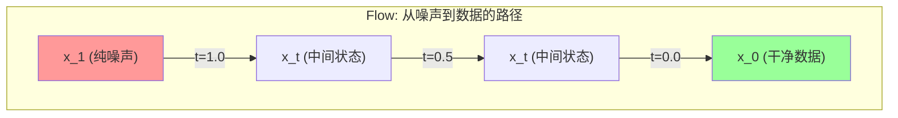
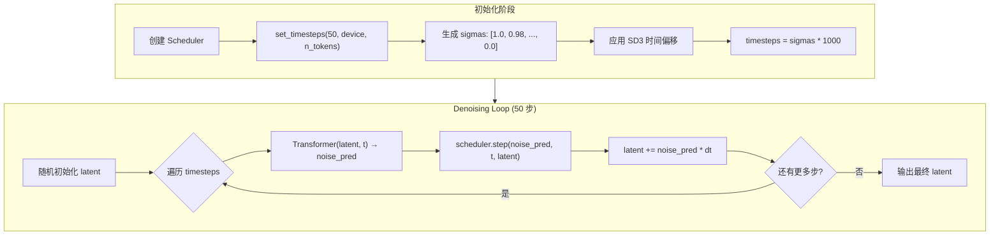
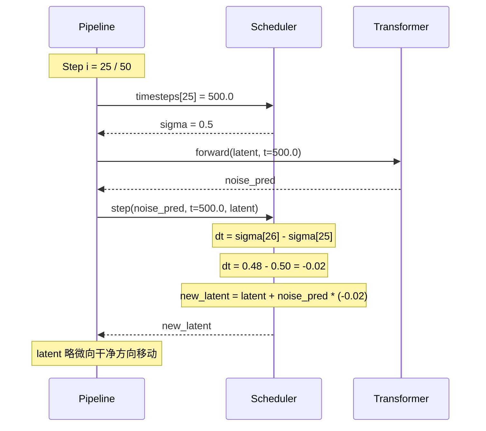
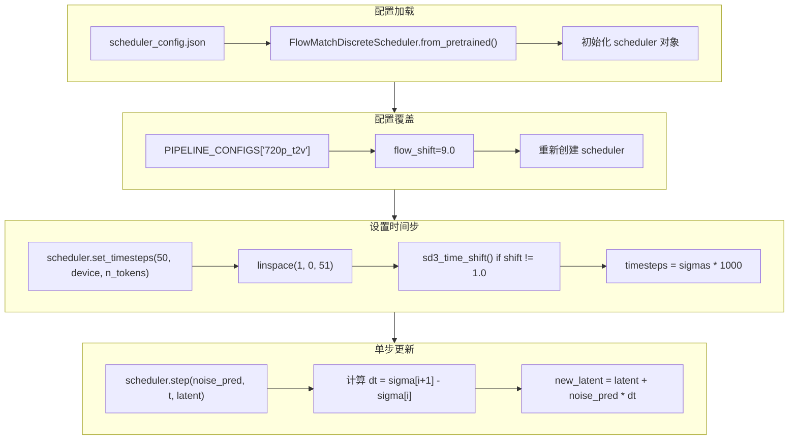
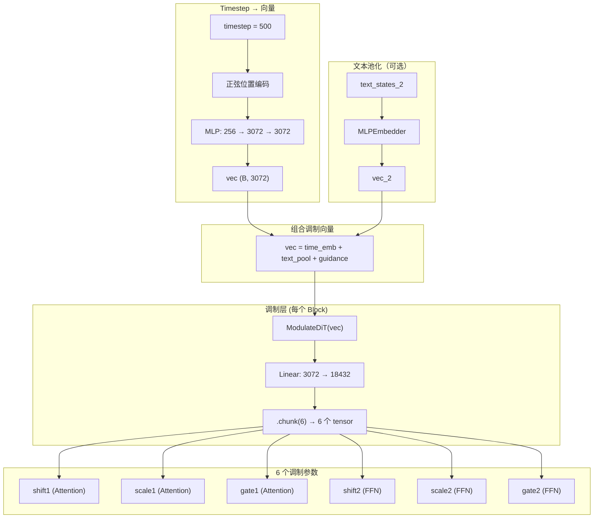

# FlowMatchDiscreteScheduler 调度器详解

## 什么是 Scheduler？

在扩散模型中，**Scheduler（调度器）** 负责控制去噪过程：
- 将初始噪声逐步转换为干净图像/视频
- 计算每一步的时间步（timestep）
- 决定如何从 noise_pred 更新 latent

## 为什么 Scheduler 目录有"权重"？

**这不是神经网络权重！** 这是一个**配置文件**：

```json
// scheduler_config.json
{
  "_class_name": "FlowMatchDiscreteScheduler",
  "num_train_timesteps": 1000,     // 训练时的总步数
  "shift": 7.0,                    // SD3 时间偏移参数
  "reverse": true,                 // 反向采样（从噪声→干净）
  "solver": "euler",               // ODE 求解器类型
  "use_flux_shift": false,         // 是否使用 FLUX 动态偏移
  "flux_base_shift": 0.5,          // FLUX 基础偏移
  "flux_max_shift": 1.15           // FLUX 最大偏移
}
```

## Flow Matching 基础原理

### 与传统 DDPM 的对比

```
┌─────────────────────────────────────────────────────────────────────────────┐
│                          传统 DDPM (Diffusion)                              │
├─────────────────────────────────────────────────────────────────────────────┤
│                                                                             │
│  前向过程（加噪）：                                                           │
│    x_t = √(α̅_t) · x_0 + √(1 - α̅_t) · ε                                    │
│                                                                             │
│  反向过程（去噪）：                                                           │
│    x_{t-1} = 模型预测的噪声 ε 经过复杂公式计算                                │
│                                                                             │
│  特点：离散的马尔可夫链，需要上千步                                           │
│                                                                             │
└─────────────────────────────────────────────────────────────────────────────┘

┌─────────────────────────────────────────────────────────────────────────────┐
│                          Flow Matching (Rectified Flow)                     │
├─────────────────────────────────────────────────────────────────────────────┤
│                                                                             │
│  核心思想：直接学习从 x_0 到 x_1 的"直线路径"                                │
│                                                                             │
│    x_t = (1 - t) · x_0 + t · x_1                                           │
│                                                                             │
│  其中：                                                                      │
│    x_0 = 干净数据（图像/视频）                                               │
│    x_1 = 纯噪声                                                              │
│    t ∈ [0, 1]                                                               │
│                                                                             │
│  模型预测的是"流速"（velocity）：                                            │
│    v = dx/dt = x_1 - x_0 = noise - clean_data                              │
│                                                                             │
│  特点：更简洁的数学形式，50步就能生成高质量结果                               │
│                                                                             │
└─────────────────────────────────────────────────────────────────────────────┘
```

### 为什么叫"Flow Matching"？



## FlowMatchDiscreteScheduler 核心功能

### 1. Timestep 生成

```python
def set_timesteps(self, num_inference_steps, device, n_tokens):
    """
    生成离散的时间步序列
    
    默认：从 1 → 0 均匀分布（因为 reverse=True）
    """
    # 基础 sigma 序列：[1.0, 0.98, 0.96, ..., 0.02, 0.0]
    sigmas = torch.linspace(1, 0, num_inference_steps + 1)
    
    # 应用时间偏移（关键！）
    if self.config.shift != 1.0:
        sigmas = self.sd3_time_shift(sigmas)
    
    # 转换为模型输入的 timestep
    self.timesteps = sigmas[:-1] * num_train_timesteps  # [1000, 980, 960, ...]
```

### 2. 时间偏移（Time Shift）

**为什么需要时间偏移？**

原始的均匀分布不是最优的：
- 高噪声阶段（t≈1）：需要更多步来稳定结构
- 低噪声阶段（t≈0）：细节已经确定，步数可以少

```python
def sd3_time_shift(self, t):
    """
    SD3 时间偏移：将更多采样资源分配给高噪声阶段
    
    公式：t' = (shift * t) / (1 + (shift - 1) * t)
    
    当 shift = 7.0 时：
      t = 0.5 → t' ≈ 0.78 (中间点被推向高噪声区域)
    """
    return (self.config.shift * t) / (1 + (self.config.shift - 1) * t)
```

**可视化时间偏移效果**：

```
原始分布 (shift=1.0):    |-------|-------|-------|-------|
                         1.0    0.75    0.5    0.25    0.0
                         
偏移后 (shift=7.0):      |---|---|-------|---------------|
                         1.0 0.9 0.78           0.0
                         
                         ↑ 高噪声区域步数更多 ↑
```

### 3. Euler 步进

```python
def step(self, model_output, timestep, sample, ...):
    """
    Euler ODE 求解器：x_{t-dt} = x_t + v * dt
    
    其中：
      - v = model_output (模型预测的流速/速度)
      - dt = sigma_{t+1} - sigma_t (步长)
    """
    dt = self.sigmas[self.step_index + 1] - self.sigmas[self.step_index]
    prev_sample = sample + model_output * dt
    return prev_sample
```

## 完整采样流程



## 单步执行细节



## 关键参数详解

### `shift` (时间偏移系数)

| 值 | 效果 |
|---|------|
| 1.0 | 无偏移，均匀采样 |
| **7.0** | HunyuanVideo 默认，适合 720p |
| **9.0** | 720p_t2v 实际使用值（在 PIPELINE_CONFIGS 中覆盖）|
| 3.0 | 较小偏移，细节阶段步数更多 |

### `num_train_timesteps`

训练时使用的时间步数量，用于将 sigma ∈ [0,1] 转换为 timestep ∈ [0, 1000]：

```python
timestep = sigma * num_train_timesteps
# sigma = 0.5 → timestep = 500
```

### `reverse`

| 值 | 采样方向 |
|---|---------|
| True | 从噪声→干净（生成任务，默认）|
| False | 从干净→噪声（加噪任务）|

### FLUX 动态偏移参数

当 `use_flux_shift=True` 时，偏移系数根据 token 数量动态调整：

```python
# 线性插值：token 数越多，偏移越大
mu = linear_interp(
    n_tokens,
    x1=256, y1=0.5,   # 256 tokens → shift=0.5
    x2=4096, y2=1.15  # 4096 tokens → shift=1.15
)
sigmas = flux_time_shift(mu, 1.0, sigmas)
```

HunyuanVideo 1.5 目前使用 `use_flux_shift=False`，采用固定的 SD3 偏移。

## 数学推导

### Euler 方法的直觉理解

```
ODE: dx/dt = v(x, t)  (v 是模型预测的速度场)

Euler 近似：
  x(t + dt) ≈ x(t) + v(x, t) * dt

在扩散模型中：
  - x_t 是当前 noisy latent
  - v = noise_pred（模型输出）
  - dt = sigma_{next} - sigma_{current} < 0（反向采样）
  
所以：
  x_{t-1} = x_t + noise_pred * dt
  
因为 dt < 0，所以 latent 向干净方向移动
```

### 为什么 50 步就够了？

传统 DDPM 需要 1000 步，而 Flow Matching 只需 50 步：

1. **直线路径**：Flow Matching 学习的是接近直线的路径，而非 DDPM 的曲线路径
2. **时间偏移**：将采样资源集中在关键阶段
3. **大步长**：每步覆盖更大的噪声变化范围

## 与 PIPELINE_CONFIGS 的关系

Scheduler 的配置可能被 pipeline 覆盖：

```python
# hyvideo/commons/__init__.py
PIPELINE_CONFIGS = {
    "720p_t2v": {
        "flow_shift": 9.0,       # 覆盖 scheduler 的 shift=7.0
        "guidance_scale": 6.0,
    },
    "720p_i2v": {
        "flow_shift": 5.0,       # i2v 使用更小的偏移
        "guidance_scale": 6.0,
    },
}

# 在 pipeline 中重建 scheduler
scheduler = FlowMatchDiscreteScheduler(
    shift=flow_shift,  # 使用 PIPELINE_CONFIGS 中的值
    reverse=True,
    solver="euler",
)
```

## 代码流程图



## 总结

| 概念 | 说明 |
|------|------|
| **Scheduler 本质** | 控制去噪过程的算法，不是神经网络 |
| **"权重"文件** | 配置参数 JSON，定义采样策略 |
| **Flow Matching** | 学习从噪声到数据的直线路径 |
| **shift 参数** | 时间偏移，将更多步分配给高噪声阶段 |
| **Euler 方法** | ODE 求解器，x_next = x + v * dt |
| **50 步** | Flow Matching 只需 50 步即可生成高质量结果 |

---

# AdaLN：时间步如何控制 Transformer

## 什么是 AdaLN？

**AdaLN (Adaptive Layer Normalization)** 是 DiT 架构的核心创新之一。它将时间步信息注入到每一层 Transformer 中，让模型知道"现在在去噪的哪个阶段"。

**核心思想**：将 timestep 转换为 6 个调制参数（shift、scale、gate），用它们来控制 LayerNorm 的行为。

## 完整的信号流



## 代码详解

### 1. Timestep Embedding

```python
# embed_layers.py

def timestep_embedding(t, dim=256, max_period=10000):
    """
    创建正弦时间步嵌入（与 Transformer 位置编码相同原理）
    
    输入：t = [500.0]  (当前时间步)
    输出：(B, 256) 的正弦编码
    """
    half = dim // 2  # 128
    freqs = torch.exp(
        -math.log(max_period) * torch.arange(0, half) / half
    )
    # freqs: [1.0, 0.9, 0.8, ..., 0.0001] (128个频率)
    
    args = t[:, None] * freqs[None]  # (B, 128)
    embedding = torch.cat([torch.cos(args), torch.sin(args)], dim=-1)
    return embedding  # (B, 256)

class TimestepEmbedder(nn.Module):
    """
    将正弦编码通过 MLP 扩展到 hidden_size
    """
    def __init__(self, hidden_size=3072, frequency_embedding_size=256):
        self.mlp = nn.Sequential(
            nn.Linear(256, 3072),   # 升维
            nn.SiLU(),              # 激活
            nn.Linear(3072, 3072),  # 保持维度
        )
    
    def forward(self, t):
        # t = [500.0]
        t_freq = timestep_embedding(t, 256)  # (B, 256)
        t_emb = self.mlp(t_freq)             # (B, 3072)
        return t_emb
```

### 2. 组合调制向量

```python
# hunyuanvideo_1_5_transformer.py forward()

# 时间步嵌入
vec = self.time_in(timestep)  # (B, 3072)

# 加上文本池化（全局语义）
if text_states_2 is not None:
    vec_2 = self.vector_in(text_states_2)  # CLIP pooled output
    vec = vec + vec_2

# 加上 guidance 嵌入（CFG scale）
if self.guidance_embed:
    vec = vec + self.guidance_in(guidance)

# 最终 vec 包含：时间信息 + 语义信息 + 引导强度
```

### 3. ModulateDiT：生成 6 个调制参数

```python
# modulate_layers.py

class ModulateDiT(nn.Module):
    """
    将 vec 转换为 6 个调制参数
    """
    def __init__(self, hidden_size=3072, factor=6):
        self.act = nn.SiLU()
        self.linear = nn.Linear(3072, 3072 * 6)  # 3072 → 18432
        # 关键：零初始化！初始时不改变网络行为
        nn.init.zeros_(self.linear.weight)
        nn.init.zeros_(self.linear.bias)
    
    def forward(self, x):
        return self.linear(self.act(x))  # (B, 18432)
```

### 4. Double Stream Block 中的应用

```python
# MMDoubleStreamBlock.forward()

# 生成 6 个图像流调制参数
(
    img_mod1_shift,   # Attention 前的 LayerNorm 偏移
    img_mod1_scale,   # Attention 前的 LayerNorm 缩放
    img_mod1_gate,    # Attention 输出的门控
    img_mod2_shift,   # FFN 前的 LayerNorm 偏移
    img_mod2_scale,   # FFN 前的 LayerNorm 缩放
    img_mod2_gate,    # FFN 输出的门控
) = self.img_mod(vec).chunk(6, dim=-1)

# 生成 6 个文本流调制参数（同样的结构）
(
    txt_mod1_shift,
    txt_mod1_scale,
    txt_mod1_gate,
    txt_mod2_shift,
    txt_mod2_scale,
    txt_mod2_gate,
) = self.txt_mod(vec).chunk(6, dim=-1)
```

### 5. modulate 和 apply_gate 函数

```python
# modulate_layers.py

def modulate(x, shift, scale):
    """
    对 LayerNorm 输出进行调制
    
    原始 LayerNorm：x' = (x - μ) / σ
    调制后：x'' = x' * (1 + scale) + shift
    
    这让模型可以根据 timestep 调整每层的行为
    """
    return x * (1 + scale.unsqueeze(1)) + shift.unsqueeze(1)

def apply_gate(x, gate):
    """
    对层输出应用门控
    
    gate ≈ 0：该层输出被抑制
    gate ≈ 1：该层输出正常传递
    
    这让模型可以动态调整每层的"重要性"
    """
    return x * gate.unsqueeze(1)
```

### 6. 完整的 Block 计算流程

```python
# Attention 分支
img_modulated = self.img_norm1(img)                              # LayerNorm
img_modulated = modulate(img_modulated, img_mod1_shift, img_mod1_scale)  # 调制
img_attn = Attention(img_modulated)                              # 自注意力
img = img + apply_gate(self.img_attn_proj(img_attn), img_mod1_gate)      # 残差 + 门控

# FFN 分支
img_modulated = self.img_norm2(img)                              # LayerNorm
img_modulated = modulate(img_modulated, img_mod2_shift, img_mod2_scale)  # 调制
img_mlp = self.img_mlp(img_modulated)                            # MLP
img = img + apply_gate(img_mlp, img_mod2_gate)                   # 残差 + 门控
```

## 为什么需要 6 个参数？

```
┌─────────────────────────────────────────────────────────────────┐
│                    每个 Block 有 2 个子层                        │
├─────────────────────────────────────────────────────────────────┤
│                                                                 │
│  ┌─────────────────────────────────────────────────────────┐    │
│  │  Attention 子层                                          │    │
│  │    ├── shift1: 调整 LayerNorm 的偏移                     │    │
│  │    ├── scale1: 调整 LayerNorm 的缩放                     │    │
│  │    └── gate1:  控制 Attention 输出的强度                 │    │
│  └─────────────────────────────────────────────────────────┘    │
│                                                                 │
│  ┌─────────────────────────────────────────────────────────┐    │
│  │  FFN 子层                                                │    │
│  │    ├── shift2: 调整 LayerNorm 的偏移                     │    │
│  │    ├── scale2: 调整 LayerNorm 的缩放                     │    │
│  │    └── gate2:  控制 FFN 输出的强度                       │    │
│  └─────────────────────────────────────────────────────────┘    │
│                                                                 │
│  共 6 个参数控制一个 Block 的行为                               │
│                                                                 │
└─────────────────────────────────────────────────────────────────┘
```

## Single Stream Block 的差异

Single Stream Block 使用 **3 个参数**而非 6 个：

```python
# MMSingleStreamBlock

self.modulation = ModulateDiT(hidden_size, factor=3)  # 只有 3 个参数

def forward(self, x, vec, ...):
    # 只有一套调制参数
    mod_shift, mod_scale, mod_gate = self.modulation(vec).chunk(3, dim=-1)
    
    # 同时应用于融合的 img+txt 序列
    x_mod = modulate(self.pre_norm(x), shift=mod_shift, scale=mod_scale)
    
    # 并行计算 Attention 和 MLP
    q, k, v = self.linear1_q(x_mod), self.linear1_k(x_mod), self.linear1_v(x_mod)
    mlp = self.linear1_mlp(x_mod)
    
    attn = Attention(q, k, v)
    output = self.linear2(attn, self.mlp_act(mlp))  # 融合 attention 和 mlp
    
    return x + apply_gate(output, gate=mod_gate)
```

**为什么 Single Stream Block 只需要 3 个参数？**
- Double Stream Block 分开处理 img 和 txt，每个流有独立的 Attention + FFN
- Single Stream Block 将 img 和 txt 融合，用一个统一的结构处理

## AdaLN vs 传统 LayerNorm

```
┌─────────────────────────────────────────────────────────────────┐
│                     传统 LayerNorm                              │
├─────────────────────────────────────────────────────────────────┤
│  y = LayerNorm(x) = γ * (x - μ) / σ + β                        │
│                                                                 │
│  γ, β 是可学习参数，对所有输入都一样                            │
│  问题：无法根据 timestep 调整行为                               │
└─────────────────────────────────────────────────────────────────┘

┌─────────────────────────────────────────────────────────────────┐
│                     AdaLN (Adaptive)                            │
├─────────────────────────────────────────────────────────────────┤
│  y = (1 + scale(t)) * LayerNorm(x) + shift(t)                  │
│                                                                 │
│  scale(t), shift(t) 由 timestep 动态生成                        │
│  每个 timestep 有不同的调制参数                                 │
│                                                                 │
│  优势：                                                         │
│    - t=1000（高噪声）：模型可以采取"粗略"策略                  │
│    - t=100（低噪声）：模型可以采取"精细"策略                   │
└─────────────────────────────────────────────────────────────────┘
```

## 零初始化的重要性

```python
class ModulateDiT(nn.Module):
    def __init__(self, ...):
        # 关键：权重和偏置都初始化为 0
        nn.init.zeros_(self.linear.weight)
        nn.init.zeros_(self.linear.bias)
```

**为什么零初始化？**

训练开始时：
- `scale = 0` → `(1 + scale) = 1` → 不改变 LayerNorm 输出
- `shift = 0` → 不添加偏移
- `gate = 0` → 抑制该层输出

这样初始网络行为接近"恒等映射"，让训练更稳定。随着训练进行，模型逐渐学会如何根据 timestep 调制各层。

## 总结

| 概念 | 说明 |
|------|------|
| **AdaLN** | 根据 timestep 动态调整 LayerNorm 的行为 |
| **6 个参数** | shift1, scale1, gate1 (Attention) + shift2, scale2, gate2 (FFN) |
| **vec** | timestep + text_pool + guidance 的组合向量 |
| **ModulateDiT** | 将 vec 映射为 6 个调制参数的线性层 |
| **modulate()** | `x * (1 + scale) + shift` |
| **apply_gate()** | `x * gate` 控制层输出强度 |
| **零初始化** | 让网络初始行为接近恒等映射 |