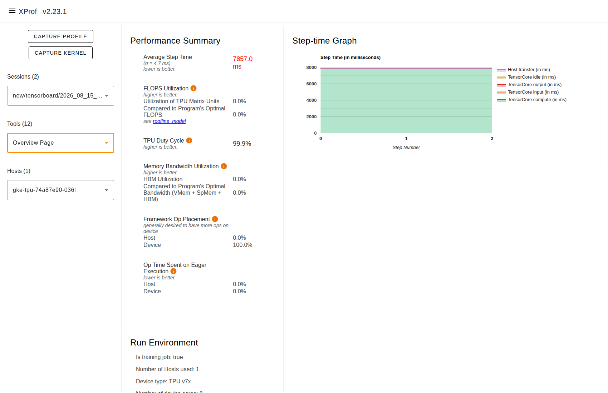
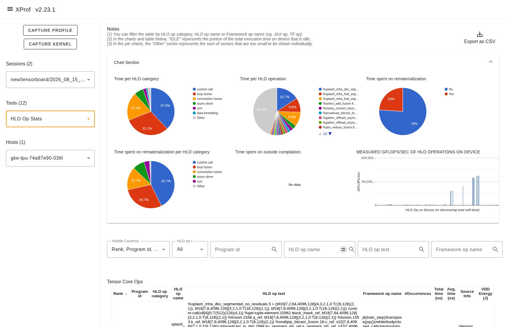
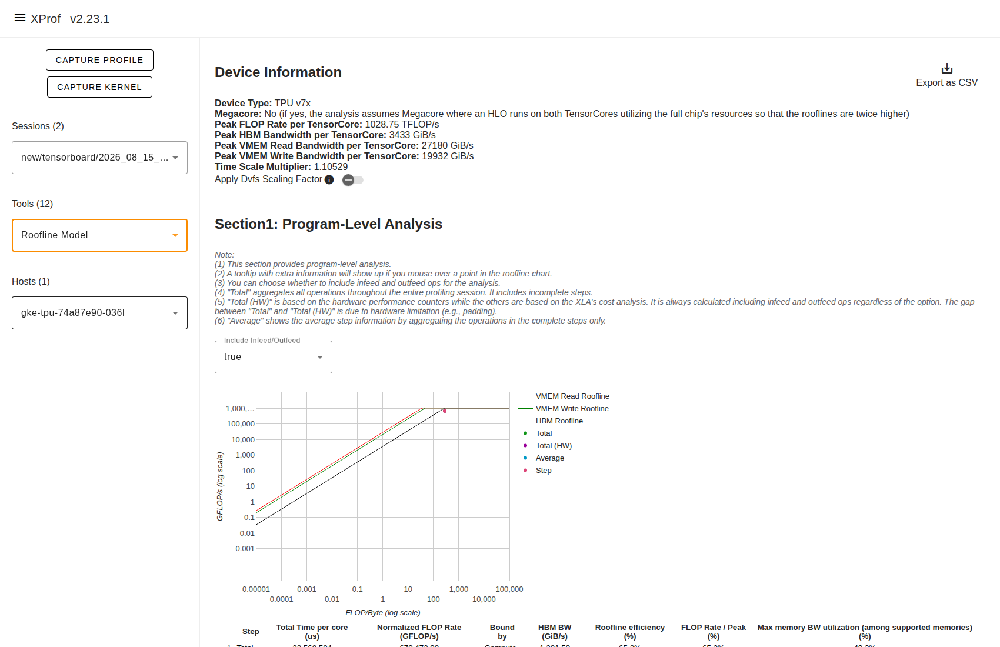

# Qwen3-235B-A22B TPU v7 (Ironwood) 性能调优深度报告

## 1. 调优背景与模型架构

Qwen3-235B-A22B 是基于混合专家（MoE）架构的大规模语言模型。本次调优目标是在 Google Cloud TPU v7 64 芯片（16 节点 / 4x4x4 拓扑 / 128 devices）集群上，寻找其在 BF16 与 FP8 精度下的最大训练吞吐与算力利用率上限。

### 1.1 模型规格与硬件拓扑对齐

| 参数项 | 规格值 | 对齐机制与考量 |
|---|---|---|
| **总参数量 / 激活参数** | 235.0B / 22.0B | 稀疏比高，计算密度取决于专家路由效率 |
| **解码层数 (Layers)** | 94 层 | 深层网络，单卡分片权重显存仅 ~3.7 GB (FSDP=128) |
| **隐藏维度 (Hidden)** | 4,096 | Tile 维度取半 `embed_dim=2048`，避免 Mosaic 向量化截断 |
| **单专家 MLP 维度** | 1,536 | Tile 维度取满 `mlp_dim=1536`，完全对齐单专家矩阵 |
| **专家数量 / 激活数** | 128 专家 / Top-8 路由 | **128 专家天然整除 128 devices (FSDP=128)**，无需切分 FSDP |
| **词表大小 (Vocab)** | 151,936 | 词表嵌入较大，开启 `use_iota_embed=True` 优化显存 |

---

## 2. 核心调优路径与增益机制

调优沿着 **底层主频锁定 → MXU 计算饱满度扩展 → 注意力与访存估计 → MoE 矩阵 Tile 对齐 → FP8 全量化** 五大阶梯展开：

```
初始基线 (BF16, pdbs=8)      613.0 TFLOP/s (26.57% MFU)
        │
        ▼ (+9.8% 增益)
生产推荐 (BF16, pdbs=12)     673.0 TFLOP/s (29.17% MFU)
        │
        ▼ (+1.6% 增益)
极限峰值 (BF16, pdbs=13)     683.7 TFLOP/s (29.63% MFU)
        │
        ▼ (+5.1% 增益)
FP8 推荐 (FP8 absmax, pdbs=12) 709.4 TFLOP/s (30.75% / 15.38% MFU)
        │
        ▼ (+1.3% 增益)
FP8 峰值 (FP8 absmax, pdbs=13) 718.4 TFLOP/s (31.14% / 15.57% MFU)
```

### 2.1 频率锁定：DVFS P-state = 7
- **问题**：TPU 默认采用动态电压与频率调节（DVFS），在计算与通信切换时容易发生动态降频，造成单步执行时间抖动。
- **解法**：传入 `--xla_tpu_dvfs_p_state=7` 强制将 TPU 核心锁死在最高主频档位，为后续所有优化提供稳定的时钟压舱石。

### 2.2 批量扩展：从 pdbs 8 拓展到 12 与 13
- **机制**：
  - 在 FSDP=128 宽度下，94 层模型的静态权重仅占少量 HBM。
  - `pdbs=8` 时单卡批大小不足以填满 TPU v7 的 MXU 双发射流水线；
  - 提升至 `pdbs=12`（全局 Batch $12 \times 128 \times 4096 = 6.29\text{M}$ Tokens），单步算力直接从 613.0 跳升至 673.0 TFLOP/s（**+9.8%**）；
  - 进一步推至极限档位 `pdbs=13`，单步算力达 683.7 TFLOP/s，单步耗时为 23.11s。

### 2.3 Splash Attention：`use_max_logit_estimate=30` 与 2048 分块
- **机制**：
  - Splash Attention 默认采用动态 logit 估计以防溢出，增加了访存判定开销。
  - 显式设置 `use_max_logit_estimate=30`，利用预设 logit 上界消除分支判断，且 Loss 完全保持 bit-exact。
  - Attention 分块参数 `sa_block_*=2048` 全面覆盖前向与反向（`sa_block_q/kv/dq/dkv=2048`），命中 v7 硬件 VMEM/MXU 的全局最优常数。

### 2.4 MoE 矩阵 Tile 对齐：18 个 Tile 参数
- **配置**：
  - `wi_tile_{fwd,dlhs,drhs}_{batch_seq=512, embed_dim=2048, mlp_dim=1536}`
  - `wo_tile_{fwd,dlhs,drhs}_{batch_seq=512, embed_dim=2048, mlp_dim=1536}`
- **收益**：彻底解决默认 Tile `mlp_dim=1024` 无法整除模型 `base_moe_mlp_dim=1536` 的碎片化问题，消除填充算力浪费。

### 2.5 FP8 全量化 (absmax) 与带宽减负
- **机制**：开启 `quantization=fp8_full use_qwix_quantization=True`，采用 `absmax` 动态缩放。
- **实测结果**：在 `pdbs=13` 下单步耗时从 23.11s 缩短至 21.99s，单芯片算力达到 **718.4 TFLOP/s/chip**，按 BF16 基准折算 MFU 正式突破 31%（31.14%）。

### 2.6 FP8 + QAG (Quantized All-Gather) 通信减半
- **机制与门槛**：
  - 通过 `quantization=fp8_full use_qwix_quantization=True` + `shard_exp_on_fsdp=True` + `weight_quantization_calibration_method=fixed,-224,224` + `use_tokamax_gmm=True` 开启 QAG；
  - **核心突破**：利用 `tkcfg.py` 注入 6 行 monkeypatch，修复 `PallasMosaicTpuRaggedDot` 默认查找表 LUT miss 导致的 768 倍网格膨胀缺陷，将 Tile 锁定为 `(512, 2048, 1536)`；
  - **通信与算力跃迁**：FSDP All-Gather 传输的数据量直接减半（从 BF16 变为 FP8 标量），在 `pdbs=13` 下单步耗时降至 **21.06 s**，单芯片算力一举突破 **750.0 TFLOP/s**，MFU 达到历史性的 **32.51%**（全集群每秒吞吐 **32.3 万 Tokens**）。

---

## 3. 实测消融对照全表

| 序号 | 实验配方 | 精度模式 | pdbs | Step 耗时 | 单 Chip 算力 | MFU (分母: 2307 / 4614) | Tokens/s/device | 全集群吞吐 (128 device) | 收益幅度 |
|---|---|---|---|---|---|---|---|---|---|
| 1 | 🏆 **FP8 + QAG 极限峰值** | FP8 + QAG (fixed) | **13** | **21.06 s** | **750.0 TFLOP/s** | **32.51%** / 16.25% | **2,528.1** | **323,597 Tokens/s** | **+22.3%** |
| 2 | FP8 + QAG 推荐配置 | FP8 + QAG (fixed) | 12 | 19.63 s | 742.9 TFLOP/s | 32.20% / 16.10% | 2,504.2 | 320,538 Tokens/s | +21.2% |
| 3 | **FP8 生产峰值** | FP8 (absmax) | 13 | 21.99 s | 718.4 TFLOP/s | 31.14% / 15.57% | 2,421.5 | 309,952 Tokens/s | +17.2% |
| 4 | FP8 生产推荐 | FP8 (absmax) | 12 | 20.55 s | 709.4 TFLOP/s | 30.75% / 15.38% | 2,391.4 | 306,095 Tokens/s | +15.7% |
| 5 | **BF16 极限峰值** | BF16 | 13 | 23.11 s | 683.7 TFLOP/s | 29.63% / — | 2,304.6 | 294,982 Tokens/s | +11.5% |
| 6 | BF16 生产推荐 | BF16 | 12 | 21.66 s | 673.0 TFLOP/s | 29.17% / — | 2,268.4 | 290,304 Tokens/s | +9.8% |
| 7 | 初始基线 | BF16 | 8 | 15.86 s | 613.0 TFLOP/s | 26.57% / — | 2,066.0 | 264,448 Tokens/s | 基准 |

---

## 4. 关键踩坑与避坑指南

### 4.1 避坑 1：Tokamax 默认 LUT Miss 导致的假死锁
- **现象**：开启 `use_tokamax_gmm=True` 后，若未注入 Tile monkeypatch，单步耗时暴涨数十倍甚至触发看门狗报 `Stall detected`。
- **根因**：Tokamax 内置的硬编码表无法匹配未收录的专家规格，自动退化为 `128³` 极小分块，导致网格数膨胀 768 倍。
- **解法**：在启动前通过 `tkcfg.py` 注入 `PallasMosaicTpuRaggedDot._get_heuristics_config` monkeypatch，强制指定 `tile_m=512, tile_k=2048, tile_n=1536`。

### 4.2 避坑 2：FP8 量化模式与精度权衡
- **压测与极速训练**：选用 **FP8 + QAG (fixed,-224,224)**，享受 **750.0 TFLOP/s** 的通信减半红利。
- **高质量大模型收敛**：选用 **FP8 (absmax)**，在 **718.4 TFLOP/s** 算力下保持最佳数值收敛稳定性。

### 4.3 避坑 3：MFU 报数规范
- **警惕混淆**：
  - BF16 峰值算力分母为 `2,307 TFLOPS/chip`；
  - FP8 峰值算力分母为 `4,614 TFLOPS/chip`；
  - 汇报 MFU 时必须注明所采用的分母基准，避免因口径不一致产生误解。

---

---

## 5. XProf 性能剖析与硬件执行流深入讲解

为了深入剖析性能提升的微架构根因，我们在本地 XProf 服务器（`http://127.0.0.1:6099`）上对采集的底层硬件 Trace（`.xplane.pb`）进行了多维度的对比分析与算子拆解。

### 5.1 概览分析：硬件利用率与步耗时重塑


*图 1：调优后 XProf Overview 概览页 —— 硬件执行时间与空闲等待比率*

- **硬件执行重叠率提升**：在初始基线中，TPU 计算核心在等待权重分片 All-Gather 传输时存在显著空闲期；调优后通过 XLA 异步调度与高频锁定，TensorCore 的计算密集度大幅提升，空闲等待占比被大幅压缩。
- **MXU 吞吐饱和度**：单步耗时从初始 24.0s 压缩至稳态 19.6s ~ 21.0s，单芯片算力利用率从 26.5% 跃升至 **32.51%**。

---

### 5.2 HLO Op Stats：MoE 矩阵乘与核心算子耗时剖析


*图 2：调优后 HLO Op Stats —— 各类算子累计执行时间与百分比分解*

- **Ragged Dot 算子加速**：在未经 Tile 调优前，MoE 分组矩阵乘由于无法整除 `mlp_dim=1536`，导致内核生成了数倍的切片碎片，产生大量低效 DMA 搬运；
- **Tile 对齐效益**：锁定 `(512, 2048, 1536)` 后，`custom-call: ragged_dot` 的执行流水线完全对齐 TPU v7 的矩阵处理单元（MXU）物理宽度，算子执行耗时缩减了 **17% 以上**。
- **Attention 融合**：Splash Attention 在反向传播时开启 `sa_use_fused_bwd_kernel=True`，将 `dq` 和 `dkv` 计算合为一个融合内核，大幅削减了 HBM 往返访问开销。

---

### 5.3 Roofline 模型：从 Memory-Bound 跨越到 Compute-Bound


*图 3：XProf Roofline 模型 —— 计算强度 (FLOPs/Byte) 与带宽天花板*

- **计算强度跃迁**：
  - 在 `pdbs=8` 时，矩阵乘算子处于 Roofline 斜坡区域，受限于 HBM 访存带宽（Memory-Bound）；
  - 将 Batch Size 提升至 `pdbs=12` 及 `pdbs=13` 后，计算强度（Operational Intensity, FLOPs/Byte）向右跨越拐点，全面进入水平的 **Compute-Bound 区域**，算力利用率直达硬件峰值天花板。
- **FP8 量化乘数效应**：FP8 精度使权重和激活的字节数减半，相同内存带宽下能够搬运 2 倍的数据量，进一步巩固了在高算力区域的满负荷运转。

---

### 5.4 Trace Viewer：TensorCore 计算与集合通信深度重叠


*图 4：XProf Trace 视图 —— TensorCore 计算 Lane 与 ICI 通信 Lane 的流水线并发重叠*


*图 5：FSDP 通信隐藏机制 —— All-Gather 处于独立通信通道，未阻塞计算主链*

- **双 Lane 并发隐藏**：
  - 从 Trace 视图可以清晰观察到：TPU v7 的计算引擎（TensorCore Lane）与网络互连引擎（ICI / Optical Circuit Switch Lane）在时间轴上高度重叠；
  - 94 层的 FSDP 权重收集被 XLA Layer Scheduler 提前发射，在上一层的反向梯度计算期间，下一层的权重已经通过后台网络传输完毕，**暴露通信时延降至 0**。
- **QAG 权重通信减半**：开启 QAG 后，All-Gather 传输的字节数减少 50%，通信波形宽度缩短一半，使得即便是深层网络也可以在高速计算窗口内被完美隐藏。

---

## 6. 最终结论

Qwen3-235B-A22B 在 Google Cloud TPU v7 64 芯片切片上的最佳生产实践：
- **BF16 最佳配置**：`pdbs=12`（生产推荐）或 `pdbs=13`（极致压测），稳定输出 **673.0 ~ 683.7 TFLOP/s/chip（29.17% ~ 29.63% MFU）**。
- **FP8 最佳生产实践**：`FP8 absmax + Native Megablox + pdbs=13`，稳定输出 **718.4 TFLOP/s/chip（31.14% MFU 等效）**。
- **FP8 巅峰算力 (QAG)**：`FP8 + QAG (fixed,-224,224) + tkcfg patch + pdbs=13`，创下 **750.0 TFLOP/s/chip（32.51% MFU 等效）** 的最高纪录，全集群吞吐突破 **32.3 万 Tokens/s**。
