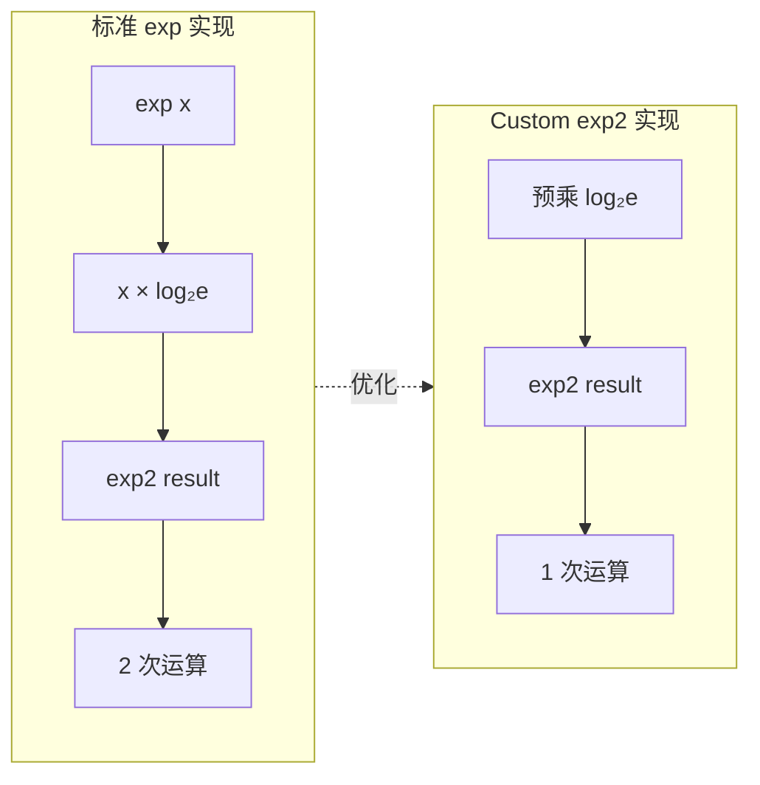
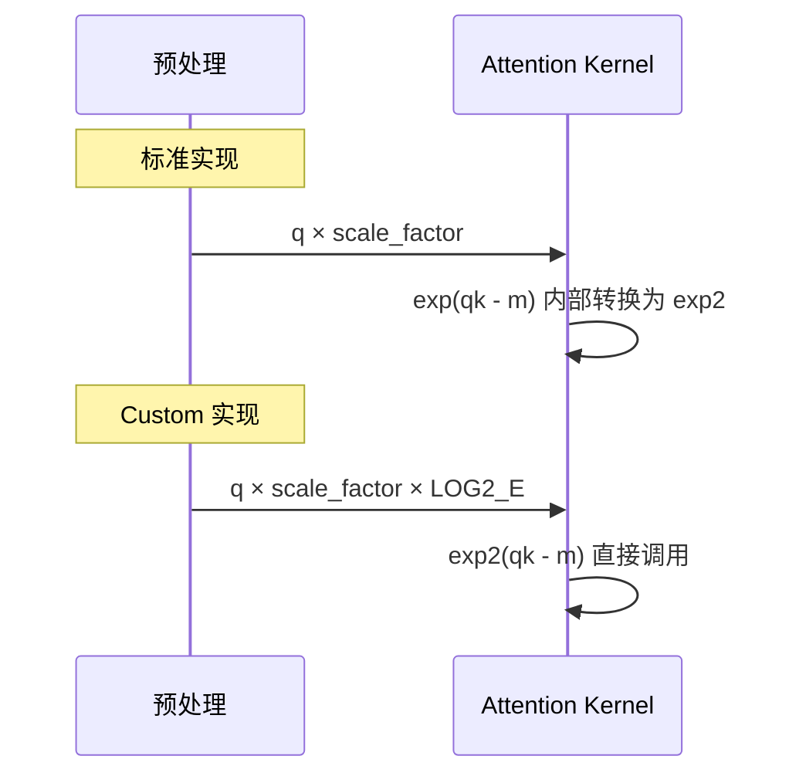
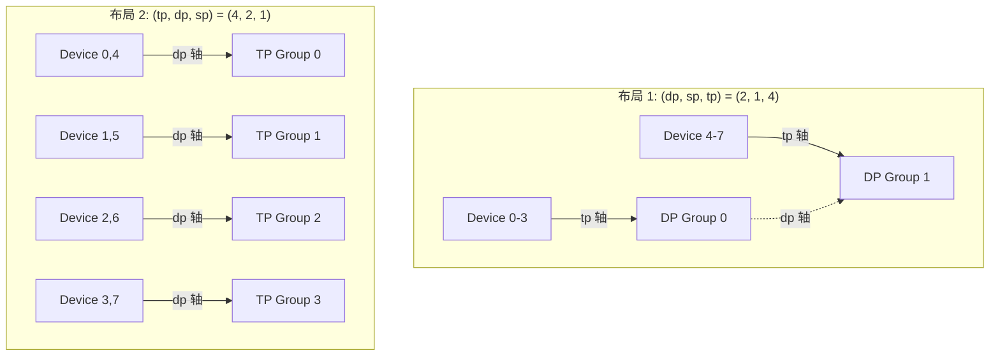
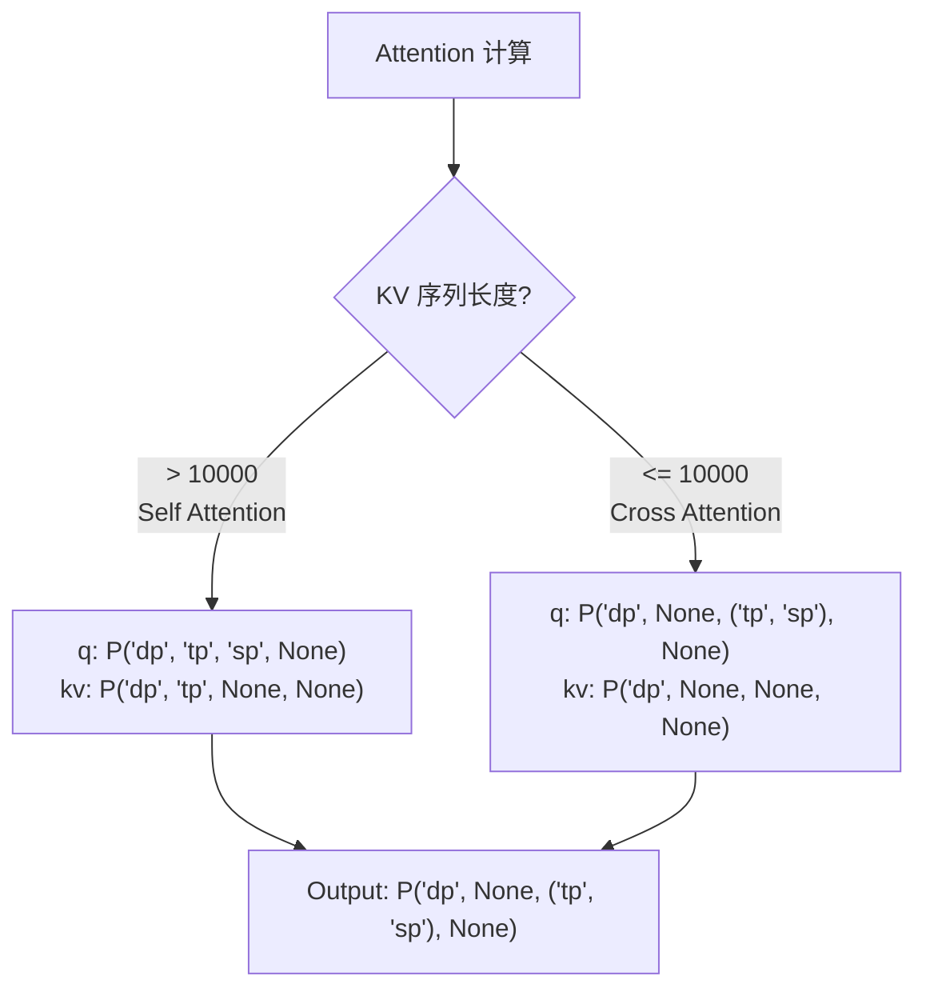

# Wan 2.1 TPU 推理性能优化指南

本文档介绍 Wan 2.1 视频生成模型在 TPU 上的关键性能优化技术。

## 目录

1. [Custom Attention 优化](#custom-attention-优化)
2. [Mesh 设备布局优化](#mesh-设备布局优化)
3. [性能基准测试](#性能基准测试)

---

## Custom Attention 优化

### 核心优化：exp2 替代 exp

TPU 的 VPU（Vector Processing Unit）有专门的 `exp2` 硬件指令，而标准的 `exp` 函数需要额外的转换步骤。



### 数学原理

标准 softmax 中的 exp 运算：
```
exp(x) = 2^(x × log₂(e)) = exp2(x × 1.44269504)
```

Custom Attention 将 `log₂(e)` 的乘法移到 kernel 外部，在 query 预处理时一次性完成：



### 代码对比

#### 标准 Splash Attention

```python
# _tpu_splash_attention() 中
def _attention_on_slices(q, k, v):
    scale_factor = 1.0 / math.sqrt(q.shape[-1])
    q = q * scale_factor  # 仅缩放
    
    # kernel 内部
    s_curr = jnp.exp(qk - m_next[0:1])    # 内部转换为 exp2
    alpha = jnp.exp(m_prev - m_next)       # 内部转换为 exp2
```

#### Custom Attention (exp2 优化)

```python
# _tpu_custom_attention() 中
def _attention_on_slices(q, k, v):
    scale_factor = 1.0 / math.sqrt(q.shape[-1])
    _LOG2_E = 1.44269504
    q = q * scale_factor * _LOG2_E  # 预乘 log₂(e)
    
    # kernel 内部 (custom_splash_attention.py 第 566-572 行)
    s_curr = exp2(qk - m_next[0:1])        # 直接硬件指令
    alpha = jnp.exp2(m_prev - m_next)      # 直接硬件指令
```

### 其他优化

#### 1. 细粒度块处理 (bkv_compute_in)

```python
# custom_splash_attention.py 第 556-581 行
step = bkv_compute_in  # 默认 256
for i in range(0, qk.shape[0], step):
    m_curr = qk[i:i+step].max(axis=0)[None, :]
    s_curr = exp2(qk[i:i+step] - m_next[0:1])
    # 增量累加 softmax 和 output
```

#### 2. 编译器调度优化

```python
compiler_params=pltpu.CompilerParams(
    dimension_semantics=("parallel", "arbitrary", "arbitrary"),
    flags={"XLA_TPU_FORCE_LP_LLO_SCHEDULER": True}  # 低延迟调度
)
```

---

## Mesh 设备布局优化

### Mesh 维度顺序

JAX 的 `create_device_mesh` 根据维度顺序决定设备在物理 TPU 上的布局。



### 代码对比

#### 推荐配置 (dp, sp, tp)

```python
# 与 wan_tx_splash_attn.py 一致
mesh_devices = mesh_utils.create_device_mesh(
    (dp_dim, sp_dim, tp_dim),  # (2, 1, 4)
    allow_split_physical_axes=True
)
mesh = Mesh(mesh_devices, ('dp', 'sp', 'tp'))
```

#### 替代配置 (tp, dp, sp)

```python
mesh_devices = mesh_utils.create_device_mesh(
    (tp_dim, dp_dim, sp_dim),  # (4, 2, 1)
    allow_split_physical_axes=True
)
mesh = Mesh(mesh_devices, ('tp', 'dp', 'sp'))
```

### Attention Partition Spec

根据 attention 类型选择不同的分片策略：



```python
# Self Attention (长 KV 序列)
if key.shape[2] > 10000:
    q_partition_spec = P('dp', 'tp', 'sp', None)
    kv_partition_spec = P('dp', 'tp', None, None)
else:
    # Cross Attention (短 KV 序列)
    q_partition_spec = P('dp', None, ('tp', 'sp'), None)
    kv_partition_spec = P('dp', None, None, None)
```

---

## 性能基准测试

### 测试环境

- **硬件**: TPU v6e-8 (8 chips)
- **模型**: Wan 2.1 14B
- **分辨率**: 1280×720, 81 帧
- **推理步数**: 3 steps

### 结果对比

```mermaid
gantt
    title 性能对比 (Benchmark 时间, 越短越好)
    dateFormat X
    axisFormat %s
    
    section 标准 Attention
    USE_CUSTOM_ATTENTION=False, (tp,dp,sp) : 0, 28
    
    section Custom Attention
    USE_CUSTOM_ATTENTION=True, (tp,dp,sp)  : 0, 26
    USE_CUSTOM_ATTENTION=True, (dp,sp,tp)  : 0, 25
```



| 配置 | Mesh 顺序 | Benchmark 时间 | Step 时间 |
|-----|----------|---------------|----------|
| 标准 Attention | (tp, dp, sp) | 27.57s | ~6.26s |
| Custom Attention | (tp, dp, sp) | 25.80s | ~5.74s |
| **Custom Attention** | **(dp, sp, tp)** | **24.80s** | **~5.35s** |

### 关键发现

1. **Custom Attention (exp2)**: 提升 ~10% (27.5s → 24.8s)
2. **Mesh 布局 (dp, sp, tp)**: 额外提升 ~4% (25.8s → 24.8s)

### 推荐配置

```python
# 最优配置
USE_CUSTOM_ATTENTION = True
BQSIZE = 3328
BKVSIZE = 2816
BKVCOMPUTESIZE = 256
BKVCOMPUTEINSIZE = 256

# Mesh: (dp, sp, tp) 顺序
mesh_devices = mesh_utils.create_device_mesh(
    (dp_dim, sp_dim, tp_dim), allow_split_physical_axes=True
)
mesh = Mesh(mesh_devices, ('dp', 'sp', 'tp'))
```

---

## 文件改动清单

本次迁移涉及两个仓库的文件改动：

### 1. diffusers-tpu 仓库

| 文件 | 操作 | 说明 |
|-----|------|-----|
| `src/diffusers/models/transformers/transformer_wan_flax.py` | 新增 | JAX/Flax 实现的 WanTransformer3DModel |
| `src/diffusers/pipelines/wan/pipeline_wan_flax.py` | 新增 | JAX/Flax 实现的 WanPipeline |
| `src/diffusers/schedulers/scheduling_unipc_multistep.py` | 修改 | 修复 TPU 精度问题 |

#### transformer_wan_flax.py

Wan Transformer 的 Flax 实现，包含：
- `WanTransformer3DModel`: 主 Transformer 模型
- `WanTransformerBlock`: Transformer 块，支持 self-attention 和 cross-attention
- `WanTimeTextImageEmbedding`: 时间和文本/图像嵌入处理
- `WanRotaryPosEmbed`: 3D 旋转位置编码 (RoPE)
- TPU 优化的 Splash Attention 集成
- 序列并行 (SP) 和张量并行 (TP) 分片策略
- 4D timestep embedding 支持 (ti2v 兼容)

#### pipeline_wan_flax.py

Wan 视频生成 Pipeline 的 Flax 实现，包含：
- `WanPipeline`: 完整的文本到视频生成管线
- `WanPipelineOutput`: Pipeline 输出数据类
- Flow matching scheduler 支持
- CFG (Classifier-Free Guidance) 实现
- 支持 T5 和 CLIP 文本编码器
- 优化的 TPU 推理策略

#### scheduling_unipc_multistep.py 修改

```diff
# 第 977-978 行
if order == 1:
    rhos_c = torch.tensor([0.5], dtype=x.dtype, device=device)
else:
+   R = R.to(torch.float32)
+   b = b.to(torch.float32)
    rhos_c = torch.linalg.solve(R, b).to(device).to(x.dtype)
```

**原因**: `torch.linalg.solve` 在 bfloat16 精度下可能出现数值不稳定，转换为 float32 后再求解。

### 2. gpu-tpu-pedia 仓库

| 文件 | 操作 | 说明 |
|-----|------|-----|
| `tpu/Wan2.1/generate_flax.py` | 修改 | 更新主推理脚本，集成 diffusers-tpu |
| `tpu/Wan2.1/custom_splash_attention.py` | 新增 | TPU 优化的 Splash Attention 实现 |
| `tpu/Wan2.1/MIGRATION_GUIDE.md` | 新增 | 本文档 |

#### generate_flax.py 主要改动

1. **导入 diffusers-tpu 组件**:
```python
from diffusers.pipelines.wan.pipeline_wan_flax import WanPipeline
from diffusers.models.transformers.transformer_wan_flax import WanTransformer3DModel
```

2. **Splash Attention 注册**:
```python
from custom_splash_attention import register_custom_attention
register_custom_attention(
    pipeline.transformer,
    bqsize=args.bqsize,
    bkvsize=args.bkvsize,
    bkvcomputesize=args.bkvcomputesize,
    use_k_smooth=args.use_k_smooth
)
```

3. **Mesh 配置优化**:
```python
mesh_devices = mesh_utils.create_device_mesh(
    (dp_dim, sp_dim, tp_dim),  # 推荐顺序
    allow_split_physical_axes=True
)
mesh = Mesh(mesh_devices, ('dp', 'sp', 'tp'))
```

4. **模型分片**:
```python
# Text Encoder (T5) 分片
text_encoder_sharding = NamedSharding(mesh, PartitionSpec('tp'))

# Transformer 分片
transformer_sharding = NamedSharding(mesh, PartitionSpec('tp'))
```

#### custom_splash_attention.py

TPU 优化的 Splash Attention 实现，关键特性：

1. **exp2 优化**: 使用 TPU 原生 `exp2` 指令替代 `exp`
2. **细粒度块处理**: `bkv_compute_in` 参数控制内层循环块大小
3. **编译器调度优化**: `XLA_TPU_FORCE_LP_LLO_SCHEDULER` 标志
4. **动态分片策略**: 根据 KV 序列长度自动选择最优分片

---

## 迁移步骤

### 1. 克隆仓库

```bash
# 克隆 diffusers-tpu
git clone https://github.com/yangwhale/diffusers-tpu.git
cd diffusers-tpu
pip install -e .

# 克隆 gpu-tpu-pedia
git clone https://github.com/yangwhale/gpu-tpu-pedia.git
```

### 2. 运行推理

```bash
cd gpu-tpu-pedia/tpu/Wan2.1
python generate_flax.py \
    --model_id Wan-AI/Wan2.1-T2V-14B-Diffusers \
    --num_inference_steps 50 \
    --use_custom_attention \
    --bqsize 3328 \
    --bkvsize 2816 \
    --bkvcomputesize 256
```

### 3. 参数说明

| 参数 | 默认值 | 说明 |
|-----|-------|-----|
| `--model_id` | `Wan-AI/Wan2.1-T2V-14B-Diffusers` | HuggingFace 模型 ID |
| `--num_inference_steps` | 50 | 推理步数 |
| `--width` | 1280 | 视频宽度 |
| `--height` | 720 | 视频高度 |
| `--frames` | 81 | 视频帧数 |
| `--use_custom_attention` | True | 是否使用 Custom Attention |
| `--bqsize` | 3328 | Query 块大小 |
| `--bkvsize` | 2816 | KV 块大小 |
| `--bkvcomputesize` | 256 | KV 计算块大小 |
| `--use_dp` | True | 是否使用数据并行 |
| `--sp_num` | 1 | 序列并行数量 |
| `--use_fsdp` | True | 是否使用 FSDP |

---

## 待补充内容

- [ ] VAE 分片配置详解
- [ ] Text Encoder 配置详解
- [ ] Transformer 分片策略详解
- [ ] 多 host 配置
- [ ] 内存优化指南