# TPU Splash Attention 完全指南

> 🎯 本文用大白话讲解 Google TPU 上的 Splash Attention 实现，适合想深入理解 TPU 编程的开发者。

---

## 📖 目录

1. [一句话总结](#一句话总结)
2. [这个 Kernel 到底在干什么？](#这个-kernel-到底在干什么)
3. [特点与优缺点](#特点与优缺点)
4. [核心算法：在线 Softmax](#核心算法在线-softmax)
5. [TPU 硬件适配](#tpu-硬件适配)
6. [代码逐行解析](#代码逐行解析)
7. [分布式执行策略](#分布式执行策略)
8. [常见问题](#常见问题)

---

## 这个 Kernel 到底在干什么？

### 背景：Attention 的痛点

Transformer 的核心是 Self-Attention：

```
Attention(Q, K, V) = softmax(Q @ K^T / √d) @ V
```

问题来了：当序列长度 N = 4096 时，`Q @ K^T` 产生一个 **4096 × 4096 = 1600万** 个元素的矩阵！

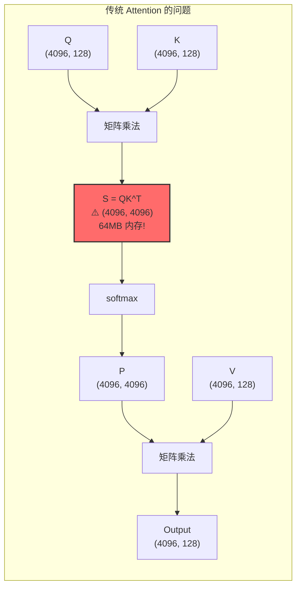

### 解决方案：分块 + 在线更新

Splash Attention 的核心思想：**不存储完整的 S 矩阵，而是分块计算并在线更新结果**。

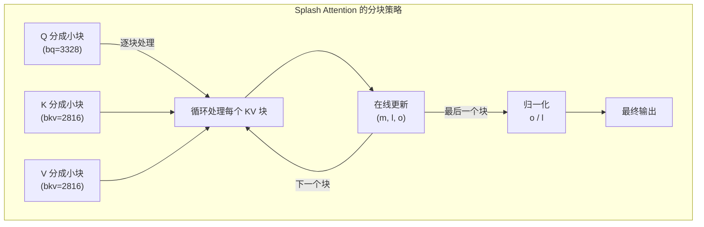

**关键洞察**：通过维护三个统计量 `(m, l, o)`，可以增量更新 softmax 结果，不需要一次看到所有数据！

---

## 特点与优缺点

### ✅ 优点

| 优点 | 说明 |
|------|------|
| **内存效率** | O(N) 而非 O(N²)，长序列不再爆内存 |
| **exp2 优化** | 利用 TPU VPU 的 exp2 硬件指令，比 exp 快 |
| **分块计算** | 数据留在片上 VMEM，减少 HBM 访问 |
| **多核并行** | 自动利用 TPU 的多核架构 |
| **GQA 支持** | 支持 Grouped Query Attention，多个 Q head 共享 KV |

### ❌ 缺点

| 缺点 | 说明 |
|------|------|
| **Sublane 冗余** | 统计量用 (8, bq) 存储，实际只需要 (bq,)，7/8 VPU 算力浪费 |
| **块大小固定** | 需要 padding，短序列可能浪费计算 |
| **代码复杂** | Pallas 编程门槛高，调试困难 |
| **无反向传播** | 当前实现只有前向，backward 需要另外实现 |

### 📊 性能数据（参考）

```
序列长度    传统方法内存    Splash 内存    加速比
1024        4 MB           ~1 MB          1.2x
4096        64 MB          ~4 MB          2.5x
16384       1 GB           ~16 MB         5x+
```

---

## 核心算法：在线 Softmax

### (m, l, o) 三元组是什么？

在线 Softmax 的核心是维护三个统计量 **(m, l, o)**：

| 变量 | 含义 | 数学定义 | 形状 |
|------|------|----------|------|
| **m** | **m**ax：当前看到的最大值 | `m = max(qk)` | `(8, bq)` |
| **l** | **l**ogsum：exp 的累加和 | `l = Σ exp(qk - m)` | `(8, bq)` |
| **o** | **o**utput：未归一化的输出 | `o = Σ exp(qk - m) × V` | `(head_dim, bq)` |

### ⚠️ 关键问题：每个 Q 都有一套 (m, l, o) 吗？

**是的！每个 Query token 都有自己独立的 (m, l, o)！**

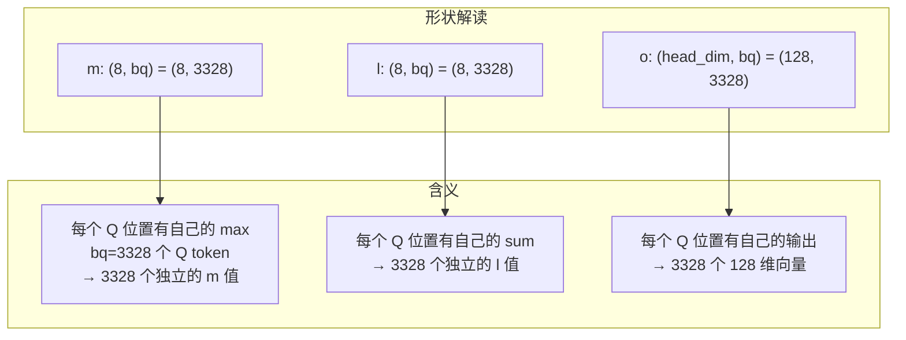

**为什么每个 Q 都要单独存？**

因为 Attention 的本质是：**每个 Query 独立地对所有 Key-Value 做加权求和**。

```
对于 Q 中的第 i 个 token (q_i):
  - m[i] = max over all K: (q_i · k_j) 对所有 j 的最大值
  - l[i] = Σ_j exp(q_i · k_j - m[i])
  - o[i] = Σ_j exp(q_i · k_j - m[i]) × v_j
  
最终输出: output[i] = o[i] / l[i]
```

**不是全局一个 m！** 每个 Query token 看到的 Key 的"最相关程度"是不同的，所以 max 值也不同。

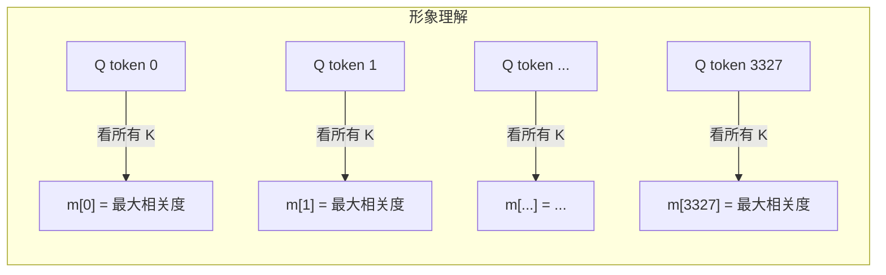

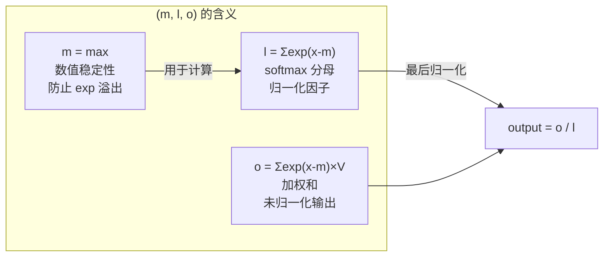

**为什么需要这三个量？**

传统 softmax 需要两遍扫描数据：
1. 第一遍：求 max（数值稳定性）
2. 第二遍：计算 exp 和 sum

在线 softmax 只需一遍扫描，通过 **(m, l, o)** 增量更新：
- 每次只看一小块数据
- 更新 m、l、o
- 最后用 l 归一化 o

### 传统 Softmax 的问题

```python
# 传统 softmax 需要两遍扫描
def softmax(x):
    max_val = x.max()           # 第一遍：求 max（数值稳定性）
    exp_x = exp(x - max_val)    # 第二遍：计算 exp
    sum_exp = exp_x.sum()       # 还需要求和
    return exp_x / sum_exp      # 最后归一化
```

**问题**：如果 x 太大存不下，怎么分块计算？

### 在线 Softmax 的魔法

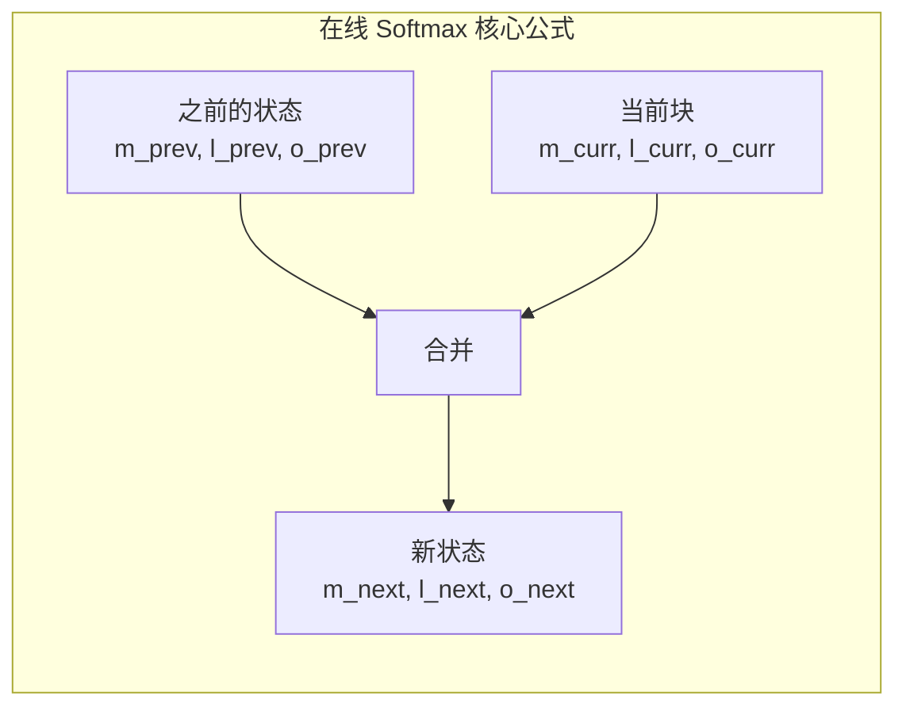

**核心公式**：

```
m_next = max(m_prev, m_curr)
α = exp(m_prev - m_next)       # 旧状态的缩放因子
β = exp(m_curr - m_next)       # 新状态的缩放因子

l_next = α * l_prev + β * l_curr
o_next = α * o_prev + β * o_curr
```

**直觉理解**：当 max 变大时，之前的 exp 值需要缩小（因为 exp(x-max) 变小了）。

### 代码示例

```python
# 在线更新伪代码
def online_softmax_update(m_prev, l_prev, o_prev, qk_block, v_block):
    # 1. 计算当前块的 max
    m_curr = qk_block.max()
    
    # 2. 更新全局 max
    m_next = max(m_prev, m_curr)
    
    # 3. 计算缩放因子
    alpha = exp2(m_prev - m_next)  # 用 exp2！
    
    # 4. 计算当前块的贡献
    s_curr = exp2(qk_block - m_next)
    l_curr = s_curr.sum()
    o_curr = s_curr @ v_block
    
    # 5. 合并
    l_next = alpha * l_prev + l_curr
    o_next = alpha * o_prev + o_curr
    
    return m_next, l_next, o_next
```

---

## TPU 硬件适配

### TPU 架构概览

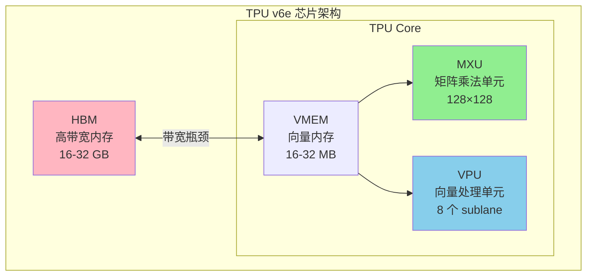

### 关键优化点

#### 1. exp2 替代 exp

```python
# TPU VPU 有 exp2 硬件指令，但没有高效的 exp
# 数学转换：exp(x) = 2^(x * log2(e))

LOG2_E = 1.44269504  # log₂(e)

# 预处理：在调用 kernel 前将 Q 乘以 LOG2_E
q = q * scale * LOG2_E

# kernel 内部直接用 exp2
s = jnp.exp2(qk - max)  # 而不是 jnp.exp(qk - max)
```

#### 2. 块大小选择

```python
BQSIZE = 3328          # Query 块大小 = 26 × 128
BKVSIZE = 2816         # KV 块大小 = 22 × 128
BKVCOMPUTESIZE = 256   # 内层计算块 = 2 × 128
```

**为什么是这些数字？**

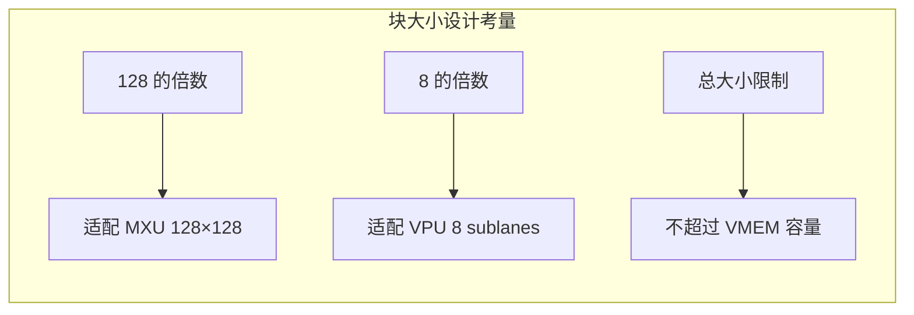

#### 3. NUM_SUBLANES = 8 的秘密

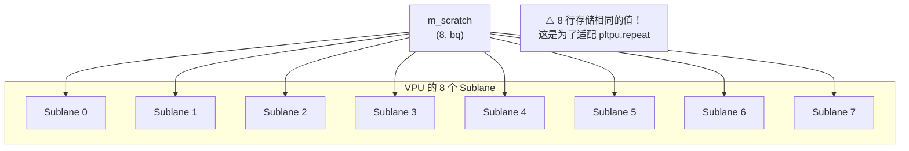

**为什么冗余存储？** 见 [常见问题](#为什么-m_scratch-是-8-bq-而不是-bq)。

---

## 代码逐行解析

### 整体结构

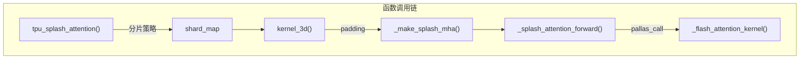

### Kernel 核心代码

```python
def _flash_attention_kernel(
    q_ref,           # Query 块，形状 (bq, head_dim)
    k_ref,           # Key 块，形状 (bkv, head_dim)
    v_ref,           # Value 块，形状 (bkv, head_dim)
    m_scratch_ref,   # max 临时存储，形状 (8, bq)
    l_scratch_ref,   # sum 临时存储，形状 (8, bq)
    o_scratch_ref,   # 输出累积器，形状 (head_dim, bq)
    o_ref,           # 最终输出，形状 (head_dim, bq)
    *,
    mask_value, grid_width, bq, bkv, bkv_compute, bkv_compute_in, head_dim_v,
):
```

#### 阶段 1：初始化（j=0 时）

```python
@pl.when(j == 0)
def init():
    o_scratch_ref[...] = jnp.zeros_like(o_scratch_ref)  # 输出清零
    m_scratch_ref[...] = jnp.full_like(m_scratch_ref, mask_value)  # max = -inf
    l_scratch_ref[...] = jnp.zeros_like(l_scratch_ref)  # sum = 0
```

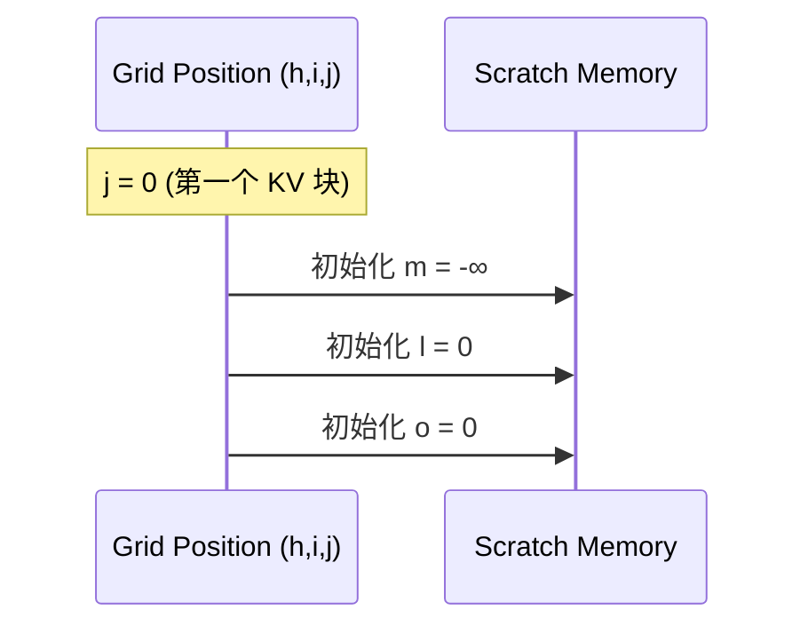

#### 阶段 2：主循环

```python
def body(kv_compute_index, _):
    # 读取 Q 和 K 块
    q = q_ref[...]                        # (bq, head_dim)
    k = k_ref[slice_k, :]                 # (bkv_compute, head_dim)
    
    # 计算 QK^T（在 MXU 上执行）
    qk = lax.dot_general(k, q, NT_DIM_NUMBERS)  # (bkv_compute, bq)
    
    # 在线 softmax 更新
    for i in range(0, qk.shape[0], step):
        m_curr = qk[i:i+step].max(axis=0)
        m_next = jnp.maximum(m_prev, m_curr)
        
        s_curr = jnp.exp2(qk[i:i+step] - m_next)  # ← exp2 优化！
        l_curr = s_curr.sum(axis=0)
        
        alpha = jnp.exp2(m_prev - m_next)
        l_next = l_curr + alpha * l_prev
        
        o_curr = lax.dot_general(v[i:i+step], s_curr, ...)  # S @ V
        o_prev = alpha * o_prev + o_curr
```

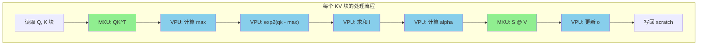

#### 阶段 3：归一化（最后一个 j）

```python
@pl.when(j == grid_width - 1)
def end():
    l = l_scratch_ref[...]                          # (8, bq)
    l_inv = pltpu.repeat(1.0 / l, repeats, axis=0)  # 扩展到 (head_dim, bq)
    o_ref[...] = o_scratch_ref[...] * l_inv         # 归一化
```

---

## 分布式执行策略

### 策略选择逻辑

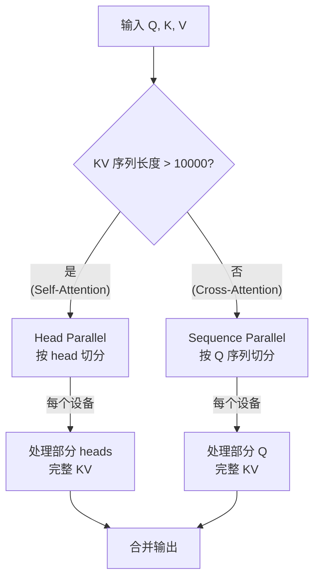

### Head Parallel vs Sequence Parallel

| 特性 | Head Parallel | Sequence Parallel |
|------|---------------|-------------------|
| **适用场景** | 长序列 Self-Attention | 短序列 Cross-Attention |
| **切分维度** | Q/K/V 的 head 维度 | Q 的 sequence 维度 |
| **KV 存储** | 每个设备只有部分 KV | 每个设备有完整 KV |
| **通信开销** | 无 | 需要广播 KV |
| **阈值** | kv_seq_len > 10000 | kv_seq_len ≤ 10000 |

### 代码示例

```python
# 长 KV 序列（self-attention）使用 head parallel
if kv_seq_len > 10000:
    q_spec = P(dp_mesh_key, remain_mesh_key, None, None)  # head 维度切分
    kv_spec = P(dp_mesh_key, remain_mesh_key, None, None)
else:
    # 短 KV 序列（cross-attention）使用 sequence parallel
    q_spec = P(dp_mesh_key, None, remain_mesh_key, None)  # seq 维度切分
    kv_spec = P(dp_mesh_key, None, None, None)            # KV 不切分
```

---

## 常见问题

### 为什么 m_scratch 是 (8, bq) 而不是 (bq)？

**简短回答**：这是 TPU 硬件和 Pallas 框架的要求。

**详细解释**：

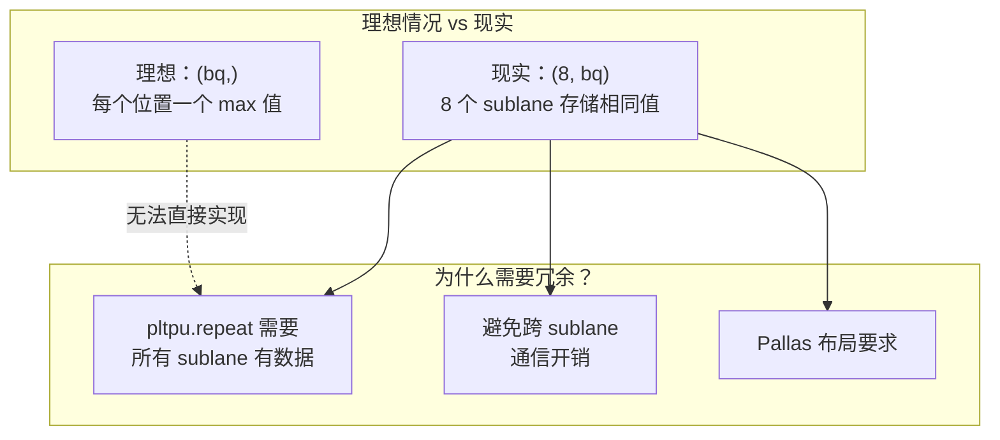

**这不是浪费算力吗？**

是的，VPU 上 7/8 的算力被"浪费"了。但是：

1. **MXU 才是主角**：QK^T 和 S@V 占用 >90% 计算时间
2. **VPU 操作很少**：max/sum/exp2 只是配角
3. **通信成本更高**：如果分布存储，需要 sublane 间通信

### 为什么用 exp2 而不是 exp？

```python
# TPU VPU 硬件特性：
# - exp2 (2^x): 单周期硬件指令 ⚡
# - exp (e^x): 需要多周期软件模拟 🐢

# 数学转换：
# exp(x) = e^x = 2^(x × log₂(e)) = exp2(x × 1.44269504)

# 实现技巧：预乘 LOG2_E，避免内核中的额外乘法
q = q * scale * LOG2_E  # 在 kernel 外做一次
s = jnp.exp2(qk - max)  # kernel 内直接用 exp2
```

### 块大小为什么是 3328 和 2816？

```
BQSIZE = 3328 = 26 × 128
BKVSIZE = 2816 = 22 × 128
```

1. **128 的倍数**：适配 MXU 的 128×128 矩阵乘法单元
2. **8 的倍数**：适配 VPU 的 8 个 sublane
3. **VMEM 容量限制**：块太大会溢出片上内存
4. **经验调优**：这些值是实验得出的最佳点

### 如何调试 Pallas Kernel？

```python
# 设置 interpret=True 使用 Python 解释执行
splash_kernel = _make_splash_mha(block_sizes, bkv_compute_in, interpret=True)

# 可以添加 print 和断点（仅 interpret 模式）
```

---

## 总结

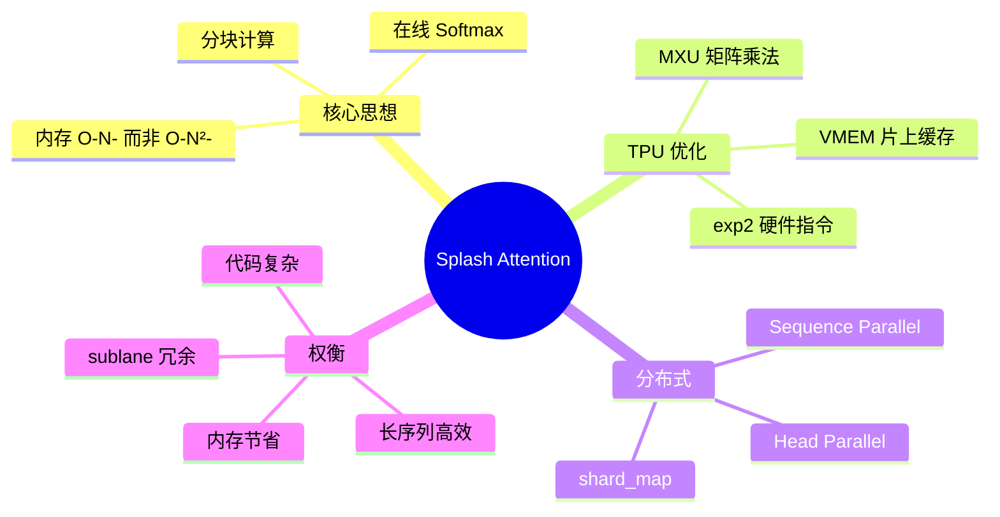

---

## 参考资料

- [Flash Attention 论文](https://arxiv.org/abs/2205.14135) - Tri Dao et al.
- [Flash Attention 2 论文](https://arxiv.org/abs/2307.08691) - Tri Dao
- [JAX Pallas 文档](https://jax.readthedocs.io/en/latest/pallas/)
- [TPU 系统架构](https://cloud.google.com/tpu/docs/system-architecture)

---

*最后更新: 2024-12*
