# TPU Splash Attention 完全指南

> 🎯 本文用大白话讲解 Google TPU 上的 Splash Attention 实现，适合想深入理解 TPU 编程的开发者。

---

## 📖 目录

1. [一句话总结](#一句话总结)
2. [这个 Kernel 到底在干什么？](#这个-kernel-到底在干什么)
3. [特点与优缺点](#特点与优缺点)
4. [核心算法：在线 Softmax](#核心算法在线-softmax)
5. [TPU 硬件适配](#tpu-硬件适配)
6. [代码逐行解析](#代码逐行解析)
7. [分布式执行策略](#分布式执行策略)
8. [常见问题](#常见问题)

---

## 这个 Kernel 到底在干什么？

### 背景：Attention 的痛点

Transformer 的核心是 Self-Attention：

```
Attention(Q, K, V) = softmax(Q @ K^T / √d) @ V
```

问题来了：当序列长度 N = 4096 时，`Q @ K^T` 产生一个 **4096 × 4096 = 1600万** 个元素的矩阵！

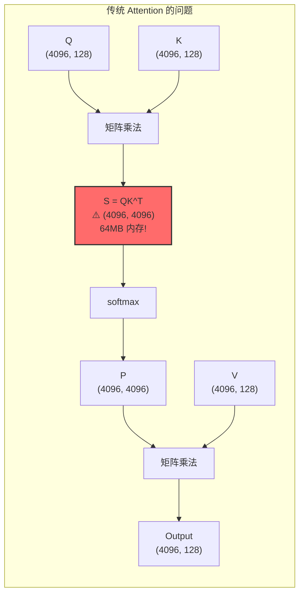

### 解决方案：分块 + 在线更新

Splash Attention 的核心思想：**不存储完整的 S 矩阵，而是分块计算并在线更新结果**。

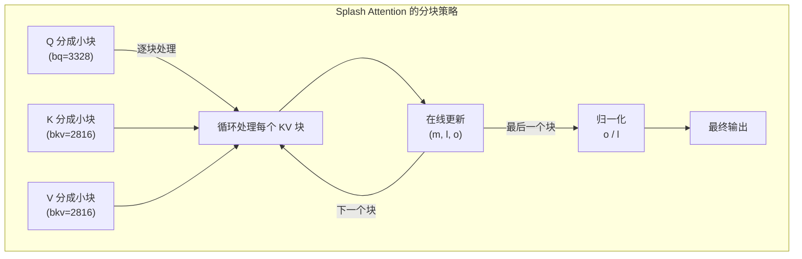

**关键洞察**：通过维护三个统计量 `(m, l, o)`，可以增量更新 softmax 结果，不需要一次看到所有数据！

---

## 特点与优缺点

### ✅ 优点

| 优点 | 说明 |
|------|------|
| **内存效率** | O(N) 而非 O(N²)，长序列不再爆内存 |
| **exp2 优化** | 利用 TPU VPU 的 exp2 硬件指令，比 exp 快 |
| **分块计算** | 数据留在片上 VMEM，减少 HBM 访问 |
| **多核并行** | 自动利用 TPU 的多核架构 |
| **GQA 支持** | 支持 Grouped Query Attention，多个 Q head 共享 KV |

### ❌ 缺点

| 缺点 | 说明 |
|------|------|
| **Sublane 冗余** | 统计量用 (8, bq) 存储，实际只需要 (bq,)，7/8 VPU 算力浪费 |
| **块大小固定** | 需要 padding，短序列可能浪费计算 |
| **代码复杂** | Pallas 编程门槛高，调试困难 |
| **无反向传播** | 当前实现只有前向，backward 需要另外实现 |

### 📊 性能数据（参考）

```
序列长度    传统方法内存    Splash 内存    加速比
1024        4 MB           ~1 MB          1.2x
4096        64 MB          ~4 MB          2.5x
16384       1 GB           ~16 MB         5x+
```

---

## 核心算法：在线 Softmax

### (m, l, o) 三元组是什么？

在线 Softmax 的核心是维护三个统计量 **(m, l, o)**：

| 变量 | 含义 | 数学定义 | 形状 |
|------|------|----------|------|
| **m** | **m**ax：当前看到的最大值 | `m = max(qk)` | `(8, bq)` |
| **l** | **l**ogsum：exp 的累加和 | `l = Σ exp(qk - m)` | `(8, bq)` |
| **o** | **o**utput：未归一化的输出 | `o = Σ exp(qk - m) × V` | `(head_dim, bq)` |

### ⚠️ 关键问题：每个 Q 都有一套 (m, l, o) 吗？

**是的！每个 Query token 都有自己独立的 (m, l, o)！**

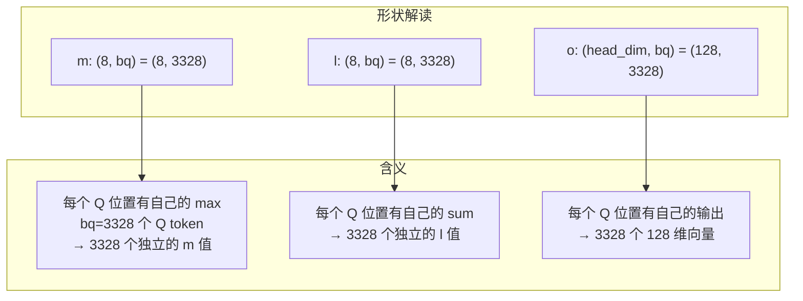

**为什么每个 Q 都要单独存？**

因为 Attention 的本质是：**每个 Query 独立地对所有 Key-Value 做加权求和**。

```
对于 Q 中的第 i 个 token (q_i):
  - m[i] = max over all K: (q_i · k_j) 对所有 j 的最大值
  - l[i] = Σ_j exp(q_i · k_j - m[i])
  - o[i] = Σ_j exp(q_i · k_j - m[i]) × v_j
  
最终输出: output[i] = o[i] / l[i]
```

**不是全局一个 m！** 每个 Query token 看到的 Key 的"最相关程度"是不同的，所以 max 值也不同。

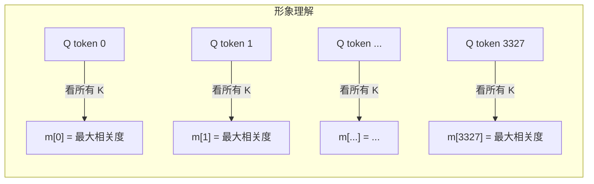

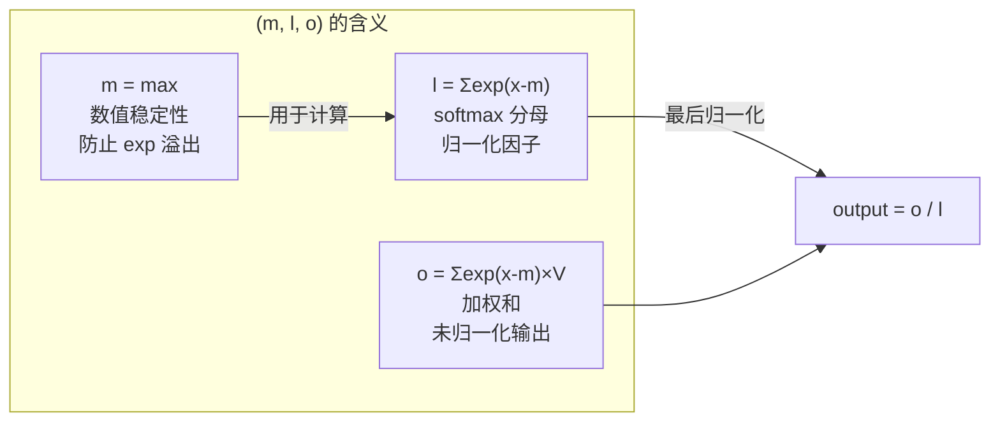

**为什么需要这三个量？**

传统 softmax 需要两遍扫描数据：
1. 第一遍：求 max（数值稳定性）
2. 第二遍：计算 exp 和 sum

在线 softmax 只需一遍扫描，通过 **(m, l, o)** 增量更新：
- 每次只看一小块数据
- 更新 m、l、o
- 最后用 l 归一化 o

### 传统 Softmax 的问题

```python
# 传统 softmax 需要两遍扫描
def softmax(x):
    max_val = x.max()           # 第一遍：求 max（数值稳定性）
    exp_x = exp(x - max_val)    # 第二遍：计算 exp
    sum_exp = exp_x.sum()       # 还需要求和
    return exp_x / sum_exp      # 最后归一化
```

**问题**：如果 x 太大存不下，怎么分块计算？

### 在线 Softmax 的魔法

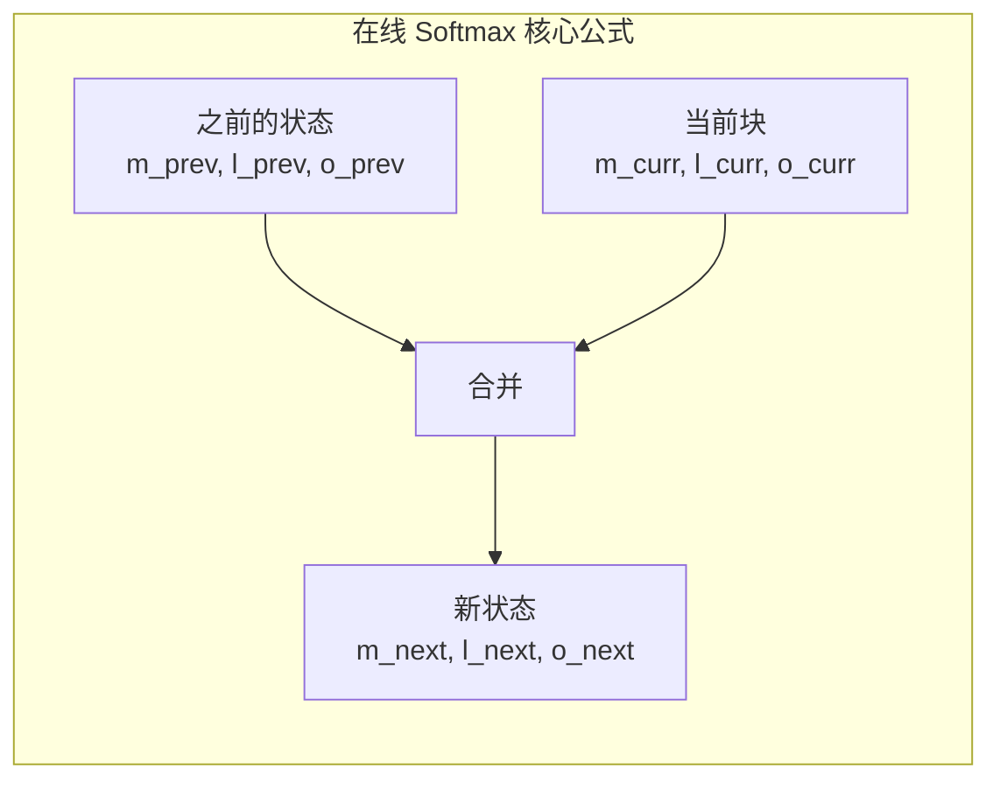

**核心公式**：

```
m_next = max(m_prev, m_curr)
α = exp(m_prev - m_next)       # 旧状态的缩放因子
β = exp(m_curr - m_next)       # 新状态的缩放因子

l_next = α * l_prev + β * l_curr
o_next = α * o_prev + β * o_curr
```

**直觉理解**：当 max 变大时，之前的 exp 值需要缩小（因为 exp(x-max) 变小了）。

### 代码示例

```python
# 在线更新伪代码
def online_softmax_update(m_prev, l_prev, o_prev, qk_block, v_block):
    # 1. 计算当前块的 max
    m_curr = qk_block.max()
    
    # 2. 更新全局 max
    m_next = max(m_prev, m_curr)
    
    # 3. 计算缩放因子
    alpha = exp2(m_prev - m_next)  # 用 exp2！
    
    # 4. 计算当前块的贡献
    s_curr = exp2(qk_block - m_next)
    l_curr = s_curr.sum()
    o_curr = s_curr @ v_block
    
    # 5. 合并
    l_next = alpha * l_prev + l_curr
    o_next = alpha * o_prev + o_curr
    
    return m_next, l_next, o_next
```

---

## TPU 硬件适配

### TPU 架构概览

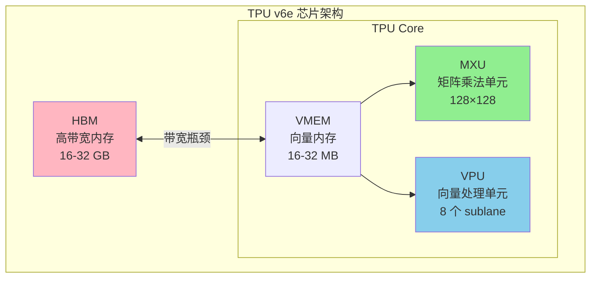

### 关键优化点

#### 1. exp2 替代 exp

```python
# TPU VPU 有 exp2 硬件指令，但没有高效的 exp
# 数学转换：exp(x) = 2^(x * log2(e))

LOG2_E = 1.44269504  # log₂(e)

# 预处理：在调用 kernel 前将 Q 乘以 LOG2_E
q = q * scale * LOG2_E

# kernel 内部直接用 exp2
s = jnp.exp2(qk - max)  # 而不是 jnp.exp(qk - max)
```

#### 2. 块大小选择

```python
BQSIZE = 3328          # Query 块大小 = 26 × 128
BKVSIZE = 2816         # KV 块大小 = 22 × 128
BKVCOMPUTESIZE = 256   # 内层计算块 = 2 × 128
```

**为什么是这些数字？**

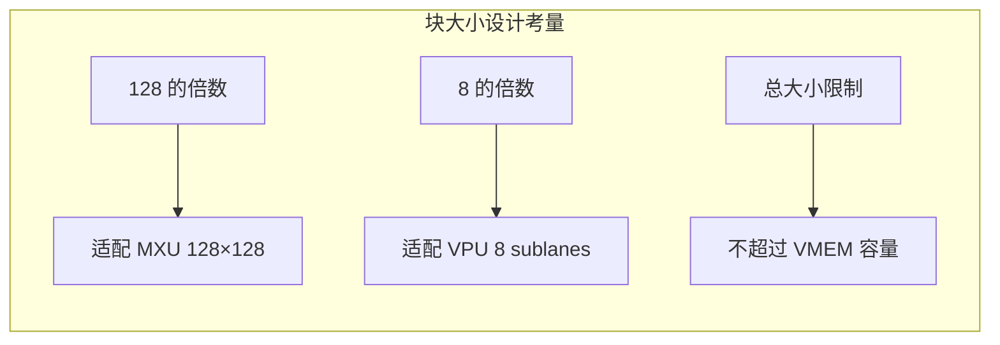

#### 3. NUM_SUBLANES = 8 的秘密

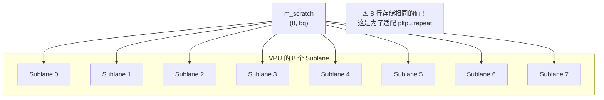

**为什么冗余存储？** 见 [常见问题](#为什么-m_scratch-是-8-bq-而不是-bq)。

---

## 代码逐行解析

### 整体结构

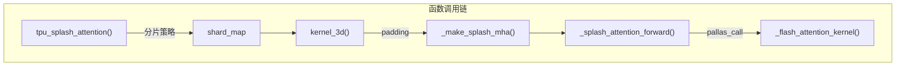

### Kernel 核心代码

```python
def _flash_attention_kernel(
    q_ref,           # Query 块，形状 (bq, head_dim)
    k_ref,           # Key 块，形状 (bkv, head_dim)
    v_ref,           # Value 块，形状 (bkv, head_dim)
    m_scratch_ref,   # max 临时存储，形状 (8, bq)
    l_scratch_ref,   # sum 临时存储，形状 (8, bq)
    o_scratch_ref,   # 输出累积器，形状 (head_dim, bq)
    o_ref,           # 最终输出，形状 (head_dim, bq)
    *,
    mask_value, grid_width, bq, bkv, bkv_compute, bkv_compute_in, head_dim_v,
):
```

#### 阶段 1：初始化（j=0 时）

```python
@pl.when(j == 0)
def init():
    o_scratch_ref[...] = jnp.zeros_like(o_scratch_ref)  # 输出清零
    m_scratch_ref[...] = jnp.full_like(m_scratch_ref, mask_value)  # max = -inf
    l_scratch_ref[...] = jnp.zeros_like(l_scratch_ref)  # sum = 0
```

### ⚠️ `@pl.when` 是怎么工作的？为什么没人调用 `init()` 和 `end()`？

**这是 Pallas 框架的魔法，不需要显式调用！**

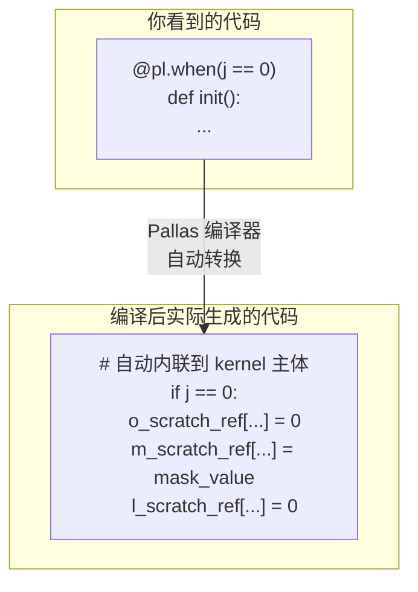

**工作原理**：

1. **`@pl.when(condition)` 是编译时装饰器**：
   - 它告诉 Pallas 编译器：当 `condition` 为真时执行这个函数
   - 编译器会自动将函数体内联到 kernel 主体中

2. **不需要显式调用**：
   - 装饰器在定义时就已经"注册"了这段代码
   - Pallas 编译器会在正确的位置插入条件执行

3. **类似于 Python 装饰器的副作用**：
   ```python
   # 这两种写法效果相同：
   
   # 写法 1：装饰器（Pallas 风格）
   @pl.when(j == 0)
   def init():
       do_something()
   
   # 写法 2：等价的概念（伪代码）
   pl.register_conditional_block(
       condition=(j == 0),
       body=lambda: do_something()
   )
   ```

4. **为什么这样设计？**：
   - TPU 不支持运行时分支预测
   - 编译时确定所有条件分支，生成 VLIW 指令
   - 所有 grid 位置执行相同代码，只是条件不同

**`init()` 和 `end()` 的执行时机**：

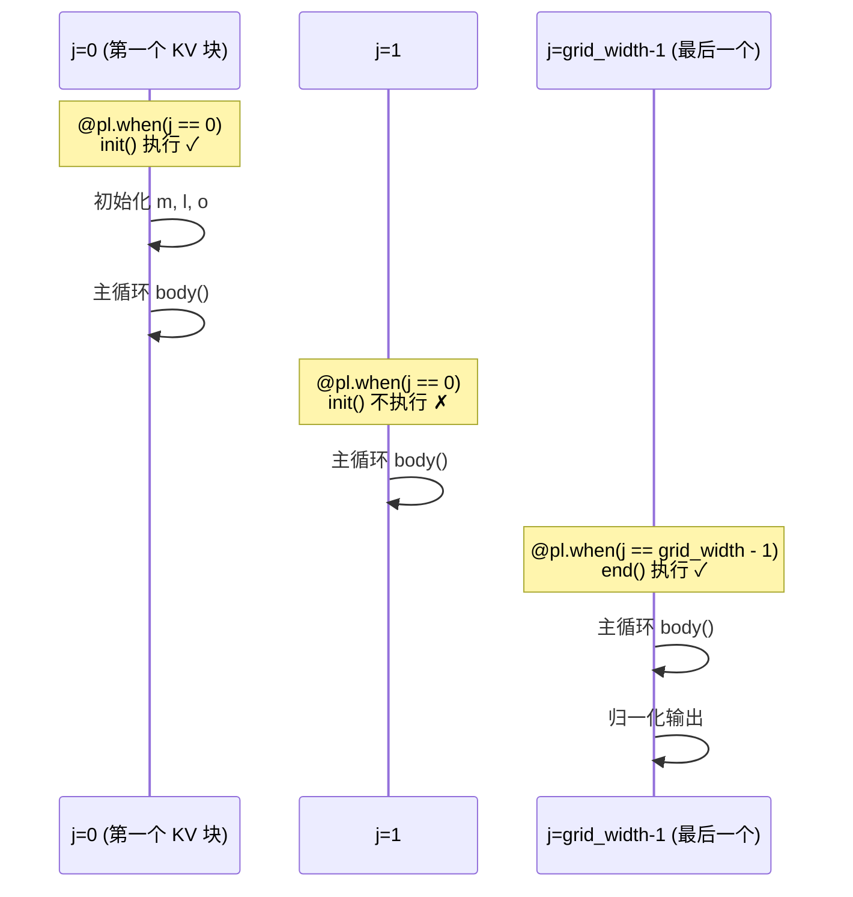

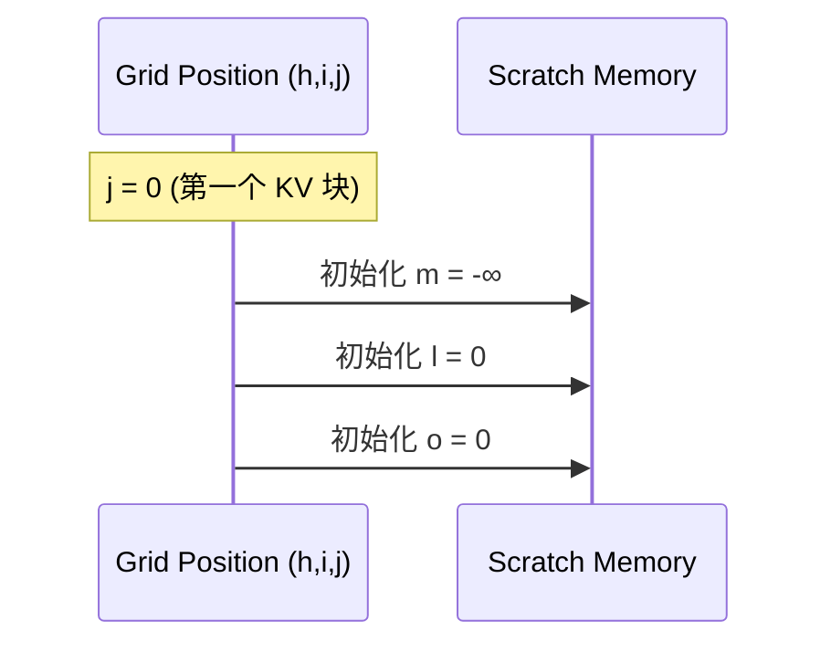

#### 阶段 2：主循环

```python
def body(kv_compute_index, _):
    # 读取 Q 和 K 块
    q = q_ref[...]                        # (bq, head_dim)
    k = k_ref[slice_k, :]                 # (bkv_compute, head_dim)
    
    # 计算 QK^T（在 MXU 上执行）
    qk = lax.dot_general(k, q, NT_DIM_NUMBERS)  # (bkv_compute, bq)
    
    # 在线 softmax 更新
    for i in range(0, qk.shape[0], step):
        m_curr = qk[i:i+step].max(axis=0)
        m_next = jnp.maximum(m_prev, m_curr)
        
        s_curr = jnp.exp2(qk[i:i+step] - m_next)  # ← exp2 优化！
        l_curr = s_curr.sum(axis=0)
        
        alpha = jnp.exp2(m_prev - m_next)
        l_next = l_curr + alpha * l_prev
        
        o_curr = lax.dot_general(v[i:i+step], s_curr, ...)  # S @ V
        o_prev = alpha * o_prev + o_curr
```

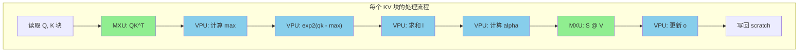

#### 阶段 3：归一化（最后一个 j）

```python
@pl.when(j == grid_width - 1)
def end():
    l = l_scratch_ref[...]                          # (8, bq)
    l_inv = pltpu.repeat(1.0 / l, repeats, axis=0)  # 扩展到 (head_dim, bq)
    o_ref[...] = o_scratch_ref[...] * l_inv         # 归一化
```

---

## 分布式执行策略

### 策略选择逻辑

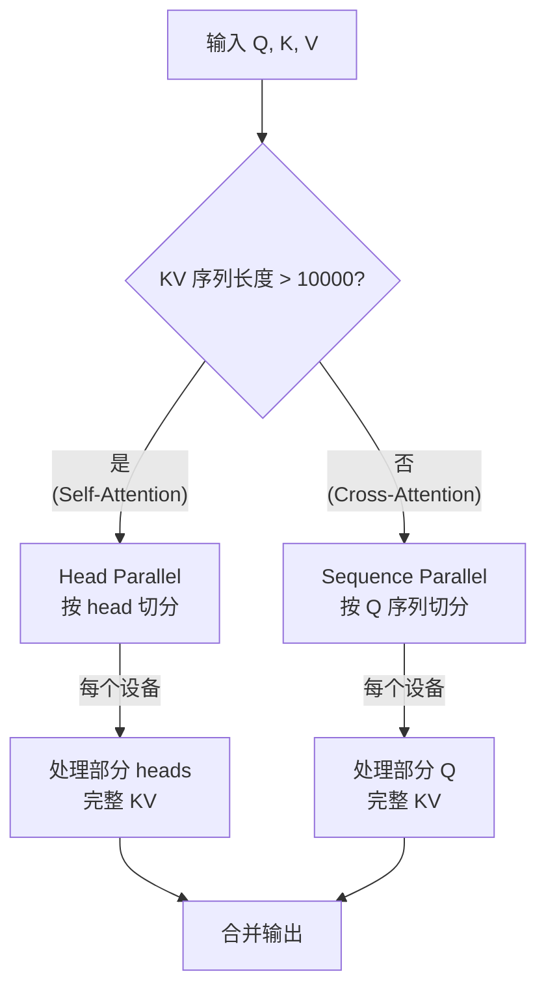

### Head Parallel vs Sequence Parallel

| 特性 | Head Parallel | Sequence Parallel |
|------|---------------|-------------------|
| **适用场景** | 长序列 Self-Attention | 短序列 Cross-Attention |
| **切分维度** | Q/K/V 的 head 维度 | Q 的 sequence 维度 |
| **KV 存储** | 每个设备只有部分 KV | 每个设备有完整 KV |
| **通信开销** | 无 | 需要广播 KV |
| **阈值** | kv_seq_len > 10000 | kv_seq_len ≤ 10000 |

### 代码示例

```python
# 长 KV 序列（self-attention）使用 head parallel
if kv_seq_len > 10000:
    q_spec = P(dp_mesh_key, remain_mesh_key, None, None)  # head 维度切分
    kv_spec = P(dp_mesh_key, remain_mesh_key, None, None)
else:
    # 短 KV 序列（cross-attention）使用 sequence parallel
    q_spec = P(dp_mesh_key, None, remain_mesh_key, None)  # seq 维度切分
    kv_spec = P(dp_mesh_key, None, None, None)            # KV 不切分
```

---

## 常见问题

### 为什么 m_scratch 是 (8, bq) 而不是 (bq)？

**简短回答**：这是 TPU 硬件和 Pallas 框架的要求。

**详细解释**：

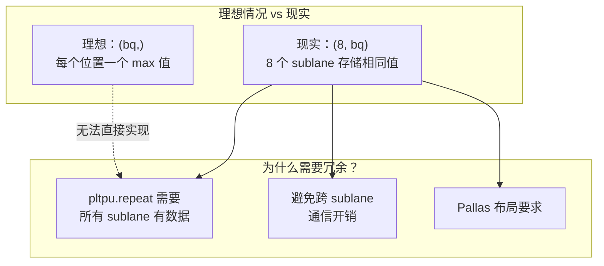

**这不是浪费算力吗？**

是的，VPU 上 7/8 的算力被"浪费"了。但是：

1. **MXU 才是主角**：QK^T 和 S@V 占用 >90% 计算时间
2. **VPU 操作很少**：max/sum/exp2 只是配角
3. **通信成本更高**：如果分布存储，需要 sublane 间通信

### 为什么用 exp2 而不是 exp？

```python
# TPU VPU 硬件特性：
# - exp2 (2^x): 单周期硬件指令 ⚡
# - exp (e^x): 需要多周期软件模拟 🐢

# 数学转换：
# exp(x) = e^x = 2^(x × log₂(e)) = exp2(x × 1.44269504)

# 实现技巧：预乘 LOG2_E，避免内核中的额外乘法
q = q * scale * LOG2_E  # 在 kernel 外做一次
s = jnp.exp2(qk - max)  # kernel 内直接用 exp2
```

### 块大小为什么是 3328 和 2816？

```
BQSIZE = 3328 = 26 × 128
BKVSIZE = 2816 = 22 × 128
```

1. **128 的倍数**：适配 MXU 的 128×128 矩阵乘法单元
2. **8 的倍数**：适配 VPU 的 8 个 sublane
3. **VMEM 容量限制**：块太大会溢出片上内存
4. **经验调优**：这些值是实验得出的最佳点

### 如何调试 Pallas Kernel？

```python
# 设置 interpret=True 使用 Python 解释执行
splash_kernel = _make_splash_mha(block_sizes, bkv_compute_in, interpret=True)

# 可以添加 print 和断点（仅 interpret 模式）
```

---

## 深入解析 `_splash_attention_forward`：Pallas 核心写法

> 🎯 这个函数是理解 Pallas 编程的最佳范例。掌握它，就掌握了 TPU kernel 编写的精髓。

### 函数签名与参数

```python
def _splash_attention_forward(
    q: jax.Array,           # Query, 形状 (num_q_heads, q_seq_len, head_dim)
    k: jax.Array,           # Key,   形状 (num_kv_heads, kv_seq_len, head_dim)
    v: jax.Array,           # Value, 形状 (num_kv_heads, kv_seq_len, head_dim)
    block_sizes: _BlockSizes,   # 块大小配置
    bkv_compute_in: int,        # KV 计算内层块大小
    interpret: bool = False,    # 调试模式
):
```

### 函数结构总览

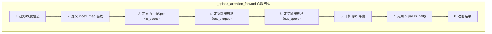

---

### 第一部分：提取维度信息

```python
num_q_heads, q_seq_len, head_dim_qk = q.shape   # 例如：(8, 36864, 128)
head_dim_v = v.shape[-1]                         # 例如：128
bq, bkv = block_sizes.block_q, block_sizes.block_kv  # 3328, 2816
bkv_compute = block_sizes.block_kv_compute       # 256
num_kv_heads = k.shape[0]                        # GQA 时可能不等于 num_q_heads
kv_seq_len = k.shape[1]                          # 例如：36864
q_heads_per_kv_head = num_q_heads // num_kv_heads  # GQA 比例
```

**为什么需要这些信息？**
- `bq`, `bkv`：决定每个 kernel 实例处理多大的数据块
- `num_q_heads`：决定 grid 的第一个维度
- `q_seq_len // bq`：决定 grid 的第二个维度
- `kv_seq_len // bkv`：决定 grid 的第三个维度

---

### 第二部分：index_map 函数 —— Pallas 的核心概念！

**什么是 index_map？**

```
index_map 是一个函数，它告诉 Pallas：
"当 kernel 在 grid 位置 (h, i, j) 执行时，应该读取/写入数据的哪个位置？"
```

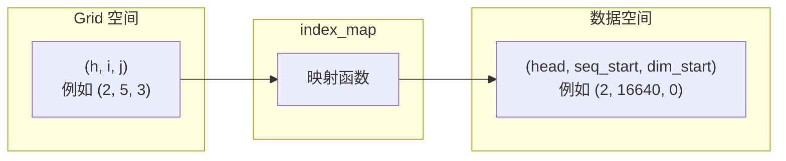

#### q_index_map：Query 的索引映射

```python
def q_index_map(h, i, j, *_):
    return (h, i, 0)
```

**解读**：
```
输入：grid 位置 (h, i, j)
输出：Q 的读取起始位置 (head, seq_block, dim)

h: 第 h 个 head → Q 的第 h 个 head
i: 第 i 个 Q 块 → Q 序列的第 i 个块（自动乘以 bq）
j: 第 j 个 KV 块 → 对 Q 没影响，Q 是固定的！
0: head_dim 从 0 开始（读取完整维度）
```

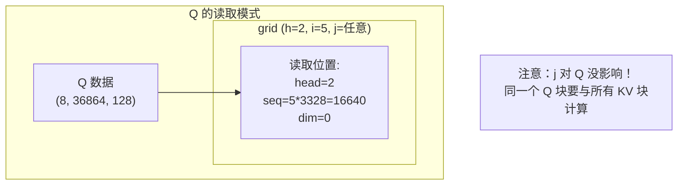

#### k_index_map 和 v_index_map：KV 的索引映射

```python
def k_index_map(h, i, j, *_):
    return (h // q_heads_per_kv_head, j, 0)

def v_index_map(h, i, j, *_):
    return (h // q_heads_per_kv_head, j, 0)
```

**解读**：
```
h // q_heads_per_kv_head: GQA！多个 Q head 共享同一个 KV head
j: 第 j 个 KV 块 → 读取 KV 序列的第 j 个块
i: 对 KV 没影响！所有 Q 块都要看相同的 KV
0: head_dim 从 0 开始
```

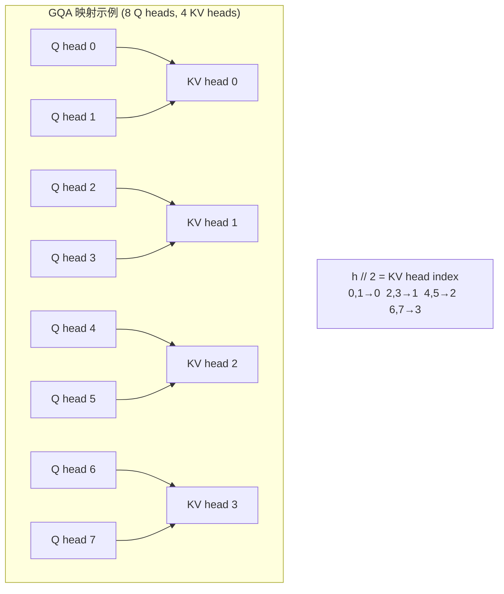

#### out_index_map：输出的索引映射

```python
def out_index_map(h, i, j, *_):
    return h, 0, i
```

**解读**：
```
h: 第 h 个 head → 写入输出的第 h 个 head
0: head_dim 从 0 开始（完整维度）
i: 第 i 个 Q 块 → 写入输出序列的第 i 个块

注意 j 不影响输出位置！因为所有 KV 块的结果累积到同一个输出位置
```

---

### 第三部分：BlockSpec —— 定义数据切片方式

**什么是 BlockSpec？**

```
BlockSpec = (block_shape, index_map)

它告诉 Pallas：
1. 每个 kernel 实例处理的数据块形状
2. 如何根据 grid 位置找到数据块
```

```python
in_specs = [
    pl.BlockSpec((None, bq, head_dim_qk), q_index_map),   # Q 的 spec
    pl.BlockSpec((None, bkv, head_dim_qk), k_index_map),  # K 的 spec
    pl.BlockSpec((None, bkv, head_dim_v), v_index_map),   # V 的 spec
]
```

#### BlockSpec 形状中的 None

```mermaid
graph TB
    subgraph "BlockSpec 形状解读"
        Q_SPEC["Q: (None, bq, head_dim)<br/>= (None, 3328, 128)"]
        K_SPEC["K: (None, bkv, head_dim)<br/>= (None, 2816, 128)"]
    end
    
    subgraph "None 的含义"
        NONE["None 表示这个维度不切片<br/>index_map 直接返回索引（不乘以块大小）"]
        NUM["数字表示块大小<br/>index_map 返回的是块号（自动乘以块大小）"]
    end
    
    Q_SPEC --> NONE
    Q_SPEC --> NUM
```

**具体例子**：
```python
# Q: 形状 (8, 36864, 128), BlockSpec (None, 3328, 128)
# index_map 返回 (2, 5, 0) 时：
#   - 维度 0 (None): 直接用 2 → 第 2 个 head
#   - 维度 1 (3328): 5 × 3328 = 16640 → 从位置 16640 开始
#   - 维度 2 (128): 0 × 128 = 0 → 从位置 0 开始
# 结果：读取 q[2, 16640:16640+3328, 0:128]
```

---

### 第四部分：out_shapes 和 out_specs —— 输出规格

```python
out_shapes = [
    jax.ShapeDtypeStruct((NUM_SUBLANES, bq), jnp.float32),   # m_scratch
    jax.ShapeDtypeStruct((NUM_SUBLANES, bq), jnp.float32),   # l_scratch
    jax.ShapeDtypeStruct((head_dim_v, bq), jnp.float32),     # o_scratch
    jax.ShapeDtypeStruct((num_q_heads, head_dim_v, q_seq_len), q.dtype),  # 最终输出
]

out_specs = [
    pl.BlockSpec((NUM_SUBLANES, bq), lambda *_: (0, 0)),  # scratch 是局部的
    pl.BlockSpec((NUM_SUBLANES, bq), lambda *_: (0, 0)),
    pl.BlockSpec((head_dim_v, bq), lambda *_: (0, 0)),
    pl.BlockSpec((None, head_dim_v, bq), out_index_map),  # 输出写入全局位置
]
```

```mermaid
graph TB
    subgraph "输出类型区分"
        SCRATCH["Scratch（临时变量）<br/>m, l, o"]
        FINAL["最终输出<br/>attention result"]
    end
    
    subgraph "Scratch 特点"
        S1["index_map 固定返回 (0, 0)"]
        S2["每个 grid cell 有自己的副本"]
        S3["跨 j 维度共享（同一 Q 块）"]
    end
    
    subgraph "最终输出特点"
        F1["index_map 根据 (h, i) 定位"]
        F2["写入全局输出数组"]
        F3["只在 j == grid_width-1 时写入"]
    end
    
    SCRATCH --> S1
    SCRATCH --> S2
    SCRATCH --> S3
    
    FINAL --> F1
    FINAL --> F2
    FINAL --> F3
```

**为什么 scratch 的 index_map 是 `lambda *_: (0, 0)`？**

```
scratch 是每个 grid cell 的局部变量，不需要全局定位
每次都从 (0, 0) 开始读写自己的那份 scratch
Pallas 会自动为每个 (h, i) 组合分配独立的 scratch 空间
```

---

### 第五部分：Grid 设计 —— 并行执行的关键

```python
grid_width = kv_seq_len // bkv  # 例如：36864 // 2816 = 13
grid = (num_q_heads, q_seq_len // bq, grid_width)
# 例如：(8, 11, 13) = 8 × 11 × 13 = 1144 个 kernel 实例
```

```mermaid
graph TB
    subgraph "Grid 三维结构"
        H["维度 0: h<br/>num_q_heads = 8<br/>每个 head 独立"]
        I["维度 1: i<br/>q_seq_len // bq = 11<br/>每个 Q 块独立"]
        J["维度 2: j<br/>kv_seq_len // bkv = 13<br/>遍历所有 KV 块"]
    end
    
    subgraph "语义"
        H --> |"parallel"| H_SEM["可以并行<br/>head 之间无依赖"]
        I --> |"arbitrary"| I_SEM["任意顺序<br/>Q 块之间无依赖"]
        J --> |"arbitrary"| J_SEM["必须顺序（逻辑上）<br/>但编译器可优化"]
    end
```

**为什么 j 维度是 "arbitrary" 而不是 "sequential"？**

```
虽然 Online Softmax 需要按顺序处理 KV 块，
但 Pallas 编译器知道 scratch 变量的依赖关系，
会自动保证正确的执行顺序。

"arbitrary" 给编译器更多优化空间，
比如预取下一个 KV 块。
```

---

### 第六部分：pallas_call —— 一切的入口

```python
all_out = pl.pallas_call(
    # 1. Kernel 函数（用 partial 固定静态参数）
    functools.partial(
        _flash_attention_kernel,
        mask_value=DEFAULT_MASK_VALUE,
        grid_width=grid_width,
        bq=bq,
        bkv=bkv,
        bkv_compute=bkv_compute,
        bkv_compute_in=bkv_compute_in,
        head_dim_v=head_dim_v,
    ),
    
    # 2. Grid 规格
    grid_spec=pltpu.PrefetchScalarGridSpec(
        num_scalar_prefetch=0,
        in_specs=in_specs,
        out_specs=out_specs,
        grid=grid,
    ),
    
    # 3. 编译器参数
    compiler_params=pltpu.CompilerParams(
        dimension_semantics=("parallel", "arbitrary", "arbitrary"),
        flags={"XLA_TPU_FORCE_LP_LLO_SCHEDULER": True}
    ),
    
    # 4. 输出形状
    out_shape=out_shapes,
    
    # 5. 调试模式
    interpret=interpret,
)(q, k, v)  # 6. 输入数据
```

```mermaid
graph TB
    subgraph "pallas_call 执行流程"
        INPUT["输入: q, k, v"] --> GRID["生成 Grid<br/>(8, 11, 13)"]
        GRID --> SCHEDULE["调度 Kernel 实例<br/>1144 个并行/顺序执行"]
        
        subgraph "每个 Kernel 实例"
            FETCH["根据 index_map<br/>预取数据块"]
            EXEC["执行 kernel 函数"]
            WRITE["写回结果"]
            FETCH --> EXEC --> WRITE
        end
        
        SCHEDULE --> FETCH
        WRITE --> OUTPUT["输出: all_out"]
    end
```

#### PrefetchScalarGridSpec 详解

```python
pltpu.PrefetchScalarGridSpec(
    num_scalar_prefetch=0,  # 不需要预取标量
    in_specs=in_specs,      # 输入数据的 BlockSpec
    out_specs=out_specs,    # 输出数据的 BlockSpec
    grid=grid,              # Grid 形状
)
```

**为什么用 PrefetchScalarGridSpec 而不是普通 GridSpec？**

```
PrefetchScalarGridSpec 是 TPU 专用的 GridSpec，支持：
1. 硬件预取：自动预取下一个 grid cell 的数据
2. Double Buffering：当前计算和预取并行
3. 更好的内存管理：TPU 的 VMEM 分配优化
```

#### compiler_params 详解

```python
compiler_params=pltpu.CompilerParams(
    dimension_semantics=("parallel", "arbitrary", "arbitrary"),
    flags={"XLA_TPU_FORCE_LP_LLO_SCHEDULER": True}
)
```

**dimension_semantics 含义**：

| 值 | 含义 | 适用场景 |
|---|------|---------|
| `"parallel"` | 完全并行，无依赖 | 独立的 head |
| `"arbitrary"` | 编译器自由调度 | Q 块、KV 块 |
| `"sequential"` | 严格顺序执行 | 有强依赖时使用 |

**flags 含义**：

```
XLA_TPU_FORCE_LP_LLO_SCHEDULER: True
→ 强制使用低延迟调度器
→ 优化小 kernel 的启动延迟
→ 对 attention 这种计算密集型有帮助
```

---

### 第七部分：完整数据流图

```mermaid
flowchart TB
    subgraph "输入层"
        Q["Q<br/>(8, 36864, 128)"]
        K["K<br/>(4, 36864, 128)"]
        V["V<br/>(4, 36864, 128)"]
    end
    
    subgraph "Grid 调度层"
        GRID["Grid (8, 11, 13)<br/>1144 个 kernel 实例"]
    end
    
    subgraph "Kernel 实例 (h=2, i=5, j=3)"
        Q_BLOCK["q_ref<br/>(3328, 128)"]
        K_BLOCK["k_ref<br/>(2816, 128)"]
        V_BLOCK["v_ref<br/>(2816, 128)"]
        
        QK["QK = K @ Q^T<br/>(2816, 3328)"]
        ONLINE["Online Softmax<br/>更新 (m, l, o)"]
        SV["O += S @ V"]
    end
    
    subgraph "输出层"
        SCRATCH["scratch<br/>m, l, o"]
        OUTPUT["最终输出<br/>(8, 128, 36864)"]
    end
    
    Q --> |"q_index_map<br/>(2, 5, 0)"| Q_BLOCK
    K --> |"k_index_map<br/>(1, 3, 0)"| K_BLOCK
    V --> |"v_index_map<br/>(1, 3, 0)"| V_BLOCK
    
    Q_BLOCK --> QK
    K_BLOCK --> QK
    QK --> ONLINE
    ONLINE --> SV
    V_BLOCK --> SV
    
    SV --> SCRATCH
    SCRATCH --> |"j == 12 时<br/>归一化输出"| OUTPUT
```

---

### 第八部分：代码与硬件的映射

```mermaid
graph LR
    subgraph "代码层"
        QK_CODE["lax.dot_general(k, q, ...)"]
        EXP_CODE["jnp.exp2(qk - m)"]
        SV_CODE["lax.dot_general(v, s, ...)"]
    end
    
    subgraph "XLA 编译"
        XLA["XLA TPU 编译器"]
    end
    
    subgraph "硬件层"
        MXU["MXU<br/>128×128 矩阵乘法"]
        VPU["VPU<br/>向量运算<br/>8 sublanes"]
        VMEM["VMEM<br/>片上缓存"]
        HBM["HBM<br/>高带宽内存"]
    end
    
    QK_CODE --> XLA --> MXU
    EXP_CODE --> XLA --> VPU
    SV_CODE --> XLA --> MXU
    
    HBM <--> |"BlockSpec<br/>控制传输"| VMEM
    VMEM --> MXU
    VMEM --> VPU
```

---

### 第九部分：常见 Pallas 模式总结

| 模式 | 代码示例 | 用途 |
|------|---------|------|
| **静态参数传递** | `functools.partial(kernel, param=value)` | 编译时固定参数 |
| **条件执行** | `@pl.when(condition)` | 只在特定 grid 位置执行 |
| **Scratch 变量** | `out_shapes` 中定义 | 跨 grid 维度累积结果 |
| **index_map 忽略维度** | `lambda h, i, j: (h, i, 0)` | 某些维度不影响数据位置 |
| **GQA 映射** | `h // q_heads_per_kv_head` | 多 Q head 共享 KV |
| **维度语义** | `dimension_semantics` | 告诉编译器并行性 |

---

### 第十部分：如何写自己的 Pallas Kernel？

**步骤模板**：

```python
def my_pallas_forward(x, y, block_size):
    # 1. 提取维度
    batch, seq, dim = x.shape
    
    # 2. 定义 index_map
    def x_index_map(b, s):
        return (b, s, 0)
    
    def y_index_map(b, s):
        return (b, s, 0)
    
    # 3. 定义 BlockSpec
    in_specs = [
        pl.BlockSpec((None, block_size, dim), x_index_map),
        pl.BlockSpec((None, block_size, dim), y_index_map),
    ]
    
    # 4. 定义输出
    out_shape = jax.ShapeDtypeStruct((batch, seq, dim), x.dtype)
    out_spec = pl.BlockSpec((None, block_size, dim), x_index_map)
    
    # 5. 定义 grid
    grid = (batch, seq // block_size)
    
    # 6. 定义 kernel
    def kernel(x_ref, y_ref, o_ref):
        o_ref[...] = x_ref[...] + y_ref[...]
    
    # 7. 调用 pallas_call
    return pl.pallas_call(
        kernel,
        grid_spec=pltpu.PrefetchScalarGridSpec(
            num_scalar_prefetch=0,
            in_specs=in_specs,
            out_specs=[out_spec],
            grid=grid,
        ),
        out_shape=[out_shape],
    )(x, y)
```

---

## 总结

```mermaid
mindmap
    root((Splash Attention))
        核心思想
            分块计算
            在线 Softmax
            内存 O-N- 而非 O-N²-
        TPU 优化
            exp2 硬件指令
            MXU 矩阵乘法
            VMEM 片上缓存
        分布式
            Head Parallel
            Sequence Parallel
            shard_map
        权衡
            长序列高效
            内存节省
            sublane 冗余
            代码复杂
```

---

## 参考资料

- [Flash Attention 论文](https://arxiv.org/abs/2205.14135) - Tri Dao et al.
- [Flash Attention 2 论文](https://arxiv.org/abs/2307.08691) - Tri Dao
- [JAX Pallas 文档](https://jax.readthedocs.io/en/latest/pallas/)
- [TPU 系统架构](https://cloud.google.com/tpu/docs/system-architecture)

---

*最后更新: 2024-12*
