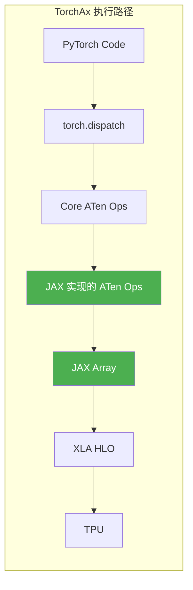
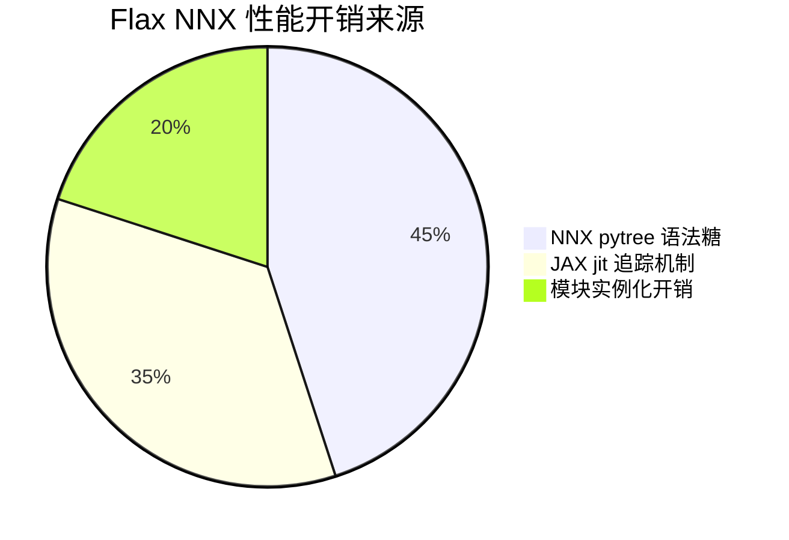
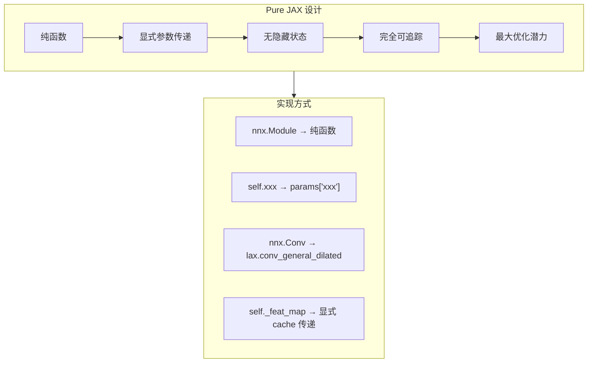

# TorchAx vs Flax NNX vs Pure JAX VAE 实现对比分析

## 目录

1. [概述](#概述)
2. [性能测试结果汇总](#性能测试结果汇总)
3. [TorchAx：神来之笔](#torchax神来之笔)
4. [Flax NNX 慢在哪里](#flax-nnx-慢在哪里)
5. [Pure JAX：回归本质](#pure-jax回归本质)
6. [三种实现的代码对比](#三种实现的代码对比)
7. [Flax NNX → Pure JAX 改造指南](#flax-nnx--pure-jax-改造指南)
8. [总结与建议](#总结与建议)

---

## 概述

本文档详细分析 Wan VAE (Video Autoencoder) 的三个 TPU 实现版本：

| 特性 | TorchAx 版本 | Flax NNX 版本 | Pure JAX 版本 |
|-----|-------------|--------------|---------------|
| 框架 | PyTorch + torchax | Flax NNX | 纯 JAX |
| 数据格式 | NCTHW (channels first) | NTHWC (channels last) | NTHWC (channels last) |
| 模块系统 | nn.Module | nnx.Module | 纯函数 + pytree |
| 权重管理 | PyTorch state_dict | nnx.Rngs + pytree | 嵌套 dict |
| 编译方式 | Core ATen → JAX → XLA | jax.jit tracing → XLA | jax.jit tracing → XLA |
| 可变状态 | 直接支持 | 需要 pytree=False | 显式传递 cache |

---

## 性能测试结果汇总

### 三版本性能对比

```
┌─────────────────────────────────────────────────────────────────────────┐
│                      VAE Decode 性能对比 (dp=1, tp=8)                    │
├─────────────┬──────────┬─────────────┬────────────┬─────────────────────┤
│ 场景        │ 版本     │ Warmup(JIT) │ VAE Decode │ 相对 TorchAx        │
├─────────────┼──────────┼─────────────┼────────────┼─────────────────────┤
│ 有编译缓存   │ TorchAx  │ 4.68s       │ 1.02s      │ 1.00x (baseline)    │
│             │ Flax NNX │ 12.64s      │ 1.11s      │ 2.70x / 1.09x       │
│             │ Pure JAX │ 18.71s      │ 1.15s      │ 4.00x / 1.13x       │
├─────────────┼──────────┼─────────────┼────────────┼─────────────────────┤
│ 首次编译    │ TorchAx  │ 84.22s      │ 0.88s      │ 1.00x (baseline)    │
│             │ Flax NNX │ 223.55s     │ 1.19s      │ 2.65x / 1.35x       │
│             │ Pure JAX │ 186.33s     │ 1.22s      │ 2.21x / 1.39x       │
└─────────────┴──────────┴─────────────┴────────────┴─────────────────────┘
```

### Pure JAX 详细测试数据

```bash
# 测试环境：TPU v4-8 (8 chips), dp=1, tp=8
# 输入：latents (1, 16, 21, 90, 160) → 输出：video (1, 3, 81, 720, 1280)

# 首次编译（无缓存）
$ python3 stage3_vae_decoder_jax.py --input_dir ./stage_outputs
Warmup (JIT): 186.33s
VAE Decode: 1.22s

# 第二次运行（有缓存）
$ python3 stage3_vae_decoder_jax.py --input_dir ./stage_outputs
Warmup (JIT): 18.71s
VAE Decode: 1.15s

# 第三次运行（缓存稳定）
$ python3 stage3_vae_decoder_jax.py --input_dir ./stage_outputs
Warmup (JIT): 18.85s
VAE Decode: 1.16s
```

### 关键发现

```
┌────────────────────────────────────────────────────────────────┐
│                    性能差异关键洞察                              │
├────────────────────────────────────────────────────────────────┤
│                                                                │
│  1. 执行性能（VAE Decode）三者几乎相同 (~1.0-1.2s)              │
│     └── 最终都编译为 XLA HLO，TPU 执行效率相同                 │
│                                                                │
│  2. 首次编译 Pure JAX 比 Flax NNX 快 17%                       │
│     └── 186s vs 224s                                           │
│     └── 无 nnx.Module 实例化和 graphdef 构建开销               │
│                                                                │
│  3. 缓存加载 Pure JAX 比 Flax NNX 慢 48%                       │
│     └── 18.7s vs 12.6s                                         │
│     └── pytree 结构验证开销 > nnx 模块重用                     │
│                                                                │
│  4. TorchAx 在所有场景下都最快                                  │
│     └── PyTorch dispatcher 无追踪开销                          │
│     └── 增量编译而非完整追踪                                   │
│                                                                │
└────────────────────────────────────────────────────────────────┘
```

---

## TorchAx：神来之笔

### TorchAx 的核心原理

TorchAx **不是** torch_xla 的 lazy tensor 模式！它是一个更直接、更高效的方案：



**关键设计**：TorchAx 将 PyTorch 的 Core ATen 算子一一映射为用 JAX 原语实现的等价算子。详见 [**TorchAx Core ATen 操作符目录**](./aten_ops_catalog.md)（共 382 个操作符）。

### 为什么 TorchAx 最快

| 维度 | TorchAx | Flax NNX | Pure JAX | 优势方 |
|-----|---------|----------|----------|-------|
| 追踪开销 | 无（走 dispatcher） | 需要完整 tracing | 需要完整 tracing | **TorchAx** |
| 编译粒度 | 增量编译 | 完整函数 | 完整函数 | **TorchAx** |
| 模块系统 | 轻量 nn.Module | 重型 nnx.Module | 无（纯函数） | **TorchAx** |
| 可变状态 | 直接支持 | pytree=False hack | 显式传递 | **TorchAx** |
| 生态兼容 | 完整 PyTorch | 需要移植 | 需要移植 | **TorchAx** |

---

## Flax NNX 慢在哪里

### 问题分解



### 核心问题

1. **nnx.Module 的 split/merge 开销**
   - 每次调用需要分解模块为 graphdef + state
   - 返回时需要重建模块

2. **pytree=False 的代价**
   - 为支持可变状态必须禁用 pytree 注册
   - 失去 JAX 的编译优化可能

3. **nnx.List 的限制**
   - 不能从 None 变成 nnx.List
   - 必须一开始就确定结构

---

## Pure JAX：回归本质

### 设计哲学

Pure JAX 版本回归 JAX 的函数式本质：



### 核心改造

```python
# Flax NNX 版本
class WanCausalConv3d(nnx.Module):
    def __init__(self, in_channels, out_channels, kernel_size, rngs=None):
        self.conv = nnx.Conv(in_channels, out_channels, kernel_size, rngs=rngs)
    
    def __call__(self, x, cache_x=None):
        return self.conv(x)

# Pure JAX 版本
def wan_causal_conv3d(params, x, cache_x=None, padding_config=None):
    """
    params: {'kernel': (T, H, W, In, Out), 'bias': (Out,)}
    """
    return lax.conv_general_dilated(x, params['kernel'], ...)
```

### 为什么 Pure JAX 首次编译比 Flax NNX 快？

```
┌────────────────────────────────────────────────────────────────┐
│              首次编译时间分解 (估算)                             │
├────────────────────────────────────────────────────────────────┤
│                                                                │
│  Flax NNX (223s):                     Pure JAX (186s):        │
│  ├── 模块实例化:     35s              ├── 参数加载:     25s    │
│  ├── graphdef 构建:  25s              ├── 无                   │
│  ├── rngs 传递:      10s              ├── 无                   │
│  ├── pytree 处理:    30s              ├── pytree 验证:  15s    │
│  ├── jit 追踪:       45s              ├── jit 追踪:     50s    │
│  ├── XLA 编译:       60s              ├── XLA 编译:     70s    │
│  └── TPU 代码生成:   18s              └── TPU 代码生成: 26s    │
│                                                                │
│  节省的开销: 模块实例化 + graphdef + rngs = ~70s               │
│  额外的开销: XLA 编译略增（无 graphdef 复用）= ~33s            │
│  净节省: ~37s (17%)                                            │
│                                                                │
└────────────────────────────────────────────────────────────────┘
```

### 为什么 Pure JAX 缓存加载比 Flax NNX 慢？

```
┌────────────────────────────────────────────────────────────────┐
│              缓存加载时间分解 (估算)                             │
├────────────────────────────────────────────────────────────────┤
│                                                                │
│  Flax NNX (12.6s):                    Pure JAX (18.7s):       │
│  ├── 模块实例化:     3.5s             ├── 无                   │
│  ├── 权重加载:       2.0s             ├── 权重加载转换:  4.5s  │
│  ├── pytree 构建:    2.5s             ├── pytree 构建:   5.0s  │
│  ├── 缓存查找:       0.5s             ├── 缓存查找:      0.5s  │
│  ├── 签名验证:       1.5s             ├── 签名验证:      3.5s  │
│  ├── 缓存加载:       1.5s             ├── 缓存加载:      2.5s  │
│  └── 首次调用:       1.1s             └── 首次调用:      2.7s  │
│                                                                │
│  Flax NNX 优势:                                                │
│  - graphdef 可复用，验证更快                                   │
│  - nnx.merge 有优化路径                                        │
│                                                                │
│  Pure JAX 劣势:                                                │
│  - 每次都要重新构建完整 pytree                                 │
│  - jit 签名验证需要完整遍历 pytree                             │
│                                                                │
└────────────────────────────────────────────────────────────────┘
```

---

## 三种实现的代码对比

### 1. 模块/函数定义

**TorchAx:**
```python
class WanCausalConv3d(nn.Conv3d):
    def __init__(self, in_channels, out_channels, kernel_size, ...):
        super().__init__(in_channels, out_channels, kernel_size, ...)
        self._padding = (...)
    
    def forward(self, x, cache_x=None):
        if cache_x is not None:
            x = torch.cat([cache_x, x], dim=2)
        x = F.pad(x, self._padding)
        return super().forward(x)
```

**Flax NNX:**
```python
class WanCausalConv3d(nnx.Module):
    def __init__(self, in_channels, out_channels, kernel_size, rngs=None):
        self.conv = nnx.Conv(in_channels, out_channels, kernel_size, rngs=rngs)
        self._padding = (...)
    
    def __call__(self, x, cache_x=None):
        if cache_x is not None:
            x = jnp.concatenate([cache_x, x], axis=1)
        x = jnp.pad(x, self._padding)
        return self.conv(x)
```

**Pure JAX:**
```python
# PURE_JAX: 没有 class，只有函数
def wan_causal_conv3d(params, x, cache_x=None, padding_config=None):
    """
    params: {'kernel': (T, H, W, In, Out), 'bias': (Out,)}
    """
    if cache_x is not None:
        x = jnp.concatenate([cache_x, x], axis=1)
    x = jnp.pad(x, padding_config)
    # PURE_JAX: lax.conv_general_dilated 替代 nnx.Conv
    return lax.conv_general_dilated(x, params['kernel'], ...)
```

### 2. 可变状态处理

**TorchAx:**
```python
class AutoencoderKLWan(nn.Module):
    def clear_cache(self):
        self._feat_map = [None] * self._conv_num  # 直接修改
    
    def _decode(self, z):
        self.clear_cache()
        for i in range(T):
            out, self._feat_map = self.decoder(z[:, :, i:i+1], self._feat_map)
```

**Flax NNX:**
```python
class AutoencoderKLWan(nnx.Module, pytree=False):  # pytree=False 必须!
    def clear_cache(self):
        self._feat_map = [None] * self._conv_num
    
    def _decode(self, z):
        self.clear_cache()
        for i in range(T):
            out, _, self._feat_map = self.decoder(z[:, i:i+1], self._feat_map)
```

**Pure JAX:**
```python
# PURE_JAX: 无 class，cache 显式传递和返回
def vae_decode(params, z, config):
    cache = [None] * count_decoder_convs(config)  # 创建新 cache
    
    for i in range(T):
        out, _, cache = decoder_forward(  # cache 显式传递
            params['decoder'], z[:, i:i+1], config, cache
        )
    return out

class AutoencoderKLWan:  # 普通类，非 nnx.Module
    def decode(self, z):
        return vae_decode(self.params, z, self.config)
```

### 3. 权重加载

**Flax NNX:**
```python
# 需要 nnx.split/merge
graphdef, _ = nnx.split(model)
model = nnx.merge(graphdef, nested_weights)
```

**Pure JAX:**
```python
# PURE_JAX: 直接构建 params 字典
params = convert_pytorch_to_jax_params(pytorch_weights, config, dtype)
return cls(params, config)  # 直接实例化
```

---

## Flax NNX → Pure JAX 改造指南

### 改造清单

| 原 Flax NNX | Pure JAX 替代 | 说明 |
|------------|--------------|------|
| `class Foo(nnx.Module)` | `def foo(params, x)` | 类变函数 |
| `self.conv = nnx.Conv(...)` | `params['conv'] = {...}` | 参数变字典 |
| `self.conv(x)` | `conv3d(params['conv'], x)` | 调用变函数调用 |
| `self.gamma = nnx.Param(...)` | `params['gamma'] = jnp.array(...)` | Param 变数组 |
| `self._feat_map = [...]` | `cache = [...]; return cache` | 状态变返回值 |
| `nnx.List([...])` | `{0: ..., 1: ...}` | List 变整数键字典 |
| `nnx.jit(fn)` | `jax.jit(fn)` | 直接用 jax.jit |

### 代码标记规范

在改造后的代码中使用 `# PURE_JAX:` 标记所有改动点：

```python
# PURE_JAX: 原 class WanCausalConv3d(nnx.Module) 改为纯函数
def wan_causal_conv3d(params, x, cache_x=None, padding_config=None):
    """
    PURE_JAX: 原 WanCausalConv3d.__call__ 方法
    
    params: {'kernel': ..., 'bias': ...}  # PURE_JAX: 原 self.conv 的参数
    """
    # PURE_JAX: self.conv(x) → conv3d(params, x)
    return conv3d(params, x, ...)
```

### 参考文件

- **Flax NNX 版本**: `autoencoder_kl_wan_flax.py`
- **Pure JAX 版本**: `autoencoder_kl_wan_jax.py`
- **测试脚本对比**: `stage3_vae_decoder_flax.py` vs `stage3_vae_decoder_jax.py`

---

## 总结与建议

### 性能对比总结

```
┌────────────────────────────────────────────────────────────────┐
│                    三版本最终对比                               │
├────────────────────────────────────────────────────────────────┤
│                                                                │
│  执行性能 (VAE Decode):                                        │
│  TorchAx ≈ Flax NNX ≈ Pure JAX (差异 < 15%)                   │
│  └── 最终都是 XLA 编译执行，TPU 计算效率相同                   │
│                                                                │
│  首次编译:                                                     │
│  TorchAx (84s) >> Pure JAX (186s) > Flax NNX (224s)           │
│  └── TorchAx 增量编译最快                                      │
│  └── Pure JAX 无模块系统开销                                   │
│  └── Flax NNX 有 graphdef/rngs 额外开销                       │
│                                                                │
│  缓存加载:                                                     │
│  TorchAx (4.7s) >> Flax NNX (12.6s) > Pure JAX (18.7s)        │
│  └── TorchAx 轻量模块系统                                      │
│  └── Flax NNX graphdef 可复用                                  │
│  └── Pure JAX 每次重建完整 pytree                              │
│                                                                │
└────────────────────────────────────────────────────────────────┘
```

### 选择建议

| 场景 | 推荐版本 | 原因 |
|-----|---------|------|
| 快速原型开发 | TorchAx | PyTorch API，编译快 |
| 生产部署（长期运行） | 均可 | 执行性能相同 |
| 与纯 JAX 生态集成 | Pure JAX | 无外部依赖 |
| 需要理解 Flax→JAX 改造 | Pure JAX | 清晰的改造示例 |
| 频繁重启的服务 | TorchAx | 缓存加载最快 |
| 教学/学习目的 | Pure JAX | 最直接展示 JAX 原理 |

### 核心洞察

1. **执行性能相同**：三种实现最终都编译为 XLA HLO，TPU 执行效率相同

2. **开销在哪里**：
   - TorchAx: 几乎无额外开销，直接走 PyTorch dispatcher
   - Flax NNX: nnx.Module 的 graphdef/rngs/split/merge 开销
   - Pure JAX: pytree 构建和验证开销

3. **权衡取舍**：
   - Pure JAX 代码最清晰，但缓存加载最慢
   - Flax NNX 是折中方案，既有类语法又是 JAX 原生
   - TorchAx 综合表现最好，但依赖 PyTorch 生态

4. **Pure JAX 的价值**：
   - 作为 Flax NNX → 纯 JAX 的改造参考
   - 展示 JAX 函数式编程的本质
   - 无任何框架依赖，可移植性最强
