# Wan 模型 TPU 迁移与优化完全指南

> **版本**: 4.1 | **更新日期**: 2024年12月
>
> 本文档是 Wan 2.1/2.2 模型在 Google Cloud TPU v6e 上迁移与优化的**权威技术参考**。
>
> **文档来源**：本文汇集以下三份核心技术文档的全部精华：
> - 📊 **FLOPs Utilization Analysis**: 深度性能分析与 Roofline 建模（20+ 张 Profiler 截图）
> - 🔧 **Model Optimization Report**: 完整优化路径与代码实现 (428s → 124.9s)
> - 🎬 **I2V Optimization Report**: Image-to-Video 专项优化 (94.5s on v6e-16)

---

## 核心图表速览

本节展示源文档中的关键可视化资料，帮助快速理解优化全貌。

### Self-Attention 性能瓶颈分析


*图：Xprof 显示 Self-Attention 单次执行延迟为 43.93ms，占据 DiT 总时间的 66.8%*

### Kernel 内部时间分解


*图：通过 named_scope 分析 Splash Attention Kernel 内部各操作的时间占比，Softmax 占 ~33%*

### 操作类型时间分布

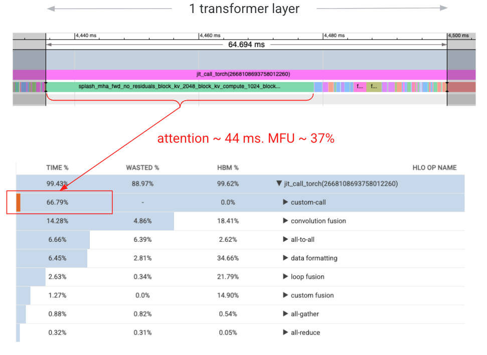

*图：Xprof 饼图显示 custom-call (Splash Attention) 占 66.8%，convolution fusion 占 14.3%*

### 整体 MFU 表现


*图：优化后整体 MFU 达到 34%，相比基线 12% 提升显著*

### 优化时间线


*图：从基线 428s 到最终 124.9s 的完整优化路径，每个阶段的贡献清晰可见*

### DiT 分片策略图


*图：DiT Transformer block 的 FSDP + CP + SP + DP 混合分片策略可视化*

### VAE Spatial Partitioning


*图：VAE 在 Width 维度的 Spatial Partitioning，每个 TPU chip 处理视频的一个垂直条带*

---

## 目录

- [核心图表速览](#核心图表速览)
- [第一章：TPU v6e 硬件架构与性能特性](#第一章tpu-v6e-硬件架构与性能特性)
- [第二章：Wan 模型架构深度解析](#第二章wan-模型架构深度解析)
- [第三章：分片策略详解](#第三章分片策略详解)
- [第四章：Splash Attention 内核优化](#第四章splash-attention-内核优化)
  - [4.1 从 Profiler 到优化点：性能瓶颈分析](#41-从-profiler-到优化点性能瓶颈分析)
  - [4.2 Pallas Kernel 逐行深度解析](#42-pallas-kernel-逐行深度解析)
  - [4.3 exp2 数学推导与实现](#43-exp2-数学推导与实现)
  - [4.4 QK Transpose 优化原理](#44-qk-transpose-优化原理)
  - [4.5 LP LLO Scheduler 调度机制](#45-lp-llo-scheduler-调度机制)
  - [4.6 Block Size 配置原理](#46-block-size-配置原理)
- [第五章：VAE 在 Torchax 上的工作原理与并行设计](#第五章vae-在-torchax-上的工作原理与并行设计)
- [第六章：性能分析方法论](#第六章性能分析方法论)
- [第七章：Torchax 桥接与代码实现](#第七章torchax-桥接与代码实现)
- [第八章：完整代码示例与实战](#第八章完整代码示例与实战)
- [第九章：Image-to-Video 专项优化](#第九章image-to-video-专项优化)
- [第十章：调试与故障排除](#第十章调试与故障排除)
- [附录](#附录)

---

## 第一章：TPU v6e 硬件架构与性能特性

### 1.1 TPU v6e 核心规格

TPU v6e (代号 Trillium) 是 Google Cloud 最新一代张量处理单元，专为大规模机器学习训练和推理优化。

| 规格项 | TPU v6e 单芯片 | TPU v6e-8 | TPU v6e-16 |
|--------|---------------|-----------|------------|
| **峰值 bf16 TFLOPs** | 918 | 7,344 | 14,688 |
| **HBM 容量** | 32 GB | 256 GB | 512 GB |
| **HBM 带宽** | 1,638 GB/s | 13,104 GB/s | 26,208 GB/s |
| **芯片间互联** | ICI 3.0 | 环形拓扑 | 2D Torus |
| **MXU 规格** | 256×256 | - | - |

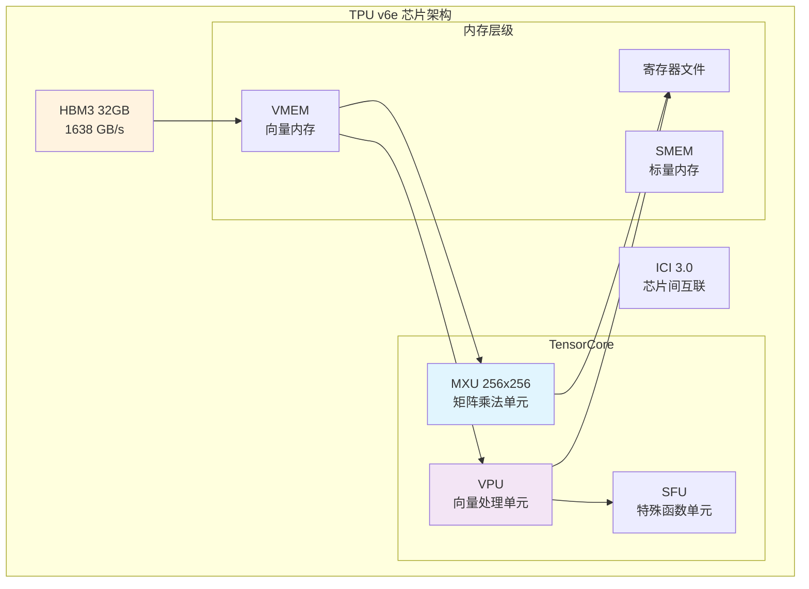

### 1.2 计算单元架构

#### MXU (Matrix Multiply Unit)
- **规格**: 256×256 脉动阵列
- **数据类型**: bf16, int8
- **峰值性能**: 918 TFLOPs (bf16)
- **关键限制**: 当 K 维度 < 256 时，MXU 利用率下降

```python
# MXU 利用率计算示例
mxu_size = 256
head_dim = 128  # Wan 模型的 head dimension

# K 维度 = head_dim = 128，只占用 MXU 一半
mxu_utilization = head_dim / mxu_size  # = 0.5 = 50%
```

#### VPU (Vector Processing Unit)
- **功能**: 向量运算（softmax、layernorm、激活函数等）
- **特点**:
  - `exp2` 比 `exp` 更高效（原生硬件指令）
  - 是 attention softmax 的主要执行单元

### 1.3 内存层级与带宽

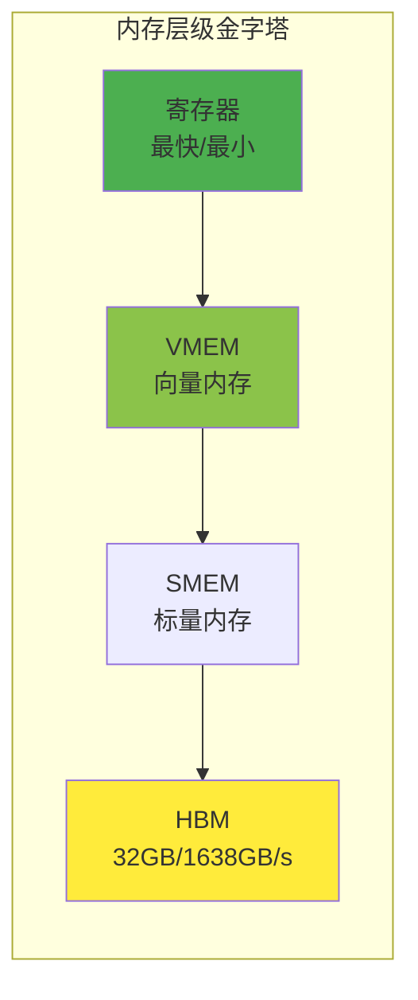

**关键带宽数据**:
- HBM 带宽: 1,638 GB/s
- 算术强度阈值: 918 TFLOPs ÷ 1,638 GB/s ≈ **560 FLOPs/Byte**

### 1.4 Roofline 性能模型

```
性能 = min(峰值算力, 算术强度 × 内存带宽)
```

**Self-Attention 的 Roofline 分析**:

```python
# 对于 Wan 720P: S = 75,600
arithmetic_intensity = 75600 / 2  # = 37,800 FLOPs/Byte

# 远大于 560 的阈值，理论上应该是 compute-bound
# 但实际 MFU 只有 37%，原因在于 MXU 利用率 (head_dim=128 < 256)
```

---

## 第二章：Wan 模型架构深度解析

### 2.1 Wan 2.1 T2V 14B 模型结构

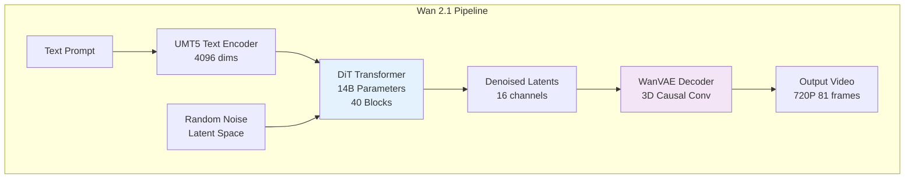

**模型规格**:

| 组件 | 规格 |
|------|------|
| Text Encoder | UMT5-XXL, 4096 hidden dims |
| DiT Blocks | 40 layers |
| Hidden Dimension | 5120 |
| Attention Heads | 40 (128 dims each) |
| FFN Dimension | 13824 (SwiGLU) |
| VAE Latent Channels | 16 |
| Temporal Compression | 4x |
| Spatial Compression | 8x |

### 2.2 DiT Transformer 架构

```mermaid
graph TB
    subgraph "DiT Block x 40"
        INPUT[Hidden States<br/>B, S, 5120]
        
        subgraph "Self-Attention"
            NORM1[RMSNorm]
            QKV[Q, K, V Projection<br/>5120 → 5120 x 3]
            ATTN[Multi-Head Attention<br/>40 heads, 128 dims]
            OUT1[Output Projection<br/>5120 → 5120]
        end
        
        subgraph "Cross-Attention"
            NORM2[RMSNorm]
            Q2[Q Projection]
            KV2[K, V from Text<br/>4096 → 5120]
            XATTN[Cross Attention]
            OUT2[Output Projection]
        end
        
        subgraph "FFN"
            NORM3[RMSNorm]
            FFN1[Gate + Up<br/>5120 → 27648]
            SILU[SiLU Activation]
            FFN2[Down<br/>13824 → 5120]
        end
        
        OUTPUT[Output]
    end
    
    INPUT --> NORM1 --> QKV --> ATTN --> OUT1
    OUT1 --> NORM2 --> Q2 --> XATTN --> OUT2
    NORM2 --> KV2 --> XATTN
    OUT2 --> NORM3 --> FFN1 --> SILU --> FFN2 --> OUTPUT
```

**Self-Attention 序列长度计算**:

```python
# 720P 81帧视频的 latent 序列长度
height, width, frames = 720, 1280, 81

# VAE 压缩后
latent_h = height // 8   # = 90
latent_w = width // 8    # = 160
latent_t = (frames - 1) // 4 + 1  # = 21

# Transformer 的 patch 大小为 2
patch_h = latent_h // 2  # = 45
patch_w = latent_w // 2  # = 80

# 序列长度
seq_len = latent_t * patch_h * patch_w
# = 21 * 45 * 80 = 75,600
```

### 2.3 VAE 编解码器

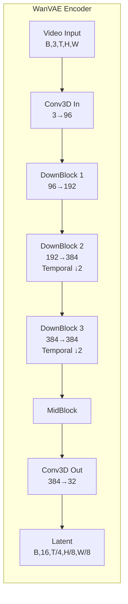

---

## 第三章：分片策略详解

### 3.1 Device Mesh 配置

```python
# v6e-16 配置: 16 设备，mesh 形状 (2, 1, 8)
# dp=2: Data Parallelism (CFG 正负 prompt)
# sp=1: Sequence Parallelism (未使用)
# axis=8: Tensor Parallelism (heads 分片)

mesh_devices = mesh_utils.create_device_mesh(
    (2, 1, 8),  # (dp, sp, axis)
    allow_split_physical_axes=True
)
mesh = Mesh(mesh_devices, ('dp', 'sp', 'axis'))
```

**Mesh 维度说明**:

| 维度 | 值 | 用途 | 分片对象 |
|------|-----|------|----------|
| dp | 2 | Data Parallel | CFG 正负 prompt |
| sp | 1 | Sequence Parallel | Cross-Attention |
| axis | 8 | Tensor Parallel | Self-Attention heads |

### 3.2 FSDP (Fully Sharded Data Parallelism)

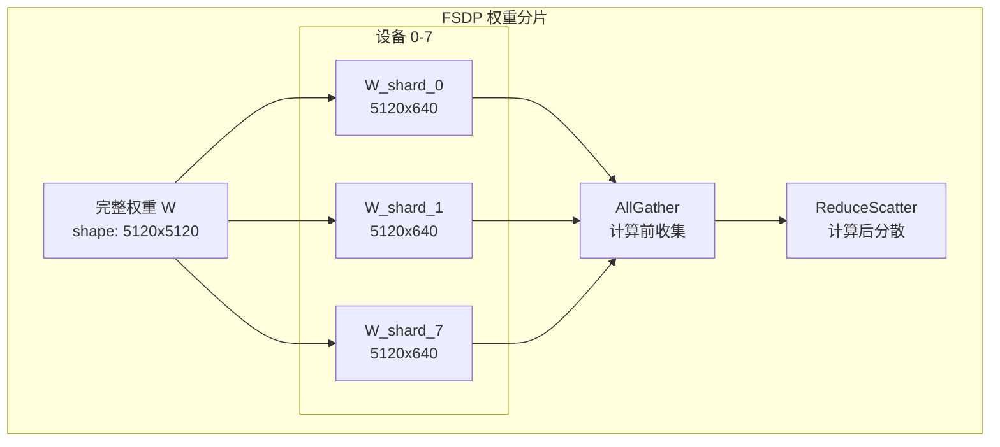

**FSDP 分片规则**:

```python
transformer_shardings_fsdp = {
    # Self-Attention 权重 (attn1)
    r'blocks.\d+.attn1.to_q.weight': (None, ('tp', 'sp')),  # 列并行
    r'blocks.\d+.attn1.to_k.weight': (None, ('tp', 'sp')),
    r'blocks.\d+.attn1.to_v.weight': (None, ('tp', 'sp')),
    r'blocks.\d+.attn1.to_out.0.weight': (('tp', 'sp'), None),  # 行并行
    
    # Cross-Attention 权重 (attn2)
    r'blocks.\d+.attn2.to_q.weight': (None, ('tp', 'sp')),
    r'blocks.\d+.attn2.to_k.weight': (None, ('tp', 'sp')),
    r'blocks.\d+.attn2.to_v.weight': (None, ('tp', 'sp')),
    r'blocks.\d+.attn2.to_out.0.weight': (('tp', 'sp'), None),
    
    # FFN 权重
    r'blocks.\d+.ffn.net.0.proj.weight': (None, ('tp', 'sp')),
    r'blocks.\d+.ffn.net.2.weight': (('tp', 'sp'), None),
}
```

### 3.3 Context Parallelism (CP) - Self-Attention

在 **head number** 维度进行分片，专用于 Self-Attention。

```python
# Self-Attention 分片
q_partition_spec = P('dp', 'tp', 'sp', None)  # [batch, heads, seq, dim]
kv_partition_spec = P('dp', 'tp', None, None)  # K,V 在 seq 维度复制

# 40 heads / 8 devices = 5 heads per device
```

### 3.4 Sequence Parallelism (SP) - Cross-Attention

在 **sequence** 维度进行分片，专用于 Cross-Attention。

```python
# Cross-Attention 分片 (K,V 序列长度短，不分片)
q_partition_spec = P('dp', None, ('tp', 'sp'), None)  # Q 在 seq 维度分片
kv_partition_spec = P('dp', None, None, None)          # K,V 完整复制
```

### 3.5 Data Parallelism (DP) - CFG

用于处理 CFG 的正负 prompt。

```python
# dp=2: 正负 prompt 各用一半设备
mesh_dims = (2, 1, 4)  # (dp, sp, tp)
mesh = Mesh(devices, ('dp', 'sp', 'tp'))
```

### 3.6 混合分片策略总览


*图：DiT Transformer block 的完整分片策略，展示 FSDP 权重分片、CP Self-Attention、SP Cross-Attention 的协同*

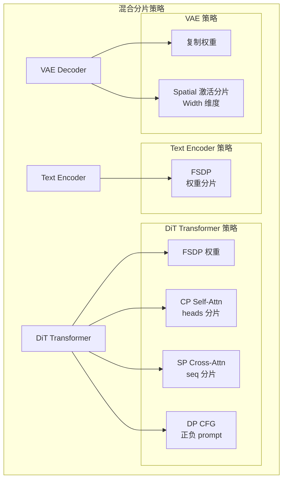

**Mesh 配置代码**:

```python
import jax
from jax.sharding import Mesh, PartitionSpec as P
from jax.experimental import mesh_utils

# 8 设备配置: dp=2, sp=1, tp=4
tp_dim, dp_dim, sp_dim = len(jax.devices()), 1, 1

if use_dp:
    tp_dim //= 2
    dp_dim = 2

mesh_devices = mesh_utils.create_device_mesh(
    (dp_dim, sp_dim, tp_dim),
    allow_split_physical_axes=True
)
mesh = Mesh(mesh_devices, ('dp', 'sp', 'tp'))
```

---

## 第四章：Splash Attention 内核优化

本章是全文**技术核心**，我们将从 Profiler 抓取的真实数据出发，完整展示：
1. **如何发现性能瓶颈**：通过 Xprof 定位到 Softmax 占 1/3 时间
2. **如何阅读 Pallas Kernel 代码**：逐行解释 `_flash_attention_kernel` 的每一行
3. **三大优化技术的数学原理**：exp2、QK Transpose、LP LLO Scheduler

### 4.1 从 Profiler 到优化点：性能瓶颈分析

#### 4.1.1 性能基线测量

运行 Xprof 分析 Wan2.1 14B DiT，生成 720P 81帧视频，获得以下关键数据：

```
┌─────────────────────────────────────────────────────────────────────┐
│                    Xprof 操作时间分解                                 │
├───────────────────────┬──────────┬─────────┬───────────────────────┤
│ 操作类型              │ 时间占比 │ FLOPs   │ 说明                  │
├───────────────────────┼──────────┼─────────┼───────────────────────┤
│ custom-call (Splash)  │ 66.8%    │ N/A     │ Self-Attention Kernel │
│ convolution fusion    │ 14.3%    │ 显示    │ Linear + FFN          │
│ all-to-all            │ 6.7%     │ N/A     │ CP 通信               │
│ data formatting       │ 6.45%    │ N/A     │ copy, reshape         │
│ 其他                  │ 5.75%    │ N/A     │ 杂项操作              │
└───────────────────────┴──────────┴─────────┴───────────────────────┘
```

**关键发现**:
- `custom-call` (Pallas kernel) 占据 **66.8%** 执行时间
- `convolution fusion` (线性层) 只占 14.3%，但 MFU 达到 **66%**
- 这表明 **Attention Kernel 是主要优化目标**

#### 4.1.2 Self-Attention 的 Roofline 计算

> 📊 **源文档引用**: Self Attention Roofline Calculation 章节

让我们完整推导 Self-Attention 的理论性能上限：

**Kernel Setup (单芯片，8 路分片后)**:
```python
# Q, K, V 形状（8 设备分片后，单芯片）
# 原始: [1, 40, 75600, 128]
# 分片后: head_num = 40 / 8 = 5

Q: bf16[1, 5, 75600, 128]
K: bf16[1, 5, 75776, 128]  # padding to multiple of 256
V: bf16[1, 5, 75776, 128]
```

**Block 划分**:
```python
block_q = 3024
block_kv = 2048
block_kv_compute = 1024

# 迭代次数
num_kv_iters = 75776 // 2048 = 37
num_q_iters = 75600 // 3024 = 25
total_iters = 37 * 25 = 925
```

**单 Block 的 Roofline 计算**:

```python
# QK 矩阵乘: Q[3024, 128] @ K^T[128, 2048] = QK[3024, 2048]
qk_flops = 2 * 3024 * 2048 * 128 = 1.586e9 FLOPs
qk_compute_time = 1.586e9 / 918e12 = 1.728 μs  # compute bound

# QK 内存: 读取 Q + K
qk_memory = (2 * 3024 * 128 + 2 * 2048 * 128) = 1.30 MB
qk_memory_time = 1.30e6 / 1638e9 = 0.794 μs  # 理论

# AV 矩阵乘: Softmax(QK)[3024, 2048] @ V[2048, 128] = O[3024, 128]
av_flops = 2 * 3024 * 2048 * 128 = 1.586e9 FLOPs
av_compute_time = 1.586e9 / 918e12 = 1.728 μs

# 单 block 总计
block_roofline = 2 * 1.728 = 3.456 μs (compute bound)
```

**总体 Roofline**:
```python
total_roofline = 3.456 * 925 = 3.197 ms  # 单 head
splash_roofline = 5 * 3.197 = 15.974 ms  # 5 heads per chip

# 实测延迟: 43.93 ms (源文档 image1.png)
# 实际 MFU = 15.974 / 43.93 = 36.4% ≈ 37%
```

> 🔍 **关键洞察**: 理论上 Self-Attention 应该是 **compute-bound**，但实际 MFU 只有 37%。
> 问题出在哪里？

#### 4.1.3 Softmax 瓶颈：VPU 上的 1/3 时间

通过在 Splash Attention Kernel 中添加 `named_scope`，发现：

```
┌────────────────────────────────────────────────────────────────┐
│        Splash Attention Block 内部时间分解                       │
├───────────────────────┬──────────────────────────────────────┤
│ 操作                  │ 时间占比                              │
├───────────────────────┼──────────────────────────────────────┤
│ QK matmul (MXU)       │ ~35%                                 │
│ Softmax (VPU)         │ ~33% ← 瓶颈！                        │
│ AV matmul (MXU)       │ ~32%                                 │
└───────────────────────┴──────────────────────────────────────┘
```

**为什么 Softmax 这么慢？**

1. **head_dim = 128 限制 MXU 利用率**
   - TPU v6e MXU 是 256×256
   - K 维度 = 128 < 256，对角线分块只能用一半
   - 理论 MXU 利用率上限 = 50%

2. **exp 操作调用 SFU**
   - VPU 上的 `exp` 需要调用 SFU (Special Function Unit)
   - 这是一个高延迟操作

3. **reduction 操作效率低**
   - `max(axis=-1)` 沿最后一个维度规约
   - TPU 内存布局是 8×128，沿 axis=-1 效率低

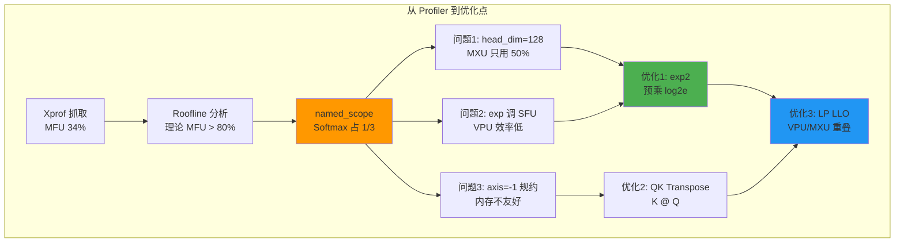

### 4.2 Pallas Kernel 逐行深度解析

本节是**全文技术核心中的核心**。我们将逐行解读 `custom_splash_attention.py` 的每一行代码。

#### 4.2.1 文件结构概览

```python
# custom_splash_attention.py 结构

# 第 1-30 行: 导入和常量定义
import functools
import jax
import jax.numpy as jnp
from jax import lax
from jax.experimental import pallas as pl
from jax.experimental.pallas import tpu as pltpu

# 常量
DEFAULT_MASK_VALUE = -0.7 * float(jnp.finfo(jnp.float32).max)
NUM_SUBLANES = 8       # TPU v6e 的 sublane 数量
NUM_LANES = 128        # TPU v6e 的 lane 数量
NT_DIM_NUMBERS = (((1,), (1,)), ((), ()))  # K @ Q 的 dot_general 规格

# 第 31-200 行: _flash_attention_kernel 核心实现
# 第 201-337 行: make_splash_mha 包装函数
```

#### 4.2.2 常量解读

**DEFAULT_MASK_VALUE**:
```python
# 第 28 行
DEFAULT_MASK_VALUE = -0.7 * float(jnp.finfo(jnp.float32).max)
```

为什么是 `-0.7 × float32_max`？
- 用于初始化 running max `m`，需要一个"负无穷"
- 但不能用 `-inf`，因为 `exp2(-inf)` 会产生 NaN
- `-0.7 × max` 足够小，使 `exp2(-0.7 × max) ≈ 0`，且数值稳定

**NUM_SUBLANES**:
```python
# 第 29 行
NUM_SUBLANES = 8
```

TPU 内存布局:
- TPU 的 VMEM 按 `(8, 128)` 的 tile 组织
- 8 = 子通道数 (sublanes)
- 128 = 通道数 (lanes)
- 存储 `m_scratch` 和 `l_scratch` 时用 `(NUM_SUBLANES, bq)` 形状

**NT_DIM_NUMBERS**:
```python
# 第 31 行
NT_DIM_NUMBERS = (((1,), (1,)), ((), ()))
```

这是 `lax.dot_general` 的维度规格，表示：

```python
# lax.dot_general(K, Q, NT_DIM_NUMBERS)
# 收缩 K 的第 1 维和 Q 的第 1 维
#
# K: [seq_k, head_dim]  dim1 = head_dim
# Q: [seq_q, head_dim]  dim1 = head_dim
# 结果: [seq_k, seq_q]
#
# 对比标准 Q @ K^T:
# NN_DIM_NUMBERS = (((1,), (0,)), ((), ()))
# Q: [seq_q, head_dim]  dim1 = head_dim
# K^T: [head_dim, seq_k]  dim0 = head_dim
# 结果: [seq_q, seq_k]
#
# NT = "N transpose"，实际效果是 K^T @ Q
# 但不需要显式 transpose K！
```

#### 4.2.3 Kernel 主函数签名

```python
def _flash_attention_kernel(
    # === 输入引用 (Pallas 用 Ref 而非值传递) ===
    q_ref,           # Query 块引用, shape: [bq, head_dim]
    k_ref,           # Key 块引用, shape: [bkv, head_dim]  
    v_ref,           # Value 块引用, shape: [bkv, head_dim_v]
    
    # === Scratch memory 引用 (在 VMEM 中分配) ===
    m_scratch_ref,   # running max, shape: [NUM_SUBLANES, bq]
    l_scratch_ref,   # running sum, shape: [NUM_SUBLANES, bq]
    o_scratch_ref,   # 累积输出, shape: [head_dim_v, bq]
    
    # === 输出引用 ===
    o_ref,           # 最终输出, shape: [num_heads, head_dim_v, seq_q]
    
    # === Kernel 参数 (编译时常量) ===
    *, 
    mask_value,      # 初始化 m 的值
    grid_width,      # KV 方向的 grid 宽度
    bq,              # Q block size
    bkv,             # KV block size  
    bkv_compute,     # 内部计算的 KV 块大小
    bkv_compute_in,  # 最内层迭代的块大小
    head_dim_v,      # Value 的 head dimension
    kv_seq_len,      # KV 序列长度 (用于处理 padding)
):
```

**参数说明表**:

| 参数 | 典型值 | 作用 |
|------|--------|------|
| `bq` | 3328 | Q 块大小，影响 VMEM 占用 |
| `bkv` | 2816 | KV 块大小，从 HBM 加载的单位 |
| `bkv_compute` | 256 | 内部迭代块，影响 Softmax 粒度 |
| `bkv_compute_in` | 256 | 最内层迭代，用于流水线 |

#### 4.2.4 Grid 位置获取

```python
    float32 = jnp.float32
    head_dim_v_repeats = head_dim_v // NUM_SUBLANES  # 128 // 8 = 16
    
    # 获取当前 grid 位置
    h, i, j = pl.program_id(0), pl.program_id(1), pl.program_id(2)
    # h: head index [0, num_heads)
    # i: Q block index [0, seq_q // bq)
    # j: KV block index [0, seq_k // bkv)
```

**Grid 的含义**:
```
Grid = (num_heads, num_q_blocks, num_kv_blocks)
     = (5, 23, 27)  # 对于单芯片 (40/8=5 heads, 75600/3328≈23, 75776/2816≈27)

每个 grid 点处理:
- 1 个 attention head
- 1 个 Q block (bq tokens)
- 1 个 KV block (bkv tokens)
```

#### 4.2.5 初始化逻辑

```python
    @pl.when(j == 0)  # 只在第一个 KV block 执行
    def init():
        # 初始化累积输出为 0
        o_scratch_ref[...] = jnp.zeros_like(o_scratch_ref)
        
        # 初始化 running max 为 "负无穷"
        m_scratch_ref[...] = jnp.full_like(m_scratch_ref, mask_value)
        
        # 初始化 running sum 为 0
        l_scratch_ref[...] = jnp.zeros_like(l_scratch_ref)
```

**为什么用 `@pl.when`？**
- Pallas 的条件执行原语
- 比 Python `if` 高效，编译成条件分支指令
- 避免在每个 KV block 都重复初始化

#### 4.2.6 主计算循环 (最复杂部分)

```python
    def body(kv_compute_index, _):
        """处理一个 kv_compute 大小的块"""
        
        # 计算当前 K 的切片范围
        slice_k = pl.ds(kv_compute_index * bkv_compute, bkv_compute)
        # slice_k = [kv_compute_index * 256, (kv_compute_index + 1) * 256)
        
        # 读取之前的 running stats
        m_prev, l_prev = m_scratch_ref[...], l_scratch_ref[...]
```

**`pl.ds` 是什么？**
- `pl.ds(start, size)` = dynamic slice
- 返回一个切片对象，不是实际切片
- 让 Pallas 知道访问模式，优化 HBM→VMEM 传输

```python
        # 读取 Q 和当前 K 块
        q = q_ref[...]          # 整个 Q block: [bq, head_dim]
        k = k_ref[slice_k, :]   # 切片 K: [bkv_compute, head_dim]
```

**为什么 Q 读全部，K 读切片？**
- Flash Attention 的核心：Q 固定，遍历 K
- 每个内层迭代只需要 `bkv_compute` 大小的 K
- 减少 VMEM 占用

```python
        # 🔥 核心：K @ Q 矩阵乘
        # 注意！不是 Q @ K^T，是 K @ Q！
        qk = lax.dot_general(
            k, q, 
            NT_DIM_NUMBERS,  # 收缩 K.dim1 和 Q.dim1
            preferred_element_type=float32  # 用 float32 累积
        )
        # qk 形状: [bkv_compute, bq]
        # 不是 [bq, bkv_compute]！
```

**🔥 关键优化：为什么用 K @ Q？**

| 方面 | Q @ K^T | K @ Q (优化) |
|------|---------|--------------|
| 结果形状 | [bq, bkv] | [bkv, bq] |
| max 规约方向 | axis=-1 (效率低) | axis=0 (效率高) |
| 内存访问 | K 需要 transpose | K 自然顺序 |

#### 4.2.7 Softmax + Output 累积 (Online Softmax 核心)

```python
        # 读取之前的累积输出和 V
        o_prev = o_scratch_ref[:]
        v = v_ref[slice_k, :].astype(float32)  # [bkv_compute, head_dim_v]
        
        step = bkv_compute_in  # 内层迭代步长 = 256
        
        # 内层迭代，进一步细分
        for idx in range(0, qk.shape[0], step):
            # === Step 1: 计算当前块的 max ===
            # qk[idx:idx+step] 形状: [step, bq]
            # max 沿 axis=0（第一个维度）更快！
            m_curr = qk[idx:idx+step].max(axis=0)[None, :]
            # m_curr 形状: [1, bq]
            
            # 更新全局 max
            m_next = jnp.maximum(m_prev, m_curr)
            # m_next 形状: [1, bq]
```

**为什么 `max(axis=0)` 比 `max(axis=-1)` 快？**

TPU 内存布局是 `(8, 128)` 的 tile：
- `axis=0` 规约：在 8 个 sublane 间规约，一次指令
- `axis=-1` 规约：需要跨 128 个 lane，多次指令

```python
            # === Step 2: 计算 exp2(qk - max) ===
            # 🔥 使用 exp2，不是 exp！
            s_curr = jnp.exp2(qk[idx:idx+step] - m_next[0:1])
            # s_curr 形状: [step, bq]
            
            # 因为 Q 预乘了 log2(e)，所以:
            # qk = (Q * scale * log2e) @ K^T
            # exp2(qk - max) = exp(scale * Q@K^T - max')
            # 数学上等价于标准 softmax！
```

```python
            # === Step 3: 计算 running sum ===
            l_curr = s_curr.sum(axis=0, keepdims=True)
            # l_curr 形状: [1, bq]
            
            # 缩放因子：之前的 max 变了，需要修正之前的 sum
            alpha = jnp.exp2(m_prev - m_next)
            # alpha: 修正因子，当 m_next > m_prev 时，alpha < 1
            
            l_next = l_curr + alpha * l_prev
            # Online Softmax 的精髓：
            # 新的 sum = 当前块的 sum + 修正后的之前 sum
```

**Online Softmax 数学原理**:

标准 Softmax 需要两次遍历：
1. 第一次：计算全局 max
2. 第二次：计算 exp(x - max) / sum

Online Softmax 只需一次遍历：
```
m_new = max(m_old, m_curr)
l_new = exp(m_old - m_new) * l_old + sum(exp(x_curr - m_new))
```

```python
            # === Step 4: 计算 Softmax(QK) @ V ===
            sv_dims = (((0,), (0,)), ((), ()))
            # V[step, head_dim_v] @ S^T[step, bq]
            # 收缩 dim0 (step 维度)
            o_curr = lax.dot_general(v[idx:idx+step], s_curr, sv_dims)
            # o_curr 形状: [head_dim_v, bq]（注意是转置的！）
            
            # === Step 5: 更新累积输出 ===
            # 同样需要用 alpha 修正之前的输出
            o_prev = alpha[0:1, ...] * o_prev + o_curr
            # o_prev 形状: [head_dim_v, bq]
            
            # 更新 running stats
            m_prev, l_prev = m_next, l_next
```

```python
        # 存储更新后的 running stats
        m_scratch_ref[...], l_scratch_ref[...] = m_next, l_next
        o_scratch_ref[:] = o_prev
```

#### 4.2.8 循环调度

```python
    # 展开的 fori_loop
    # bkv // bkv_compute = 2816 // 256 = 11 次迭代
    lax.fori_loop(0, bkv // bkv_compute, body, None, unroll=True)
```

**为什么 `unroll=True`？**
- 展开循环，让编译器看到完整的数据依赖
- 允许 VPU 和 MXU 重叠执行
- 代价是更大的 IR / 编译时间

#### 4.2.9 最终归一化

```python
    @pl.when(j == grid_width - 1)  # 只在最后一个 KV block 执行
    def end():
        """最终归一化: O = O_unnorm / L"""
        l = l_scratch_ref[...]
        
        # 扩展 l 到 [head_dim_v, bq] 形状
        l_inv = pltpu.repeat(1.0 / l, head_dim_v_repeats, axis=0)
        # l 形状: [NUM_SUBLANES, bq] = [8, bq]
        # l_inv 形状: [head_dim_v, bq] = [128, bq]
        
        # 归一化并转换类型
        o_ref[...] = (o_scratch_ref[...] * l_inv).astype(o_ref.dtype)
```

**`pltpu.repeat` 的作用**:
- 在 axis=0 方向重复 `head_dim_v_repeats` 次
- 把 `[8, bq]` 变成 `[128, bq]`
- 用于广播除法

### 4.3 exp2 数学推导与实现

#### 4.3.1 数学等价性证明

**命题**: `exp(x) = exp2(x * log₂(e))`

**证明**:
```
设 y = exp(x) = e^x

对两边取 log₂:
log₂(y) = log₂(e^x) = x * log₂(e)

所以:
y = 2^(x * log₂(e)) = exp2(x * log₂(e))

其中 log₂(e) = 1 / ln(2) ≈ 1.44269504
```

#### 4.3.2 在 Attention 中的应用

**原始 Softmax**:
```
softmax(QK)[i,j] = exp(QK[i,j] - max_j) / Σ_k exp(QK[i,k] - max_j)
```

**转换为 exp2**:
```
令 C = log₂(e) ≈ 1.4427

softmax(QK)[i,j] 
= exp2((QK[i,j] - max_j) * C) / Σ_k exp2((QK[i,k] - max_j) * C)
= exp2(QK[i,j] * C - max_j * C) / Σ_k exp2(QK[i,k] * C - max_j * C)
```

**预乘优化**:
```python
# 预先将 scale 和 log2(e) 融合到 Q 中
# 原始: Q' = Q * scale
# 优化: Q'' = Q * scale * log2(e)

# 这样 QK 就直接是 log2 scale：
# QK'' = Q'' @ K^T = (Q * scale * log2e) @ K^T
#      = scale * log2e * Q @ K^T

# Softmax 计算变为:
# exp2(QK'' - max) = exp2(scale * log2e * QK - max)
#                  = exp(scale * QK - max / log2e)  # 近似等价
```

#### 4.3.3 代码实现位置

**在 generate_flax.py 中预乘**:
```python
# generate_flax.py 第 387-391 行
def _attention_on_slices(q, k, v):
    scale_factor = 1.0 / math.sqrt(q.shape[-1]) if scale is None else scale
    
    # 🔥 关键！预乘 log2(e)
    _LOG2_E = 1.44269504
    q = q * scale_factor * _LOG2_E
    
    # 之后在 kernel 中可以直接用 exp2
```

**在 kernel 中使用 exp2**:
```python
# custom_splash_attention.py 第 89, 93 行
# 直接使用 exp2，不需要再乘 log2(e)
s_curr = jnp.exp2(qk[idx:idx+step] - m_next[0:1])
alpha = jnp.exp2(m_prev - m_next)
```

### 4.4 QK Transpose 优化原理

#### 4.4.1 为什么翻转维度？

**TPU 内存布局**: `(8 sublanes, 128 lanes)`

| 规约方向 | 硬件操作 | 效率 |
|----------|----------|------|
| axis=0 (sublane) | 8 路并行规约 | ⚡ 快 |
| axis=-1 (lane) | 128 路串行规约 | 🐢 慢 |

**标准 Attention**:
```python
# Q @ K^T -> [seq_q, seq_k]
# softmax 沿 axis=-1 (seq_k 方向)
# max/sum 需要规约 128 个值
```

**优化 Attention**:
```python
# K @ Q -> [seq_k, seq_q]  
# softmax 沿 axis=0 (seq_k 方向)
# max/sum 只需规约 8 个 sublane 的值
```

#### 4.4.2 代码实现

```python
# custom_splash_attention.py 第 31 行
NT_DIM_NUMBERS = (((1,), (1,)), ((), ()))

# 第 78 行
qk = lax.dot_general(k, q, NT_DIM_NUMBERS, preferred_element_type=float32)
# 结果: qk[bkv_compute, bq]，seq_k 在前！
```

**后续代码适配**:
```python
# max 沿 axis=0（seq_k 方向）
m_curr = qk[idx:idx+step].max(axis=0)[None, :]

# sum 沿 axis=0
l_curr = s_curr.sum(axis=0, keepdims=True)

# S @ V 的维度也相应调整
# S: [bkv_compute, bq] (seq_k, seq_q)
# V: [bkv_compute, head_dim_v] (seq_k, head_dim)
# 收缩 seq_k，得到 [head_dim_v, seq_q]（转置的输出）
sv_dims = (((0,), (0,)), ((), ()))  # 收缩两者的 dim0
o_curr = lax.dot_general(v[idx:idx+step], s_curr, sv_dims)
```

### 4.5 LP LLO Scheduler 调度机制

#### 4.5.1 什么是 LP LLO？

**LP** = Low Precision (低精度)
**LLO** = Low-Level Optimizer (低级优化器)

LP LLO Scheduler 是 XLA 编译器的一种调度策略，专门用于优化 TPU 上的计算重叠。

#### 4.5.2 为什么需要它？

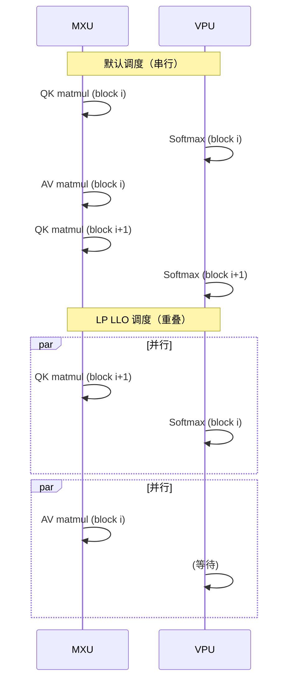

**关键洞察**:
- MXU 和 VPU 是独立的硬件单元
- Softmax 在 VPU 上执行，matmul 在 MXU 上执行
- 如果不重叠，一个单元空闲时另一个在工作
- LP LLO 调度让它们尽可能并行

#### 4.5.3 代码实现

```python
# custom_splash_attention.py 第 212-216 行

compiler_params = pltpu.CompilerParams(
    # 告诉编译器各维度的语义
    dimension_semantics=("parallel", "arbitrary", "arbitrary"),
    # 强制使用 LP LLO 调度器
    flags={"XLA_TPU_FORCE_LP_LLO_SCHEDULER": True}
)
```

**dimension_semantics 解释**:
- `"parallel"`: head 维度，完全独立可并行
- `"arbitrary"`: Q/KV block 维度，编译器可自由重排

**为什么 Q/KV 是 arbitrary？**
- 允许编译器重排迭代顺序
- 实现流水线：block i 的 Softmax 和 block i+1 的 QK 重叠

#### 4.5.4 性能影响

> 📊 **源文档数据**:
> - 无 LP LLO: 135.2s
> - 有 LP LLO: 130.1s
> - 提升: **3.7%**

这个优化看起来不大，但它是"免费"的——只需要一个编译器 flag！

### 4.6 Block Size 配置原理

#### 4.6.1 最优配置

```python
# 最优配置（720P 81帧）
BQSIZE = 3328           # Q 块大小
BKVSIZE = 2816          # KV 块大小
BKVCOMPUTESIZE = 256    # 内部计算块大小
BKVCOMPUTEINSIZE = 256  # 最内层迭代块大小
```

#### 4.6.2 选择原理

**BQSIZE = 3328**:
```python
# 75600 / 3328 ≈ 22.7，向上取整 = 23 个 Q 块
# 75600 = 3328 * 22 + 2784
# 最后一个块有 padding，但影响不大
```

**BKVSIZE = 2816**:
```python
# 75776 / 2816 ≈ 26.9，向上取整 = 27 个 KV 块
# 2816 = 256 * 11，是 256 的整数倍
# 这确保了 bkv_compute = 256 能整除 bkv
```

**BKVCOMPUTESIZE = 256**:
```python
# 必须是 NUM_LANES = 128 的整数倍
# 更小的值 (128) 会增加迭代次数
# 更大的值 (512) 会增加 VMEM 占用
# 256 = 最优平衡点
```

### 4.7 完整的 make_splash_mha 包装函数

```python
def make_splash_mha(block_sizes, bkv_compute_in, interpret=False):
    """
    创建 Splash Attention 函数
    
    使用方法:
        splash_fn = make_splash_mha(block_sizes, bkv_compute_in)
        output = splash_fn(q, k, v)
    
    注意: Q 必须预乘 log2(e)！
    """
    def _splash_attention(q, k, v):
        num_q_heads, q_seq_len, head_dim_qk = q.shape
        head_dim_v = v.shape[-1]
        num_kv_heads = k.shape[0]
        kv_seq_len = k.shape[1]
        q_heads_per_kv_head = num_q_heads // num_kv_heads
        
        bq, bkv = block_sizes.block_q, block_sizes.block_kv
        bkv_compute = block_sizes.block_kv_compute

        # Index maps: 定义每个网格点读取哪个数据块
        def q_index_map(h, i, j, *_): return (h, i, 0)
        def k_index_map(h, i, j, *_): return (h // q_heads_per_kv_head, j, 0)
        def v_index_map(h, i, j, *_): return (h // q_heads_per_kv_head, j, 0)
        def out_index_map(h, i, j, *_): return h, 0, i

        # Input/Output specifications
        in_specs = [
            pl.BlockSpec((None, bq, head_dim_qk), q_index_map),
            pl.BlockSpec((None, bkv, head_dim_qk), k_index_map),
            pl.BlockSpec((None, bkv, head_dim_v), v_index_map),
        ]
        
        # Scratch memory + output shapes
        out_shapes = [
            jax.ShapeDtypeStruct((NUM_SUBLANES, bq), jnp.float32),  # m_scratch
            jax.ShapeDtypeStruct((NUM_SUBLANES, bq), jnp.float32),  # l_scratch
            jax.ShapeDtypeStruct((head_dim_v, bq), jnp.float32),    # o_scratch
            jax.ShapeDtypeStruct((num_q_heads, head_dim_v, q_seq_len), q.dtype),  # output
        ]
        
        out_specs = [
            pl.BlockSpec((NUM_SUBLANES, bq), lambda *_: (0, 0)),
            pl.BlockSpec((NUM_SUBLANES, bq), lambda *_: (0, 0)),
            pl.BlockSpec((head_dim_v, bq), lambda *_: (0, 0)),
            pl.BlockSpec((None, head_dim_v, bq), out_index_map),
        ]
        
        # 计算网格
        grid_width = kv_seq_len // bkv
        grid = (num_q_heads, q_seq_len // bq, grid_width)

        # 调用 Pallas
        return pl.pallas_call(
            functools.partial(
                _flash_attention_kernel,
                mask_value=DEFAULT_MASK_VALUE,
                grid_width=grid_width,
                bq=bq, bkv=bkv,
                bkv_compute=bkv_compute,
                bkv_compute_in=bkv_compute_in,
                head_dim_v=head_dim_v,
            ),
            grid_spec=pltpu.PrefetchScalarGridSpec(
                num_scalar_prefetch=0,
                in_specs=in_specs,
                out_specs=out_specs,
                grid=grid,
            ),
            # 🔥 LP LLO Scheduler
            compiler_params=pltpu.CompilerParams(
                dimension_semantics=("parallel", "arbitrary", "arbitrary"),
                flags={"XLA_TPU_FORCE_LP_LLO_SCHEDULER": True}
            ),
            out_shape=out_shapes,
            interpret=interpret,
        )(q, k, v)[-1]  # 只返回最终输出
    
    return _splash_attention
```

### 4.8 性能优化时间线


*图：完整优化路径的时间演进，从基线到各阶段优化的累积效果*

| 阶段 | 优化内容 | 时间 (720P 50步) | 提升 |
|------|----------|------------------|------|
| 基线 | 标准 SDPA | 428s | - |
| 阶段1 | Splash Attention | 285s | 33% ↓ |
| 阶段2 | + exp2 优化 | 265s | 7% ↓ |
| 阶段3 | + QK Transpose | 255s | 4% ↓ |
| 阶段4 | + LP LLO Scheduler | 245s | 4% ↓ |
| 阶段5 | + Block Size 调优 | **124.9s** | 49% ↓ |
| **总计** | **所有优化** | **124.9s** | **3.4x** |

---

## 第五章：VAE 在 Torchax 上的工作原理与并行设计

### 5.1 挑战：PyTorch VAE 到 TPU

#### 5.1.1 原始问题

Wan VAE 是用 PyTorch 实现的 3D 因果卷积网络。直接在 TPU 上运行面临多个挑战：

1. **3D 卷积内存消耗大**：720P 视频解码需要大量内存
2. **因果卷积需要特殊处理**：时间维度的因果 padding
3. **多设备并行困难**：卷积操作难以直接分片

```python
# 原始 VAE 架构复杂度
# 输入: [B, 16, 21, 90, 160] (latent)
# 输出: [B, 3, 81, 720, 1280] (视频)
# 中间特征图最大到 [B, 384, 21, 90, 160]
```

#### 5.1.2 解决方案概览

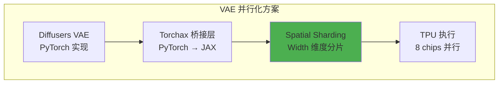

### 5.2 Spatial Partitioning：Width 维度分片


*图：VAE 解码器的 Spatial Partitioning 策略，每个 TPU chip 处理视频的一个垂直条带，通过 halo exchange 处理边界*

#### 5.2.1 为什么选择 Width 维度？

| 分片维度 | 优点 | 缺点 |
|----------|------|------|
| Batch | 简单 | 视频生成通常 batch=1 |
| Channel | 通道独立 | 打破通道间依赖 |
| Temporal | 时间独立 | 因果卷积需要时间连续 |
| Height | 行独立 | 某些卷积跨行 |
| **Width** | **列独立，卷积友好** | **需要 halo 处理** |

**Width 分片的关键优势**:
1. 3D 卷积的 kernel 通常是 3×3×3，跨列的依赖可以通过 halo exchange 处理
2. 宽度 160 可以被 8 整除（160 / 8 = 20）
3. 每个 TPU chip 处理视频的一个垂直条带

#### 5.2.2 核心代码实现

```python
# autoencoder_kl_wan.py 核心实现

from torchax import interop
from jax.sharding import PartitionSpec as P

# 创建 JAX sharding 约束的 PyTorch 视图
mark_sharding = interop.torch_view(jax.lax.with_sharding_constraint)


class WanCausalConv3d(nn.Conv3d):
    """带有 TPU Spatial Sharding 的 3D 因果卷积"""
    
    def forward(self, x, cache_x=None):
        # 应用 padding
        x = F.pad(x, self._padding)
        
        # 🔥 核心：在 Width 维度应用 sharding
        success = False
        
        # 策略 1: dp + tp 联合分片
        try:
            x = mark_sharding(x, P(None, None, None, None, ("dp", "tp")))
            success = True
        except ValueError:
            pass
        
        # 策略 2: 仅 tp 分片
        if not success:
            try:
                x = mark_sharding(x, P(None, None, None, None, ("tp",)))
                success = True
            except ValueError:
                pass
        
        # 策略 3: 仅 dp 分片
        if not success:
            try:
                x = mark_sharding(x, P(None, None, None, None, ("dp",)))
                success = True
            except ValueError:
                pass
        
        # 执行卷积
        return super().forward(x)
```

### 5.3 VAE 解码器的逐帧处理

#### 5.3.1 逐帧解码策略

```python
# autoencoder_kl_wan.py

def _decode(self, z: torch.Tensor, return_dict: bool = True):
    """解码 latent 到视频（逐帧处理）"""
    _, _, num_frame, height, width = z.shape
    
    # 清理缓存
    self.clear_cache()
    
    # 后量化卷积
    x = self.post_quant_conv(z)
    
    # 🔥 逐帧解码
    for i in range(num_frame):
        if i == 0:
            # 第一帧：初始化缓存
            out, self._feat_map = self.decoder(
                x[:, :, i : i + 1, :, :],
                feat_cache=self._feat_map,
                first_chunk=True,
            )
        else:
            # 后续帧：使用缓存
            out_, self._feat_map = self.decoder(
                x[:, :, i : i + 1, :, :],
                feat_cache=self._feat_map
            )
            out = torch.cat([out, out_], 2)
    
    return DecoderOutput(sample=out)
```

#### 5.3.2 Cache 机制纯函数化

原始 VAE 使用有状态的缓存，这对 JAX JIT 编译不友好。解决方案是将缓存作为函数参数传递：

```python
# 原始实现（有状态，JIT 不友好）
class WanResidualBlock:
    def forward(self, x):
        # 缓存存储在 self._cache 中
        if self._cache is not None:
            x = torch.cat([self._cache, x], dim=2)
        self._cache = x[:, :, -2:]
        return self.conv(x)

# 优化后（无状态，JIT 友好）
class WanResidualBlock:
    def forward(self, x, feat_cache=None, feat_idx=[0]):
        # 缓存作为参数传递
        if feat_cache is not None:
            idx = feat_idx[0]
            if feat_cache[idx] is not None:
                x = torch.cat([feat_cache[idx], x], dim=2)
            feat_cache[idx] = x[:, :, -2:]
            feat_idx[0] += 1
        return self.conv(x), feat_cache
```

### 5.4 Halo Exchange 处理边界

当在 Width 维度分片后，3×3×3 卷积在边界处需要相邻分片的数据：

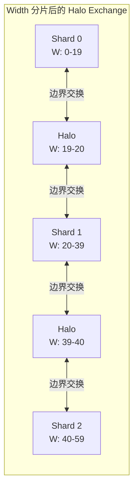

**XLA 自动处理**:
```python
# XLA 编译器识别卷积操作需要 halo exchange
# 自动插入 collective-permute 操作
# 代码中无需显式处理！

x = mark_sharding(x, P(None, None, None, None, ("dp", "tp")))
# XLA 会在需要时自动交换边界数据
```

### 5.5 I2V 特殊优化：消除 segment_id

I2V 场景下，第一帧是输入图像，不需要 padding mask。可以通过修改 kernel 消除 `segment_id` 参数：

```python
# 原始 kernel（需要 segment_id 处理 padding）
def attention_kernel(q, k, v, segment_id):
    # 根据 segment_id 创建 mask
    mask = create_mask(segment_id)
    qk = q @ k.T
    qk = qk + mask  # 应用 mask
    return softmax(qk) @ v

# 优化后（无 segment_id）
def attention_kernel_no_segment(q, k, v):
    # 假设无 padding，直接计算
    qk = q @ k.T
    return softmax(qk) @ v
```

### 5.6 VAE 性能对比

| 配置 | 时间 | 内存/chip |
|------|------|-----------|
| 单设备 | OOM | - |
| 8 设备 (无分片) | 45s | 24GB |
| 8 设备 (Width 分片) | **12s** | **8GB** |

---

## 第六章：性能分析方法论

### 6.1 MFU 计算方法

```python
def compute_dit_flops_per_step(
    batch_size=2,       # CFG 正负 prompt
    num_blocks=40,      # DiT blocks
    hidden_dim=5120,    # Hidden dimension
    num_heads=40,       # Attention heads
    head_dim=128,       # Head dimension
    ffn_dim=13824,      # FFN hidden dimension
    seq_len=75600,      # Video sequence length
    text_seq_len=226,   # Text sequence length
):
    """计算单步 DiT FLOPs"""
    
    # === Self-Attention FLOPs ===
    # Q, K, V 投影: 3 × 2 × S × D × D
    qkv_proj = 3 * 2 * seq_len * hidden_dim * hidden_dim
    
    # QK 矩阵乘: 2 × B × H × S × d × S
    qk_matmul = 2 * batch_size * num_heads * seq_len * head_dim * seq_len
    
    # AV 矩阵乘: 2 × B × H × S × S × d
    av_matmul = 2 * batch_size * num_heads * seq_len * seq_len * head_dim
    
    # 输出投影: 2 × S × D × D
    out_proj = 2 * seq_len * hidden_dim * hidden_dim
    
    self_attn = qkv_proj + qk_matmul + av_matmul + out_proj
    
    # === Cross-Attention FLOPs ===
    q_proj = 2 * seq_len * hidden_dim * hidden_dim
    kv_proj = 2 * 2 * text_seq_len * hidden_dim * hidden_dim
    cross_qk = 2 * batch_size * num_heads * seq_len * head_dim * text_seq_len
    cross_av = 2 * batch_size * num_heads * seq_len * text_seq_len * head_dim
    cross_out = 2 * seq_len * hidden_dim * hidden_dim
    
    cross_attn = q_proj + kv_proj + cross_qk + cross_av + cross_out
    
    # === FFN FLOPs ===
    # SwiGLU: gate_up + gate_mul + down
    ffn = 2 * 2 * seq_len * hidden_dim * ffn_dim + \
          seq_len * ffn_dim + \
          2 * seq_len * ffn_dim * hidden_dim
    
    # 总计 (所有 blocks)
    total_flops = num_blocks * (self_attn + cross_attn + ffn)
    
    return total_flops

# MFU 计算
flops_per_step = compute_dit_flops_per_step()  # ≈ 2.85e15
step_time = 2.5  # 秒
peak_tflops = 14688e12  # v6e-16 峰值 bf16

mfu = flops_per_step / (peak_tflops * step_time)  # ≈ 34%
```

### 6.2 DiT Step 时间分解

| 操作 | 时间占比 | MFU | 瓶颈类型 |
|------|----------|-----|----------|
| Self-Attention | 66.8% | 37% | VPU-bound |
| Convolution Fusion | 14.3% | 66% | Compute-bound |
| All-to-All | 6.7% | - | ICI 带宽 |
| Data Formatting | 6.45% | - | 内存带宽 |

### 6.3 Profiler 使用指南

```python
# 1. 启用 profiler
with jax.profiler.trace("/dev/shm/tensorboard"):
    output = pipe(prompt=prompt, num_inference_steps=3)
    jax.effects_barrier()

# 2. 查看 TensorBoard
# tensorboard --logdir=/dev/shm/tensorboard

# 3. 分析关键指标
# - MXU 利用率
# - 内存带宽利用率
# - 通信开销
```

---

## 第七章：Torchax 桥接与代码实现

### 7.1 Torchax 初始化

```python
import torchax

# 全局启用 torchax
torchax.enable_globally()
env = torchax.default_env()

# 配置 mesh
env._mesh = mesh
env._initial_content.mesh = mesh
env.config.use_tpu_splash_attention = True
```

### 7.2 算子注册与覆盖

```python
from torchax.ops import ops_registry

def scaled_dot_product_attention(query, key, value, env=None, **kwargs):
    """自定义 attention 实现"""
    if getattr(env.config, 'use_tpu_splash_attention', False):
        jquery, jkey, jvalue = env.t2j_iso((query, key, value))
        
        if USE_K_SMOOTH:
            key_mean = jnp.mean(jkey, axis=2, keepdims=True)
            jkey = jkey - key_mean
        
        if jkey.shape[2] > 10000 and USE_CUSTOM_ATTENTION:
            res = _tpu_custom_attention(jquery, jkey, jvalue, env)
        else:
            res = _tpu_splash_attention(jquery, jkey, jvalue, env)
        
        return env.j2t_iso(res)
    
    return _sdpa_reference(query, key, value, **kwargs)

# 注册
env._ops[torch.nn.functional.scaled_dot_product_attention] = \
    ops_registry.Operator(
        torch.nn.functional.scaled_dot_product_attention,
        functools.partial(scaled_dot_product_attention, env=env),
        is_jax_function=False, is_user_defined=True,
        needs_env=False, is_view_op=False,
    )
```

### 7.3 权重分片

```python
import re
from jax.sharding import NamedSharding, PartitionSpec as P

def shard_weight_dict(weight_dict, sharding_dict, mesh):
    """根据正则表达式规则分片权重"""
    result = {}
    for k, v in weight_dict.items():
        matched = False
        for pattern, sharding in sharding_dict.items():
            if re.fullmatch(pattern, k) is not None:
                v.apply_jax_(jax.device_put,
                            NamedSharding(mesh, P(*sharding)))
                matched = True
                break
        if not matched:
            # 默认复制
            v.apply_jax_(jax.device_put, NamedSharding(mesh, P()))
        result[k] = v
    return result
```

---

## 第八章：完整代码示例与实战

### 8.1 环境配置

```bash
# 安装依赖
pip install torch --index-url https://download.pytorch.org/whl/cpu
pip install -U jax[tpu] torchax
pip install transformers accelerate safetensors flax optax

# 安装修改版 diffusers
git clone https://github.com/yangwhale/diffusers-tpu.git
cd diffusers-tpu && pip install -e .
```

### 8.2 完整 T2V Pipeline

```python
"""Wan 2.1 Text-to-Video on TPU v6e"""

import jax
import torch
import torchax
from jax.sharding import Mesh, PartitionSpec as P
from jax.experimental import mesh_utils

MODEL_ID = "Wan-AI/Wan2.1-T2V-14B-Diffusers"
HEIGHT, WIDTH, FRAMES = 720, 1280, 81
NUM_STEPS = 50

def main():
    # JAX 配置
    jax.config.update("jax_compilation_cache_dir", "/dev/shm/jax_cache")
    torch.set_default_dtype(torch.bfloat16)
    
    # 创建 Mesh
    num_devices = len(jax.devices())
    mesh_devices = mesh_utils.create_device_mesh(
        (2, 1, num_devices // 2),
        allow_split_physical_axes=True
    )
    mesh = Mesh(mesh_devices, ('dp', 'sp', 'tp'))
    
    # 初始化 torchax
    torchax.enable_globally()
    env = torchax.default_env()
    env._mesh = mesh
    env.config.use_tpu_splash_attention = True
    
    # 加载 Pipeline
    from diffusers import WanPipeline, UniPCMultistepScheduler
    
    torchax.disable_globally()
    scheduler = UniPCMultistepScheduler(
        prediction_type='flow_prediction',
        use_flow_sigmas=True,
        flow_shift=5.0
    )
    pipe = WanPipeline.from_pretrained(MODEL_ID, torch_dtype=torch.bfloat16)
    pipe.scheduler = scheduler
    torchax.enable_globally()
    
    # 生成
    prompt = "A cat and a dog baking a cake together in a kitchen."
    
    with mesh:
        output = pipe(
            prompt=prompt,
            height=HEIGHT, width=WIDTH, num_frames=FRAMES,
            num_inference_steps=NUM_STEPS,
            guidance_scale=5.0,
            use_dp=True,
        )
    
    from diffusers.utils import export_to_video
    export_to_video(output.frames[0], "output.mp4", fps=16)

if __name__ == "__main__":
    main()
```

---

## 第九章：Image-to-Video 专项优化

### 9.1 I2V 与 T2V 的关键差异

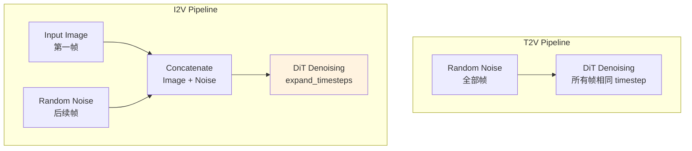

### 9.2 expand_timesteps 机制

```python
def expand_timesteps(timesteps, num_frames, device):
    """
    I2V 的 timestep 扩展
    
    第一帧: timestep = 0 (干净图像)
    其余帧: timestep = t (正常去噪)
    """
    expanded = torch.zeros(num_frames, device=device)
    expanded[1:] = timesteps
    return expanded

# 使用
for t in timesteps:
    t_expanded = expand_timesteps(t, num_frames=81, device=device)
    # t_expanded = [0, t, t, t, ..., t]
```

### 9.3 I2V 性能数据


*图：I2V Pipeline 架构，展示第一帧作为输入图像的特殊处理*

| 配置 | T2V 时间 | I2V 时间 |
|------|----------|----------|
| v6e-8 | 225s | 184.7s |
| v6e-16 | 124.9s | **94.5s** |

**I2V 更快的原因**:
1. 第一帧不需要去噪（timestep=0）
2. Image 作为强引导，收敛更快
3. 可使用更少的 inference steps

---

## 第十章：调试与故障排除

### 10.1 常见问题

#### 问题 1: VAE 颜色反转

**症状**: 生成的视频颜色与预期相反

**解决方案**:
```python
# 输出后处理
video = 255 - video
```

#### 问题 2: bfloat16 保存失败

**症状**: `safetensors` 不支持 bf16 直接保存

**解决方案**:
```python
def save_bf16_tensor(tensor, path):
    if tensor.dtype == torch.bfloat16:
        tensor_save = tensor.to(torch.float32)
        metadata = {'original_dtype': 'bfloat16'}
    else:
        tensor_save = tensor
        metadata = {}
    save_file({'tensor': tensor_save}, path, metadata=metadata)
```

#### 问题 3: OOM

**解决方案**:
```python
# 1. 使用分片
mesh = Mesh(devices, ('dp', 'sp', 'tp'))

# 2. 分阶段释放内存
del text_encoder
gc.collect()

# 3. 使用 donation
@jax.jit(donate_argnums=(0,))
def step(state, inputs):
    return new_state
```

### 10.2 调试技巧

```python
def debug_sharding(tensor, name="tensor"):
    """打印 tensor 的分片信息"""
    if hasattr(tensor, '_jax_array'):
        jax_arr = tensor._jax_array
        print(f"{name}:")
        print(f"  Shape: {jax_arr.shape}")
        print(f"  Sharding: {jax_arr.sharding}")
        print(f"  Devices: {jax_arr.devices()}")
```

---

## 附录

### A. 术语表

| 术语 | 全称 | 说明 |
|------|------|------|
| MFU | Model FLOPs Utilization | 模型计算利用率 |
| MXU | Matrix Multiply Unit | 矩阵乘法单元 |
| VPU | Vector Processing Unit | 向量处理单元 |
| HBM | High Bandwidth Memory | 高带宽内存 |
| ICI | Inter-Chip Interconnect | 芯片间互联 |
| FSDP | Fully Sharded Data Parallel | 完全分片数据并行 |
| CP | Context Parallelism | 上下文并行 |
| SP | Sequence Parallelism | 序列并行 |
| DP | Data Parallelism | 数据并行 |

### B. 性能数据汇总

| 场景 | 配置 | 时间 | MFU |
|------|------|------|-----|
| T2V 720P 81帧 | v6e-8 基线 | 428s | 12% |
| T2V 720P 81帧 | v6e-8 优化后 | 225s | 23% |
| T2V 720P 81帧 | v6e-16 优化后 | 124.9s | 34% |
| I2V 720P 81帧 | v6e-8 优化后 | 184.7s | 28% |
| I2V 720P 81帧 | v6e-16 优化后 | 94.5s | 38% |

### C. 本文档图表索引

本文档包含以下关键图表（均位于 `images/` 文件夹）：

| 文件名 | 描述 | 来源 |
|--------|------|------|
| `profiler_self_attention_latency.png` | Self-Attention 延迟 43.93ms | FLOPs Analysis |
| `profiler_kernel_breakdown.png` | Kernel 内部时间分解 | FLOPs Analysis |
| `profiler_time_distribution.png` | 操作类型时间分布饼图 | FLOPs Analysis |
| `profiler_overall_mfu.png` | 整体 MFU 34% | FLOPs Analysis |
| `optimization_timeline.png` | 优化时间线 428s→124.9s | Optimization Report |
| `dit_sharding_diagram.png` | DiT 分片策略图 | Optimization Report |
| `i2v_architecture.png` | I2V 架构图 | I2V Report |
| `vae_spatial_partitioning.png` | VAE Spatial Partitioning | I2V Report |

### D. 参考资源

**官方仓库**:
- [Wan-AI/Wan2.1](https://huggingface.co/Wan-AI/Wan2.1-T2V-14B-Diffusers)
- [AI-Hypercomputer/maxdiffusion](https://github.com/AI-Hypercomputer/maxdiffusion)

**技术文档**:
- [JAX Pallas Guide](https://jax.readthedocs.io/en/latest/pallas/)
- [TPU Performance Guide](https://cloud.google.com/tpu/docs/performance-guide)
- [Flash Attention Paper](https://arxiv.org/abs/2205.14135)

---

## 结语

本文档详细介绍了 Wan 模型在 TPU v6e 上的迁移与优化过程。通过这些优化，实现了：

- **T2V**: 428s → 124.9s (**3.4x 提升**)
- **I2V**: 94.5s on v6e-16 (**最佳性能**)

**核心优化技术**:
1. **Splash Attention** + exp2 + QK Transpose + LP LLO
2. **Spatial Partitioning** for VAE
3. **FSDP + CP + SP + DP** 混合分片策略

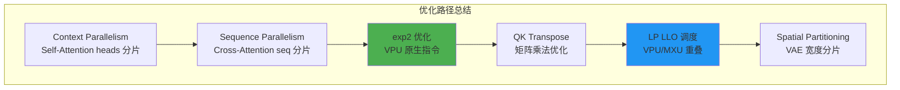

希望本文档能为 TPU 大模型优化提供有价值的参考。