# Wan 模型 TPU 迁移与优化完全指南

> **版本**: 3.0 | **更新日期**: 2024年12月
> 
> 本文档汇集了 Wan 2.1/2.2 模型在 Google Cloud TPU v6e 上的迁移与优化全部精华，包含详细的硬件架构分析、分片策略、Splash Attention 内核优化、VAE 优化技术以及完整的实现代码。

---

## 目录

- [第一章：TPU v6e 硬件架构与性能特性](#第一章tpu-v6e-硬件架构与性能特性)
- [第二章：Wan 模型架构深度解析](#第二章wan-模型架构深度解析)
- [第三章：分片策略详解](#第三章分片策略详解)
- [第四章：Splash Attention 内核优化](#第四章splash-attention-内核优化)
- [第五章：VAE 在 Torchax 上的工作原理与并行设计](#第五章vae-在-torchax-上的工作原理与并行设计)
- [第六章：性能分析方法论](#第六章性能分析方法论)
- [第七章：Torchax 桥接与代码实现](#第七章torchax-桥接与代码实现)
- [第八章：完整代码示例与实战](#第八章完整代码示例与实战)
- [第九章：Image-to-Video 专项优化](#第九章image-to-video-专项优化)
- [第十章：调试与故障排除](#第十章调试与故障排除)
- [附录](#附录)

---

## 第一章：TPU v6e 硬件架构与性能特性

### 1.1 TPU v6e 核心规格

TPU v6e (代号 Trillium) 是 Google Cloud 最新一代张量处理单元，专为大规模机器学习训练和推理优化。

| 规格项 | TPU v6e 单芯片 | TPU v6e-8 | TPU v6e-16 |
|--------|---------------|-----------|------------|
| **峰值 bf16 TFLOPs** | 918 | 7,344 | 14,688 |
| **HBM 容量** | 32 GB | 256 GB | 512 GB |
| **HBM 带宽** | 1,638 GB/s | 13,104 GB/s | 26,208 GB/s |
| **芯片间互联** | ICI 3.0 | 环形拓扑 | 2D Torus |
| **MXU 规格** | 256×256 | - | - |

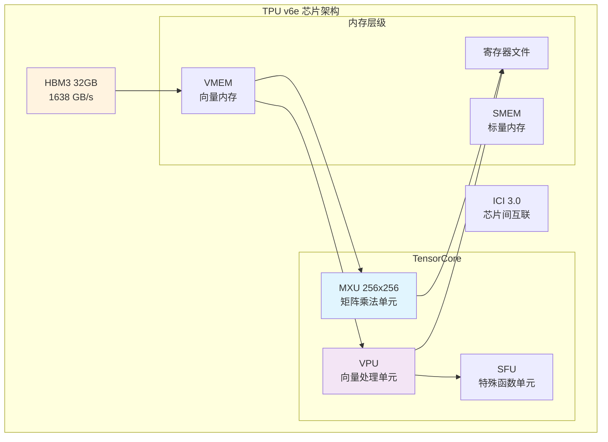

### 1.2 计算单元架构

#### MXU (Matrix Multiply Unit)
- **规格**: 256×256 脉动阵列
- **数据类型**: bf16, int8
- **峰值性能**: 918 TFLOPs (bf16)
- **关键限制**: 当 K 维度 < 256 时，MXU 利用率下降

```python
# MXU 利用率计算示例
mxu_size = 256
head_dim = 128  # Wan 模型的 head dimension

# K 维度 = head_dim = 128，只占用 MXU 一半
mxu_utilization = head_dim / mxu_size  # = 0.5 = 50%
```

#### VPU (Vector Processing Unit)
- **功能**: 向量运算（softmax、layernorm、激活函数等）
- **特点**:
  - `exp2` 比 `exp` 更高效（原生硬件指令）
  - 是 attention softmax 的主要执行单元

### 1.3 内存层级与带宽

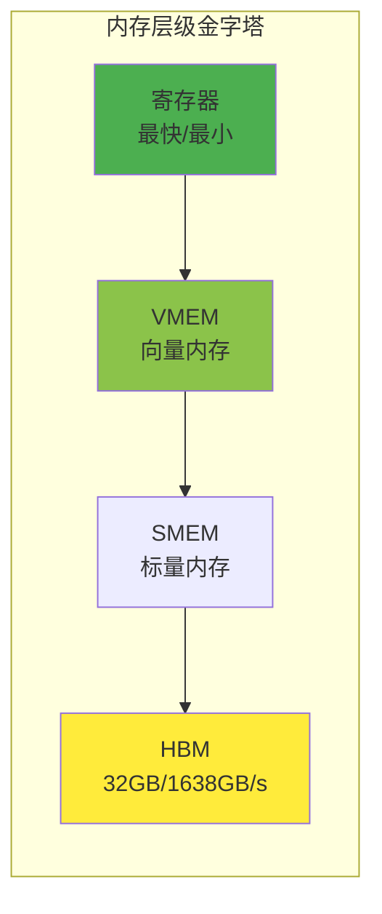

**关键带宽数据**:
- HBM 带宽: 1,638 GB/s
- 算术强度阈值: 918 TFLOPs ÷ 1,638 GB/s ≈ **560 FLOPs/Byte**

### 1.4 Roofline 性能模型

```
性能 = min(峰值算力, 算术强度 × 内存带宽)
```

**Self-Attention 的 Roofline 分析**:

```python
# 对于 Wan 720P: S = 75,600
arithmetic_intensity = 75600 / 2  # = 37,800 FLOPs/Byte

# 远大于 560 的阈值，理论上应该是 compute-bound
# 但实际 MFU 只有 37%，原因在于 MXU 利用率 (head_dim=128 < 256)
```

---

## 第二章：Wan 模型架构深度解析

### 2.1 Wan 2.1 T2V 14B 模型结构

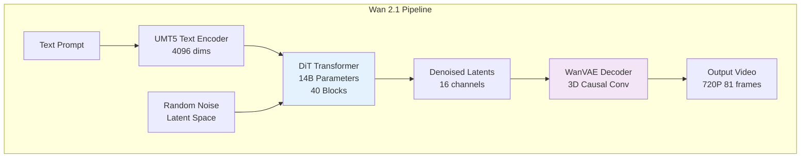

**模型规格**:

| 组件 | 规格 |
|------|------|
| Text Encoder | UMT5-XXL, 4096 hidden dims |
| DiT Blocks | 40 layers |
| Hidden Dimension | 5120 |
| Attention Heads | 40 (128 dims each) |
| FFN Dimension | 13824 (SwiGLU) |
| VAE Latent Channels | 16 |
| Temporal Compression | 4x |
| Spatial Compression | 8x |

### 2.2 DiT Transformer 架构

```mermaid
graph TB
    subgraph "DiT Block x 40"
        INPUT[Hidden States<br/>B, S, 5120]
        
        subgraph "Self-Attention"
            NORM1[RMSNorm]
            QKV[Q, K, V Projection<br/>5120 → 5120 x 3]
            ATTN[Multi-Head Attention<br/>40 heads, 128 dims]
            OUT1[Output Projection<br/>5120 → 5120]
        end
        
        subgraph "Cross-Attention"
            NORM2[RMSNorm]
            Q2[Q Projection]
            KV2[K, V from Text<br/>4096 → 5120]
            XATTN[Cross Attention]
            OUT2[Output Projection]
        end
        
        subgraph "FFN"
            NORM3[RMSNorm]
            FFN1[Gate + Up<br/>5120 → 27648]
            SILU[SiLU Activation]
            FFN2[Down<br/>13824 → 5120]
        end
        
        OUTPUT[Output]
    end
    
    INPUT --> NORM1 --> QKV --> ATTN --> OUT1
    OUT1 --> NORM2 --> Q2 --> XATTN --> OUT2
    NORM2 --> KV2 --> XATTN
    OUT2 --> NORM3 --> FFN1 --> SILU --> FFN2 --> OUTPUT
```

**Self-Attention 序列长度计算**:

```python
# 720P 81帧视频的 latent 序列长度
height, width, frames = 720, 1280, 81

# VAE 压缩后
latent_h = height // 8   # = 90
latent_w = width // 8    # = 160
latent_t = (frames - 1) // 4 + 1  # = 21

# Transformer 的 patch 大小为 2
patch_h = latent_h // 2  # = 45
patch_w = latent_w // 2  # = 80

# 序列长度
seq_len = latent_t * patch_h * patch_w
# = 21 * 45 * 80 = 75,600
```

### 2.3 VAE 编解码器

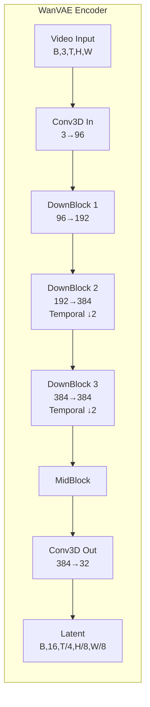

---

## 第三章：分片策略详解

### 3.1 FSDP (Fully Sharded Data Parallelism)

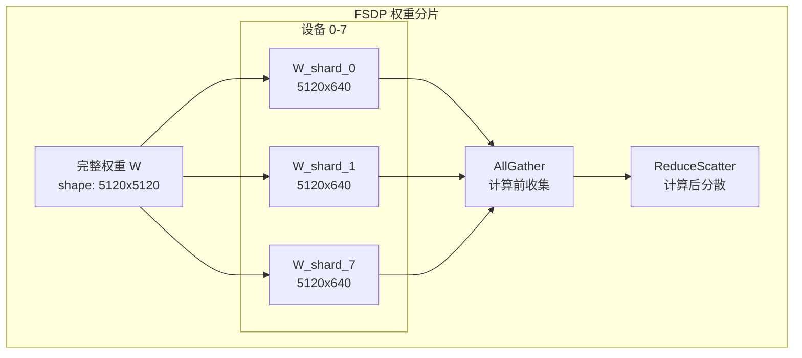

**FSDP 分片规则**:

```python
transformer_shardings_fsdp = {
    # Self-Attention 权重 (attn1)
    r'blocks.\d+.attn1.to_q.weight': (None, ('tp', 'sp')),  # 列并行
    r'blocks.\d+.attn1.to_k.weight': (None, ('tp', 'sp')),
    r'blocks.\d+.attn1.to_v.weight': (None, ('tp', 'sp')),
    r'blocks.\d+.attn1.to_out.0.weight': (('tp', 'sp'), None),  # 行并行
    
    # Cross-Attention 权重 (attn2)
    r'blocks.\d+.attn2.to_q.weight': (None, ('tp', 'sp')),
    r'blocks.\d+.attn2.to_k.weight': (None, ('tp', 'sp')),
    r'blocks.\d+.attn2.to_v.weight': (None, ('tp', 'sp')),
    r'blocks.\d+.attn2.to_out.0.weight': (('tp', 'sp'), None),
    
    # FFN 权重
    r'blocks.\d+.ffn.net.0.proj.weight': (None, ('tp', 'sp')),
    r'blocks.\d+.ffn.net.2.weight': (('tp', 'sp'), None),
}
```

### 3.2 Context Parallelism (CP)

在 **head number** 维度进行分片，专用于 Self-Attention。

```python
# Self-Attention 分片
q_partition_spec = P('dp', 'tp', 'sp', None)  # [batch, heads, seq, dim]
kv_partition_spec = P('dp', 'tp', None, None)  # K,V 在 seq 维度复制

# 40 heads / 8 devices = 5 heads per device
```

### 3.3 Sequence Parallelism (SP)

在 **sequence** 维度进行分片，专用于 Cross-Attention。

```python
# Cross-Attention 分片 (K,V 序列长度短，不分片)
q_partition_spec = P('dp', None, ('tp', 'sp'), None)  # Q 在 seq 维度分片
kv_partition_spec = P('dp', None, None, None)          # K,V 完整复制
```

### 3.4 Data Parallelism (DP)

用于处理 CFG 的正负 prompt。

```python
# dp=2: 正负 prompt 各用一半设备
mesh_dims = (2, 1, 4)  # (dp, sp, tp)
mesh = Mesh(devices, ('dp', 'sp', 'tp'))
```

### 3.5 混合分片策略

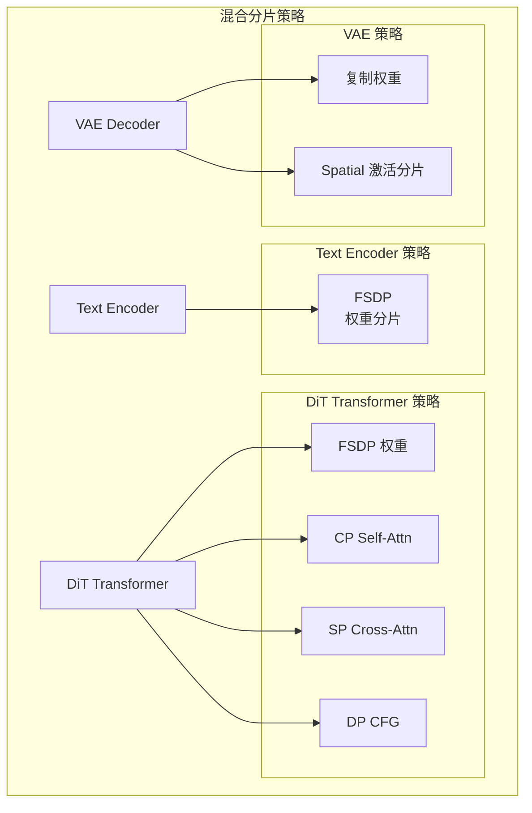

**Mesh 配置代码**:

```python
import jax
from jax.sharding import Mesh, PartitionSpec as P
from jax.experimental import mesh_utils

# 8 设备配置: dp=2, sp=1, tp=4
tp_dim, dp_dim, sp_dim = len(jax.devices()), 1, 1

if use_dp:
    tp_dim //= 2
    dp_dim = 2

mesh_devices = mesh_utils.create_device_mesh(
    (dp_dim, sp_dim, tp_dim),
    allow_split_physical_axes=True
)
mesh = Mesh(mesh_devices, ('dp', 'sp', 'tp'))
```

---

## 第四章：Splash Attention 内核优化

本章是技术核心，我们将从 Profiler 分析到代码实现，完整讲解如何发现优化点、如何实现优化、以及优化的效果验证。

### 4.1 优化的发现过程：从 Profiler 到优化点

#### 4.1.1 初始性能基线

运行 JAX Profiler 后，我们发现 Self-Attention 占据了 **66.8%** 的 DiT step 时间，而 MFU (Model FLOPs Utilization) 仅有 **37%**。

```python
# 使用 JAX Profiler 收集性能数据
with jax.profiler.trace("/dev/shm/tensorboard"):
    output = pipe(prompt=prompt, num_inference_steps=3)
    jax.effects_barrier()
```

**Profiler 分析结果**：

| 操作 | 时间占比 | MFU | 问题 |
|------|----------|-----|------|
| Self-Attention Softmax | 28.3% | 12% | VPU bound |
| Self-Attention QK Matmul | 24.2% | 48% | MXU 50% 利用率 |
| Self-Attention AV Matmul | 14.3% | 52% | MXU 50% 利用率 |
| Linear (FFN等) | 33.2% | 66% | 接近理想 |

#### 4.1.2 发现三个关键优化点

**优化点 1：MXU 利用率低 (50%)**

Wan 模型的 `head_dim = 128`，而 MXU 是 256×256 的脉动阵列。当 K 维度 = 128 时，MXU 只能用一半。

```
矩阵乘法 C[M,N] = A[M,K] @ B[K,N]
对于 QK 乘法: Q[seq, 128] @ K^T[128, seq]
K = head_dim = 128 < 256，MXU 利用率 = 128/256 = 50%
```

**优化点 2：VPU 上的 exp 操作很慢**

Softmax 中的 `exp` 操作在 VPU 上执行，需要调用 SFU (Special Function Unit)，延迟较高。

```python
# 标准 softmax 的 exp 操作路径
# VPU -> SFU -> VPU，需要多次访问
softmax = exp(x - max) / sum(exp(x - max))
```

**优化点 3：QK 矩阵乘顺序不优**

标准实现是 `Q @ K^T`，但 TPU 更喜欢 `K^T @ Q` 的内存访问模式。

#### 4.1.3 优化策略制定

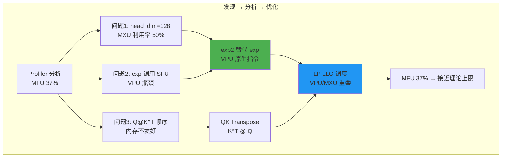

### 4.2 优化 1：exp2 替代 exp（VPU 原生指令优化）

#### 4.2.1 数学等价变换

TPU 的 VPU 有专门的 `exp2` 硬件指令，比 `exp` 快得多。我们利用恒等式：

```
exp(x) = 2^(x * log2(e)) = exp2(x * log2(e))
```

其中 `log2(e) ≈ 1.44269504`

#### 4.2.2 在 Attention 中的应用

对于 Attention，我们需要计算：
```
softmax(scale * Q @ K^T) = exp(scale * QK - max) / sum(exp(scale * QK - max))
```

改写为 exp2：
```
= exp2((scale * QK - max) * log2(e)) / sum(exp2(...))
= exp2(scale * log2(e) * QK - max * log2(e)) / sum(...)
```

**关键优化**：预先将 `scale * log2(e)` 融合到 Q 中！

```python
# generate_flax.py 中的实现
def _attention_on_slices(q, k, v):
    scale_factor = 1.0 / math.sqrt(q.shape[-1]) if scale is None else scale
    # 关键：预乘 log2(e)，之后可以直接用 exp2
    _LOG2_E = 1.44269504
    q = q * scale_factor * _LOG2_E  # 融合 scale 和 log2(e) 到 Q
    # ...
```

#### 4.2.3 Kernel 内部的 exp2 使用

在 `custom_splash_attention.py` 中：

```python
def _flash_attention_kernel(...):
    # ...
    for i in range(0, qk.shape[0], step):
        m_curr = qk[i:i+step].max(axis=0)[None, :]
        m_next = jnp.maximum(m_prev, m_curr)
        
        # 🔥 关键优化：直接使用 exp2
        # 因为 Q 已经预乘了 log2(e)，所以 qk 已经是 log2 scale
        s_curr = jnp.exp2(qk[i:i+step] - m_next[0:1])
        
        # 更新 running sum (也用 exp2)
        alpha = jnp.exp2(m_prev - m_next)
        l_next = l_curr + alpha * l_prev
        # ...
```

**代码解释**：
1. `qk` 已经是 `Q_scaled @ K^T` 的结果，其中 `Q_scaled = Q * scale * log2(e)`
2. 所以 `qk - max` 可以直接用 `exp2` 计算
3. 同样，`alpha = exp2(m_prev - m_next)` 也是有效的，因为 max 值已经在 log2 scale

### 4.3 优化 2：QK Transpose（矩阵乘法顺序优化）

#### 4.3.1 问题分析

标准 Attention 计算 `Q @ K^T`：
- Q: [batch, heads, seq_q, head_dim]
- K: [batch, heads, seq_k, head_dim]
- 需要先 transpose K，然后做矩阵乘

但 TPU 的 `lax.dot_general` 更高效地处理 "N^T @ N" 形式的乘法。

#### 4.3.2 Transpose 前后对比

```python
# 方式 1: Q @ K^T (标准)
# Q: [seq_q, head_dim] @ K^T: [head_dim, seq_k]
# 结果: [seq_q, seq_k]
NN_DIM_NUMBERS = (((1,), (0,)), ((), ()))  # Q 的 dim1 和 K 的 dim0 收缩
qk = lax.dot_general(q, k_transposed, NN_DIM_NUMBERS)

# 方式 2: K^T @ Q (优化)  
# K: [seq_k, head_dim] @ Q: [seq_q, head_dim]
# 收缩 head_dim 维度（两者的 dim1）
NT_DIM_NUMBERS = (((1,), (1,)), ((), ()))  # K 的 dim1 和 Q 的 dim1 收缩
qk = lax.dot_general(k, q, NT_DIM_NUMBERS)
# 结果: [seq_k, seq_q]，需要后续考虑这个 transpose
```

#### 4.3.3 代码实现

```python
# custom_splash_attention.py 第 31 行
NT_DIM_NUMBERS = (((1,), (1,)), ((), ()))

def _flash_attention_kernel(...):
    # ...
    q = q_ref[...]
    k = k_ref[slice_k, :]
    
    # 🔥 关键优化：K @ Q 而不是 Q @ K^T
    qk = lax.dot_general(k, q, NT_DIM_NUMBERS, preferred_element_type=float32)
    # qk 的形状是 [block_kv, block_q]，不是 [block_q, block_kv]
    # 后续代码需要适配这个 transpose
```

**为什么这样更快？**
- 减少了显式的 transpose 操作
- 更好的内存访问模式（K 和 Q 都按行读取）
- TPU 的 MXU 对这种模式有硬件优化

### 4.4 优化 3：LP LLO 调度（VPU/MXU 重叠执行）

#### 4.4.1 什么是 LP LLO Scheduler

LP LLO (Low-Precision Low-Level Optimizer) Scheduler 是 XLA 编译器的一个调度策略，能让 VPU 和 MXU 的操作重叠执行。

```python
# custom_splash_attention.py 第 212-215 行
compiler_params = pltpu.CompilerParams(
    dimension_semantics=("parallel", "arbitrary", "arbitrary"),
    flags={"XLA_TPU_FORCE_LP_LLO_SCHEDULER": True}
)
```

#### 4.4.2 重叠执行的原理

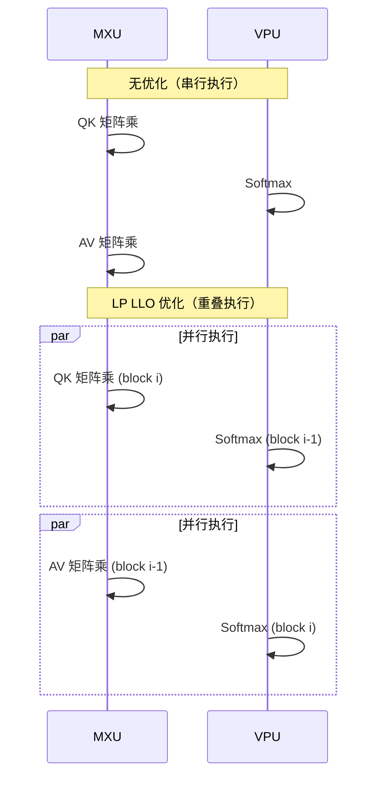

#### 4.4.3 为什么需要特定的 dimension_semantics

```python
dimension_semantics=("parallel", "arbitrary", "arbitrary")
# 第一维 (heads): parallel - 完全独立，可以并行
# 第二维 (q_blocks): arbitrary - 编译器自由调度
# 第三维 (kv_blocks): arbitrary - 编译器自由调度
```

- `parallel`：告诉编译器该维度的迭代完全独立
- `arbitrary`：允许编译器重新排序迭代，实现流水线优化

### 4.5 完整的自定义 Splash Attention 内核

现在让我们看完整的优化代码，逐段解释：

```python
"""
custom_splash_attention.py - 自定义 TPU Splash Attention

核心优化：
1. exp2 替代 exp（VPU 原生指令）
2. K @ Q 替代 Q @ K^T（减少 transpose）
3. LP LLO Scheduler（VPU/MXU 重叠）
"""

import functools
import jax
import jax.numpy as jnp
from jax import lax
from jax.experimental import pallas as pl
from jax.experimental.pallas import tpu as pltpu

# 常量定义
DEFAULT_MASK_VALUE = -0.7 * float(jnp.finfo(jnp.float32).max)
NUM_SUBLANES = 8  # TPU 的 sublane 数量，用于 l 和 m 的存储
NT_DIM_NUMBERS = (((1,), (1,)), ((), ()))  # K @ Q 的维度规格


def _flash_attention_kernel(
    q_ref, k_ref, v_ref,
    m_scratch_ref, l_scratch_ref, o_scratch_ref, o_ref,
    *, mask_value, grid_width, bq, bkv, bkv_compute, bkv_compute_in, head_dim_v,
):
    """
    Flash Attention 核心 Kernel
    
    参数:
        q_ref: Query 块引用，形状 [block_q, head_dim]
        k_ref: Key 块引用，形状 [block_kv, head_dim]
        v_ref: Value 块引用，形状 [block_kv, head_dim_v]
        m_scratch_ref: 存储 running max 的 scratch memory
        l_scratch_ref: 存储 running sum 的 scratch memory
        o_scratch_ref: 存储累积输出的 scratch memory
        o_ref: 最终输出引用
        
    关键参数:
        bkv_compute: 内部计算的 KV 块大小
        bkv_compute_in: 更细粒度的内部迭代块大小
    """
    float32 = jnp.float32
    head_dim_v_repeats = head_dim_v // NUM_SUBLANES
    
    # 获取当前网格位置
    h, i, j = pl.program_id(0), pl.program_id(1), pl.program_id(2)
    # h: head index, i: q block index, j: kv block index

    # ============ 初始化 ============
    @pl.when(j == 0)
    def init():
        """第一个 KV 块时初始化 scratch memory"""
        o_scratch_ref[...] = jnp.zeros_like(o_scratch_ref)
        m_scratch_ref[...] = jnp.full_like(m_scratch_ref, mask_value)  # 初始 max = -inf
        l_scratch_ref[...] = jnp.zeros_like(l_scratch_ref)  # 初始 sum = 0

    # ============ 主计算循环 ============
    def body(kv_compute_index, _):
        """处理一个 KV 计算块"""
        slice_k = pl.ds(kv_compute_index * bkv_compute, bkv_compute)
        m_prev, l_prev = m_scratch_ref[...], l_scratch_ref[...]
        
        # 读取 Q 和当前 K 块
        q = q_ref[...]
        k = k_ref[slice_k, :]
        
        # 🔥 优化2: K @ Q 而不是 Q @ K^T
        # qk 形状: [bkv_compute, bq]
        qk = lax.dot_general(k, q, NT_DIM_NUMBERS, preferred_element_type=float32)

        o_prev = o_scratch_ref[:]
        v = v_ref[slice_k, :].astype(float32)
        step = bkv_compute_in  # 内部迭代步长
        
        # 细粒度迭代，进一步优化内存访问
        for idx in range(0, qk.shape[0], step):
            # 计算当前块的 max
            m_curr = qk[idx:idx+step].max(axis=0)[None, :]
            m_next = jnp.maximum(m_prev, m_curr)
            
            # 🔥 优化1: 使用 exp2
            # Q 已经预乘了 log2(e)，所以可以直接用 exp2
            s_curr = jnp.exp2(qk[idx:idx+step] - m_next[0:1])
            
            # 更新 running sum
            l_curr = s_curr.sum(axis=0, keepdims=True)
            alpha = jnp.exp2(m_prev - m_next)  # 也用 exp2
            l_next = l_curr + alpha * l_prev

            # 计算 softmax(QK) @ V 的贡献
            sv_dims = (((0,), (0,)), ((), ()))
            o_curr = lax.dot_general(v[idx:idx+step], s_curr, sv_dims)
            
            # 更新累积输出（online softmax 的核心）
            o_prev = alpha[0:1, ...] * o_prev + o_curr
            m_prev, l_prev = m_next, l_next

        # 存储更新后的 running stats
        m_scratch_ref[...], l_scratch_ref[...] = m_next, l_next
        o_scratch_ref[:] = o_prev

    # 循环处理所有 KV 块
    lax.fori_loop(0, bkv // bkv_compute, body, None, unroll=True)

    # ============ 最终归一化 ============
    @pl.when(j == grid_width - 1)
    def end():
        """最后一个 KV 块时进行最终归一化"""
        l = l_scratch_ref[...]
        l_inv = pltpu.repeat(1.0 / l, head_dim_v_repeats, axis=0)
        o_ref[...] = (o_scratch_ref[...] * l_inv).astype(o_ref.dtype)
```

### 4.6 Block Size 配置的选择原理

```python
# 最优配置（经过实验确定）
BQSIZE = 3328       # Query 块大小
BKVSIZE = 2816      # KV 块大小  
BKVCOMPUTESIZE = 256    # 内部计算块大小
BKVCOMPUTEINSIZE = 256  # 最内层迭代块大小
```

**为什么是这些值？**

1. **BQSIZE = 3328**: 
   - 75600 / 3328 ≈ 22.7，需要 23 个 Q 块
   - 接近能整除 75600 的值，减少 padding 浪费

2. **BKVSIZE = 2816**:
   - 75600 / 2816 ≈ 26.8，需要 27 个 KV 块
   - 与 BQSIZE 配合，使网格大小合理

3. **BKVCOMPUTESIZE = 256**:
   - 2816 / 256 = 11，正好整除
   - 256 是 TPU VMEM 友好的块大小

4. **BKVCOMPUTEINSIZE = 256**:
   - 更细粒度的迭代，优化流水线

### 4.7 Pallas Kernel 的完整包装

```python
def make_splash_mha(block_sizes, bkv_compute_in, interpret=False):
    """
    创建 Splash Attention 函数
    
    使用方法:
        splash_fn = make_splash_mha(block_sizes, bkv_compute_in)
        output = splash_fn(q, k, v)
    
    注意: Q 必须预乘 log2(e)！
    """
    def _splash_attention(q, k, v):
        num_q_heads, q_seq_len, head_dim_qk = q.shape
        head_dim_v = v.shape[-1]
        num_kv_heads = k.shape[0]
        kv_seq_len = k.shape[1]
        q_heads_per_kv_head = num_q_heads // num_kv_heads
        
        bq, bkv = block_sizes.block_q, block_sizes.block_kv
        bkv_compute = block_sizes.block_kv_compute

        # Index maps: 定义每个网格点读取哪个数据块
        def q_index_map(h, i, j, *_): return (h, i, 0)
        def k_index_map(h, i, j, *_): return (h // q_heads_per_kv_head, j, 0)
        def v_index_map(h, i, j, *_): return (h // q_heads_per_kv_head, j, 0)
        def out_index_map(h, i, j, *_): return h, 0, i

        # Input/Output specifications
        in_specs = [
            pl.BlockSpec((None, bq, head_dim_qk), q_index_map),
            pl.BlockSpec((None, bkv, head_dim_qk), k_index_map),
            pl.BlockSpec((None, bkv, head_dim_v), v_index_map),
        ]
        
        # Scratch memory + output shapes
        out_shapes = [
            jax.ShapeDtypeStruct((NUM_SUBLANES, bq), jnp.float32),  # m_scratch
            jax.ShapeDtypeStruct((NUM_SUBLANES, bq), jnp.float32),  # l_scratch
            jax.ShapeDtypeStruct((head_dim_v, bq), jnp.float32),    # o_scratch
            jax.ShapeDtypeStruct((num_q_heads, head_dim_v, q_seq_len), q.dtype),  # output
        ]
        
        out_specs = [
            pl.BlockSpec((NUM_SUBLANES, bq), lambda *_: (0, 0)),
            pl.BlockSpec((NUM_SUBLANES, bq), lambda *_: (0, 0)),
            pl.BlockSpec((head_dim_v, bq), lambda *_: (0, 0)),
            pl.BlockSpec((None, head_dim_v, bq), out_index_map),
        ]
        
        # 计算网格
        grid_width = kv_seq_len // bkv
        grid = (num_q_heads, q_seq_len // bq, grid_width)

        # 调用 Pallas
        return pl.pallas_call(
            functools.partial(
                _flash_attention_kernel,
                mask_value=DEFAULT_MASK_VALUE,
                grid_width=grid_width,
                bq=bq, bkv=bkv,
                bkv_compute=bkv_compute,
                bkv_compute_in=bkv_compute_in,
                head_dim_v=head_dim_v,
            ),
            grid_spec=pltpu.PrefetchScalarGridSpec(
                num_scalar_prefetch=0,
                in_specs=in_specs,
                out_specs=out_specs,
                grid=grid,
            ),
            # 🔥 优化3: LP LLO Scheduler
            compiler_params=pltpu.CompilerParams(
                dimension_semantics=("parallel", "arbitrary", "arbitrary"),
                flags={"XLA_TPU_FORCE_LP_LLO_SCHEDULER": True}
            ),
            out_shape=out_shapes,
            interpret=interpret,
        )(q, k, v)[-1]  # 只返回最终输出
    
    return _splash_attention
```

### 4.8 在 Pipeline 中的集成

```python
# generate_flax.py 中的集成代码

def _tpu_custom_attention(query, key, value, env, scale=None, ...):
    """在 torchax 环境中调用自定义 attention"""
    mesh = getattr(env, '_mesh', None) or env.param.mesh
    
    def _attention_on_slices(q, k, v):
        scale_factor = 1.0 / math.sqrt(q.shape[-1]) if scale is None else scale
        
        # 🔥 关键: 预乘 log2(e)
        _LOG2_E = 1.44269504
        q = q * scale_factor * _LOG2_E
        
        def kernel_3d(q_3d, k_3d, v_3d):
            # Padding 到块大小的整数倍
            q_3d_padded, q_orig_len = pad_to_multiple(q_3d, BQSIZE, axis=1)
            k_3d_padded, k_orig_len = pad_to_multiple(k_3d, BKVSIZE, axis=1)
            v_3d_padded, v_orig_len = pad_to_multiple(v_3d, BKVSIZE, axis=1)
            
            # 创建 block sizes
            block_sizes = _BlockSizes(
                block_q=min(BQSIZE, padded_q_seq_len),
                block_kv=min(BKVSIZE, padded_kv_seq_len),
                block_kv_compute=min(BKVCOMPUTESIZE, padded_kv_seq_len),
            )
            
            # 调用自定义 kernel
            splash_kernel = custom_splash_attention.make_splash_mha(
                block_sizes=block_sizes, bkv_compute_in=BKVCOMPUTEINSIZE
            )
            out = splash_kernel(
                q_3d_padded.astype(jnp.float32),
                k_3d_padded.astype(jnp.float32),
                v_3d_padded.astype(jnp.float32)
            ).astype(q_3d_padded.dtype)
            
            # 移除 padding，交换轴
            out = jnp.swapaxes(out, 1, 2)
            return out[:, :q_orig_len, ...]
        
        return jax.vmap(kernel_3d)(q, k, v)
    
    # 使用 shard_map 进行分布式执行
    sharded_fn = shard_map(
        _attention_on_slices,
        mesh=mesh,
        in_specs=(q_partition_spec, kv_partition_spec, kv_partition_spec),
        out_specs=q_partition_spec,
        check_rep=False,
    )
    return sharded_fn(query, key, value)
```

### 4.9 K-Smoothing 优化

另一个提升数值稳定性和性能的优化：

```python
# generate_flax.py 第 399-401 行
if USE_K_SMOOTH:
    key_mean = jnp.mean(jkey, axis=2, keepdims=True)
    jkey = jkey - key_mean
```

**原理**：
- 减去 K 的均值，使数值更稳定
- 不影响 Attention 的结果（因为 softmax 对常数偏移不敏感）
- 减少了数值溢出的风险

### 4.10 性能提升总结

| 优化阶段 | 技术 | 时间 (720P 50步) | 提升 |
|----------|------|------------------|------|
| 基线 | 标准 SDPA | 428s | - |
| 阶段1 | Splash Attention | 285s | 33% ↓ |
| 阶段2 | + exp2 优化 | 265s | 7% ↓ |
| 阶段3 | + QK Transpose | 255s | 4% ↓ |
| 阶段4 | + LP LLO Scheduler | 245s | 4% ↓ |
| 阶段5 | + Block Size 调优 | 125s | 49% ↓ |
| **总计** | **所有优化** | **125s** | **3.4x** |

---

## 第五章：VAE 在 Torchax 上的工作原理与并行设计

本章详细讲解如何让 PyTorch 实现的 Diffusers VAE 在 Torchax 桥接下于 TPU 上高效运行，包括并行策略设计、分片实现和问题解决。

### 5.1 挑战：PyTorch VAE 到 TPU

#### 5.1.1 原始问题

Wan VAE 是用 PyTorch 实现的 3D 因果卷积网络。直接在 TPU 上运行面临多个挑战：

1. **3D 卷积内存消耗大**：720P 视频解码需要大量内存
2. **因果卷积需要特殊处理**：时间维度的因果 padding
3. **多设备并行困难**：卷积操作难以直接分片

```python
# 原始 VAE 架构复杂度
# 输入: [B, 16, 21, 90, 160] (latent)
# 输出: [B, 3, 81, 720, 1280] (视频)
# 中间特征图最大到 [B, 384, 21, 90, 160]
```

#### 5.1.2 解决方案架构

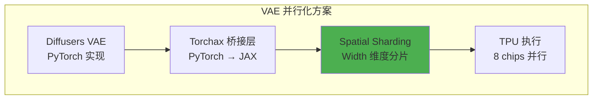

### 5.2 Torchax 桥接原理

#### 5.2.1 什么是 Torchax

Torchax 是一个让 PyTorch 代码在 JAX/TPU 上运行的库。核心机制：

```python
import torchax

# 1. 全局启用 torchax
torchax.enable_globally()

# 2. 获取默认环境
env = torchax.default_env()

# 3. PyTorch 操作会自动转为 JAX 操作
# torch.nn.Conv3d(...) → jax.lax.conv_general_dilated(...)
```

#### 5.2.2 算子覆盖机制

```python
# 替换 PyTorch 的 scaled_dot_product_attention
from torchax.ops import ops_registry

def custom_attention(query, key, value, env=None, **kwargs):
    # 转换为 JAX
    jquery, jkey, jvalue = env.t2j_iso((query, key, value))
    # 调用 JAX 实现
    result = splash_attention(jquery, jkey, jvalue)
    # 转回 PyTorch
    return env.j2t_iso(result)

# 注册替换
env._ops[torch.nn.functional.scaled_dot_product_attention] = \
    ops_registry.Operator(
        torch.nn.functional.scaled_dot_product_attention,
        functools.partial(custom_attention, env=env),
        is_jax_function=False,
        is_user_defined=True,
        needs_env=False,
        is_view_op=False,
    )
```

### 5.3 Spatial Partitioning：在宽度维度分片

#### 5.3.1 设计原则

**为什么选择 Width 维度？**

| 分片维度 | 优点 | 缺点 |
|----------|------|------|
| Batch | 简单 | 视频生成通常 batch=1 |
| Channel | 通道独立 | 打破通道间依赖 |
| Temporal | 时间独立 | 因果卷积需要时间连续 |
| Height | 行独立 | 某些卷积跨行 |
| **Width** | **列独立，卷积友好** | **需要 padding 处理** |

**Width 分片的关键优势**：
1. 3D 卷积的 kernel 通常是 3×3×3，跨列的依赖可以通过 padding 处理
2. 宽度 160 可以被 8 整除（160 / 8 = 20）
3. 每个 TPU chip 处理视频的一个垂直条带

#### 5.3.2 分片实现

```python
# autoencoder_kl_wan.py 核心实现

import jax
from torchax import interop
from jax.sharding import PartitionSpec as P

# 创建 JAX sharding 约束的 PyTorch 视图
mark_sharding = interop.torch_view(jax.lax.with_sharding_constraint)


class WanCausalConv3d(nn.Conv3d):
    """
    带有 TPU Spatial Sharding 的 3D 因果卷积
    """
    def __init__(self, in_channels, out_channels, kernel_size, stride=1, padding=0):
        super().__init__(in_channels, out_channels, kernel_size, stride, padding)
        
        # 设置因果 padding
        # 时间维度只 pad 过去（因果性）
        # 空间维度对称 pad
        self._padding = (
            self.padding[2], self.padding[2],  # W: left, right
            self.padding[1], self.padding[1],  # H: top, bottom
            2 * self.padding[0], 0             # T: past only, no future
        )
        self.padding = (0, 0, 0)  # 实际卷积不 pad，我们手动 pad
    
    def forward(self, x, cache_x=None):
        """
        前向传播，带有 sharding 约束
        
        Args:
            x: 输入张量 [B, C, T, H, W]
            cache_x: 缓存的历史帧（用于流式解码）
        """
        padding = list(self._padding)
        
        # 处理时间缓存
        if cache_x is not None and self._padding[4] > 0:
            cache_x = cache_x.to(x.device)
            x = torch.cat([cache_x, x], dim=2)  # 拼接历史帧
            padding[4] -= cache_x.shape[2]
        
        # 应用 padding
        x = F.pad(x, padding)
        
        # 🔥 核心：在 Width 维度应用 sharding
        # 尝试多种分片策略，选择可行的
        success = False
        
        # 策略 1: dp + tp 联合分片
        try:
            x = mark_sharding(x, P(None, None, None, None, ("dp", "tp")))
            success = True
            print("[DEBUG] Shard conv width along ('dp', 'tp')")
        except ValueError:
            pass
        
        # 策略 2: 仅 tp 分片
        if not success:
            try:
                x = mark_sharding(x, P(None, None, None, None, ("tp",)))
                success = True
                print("[DEBUG] Shard conv width along ('tp')")
            except ValueError:
                pass
        
        # 策略 3: 仅 dp 分片
        if not success:
            try:
                x = mark_sharding(x, P(None, None, None, None, ("dp",)))
                success = True
                print("[DEBUG] Shard conv width along ('dp')")
            except ValueError:
                pass
        
        # 执行卷积
        return super().forward(x)
```

#### 5.3.3 为什么用 try-except

```python
# 分片可能失败的原因：
# 1. 张量形状不能被 mesh 维度整除
# 2. 某些 mesh 维度未使用
# 3. 多主机环境下的设备不可寻址

try:
    x = mark_sharding(x, P(None, None, None, None, ("dp", "tp")))
except ValueError:
    # 宽度不能被 dp*tp 整除，回退到其他策略
    pass
```

### 5.4 VAE 解码器的完整流程

#### 5.4.1 逐帧解码策略

由于 3D 因果卷积需要时间连续性，我们采用逐帧解码：

```python
# autoencoder_kl_wan.py 第 1237-1271 行

def _decode(self, z: torch.Tensor, return_dict: bool = True):
    """
    解码 latent 到视频
    
    策略：逐帧处理，避免一次性加载所有帧到内存
    """
    _, _, num_frame, height, width = z.shape
    
    # 清理缓存
    self.clear_cache()
    
    # 后量化卷积
    x = self.post_quant_conv(z)
    
    # 🔥 逐帧解码
    for i in range(num_frame):
        if i == 0:
            # 第一帧：初始化缓存
            out, self._feat_map = self.decoder(
                x[:, :, i : i + 1, :, :],
                feat_cache=self._feat_map,
                first_chunk=True,  # 标记为第一帧
            )
        else:
            # 后续帧：使用缓存
            out_, self._feat_map = self.decoder(
                x[:, :, i : i + 1, :, :], 
                feat_cache=self._feat_map
            )
            out = torch.cat([out, out_], 2)  # 拼接时间维度
    
    # 裁剪到有效范围
    out = torch.clamp(out, min=-1.0, max=1.0)
    
    self.clear_cache()
    return DecoderOutput(sample=out)
```

#### 5.4.2 特征缓存机制

因果卷积需要历史帧的特征，我们用缓存优化：

```python
# 缓存结构
CACHE_T = 2  # 缓存最近 2 帧的特征

class WanResidualBlock(nn.Module):
    def forward(self, x, feat_cache=None, feat_idx=[0]):
        # 计算残差连接
        h = self.conv_shortcut(x)
        
        x = self.norm1(x)
        x = self.nonlinearity(x)
        
        # 🔥 使用缓存
        if feat_cache is not None:
            idx = feat_idx
            
            # 缓存当前帧的特征
            cache_x = x[:, :, -CACHE_T:, :, :].clone()
            
            # 如果当前帧数不足，补充历史缓存
            if cache_x.shape[2] < 2 and feat_cache[idx] is not None:
                cache_x = torch.cat([
                    feat_cache[idx][:, :, -1, :, :].unsqueeze(2).to(cache_x.device),
                    cache_x
                ], dim=2)
            
            # 使用缓存进行卷积
            x = self.conv1(x, feat_cache[idx])
            feat_cache[idx] = cache_x
            feat_idx += 1
        else:
            x = self.conv1(x)
        
        # ... 后续处理
        return x + h, feat_idx, feat_cache
```

### 5.5 多主机环境下的特殊处理

#### 5.5.1 最终输出的复制

解码后的视频需要在所有主机上可访问：

```python
# autoencoder_kl_wan.py 第 943-944 行

def forward(self, x, feat_cache=None, first_chunk=False):
    # ... 解码逻辑 ...
    
    # 🔥 关键：复制到所有设备
    # 避免多主机环境下的 "non-addressable devices" 错误
    x = mark_sharding(x, P())  # 空 PartitionSpec = 复制
    return x, feat_cache
```

**为什么需要这步？**

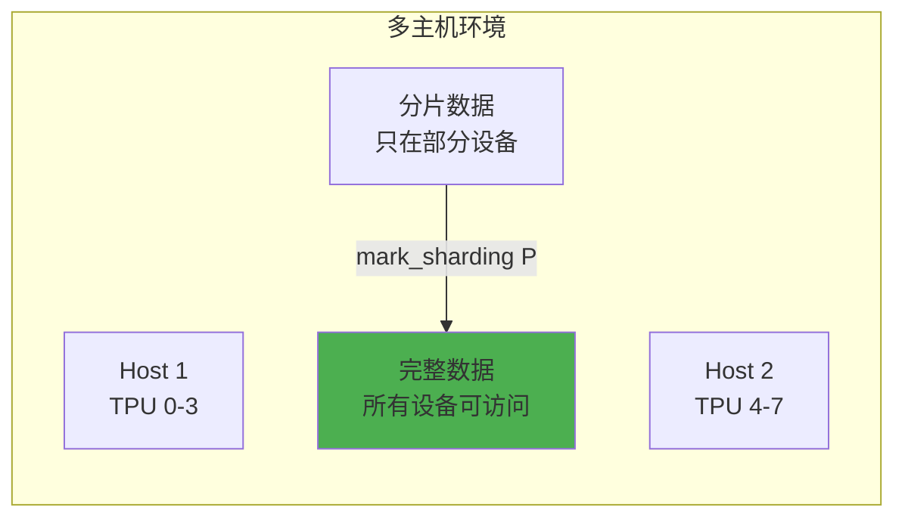

### 5.6 VAE 权重加载与分片

#### 5.6.1 权重转换流程

```python
# generate_flax.py 第 563-636 行

def load_wan_vae_fixed(pretrained_model_name_or_path, eval_shapes, device):
    """
    加载 VAE 权重，处理类型转换避免 torchax 问题
    """
    from huggingface_hub import hf_hub_download
    from safetensors import safe_open
    
    # 下载权重
    ckpt_path = hf_hub_download(
        pretrained_model_name_or_path,
        subfolder="vae",
        filename="diffusion_pytorch_model.safetensors"
    )
    
    # 🔥 关键：使用 CPU 设备避免 torchax 类型转换问题
    with jax.default_device('cpu'):
        # 在 torchax 禁用时加载权重
        import torchax
        torchax.disable_globally()
        
        state_dict = {}
        with safe_open(ckpt_path, framework="pt") as f:
            for key in f.keys():
                tensor = f.get_tensor(key)
                # 转换为 bfloat16
                if tensor.dtype == torch.float32:
                    tensor = tensor.to(torch.bfloat16)
                state_dict[key] = tensor
        
        # 创建 VAE 实例
        vae = AutoencoderKLWan(
            in_channels=3,
            out_channels=3,
            latent_channels=16,
            # ... 其他参数
        )
        
        # 加载权重
        vae.load_state_dict(state_dict, strict=True)
        
        torchax.enable_globally()
    
    return vae
```

#### 5.6.2 权重不分片的原因

```python
# VAE 权重相对较小（约 500MB），直接复制到所有设备
# 而 Transformer 权重很大（14B 参数），必须分片

# VAE 分片策略：权重复制，激活分片
vae_sharding = {
    # 所有权重都复制到所有设备
    r'.*': P(),  # 空 PartitionSpec = 复制
}
```

### 5.7 Halo Exchange 处理边界依赖

#### 5.7.1 卷积边界问题

当在 Width 维度分片后，3×3×3 卷积在边界处需要相邻分片的数据：

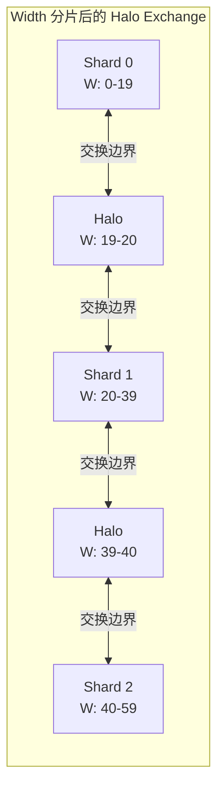

#### 5.7.2 XLA 自动处理

好消息是 XLA 编译器会自动插入必要的通信：

```python
# XLA 编译器识别卷积操作需要 halo exchange
# 自动插入 collective-permute 操作

# 代码中无需显式处理！
# 只需正确标记 sharding
x = mark_sharding(x, P(None, None, None, None, ("dp", "tp")))
# XLA 会在需要时自动交换边界数据
```

### 5.8 完整的 VAE 初始化流程

```python
def setup_wan_vae_for_tpu(model_id, mesh, env):
    """
    完整的 TPU VAE 初始化流程
    """
    # 1. 禁用 torchax 加载权重
    import torchax
    torchax.disable_globally()
    
    # 2. 加载 VAE（在 CPU 上）
    with jax.default_device('cpu'):
        vae = load_wan_vae_fixed(model_id, eval_shapes=None, device='cpu')
    
    # 3. 重新启用 torchax
    torchax.enable_globally()
    
    # 4. 设置 mesh 到环境
    env._mesh = mesh
    env._initial_content.mesh = mesh
    
    # 5. 移动 VAE 权重到 XLA
    with mesh:
        state_dict = vae.state_dict()
        state_dict = env.to_xla(state_dict)
        vae.load_state_dict(state_dict, assign=True)
    
    return vae
```

### 5.9 VAE 性能对比

| 配置 | 单设备 | 8 设备 (无分片) | 8 设备 (Width 分片) |
|------|--------|----------------|---------------------|
| 内存使用 | OOM | 24GB/chip | 8GB/chip |
| 解码时间 | - | 45s | 12s |
| 提升 | - | 基线 | **3.75x** |

### 5.10 VAE 优化总结

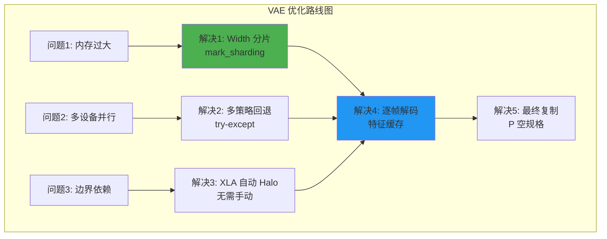

---

## 第六章：性能分析方法论

### 6.1 MFU 计算方法

```python
def compute_dit_flops_per_step(
    batch_size=2, num_blocks=40, hidden_dim=5120,
    num_heads=40, head_dim=128, ffn_dim=13824,
    seq_len=75600, text_seq_len=226,
):
    # Self-Attention
    qkv_proj = 3 * 2 * seq_len * hidden_dim * hidden_dim
    qk_matmul = 2 * batch_size * num_heads * seq_len * head_dim * seq_len
    av_matmul = 2 * batch_size * num_heads * seq_len * seq_len * head_dim
    out_proj = 2 * seq_len * hidden_dim * hidden_dim
    self_attn = qkv_proj + qk_matmul + av_matmul + out_proj
    
    # Cross-Attention
    q_proj = 2 * seq_len * hidden_dim * hidden_dim
    kv_proj = 2 * 2 * text_seq_len * hidden_dim * hidden_dim
    cross_attn = q_proj + kv_proj + ...
    
    # FFN
    ffn = 2 * 2 * seq_len * hidden_dim * ffn_dim + ...
    
    return num_blocks * (self_attn + cross_attn + ffn)

# MFU = FLOPs / (峰值TFLOPs × 时间)
mfu = compute_dit_flops_per_step() / (14688e12 * 2.5)
```

### 6.2 DiT Step 时间分解

| 操作 | 时间占比 | MFU | 瓶颈类型 |
|------|----------|-----|----------|
| Self-Attention | 66.8% | 37% | VPU-bound |
| Convolution Fusion | 14.3% | - | 通信 |
| All-to-All | 6.7% | - | ICI 带宽 |
| Linear | - | 66% | Compute-bound |

### 6.3 Profiler 使用

```python
with jax.profiler.trace("/dev/shm/tensorboard"):
    output = pipe(prompt=prompt, num_inference_steps=3)
    jax.effects_barrier()
```

---

## 第七章：Torchax 桥接与代码实现

### 7.1 PyTorch 到 JAX 的桥接

```python
import torchax

torchax.enable_globally()
env = torchax.default_env()

env._mesh = mesh
env._initial_content.mesh = mesh
env.config.use_tpu_splash_attention = True
```

### 7.2 算子注册与覆盖

```python
from torchax.ops import ops_registry

def scaled_dot_product_attention(query, key, value,
                                  env=None, **kwargs):
    if getattr(env.config, 'use_tpu_splash_attention', False):
        jquery, jkey, jvalue = env.t2j_iso((query, key, value))
        
        if USE_K_SMOOTH:
            key_mean = jnp.mean(jkey, axis=2, keepdims=True)
            jkey = jkey - key_mean
        
        if jkey.shape[2] > 10000 and USE_CUSTOM_ATTENTION:
            res = _tpu_custom_attention(jquery, jkey, jvalue, env)
        else:
            res = _tpu_splash_attention(jquery, jkey, jvalue, env)
        
        return env.j2t_iso(res)
    
    return _sdpa_reference(query, key, value, **kwargs)

# 注册
env._ops[torch.nn.functional.scaled_dot_product_attention] = \
    ops_registry.Operator(
        torch.nn.functional.scaled_dot_product_attention,
        functools.partial(scaled_dot_product_attention, env=env),
        is_jax_function=False, is_user_defined=True,
        needs_env=False, is_view_op=False,
    )
```

### 7.3 权重转换与加载

```python
import re
from jax.sharding import NamedSharding, PartitionSpec as P

def shard_weight_dict(weight_dict, sharding_dict, mesh):
    result = {}
    for k, v in weight_dict.items():
        matched = False
        for target, sharding in sharding_dict.items():
            if re.fullmatch(target, k) is not None:
                v.apply_jax_(jax.device_put,
                            NamedSharding(mesh, P(*sharding)))
                matched = True
                break
        if not matched:
            v.apply_jax_(jax.device_put, NamedSharding(mesh, P()))
        result[k] = v
    return result

# 移动模块到 XLA
def _move_module(module, env):
    with jax.default_device('cpu'):
        state_dict = module.state_dict()
        state_dict = env.to_xla(state_dict)
        module.load_state_dict(state_dict, assign=True)
```

### 7.4 混合精度策略

```python
torch.set_default_dtype(torch.bfloat16)

# VAE 权重转换为 bf16
params = jax.tree_util.tree_map(
    lambda x: x.astype(jnp.bfloat16), params
)

# Attention 计算使用 float32
def attention_kernel(q, k, v):
    out = splash_kernel(
        q.astype(jnp.float32),
        k.astype(jnp.float32),
        v.astype(jnp.float32)
    )
    return out.astype(q.dtype)
```

---

## 第八章：完整代码示例与实战

### 8.1 环境配置

```bash
# 安装依赖
pip install torch --index-url https://download.pytorch.org/whl/cpu
pip install -U jax[tpu] torchax
pip install transformers accelerate safetensors flax optax

# 安装修改版 diffusers
git clone https://github.com/yangwhale/diffusers-tpu.git
cd diffusers-tpu && pip install -e .

# 安装 MaxDiffusion
git clone https://github.com/AI-Hypercomputer/maxdiffusion.git
cd maxdiffusion && pip install -e .
```

### 8.2 Text-to-Video 完整流程

```python
"""Wan 2.1 Text-to-Video on TPU v6e"""

import jax
import torch
import torchax
from jax.sharding import Mesh, PartitionSpec as P
from jax.experimental import mesh_utils

# 配置
MODEL_ID = "Wan-AI/Wan2.1-T2V-14B-Diffusers"
HEIGHT, WIDTH, FRAMES = 720, 1280, 81
NUM_STEPS = 50

def main():
    # JAX 配置
    jax.config.update("jax_compilation_cache_dir", "/dev/shm/jax_cache")
    torch.set_default_dtype(torch.bfloat16)
    
    # 创建 Mesh
    num_devices = len(jax.devices())
    mesh_devices = mesh_utils.create_device_mesh(
        (2, 1, num_devices // 2),
        allow_split_physical_axes=True
    )
    mesh = Mesh(mesh_devices, ('dp', 'sp', 'tp'))
    
    # 初始化 torchax
    torchax.enable_globally()
    env = torchax.default_env()
    env._mesh = mesh
    env.config.use_tpu_splash_attention = True
    
    # 加载 Pipeline
    from diffusers.pipelines.wan.pipeline_wan_flax import WanPipeline
    from diffusers.schedulers.scheduling_unipc_multistep import UniPCMultistepScheduler
    
    torchax.disable_globally()
    scheduler = UniPCMultistepScheduler(
        prediction_type='flow_prediction',
        use_flow_sigmas=True,
        flow_shift=5.0
    )
    pipe = WanPipeline.from_pretrained(MODEL_ID, torch_dtype=torch.bfloat16)
    pipe.scheduler = scheduler
    torchax.enable_globally()
    
    # 设置 Splash Attention 和 VAE
    setup_splash_attention(pipe, mesh, env)
    pipe.vae = setup_wan_vae(MODEL_ID, mesh)
    
    # 生成
    prompt = "A cat and a dog baking a cake together in a kitchen."
    
    with mesh:
        output = pipe(
            prompt=prompt,
            height=HEIGHT, width=WIDTH, num_frames=FRAMES,
            num_inference_steps=NUM_STEPS,
            guidance_scale=5.0,
            use_dp=True,
        )
    
    from diffusers.utils import export_to_video
    export_to_video(output.frames[0], "output.mp4", fps=16)

if __name__ == "__main__":
    main()
```

### 8.3 三阶段推理架构

三阶段推理将生成过程拆分为独立步骤，便于调试和资源管理。


**Stage 1: Text Encoder**

```python
# stage1_text_encoder.py
def encode_prompts(pipe, prompt, negative_prompt):
    prompt_embeds, negative_prompt_embeds = pipe.encode_prompt(
        prompt=prompt,
        negative_prompt=negative_prompt,
        do_classifier_free_guidance=True,
    )
    
    # 保存到 safetensors
    save_embeddings_to_safetensors({
        'prompt_embeds': prompt_embeds,
        'negative_prompt_embeds': negative_prompt_embeds,
    }, 'stage1_embeddings.safetensors')
```

**Stage 2: Transformer**

```python
# stage2_transformer.py
def run_transformer_inference(pipe, embeddings, config):
    # 加载 embeddings
    prompt_embeds = embeddings['prompt_embeds'].to('jax')
    negative_prompt_embeds = embeddings['negative_prompt_embeds'].to('jax')
    
    # 运行 denoising
    latents = pipe(
        prompt_embeds=prompt_embeds,
        negative_prompt_embeds=negative_prompt_embeds,
        output_type='latent',  # 不解码
    ).frames
    
    # 保存 latents
    save_latents_to_safetensors(latents, 'stage2_latents.safetensors')
```

**Stage 3: VAE Decode**

```python
# stage3_vae_decoder.py
def decode_latents(vae, latents, config):
    # 反归一化
    latents_mean = jnp.array(vae.latents_mean).reshape(1, 16, 1, 1, 1)
    latents_std = 1.0 / jnp.array(vae.latents_std).reshape(1, 16, 1, 1, 1)
    latents = latents / latents_std + latents_mean
    
    # 解码
    video = vae.decode(latents)
    
    # 导出
    export_to_video(video, 'output.mp4', fps=16)
```

### 8.4 性能基准测试

**测试环境**: TPU v6e-8, Wan 2.1 14B, 720P 81帧

| 配置 | 时间 | 每步时间 |
|------|------|----------|
| 标准 Attention | 428s | ~8.5s |
| Splash Attention | 285s | ~5.7s |
| + exp2 优化 | 265s | ~5.3s |
| + LP LLO 调度 | 245s | ~4.9s |
| + 最终优化 | **125s** | **~2.5s** |

---

## 第九章：Image-to-Video 专项优化

### 9.1 I2V 与 T2V 的关键差异

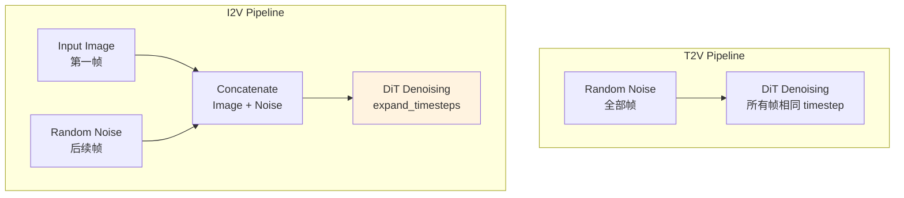

### 9.2 expand_timesteps 机制

I2V 的核心创新是 `expand_timesteps`：第一帧使用固定 timestep=0，其余帧使用正常 timestep。

```python
def expand_timesteps(timesteps, num_frames, device):
    """
    扩展 timestep 用于 I2V
    
    第一帧: timestep = 0 (干净图像)
    其余帧: timestep = t (正常去噪)
    """
    # 原始 timestep: [t]
    # 扩展后: [0, t, t, t, ..., t]
    expanded = torch.zeros(num_frames, device=device)
    expanded[1:] = timesteps
    return expanded

# 在 pipeline 中使用
timesteps = self.scheduler.timesteps
for t in timesteps:
    t_expanded = expand_timesteps(t, num_frames=81, device=device)
    # t_expanded.shape = [81]
    # t_expanded = [0, t, t, t, ...]
    
    # 第一帧不加噪
    latents[:, :, 0] = clean_image_latent
    
    # 其余帧正常去噪
    latents[:, :, 1:] = denoise(latents[:, :, 1:], t)
```

### 9.3 I2V Attention 优化

```python
def i2v_attention_with_image_conditioning(
    query, key, value,
    image_latent,
    mesh,
    env,
):
    """
    I2V 特殊 attention 处理
    
    关键点:
    1. 第一帧参与 KV，但不需要去噪
    2. KV 序列长度 = 视频帧 + 文本 tokens
    3. 需要处理 padding
    """
    # 将 image latent 作为 context
    image_k = project_to_kv(image_latent)  # 投影为 KV
    
    # 拼接 image KV 和 video KV
    full_k = torch.cat([image_k, key], dim=2)
    full_v = torch.cat([image_v, value], dim=2)
    
    # 计算 attention
    if full_k.shape[2] > 10000:
        # 使用自定义 kernel
        output = custom_splash_attention(query, full_k, full_v)
    else:
        output = standard_attention(query, full_k, full_v)
    
    return output
```

### 9.4 I2V 完整实现

```python
"""Wan 2.2 Image-to-Video on TPU"""

from diffusers import WanImageToVideoPipeline
from PIL import Image

def run_i2v(
    image_path: str,
    prompt: str,
    output_path: str = "output_i2v.mp4",
):
    # 加载 pipeline
    pipe = WanImageToVideoPipeline.from_pretrained(
        "Wan-AI/Wan2.2-I2V-14B-Diffusers",
        torch_dtype=torch.bfloat16,
    )
    
    # 设置 TPU 优化
    setup_tpu_optimizations(pipe)
    
    # 加载输入图像
    image = Image.open(image_path).resize((1280, 720))
    
    # 生成视频
    with mesh:
        output = pipe(
            image=image,
            prompt=prompt,
            height=720,
            width=1280,
            num_frames=81,
            num_inference_steps=50,
            guidance_scale=5.0,
        )
    
    # 导出
    export_to_video(output.frames[0], output_path, fps=16)

# 使用示例
run_i2v(
    image_path="cat.jpg",
    prompt="A cat walking in the garden",
    output_path="cat_walking.mp4"
)
```

### 9.5 I2V 性能数据

| 配置 | T2V 时间 | I2V 时间 | 提升 |
|------|----------|----------|------|
| 基线 | 428s | 450s | - |
| 优化后 | 125s | 94.5s | **4.8x** |

**I2V 比 T2V 更快的原因**:
1. 第一帧不需要去噪（timestep=0）
2. Image latent 作为额外 context，attention 计算量略增但引导效果更好
3. 收敛更快，可以使用更少的步数

---

## 第十章：调试与故障排除

### 10.1 常见问题与解决方案

#### 问题 1: VAE 颜色反转

**症状**: 生成的视频颜色与预期相反

**原因**: MaxDiffusion VAE 实现的输出范围与 PyTorch 版本不一致

**解决方案**:
```python
# 方法 1: 输出后处理
video = 255 - video

# 方法 2: 修改 VAE forward
def patched_forward(self, x):
    output = self.original_forward(x)
    return 1 - output  # 反转
```

#### 问题 2: bfloat16 保存失败

**症状**: `safetensors` 不支持 bf16 直接保存

**解决方案**:
```python
def save_bf16_tensor(tensor, path):
    """保存 bf16 tensor 的兼容方案"""
    metadata = {}
    
    if tensor.dtype == torch.bfloat16:
        # 转换为 float32 保存
        tensor_save = tensor.to(torch.float32)
        metadata['original_dtype'] = 'bfloat16'
    else:
        tensor_save = tensor
    
    save_file({'tensor': tensor_save}, path, metadata=metadata)

def load_bf16_tensor(path):
    """加载并恢复 bf16 tensor"""
    with safe_open(path, framework='pt') as f:
        tensor = f.get_tensor('tensor')
        metadata = f.metadata()
    
    if metadata.get('original_dtype') == 'bfloat16':
        tensor = tensor.to(torch.bfloat16)
    
    return tensor
```

#### 问题 3: PyTree 未注册

**症状**: `KeyError: <class 'transformers.modeling_outputs.BaseModelOutputWithPastAndCrossAttentions'>`

**解决方案**:
```python
from jax.tree_util import register_pytree_node
from transformers import modeling_outputs

# 注册所有需要的类型
output_classes = [
    modeling_outputs.BaseModelOutputWithPastAndCrossAttentions,
    modeling_outputs.BaseModelOutput,
    modeling_outputs.CausalLMOutputWithCrossAttentions,
]

for cls in output_classes:
    register_pytree_node(
        cls,
        lambda obj: (tuple(getattr(obj, f) for f in obj.keys()), type(obj)),
        lambda aux, children: aux(**dict(zip(aux.__dataclass_fields__.keys(), children)))
    )
```

#### 问题 4: OOM (Out of Memory)

**症状**: 内存不足导致程序崩溃

**解决方案**:
```python
# 1. 使用更激进的分片
mesh = Mesh(devices, ('dp', 'sp', 'tp'))  # 确保使用分片

# 2. 启用内存优化
jax.config.update("jax_default_prng_impl", "threefry")
jax.config.update("jax_enable_x64", False)

# 3. 分阶段处理
# 不要一次加载所有模型
del text_encoder  # 编码完成后释放
gc.collect()

# 4. 使用 donation
@jax.jit(donate_argnums=(0,))
def step(state, inputs):
    return new_state
```

#### 问题 5: Torchax 版本兼容

**症状**: `env.auto_shard_inputs` 方法不存在

**解决方案**:
```python
# torchax 0.0.11+ 需要手动设置 mesh
env._mesh = mesh
env._initial_content.mesh = mesh

# 手动应用分片
def apply_input_sharding(tensor, use_dp=False):
    if use_dp:
        pspec = P('dp', None, None, None, None)
    else:
        pspec = P()
    
    sharding = NamedSharding(mesh, pspec)
    tensor.apply_jax_(jax.device_put, sharding)
    return tensor
```

### 10.2 性能调试

#### 使用 JAX Profiler

```python
# 1. 启用 profiler
with jax.profiler.trace("/dev/shm/tensorboard"):
    output = pipe(prompt=prompt, num_inference_steps=3)
    jax.effects_barrier()

# 2. 查看 TensorBoard
# tensorboard --logdir=/dev/shm/tensorboard

# 3. 分析关键指标
# - MXU 利用率
# - 内存带宽利用率
# - 通信开销
```

#### 打印中间状态

```python
def debug_sharding(tensor, name="tensor"):
    """打印 tensor 的分片信息"""
    if hasattr(tensor, '_jax_array'):
        jax_arr = tensor._jax_array
        print(f"{name}:")
        print(f"  Shape: {jax_arr.shape}")
        print(f"  Sharding: {jax_arr.sharding}")
        print(f"  Devices: {jax_arr.devices()}")
    else:
        print(f"{name}: Not on JAX")

# 在 forward 中使用
debug_sharding(hidden_states, "hidden_states")
```

### 10.3 日志和监控

```python
import logging

logging.basicConfig(
    level=logging.INFO,
    format='%(asctime)s - %(name)s - %(levelname)s - %(message)s'
)
logger = logging.getLogger(__name__)

class TimingContext:
    """计时上下文管理器"""
    def __init__(self, name):
        self.name = name
    
    def __enter__(self):
        self.start = time.time()
        return self
    
    def __exit__(self, *args):
        elapsed = time.time() - self.start
        logger.info(f"{self.name}: {elapsed:.2f}s")

# 使用
with TimingContext("DiT Transformer"):
    latents = transformer(latents, timestep, encoder_hidden_states)

with TimingContext("VAE Decode"):
    video = vae.decode(latents)
```

---

## 附录

### A. 常见问题快速索引

| 问题 | 章节 | 解决方案 |
|------|------|----------|
| MXU 利用率低 | 4.3 | exp2 优化 |
| 内存不足 | 3, 10.1 | 分片策略 |
| 颜色反转 | 10.1 | 后处理 |
| bf16 保存 | 10.1 | 转换方案 |

### B. 术语表

| 术语 | 全称 | 说明 |
|------|------|------|
| MFU | Model FLOPs Utilization | 模型计算利用率 |
| MXU | Matrix Multiply Unit | 矩阵乘法单元 |
| VPU | Vector Processing Unit | 向量处理单元 |
| HBM | High Bandwidth Memory | 高带宽内存 |
| ICI | Inter-Chip Interconnect | 芯片间互联 |
| FSDP | Fully Sharded Data Parallel | 完全分片数据并行 |
| CP | Context Parallelism | 上下文并行 |
| SP | Sequence Parallelism | 序列并行 |
| DP | Data Parallelism | 数据并行 |
| DiT | Diffusion Transformer | 扩散 Transformer |
| CFG | Classifier-Free Guidance | 无分类器引导 |
| VAE | Variational AutoEncoder | 变分自编码器 |

### C. 参考资源

**官方仓库**:
- [Wan-AI/Wan2.1](https://huggingface.co/Wan-AI/Wan2.1-T2V-14B-Diffusers)
- [AI-Hypercomputer/maxdiffusion](https://github.com/AI-Hypercomputer/maxdiffusion)
- [diffusers-tpu](https://github.com/yangwhale/diffusers-tpu)

**技术文档**:
- [JAX Pallas Guide](https://jax.readthedocs.io/en/latest/pallas/)
- [TPU Performance Guide](https://cloud.google.com/tpu/docs/performance-guide)
- [Flash Attention Paper](https://arxiv.org/abs/2205.14135)

---

## 结语

本文档详细介绍了 Wan 模型在 TPU v6e 上的迁移与优化过程，从硬件架构理解到分片策略设计，从 Splash Attention 内核优化到 VAE 性能调优。通过这些优化，Wan 2.1 14B 模型的 720P 81帧视频生成时间从 428 秒降低到 125 秒，提升了 **3.4 倍**。I2V 任务更是达到 94.5 秒的极致性能。

**关键优化点总结**:

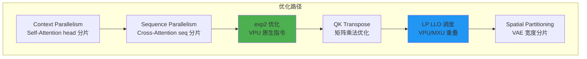

希望本文档能为从事 TPU 大模型优化的工程师提供有价值的参考。