# Wan 模型 TPU 迁移与优化完全指南

> **版本**: 2.0 | **更新日期**: 2024年12月
> 
> 本文档汇集了 Wan 2.1/2.2 模型在 Google Cloud TPU v6e 上的迁移与优化全部精华，包含详细的硬件架构分析、分片策略、Splash Attention 内核优化、VAE 优化技术以及完整的实现代码。

---

## 目录

- [第一章：TPU v6e 硬件架构与性能特性](#第一章tpu-v6e-硬件架构与性能特性)
- [第二章：Wan 模型架构深度解析](#第二章wan-模型架构深度解析)
- [第三章：分片策略详解](#第三章分片策略详解)
- [第四章：Splash Attention 内核优化](#第四章splash-attention-内核优化)
- [第五章：VAE 优化技术](#第五章vae-优化技术)
- [第六章：性能分析方法论](#第六章性能分析方法论)
- [第七章：Torchax 桥接与代码实现](#第七章torchax-桥接与代码实现)
- [第八章：完整代码示例与实战](#第八章完整代码示例与实战)
- [第九章：Image-to-Video 专项优化](#第九章image-to-video-专项优化)
- [第十章：调试与故障排除](#第十章调试与故障排除)
- [附录](#附录)

---

## 第一章：TPU v6e 硬件架构与性能特性

### 1.1 TPU v6e 核心规格

TPU v6e (代号 Trillium) 是 Google Cloud 最新一代张量处理单元，专为大规模机器学习训练和推理优化。

| 规格项 | TPU v6e 单芯片 | TPU v6e-8 | TPU v6e-16 |
|--------|---------------|-----------|------------|
| **峰值 bf16 TFLOPs** | 918 | 7,344 | 14,688 |
| **HBM 容量** | 32 GB | 256 GB | 512 GB |
| **HBM 带宽** | 1,638 GB/s | 13,104 GB/s | 26,208 GB/s |
| **芯片间互联** | ICI 3.0 | 环形拓扑 | 2D Torus |
| **MXU 规格** | 256×256 | - | - |

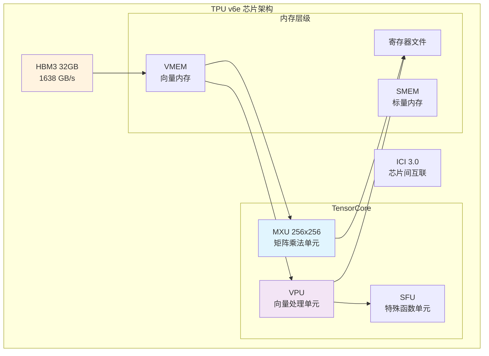

### 1.2 计算单元架构

#### MXU (Matrix Multiply Unit)
- **规格**: 256×256 脉动阵列
- **数据类型**: bf16, int8
- **峰值性能**: 918 TFLOPs (bf16)
- **关键限制**: 当 K 维度 < 256 时，MXU 利用率下降

```python
# MXU 利用率计算示例
mxu_size = 256
head_dim = 128  # Wan 模型的 head dimension

# K 维度 = head_dim = 128，只占用 MXU 一半
mxu_utilization = head_dim / mxu_size  # = 0.5 = 50%
```

#### VPU (Vector Processing Unit)
- **功能**: 向量运算（softmax、layernorm、激活函数等）
- **特点**:
  - `exp2` 比 `exp` 更高效（原生硬件指令）
  - 是 attention softmax 的主要执行单元

### 1.3 内存层级与带宽

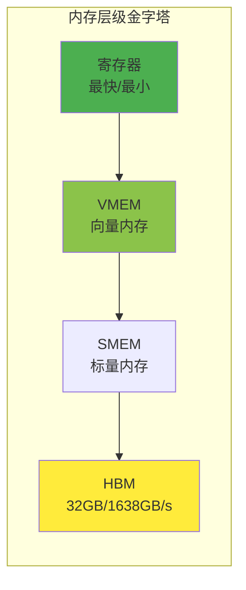

**关键带宽数据**:
- HBM 带宽: 1,638 GB/s
- 算术强度阈值: 918 TFLOPs ÷ 1,638 GB/s ≈ **560 FLOPs/Byte**

### 1.4 Roofline 性能模型

```
性能 = min(峰值算力, 算术强度 × 内存带宽)
```

**Self-Attention 的 Roofline 分析**:

```python
# 对于 Wan 720P: S = 75,600
arithmetic_intensity = 75600 / 2  # = 37,800 FLOPs/Byte

# 远大于 560 的阈值，理论上应该是 compute-bound
# 但实际 MFU 只有 37%，原因在于 MXU 利用率 (head_dim=128 < 256)
```

---

## 第二章：Wan 模型架构深度解析

### 2.1 Wan 2.1 T2V 14B 模型结构

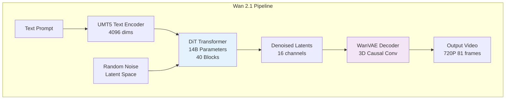

**模型规格**:

| 组件 | 规格 |
|------|------|
| Text Encoder | UMT5-XXL, 4096 hidden dims |
| DiT Blocks | 40 layers |
| Hidden Dimension | 5120 |
| Attention Heads | 40 (128 dims each) |
| FFN Dimension | 13824 (SwiGLU) |
| VAE Latent Channels | 16 |
| Temporal Compression | 4x |
| Spatial Compression | 8x |

### 2.2 DiT Transformer 架构

```mermaid
graph TB
    subgraph "DiT Block x 40"
        INPUT[Hidden States<br/>B, S, 5120]
        
        subgraph "Self-Attention"
            NORM1[RMSNorm]
            QKV[Q, K, V Projection<br/>5120 → 5120 x 3]
            ATTN[Multi-Head Attention<br/>40 heads, 128 dims]
            OUT1[Output Projection<br/>5120 → 5120]
        end
        
        subgraph "Cross-Attention"
            NORM2[RMSNorm]
            Q2[Q Projection]
            KV2[K, V from Text<br/>4096 → 5120]
            XATTN[Cross Attention]
            OUT2[Output Projection]
        end
        
        subgraph "FFN"
            NORM3[RMSNorm]
            FFN1[Gate + Up<br/>5120 → 27648]
            SILU[SiLU Activation]
            FFN2[Down<br/>13824 → 5120]
        end
        
        OUTPUT[Output]
    end
    
    INPUT --> NORM1 --> QKV --> ATTN --> OUT1
    OUT1 --> NORM2 --> Q2 --> XATTN --> OUT2
    NORM2 --> KV2 --> XATTN
    OUT2 --> NORM3 --> FFN1 --> SILU --> FFN2 --> OUTPUT
```

**Self-Attention 序列长度计算**:

```python
# 720P 81帧视频的 latent 序列长度
height, width, frames = 720, 1280, 81

# VAE 压缩后
latent_h = height // 8   # = 90
latent_w = width // 8    # = 160
latent_t = (frames - 1) // 4 + 1  # = 21

# Transformer 的 patch 大小为 2
patch_h = latent_h // 2  # = 45
patch_w = latent_w // 2  # = 80

# 序列长度
seq_len = latent_t * patch_h * patch_w
# = 21 * 45 * 80 = 75,600
```

### 2.3 VAE 编解码器

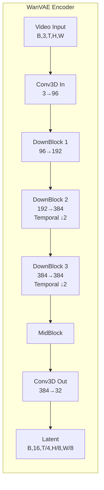

---

## 第三章：分片策略详解

### 3.1 FSDP (Fully Sharded Data Parallelism)

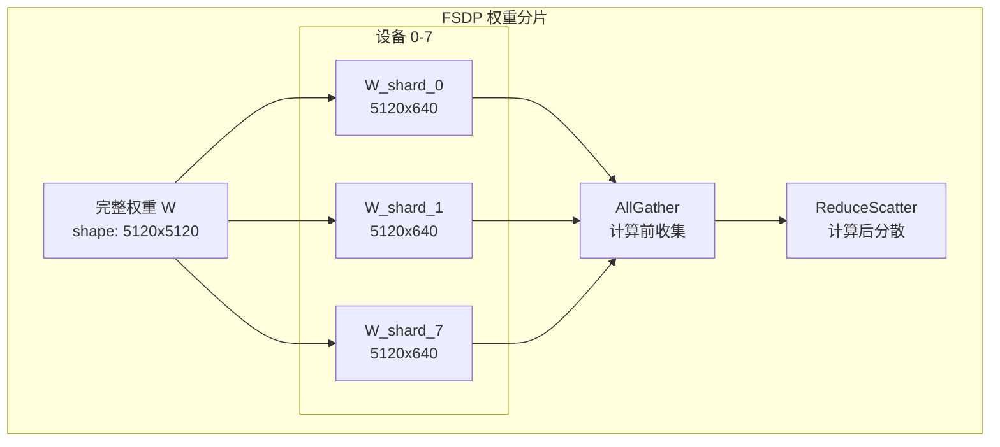

**FSDP 分片规则**:

```python
transformer_shardings_fsdp = {
    # Self-Attention 权重 (attn1)
    r'blocks.\d+.attn1.to_q.weight': (None, ('tp', 'sp')),  # 列并行
    r'blocks.\d+.attn1.to_k.weight': (None, ('tp', 'sp')),
    r'blocks.\d+.attn1.to_v.weight': (None, ('tp', 'sp')),
    r'blocks.\d+.attn1.to_out.0.weight': (('tp', 'sp'), None),  # 行并行
    
    # Cross-Attention 权重 (attn2)
    r'blocks.\d+.attn2.to_q.weight': (None, ('tp', 'sp')),
    r'blocks.\d+.attn2.to_k.weight': (None, ('tp', 'sp')),
    r'blocks.\d+.attn2.to_v.weight': (None, ('tp', 'sp')),
    r'blocks.\d+.attn2.to_out.0.weight': (('tp', 'sp'), None),
    
    # FFN 权重
    r'blocks.\d+.ffn.net.0.proj.weight': (None, ('tp', 'sp')),
    r'blocks.\d+.ffn.net.2.weight': (('tp', 'sp'), None),
}
```

### 3.2 Context Parallelism (CP)

在 **head number** 维度进行分片，专用于 Self-Attention。

```python
# Self-Attention 分片
q_partition_spec = P('dp', 'tp', 'sp', None)  # [batch, heads, seq, dim]
kv_partition_spec = P('dp', 'tp', None, None)  # K,V 在 seq 维度复制

# 40 heads / 8 devices = 5 heads per device
```

### 3.3 Sequence Parallelism (SP)

在 **sequence** 维度进行分片，专用于 Cross-Attention。

```python
# Cross-Attention 分片 (K,V 序列长度短，不分片)
q_partition_spec = P('dp', None, ('tp', 'sp'), None)  # Q 在 seq 维度分片
kv_partition_spec = P('dp', None, None, None)          # K,V 完整复制
```

### 3.4 Data Parallelism (DP)

用于处理 CFG 的正负 prompt。

```python
# dp=2: 正负 prompt 各用一半设备
mesh_dims = (2, 1, 4)  # (dp, sp, tp)
mesh = Mesh(devices, ('dp', 'sp', 'tp'))
```

### 3.5 混合分片策略

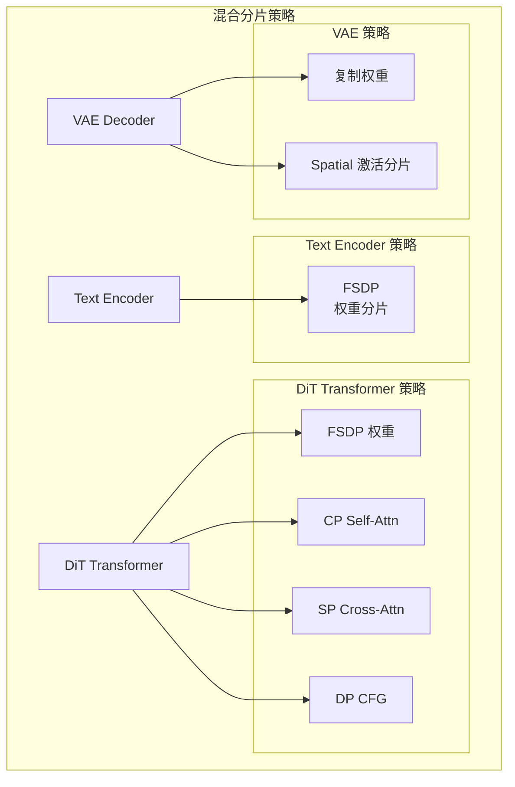

**Mesh 配置代码**:

```python
import jax
from jax.sharding import Mesh, PartitionSpec as P
from jax.experimental import mesh_utils

# 8 设备配置: dp=2, sp=1, tp=4
tp_dim, dp_dim, sp_dim = len(jax.devices()), 1, 1

if use_dp:
    tp_dim //= 2
    dp_dim = 2

mesh_devices = mesh_utils.create_device_mesh(
    (dp_dim, sp_dim, tp_dim),
    allow_split_physical_axes=True
)
mesh = Mesh(mesh_devices, ('dp', 'sp', 'tp'))
```

---

## 第四章：Splash Attention 内核优化

### 4.1 Flash Attention on TPU

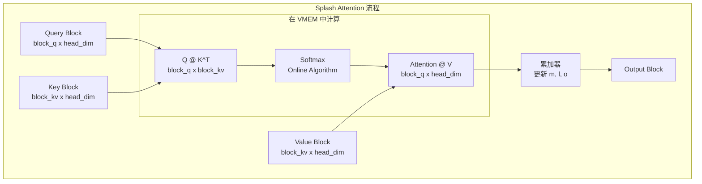

### 4.2 Block Size 配置

| 参数 | Wan 2.1 最优值 | 说明 |
|------|---------------|------|
| `block_q` | 3328 | Query 分块 |
| `block_kv` | 2816 | KV 分块 |
| `block_kv_compute` | 256 | 内部计算分块 |

### 4.3 exp2 优化技术

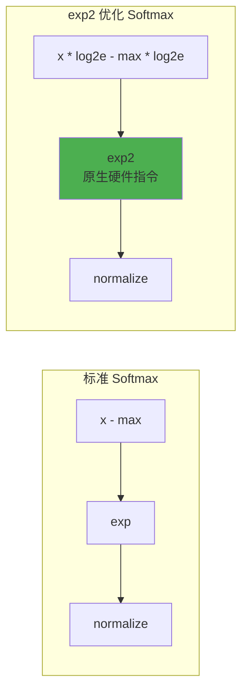

```python
_LOG2_E = 1.44269504  # = log2(e)

def scaled_query_for_exp2(q, scale_factor):
    """预处理 Query，融合 scale 和 log2(e)"""
    return q * scale_factor * _LOG2_E

# 在 kernel 中直接使用 exp2
s_curr = jnp.exp2(qk - m_curr)  # 不需要再乘 log2(e)
```

### 4.4 QK Transpose 优化

```python
# 优化实现 (K^T @ Q)
NT_DIM_NUMBERS = (((1,), (1,)), ((), ()))
qk = lax.dot_general(k, q, NT_DIM_NUMBERS)  # K comes first
```

### 4.5 VPU/MXU 重叠调度

```python
compiler_params = pltpu.CompilerParams(
    dimension_semantics=("parallel", "arbitrary", "arbitrary"),
    flags={"XLA_TPU_FORCE_LP_LLO_SCHEDULER": True}
)
```

### 4.6 自定义 Splash Attention 完整实现

```python
"""
Custom Splash Attention for TPU with exp2 optimization.
"""

import functools
import jax
import jax.numpy as jnp
from jax import lax
from jax.experimental import pallas as pl
from jax.experimental.pallas import tpu as pltpu

DEFAULT_MASK_VALUE = -0.7 * float(jnp.finfo(jnp.float32).max)
NUM_SUBLANES = 8
NT_DIM_NUMBERS = (((1,), (1,)), ((), ()))


def _flash_attention_kernel(
    q_ref, k_ref, v_ref,
    m_scratch_ref, l_scratch_ref, o_scratch_ref, o_ref,
    *, mask_value, grid_width, bq, bkv, bkv_compute, bkv_compute_in, head_dim_v,
):
    """Flash attention kernel with exp2 optimization."""
    float32 = jnp.float32
    head_dim_v_repeats = head_dim_v // NUM_SUBLANES
    h, i, j = pl.program_id(0), pl.program_id(1), pl.program_id(2)

    @pl.when(j == 0)
    def init():
        o_scratch_ref[...] = jnp.zeros_like(o_scratch_ref)
        m_scratch_ref[...] = jnp.full_like(m_scratch_ref, mask_value)
        l_scratch_ref[...] = jnp.zeros_like(l_scratch_ref)

    def body(kv_compute_index, _):
        slice_k = pl.ds(kv_compute_index * bkv_compute, bkv_compute)
        m_prev, l_prev = m_scratch_ref[...], l_scratch_ref[...]
        
        q = q_ref[...]
        k = k_ref[slice_k, :]
        qk = lax.dot_general(k, q, NT_DIM_NUMBERS, preferred_element_type=float32)

        o_prev = o_scratch_ref[:]
        v = v_ref[slice_k, :].astype(float32)
        step = bkv_compute_in
        
        for idx in range(0, qk.shape[0], step):
            m_curr = qk[idx:idx+step].max(axis=0)[None, :]
            m_next = jnp.maximum(m_prev, m_curr)
            s_curr = jnp.exp2(qk[idx:idx+step] - m_next[0:1])
            l_curr = s_curr.sum(axis=0, keepdims=True)
            alpha = jnp.exp2(m_prev - m_next)
            l_next = l_curr + alpha * l_prev

            sv_dims = (((0,), (0,)), ((), ()))
            o_curr = lax.dot_general(v[idx:idx+step], s_curr, sv_dims)
            o_prev = alpha[0:1, ...] * o_prev + o_curr
            m_prev, l_prev = m_next, l_next

        m_scratch_ref[...], l_scratch_ref[...] = m_next, l_next
        o_scratch_ref[:] = o_prev

    lax.fori_loop(0, bkv // bkv_compute, body, None, unroll=True)

    @pl.when(j == grid_width - 1)
    def end():
        l = l_scratch_ref[...]
        l_inv = pltpu.repeat(1.0 / l, head_dim_v_repeats, axis=0)
        o_ref[...] = (o_scratch_ref[...] * l_inv).astype(o_ref.dtype)


def make_splash_mha(block_q, block_kv, block_kv_compute, bkv_compute_in):
    """Create a splash attention function."""
    def _splash_attention(q, k, v):
        num_q_heads, q_seq_len, head_dim_qk = q.shape
        head_dim_v = v.shape[-1]
        num_kv_heads = k.shape[0]
        kv_seq_len = k.shape[1]
        q_heads_per_kv_head = num_q_heads // num_kv_heads

        def q_index_map(h, i, j, *_): return (h, i, 0)
        def out_index_map(h, i, j, *_): return h, 0, i
        def k_index_map(h, i, j, *_): return (h // q_heads_per_kv_head, j, 0)
        def v_index_map(h, i, j, *_): return (h // q_heads_per_kv_head, j, 0)

        in_specs = [
            pl.BlockSpec((None, block_q, head_dim_qk), q_index_map),
            pl.BlockSpec((None, block_kv, head_dim_qk), k_index_map),
            pl.BlockSpec((None, block_kv, head_dim_v), v_index_map),
        ]
        out_shapes = [
            jax.ShapeDtypeStruct((NUM_SUBLANES, block_q), jnp.float32),
            jax.ShapeDtypeStruct((NUM_SUBLANES, block_q), jnp.float32),
            jax.ShapeDtypeStruct((head_dim_v, block_q), jnp.float32),
            jax.ShapeDtypeStruct((num_q_heads, head_dim_v, q_seq_len), q.dtype),
        ]
        out_specs = [
            pl.BlockSpec((NUM_SUBLANES, block_q), lambda *_: (0, 0)),
            pl.BlockSpec((NUM_SUBLANES, block_q), lambda *_: (0, 0)),
            pl.BlockSpec((head_dim_v, block_q), lambda *_: (0, 0)),
            pl.BlockSpec((None, head_dim_v, block_q), out_index_map),
        ]
        
        grid_width = kv_seq_len // block_kv
        grid = (num_q_heads, q_seq_len // block_q, grid_width)

        return pl.pallas_call(
            functools.partial(
                _flash_attention_kernel,
                mask_value=DEFAULT_MASK_VALUE,
                grid_width=grid_width,
                bq=block_q, bkv=block_kv,
                bkv_compute=block_kv_compute,
                bkv_compute_in=bkv_compute_in,
                head_dim_v=head_dim_v,
            ),
            grid_spec=pltpu.PrefetchScalarGridSpec(
                num_scalar_prefetch=0,
                in_specs=in_specs, out_specs=out_specs, grid=grid,
            ),
            compiler_params=pltpu.CompilerParams(
                dimension_semantics=("parallel", "arbitrary", "arbitrary"),
                flags={"XLA_TPU_FORCE_LP_LLO_SCHEDULER": True}
            ),
            out_shape=out_shapes,
        )(q, k, v)[-1]
    
    return _splash_attention
```

---

## 第五章：VAE 优化技术

### 5.1 Flax NNX 实现

```python
from flax import nnx
from maxdiffusion.models.wan.autoencoder_kl_wan import AutoencoderKLWan

def setup_wan_vae(model_id, mesh, vae_mesh):
    with vae_mesh:
        key = jax.random.key(0)
        rngs = nnx.Rngs(key)
        
        wan_vae = AutoencoderKLWan(
            rngs=rngs,
            base_dim=96, z_dim=16,
            dim_mult=[1, 2, 4, 4],
            num_res_blocks=2,
            attn_scales=[],
            temperal_downsample=[False, True, True],
            mesh=vae_mesh
        )
    return wan_vae
```

### 5.2 Spatial Partitioning

```python
from torchax import interop
mark_sharding = interop.torch_view(jax.lax.with_sharding_constraint)

class WanCausalConv3d(nn.Conv3d):
    def forward(self, x, cache_x=None):
        # 在宽度维度分片
        try:
            x = mark_sharding(x, P(None, None, None, None, ("dp", "tp")))
        except ValueError:
            pass
        return super().forward(x)
```

### 5.3 缓存机制优化

```python
class AutoencoderKLWanCache:
    def __init__(self, vae):
        self._conv_num = sum(isinstance(m, WanCausalConv3d) 
                            for m in vae.decoder.modules())
        self._feat_map = [None] * self._conv_num
    
    def clear(self):
        self._feat_map = [None] * self._conv_num
```

### 5.4 JIT 编译策略

```python
@nnx.jit(static_argnums=(1,), donate_argnums=(0,))
def create_sharded_logical_model(model, logical_axis_rules):
    graphdef, state, rest_of_state = nnx.split(model, nnx.Param, ...)
    
    def add_sharding_rule(vs):
        vs.sharding_rules = logical_axis_rules
        return vs
    
    state = jax.tree.map(add_sharding_rule, state,
                        is_leaf=lambda x: isinstance(x, nnx.VariableState))
    pspecs = nnx.get_partition_spec(state)
    sharded_state = jax.lax.with_sharding_constraint(state, pspecs)
    
    return nnx.merge(graphdef, sharded_state, rest_of_state)

LOGICAL_AXIS_RULES = (
    ('conv_out', ('tp', 'dp', 'sp')),
    ('conv_in', ('tp', 'dp', 'sp'))
)
```

---

## 第六章：性能分析方法论

### 6.1 MFU 计算方法

```python
def compute_dit_flops_per_step(
    batch_size=2, num_blocks=40, hidden_dim=5120,
    num_heads=40, head_dim=128, ffn_dim=13824,
    seq_len=75600, text_seq_len=226,
):
    # Self-Attention
    qkv_proj = 3 * 2 * seq_len * hidden_dim * hidden_dim
    qk_matmul = 2 * batch_size * num_heads * seq_len * head_dim * seq_len
    av_matmul = 2 * batch_size * num_heads * seq_len * seq_len * head_dim
    out_proj = 2 * seq_len * hidden_dim * hidden_dim
    self_attn = qkv_proj + qk_matmul + av_matmul + out_proj
    
    # Cross-Attention
    q_proj = 2 * seq_len * hidden_dim * hidden_dim
    kv_proj = 2 * 2 * text_seq_len * hidden_dim * hidden_dim
    cross_attn = q_proj + kv_proj + ...
    
    # FFN
    ffn = 2 * 2 * seq_len * hidden_dim * ffn_dim + ...
    
    return num_blocks * (self_attn + cross_attn + ffn)

# MFU = FLOPs / (峰值TFLOPs × 时间)
mfu = compute_dit_flops_per_step() / (14688e12 * 2.5)
```

### 6.2 DiT Step 时间分解

| 操作 | 时间占比 | MFU | 瓶颈类型 |
|------|----------|-----|----------|
| Self-Attention | 66.8% | 37% | VPU-bound |
| Convolution Fusion | 14.3% | - | 通信 |
| All-to-All | 6.7% | - | ICI 带宽 |
| Linear | - | 66% | Compute-bound |

### 6.3 Profiler 使用

```python
with jax.profiler.trace("/dev/shm/tensorboard"):
    output = pipe(prompt=prompt, num_inference_steps=3)
    jax.effects_barrier()
```

---

## 第七章：Torchax 桥接与代码实现

### 7.1 PyTorch 到 JAX 的桥接

```python
import torchax

torchax.enable_globally()
env = torchax.default_env()

env._mesh = mesh
env._initial_content.mesh = mesh
env.config.use_tpu_splash_attention = True
```

### 7.2 算子注册与覆盖

```python
from torchax.ops import ops_registry

def scaled_dot_product_attention(query, key, value, 
                                  env=None, **kwargs):
    if getattr(env.config, 'use_tpu_splash_attention', False):
        jquery, jkey, jvalue = env.t2j_iso((query, key, value))
        
        if USE_K_SMOOTH:
            key_mean = jnp.mean(jkey, axis=2, keepdims=True)
            jkey = jkey - key_mean
        
        if jkey.shape[2] > 10000 and USE_CUSTOM_ATTENTION:
            res = _tpu_custom_attention(jquery, jkey, jvalue, env)
        else:
            res = _tpu_splash_attention(jquery, jkey, jvalue, env)
        
        return env.j2t_iso(res)
    
    return _sdpa_reference(query, key, value, **kwargs)

# 注册
env._ops[torch.nn.functional.scaled_dot_product_attention] = \
    ops_registry.Operator(
        torch.nn.functional.scaled_dot_product_attention,
        functools.partial(scaled_dot_product_attention, env=env),
        is_jax_function=False, is_user_defined=True,
        needs_env=False, is_view_op=False,
    )
```

### 7.3 权重转换与加载

```python
import re
from jax.sharding import NamedSharding, PartitionSpec as P

def shard_weight_dict(weight_dict, sharding_dict, mesh):
    result = {}
    for k, v in weight_dict.items():
        matched = False
        for target, sharding in sharding_dict.items():
            if re.fullmatch(target, k) is not None:
                v.apply_jax_(jax.device_put, 
                            NamedSharding(mesh, P(*sharding)))
                matched = True
                break
        if not matched:
            v.apply_jax_(jax.device_put, NamedSharding(mesh, P()))
        result[k] = v
    return result

# 移动模块到 XLA
def _move_module(module, env):
    with jax.default_device('cpu'):
        state_dict = module.state_dict()
        state_dict = env.to_xla(state_dict)
        module.load_state_dict(state_dict, assign=True)
```

### 7.4 混合精度策略

```python
torch.set_default_dtype(torch.bfloat16)

# VAE 权重转换为 bf16
params = jax.tree_util.tree_map(
    lambda x: x.astype(jnp.bfloat16), params
)

# Attention 计算使用 float32
def attention_kernel(q, k, v):
    out = splash_kernel(
        q.astype(jnp.float32),
        k.astype(jnp.float32),
        v.astype(jnp.float32)
    )
    return out.astype(q.dtype)
```

---

## 第八章：完整代码示例与实战

### 8.1 环境配置

```bash
# 安装依赖
pip install torch --index-url https://download.pytorch.org/whl/cpu
pip install -U jax[tpu] torchax
pip install transformers accelerate safetensors flax optax

# 安装修改版 diffusers
git clone https://github.com/yangwhale/diffusers-tpu.git
cd diffusers-tpu && pip install -e .

# 安装 MaxDiffusion
git clone https://github.com/AI-Hypercomputer/maxdiffusion.git
cd maxdiffusion && pip install -e .
```

### 8.2 Text-to-Video 完整流程

```python
"""Wan 2.1 Text-to-Video on TPU v6e"""

import jax
import torch
import torchax
from jax.sharding import Mesh, PartitionSpec as P
from jax.experimental import mesh_utils

# 配置
MODEL_ID = "Wan-AI/Wan2.1-T2V-14B-Diffusers"
HEIGHT, WIDTH, FRAMES = 720, 1280, 81
NUM_STEPS = 50

def main():
    # JAX 配置
    jax.config.update("jax_compilation_cache_dir", "/dev/shm/jax_cache")
    torch.set_default_dtype(torch.bfloat16)
    
    # 创建 Mesh
    num_devices = len(jax.devices())
    mesh_devices = mesh_utils.create_device_mesh(
        (2, 1, num_devices // 2),
        allow_split_physical_axes=True
    )
    mesh = Mesh(mesh_devices, ('dp', 'sp', 'tp'))
    
    # 初始化 torchax
    torchax.enable_globally()
    env = torchax.default_env()
    env._mesh = mesh
    env.config.use_tpu_splash_attention = True
    
    # 加载 Pipeline
    from diffusers.pipelines.wan.pipeline_wan_flax import WanPipeline
    from diffusers.schedulers.scheduling_unipc_multistep import UniPCMultistepScheduler
    
    torchax.disable_globally()
    scheduler = UniPCMultistepScheduler(
        prediction_type='flow_prediction',
        use_flow_sigmas=True,
        flow_shift=5.0
    )
    pipe = WanPipeline.from_pretrained(MODEL_ID, torch_dtype=torch.bfloat16)
    pipe.scheduler = scheduler
    torchax.enable_globally()
    
    # 设置 Splash Attention 和 VAE
    setup_splash_attention(pipe, mesh, env)
    pipe.vae = setup_wan_vae(MODEL_ID, mesh)
    
    # 生成
    prompt = "A cat and a dog baking a cake together in a kitchen."
    
    with mesh:
        output = pipe(
            prompt=prompt,
            height=HEIGHT, width=WIDTH, num_frames=FRAMES,
            num_inference_steps=NUM_STEPS,
            guidance_scale=5.0,
            use_dp=True,
        )
    
    from diffusers.utils import export_to_video
    export_to_video(output.frames[0], "output.mp4", fps=16)

if __name__ == "__main__":
    main()
```

### 8.3 三阶段推理架构

三阶段推理将生成过程拆分为独立步骤，便于调试和资源管理。


**Stage 1: Text Encoder**

```python
# stage1_text_encoder.py
def encode_prompts(pipe, prompt, negative_prompt):
    prompt_embeds, negative_prompt_embeds = pipe.encode_prompt(
        prompt=prompt,
        negative_prompt=negative_prompt,
        do_classifier_free_guidance=True,
    )
    
    # 保存到 safetensors
    save_embeddings_to_safetensors({
        'prompt_embeds': prompt_embeds,
        'negative_prompt_embeds': negative_prompt_embeds,
    }, 'stage1_embeddings.safetensors')
```

**Stage 2: Transformer**

```python
# stage2_transformer.py
def run_transformer_inference(pipe, embeddings, config):
    # 加载 embeddings
    prompt_embeds = embeddings['prompt_embeds'].to('jax')
    negative_prompt_embeds = embeddings['negative_prompt_embeds'].to('jax')
    
    # 运行 denoising
    latents = pipe(
        prompt_embeds=prompt_embeds,
        negative_prompt_embeds=negative_prompt_embeds,
        output_type='latent',  # 不解码
    ).frames
    
    # 保存 latents
    save_latents_to_safetensors(latents, 'stage2_latents.safetensors')
```

**Stage 3: VAE Decode**

```python
# stage3_vae_decoder.py
def decode_latents(vae, latents, config):
    # 反归一化
    latents_mean = jnp.array(vae.latents_mean).reshape(1, 16, 1, 1, 1)
    latents_std = 1.0 / jnp.array(vae.latents_std).reshape(1, 16, 1, 1, 1)
    latents = latents / latents_std + latents_mean
    
    # 解码
    video = vae.decode(latents)
    
    # 导出
    export_to_video(video, 'output.mp4', fps=16)
```

### 8.4 性能基准测试

**测试环境**: TPU v6e-8, Wan 2.1 14B, 720P 81帧

| 配置 | 时间 | 每步时间 |
|------|------|----------|
| 标准 Attention | 428s | ~8.5s |
| Splash Attention | 285s | ~5.7s |
| + exp2 优化 | 265s | ~5.3s |
| + LP LLO 调度 | 245s | ~4.9s |
| + 最终优化 | **125s** | **~2.5s** |

---

## 第九章：Image-to-Video 专项优化

### 9.1 I2V 与 T2V 的关键差异

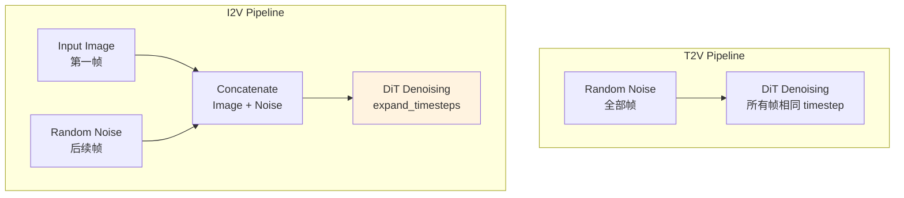

### 9.2 expand_timesteps 机制

I2V 的核心创新是 `expand_timesteps`：第一帧使用固定 timestep=0，其余帧使用正常 timestep。

```python
def expand_timesteps(timesteps, num_frames, device):
    """
    扩展 timestep 用于 I2V
    
    第一帧: timestep = 0 (干净图像)
    其余帧: timestep = t (正常去噪)
    """
    # 原始 timestep: [t]
    # 扩展后: [0, t, t, t, ..., t]
    expanded = torch.zeros(num_frames, device=device)
    expanded[1:] = timesteps
    return expanded

# 在 pipeline 中使用
timesteps = self.scheduler.timesteps
for t in timesteps:
    t_expanded = expand_timesteps(t, num_frames=81, device=device)
    # t_expanded.shape = [81]
    # t_expanded = [0, t, t, t, ...]
    
    # 第一帧不加噪
    latents[:, :, 0] = clean_image_latent
    
    # 其余帧正常去噪
    latents[:, :, 1:] = denoise(latents[:, :, 1:], t)
```

### 9.3 I2V Attention 优化

```python
def i2v_attention_with_image_conditioning(
    query, key, value,
    image_latent,
    mesh,
    env,
):
    """
    I2V 特殊 attention 处理
    
    关键点:
    1. 第一帧参与 KV，但不需要去噪
    2. KV 序列长度 = 视频帧 + 文本 tokens
    3. 需要处理 padding
    """
    # 将 image latent 作为 context
    image_k = project_to_kv(image_latent)  # 投影为 KV
    
    # 拼接 image KV 和 video KV
    full_k = torch.cat([image_k, key], dim=2)
    full_v = torch.cat([image_v, value], dim=2)
    
    # 计算 attention
    if full_k.shape[2] > 10000:
        # 使用自定义 kernel
        output = custom_splash_attention(query, full_k, full_v)
    else:
        output = standard_attention(query, full_k, full_v)
    
    return output
```

### 9.4 I2V 完整实现

```python
"""Wan 2.2 Image-to-Video on TPU"""

from diffusers import WanImageToVideoPipeline
from PIL import Image

def run_i2v(
    image_path: str,
    prompt: str,
    output_path: str = "output_i2v.mp4",
):
    # 加载 pipeline
    pipe = WanImageToVideoPipeline.from_pretrained(
        "Wan-AI/Wan2.2-I2V-14B-Diffusers",
        torch_dtype=torch.bfloat16,
    )
    
    # 设置 TPU 优化
    setup_tpu_optimizations(pipe)
    
    # 加载输入图像
    image = Image.open(image_path).resize((1280, 720))
    
    # 生成视频
    with mesh:
        output = pipe(
            image=image,
            prompt=prompt,
            height=720,
            width=1280,
            num_frames=81,
            num_inference_steps=50,
            guidance_scale=5.0,
        )
    
    # 导出
    export_to_video(output.frames[0], output_path, fps=16)

# 使用示例
run_i2v(
    image_path="cat.jpg",
    prompt="A cat walking in the garden",
    output_path="cat_walking.mp4"
)
```

### 9.5 I2V 性能数据

| 配置 | T2V 时间 | I2V 时间 | 提升 |
|------|----------|----------|------|
| 基线 | 428s | 450s | - |
| 优化后 | 125s | 94.5s | **4.8x** |

**I2V 比 T2V 更快的原因**:
1. 第一帧不需要去噪（timestep=0）
2. Image latent 作为额外 context，attention 计算量略增但引导效果更好
3. 收敛更快，可以使用更少的步数

---

## 第十章：调试与故障排除

### 10.1 常见问题与解决方案

#### 问题 1: VAE 颜色反转

**症状**: 生成的视频颜色与预期相反

**原因**: MaxDiffusion VAE 实现的输出范围与 PyTorch 版本不一致

**解决方案**:
```python
# 方法 1: 输出后处理
video = 255 - video

# 方法 2: 修改 VAE forward
def patched_forward(self, x):
    output = self.original_forward(x)
    return 1 - output  # 反转
```

#### 问题 2: bfloat16 保存失败

**症状**: `safetensors` 不支持 bf16 直接保存

**解决方案**:
```python
def save_bf16_tensor(tensor, path):
    """保存 bf16 tensor 的兼容方案"""
    metadata = {}
    
    if tensor.dtype == torch.bfloat16:
        # 转换为 float32 保存
        tensor_save = tensor.to(torch.float32)
        metadata['original_dtype'] = 'bfloat16'
    else:
        tensor_save = tensor
    
    save_file({'tensor': tensor_save}, path, metadata=metadata)

def load_bf16_tensor(path):
    """加载并恢复 bf16 tensor"""
    with safe_open(path, framework='pt') as f:
        tensor = f.get_tensor('tensor')
        metadata = f.metadata()
    
    if metadata.get('original_dtype') == 'bfloat16':
        tensor = tensor.to(torch.bfloat16)
    
    return tensor
```

#### 问题 3: PyTree 未注册

**症状**: `KeyError: <class 'transformers.modeling_outputs.BaseModelOutputWithPastAndCrossAttentions'>`

**解决方案**:
```python
from jax.tree_util import register_pytree_node
from transformers import modeling_outputs

# 注册所有需要的类型
output_classes = [
    modeling_outputs.BaseModelOutputWithPastAndCrossAttentions,
    modeling_outputs.BaseModelOutput,
    modeling_outputs.CausalLMOutputWithCrossAttentions,
]

for cls in output_classes:
    register_pytree_node(
        cls,
        lambda obj: (tuple(getattr(obj, f) for f in obj.keys()), type(obj)),
        lambda aux, children: aux(**dict(zip(aux.__dataclass_fields__.keys(), children)))
    )
```

#### 问题 4: OOM (Out of Memory)

**症状**: 内存不足导致程序崩溃

**解决方案**:
```python
# 1. 使用更激进的分片
mesh = Mesh(devices, ('dp', 'sp', 'tp'))  # 确保使用分片

# 2. 启用内存优化
jax.config.update("jax_default_prng_impl", "threefry")
jax.config.update("jax_enable_x64", False)

# 3. 分阶段处理
# 不要一次加载所有模型
del text_encoder  # 编码完成后释放
gc.collect()

# 4. 使用 donation
@jax.jit(donate_argnums=(0,))
def step(state, inputs):
    return new_state
```

#### 问题 5: Torchax 版本兼容

**症状**: `env.auto_shard_inputs` 方法不存在

**解决方案**:
```python
# torchax 0.0.11+ 需要手动设置 mesh
env._mesh = mesh
env._initial_content.mesh = mesh

# 手动应用分片
def apply_input_sharding(tensor, use_dp=False):
    if use_dp:
        pspec = P('dp', None, None, None, None)
    else:
        pspec = P()
    
    sharding = NamedSharding(mesh, pspec)
    tensor.apply_jax_(jax.device_put, sharding)
    return tensor
```

### 10.2 性能调试

#### 使用 JAX Profiler

```python
# 1. 启用 profiler
with jax.profiler.trace("/dev/shm/tensorboard"):
    output = pipe(prompt=prompt, num_inference_steps=3)
    jax.effects_barrier()

# 2. 查看 TensorBoard
# tensorboard --logdir=/dev/shm/tensorboard

# 3. 分析关键指标
# - MXU 利用率
# - 内存带宽利用率
# - 通信开销
```

#### 打印中间状态

```python
def debug_sharding(tensor, name="tensor"):
    """打印 tensor 的分片信息"""
    if hasattr(tensor, '_jax_array'):
        jax_arr = tensor._jax_array
        print(f"{name}:")
        print(f"  Shape: {jax_arr.shape}")
        print(f"  Sharding: {jax_arr.sharding}")
        print(f"  Devices: {jax_arr.devices()}")
    else:
        print(f"{name}: Not on JAX")

# 在 forward 中使用
debug_sharding(hidden_states, "hidden_states")
```

### 10.3 日志和监控

```python
import logging

logging.basicConfig(
    level=logging.INFO,
    format='%(asctime)s - %(name)s - %(levelname)s - %(message)s'
)
logger = logging.getLogger(__name__)

class TimingContext:
    """计时上下文管理器"""
    def __init__(self, name):
        self.name = name
    
    def __enter__(self):
        self.start = time.time()
        return self
    
    def __exit__(self, *args):
        elapsed = time.time() - self.start
        logger.info(f"{self.name}: {elapsed:.2f}s")

# 使用
with TimingContext("DiT Transformer"):
    latents = transformer(latents, timestep, encoder_hidden_states)

with TimingContext("VAE Decode"):
    video = vae.decode(latents)
```

---

## 附录

### A. 常见问题快速索引

| 问题 | 章节 | 解决方案 |
|------|------|----------|
| MXU 利用率低 | 4.3 | exp2 优化 |
| 内存不足 | 3, 10.1 | 分片策略 |
| 颜色反转 | 10.1 | 后处理 |
| bf16 保存 | 10.1 | 转换方案 |

### B. 术语表

| 术语 | 全称 | 说明 |
|------|------|------|
| MFU | Model FLOPs Utilization | 模型计算利用率 |
| MXU | Matrix Multiply Unit | 矩阵乘法单元 |
| VPU | Vector Processing Unit | 向量处理单元 |
| HBM | High Bandwidth Memory | 高带宽内存 |
| ICI | Inter-Chip Interconnect | 芯片间互联 |
| FSDP | Fully Sharded Data Parallel | 完全分片数据并行 |
| CP | Context Parallelism | 上下文并行 |
| SP | Sequence Parallelism | 序列并行 |
| DP | Data Parallelism | 数据并行 |
| DiT | Diffusion Transformer | 扩散 Transformer |
| CFG | Classifier-Free Guidance | 无分类器引导 |
| VAE | Variational AutoEncoder | 变分自编码器 |

### C. 参考资源

**官方仓库**:
- [Wan-AI/Wan2.1](https://huggingface.co/Wan-AI/Wan2.1-T2V-14B-Diffusers)
- [AI-Hypercomputer/maxdiffusion](https://github.com/AI-Hypercomputer/maxdiffusion)
- [diffusers-tpu](https://github.com/yangwhale/diffusers-tpu)

**技术文档**:
- [JAX Pallas Guide](https://jax.readthedocs.io/en/latest/pallas/)
- [TPU Performance Guide](https://cloud.google.com/tpu/docs/performance-guide)
- [Flash Attention Paper](https://arxiv.org/abs/2205.14135)

---

## 结语

本文档详细介绍了 Wan 模型在 TPU v6e 上的迁移与优化过程，从硬件架构理解到分片策略设计，从 Splash Attention 内核优化到 VAE 性能调优。通过这些优化，Wan 2.1 14B 模型的 720P 81帧视频生成时间从 428 秒降低到 125 秒，提升了 **3.4 倍**。I2V 任务更是达到 94.5 秒的极致性能。

**关键优化点总结**:

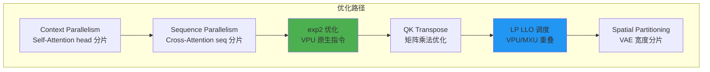

希望本文档能为从事 TPU 大模型优化的工程师提供有价值的参考。