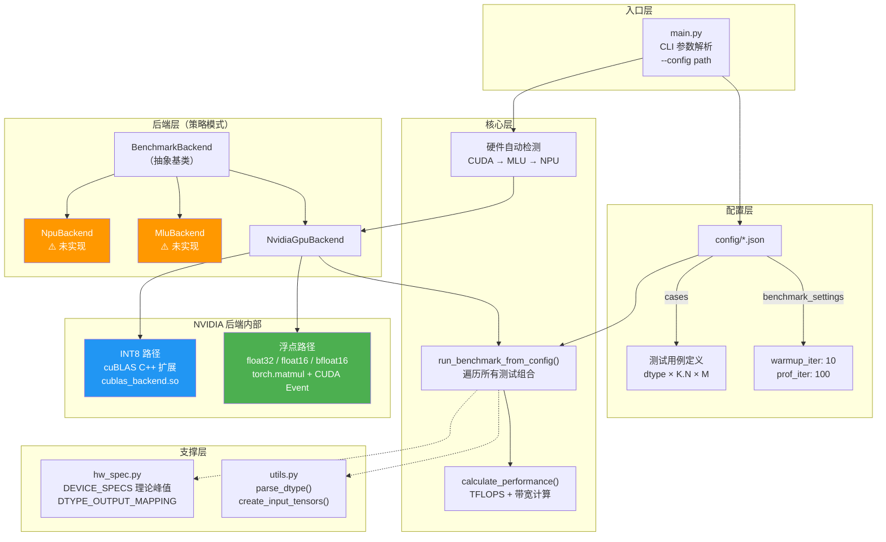
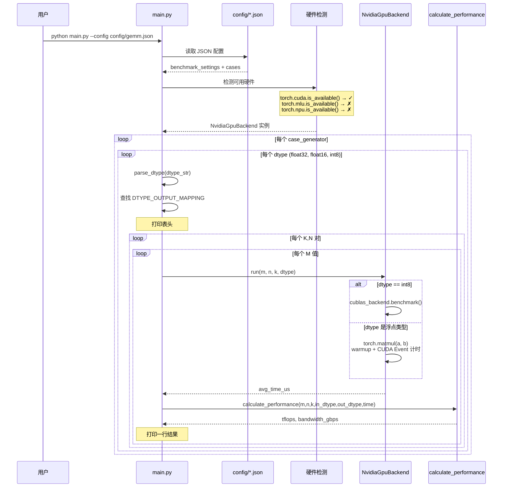
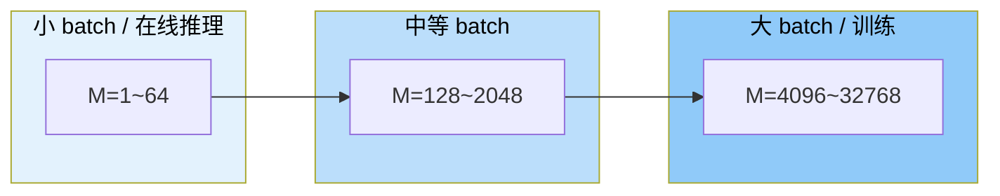
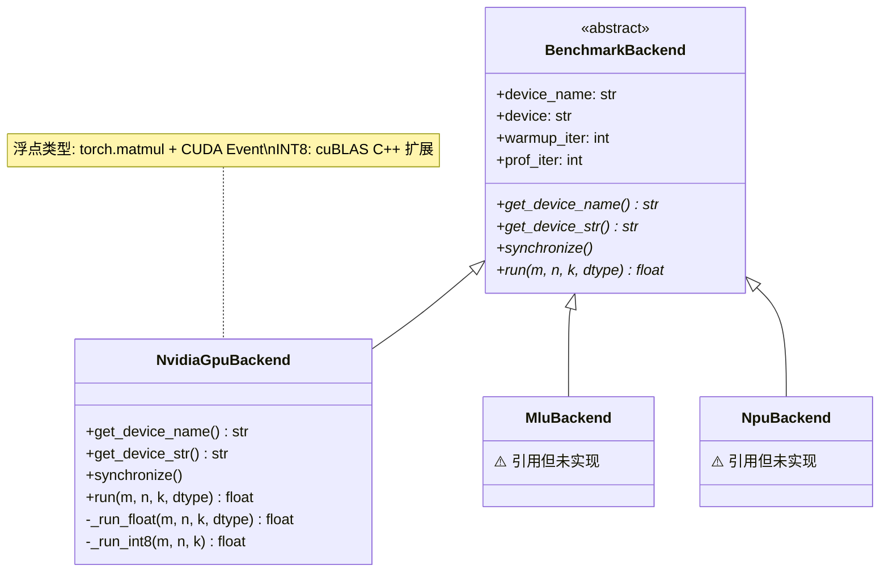
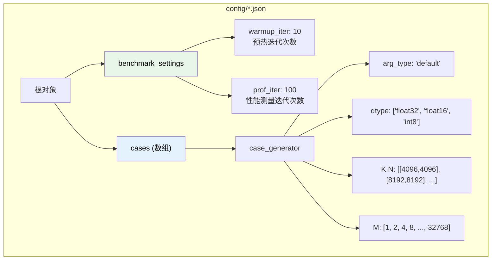

# GEMM Benchmark 代码设计分析

> 本文档梳理 `chay_gemm_benchmark_simple` 的代码设计逻辑、测试内容和输出报告格式。

---

## 1. 整体架构



---

## 2. 模块职责说明

### 2.1 文件结构

```
chay_gemm_benchmark_simple/
├── main.py              # 程序入口
├── backends.py          # 后端抽象 + NVIDIA 实现
├── hw_spec.py           # 硬件规格定义
├── utils.py             # 工具函数
├── config/
│   ├── gemm.json        # 完整测试配置
│   └── simple.json      # 简化测试配置
└── backends/
    └── nv_gpu_cublas/   # cuBLAS C++ 扩展
        ├── cublas_gemm.cu
        ├── pybind_wrapper.cpp
        ├── CMakeLists.txt
        └── build.sh
```

### 2.2 各模块详解

| 模块 | 职责 | 关键函数/类 |
|------|------|-------------|
| **main.py** | CLI 入口，读取配置，检测硬件，启动测试 | `main()`, `run_benchmark_from_config()`, `calculate_performance()` |
| **backends.py** | 定义后端抽象接口，实现 NVIDIA GPU 后端 | `BenchmarkBackend`(ABC), `NvidiaGpuBackend` |
| **hw_spec.py** | 定义硬件理论峰值和数据类型映射 | `DEVICE_SPECS`, `DTYPE_OUTPUT_MAPPING` |
| **utils.py** | 数据类型字符串解析、输入张量创建 | `parse_dtype()`, `create_input_tensors()` |

---

## 3. 执行流程



---

## 4. 测试用例设计

### 4.1 数据类型覆盖

| 数据类型 | 字节数 | 输出类型 | 执行路径 | 应用场景 |
|----------|--------|----------|----------|----------|
| `float32` | 4B | float32 | torch.matmul | 训练精度基线 |
| `float16` | 2B | float16 | torch.matmul | 推理常用精度 |
| `bfloat16` | 2B | bfloat16 | torch.matmul | 训练混合精度 |
| `int8` | 1B | int32 (4B) | cuBLAS C++ | 量化推理 |

### 4.2 矩阵维度选择（gemm.json）

GEMM 操作: **C(M×N) = A(M×K) × B(K×N)**

#### M 值设计（53 个值）

M 代表 **batch size / sequence length**，覆盖从极小到超大的范围：

```
细粒度区间（1-2048）：步长 128
  1, 2, 4, 8, 16, 32, 64, 128, 256, 384, 512, ..., 2048

粗粒度区间（2048-4096）：步长 128
  2176, 2304, ..., 4096

大规模区间（4096-32768）：步长 2048
  8192, 10240, ..., 32768
```



#### K.N 对设计（11 对）

K 和 N 代表**模型权重矩阵的维度**，对应 LLM 中典型的层参数：

| K | N | 可能对应的 LLM 层 |
|---|---|-------------------|
| 4096 | 4096 | 标准隐藏层（如 LLaMA-7B hidden_dim） |
| 8192 | 8192 | 大模型隐藏层（如 LLaMA-70B hidden_dim） |
| 8192 | 1024 | 投影/降维层 |
| 1024 | 8192 | 投影/升维层 |
| 576 | 7168 | MoE 专家网络 |
| 7168 | 2112 | MoE 专家网络输出 |
| 1536 | 24576 | FFN 上投影（hidden→4×hidden） |
| 512 | 32768 | 词表投影（hidden→vocab） |
| 16384 | 7168 | 大 FFN 中间层 |
| 7168 | 4096 | FFN 下投影 |
| 2048 | 7168 | Attention QKV 投影 |

### 4.3 测试规模

- **完整测试** (gemm.json): 53 M × 11 K.N × 3 dtype = **1,749 个测试点**
- **简化测试** (simple.json): 1 M × 2 K.N × 3 dtype = **6 个测试点**

---

## 5. 性能计算公式

### 5.1 TFLOPS（算力利用率）

```
FLOPS = 2 × M × N × K
TFLOPS = FLOPS / 1e12 / time_seconds
```

> **为什么是 2×M×N×K？** 矩阵乘法 C=A×B 中，计算 C 的每个元素需要 K 次乘法和 K-1 次加法，总共约 2K 次浮点操作。C 有 M×N 个元素，所以总计 2×M×N×K 次。

### 5.2 Bandwidth（带宽利用率）

```
bytes_A = M × K × sizeof(input_dtype)
bytes_B = K × N × sizeof(input_dtype)
bytes_C = M × N × sizeof(output_dtype)    ← 注意：输出类型可能不同

total_bytes = bytes_A + bytes_B + bytes_C
bandwidth_GB/s = total_bytes / 1e9 / time_seconds
```

> **关键设计：输入输出类型分离。** 对于 int8 GEMM，输入 A 和 B 各 1 字节/元素，但输出 C 是 int32 即 4 字节/元素。这直接影响带宽计算的准确性。

### 5.3 MFU 计算（代码中未实现，但有基础设施）

`hw_spec.py` 中定义了理论峰值 `DEVICE_SPECS`，可用于计算 MFU：

```
MFU = 实测 TFLOPS / 理论峰值 TFLOPS × 100%

例如 H20 float16:
  MFU = 实测 TFLOPS / 147 × 100%
```

---

## 6. 输出报告格式

### 6.1 控制台输出

程序按 **dtype → K.N 对 → M 值** 的层次打印结果：

```
检测到 NVIDIA CUDA 环境，将使用 CUDA 后端。
使用设备: NVIDIA H20 (后端: NvidiaGpuBackend)

测试数据类型: input:float16 ----> output:torch.float16
       M |        N |        K |  Time (us) |     TFLOPS |    GB/s
----------------------------------------------------------------------
       1 |     4096 |     4096 |       5.23 |       6.42 |    12.84
       2 |     4096 |     4096 |       5.45 |      12.31 |    24.62
      64 |     4096 |     4096 |      12.87 |     166.68 |   333.37
     ...
   32768 |     4096 |     4096 |    8234.12 |     133.45 |   266.91

测试数据类型: input:int8 ----> output:torch.int32
       M |        N |        K |  Time (us) |     TFLOPS |    GB/s
----------------------------------------------------------------------
      64 |     4096 |     4096 |       8.21 |     257.82 |   193.37
     ...
```

### 6.2 输出字段说明

| 字段 | 单位 | 含义 |
|------|------|------|
| M | - | 矩阵 A 的行数（batch 维度） |
| N | - | 矩阵 B 的列数（输出维度） |
| K | - | 内积维度（缩减维度） |
| Time (us) | 微秒 | 单次 GEMM 的平均执行时间 |
| TFLOPS | TFLOPS | 实测算力 |
| GB/s | GB/s | 实测内存带宽 |

---

## 7. 后端抽象设计



### 后端接口契约

任何新后端只需实现 4 个方法：

```python
class NewBackend(BenchmarkBackend):
    def get_device_name(self) -> str:   # 返回设备名称，如 "TPU v7"
    def get_device_str(self) -> str:    # 返回设备标识，如 "tpu"
    def synchronize(self):              # 设备同步
    def run(self, m, n, k, dtype) -> float:  # 返回 avg_time_us
```

---

## 8. 配置文件格式



### 配置字段说明

| 字段 | 类型 | 说明 |
|------|------|------|
| `benchmark_settings.warmup_iter` | int | GPU 预热迭代次数，避免冷启动影响 |
| `benchmark_settings.prof_iter` | int | 实际测量迭代次数，取平均值 |
| `cases[].dtype` | string[] | 测试的数据类型列表 |
| `cases[].K.N` | int[][] | [K, N] 对的列表，代表权重矩阵维度 |
| `cases[].M` | int[] | M 值列表，代表 batch/sequence 维度 |

---

## 9. 总结与扩展方向

### 当前能力

- ✅ NVIDIA GPU (CUDA) 上的 GEMM 性能测试
- ✅ 支持 float32 / float16 / bfloat16 / int8
- ✅ 覆盖 LLM 推理中典型的矩阵维度
- ✅ 可扩展的后端抽象设计

### 扩展方向

- ⬜ 添加 TPU v7 后端（基于 JAX/XLA）
- ⬜ 添加 MFU 计算（理论峰值已在 hw_spec.py 中定义）
- ⬜ 添加 CSV/JSON 结果输出（当前仅控制台打印）
- ⬜ 添加 Cambricon MLU / Ascend NPU 后端
- ⬜ 添加 bfloat16 和 fp8 到 gemm.json 配置
