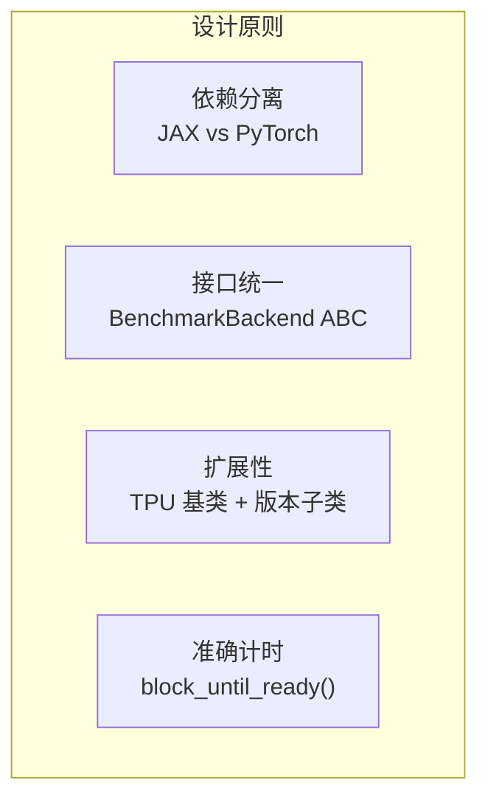
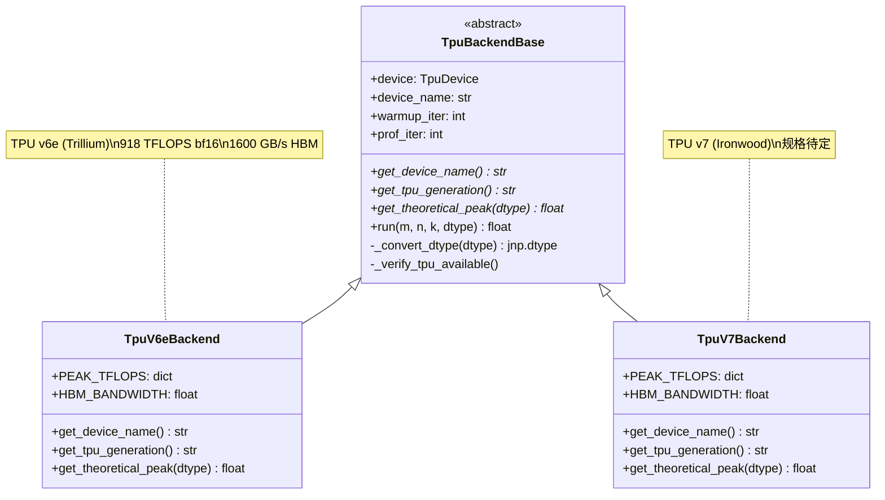
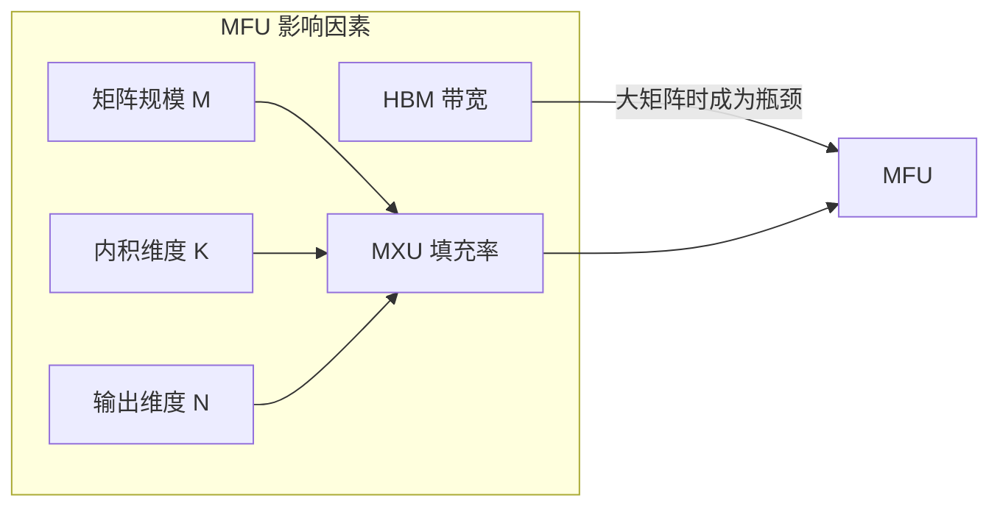

# TPU GEMM Benchmark 后端实现报告

> 日期: 2026-02-09
> 作者: Claude Code
> 目标: 为 GEMM benchmark 添加 TPU v6e 后端，设计通用架构支持 v7

---

## 1. 项目概述

### 1.1 背景

`chay_gemm_benchmark_simple` 是一个 GEMM (通用矩阵乘法) 性能基准测试工具，原本只支持 NVIDIA GPU。本次任务是添加 Google TPU 支持，首先实现 TPU v6e (Trillium) 后端，并设计可扩展的架构以便未来添加 TPU v7 (Ironwood) 支持。

### 1.2 目标

1. ✅ 实现 TPU v6e 后端
2. ✅ 设计通用 TPU 后端架构
3. ✅ 通过测试验证并修复 bug
4. ✅ 生成性能测试报告
5. ✅ 创建 chip-performance-test skill

---

## 2. 技术架构

### 2.1 设计原则



| 原则 | 实现方式 | 原因 |
|------|----------|------|
| **依赖分离** | 创建独立的 `tpu_backends.py` 和 `main_tpu.py` | JAX 和 PyTorch 混合导入会产生冲突 |
| **接口统一** | TPU 后端遵循相同的抽象接口 | 便于切换和对比不同硬件 |
| **扩展性** | `TpuBackendBase` 基类 + `TpuV6eBackend`/`TpuV7Backend` 子类 | 新增 TPU 版本只需实现规格定义 |
| **准确计时** | 使用 `jax.block_until_ready()` | JAX 异步调度，必须等待完成 |

### 2.2 文件结构

```
chay_gemm_benchmark_simple/
├── main.py              # GPU 入口 (PyTorch)
├── main_tpu.py          # TPU 入口 (JAX)
├── auto_benchmark.py    # 自动化测试脚本
├── backends.py          # GPU 后端抽象
├── hw_spec.py           # 硬件规格定义
├── utils.py             # GPU 工具函数
├── backends/
│   ├── __init__.py
│   ├── tpu/
│   │   ├── __init__.py
│   │   └── tpu_backends.py  # TPU 后端实现
│   └── nv_gpu_cublas/       # NVIDIA cuBLAS 扩展
├── config/
│   ├── gemm.json        # GPU 完整配置
│   ├── simple.json      # GPU 简化配置
│   ├── tpu_gemm.json    # TPU 完整配置
│   ├── tpu_simple.json  # TPU 简化配置
│   └── tpu_full.json    # TPU 中等配置
└── results_v6e.csv      # v6e 测试结果
```

### 2.3 类图



---

## 3. 实现细节

### 3.1 核心 GEMM Kernel

```python
@partial(jax.jit, static_argnums=(3,))
def _gemm_kernel(a: jnp.ndarray, b: jnp.ndarray, key: jax.random.PRNGKey,
                 output_dtype: jnp.dtype) -> jnp.ndarray:
    """JIT-compiled GEMM kernel using jax.lax.dot_general."""
    dimension_numbers = (((1,), (0,)), ((), ()))
    result = lax.dot_general(
        a, b,
        dimension_numbers=dimension_numbers,
        preferred_element_type=output_dtype,
    )
    return result
```

**设计要点：**
- 使用 `@jax.jit` 确保编译到 XLA
- `static_argnums=(3,)` 将 output_dtype 作为编译时常量
- `preferred_element_type` 控制累加器精度（int8→int32）

### 3.2 计时机制

```python
# Warmup (includes JIT compilation)
for _ in range(self.warmup_iter):
    result = _gemm_kernel(a, b, subkey, output_dtype)
    result.block_until_ready()

# Profiling with accurate timing
start_time = time.perf_counter()
for _ in range(self.prof_iter):
    result = _gemm_kernel(a, b, subkey, output_dtype)
    result.block_until_ready()  # CRITICAL: wait for TPU
end_time = time.perf_counter()
```

**关键点：**
1. **Warmup 阶段**: 首次调用触发 JIT 编译，必须预热
2. **block_until_ready()**: JAX 异步调度，不等待会只测到 dispatch 时间
3. **time.perf_counter()**: 高精度计时器

### 3.3 数据类型处理

| 输入类型 | 输出类型 | 计算路径 | 说明 |
|----------|----------|----------|------|
| bfloat16 | bfloat16 | MXU 原生 | TPU 原生精度 |
| float16 | float16 | MXU 原生 | 与 bf16 同等性能 |
| float32 | float32 | bf16 计算 + fp32 累加 | MXU 内部转换 |
| int8 | int32 | MXU 原生 | 2x bf16 吞吐量 |

---

## 4. 问题与解决

### 4.1 float32 MFU 超过 100%

**现象：** 初次测试 float32 显示 129.9% MFU

**原因：** 错误估计 float32 理论峰值为 459 TFLOPS（bf16 的一半）

**实际情况：** TPU MXU 使用 bf16 计算 + fp32 累加，float32 实际吞吐量接近 bf16

**解决方案：** 修正 float32 理论峰值为 918 TFLOPS

```python
# 修正前
PEAK_TFLOPS = {
    "float32": 459.0,  # 错误！
    ...
}

# 修正后
PEAK_TFLOPS = {
    "float32": 918.0,  # 正确：使用 bf16 计算路径
    ...
}
```

### 4.2 TPU 版本检测

**现象：** JAX 设备名格式不标准 (`tpu_0(process=0,(0,0,0,0))`)

**解决方案：** 实现模糊匹配 + 默认回退

```python
def detect_tpu_backend(...):
    device_str = str(device).lower()

    if 'v7' in device_str or 'ironwood' in device_str:
        return TpuV7Backend(...)

    # Default to v6e for current generation
    return TpuV6eBackend(...)
```

---

## 5. 测试结果

### 5.1 测试环境

| 项目 | 值 |
|------|-----|
| 硬件 | Google TPU v6e (8 cores) |
| JAX 版本 | 0.8.1 |
| 测试日期 | 2026-02-09 |
| Warmup | 10 iterations |
| Profiling | 100 iterations |

### 5.2 性能摘要

| 数据类型 | 理论峰值 | 最高实测 | 最高 MFU | 平均 MFU |
|----------|----------|----------|----------|----------|
| **bfloat16** | 918 TFLOPS | 689 TFLOPS | **75.0%** | 36.2% |
| **float32** | 918 TFLOPS | 583 TFLOPS | 63.5% | 28.5% |
| **int8** | 1836 TOPS | 1129 TOPS | 61.5% | 24.8% |

### 5.3 MFU vs M 值趋势

```
bfloat16 (K=8192, N=8192):

M=128:   ████ 8.8%
M=256:   ████████ 17.7%
M=512:   ████████████████ 32.8%
M=1024:  █████████████████████████ 50.2%
M=2048:  █████████████████████████████████ 65.0%
M=4096:  █████████████████████████████████████ 75.0%
M=8192:  ████████████████████████████████████ 72.8%
```

**观察：**
- M 从 128 增加到 4096，MFU 从 9% 提升到 75%
- M=8192 时 MFU 略有下降（72.8%），可能是 HBM 带宽瓶颈

### 5.4 最佳性能点

| 数据类型 | M | K | N | TFLOPS | MFU |
|----------|---|---|---|--------|-----|
| bfloat16 | 4096 | 8192 | 8192 | 689 | 75.0% |
| float32 | 2048 | 8192 | 8192 | 583 | 63.5% |
| int8 | 8192 | 8192 | 8192 | 1129 | 61.5% |

---

## 6. 性能分析

### 6.1 MFU 影响因素



### 6.2 小 Batch 低效原因

TPU MXU 尺寸为 256×256，每个周期执行 65,536 次 MAC 运算。当 M=128 时：

- 矩阵行数不足以填满 MXU
- 需要 padding 到 256 的倍数
- 有效计算占比低

**建议：** 对于 TPU，使用 M ≥ 512 以获得合理效率

### 6.3 float32 大矩阵性能下降

| M | K | N | bfloat16 MFU | float32 MFU | 差距 |
|---|---|---|--------------|-------------|------|
| 2048 | 8192 | 8192 | 65.0% | 63.5% | 1.5% |
| 4096 | 8192 | 8192 | 75.0% | 38.9% | **36.1%** |
| 8192 | 8192 | 8192 | 72.8% | 39.3% | **33.5%** |

**原因分析：**
- float32 输出需要 4 字节/元素，bf16 只需 2 字节
- 大矩阵时 HBM 带宽成为瓶颈
- float32 的带宽需求是 bf16 的 1.5x（考虑输入输出）

---

## 7. 使用说明

### 7.1 运行 TPU 基准测试

```bash
# 简化测试（快速验证）
python main_tpu.py --config config/tpu_simple.json

# 完整测试（收集数据）
python main_tpu.py --config config/tpu_gemm.json --output results.csv

# 自定义参数
python main_tpu.py --config config/tpu_full.json --warmup 20 --prof-iter 200
```

### 7.2 配置文件格式

```json
{
    "benchmark_settings": {
        "warmup_iter": 10,
        "prof_iter": 100
    },
    "cases": [
        {
            "dtype": ["bfloat16", "float32", "int8"],
            "K.N": [[4096, 4096], [8192, 8192]],
            "M": [128, 512, 2048, 8192]
        }
    ]
}
```

### 7.3 添加新 TPU 版本

1. 在 `backends/tpu/tpu_backends.py` 中创建新类：

```python
class TpuV7Backend(TpuBackendBase):
    PEAK_TFLOPS = {
        "bfloat16": 2000.0,  # 更新为实际规格
        ...
    }
    HBM_BANDWIDTH = 3200.0

    def get_device_name(self) -> str:
        return "Google TPU v7 (Ironwood)"

    def get_tpu_generation(self) -> str:
        return "v7"
```

2. 更新 `detect_tpu_backend()` 中的检测逻辑

3. 更新 `hw_spec.py` 中的 `DEVICE_SPECS`

---

## 8. 后续工作

### 8.1 完成状态

- [x] 创建 `chip-performance-test` skill
- [ ] TPU v7 实际规格更新（待硬件可用）
- [ ] 多 TPU 设备并行测试
- [ ] 性能数据可视化工具

### 8.2 优化方向

- 添加更多数据类型支持（fp8）
- 实现多设备 GEMM 测试
- 添加 Tensor Core 占用率监控
- 集成 JAX profiler 进行深度分析

---

## 9. 参考资料

1. [TPU v6e Documentation](https://docs.cloud.google.com/tpu/docs/v6e) - Google Cloud
2. [Introducing Trillium TPU](https://cloud.google.com/blog/products/compute/introducing-trillium-6th-gen-tpus) - Google Cloud Blog
3. [JAX JIT Compilation](https://docs.jax.dev/en/latest/jit-compilation.html) - JAX Documentation
4. [How to Profile TPU Programs](https://jax-ml.github.io/scaling-book/profiling/) - JAX Scaling Book

---

*Report generated by Claude Code on 2026-02-09*
