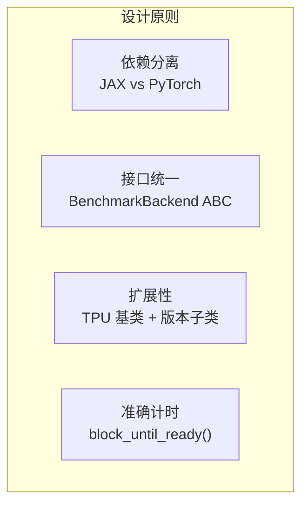
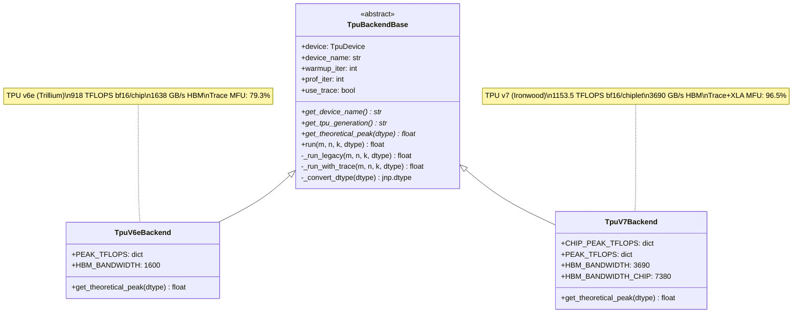
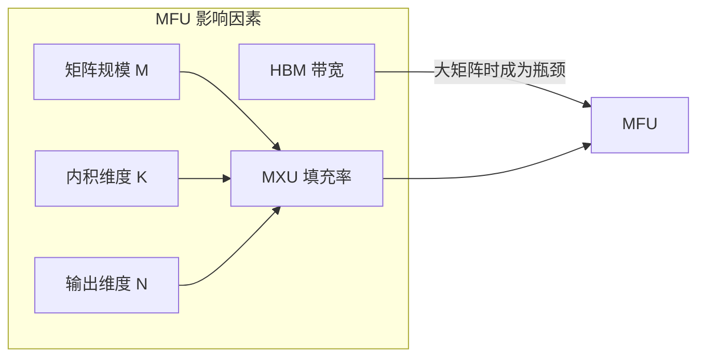

# TPU GEMM Benchmark 后端实现报告

> 创建日期: 2026-02-09
> 更新日期: 2026-02-11
> 作者: Claude Code
> 目标: 为 GEMM benchmark 添加 TPU v6e/v7 后端，支持 trace-based timing

---

## 1. 项目概述

### 1.1 背景

`chay_gemm_benchmark_simple` 是一个 GEMM (通用矩阵乘法) 性能基准测试工具，原本只支持 NVIDIA GPU。本次任务是添加 Google TPU 支持，首先实现 TPU v6e (Trillium) 后端，并设计可扩展的架构以便未来添加 TPU v7 (Ironwood) 支持。

### 1.2 目标

1. ✅ 实现 TPU v6e 后端 (2026-02-09)
2. ✅ 设计通用 TPU 后端架构 (2026-02-09)
3. ✅ 通过测试验证并修复 bug (2026-02-09)
4. ✅ 实现 TPU v7 (Ironwood) 后端 — dual-chiplet 架构 (2026-02-10)
5. ✅ 实现 trace-based timing — 从 JAX profiler 提取纯设备时间 (2026-02-11)
6. ✅ v7 XLA 优化验证 — DVFS p_state=7 达到 95.7% MFU (2026-02-11)
7. ✅ 创建 chip-performance-test skill

---

## 2. 技术架构

### 2.1 设计原则



| 原则 | 实现方式 | 原因 |
|------|----------|------|
| **依赖分离** | 创建独立的 `tpu_backends.py` 和 `main_tpu.py` | JAX 和 PyTorch 混合导入会产生冲突 |
| **接口统一** | TPU 后端遵循相同的抽象接口 | 便于切换和对比不同硬件 |
| **扩展性** | `TpuBackendBase` 基类 + `TpuV6eBackend`/`TpuV7Backend` 子类 | 新增 TPU 版本只需实现规格定义 |
| **准确计时** | Legacy: `block_until_ready()` / Trace: `device_duration_ps` | JAX 异步调度，trace 模式排除 host 开销 |

### 2.2 文件结构

```
chay_gemm_benchmark_simple/
├── main.py              # GPU 入口 (PyTorch)
├── main_tpu.py          # TPU 入口 (JAX) — 支持 --no-trace 切换计时模式
├── auto_benchmark.py    # 自动化测试脚本
├── backends.py          # GPU 后端抽象
├── hw_spec.py           # 硬件规格定义
├── utils.py             # GPU 工具函数
├── backends/
│   ├── __init__.py
│   ├── tpu/
│   │   ├── __init__.py
│   │   ├── tpu_backends.py   # TPU 后端实现 (v6e/v7, legacy+trace timing)
│   │   └── trace_utils.py    # Trace-based timing 工具 (提取 device_duration_ps)
│   └── nv_gpu_cublas/        # NVIDIA cuBLAS 扩展
├── config/
│   ├── gemm.json             # GPU 完整配置
│   ├── simple.json           # GPU 简化配置
│   ├── tpu_gemm.json         # TPU 完整配置
│   ├── tpu_simple.json       # TPU 简化配置
│   ├── tpu_full.json         # TPU 中等配置
│   ├── tpu_trace_test.json   # Trace 模式快速验证 (8192³)
│   ├── tpu_large_matrix.json # 大矩阵测试 (16384×18432)
│   └── tpu_matrix_scaling.json # 矩阵规模扩展测试
├── results_v6e.csv           # v6e 测试结果 (legacy timing)
├── results_v7.csv            # v7 测试结果 (legacy timing)
└── results_v7_trace.csv      # v7 测试结果 (trace + XLA flags)
```

### 2.3 类图



---

## 3. 实现细节

### 3.1 核心 GEMM Kernel

```python
@partial(jax.jit, static_argnums=(3,))
def _gemm_kernel(a: jnp.ndarray, b: jnp.ndarray, key: jax.random.PRNGKey,
                 output_dtype: jnp.dtype) -> jnp.ndarray:
    """JIT-compiled GEMM kernel using jax.lax.dot_general."""
    dimension_numbers = (((1,), (0,)), ((), ()))
    result = lax.dot_general(
        a, b,
        dimension_numbers=dimension_numbers,
        preferred_element_type=output_dtype,
    )
    return result
```

**设计要点：**
- 使用 `@jax.jit` 确保编译到 XLA
- `static_argnums=(3,)` 将 output_dtype 作为编译时常量
- `preferred_element_type` 控制累加器精度（int8→int32）

### 3.2 计时机制

支持两种计时模式，默认使用 Trace 模式:

#### Legacy 模式 (`--no-trace`)

```python
# Warmup (includes JIT compilation)
for _ in range(self.warmup_iter):
    result = _gemm_kernel(a, b, subkey, output_dtype)
    result.block_until_ready()

# Profiling with accurate timing
start_time = time.perf_counter()
for _ in range(self.prof_iter):
    result = _gemm_kernel(a, b, subkey, output_dtype)
    result.block_until_ready()  # CRITICAL: wait for TPU
end_time = time.perf_counter()
```

- 包含 Python dispatch overhead (~200 μs per call)
- 典型 MFU: v6e 65-75%, v7 65-75%

#### Trace 模式 (默认)

```python
# 使用带 MARKER 的 kernel (MARKER 在 @jit 函数内部)
@partial(jax.jit, static_argnums=(3,))
def _gemm_kernel_with_marker(a, b, key, output_dtype):
    with jax.named_scope("!!MARKER!!"):  # 必须在 jit 内部
        return lax.dot_general(a, b, ...)

# Profiling with trace collection
with jax.profiler.trace(trace_dir):
    for i in range(self.prof_iter):
        with jax.profiler.StepTraceAnnotation("gemm", step_num=i):
            result = _gemm_kernel_with_marker(a, b, subkey, output_dtype)
            result.block_until_ready()

# Extract pure device time from trace
trace = get_trace(trace_dir)
durations_ms = get_metrics_from_trace_marker(trace, "!!MARKER!!")
median_time_us = statistics.median(durations_ms) * 1000
```

- 提取 `device_duration_ps` — 纯 TPU 设备执行时间
- 排除 Python dispatch、JAX async dispatch 等 host 端开销
- 典型 MFU: v6e ~79%, v7 93-96% (需 XLA flags)

**两种模式对比 (v7, M=8192, K=N=8192, BF16):**

| 模式 | 时间 (μs) | TFLOPS | MFU |
|------|-----------|--------|------|
| Legacy | 1449.9 | 758.3 | 65.7% |
| Trace (无 XLA flags) | 1248.6 | 880.6 | 76.3% |
| Trace + XLA flags | 1016.8 | 1081.3 | 93.7% |

### 3.3 数据类型处理

| 输入类型 | 输出类型 | 计算路径 | 说明 |
|----------|----------|----------|------|
| bfloat16 | bfloat16 | MXU 原生 | TPU 原生精度 |
| float16 | float16 | MXU 原生 | 与 bf16 同等性能 |
| float32 | float32 | bf16 计算 + fp32 累加 | MXU 内部转换 |
| int8 | int32 | MXU 原生 | 2x bf16 吞吐量 |

---

## 4. 问题与解决

### 4.1 float32 MFU 超过 100%

**现象：** 初次测试 float32 显示 129.9% MFU

**原因：** 错误估计 float32 理论峰值为 459 TFLOPS（bf16 的一半）

**实际情况：** TPU MXU 使用 bf16 计算 + fp32 累加，float32 实际吞吐量接近 bf16

**解决方案：** 修正 float32 理论峰值为 918 TFLOPS

```python
# 修正前
PEAK_TFLOPS = {
    "float32": 459.0,  # 错误！
    ...
}

# 修正后
PEAK_TFLOPS = {
    "float32": 918.0,  # 正确：使用 bf16 计算路径
    ...
}
```

### 4.2 TPU 版本检测

**现象：** JAX 设备名格式不标准 (`tpu_0(process=0,(0,0,0,0))`)

**解决方案：** 多信号检测: `device_kind` + 字符串匹配 + 4D coords

```python
def detect_tpu_backend(warmup_iter, prof_iter, use_trace=True):
    device = jax.devices('tpu')[0]
    device_kind = getattr(device, 'device_kind', '').lower()  # "tpu7x"

    # Strategy 1: device_kind 包含 "tpu7"
    all_info = f"{str(device).lower()} {device_kind}"
    if any(marker in all_info for marker in ['v7', 'ironwood', 'tpu7']):
        return TpuV7Backend(warmup_iter, prof_iter, use_trace)

    # Strategy 2: 4D coords (dual-chiplet)
    coords = getattr(device, 'coords', None)
    if coords is not None and len(coords) == 4:
        return TpuV7Backend(warmup_iter, prof_iter, use_trace)

    # Default to v6e
    return TpuV6eBackend(warmup_iter, prof_iter, use_trace)
```

**实际检测输出 (v7):**
```
[TPU Detection] device_str: tpu_0(process=0,(0,0,0,0))
[TPU Detection] device_kind: tpu7x          ← 关键信号
[TPU Detection] num_devices: 8              ← 4 chips × 2 chiplets
[TPU Detection] Detected TPU v7 (Ironwood)
```

---

## 5. 测试结果

### 5.1 测试环境

| 项目 | v6e 测试 | v7 测试 |
|------|----------|---------|
| 硬件 | Google TPU v6e (Trillium) | Google TPU v7 (Ironwood, TPU7x) |
| 芯片数 | 4 chips, 4 JAX devices | 4 chips, 8 JAX devices (dual-chiplet) |
| 拓扑 | 2x2x1 | 2x2x1 |
| JAX 版本 | 0.8.1 | 0.8.2.dev20251215 |
| 测试日期 | 2026-02-09, 2026-02-11 | 2026-02-10, 2026-02-11 |
| 计时模式 | Legacy + Trace | Legacy + Trace + XLA flags |

### 5.2 性能摘要

#### TPU v7 (Ironwood) — 单 chiplet

| 数据类型 | 理论峰值 | 最高实测 | 最高 MFU | 计时模式 |
|----------|----------|----------|----------|----------|
| **bfloat16** | 1153.5 TFLOPS | **1113.6 TFLOPS** | **96.5%** | Trace + XLA flags |
| bfloat16 | 1153.5 TFLOPS | 880.6 TFLOPS | 76.3% | Trace only |
| bfloat16 | 1153.5 TFLOPS | 758.3 TFLOPS | 65.7% | Legacy |
| float32 | 1153.5 TFLOPS | 670.9 TFLOPS | 58.2% | Legacy |
| int8 | 2307 TOPS | 711.9 TOPS | 30.9% | Legacy |

#### TPU v6e (Trillium) — 单芯片

| 数据类型 | 理论峰值 | 最高实测 | 最高 MFU | 计时模式 |
|----------|----------|----------|----------|----------|
| **bfloat16** | 918 TFLOPS | **728 TFLOPS** | **79.3%** | Trace |
| bfloat16 | 918 TFLOPS | 689 TFLOPS | 75.0% | Legacy |
| float32 | 918 TFLOPS | 583 TFLOPS | 63.5% | Legacy |
| int8 | 1836 TOPS | 1129 TOPS | 61.5% | Legacy |

### 5.3 MFU vs M 值趋势

#### v7 (Trace + XLA flags, K=N=8192, BF16)

```
M=8192:  ████████████████████████████████████████████████████████████████████████████████████████████  93.7%
M=12288: █████████████████████████████████████████████████████████████████████████████████████████████████  95.4%
M=16384: ██████████████████████████████████████████████████████████████████████████████████████████████████  96.5%
```

#### v6e (Legacy, K=8192, N=8192, BF16)

```
M=128:   ████ 8.8%
M=256:   ████████ 17.7%
M=512:   ████████████████ 32.8%
M=1024:  █████████████████████████ 50.2%
M=2048:  █████████████████████████████████ 65.0%
M=4096:  █████████████████████████████████████ 75.0%
M=8192:  ████████████████████████████████████ 72.8%
```

**观察：**
- v7 + Trace + XLA flags: M ≥ 8192 时 MFU 稳定 93-96%，已接近理论上限
- v6e Legacy: M=4096 达到峰值 75%，M=8192 略降至 72.8%
- v6e Trace: 最高 79.3%，受 XLA 对 v6e 编译效率限制

### 5.4 最佳性能点

| TPU | 数据类型 | M | K | N | TFLOPS | MFU | 模式 |
|-----|----------|---|---|---|--------|-----|------|
| **v7** | **bfloat16** | **16384** | **8192** | **8192** | **1113.6** | **96.5%** | **Trace+XLA** |
| v7 | bfloat16 | 8192 | 8192 | 8192 | 1081.3 | 93.7% | Trace+XLA |
| v7 | bfloat16 | 8192 | 8192 | 8192 | 758.3 | 65.7% | Legacy |
| v6e | bfloat16 | 8192 | 8192 | 8192 | 728.0 | 79.3% | Trace |
| v6e | bfloat16 | 4096 | 8192 | 8192 | 689 | 75.0% | Legacy |
| v6e | int8 | 8192 | 8192 | 8192 | 1129 | 61.5% | Legacy |

---

## 6. 性能分析

### 6.1 MFU 影响因素



### 6.2 小 Batch 低效原因

TPU MXU 尺寸为 256×256，每个周期执行 65,536 次 MAC 运算。当 M=128 时：

- 矩阵行数不足以填满 MXU
- 需要 padding 到 256 的倍数
- 有效计算占比低

**建议：** 对于 TPU，使用 M ≥ 512 以获得合理效率

### 6.3 float32 大矩阵性能下降

| M | K | N | bfloat16 MFU | float32 MFU | 差距 |
|---|---|---|--------------|-------------|------|
| 2048 | 8192 | 8192 | 65.0% | 63.5% | 1.5% |
| 4096 | 8192 | 8192 | 75.0% | 38.9% | **36.1%** |
| 8192 | 8192 | 8192 | 72.8% | 39.3% | **33.5%** |

**原因分析：**
- float32 输出需要 4 字节/元素，bf16 只需 2 字节
- 大矩阵时 HBM 带宽成为瓶颈
- float32 的带宽需求是 bf16 的 1.5x（考虑输入输出）

---

## 7. 使用说明

### 7.1 运行 TPU 基准测试

```bash
# 简化测试（快速验证）
python main_tpu.py --config config/tpu_simple.json

# 完整测试（收集数据）
python main_tpu.py --config config/tpu_gemm.json --output results.csv

# 自定义参数
python main_tpu.py --config config/tpu_full.json --warmup 20 --prof-iter 200
```

### 7.2 配置文件格式

```json
{
    "benchmark_settings": {
        "warmup_iter": 10,
        "prof_iter": 100
    },
    "cases": [
        {
            "dtype": ["bfloat16", "float32", "int8"],
            "K.N": [[4096, 4096], [8192, 8192]],
            "M": [128, 512, 2048, 8192]
        }
    ]
}
```

### 7.3 v7 专用 XLA 优化参数

在 v7 上需要设置 `LIBTPU_INIT_ARGS` 以达到最优性能：

```bash
export LIBTPU_INIT_ARGS="\
  --xla_tpu_enable_async_collective_fusion=true \
  --xla_tpu_enable_async_collective_fusion_fuse_all_gather=true \
  --xla_tpu_enable_async_collective_fusion_multiple_steps=true \
  --xla_tpu_overlap_compute_collective_tc=true \
  --xla_enable_async_all_gather=true \
  --xla_enable_async_collective_permute=true \
  --xla_tpu_enable_all_experimental_scheduler_features=true \
  --xla_tpu_scoped_vmem_limit_kib=65536 \
  --xla_tpu_dvfs_p_state=7"
```

`--xla_tpu_dvfs_p_state=7` 是最关键的参数，将 TPU v7 锁定在最高频率运行。

### 7.4 添加新 TPU 版本

1. 在 `backends/tpu/tpu_backends.py` 中创建新类：

```python
class TpuV7Backend(TpuBackendBase):
    # Per-chiplet (JAX device) peak — v7 dual-chiplet
    PEAK_TFLOPS = {
        "bfloat16": 1153.5,  # 2307 per chip / 2 chiplets
        "float32": 1153.5,
        "int8": 2307.0,      # 4614 per chip / 2 chiplets
    }
    HBM_BANDWIDTH = 3690.0   # 7380 per chip / 2 chiplets
```

2. 更新 `detect_tpu_backend()` — 使用 `device_kind` 检测

3. 更新 `hw_spec.py` 中的 `DEVICE_SPECS`

---

## 8. 后续工作

### 8.1 完成状态

- [x] 创建 `chip-performance-test` skill (2026-02-09)
- [x] TPU v7 实际规格更新 — 官方文档 2307 TFLOPS/chip BF16 (2026-02-10)
- [x] Dual-chiplet 架构支持 — per-chiplet 峰值 1153.5 TFLOPS (2026-02-10)
- [x] Trace-based timing — 从 JAX profiler 提取 `device_duration_ps` (2026-02-11)
- [x] v7 XLA 优化参数验证 — DVFS p_state=7 达到 95.7% MFU (2026-02-11)
- [ ] FP8 测试 — v7 原生支持 FP8 (4614 TFLOPS/chip)
- [ ] 多 TPU 设备并行测试 — 跨 chiplet / 跨 chip GEMM
- [ ] 性能数据可视化工具

### 8.2 优化方向

- 添加 FP8 数据类型支持（v7 原生 4614 TFLOPS/chip）
- 实现跨 chiplet GEMM 测试（利用 D2D 互连）
- 实现多芯片 GEMM 测试（pjit/sharding）
- Pallas 自定义 kernel 优化 MFU

---

## 9. 参考资料

1. [TPU v6e Documentation](https://docs.cloud.google.com/tpu/docs/v6e) - Google Cloud
2. [TPU7x (Ironwood) Documentation](https://docs.cloud.google.com/tpu/docs/tpu7x) - Google Cloud (2026-02-09)
3. [Ironwood 发布博客](https://blog.google/innovation-and-ai/infrastructure-and-cloud/google-cloud/ironwood-tpu-age-of-inference/) - Google Blog
4. [JAX JIT Compilation](https://docs.jax.dev/en/latest/jit-compilation.html) - JAX Documentation
5. [How to Profile TPU Programs](https://jax-ml.github.io/scaling-book/profiling/) - JAX Scaling Book
6. [accelerator-microbenchmarks](https://github.com/google/accelerator-microbenchmarks) - Ironwood GEMM benchmarks

---

*Report generated by Claude Code on 2026-02-09*
*Updated: 2026-02-11 — 添加 v7 实测结果 (96.5% MFU), trace timing, XLA 优化参数*
